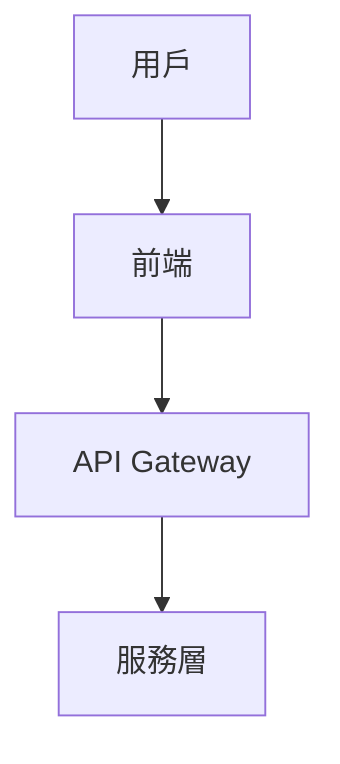
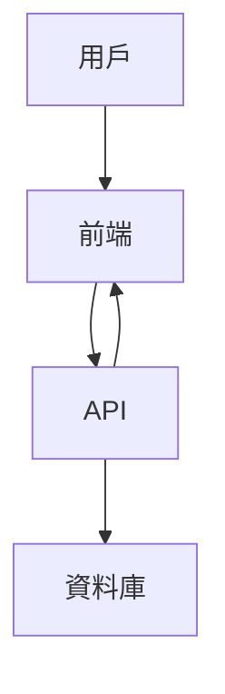

# Markdown Quality Checker - Examples

## 範例 1: 品質檢查報告

**執行檢查**:
```
User: "檢查 docs/ 目錄的 Markdown 品質"
```

**生成報告**:
```markdown
# Markdown 品質檢查報告

**掃描範圍**: docs/**/*.md
**檔案數量**: 45
**檢查時間**: 2026-02-05 10:30

## 摘要

| 級別 | 數量 |
|------|------|
| 🔴 Error | 3 |
| 🟡 Warning | 12 |
| 🔵 Info | 8 |

## 錯誤詳情

### 🔴 Error

1. **docs/architecture/overview.md:45**
   - 問題: Mermaid 代碼區塊未閉合
   - 修復: 添加結束標記 ```

2. **docs/api/endpoints.md:120**
   - 問題: 斷開的內部連結 `./removed-file.md`
   - 修復: 更新連結或刪除

3. **docs/testing/guide.md:88**
   - 問題: Mermaid 語法錯誤 (無效箭頭)
   - 修復: 將 `<--` 改為 `-->`

### 🟡 Warning

1. **docs/README.md:15**
   - 問題: 標題跳級 (H1 → H3)
   - 建議: 添加 H2 層級

2. **docs/development/setup.md:30**
   - 問題: 代碼區塊無語言標記
   - 建議: 添加語言標識符
```

---

## 範例 2: 自動修復

**Before**:
```markdown
# 系統架構

以下是系統架構圖:

```mermaid
graph TD
    A[用戶] --> B[前端]
    B --> C[API Gateway]
    C --> D[服務層]

上圖展示了基本架構。

## 部署流程

請參考 [部署指南](./deployment.md)
```

**After (自動修復)**:
```markdown
# 系統架構

以下是系統架構圖:



上圖展示了基本架構。

## 部署流程

請參考 [部署指南](./deployment.md)
```

**修復說明**:
- 添加了 Mermaid 代碼區塊的結束標記

---

## 範例 3: Mermaid 語法修正

**Before (有問題)**:
```mermaid
graph TD
    用戶 --> 前端
    前端 <-- API
    API -> 資料庫
```

**After (修正後)**:


**修正項目**:
1. 中文節點名改用 ID + 標籤格式
2. `<--` 改為正確的雙向關係
3. `->` 改為標準 `-->`

---

## 範例 4: CI/CD 整合

```yaml
# .github/workflows/docs-quality.yml
name: Documentation Quality Check

on:
  pull_request:
    paths:
      - 'docs/**/*.md'

jobs:
  markdown-lint:
    runs-on: ubuntu-latest
    steps:
      - uses: actions/checkout@v4

      - name: Markdown Lint
        uses: avto-dev/markdown-lint@v1
        with:
          args: 'docs/**/*.md'

      - name: Check Broken Links
        uses: gaurav-nelson/github-action-markdown-link-check@v1
        with:
          folder-path: 'docs'
```
