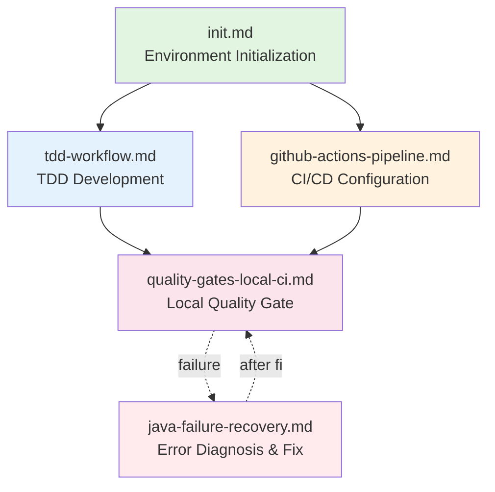

# Workflow Execution Index

> **Purpose**: Help AI and developers quickly find the appropriate workflow for the current scenario, understand workflow dependencies and execution order

---

## 🤖 AI Scenario Matching

### User Request → Workflow Mapping Table

| User Request Keywords | Invoke Workflow | Prerequisites | Expected Result | Related Rules |
|--------------|--------------|---------|---------|---------|
| "initialize environment" / "setup" / "start project" | [init.md](./init.md) | Docker installed | PostgreSQL + Redis running | 05, 08, 09 |
| "TDD" / "test-driven" / "write test first" | [tdd-workflow.md](./tdd-workflow.md) | Environment initialized | Test + implementation complete | 01, 08, 10 |
| "configure CI/CD" / "GitHub Actions" | [github-actions-pipeline.md](./github-actions-pipeline.md) | GitHub repo exists | .github/workflows/*.yml | 06, 10 |
| "Quality Gate failed" / "local validation" | [quality-gates-local-ci.md](./quality-gates-local-ci.md) | Local environment ready | Issue identified | 06, 10 |
| "compilation error" / "runtime error" / "ArchUnit failed" | [java-failure-recovery.md](./java-failure-recovery.md) | - | Error diagnosed | 10 |

---

## 📊 Workflow Dependency Graph



### Dependency Explanation
- **init.md** - Starting point for all workflows, ensures development environment is ready
- **tdd-workflow.md** - Depends on init.md, used for daily development
- **github-actions-pipeline.md** - Depends on init.md, configures CI/CD
- **quality-gates-local-ci.md** - Local validation, can be invoked by TDD or CI/CD
- **java-failure-recovery.md** - Independent workflow, handles various errors

---

## 🎯 Typical Scenario Workflow Combinations

### Scenario 1: New Project Startup (Complete Flow)

```bash
# Step 1: Environment Initialization
Workflow: init.md
└─ Start Docker (PostgreSQL + Redis)
└─ Verify Java 21 + Maven
└─ Compile project
└─ Run ArchUnit tests

# Step 2: First Feature Development (TDD)
Workflow: tdd-workflow.md
└─ Write test (RED)
└─ Minimal implementation (GREEN)
└─ Refactor optimization (REFACTOR)
└─ Verify Quality Gate

# Step 3: Configure CI/CD
Workflow: github-actions-pipeline.md
└─ Create .github/workflows/ci.yml
└─ Configure GitHub Secrets
└─ Verify Actions execution

# Step 4: Local Validation Flow
Workflow: quality-gates-local-ci.md
└─ Checkstyle + PMD + SpotBugs
└─ ArchUnit tests
└─ JaCoCo coverage
└─ SonarQube (if configured)
```

**Expected Time**: 1-2 hours
**Applied Rules**: 01, 05, 06, 08, 09, 10

---

### Scenario 2: Daily Feature Development

```bash
# Quick development flow
Workflow: tdd-workflow.md
├─ RED: Write failing test
├─ GREEN: Minimal implementation
├─ REFACTOR: Refactor optimization
└─ VERIFY: Local Quality Gate

# If encountering errors
Workflow: java-failure-recovery.md
└─ Diagnose error type
└─ Locate root cause
└─ Provide fix solution
```

**Expected Time**: 30 minutes - 2 hours/feature
**Applied Rules**: 01, 08, 10

---

### Scenario 3: Quality Gate Failure Fix

```bash
# Failure notification (GitHub Actions or local)
Workflow: quality-gates-local-ci.md
├─ Reproduce issue locally
├─ mvn checkstyle:check (fix format)
├─ mvn test (fix tests)
├─ mvn jacoco:check (add tests)
└─ Verify passed

# If unable to resolve
Workflow: java-failure-recovery.md
└─ Detailed diagnosis
└─ Review rule documentation
└─ Step-by-step fix
```

**Expected Time**: 10-30 minutes
**Applied Rules**: 01, 06, 10

---

### Scenario 4: ArchUnit Test Failure Handling

```bash
# Received ArchUnit failure notification
Workflow: java-failure-recovery.md
└─ Section: ArchUnit Test Failure Diagnosis

# Analyze violation type
├─ Controller directly accessing Repository?
│   └─ Fix: Create Service intermediate layer
│
├─ Service using Optional instead of Option?
│   └─ Fix: Replace with io.vavr.control.Option
│
├─ Field injection?
│   └─ Fix: Use constructor injection
│
└─ @Transactional in wrong location?
    └─ Fix: Move to Service layer

# Verify fix
Workflow: quality-gates-local-ci.md
└─ mvn test -Dtest=ArchitectureTest
```

**Expected Time**: 5-20 minutes/violation
**Applied Rules**: 10, 08

---

## 📋 Workflow Mandatory Checkpoints

After each workflow execution, AI must confirm the following checkpoints:

### ✅ init.md Completion Check
```bash
# 1. Docker services running
docker ps | grep -E "(postgres|redis)"
# Expected: 2 containers running

# 2. Project compilation success
mvn clean compile
# Expected: BUILD SUCCESS

# 3. ArchUnit tests passed
mvn test -Dtest=ArchitectureTest
# Expected: 0 failures

# 4. Database connection working
docker exec smartadmin-postgres psql -U smartadmin -d smart_admin_v3 -c "SELECT 1"
# Expected: returns 1
```

### ✅ tdd-workflow.md Completion Check
```bash
# 1. Test class exists and follows naming convention
find . -name "*Test.java" | grep -v target
# Expected: test file found

# 2. Implementation class exists and follows architecture
mvn test -Dtest=ArchitectureTest#layerDependencies
# Expected: 0 violations

# 3. All tests passed
mvn test
# Expected: BUILD SUCCESS

# 4. Coverage meets threshold
mvn jacoco:report && mvn jacoco:check -Djacoco.minimum=0.80
# Expected: BUILD SUCCESS
```

### ✅ github-actions-pipeline.md Completion Check
```bash
# 1. Workflow file exists
ls .github/workflows/ci.yml
# Expected: file exists

# 2. GitHub Secrets configured
gh secret list
# Expected: SONAR_TOKEN, SONAR_HOST_URL

# 3. Actions running after first push
gh run list --limit 1
# Expected: status: completed, conclusion: success
```

### ✅ quality-gates-local-ci.md Completion Check
```bash
# 1. Checkstyle passed
mvn checkstyle:check
# Expected: 0 errors

# 2. PMD passed
mvn pmd:check
# Expected: 0 violations

# 3. SpotBugs passed
mvn spotbugs:check
# Expected: 0 bugs

# 4. JaCoCo passed
mvn jacoco:check -Djacoco.minimum=0.80
# Expected: BUILD SUCCESS

# 5. ArchUnit passed
mvn test -Dtest=ArchitectureTest
# Expected: 0 failures
```

### ✅ java-failure-recovery.md Completion Check
```bash
# 1. Error identified
# Expected: clear error type (compilation/test/ArchUnit/QualityGate)

# 2. Root cause located
# Expected: specific file and line number

# 3. Fix solution applied
# Expected: code modified

# 4. Issue resolved
mvn verify
# Expected: BUILD SUCCESS
```

---

## 🔍 Workflow Selection Decision Tree

```
User described situation:
├─ "I want to start developing" / "environment not yet set up"
│   └─ Execute: init.md
│
├─ "I need to develop new feature" / "need to write code"
│   ├─ Environment initialized?
│   │   ├─ YES → Execute: tdd-workflow.md
│   │   └─ NO → First execute: init.md, then execute: tdd-workflow.md
│   │
│   └─ Encountered error?
│       └─ Execute: java-failure-recovery.md
│
├─ "GitHub Actions failed" / "CI failed"
│   ├─ First-time configuration?
│   │   └─ YES → Reference: github-actions-pipeline.md
│   │
│   └─ Reproduce issue locally
│       └─ Execute: quality-gates-local-ci.md
│
├─ "ArchUnit test failed" / "architecture violation"
│   └─ Execute: java-failure-recovery.md (ArchUnit diagnosis section)
│
├─ "insufficient coverage" / "SonarQube issue"
│   └─ Execute: quality-gates-local-ci.md
│
└─ "compilation failed" / "dependency conflict" / "runtime error"
    └─ Execute: java-failure-recovery.md
```

---

## 📚 Workflow and Rules Correspondence Table

### init.md
**Dependent Rules**:
- [05-postgresql-basics.md](../rules/05-postgresql-basics.md) - Database initialization
- [08-vavr-fundamentals.md](../rules/08-vavr-fundamentals.md) - Vavr dependency configuration
- [09-mybatis-plus-core.md](../rules/09-mybatis-plus-core.md) - MyBatis Plus configuration

**Execution Order**: Environment check → Docker startup → Project compilation → ArchUnit tests

---

### tdd-workflow.md
**Dependent Rules**:
- [01-naming-conventions.md](../rules/01-naming-conventions.md) - Test naming
- [08-vavr-fundamentals.md](../rules/08-vavr-fundamentals.md) - Service returns Option
- [10-architecture-rules.md](../rules/10-architecture-rules.md) - Layered architecture

**Execution Order**: RED (test) → GREEN (implementation) → REFACTOR (refactor) → VERIFY (validation)

---

### github-actions-pipeline.md
**Dependent Rules**:
- [06-sonarqube-rules.md](../rules/06-sonarqube-rules.md) - SonarQube configuration
- [10-architecture-rules.md](../rules/10-architecture-rules.md) - ArchUnit tests

**Execution Order**: Create workflow → Configure secrets → Push code → Verify execution

---

### quality-gates-local-ci.md
**Dependent Rules**:
- [01-naming-conventions.md](../rules/01-naming-conventions.md) - Checkstyle
- [06-sonarqube-rules.md](../rules/06-sonarqube-rules.md) - Quality standards
- [10-architecture-rules.md](../rules/10-architecture-rules.md) - ArchUnit

**Execution Order**: Checkstyle → PMD → SpotBugs → Tests → JaCoCo → ArchUnit

---

### java-failure-recovery.md
**Dependent Rules**:
- [10-architecture-rules.md](../rules/10-architecture-rules.md) - Architecture error diagnosis

**Execution Order**: Identify error type → Locate root cause → Consult rules → Fix → Verify

---

## 🎓 Learning Path Recommendations

### For Newcomers
```
Day 1: init.md
       └─ Set up development environment, familiarize with project structure

Day 2-3: tdd-workflow.md
         └─ Practice TDD development on a simple feature

Day 4: quality-gates-local-ci.md
       └─ Learn quality check standards

Day 5: github-actions-pipeline.md (optional)
       └─ Understand CI/CD workflow
```

### For Developers Familiar with Traditional Java
```
Week 1: init.md + tdd-workflow.md
        └─ Adapt to using Vavr Option/Try

Week 2: Focus on related rules
        └─ 08-vavr-fundamentals.md
        └─ 09-mybatis-plus-core.md
        └─ 05-postgresql-basics.md

Week 3: Complete development workflow
        └─ TDD → Quality Gate → PR
```

---

## ⚡ Quick Reference

### Common Command Combinations

```bash
# Complete development flow
mvn clean compile && \
mvn test && \
mvn jacoco:report && \
mvn checkstyle:check && \
mvn test -Dtest=ArchitectureTest

# Quick check (before commit)
mvn verify

# Local Quality Gate (complete)
mvn clean verify && \
mvn checkstyle:check && \
mvn pmd:check && \
mvn spotbugs:check && \
mvn test -Dtest=ArchitectureTest
```

---

## 🔗 Related Resources

- [Development Standards & Navigation Overview](../README.md)
- [Rules Index](../rules/00-ai-decision-matrix.md)
- [ArchUnit Test Configuration](../configs/ArchitectureTest.java)
- [Maven Dependencies](../configs/maven-dependencies.md)

---

**Last Updated**: 2025-01-13
**Sprint 2 Task**: Workflow orchestration and index optimization
