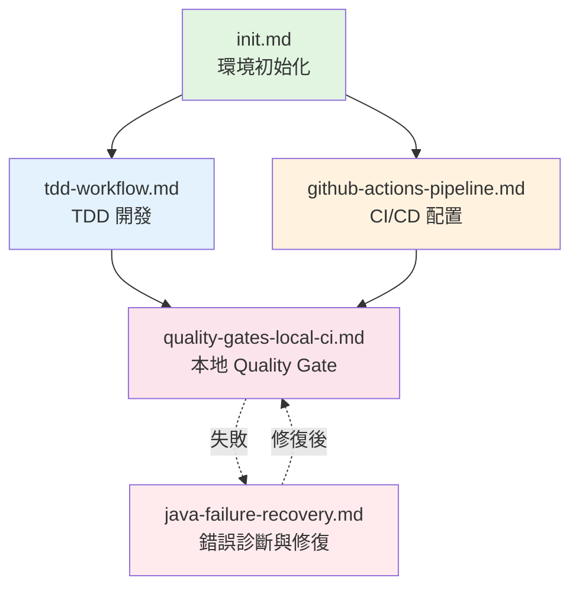

# Workflow 執行索引

> **目的**: 幫助 AI 和開發者快速找到適合當前場景的 Workflow，理解 Workflow 之間的依賴關係和執行順序

---

## 🤖 AI 場景匹配

### 用戶請求 → Workflow 映射表

| 用戶請求關鍵詞 | 調用 Workflow | 前置條件 | 預期結果 | 相關規則 |
|--------------|--------------|---------|---------|---------|
| "初始化環境" / "setup" / "啟動項目" | [init.md](./init.md) | Docker 已安裝 | PostgreSQL + Redis 運行 | 05, 08, 09 |
| "TDD" / "測試驅動" / "先寫測試" | [tdd-workflow.md](./tdd-workflow.md) | 環境已初始化 | 測試 + 實現完成 | 01, 08, 10 |
| "配置 CI/CD" / "GitHub Actions" | [github-actions-pipeline.md](./github-actions-pipeline.md) | GitHub repo 存在 | .github/workflows/*.yml | 06, 10 |
| "Quality Gate 失敗" / "本地驗證" | [quality-gates-local-ci.md](./quality-gates-local-ci.md) | 本地環境就緒 | 問題已定位 | 06, 10 |
| "編譯錯誤" / "運行錯誤" / "ArchUnit 失敗" | [java-failure-recovery.md](./java-failure-recovery.md) | - | 錯誤已診斷 | 10 |

---

## 📊 Workflow 依賴圖



### 依賴說明
- **init.md** - 所有 workflow 的起點，確保開發環境就緒
- **tdd-workflow.md** - 依賴 init.md，用於日常開發
- **github-actions-pipeline.md** - 依賴 init.md，配置 CI/CD
- **quality-gates-local-ci.md** - 本地驗證，可被 tdd 或 ci/cd 調用
- **java-failure-recovery.md** - 獨立 workflow，處理各類錯誤

---

## 🎯 典型場景的 Workflow 組合

### 場景 1: 新項目啟動（完整流程）

```bash
# Step 1: 環境初始化
Workflow: init.md
└─ 啟動 Docker (PostgreSQL + Redis)
└─ 驗證 Java 21 + Maven
└─ 編譯項目
└─ 運行 ArchUnit 測試

# Step 2: 第一個功能開發（TDD）
Workflow: tdd-workflow.md
└─ 編寫測試（RED）
└─ 最小實現（GREEN）
└─ 重構優化（REFACTOR）
└─ 驗證 Quality Gate

# Step 3: 配置 CI/CD
Workflow: github-actions-pipeline.md
└─ 創建 .github/workflows/ci.yml
└─ 配置 GitHub Secrets
└─ 驗證 Actions 運行

# Step 4: 本地驗證流程
Workflow: quality-gates-local-ci.md
└─ Checkstyle + PMD + SpotBugs
└─ ArchUnit 測試
└─ JaCoCo 覆蓋率
└─ SonarQube（如果配置）
```

**預期時間**: 1-2 小時
**應用規則**: 01, 05, 06, 08, 09, 10

---

### 場景 2: 日常功能開發

```bash
# 快速開發流程
Workflow: tdd-workflow.md
├─ RED: 編寫失敗測試
├─ GREEN: 最小實現
├─ REFACTOR: 重構優化
└─ VERIFY: 本地 Quality Gate

# 如果遇到錯誤
Workflow: java-failure-recovery.md
└─ 診斷錯誤類型
└─ 定位根因
└─ 提供修復方案
```

**預期時間**: 30 分鐘 - 2 小時/功能
**應用規則**: 01, 08, 10

---

### 場景 3: Quality Gate 失敗修復

```bash
# 失敗通知（GitHub Actions 或本地）
Workflow: quality-gates-local-ci.md
├─ 本地複現問題
├─ mvn checkstyle:check（修復格式）
├─ mvn test（修復測試）
├─ mvn jacoco:check（補充測試）
└─ 驗證通過

# 如果無法解決
Workflow: java-failure-recovery.md
└─ 詳細診斷
└─ 查看規則文檔
└─ 逐步修復
```

**預期時間**: 10-30 分鐘
**應用規則**: 01, 06, 10

---

### 場景 4: ArchUnit 測試失敗處理

```bash
# 收到 ArchUnit 失敗通知
Workflow: java-failure-recovery.md
└─ Section: ArchUnit 測試失敗診斷

# 分析違規類型
├─ Controller 直接訪問 Repository?
│   └─ 修復: 創建 Service 中間層
│
├─ Service 使用 Optional 而非 Option?
│   └─ 修復: 替換為 io.vavr.control.Option
│
├─ 字段注入?
│   └─ 修復: 使用構造函數注入
│
└─ @Transactional 位置錯誤?
    └─ 修復: 移到 Service 層

# 驗證修復
Workflow: quality-gates-local-ci.md
└─ mvn test -Dtest=ArchitectureTest
```

**預期時間**: 5-20 分鐘/違規
**應用規則**: 10, 08

---

## 📋 Workflow 強制檢查點

每個 workflow 執行完畢後，AI 必須確認以下檢查點：

### ✅ init.md 完成檢查
```bash
# 1. Docker 服務運行
docker ps | grep -E "(postgres|redis)"
# 預期: 2 個容器 running

# 2. 項目編譯成功
mvn clean compile
# 預期: BUILD SUCCESS

# 3. ArchUnit 測試通過
mvn test -Dtest=ArchitectureTest
# 預期: 0 failures

# 4. 數據庫連接正常
docker exec smartadmin-postgres psql -U smartadmin -d smart_admin_v3 -c "SELECT 1"
# 預期: 返回 1
```

### ✅ tdd-workflow.md 完成檢查
```bash
# 1. 測試類存在且命名規範
find . -name "*Test.java" | grep -v target
# 預期: 找到測試文件

# 2. 實現類存在且遵循架構
mvn test -Dtest=ArchitectureTest#layerDependencies
# 預期: 0 violations

# 3. 所有測試通過
mvn test
# 預期: BUILD SUCCESS

# 4. 覆蓋率達標
mvn jacoco:report && mvn jacoco:check -Djacoco.minimum=0.80
# 預期: BUILD SUCCESS
```

### ✅ github-actions-pipeline.md 完成檢查
```bash
# 1. Workflow 文件存在
ls .github/workflows/ci.yml
# 預期: 文件存在

# 2. GitHub Secrets 已配置
gh secret list
# 預期: SONAR_TOKEN, SONAR_HOST_URL

# 3. 首次 push 後 Actions 運行
gh run list --limit 1
# 預期: status: completed, conclusion: success
```

### ✅ quality-gates-local-ci.md 完成檢查
```bash
# 1. Checkstyle 通過
mvn checkstyle:check
# 預期: 0 errors

# 2. PMD 通過
mvn pmd:check
# 預期: 0 violations

# 3. SpotBugs 通過
mvn spotbugs:check
# 預期: 0 bugs

# 4. JaCoCo 通過
mvn jacoco:check -Djacoco.minimum=0.80
# 預期: BUILD SUCCESS

# 5. ArchUnit 通過
mvn test -Dtest=ArchitectureTest
# 預期: 0 failures
```

### ✅ java-failure-recovery.md 完成檢查
```bash
# 1. 錯誤已識別
# 預期: 明確的錯誤類型（編譯/測試/ArchUnit/QualityGate）

# 2. 根因已定位
# 預期: 具體的文件和行號

# 3. 修復方案已應用
# 預期: 代碼已修改

# 4. 問題已解決
mvn verify
# 預期: BUILD SUCCESS
```

---

## 🔍 Workflow 選擇決策樹

```
用戶描述的情況:
├─ "我想開始開發" / "環境還沒設置"
│   └─ 執行: init.md
│
├─ "我要開發新功能" / "需要寫代碼"
│   ├─ 環境已初始化？
│   │   ├─ YES → 執行: tdd-workflow.md
│   │   └─ NO → 先執行: init.md，再執行: tdd-workflow.md
│   │
│   └─ 遇到錯誤？
│       └─ 執行: java-failure-recovery.md
│
├─ "GitHub Actions 失敗" / "CI 失敗"
│   ├─ 首次配置？
│   │   └─ YES → 參考: github-actions-pipeline.md
│   │
│   └─ 本地複現問題
│       └─ 執行: quality-gates-local-ci.md
│
├─ "ArchUnit 測試失敗" / "架構違規"
│   └─ 執行: java-failure-recovery.md (ArchUnit 診斷部分)
│
├─ "覆蓋率不足" / "SonarQube 問題"
│   └─ 執行: quality-gates-local-ci.md
│
└─ "編譯失敗" / "依賴衝突" / "運行錯誤"
    └─ 執行: java-failure-recovery.md
```

---

## 📚 Workflow 與 Rules 對應表

### init.md
**依賴規則**:
- [05-postgresql-basics.md](../rules/05-postgresql-basics.md) - 數據庫初始化
- [08-vavr-fundamentals.md](../rules/08-vavr-fundamentals.md) - Vavr 依賴配置
- [09-mybatis-plus-core.md](../rules/09-mybatis-plus-core.md) - MyBatis Plus 配置

**執行順序**: 環境檢查 → Docker 啟動 → 項目編譯 → ArchUnit 測試

---

### tdd-workflow.md
**依賴規則**:
- [01-naming-conventions.md](../rules/01-naming-conventions.md) - 測試命名
- [08-vavr-fundamentals.md](../rules/08-vavr-fundamentals.md) - Service 返回 Option
- [10-architecture-rules.md](../rules/10-architecture-rules.md) - 分層架構

**執行順序**: RED（測試）→ GREEN（實現）→ REFACTOR（重構）→ VERIFY（驗證）

---

### github-actions-pipeline.md
**依賴規則**:
- [06-sonarqube-rules.md](../rules/06-sonarqube-rules.md) - SonarQube 配置
- [10-architecture-rules.md](../rules/10-architecture-rules.md) - ArchUnit 測試

**執行順序**: 創建 Workflow → 配置 Secrets → 推送代碼 → 驗證運行

---

### quality-gates-local-ci.md
**依賴規則**:
- [01-naming-conventions.md](../rules/01-naming-conventions.md) - Checkstyle
- [06-sonarqube-rules.md](../rules/06-sonarqube-rules.md) - 質量標準
- [10-architecture-rules.md](../rules/10-architecture-rules.md) - ArchUnit

**執行順序**: Checkstyle → PMD → SpotBugs → Tests → JaCoCo → ArchUnit

---

### java-failure-recovery.md
**依賴規則**:
- [10-architecture-rules.md](../rules/10-architecture-rules.md) - 架構錯誤診斷

**執行順序**: 識別錯誤類型 → 定位根因 → 查閱規則 → 修復 → 驗證

---

## 🎓 學習路徑建議

### 對於新人
```
Day 1: init.md
       └─ 設置開發環境，熟悉項目結構

Day 2-3: tdd-workflow.md
         └─ 練習 TDD 開發一個簡單功能

Day 4: quality-gates-local-ci.md
       └─ 學習質量檢查標準

Day 5: github-actions-pipeline.md（可選）
       └─ 了解 CI/CD 流程
```

### 對於熟悉傳統 Java 的開發者
```
Week 1: init.md + tdd-workflow.md
        └─ 適應 Vavr Option/Try 的使用

Week 2: 重點學習相關規則
        └─ 08-vavr-fundamentals.md
        └─ 09-mybatis-plus-core.md
        └─ 05-postgresql-basics.md

Week 3: 完整開發流程
        └─ TDD → Quality Gate → PR
```

---

## ⚡ 快速參考

### 常用命令組合

```bash
# 完整開發流程
mvn clean compile && \
mvn test && \
mvn jacoco:report && \
mvn checkstyle:check && \
mvn test -Dtest=ArchitectureTest

# 快速檢查（提交前）
mvn verify

# 本地 Quality Gate（完整）
mvn clean verify && \
mvn checkstyle:check && \
mvn pmd:check && \
mvn spotbugs:check && \
mvn test -Dtest=ArchitectureTest
```

---

## 🔗 相關資源

- [開發規範與導航總覽](../README.md)
- [規則索引](../rules/00-ai-decision-matrix.md)
- [ArchUnit 測試配置](../configs/ArchitectureTest.java)
- [Maven 依賴](../configs/maven-dependencies.md)

---

**最後更新**: 2025-01-13
**Sprint 2 任務**: Workflow 編排與索引優化
