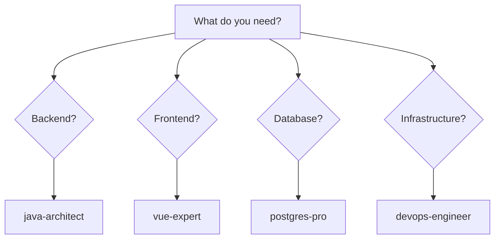

# .claude Directory

**Root Documentation**: See [../README.md](../README.md) for project overview and complete navigation.

**Multi-agent AI system** for SmartAdmin development with specialized agents, shared knowledge, and automated quality gates.

## Quick Links

- **Getting Started**: [Quick Start Guide](docs/quick-start-guide.md)
- **Choose an Agent**: [Agent Capability Matrix](docs/agent-capability-matrix.md)
- **Update Configuration**: [Maintenance Guide](docs/maintenance-guide.md)
- **Troubleshooting**: [Troubleshooting Guide](docs/troubleshooting-guide.md)
- **Root Reference Card**: [CLAUDE.md](../CLAUDE.md)

---

## Directory Structure

```
.claude/
├── agents/              # 9 specialized agents (java-architect, vue-expert, etc.)
├── shared/              # Shared knowledge, templates, orchestration
│   ├── knowledge/       # SmartAdmin patterns (single source of truth)
│   ├── templates/       # Agent base templates (DRY)
│   └── orchestration/   # Multi-agent workflows
├── docs/                # Documentation (quick-start, maintenance, troubleshooting)
├── settings.json        # Plugin configuration
├── settings.local.json  # Permissions and hooks
└── hooks.json           # Automated quality gates
```

---

## Content Ownership

Understanding where information lives:

| Content | Location | Purpose |
|---------|----------|---------|
| **Quick Reference** | [CLAUDE.md](../CLAUDE.md) | Developer cheat sheet, most common patterns |
| **SmartAdmin Patterns** | [shared/knowledge/smartadmin-patterns.md](shared/knowledge/smartadmin-patterns.md) | Complete backend patterns (source of truth) |
| **Agent Definitions** | [agents/](agents/) | 9 specialized AI agents with expertise |
| **Workflow Patterns** | [shared/orchestration/workflow-patterns.md](shared/orchestration/workflow-patterns.md) | Multi-agent collaboration patterns |
| **Quality Standards** | [shared/knowledge/quality-standards.md](shared/knowledge/quality-standards.md) | Code quality rules and conventions |
| **Troubleshooting** | [docs/troubleshooting-guide.md](docs/troubleshooting-guide.md) | Problem resolution |

---

## 9 Specialized Agents

| Agent | Expertise | When to Use |
|-------|-----------|-------------|
| [java-architect](agents/java-architect.md) | Backend (Spring Boot, JPA) | Implementing APIs, services, business logic |
| [vue-expert](agents/vue-expert.md) | Frontend (Vue 3, Ant Design) | Building UI, components, state management |
| [postgres-pro](agents/postgres-pro.md) | Database (PostgreSQL) | Query optimization, schema design |
| [devops-engineer](agents/devops-engineer.md) | CI/CD, Docker, K8s | Deployment, infrastructure |
| [business-analyst](agents/business-analyst.md) | Requirements, process | Clarifying requirements, API contracts |
| [chaos-engineer](agents/chaos-engineer.md) | Resilience testing | Failure injection, chaos experiments |
| [architect-reviewer](agents/architect-reviewer.md) | Architecture validation | Design review, scalability analysis |
| [code-reviewer](agents/code-reviewer.md) | Pre-merge quality gate | Code quality, security, performance |
| [documentation-engineer](agents/documentation-engineer.md) | Technical docs | API docs, guides, architecture docs |

**See**: [Agent Capability Matrix](docs/agent-capability-matrix.md) for detailed comparison

---

## Quick Start

### 1. Which agent do I need?

Use the decision matrix:



**Or check**: [Decision Matrix](shared/orchestration/decision-matrix.md) for keyword-based selection

---

### 2. Configuration

**Permissions**: [settings.local.json](settings.local.json) - Controls what agents can do
**Hooks**: [hooks.json](hooks.json) - Automated quality gates
**How to update**: [Maintenance Guide](docs/maintenance-guide.md)

---

### 3. Multi-Agent Workflows

Common patterns:

- **New Feature**: business-analyst → java-architect → vue-expert → code-reviewer → devops-engineer
- **Performance**: java-architect + postgres-pro (parallel) → architect-reviewer
- **Production Incident**: devops-engineer (hub) → specialists as needed

**See**: [Workflow Patterns](shared/orchestration/workflow-patterns.md) for detailed sequences

---

## Documentation

| Guide | Purpose | When to Read |
|-------|---------|-------------|
| [Quick Start Guide](docs/quick-start-guide.md) | Getting started | First time using agents |
| [Agent Capability Matrix](docs/agent-capability-matrix.md) | Agent comparison | Choosing the right agent |
| [Maintenance Guide](docs/maintenance-guide.md) | Configuration updates | Updating agents or patterns |
| [Troubleshooting Guide](docs/troubleshooting-guide.md) | Problem resolution | When things don't work |
| [Hooks Guide](docs/hooks-guide.md) | Automated quality | Configuring quality gates |
| [Changelog](docs/changelog.md) | Version history | Understanding updates |

---

## Version

**Current Version**: 2.5.0
**Last Updated**: 2026-01-21
**Status**: Production Ready (95-100% Complete)

---

## Related Documentation

- **Root Reference**: [CLAUDE.md](../CLAUDE.md) - Developer quick reference
- **Technical Rules**: [.agent/rules/](.agent/rules/) - Detailed coding standards
- **Architecture Docs**: [docs/](../docs/) - System architecture
