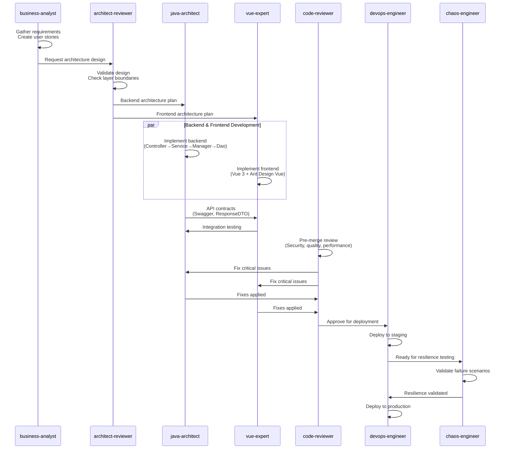
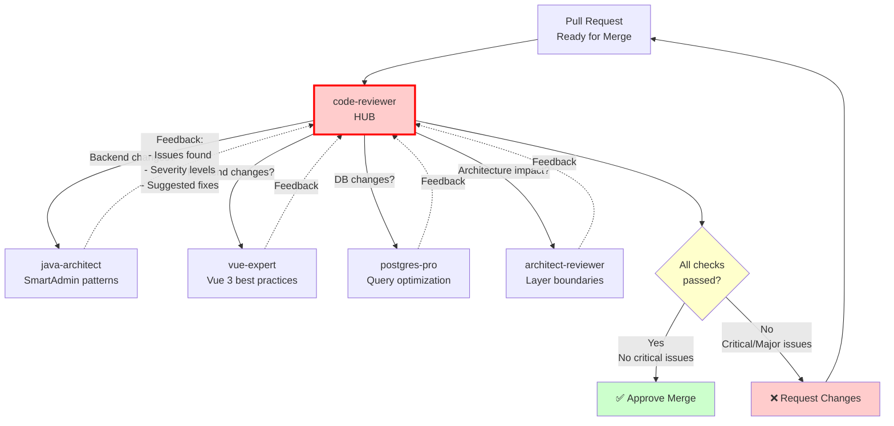
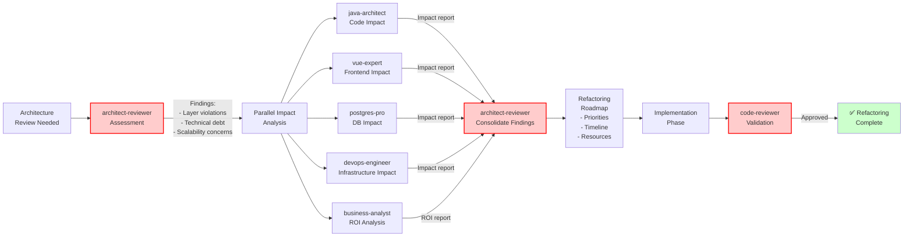
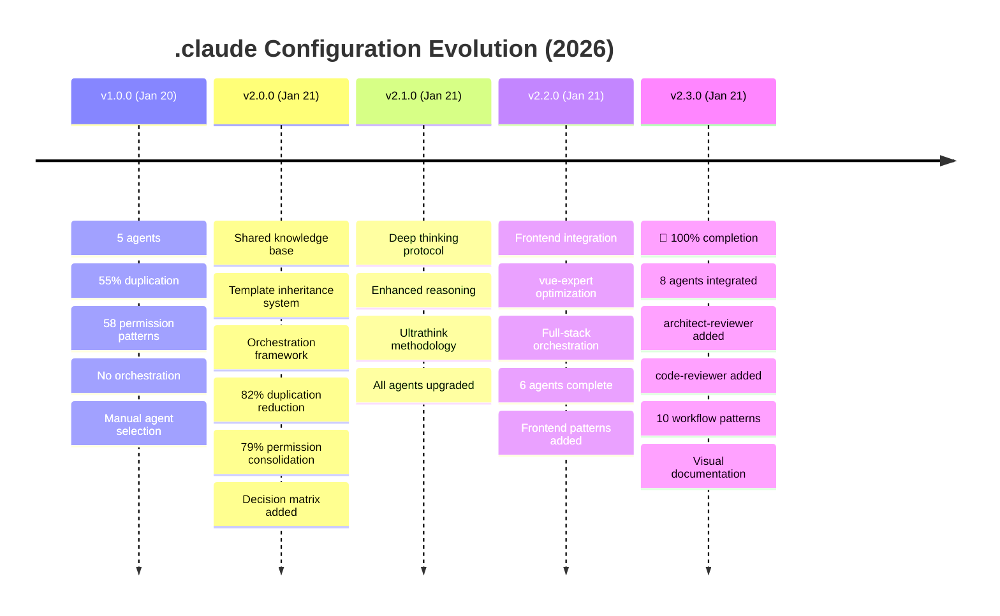
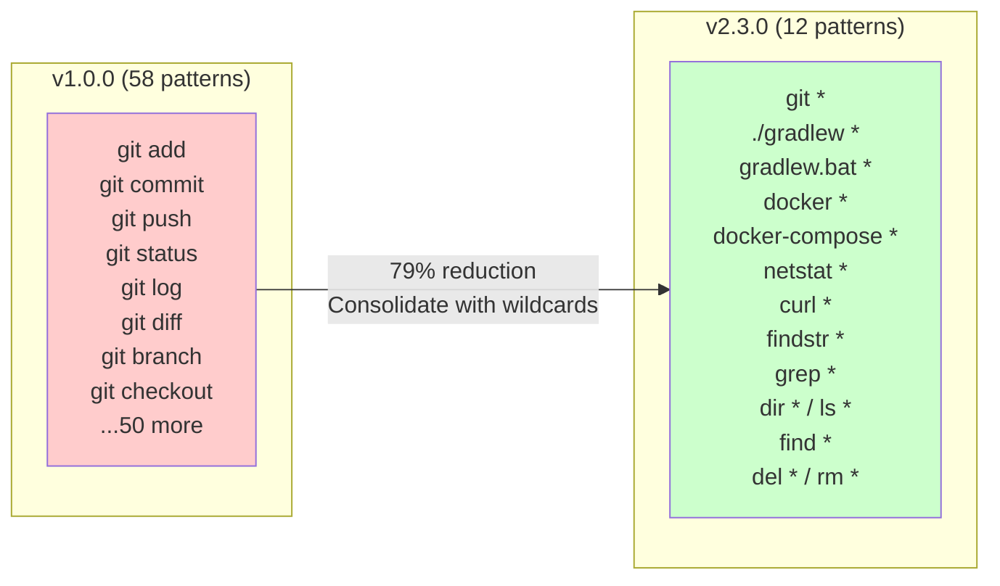
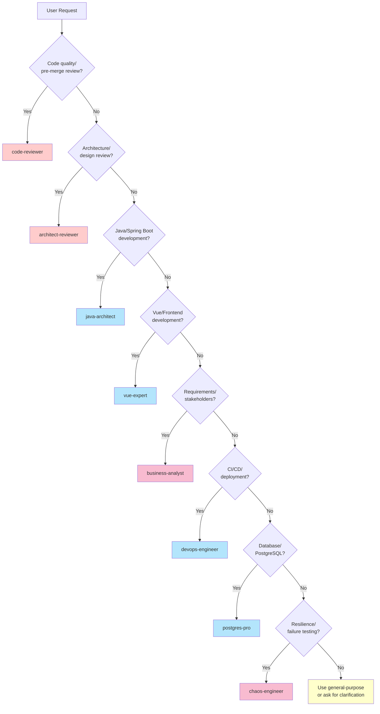

# Agent Architecture Diagrams

Visual representations of the .claude configuration system using Mermaid diagrams.

**Version:** 2.3.0
**Last Updated:** 2026-01-21

## Table of Contents

1. [Agent Dependency Graph](#agent-dependency-graph)
2. [Agent Collaboration Patterns](#agent-collaboration-patterns)
3. [Configuration Architecture](#configuration-architecture)
4. [Evolution Timeline](#evolution-timeline)
5. [How to Read These Diagrams](#how-to-read-these-diagrams)

---

## Agent Dependency Graph

This diagram shows the relationships between agents, templates, and knowledge base files.

```mermaid
graph TB
    %% Base & Mixins
    base[agent-base.md<br/>Foundation for all]
    tech[technical-agent-mixin.md<br/>Technical agents]
    analysis[analysis-agent-mixin.md<br/>Analysis agents]

    %% Knowledge Base
    kb_sa[smartadmin-patterns.md<br/>Backend patterns]
    kb_fe[smartadmin-frontend-patterns.md<br/>Frontend patterns]
    kb_arch[project-architecture.md<br/>Tech stack]
    kb_qual[quality-standards.md<br/>Code quality]

    %% Agents - Technical
    java[java-architect<br/>Backend Expert]
    vue[vue-expert<br/>Frontend Expert]
    devops[devops-engineer<br/>CI/CD Expert]
    postgres[postgres-pro<br/>Database Expert]
    arch_rev[architect-reviewer<br/>Design Review]
    code_rev[code-reviewer<br/>Quality Review]

    %% Agents - Analysis
    ba[business-analyst<br/>Requirements]
    chaos[chaos-engineer<br/>Resilience]

    %% Inheritance
    base -.->|inherits| java
    base -.->|inherits| vue
    base -.->|inherits| ba
    base -.->|inherits| chaos
    base -.->|inherits| devops
    base -.->|inherits| postgres
    base -.->|inherits| arch_rev
    base -.->|inherits| code_rev

    tech -.->|mixin| java
    tech -.->|mixin| vue
    tech -.->|mixin| devops
    tech -.->|mixin| postgres
    tech -.->|mixin| arch_rev
    tech -.->|mixin| code_rev

    analysis -.->|mixin| ba
    analysis -.->|mixin| chaos

    %% Knowledge Base Dependencies
    kb_sa -->|references| java
    kb_sa -->|references| arch_rev
    kb_sa -->|references| code_rev
    kb_fe -->|references| vue
    kb_arch -->|references| java
    kb_arch -->|references| vue
    kb_arch -->|references| devops
    kb_qual -->|references| code_rev
    kb_qual -->|references| arch_rev

    style base fill:#e1f5ff
    style tech fill:#fff4e1
    style analysis fill:#ffe1f5
    style java fill:#b3e5fc
    style vue fill:#b3e5fc
    style devops fill:#b3e5fc
    style postgres fill:#b3e5fc
    style arch_rev fill:#b3e5fc
    style code_rev fill:#b3e5fc
    style ba fill:#f8bbd0
    style chaos fill:#f8bbd0
```

### Legend

- **Blue boxes** (light): Base template
- **Orange boxes**: Technical agent mixin
- **Pink boxes**: Analysis agent mixin
- **Cyan boxes**: Technical agents (6)
- **Pink boxes** (darker): Analysis agents (2)
- **Dotted arrows**: Inheritance/mixin relationship
- **Solid arrows**: Knowledge base references

---

## Agent Collaboration Patterns

### Pattern 1: Full-Stack Feature Development

Sequential workflow from requirements to deployment.

**Key Points:**
- BA gathers requirements first
- Architect reviews design before implementation
- Backend and frontend work in parallel
- Code reviewer acts as quality gate
- DevOps handles deployment
- Chaos engineer validates resilience

---

### Pattern 2: Pre-Merge Quality Gate (Hub-and-Spoke)

Code reviewer coordinates with specialists for comprehensive review.

**Key Points:**
- Code reviewer is the hub, coordinates all reviews
- Dispatches to specialists based on change type
- Aggregates feedback from all specialists
- Makes final pass/fail decision
- Iterates until all critical issues resolved

---

### Pattern 3: Architecture Review & Refactoring

Collaborative architecture assessment with impact analysis.

**Key Points:**
- Architect reviewer leads assessment
- All specialists analyze impact in parallel
- Business analyst evaluates ROI
- Consolidated roadmap with priorities
- Implementation followed by quality validation

---

## Configuration Architecture

Visualizes the .claude directory structure and relationships.

```mermaid
graph TB
    subgraph "Shared Infrastructure"
        subgraph "Knowledge Base (4 files)"
            KB1[smartadmin-patterns.md<br/>313 lines<br/>Backend patterns]
            KB2[smartadmin-frontend-patterns.md<br/>823 lines<br/>Frontend patterns]
            KB3[project-architecture.md<br/>263 lines<br/>Tech stack & build]
            KB4[quality-standards.md<br/>390 lines<br/>Code quality]
        end

        subgraph "Templates (3 files)"
            T1[agent-base.md<br/>378 lines<br/>Foundation]
            T2[technical-agent-mixin.md<br/>318 lines<br/>Technical agents]
            T3[analysis-agent-mixin.md<br/>220 lines<br/>Analysis agents]
        end

        subgraph "Orchestration (3 files)"
            O1[decision-matrix.md<br/>~290 lines<br/>Agent selection]
            O2[agent-dependencies.md<br/>~310 lines<br/>Collaboration]
            O3[workflow-patterns.md<br/>~450 lines<br/>10 patterns]
        end
    end

    subgraph "Specialized Agents (8 files)"
        A1[java-architect.md<br/>548 lines]
        A2[vue-expert.md<br/>662 lines]
        A3[business-analyst.md<br/>602 lines]
        A4[chaos-engineer.md<br/>456 lines]
        A5[devops-engineer.md<br/>614 lines]
        A6[postgres-pro.md<br/>768 lines]
        A7[architect-reviewer.md<br/>~135 lines]
        A8[code-reviewer.md<br/>~155 lines]
    end

    KB1 -.->|Backend patterns| A1
    KB1 -.->|Backend patterns| A7
    KB1 -.->|Backend patterns| A8
    KB2 -.->|Frontend patterns| A2
    KB3 -.->|Tech stack| A1
    KB3 -.->|Tech stack| A2
    KB3 -.->|Tech stack| A5
    KB4 -.->|Quality standards| A7
    KB4 -.->|Quality standards| A8

    T1 -.->|Inherits| A1
    T1 -.->|Inherits| A2
    T1 -.->|Inherits| A3
    T1 -.->|Inherits| A4
    T1 -.->|Inherits| A5
    T1 -.->|Inherits| A6
    T1 -.->|Inherits| A7
    T1 -.->|Inherits| A8

    T2 -.->|Mixin| A1
    T2 -.->|Mixin| A2
    T2 -.->|Mixin| A5
    T2 -.->|Mixin| A6
    T2 -.->|Mixin| A7
    T2 -.->|Mixin| A8

    T3 -.->|Mixin| A3
    T3 -.->|Mixin| A4

    O1 -.->|Guides selection| User[User Request]
    O2 -.->|Coordinates| A1
    O2 -.->|Coordinates| A2
    O3 -.->|Orchestrates| A1
    O3 -.->|Orchestrates| A2

    style KB1 fill:#e3f2fd
    style KB2 fill:#e3f2fd
    style KB3 fill:#e3f2fd
    style KB4 fill:#e3f2fd
    style T1 fill:#fff3e0
    style T2 fill:#fff3e0
    style T3 fill:#fff3e0
    style O1 fill:#f3e5f5
    style O2 fill:#f3e5f5
    style O3 fill:#f3e5f5
```

### Architecture Principles

1. **Single Source of Truth**: SmartAdmin patterns in one place
2. **Template Inheritance**: All agents inherit from agent-base.md
3. **Mixin Pattern**: Technical vs Analysis agent behaviors
4. **Orchestration Framework**: Clear agent selection and collaboration

---

## Evolution Timeline

Shows the progression of the .claude configuration system.

### Version Highlights

| Version | Key Achievement | Impact |
|---------|----------------|--------|
| v1.0.0 | Initial configuration | 5 agents, high duplication |
| v2.0.0 | Infrastructure optimization | 82% duplication reduction |
| v2.1.0 | Deep thinking protocol | Enhanced agent intelligence |
| v2.2.0 | Frontend integration | Full-stack coverage |
| v2.3.0 | 100% completion | All agents v2.x compliant |

---

## Permission Consolidation

Visualizes the dramatic reduction in permission patterns.

**Benefits:**
- **Maintainability**: Update once per category
- **Clarity**: Clear permission categories
- **Cross-platform**: Support both Windows and Unix
- **Security**: Well-documented rationale

---

## Agent Selection Flow

Decision tree for selecting the right agent.

**Usage:** Follow this decision tree when unsure which agent to invoke.

---

## How to Read These Diagrams

### Symbol Guide

| Symbol | Meaning |
|--------|---------|
| Solid arrow (`→`) | Direct dependency or flow |
| Dotted arrow (`-.->`) | Inheritance or reference |
| Box with rounded corners | Agent or component |
| Diamond (`◇`) | Decision point |
| Parallel bars (`║`) | Concurrent operations |

### Color Coding

| Color | Meaning |
|-------|---------|
| 🔵 Light blue | Base templates |
| 🟠 Orange | Technical agent mixin |
| 🌸 Pink (light) | Analysis agent mixin |
| 🔷 Cyan | Technical agents |
| 🌺 Pink (dark) | Analysis agents |
| 🟢 Green | Success/approval |
| 🔴 Red | Action/review required |
| 🟡 Yellow | Decision/conditional |

### Diagram Types

**Sequence Diagrams:**
- Show temporal order of agent interactions
- Read top to bottom for chronological flow
- `par` blocks indicate parallel operations

**Flow Diagrams:**
- Show decision points and branching
- Follow arrows for logical flow
- Diamonds indicate decision nodes

**Graph Diagrams:**
- Show relationships between components
- Dotted lines: Inheritance/reference
- Solid lines: Direct dependencies

**Timeline:**
- Shows chronological evolution
- Read left to right for progression

---

## Using These Diagrams

### For Developers

1. **Agent Selection**: Use the Agent Selection Flow diagram
2. **Understanding Workflows**: Review collaboration pattern diagrams
3. **Architecture Changes**: Check Configuration Architecture diagram
4. **Version History**: Consult Evolution Timeline

### For Architects

1. **System Design**: Study the Agent Dependency Graph
2. **Collaboration Patterns**: Review all 3 collaboration diagrams
3. **Evolution Planning**: Use Evolution Timeline for roadmap
4. **Permission Management**: Review Permission Consolidation

### For Maintenance

1. **Adding Agents**: Follow Configuration Architecture structure
2. **Updating Patterns**: Check Agent Dependency Graph for impacts
3. **Workflow Changes**: Update relevant collaboration pattern diagrams
4. **Documentation**: Keep diagrams in sync with code

---

## Mermaid Syntax Reference

These diagrams use Mermaid syntax. To render them:

**In GitHub:**
- Diagrams render automatically in markdown files

**In IDEs:**
- Install Mermaid preview extension
- VS Code: "Markdown Preview Mermaid Support"
- IntelliJ: Built-in Mermaid support

**Online:**
- https://mermaid.live/ - Live editor
- Copy diagram code, paste, and preview

---

## Maintaining These Diagrams

### When to Update

**Add/Remove Agent:**
1. Update Agent Dependency Graph
2. Update Configuration Architecture
3. Update Agent Selection Flow
4. Update Evolution Timeline (if version bump)

**Change Workflow:**
1. Update relevant collaboration pattern diagram
2. Add notes explaining the change

**New Version:**
1. Add entry to Evolution Timeline
2. Update version numbers in diagrams

### Validation

Before committing diagram changes:
1. Render in Mermaid Live editor to verify syntax
2. Check all relationships are accurate
3. Ensure colors/styling are consistent
4. Update diagram legends if needed

---

**Generated:** 2026-01-21
**Version:** 2.3.0
**Status:** ✅ Complete (8 agents)

For questions about these diagrams, see [Maintenance Guide](maintenance-guide.md) or [README](../README.md).
