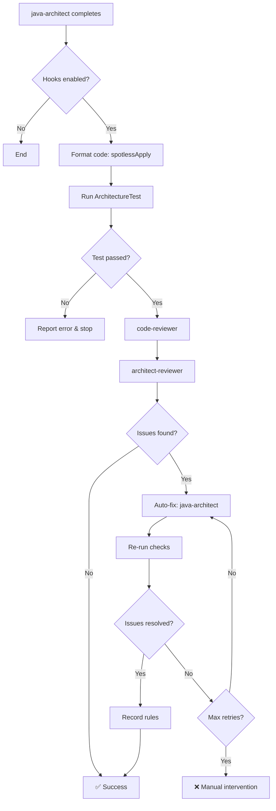

# Hooks System Usage Guide

**Version**: 2.4.0
**Last Updated**: 2026-01-21
**Status**: Production Ready

## Overview

The SmartAdmin hooks system provides automated code quality assurance through intelligent workflows that trigger after code implementation. This guide explains how to use, configure, and troubleshoot the hooks system.

## Table of Contents

1. [What Are Hooks?](#what-are-hooks)
2. [How It Works](#how-it-works)
3. [Configuration](#configuration)
4. [Usage](#usage)
5. [Troubleshooting](#troubleshooting)
6. [Performance Optimization](#performance-optimization)
7. [FAQ](#faq)

## What Are Hooks?

Hooks are automated workflows that trigger at specific points in the development cycle:

- **postAgentCompletion**: Runs after java-architect completes implementation
- **preCommit**: Runs before Git commits (via `.git/hooks/pre-commit`)

### Why Hooks?

Traditional code review workflows have problems:
- ❌ Manual reviews are time-consuming
- ❌ Easy to forget quality checks
- ❌ Inconsistent standards across team
- ❌ Issues found late in the process

Hooks solve these:
- ✅ Automated quality checks
- ✅ Consistent enforcement
- ✅ Immediate feedback
- ✅ Knowledge accumulation

## How It Works

### Workflow Overview



### Step-by-Step Process

#### Step 1: Code Formatting (5-10 seconds)

```bash
./gradlew spotlessApply
```

Automatically formats all Java code according to project standards.

#### Step 2: Architecture Validation (30-60 seconds)

```bash
./gradlew :sa-admin:test --tests ArchitectureTest
```

Validates:
- Layer boundaries (Controller → Service → Manager → Dao)
- Transaction placement (only in Manager)
- Dependency injection (constructor, not field)

#### Step 3: Code Quality Review (2-5 minutes)

Launches **code-reviewer** agent to check:
- Security vulnerabilities
- Performance issues
- Error handling
- Naming conventions
- Test coverage

#### Step 4: Architecture Review (2-5 minutes)

Launches **architect-reviewer** agent to check:
- Design patterns
- Scalability concerns
- Technical debt
- Module boundaries

#### Step 5: Auto-Fix Loop (if needed) (5-15 minutes per iteration, max 3)

If issues found:
1. Aggregate all issues
2. **java-architect** attempts to fix
3. Re-format code
4. Re-run tests
5. Re-review (back to Step 3)
6. Repeat until fixed or max retries (3)

#### Step 6: Rule Recording (1-2 minutes)

Successfully fixed issues are documented in:
`.claude/shared/knowledge/quality-standards.md`

## Configuration

### Main Configuration File

**Location**: `.claude/hooks.json`

```json
{
  "hooks": {
    "postAgentCompletion": {
      "java-architect": {
        "enabled": true,
        "sequential": true,
        "steps": [ ... ]
      }
    }
  }
}
```

### User Configuration

**Location**: `.claude/settings.local.json`

```json
{
  "hooksConfig": {
    "autoFix": {
      "enabled": true,           // Enable auto-fix
      "maxRetries": 3,           // Max fix attempts
      "failOnCritical": true,    // Block on critical issues
      "failOnMajor": false       // Allow major issues
    },
    "autoFormat": {
      "enabled": true,           // Auto-format after implementation
      "tool": "spotless"
    },
    "autoRecordRules": {
      "enabled": true,           // Auto-document fixed issues
      "minSeverity": "minor"     // Record all issues
    },
    "notifications": {
      "onSuccess": true,
      "onFailure": true,
      "onFixAttempt": true,
      "verbose": true            // Show detailed progress
    }
  }
}
```

### Enabling/Disabling Hooks

#### Disable All Hooks

Edit `.claude/hooks.json`:

```json
{
  "hooks": {
    "postAgentCompletion": {
      "java-architect": {
        "enabled": false    // Disable hooks
      }
    }
  }
}
```

#### Disable Auto-Fix Only

Edit `.claude/settings.local.json`:

```json
{
  "hooksConfig": {
    "autoFix": {
      "enabled": false    // Disable auto-fix, keep reviews
    }
  }
}
```

## Usage

### For Developers

#### Normal Workflow (Hooks Active)

1. Request java-architect to implement feature
2. **Hooks trigger automatically** after implementation
3. Watch progress (if notifications enabled)
4. Review results when complete

**Example**:
```
You: "Implement EmployeeService CRUD operations"
→ java-architect implements code
→ Hooks trigger (you'll see notifications)
→ Code is formatted
→ Tests run
→ Reviews performed
→ Issues auto-fixed (if any)
→ ✅ Complete (or ❌ manual intervention needed)
```

#### Emergency: Bypass Hooks

If hooks are causing issues or you need to commit quickly:

```bash
# In .claude/hooks.json, set:
"enabled": false

# Or bypass Git pre-commit hook:
git commit --no-verify
```

**⚠️ Warning**: Only bypass hooks in emergencies. Quality issues may be introduced.

### For Team Leads

#### Monitor Hook Success Rate

Check `.claude/shared/knowledge/quality-standards.md` for:
- Number of rules discovered
- Common issue patterns
- Team learning trends

#### Adjust Sensitivity

If hooks are too strict or lenient:

```json
{
  "issueDetection": {
    "failOnCritical": true,   // Always block critical
    "failOnMajor": false      // Allow major with warning
  }
}
```

#### Review Auto-Fixed Issues

All fixes are documented in:
- Individual commit messages
- `.claude/shared/knowledge/quality-standards.md`

## Troubleshooting

### Problem: Hooks Not Triggering

**Symptoms**: java-architect completes but no hooks run

**Diagnosis**:
1. Check `.claude/hooks.json` → `"enabled": true`
2. Verify Claude Code supports hooks (check version)
3. Check console for error messages

**Solution**:
```json
// In .claude/hooks.json
{
  "hooks": {
    "postAgentCompletion": {
      "java-architect": {
        "enabled": true    // Ensure this is true
      }
    }
  }
}
```

### Problem: Hooks Take Too Long

**Symptoms**: Hooks run for 15+ minutes

**Diagnosis**:
- Large codebase?
- Many issues found?
- Network latency?

**Solutions**:

**Option 1**: Reduce review scope
```json
{
  "hooks": {
    "postAgentCompletion": {
      "java-architect": {
        "steps": [
          // Comment out architecture-review to save time
          // {
          //   "id": "architecture-review",
          //   "type": "agent",
          //   "agent": "architect-reviewer"
          // }
        ]
      }
    }
  }
}
```

**Option 2**: Disable auto-fix for minor issues
```json
{
  "hooksConfig": {
    "autoFix": {
      "enabled": true,
      "minSeverity": "major"    // Only fix major+ issues
    }
  }
}
```

**Option 3**: Reduce max retries
```json
{
  "hooksConfig": {
    "autoFix": {
      "maxRetries": 1    // Default is 3
    }
  }
}
```

### Problem: Auto-Fix Fails Repeatedly

**Symptoms**: Same issue not fixed after 3 attempts

**Diagnosis**:
- Issue may require manual intervention
- Conflicting requirements
- Missing dependencies

**Solution**:
1. Review the issue details in hook output
2. Manually implement the fix
3. Document why auto-fix failed
4. Consider updating java-architect's fix patterns

### Problem: Git Pre-Commit Hook Fails

**Symptoms**: `git commit` blocked by hook

**Diagnosis**:
```bash
# Run checks manually
cd smart-admin-api-java21-springboot3
./gradlew spotlessCheck
./gradlew :sa-admin:test --tests ArchitectureTest
```

**Solutions**:

**Option 1**: Fix the issues (recommended)
```bash
# Fix formatting
./gradlew spotlessApply
git add -u

# Fix architecture violations
# Review errors, fix code, commit again
```

**Option 2**: Bypass hook (emergency only)
```bash
git commit --no-verify
```

### Problem: Hooks Report False Positives

**Symptoms**: Issues flagged that aren't actually problems

**Diagnosis**:
- Check issue details in review output
- Verify against SmartAdmin patterns
- May indicate pattern needs clarification

**Solution**:
1. Document the pattern in `.claude/shared/knowledge/quality-standards.md`
2. Update reviewer agent configurations if needed
3. Report to team lead for review

## Performance Optimization

### Baseline Performance

| Phase | Duration | Notes |
|-------|----------|-------|
| Format | 5-10s | Fast |
| Architecture Test | 30-60s | Fast |
| Code Review | 2-5min | Variable |
| Architecture Review | 2-5min | Variable |
| Auto-Fix (per iteration) | 5-15min | If issues found |

**Total Time**:
- No issues: ~5 minutes
- With minor issues (1 fix cycle): ~15 minutes
- With major issues (3 fix cycles): ~45 minutes

### Optimization Strategies

#### 1. Parallel Reviews (Future Enhancement)

Currently reviews run sequentially. Future version may support:
```json
{
  "steps": [
    {
      "id": "reviews",
      "type": "parallel",
      "steps": [
        { "id": "code-review", "type": "agent", "agent": "code-reviewer" },
        { "id": "architecture-review", "type": "agent", "agent": "architect-reviewer" }
      ]
    }
  ]
}
```

#### 2. Incremental Reviews

Only review changed files:
```json
{
  "hooks": {
    "postAgentCompletion": {
      "java-architect": {
        "reviewScope": "changed-files-only"    // Future feature
      }
    }
  }
}
```

#### 3. Caching Results

Cache review results for unchanged files:
```json
{
  "hooks": {
    "caching": {
      "enabled": true,
      "ttl": 3600    // 1 hour
    }
  }
}
```

## FAQ

### Q1: Can I disable hooks temporarily?

**A**: Yes, set `"enabled": false` in `.claude/hooks.json`.

### Q2: Do hooks run on every code change?

**A**: No, only when **java-architect** completes implementation. Manual edits don't trigger hooks.

### Q3: What if auto-fix introduces new bugs?

**A**: All fixes go through the same validation:
1. Code compiles
2. ArchitectureTest passes
3. Reviewers re-check

If a fix introduces issues, it will be caught in the re-review cycle.

### Q4: Can I customize which checks run?

**A**: Yes, edit the `steps` array in `.claude/hooks.json` to add/remove/reorder checks.

### Q5: Are hooks required?

**A**: No, but highly recommended for consistent quality. Git pre-commit hook provides minimum safety.

### Q6: What's the cost (API calls)?

**A**: Each hook run calls:
- code-reviewer (1 agent call)
- architect-reviewer (1 agent call)
- java-architect (per fix cycle, 0-3 calls)

Total: 2-8 agent calls per implementation.

### Q7: Can hooks work offline?

**A**: Partially. Local checks (formatting, tests) work offline. Reviews require API access.

### Q8: How do I update hooks configuration?

**A**: Edit `.claude/hooks.json` or `.claude/settings.local.json`, then restart Claude Code session.

## Best Practices

### Do's ✅

1. **Keep hooks enabled** for consistent quality
2. **Review hook output** to learn from issues
3. **Update quality standards** based on discovered rules
4. **Monitor hook success rate** to improve patterns
5. **Document bypass reasons** if you disable hooks

### Don'ts ❌

1. **Don't bypass hooks regularly** - defeats the purpose
2. **Don't ignore hook warnings** - they catch real issues
3. **Don't disable auto-fix** unless necessary - it saves time
4. **Don't modify hook code** without understanding impact
5. **Don't commit hook-blocked code** - fix issues first

## Support

### Getting Help

1. **Check this guide** for common issues
2. **Review hook output** for specific error messages
3. **Check `.claude/shared/knowledge/quality-standards.md`** for rules
4. **Consult team lead** for policy questions

### Reporting Issues

If you encounter bugs or have suggestions:

1. Document the issue:
   - What happened
   - What you expected
   - Steps to reproduce
   - Hook configuration used

2. Check existing issues in project tracker

3. Report to team with above information

## Version History

### v2.4.0 (2026-01-21)
- ✅ Initial hooks system implementation
- ✅ postAgentCompletion workflow
- ✅ Auto-fix with java-architect
- ✅ Rule recording to knowledge base
- ✅ Git pre-commit integration

### Future Versions

**v2.5.0** (Planned):
- Parallel reviews for faster execution
- Incremental review (changed files only)
- Fix template library

**v2.6.0** (Planned):
- Team rule library sync
- Statistics dashboard
- CI/CD integration

## Summary

The hooks system provides:
- ✅ **Automated quality assurance**
- ✅ **Consistent standards enforcement**
- ✅ **Immediate feedback**
- ✅ **Knowledge accumulation**
- ✅ **Time savings** (50%+ on reviews)

With proper configuration and usage, hooks will significantly improve code quality while reducing manual review time.

---

**Need more help?** See [Maintenance Guide](maintenance-guide.md) or contact your team lead.
