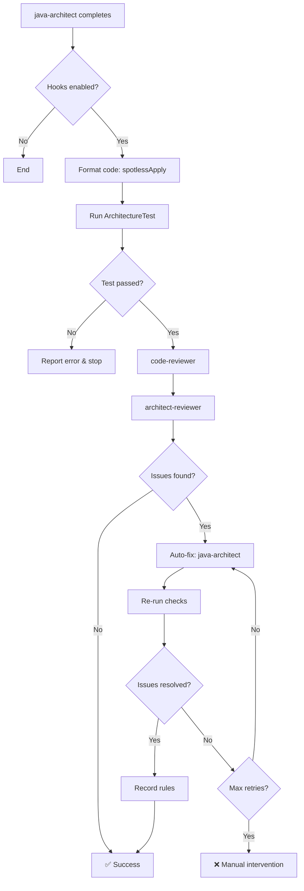
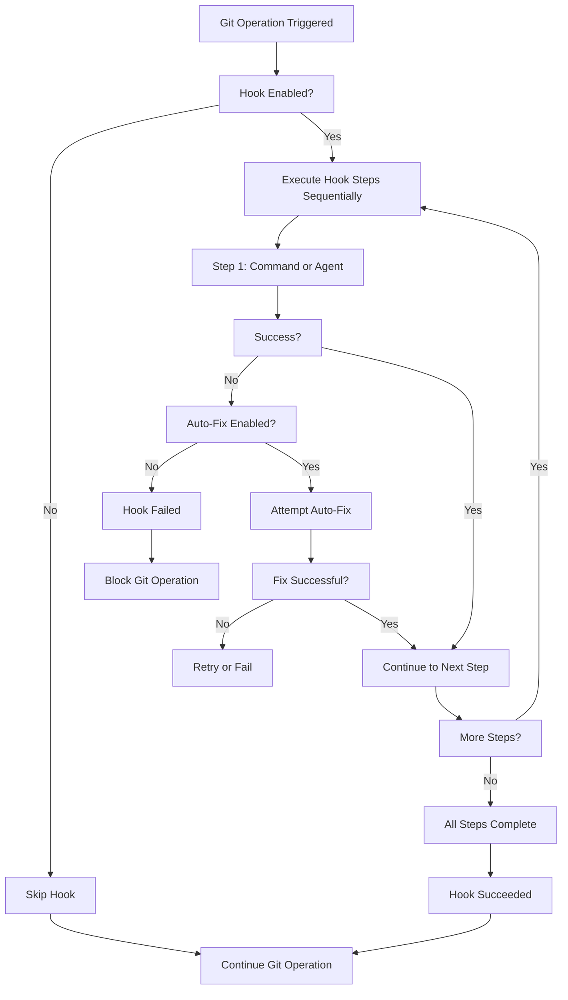

# Hooks System Usage Guide

**Version**: 2.4.0
**Last Updated**: 2026-01-21
**Status**: Production Ready

## Overview

The SmartAdmin hooks system provides automated code quality assurance through intelligent workflows that trigger after code implementation. This guide explains how to use, configure, and troubleshoot the hooks system.

## Table of Contents

1. [What Are Hooks?](#what-are-hooks)
2. [How It Works](#how-it-works)
3. [Configuration](#configuration)
4. [Usage](#usage)
5. [Troubleshooting](#troubleshooting)
6. [Performance Optimization](#performance-optimization)
7. [FAQ](#faq)

## What Are Hooks?

Hooks are automated workflows that trigger at specific points in the development cycle:

- **postAgentCompletion**: Runs after java-architect completes implementation
- **preCommit**: Runs before Git commits (via `.git/hooks/pre-commit`)

### Why Hooks?

Traditional code review workflows have problems:
- ❌ Manual reviews are time-consuming
- ❌ Easy to forget quality checks
- ❌ Inconsistent standards across team
- ❌ Issues found late in the process

Hooks solve these:
- ✅ Automated quality checks
- ✅ Consistent enforcement
- ✅ Immediate feedback
- ✅ Knowledge accumulation

## How It Works

### Workflow Overview



### Step-by-Step Process

#### Step 1: Code Formatting (5-10 seconds)

```bash
./gradlew spotlessApply
```

Automatically formats all Java code according to project standards.

#### Step 2: Architecture Validation (30-60 seconds)

```bash
./gradlew :sa-admin:test --tests ArchitectureTest
```

Validates:
- Layer boundaries (Controller → Service → Manager → Dao)
- Transaction placement (only in Manager)
- Dependency injection (constructor, not field)

#### Step 3: Code Quality Review (2-5 minutes)

Launches **code-reviewer** agent to check:
- Security vulnerabilities
- Performance issues
- Error handling
- Naming conventions
- Test coverage

#### Step 4: Architecture Review (2-5 minutes)

Launches **architect-reviewer** agent to check:
- Design patterns
- Scalability concerns
- Technical debt
- Module boundaries

#### Step 5: Auto-Fix Loop (if needed) (5-15 minutes per iteration, max 3)

If issues found:
1. Aggregate all issues
2. **java-architect** attempts to fix
3. Re-format code
4. Re-run tests
5. Re-review (back to Step 3)
6. Repeat until fixed or max retries (3)

#### Step 6: Rule Recording (1-2 minutes)

Successfully fixed issues are documented in:
`.claude/shared/knowledge/quality-standards.md`

## Configuration

### Main Configuration File

**Location**: `.claude/hooks.json`

```json
{
  "hooks": {
    "postAgentCompletion": {
      "java-architect": {
        "enabled": true,
        "sequential": true,
        "steps": [ ... ]
      }
    }
  }
}
```

### User Configuration

**Location**: `.claude/settings.local.json`

```json
{
  "hooksConfig": {
    "autoFix": {
      "enabled": true,           // Enable auto-fix
      "maxRetries": 3,           // Max fix attempts
      "failOnCritical": true,    // Block on critical issues
      "failOnMajor": false       // Allow major issues
    },
    "autoFormat": {
      "enabled": true,           // Auto-format after implementation
      "tool": "spotless"
    },
    "autoRecordRules": {
      "enabled": true,           // Auto-document fixed issues
      "minSeverity": "minor"     // Record all issues
    },
    "notifications": {
      "onSuccess": true,
      "onFailure": true,
      "onFixAttempt": true,
      "verbose": true            // Show detailed progress
    }
  }
}
```

### Enabling/Disabling Hooks

#### Disable All Hooks

Edit `.claude/hooks.json`:

```json
{
  "hooks": {
    "postAgentCompletion": {
      "java-architect": {
        "enabled": false    // Disable hooks
      }
    }
  }
}
```

#### Disable Auto-Fix Only

Edit `.claude/settings.local.json`:

```json
{
  "hooksConfig": {
    "autoFix": {
      "enabled": false    // Disable auto-fix, keep reviews
    }
  }
}
```

## Usage

### For Developers

#### Normal Workflow (Hooks Active)

1. Request java-architect to implement feature
2. **Hooks trigger automatically** after implementation
3. Watch progress (if notifications enabled)
4. Review results when complete

**Example**:
```
You: "Implement EmployeeService CRUD operations"
→ java-architect implements code
→ Hooks trigger (you'll see notifications)
→ Code is formatted
→ Tests run
→ Reviews performed
→ Issues auto-fixed (if any)
→ ✅ Complete (or ❌ manual intervention needed)
```

#### Emergency: Bypass Hooks

If hooks are causing issues or you need to commit quickly:

```bash
# In .claude/hooks.json, set:
"enabled": false

# Or bypass Git pre-commit hook:
git commit --no-verify
```

**⚠️ Warning**: Only bypass hooks in emergencies. Quality issues may be introduced.

### For Team Leads

#### Monitor Hook Success Rate

Check `.claude/shared/knowledge/quality-standards.md` for:
- Number of rules discovered
- Common issue patterns
- Team learning trends

#### Adjust Sensitivity

If hooks are too strict or lenient:

```json
{
  "issueDetection": {
    "failOnCritical": true,   // Always block critical
    "failOnMajor": false      // Allow major with warning
  }
}
```

#### Review Auto-Fixed Issues

All fixes are documented in:
- Individual commit messages
- `.claude/shared/knowledge/quality-standards.md`

## Troubleshooting

For comprehensive hook troubleshooting, see [Troubleshooting Guide](troubleshooting-guide.md#4-hook-system-issues).

**Quick fixes**:

- **Hooks not triggering?** Check `.claude/hooks.json` → `"enabled": true` and restart your Claude Code session
- **Hooks too slow?** Reduce auto-fix attempts in `.claude/settings.local.json` → `hooksConfig.autoFix.maxRetries: 1`, or disable non-critical review steps
- **Auto-fix fails repeatedly?** May require manual intervention - review the specific issue details and implement the fix manually
- **Git pre-commit blocked?** Run `./gradlew spotlessApply` to fix formatting, or use `git commit --no-verify` in emergencies only

See [Troubleshooting Guide](troubleshooting-guide.md#4-hook-system-issues) for:
- Detailed diagnosis steps
- Complete solutions for all hook issues
- Prevention strategies
- Advanced troubleshooting techniques

## Performance Optimization

### Baseline Performance

| Phase | Duration | Notes |
|-------|----------|-------|
| Format | 5-10s | Fast |
| Architecture Test | 30-60s | Fast |
| Code Review | 2-5min | Variable |
| Architecture Review | 2-5min | Variable |
| Auto-Fix (per iteration) | 5-15min | If issues found |

**Total Time**:
- No issues: ~5 minutes
- With minor issues (1 fix cycle): ~15 minutes
- With major issues (3 fix cycles): ~45 minutes

### Optimization Strategies

#### 1. Parallel Reviews (Future Enhancement)

Currently reviews run sequentially. Future version may support:
```json
{
  "steps": [
    {
      "id": "reviews",
      "type": "parallel",
      "steps": [
        { "id": "code-review", "type": "agent", "agent": "code-reviewer" },
        { "id": "architecture-review", "type": "agent", "agent": "architect-reviewer" }
      ]
    }
  ]
}
```

#### 2. Incremental Reviews

Only review changed files:
```json
{
  "hooks": {
    "postAgentCompletion": {
      "java-architect": {
        "reviewScope": "changed-files-only"    // Future feature
      }
    }
  }
}
```

#### 3. Caching Results

Cache review results for unchanged files:
```json
{
  "hooks": {
    "caching": {
      "enabled": true,
      "ttl": 3600    // 1 hour
    }
  }
}
```

## FAQ

### Q1: Can I disable hooks temporarily?

**A**: Yes, set `"enabled": false` in `.claude/hooks.json`.

### Q2: Do hooks run on every code change?

**A**: No, only when **java-architect** completes implementation. Manual edits don't trigger hooks.

### Q3: What if auto-fix introduces new bugs?

**A**: All fixes go through the same validation:
1. Code compiles
2. ArchitectureTest passes
3. Reviewers re-check

If a fix introduces issues, it will be caught in the re-review cycle.

### Q4: Can I customize which checks run?

**A**: Yes, edit the `steps` array in `.claude/hooks.json` to add/remove/reorder checks.

### Q5: Are hooks required?

**A**: No, but highly recommended for consistent quality. Git pre-commit hook provides minimum safety.

### Q6: What's the cost (API calls)?

**A**: Each hook run calls:
- code-reviewer (1 agent call)
- architect-reviewer (1 agent call)
- java-architect (per fix cycle, 0-3 calls)

Total: 2-8 agent calls per implementation.

### Q7: Can hooks work offline?

**A**: Partially. Local checks (formatting, tests) work offline. Reviews require API access.

### Q8: How do I update hooks configuration?

**A**: Edit `.claude/hooks.json` or `.claude/settings.local.json`, then restart Claude Code session.

## Best Practices

### Do's ✅

1. **Keep hooks enabled** for consistent quality
2. **Review hook output** to learn from issues
3. **Update quality standards** based on discovered rules
4. **Monitor hook success rate** to improve patterns
5. **Document bypass reasons** if you disable hooks

### Don'ts ❌

1. **Don't bypass hooks regularly** - defeats the purpose
2. **Don't ignore hook warnings** - they catch real issues
3. **Don't disable auto-fix** unless necessary - it saves time
4. **Don't modify hook code** without understanding impact
5. **Don't commit hook-blocked code** - fix issues first

## Support

### Getting Help

1. **Check this guide** for common issues
2. **Review hook output** for specific error messages
3. **Check `.claude/shared/knowledge/quality-standards.md`** for rules
4. **Consult team lead** for policy questions

### Reporting Issues

If you encounter bugs or have suggestions:

1. Document the issue:
   - What happened
   - What you expected
   - Steps to reproduce
   - Hook configuration used

2. Check existing issues in project tracker

3. Report to team with above information

## Custom Hook Development

### Understanding Hook Architecture

#### Hook Lifecycle



#### When Hooks Execute

**Git Pre-Commit Hook**:
- Triggers: `git commit`
- Executes: Before commit is created
- Can block: Yes (commit fails if hook fails)
- Use for: Code quality, formatting, linting

**Git Pre-Push Hook**:
- Triggers: `git push`
- Executes: Before push to remote
- Can block: Yes (push fails if hook fails)
- Use for: Integration tests, security scans

**Post-Agent-Completion Hook**:
- Triggers: Agent completes task
- Executes: After agent finishes work
- Can block: No (advisory only)
- Use for: Quality checks, documentation validation

#### Hook Step Types

**Type 1: Command Step**
```json
{
  "name": "format-check",
  "type": "command",
  "command": "./gradlew spotlessCheck",
  "timeout": 60000,
  "continueOnError": false
}
```

**Type 2: Agent Step**
```json
{
  "name": "code-review",
  "type": "agent",
  "agent": "code-reviewer",
  "prompt": "Review changes for quality issues",
  "autoFix": true,
  "maxAttempts": 3
}
```

**Type 3: Conditional Step** (Planned)
```json
{
  "name": "integration-tests",
  "type": "command",
  "command": "./gradlew integrationTest",
  "condition": "changedFiles.some(f => f.includes('/controller/'))"
}
```

---

### Creating Custom Hooks

#### Use Case 1: Add Security Scanning Hook

**Goal**: Scan dependencies for known vulnerabilities before commit

**Step 1: Configure OWASP Dependency Check**

```groovy
// build.gradle

plugins {
    id 'org.owasp.dependencycheck' version '8.4.0'
}

dependencyCheck {
    autoUpdate = true
    format = 'JSON'
    outputDirectory = 'build/reports/dependency-check'
    failBuildOnCVSS = 7  // Fail on HIGH and CRITICAL
}
```

**Step 2: Add Hook to settings.local.json**

```json
{
  "hooks": {
    "pre-commit": {
      "enabled": true,
      "steps": [
        {
          "name": "dependency-security-scan",
          "type": "command",
          "command": "./gradlew dependencyCheckAnalyze",
          "timeout": 300000,
          "continueOnError": false,
          "description": "Scan dependencies for known vulnerabilities"
        }
      ]
    }
  }
}
```

**Step 3: Test the Hook**

```bash
# Test manually first
./gradlew dependencyCheckAnalyze

# Check report
cat build/reports/dependency-check/dependency-check-report.json

# Test hook execution
echo "test" >> README.md
git add README.md
git commit -m "test: verify security scan hook"

# Expected: Hook executes security scan before commit
```

**Full Working Example**:

```json
// .claude/settings.local.json

{
  "hooks": {
    "pre-commit": {
      "enabled": true,
      "timeout": 600000,
      "steps": [
        // Existing steps...
        {
          "name": "format-check",
          "type": "command",
          "command": "./gradlew spotlessCheck",
          "timeout": 60000
        },

        // NEW: Security scan
        {
          "name": "dependency-security-scan",
          "type": "command",
          "command": "./gradlew dependencyCheckAnalyze",
          "timeout": 300000,
          "continueOnError": false,
          "description": "OWASP dependency check for vulnerabilities",
          "notification": {
            "onFailure": "Security vulnerabilities detected. Review build/reports/dependency-check/"
          }
        }
      ]
    }
  }
}
```

---

#### Use Case 2: Add Custom Linting Hook

**Goal**: Validate SmartAdmin-specific patterns before commit

**Step 1: Create Validation Script**

```bash
#!/bin/bash
# File: .claude/scripts/validate-smartadmin-patterns.sh

echo "Validating SmartAdmin patterns..."

VIOLATIONS=0

# Check 1: @TableName annotations
echo "Checking @TableName annotations..."
FILES=$(git diff --cached --name-only --diff-filter=ACM | grep "Entity.java$")
for FILE in $FILES; do
    if ! grep -q "@TableName" "$FILE"; then
        echo "❌ $FILE: Missing @TableName annotation"
        VIOLATIONS=$((VIOLATIONS + 1))
    fi
done

# Check 2: ResponseDTO usage
echo "Checking ResponseDTO usage in controllers..."
FILES=$(git diff --cached --name-only --diff-filter=ACM | grep "Controller.java$")
for FILE in $FILES; do
    # Check if public methods return ResponseDTO
    NON_RESPONSEDTO=$(grep -n "public.*{" "$FILE" | grep -v "ResponseDTO" | grep -v "void" | wc -l)
    if [ "$NON_RESPONSEDTO" -gt 0 ]; then
        echo "⚠️  $FILE: Some methods may not return ResponseDTO"
        VIOLATIONS=$((VIOLATIONS + 1))
    fi
done

# Check 3: @Transactional placement
echo "Checking @Transactional in Manager layer only..."
FILES=$(git diff --cached --name-only --diff-filter=ACM | grep "Service.java$")
for FILE in $FILES; do
    if grep -q "@Transactional" "$FILE"; then
        echo "❌ $FILE: @Transactional found in Service layer (should be Manager layer only)"
        VIOLATIONS=$((VIOLATIONS + 1))
    fi
done

# Check 4: @Autowired field injection (anti-pattern)
echo "Checking for @Autowired field injection..."
FILES=$(git diff --cached --name-only --diff-filter=ACM | grep ".java$")
for FILE in $FILES; do
    AUTOWIRED_FIELDS=$(grep -c "^[[:space:]]*@Autowired[[:space:]]*$" "$FILE" 2>/dev/null || echo 0)
    if [ "$AUTOWIRED_FIELDS" -gt 0 ]; then
        echo "❌ $FILE: Uses @Autowired field injection (use constructor injection)"
        VIOLATIONS=$((VIOLATIONS + 1))
    fi
done

# Summary
echo ""
echo "===================================="
if [ "$VIOLATIONS" -eq 0 ]; then
    echo "✅ All SmartAdmin pattern checks passed"
    exit 0
else
    echo "❌ Found $VIOLATIONS SmartAdmin pattern violations"
    echo "===================================="
    exit 1
fi
```

**Step 2: Make Script Executable**

```bash
chmod +x .claude/scripts/validate-smartadmin-patterns.sh
```

**Step 3: Add Hook Configuration**

```json
{
  "hooks": {
    "pre-commit": {
      "enabled": true,
      "steps": [
        {
          "name": "smartadmin-pattern-validation",
          "type": "command",
          "command": "bash .claude/scripts/validate-smartadmin-patterns.sh",
          "timeout": 30000,
          "continueOnError": false,
          "description": "Validate SmartAdmin coding patterns"
        }
      ]
    }
  }
}
```

**Step 4: Test**

```bash
# Test with valid code
git add ValidController.java
git commit -m "test: valid patterns"
# Expected: ✅ All checks pass

# Test with invalid code (missing @TableName)
# Create test file without @TableName
git add InvalidEntity.java
git commit -m "test: invalid patterns"
# Expected: ❌ Commit blocked with violations listed
```

---

#### Use Case 3: Add Performance Benchmark Hook

**Goal**: Ensure new code doesn't regress performance

**Step 1: Create Benchmark Script**

```bash
#!/bin/bash
# File: .claude/scripts/performance-benchmark.sh

echo "Running performance benchmarks..."

# Run performance tests
./gradlew :sa-admin:performanceTest --tests "*Benchmark*"

# Extract results
RESULTS_FILE="build/reports/performance/benchmark-results.json"

if [ ! -f "$RESULTS_FILE" ]; then
    echo "❌ Benchmark results not found"
    exit 1
fi

# Parse results (simplified)
CURRENT_P95=$(jq '.p95_ms' "$RESULTS_FILE")
BASELINE_P95=100  # Baseline from previous benchmark

echo "Current P95: ${CURRENT_P95}ms"
echo "Baseline P95: ${BASELINE_P95}ms"

# Check for regression (>10% slower)
THRESHOLD=$(echo "$BASELINE_P95 * 1.10" | bc)

if (( $(echo "$CURRENT_P95 > $THRESHOLD" | bc -l) )); then
    echo "❌ Performance regression detected"
    echo "   Current: ${CURRENT_P95}ms exceeds threshold: ${THRESHOLD}ms"
    exit 1
else
    echo "✅ Performance benchmarks passed"
    exit 0
fi
```

**Step 2: Add Gradle Task**

```groovy
// build.gradle

tasks.register('performanceTest', Test) {
    useJUnitPlatform {
        includeTags 'performance'
    }
    outputs.upToDateWhen { false }  // Always run
}
```

**Step 3: Create Baseline**

```bash
# Run benchmarks to establish baseline
./gradlew :sa-admin:performanceTest
# Save results as baseline
cp build/reports/performance/benchmark-results.json \
   .claude/baselines/performance-baseline.json
```

**Step 4: Add Hook**

```json
{
  "hooks": {
    "pre-push": {
      "enabled": true,
      "steps": [
        {
          "name": "performance-benchmark",
          "type": "command",
          "command": "bash .claude/scripts/performance-benchmark.sh",
          "timeout": 300000,
          "continueOnError": false,
          "description": "Validate performance benchmarks",
          "notification": {
            "onFailure": "Performance regression detected. Review benchmark report."
          }
        }
      ]
    }
  }
}
```

---

### Hook Configuration API Reference

#### settings.local.json Schema

```json
{
  "hooks": {
    "enabled": true,           // Global enable/disable

    "pre-commit": {
      "enabled": true,         // Hook-specific enable
      "timeout": 600000,       // Max execution time (ms)

      "steps": [
        {
          "name": "step-name",           // Unique identifier
          "type": "command",             // "command" or "agent"
          "command": "bash script.sh",   // Command to execute
          "timeout": 60000,              // Step timeout (ms)
          "continueOnError": false,      // Continue if fails
          "description": "What it does", // Human-readable

          "notification": {
            "onSuccess": "Success message",
            "onFailure": "Failure message"
          }
        }
      ]
    },

    "pre-push": { /* same structure */ },
    "post-agent-completion": { /* same structure */ },

    "autoFix": {
      "enabled": true,
      "maxAttempts": 3,
      "timeout": 300000,
      "minSeverity": "minor",     // "minor", "major", "critical"
      "agent": "java-architect"
    },

    "autoFormat": {
      "enabled": true,
      "formatters": {
        "java": "./gradlew spotlessApply",
        "javascript": "npm run format",
        "markdown": "prettier --write"
      }
    },

    "autoRecordRules": {
      "enabled": true,
      "knowledgeBase": ".claude/shared/knowledge/quality-standards.md",
      "section": "## Automated Quality Rules"
    },

    "notifications": {
      "enabled": true,
      "channels": ["console", "file"],
      "logFile": ".claude/hooks/hook-execution.log"
    },

    "issueDetection": {
      "enabled": true,
      "severity": {
        "critical": ["security", "data-loss"],
        "major": ["performance", "correctness"],
        "minor": ["style", "convention"]
      }
    }
  }
}
```

---

### Advanced Hook Patterns

#### Pattern 1: Multi-Stage Validation (Fast → Slow)

**Goal**: Run fast checks first, slow checks only if fast checks pass

```json
{
  "hooks": {
    "pre-commit": {
      "enabled": true,
      "steps": [
        // Stage 1: Fast checks (<10 seconds)
        {
          "name": "syntax-check",
          "command": "./gradlew compileJava",
          "timeout": 10000
        },
        {
          "name": "format-check",
          "command": "./gradlew spotlessCheck",
          "timeout": 5000
        },

        // Stage 2: Medium checks (<60 seconds)
        {
          "name": "unit-tests",
          "command": "./gradlew test -x integrationTest",
          "timeout": 60000
        },

        // Stage 3: Slow checks (if previous stages pass)
        {
          "name": "architecture-validation",
          "command": "./gradlew test --tests ArchitectureTest",
          "timeout": 30000
        },
        {
          "name": "code-review",
          "type": "agent",
          "agent": "code-reviewer",
          "prompt": "Review for quality issues",
          "timeout": 120000
        }
      ]
    }
  }
}
```

**Benefits**:
- Fail fast on simple issues
- Don't waste time on slow checks if fast checks fail
- Provide immediate feedback

---

#### Pattern 2: Conditional Hook Execution (Planned Feature)

**Goal**: Run hooks based on what files changed

```json
{
  "hooks": {
    "pre-commit": {
      "enabled": true,
      "steps": [
        {
          "name": "backend-tests",
          "command": "./gradlew :sa-admin:test",
          "condition": "hasChanges('**/*.java')",
          "timeout": 60000
        },
        {
          "name": "frontend-tests",
          "command": "npm run test",
          "condition": "hasChanges('smart-admin-web/**/*')",
          "timeout": 60000
        },
        {
          "name": "database-migration-validation",
          "command": "./gradlew flywayValidate",
          "condition": "hasChanges('**/db/migration/**')",
          "timeout": 30000
        }
      ]
    }
  }
}
```

**Benefits**:
- Run only relevant hooks
- Faster execution
- Reduced resource usage

---

#### Pattern 3: Parallel Review Execution (Planned Feature)

**Goal**: Run multiple reviews in parallel for speed

```json
{
  "hooks": {
    "post-agent-completion": {
      "enabled": true,
      "parallelSteps": [
        {
          "name": "code-quality-review",
          "type": "agent",
          "agent": "code-reviewer",
          "prompt": "Review for code quality"
        },
        {
          "name": "architecture-review",
          "type": "agent",
          "agent": "architect-reviewer",
          "prompt": "Review for architecture"
        },
        {
          "name": "security-review",
          "type": "agent",
          "agent": "code-reviewer",
          "prompt": "Review for security issues"
        }
      ],
      "waitForAll": true,
      "timeout": 300000
    }
  }
}
```

**Benefits**:
- 3x faster than sequential (if independent)
- Comprehensive review coverage
- Efficient resource usage

---

### Hook Error Handling

#### Error Codes

| Code Range | Meaning | Example |
|------------|---------|---------|
| 0 | Success | All checks passed |
| 1-99 | Command failed | Test failures, linting errors |
| 100-199 | Agent invocation error | Agent timeout, agent not found |
| 200-299 | Configuration error | Invalid JSON, missing files |
| 300-399 | System error | Out of memory, disk full |

#### Retry Strategy (Future Feature)

```json
{
  "hooks": {
    "autoFix": {
      "enabled": true,
      "retryStrategy": {
        "maxAttempts": 3,
        "backoff": "exponential",
        "initialDelay": 1000,
        "maxDelay": 10000
      }
    }
  }
}
```

---

### Debugging Hooks

#### Enable Verbose Logging

```json
{
  "hooks": {
    "debug": {
      "enabled": true,
      "verbose": true,
      "logLevel": "debug",
      "logFile": ".claude/hooks/debug.log"
    }
  }
}
```

#### Dry Run Mode (Future Feature)

```bash
# Test hooks without executing
claude-code hooks --dry-run

# Output shows what would execute
Hook: pre-commit
  Step 1: format-check [WOULD RUN: ./gradlew spotlessCheck]
  Step 2: unit-tests [WOULD RUN: ./gradlew test]
```

#### Manual Hook Execution (Future Feature)

```bash
# Run specific hook manually
claude-code hooks run pre-commit

# Run specific step
claude-code hooks run pre-commit --step format-check
```

---

### Hook Performance Metrics

#### Track Execution Time

```json
{
  "hooks": {
    "metrics": {
      "enabled": true,
      "outputFile": ".claude/hooks/metrics.json",
      "format": "json"
    }
  }
}
```

#### Metrics Output Format

```json
{
  "hookName": "pre-commit",
  "executionDate": "2026-01-21T10:30:00Z",
  "totalDuration": 45000,
  "steps": [
    {
      "name": "format-check",
      "duration": 5000,
      "status": "success"
    },
    {
      "name": "unit-tests",
      "duration": 35000,
      "status": "success"
    },
    {
      "name": "code-review",
      "duration": 5000,
      "status": "success"
    }
  ]
}
```

#### Performance Analysis

```bash
# Analyze hook performance over time
cat .claude/hooks/metrics.json | jq '[.steps[] | {name, avgDuration: .duration}]'

# Identify slow steps
cat .claude/hooks/metrics.json | jq '.steps | sort_by(.duration) | reverse'
```

---

### Best Practices

#### DO ✅

1. **Test Hooks Independently**
   ```bash
   # Test script directly before adding to hook
   bash .claude/scripts/validate-patterns.sh

   # Verify exit codes
   echo $?  # Should be 0 for success
   ```

2. **Set Appropriate Timeouts**
   ```json
   // Fast checks: 5-10 seconds
   { "name": "lint", "timeout": 10000 }

   // Unit tests: 30-60 seconds
   { "name": "test", "timeout": 60000 }

   // Integration tests: 2-5 minutes
   { "name": "integration-test", "timeout": 300000 }
   ```

3. **Provide Clear Error Messages**
   ```bash
   # GOOD:
   echo "❌ Found 5 violations in EmployeeController.java:
      - Line 23: Missing @SaCheckPermission
      - Line 45: Non-ResponseDTO return type"

   # BAD:
   echo "Error in controller"
   ```

4. **Use Incremental Checks**
   ```bash
   # Check only changed files, not entire codebase
   git diff --cached --name-only --diff-filter=ACM | grep ".java$"
   ```

5. **Document Hook Purpose**
   ```json
   {
     "name": "security-scan",
     "description": "OWASP dependency check to prevent vulnerable dependencies",
     "rationale": "Catch security issues before they reach production"
   }
   ```

#### DON'T ❌

1. **Don't Create Untested Hooks**
   ```bash
   # Never add hook without testing it first
   # ALWAYS test manually before enabling
   ```

2. **Don't Make Hooks Too Slow**
   ```bash
   # Bad: Run full integration test suite in pre-commit
   #      (Takes 10+ minutes, blocks commits)

   # Good: Run fast unit tests in pre-commit (<60s)
   #       Run integration tests in pre-push or CI
   ```

3. **Don't Use Hardcoded Paths**
   ```bash
   # Bad:
   /Users/john/projects/smart-admin/gradlew test

   # Good:
   ./gradlew test
   # (Relative to repository root)
   ```

4. **Don't Suppress All Errors**
   ```json
   // Bad: Ignores all failures
   { "name": "test", "continueOnError": true }

   // Good: Fail on critical issues
   { "name": "test", "continueOnError": false }
   ```

5. **Don't Duplicate CI Checks**
   ```markdown
   Pre-commit: Fast, essential checks only
   Pre-push: Medium checks (integration tests)
   CI: Comprehensive checks (security, performance, full suite)

   Avoid running everything everywhere (wasteful)
   ```

---

## Version History

### v2.4.0 (2026-01-21)
- ✅ Initial hooks system implementation
- ✅ postAgentCompletion workflow
- ✅ Auto-fix with java-architect
- ✅ Rule recording to knowledge base
- ✅ Git pre-commit integration

### Future Versions

**v2.5.0** (Planned):
- Parallel reviews for faster execution
- Incremental review (changed files only)
- Fix template library

**v2.6.0** (Planned):
- Team rule library sync
- Statistics dashboard
- CI/CD integration

## Summary

The hooks system provides:
- ✅ **Automated quality assurance**
- ✅ **Consistent standards enforcement**
- ✅ **Immediate feedback**
- ✅ **Knowledge accumulation**
- ✅ **Time savings** (50%+ on reviews)

With proper configuration and usage, hooks will significantly improve code quality while reducing manual review time.

---

**Need more help?** See [Maintenance Guide](maintenance-guide.md) or contact your team lead.
