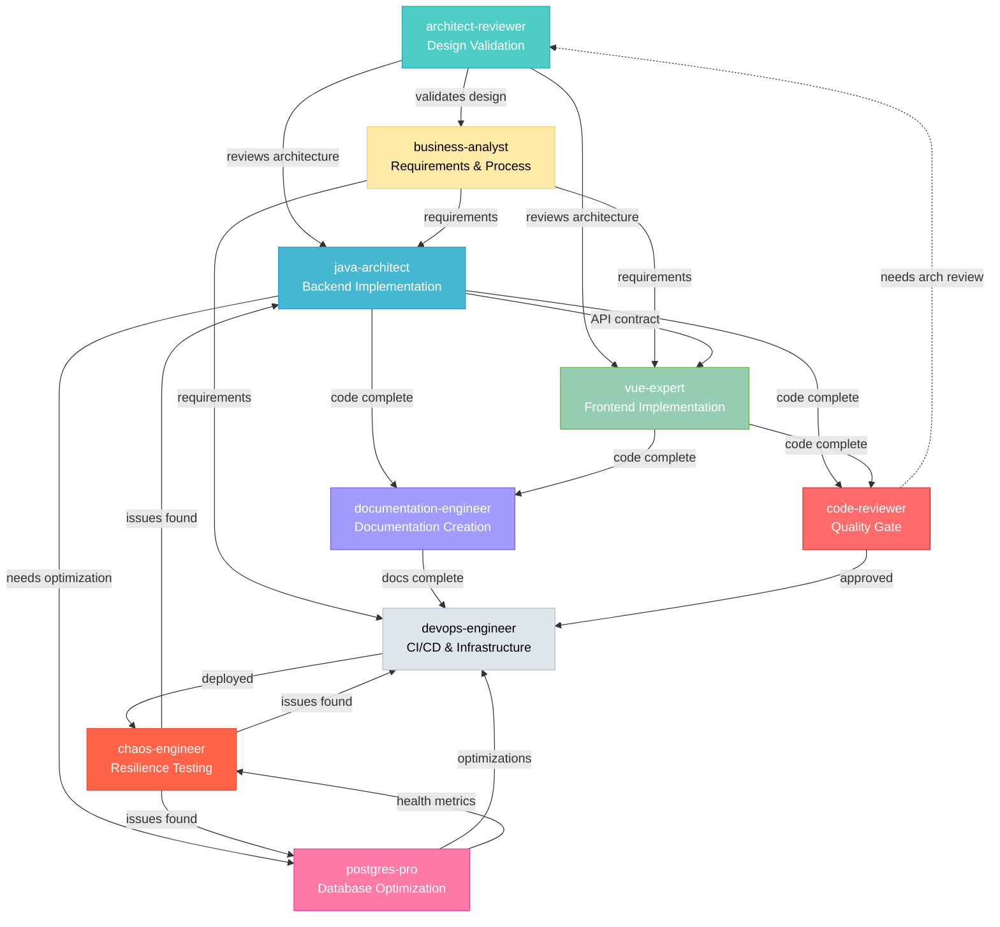
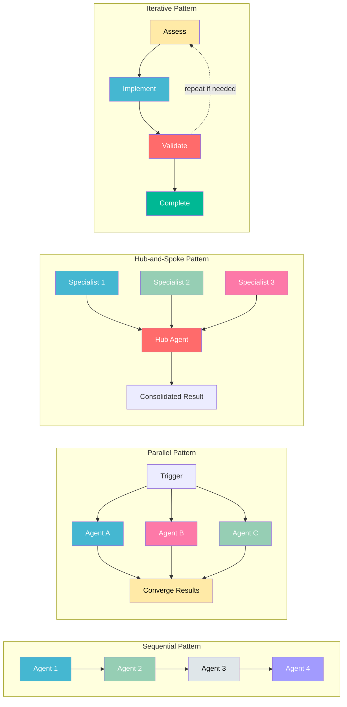

# Agent Dependencies & Collaboration

**Purpose:** Define how agents depend on each other and collaborate effectively.

## Dependency Graph

### Agent Dependency Flow



### Collaboration Patterns



## Agent-to-Agent Dependencies

### java-architect Dependencies

**Depends On:**
- **business-analyst** (requirements input)
  - Needs: User stories, business rules, acceptance criteria
  - Before: Starting implementation
  - Format: Written requirements, API contracts

**Collaborates With:**
- **postgres-pro** (database optimization)
  - When: Complex queries, performance issues
  - Exchange: Query patterns, index recommendations
  - Format: SQL queries, execution plans

- **devops-engineer** (deployment coordination)
  - When: Configuration changes, new features
  - Exchange: Application configs, resource requirements
  - Format: application.yml, environment variables

**Feeds Into:**
- **vue-expert** (backend API contracts)
  - Provides: API documentation, Request/Response DTOs, permission requirements
  - When: Backend API complete
  - Format: Swagger docs, API contracts, test data

- **chaos-engineer** (code for testing)
  - Provides: Critical code paths, error handling
  - When: Feature complete
  - Format: Code locations, failure scenarios

### business-analyst Dependencies

**Depends On:**
- **No direct dependencies** (starts the chain)

**Collaborates With:**
- **java-architect** (technical feasibility)
  - When: Defining requirements
  - Exchange: Feasibility assessment, complexity estimates
  - Format: Requirements ↔ technical constraints

- **devops-engineer** (operational requirements)
  - When: Defining NFRs (performance, availability)
  - Exchange: SLAs, monitoring needs
  - Format: Performance targets, uptime requirements

- **chaos-engineer** (resilience requirements)
  - When: Critical business processes
  - Exchange: Recovery objectives (RTO/RPO)
  - Format: Business impact analysis

**Feeds Into:**
- **java-architect** (requirements for implementation)
- **All agents** (context and priorities)

### devops-engineer Dependencies

**Depends On:**
- **java-architect** (application code)
  - Needs: Build artifacts, configuration requirements
  - Before: Deployment
  - Format: JAR files, Dockerfiles, configs

- **postgres-pro** (database requirements)
  - Needs: Database schema, migration scripts
  - Before: Infrastructure provisioning
  - Format: SQL scripts, connection requirements

**Collaborates With:**
- **java-architect** (application configuration)
  - When: Deployment setup, environment configs
  - Exchange: JVM parameters, connection pools
  - Format: application-{env}.yml

- **postgres-pro** (database infrastructure)
  - When: Database deployment, backups
  - Exchange: Infrastructure specs, backup schedules
  - Format: Terraform configs, backup procedures

- **chaos-engineer** (chaos infrastructure)
  - When: Setting up chaos testing
  - Exchange: Monitoring setup, rollback automation
  - Format: Kubernetes configs, alert rules

**Feeds Into:**
- **chaos-engineer** (deployed system for testing)
- **business-analyst** (deployment metrics, uptime data)

### vue-expert Dependencies

**Depends On:**
- **business-analyst** (UI/UX requirements)
  - Needs: User workflows, UI mockups, interaction patterns
  - Before: Starting frontend implementation
  - Format: User stories, wireframes, acceptance criteria

- **java-architect** (backend API contracts)
  - Needs: API endpoints, Request/Response models, permissions
  - Before: API integration
  - Format: Swagger/OpenAPI docs, sample requests, test data

**Collaborates With:**
- **java-architect** (API alignment)
  - When: Integrating frontend with backend
  - Exchange: Request/Response structure validation, permission alignment
  - Format: TypeScript interfaces ↔ Java DTOs, v-privilege ↔ @SaCheckPermission

- **devops-engineer** (frontend deployment)
  - When: Frontend build configuration
  - Exchange: Build artifacts, environment configs, CDN setup
  - Format: Vite configs, environment variables, deployment scripts

- **business-analyst** (UI feedback)
  - When: Reviewing implemented UI
  - Exchange: User workflow validation, UI improvement suggestions
  - Format: Screenshots, interactive prototypes

**Feeds Into:**
- **devops-engineer** (frontend build artifacts)
  - Provides: Built static files, deployment configs
  - When: Frontend complete
  - Format: dist/ folder, nginx configs, environment files

### postgres-pro Dependencies

**Depends On:**
- **java-architect** (application queries)
  - Needs: Query patterns, data access code
  - Before: Optimization
  - Format: MyBatis XML, LambdaQueryWrapper code

**Collaborates With:**
- **java-architect** (query optimization)
  - When: Performance issues, complex queries
  - Exchange: Optimized queries, index recommendations
  - Format: SQL, EXPLAIN ANALYZE output

- **devops-engineer** (database infrastructure)
  - When: Database deployment, monitoring
  - Exchange: Infrastructure requirements, metrics
  - Format: Resource specs, monitoring queries

- **chaos-engineer** (database resilience)
  - When: Testing failover, replication lag
  - Exchange: Database health metrics, failure scenarios
  - Format: SQL scripts, monitoring queries

**Feeds Into:**
- **java-architect** (optimized query patterns)
- **devops-engineer** (database health metrics)
- **chaos-engineer** (database failure scenarios)

### chaos-engineer Dependencies

**Depends On:**
- **java-architect** (application code)
  - Needs: Critical paths, error handling logic
  - Before: Designing experiments
  - Format: Code walkthrough, architecture diagram

- **postgres-pro** (database architecture)
  - Needs: Replication setup, backup procedures
  - Before: Database chaos experiments
  - Format: Database topology, health checks

- **devops-engineer** (infrastructure)
  - Needs: Deployment architecture, monitoring
  - Before: Infrastructure chaos
  - Format: Infrastructure diagram, rollback procedures

**Collaborates With:**
- **All technical agents** (experiment design)
  - When: Designing chaos scenarios
  - Exchange: Failure modes, expected behavior
  - Format: Experiment plans, success criteria

**Feeds Into:**
- **java-architect** (resilience improvements)
- **postgres-pro** (database resilience patterns)
- **devops-engineer** (infrastructure improvements)
- **business-analyst** (resilience reports, risk assessments)

### architect-reviewer Dependencies

**Depends On:**
- **java-architect** (code for architecture review)
  - Needs: Current architecture, module structure, layer implementations
  - Before: Starting architecture review
  - Format: Code walkthrough, architecture diagrams, dependency analysis

- **vue-expert** (frontend architecture)
  - Needs: Frontend architecture patterns, component structure
  - Before: Full-stack architecture review
  - Format: Component hierarchy, state management patterns

**Collaborates With:**
- **java-architect** (architecture validation)
  - When: Reviewing layered architecture, module boundaries
  - Exchange: Architecture compliance findings, refactoring recommendations
  - Format: Architecture review report, violation list

- **postgres-pro** (database architecture)
  - When: Reviewing database schema design, query patterns
  - Exchange: Database architecture assessment, optimization recommendations
  - Format: Schema review, index strategy

- **devops-engineer** (infrastructure architecture)
  - When: Reviewing deployment architecture, scalability
  - Exchange: Infrastructure recommendations, scaling strategies
  - Format: Architecture assessment, capacity planning

**Feeds Into:**
- **java-architect** (refactoring priorities)
  - Provides: Architecture violations, recommended patterns, technical debt priorities
  - When: Architecture review complete
  - Format: Architecture review report, refactoring roadmap

- **business-analyst** (technical debt assessment)
  - Provides: Technical debt impact, ROI for refactoring
  - When: Prioritizing improvements
  - Format: Risk assessment, cost-benefit analysis

### code-reviewer Dependencies

**Depends On:**
- **java-architect** (code to review)
  - Needs: Recently written code, pull request changes
  - Before: Starting code review
  - Format: Git diff, pull request link, implementation context

- **vue-expert** (frontend code to review)
  - Needs: Vue component changes, frontend code
  - Before: Frontend code review
  - Format: Git diff, component files, style changes

**Collaborates With:**
- **architect-reviewer** (architectural violations)
  - When: Code changes impact architecture
  - Exchange: Layer boundary violations, architectural concerns
  - Format: Architecture compliance check

- **java-architect** (SmartAdmin pattern validation)
  - When: Reviewing backend code
  - Exchange: Pattern violations, best practice recommendations
  - Format: Code review comments, refactoring suggestions

- **vue-expert** (Vue best practices)
  - When: Reviewing frontend code
  - Exchange: Vue 3 pattern violations, performance issues
  - Format: Code review comments, optimization suggestions

- **postgres-pro** (query validation)
  - When: Database queries in code changes
  - Exchange: Query optimization recommendations, index suggestions
  - Format: Query review, performance analysis

**Feeds Into:**
- **java-architect** (fixes needed)
  - Provides: Critical/major issues to fix, line-specific feedback
  - When: Code review complete
  - Format: Code review report with severity levels

- **vue-expert** (frontend fixes needed)
  - Provides: Frontend code issues, component improvements
  - When: Frontend review complete
  - Format: Code review report, component feedback

## Handoff Protocols

### business-analyst → java-architect

**Handoff Trigger:** Requirements approved and signed off

**Handoff Package:**
- User stories with acceptance criteria
- Business rules and validation logic
- API contracts (endpoints, request/response)
- Performance requirements (response time, throughput)
- Security requirements (permissions, authentication)

**Acceptance Criteria:**
- Requirements clear and unambiguous
- Technical feasibility validated
- All stakeholders aligned

### java-architect → devops-engineer

**Handoff Trigger:** Feature implemented and tests passing

**Handoff Package:**
- Build artifacts (JAR files)
- Configuration requirements (application.yml changes)
- Environment variables needed
- Database migration scripts (if any)
- Resource requirements (CPU, memory)
- Monitoring endpoints (/actuator/health)

**Acceptance Criteria:**
- All tests pass including ArchitectureTest
- Test coverage >85%
- No security vulnerabilities
- Documentation updated

### java-architect → vue-expert

**Handoff Trigger:** Backend API implemented and tested

**Handoff Package:**
- Swagger/OpenAPI documentation (accessible at /swagger-ui.html)
- API endpoint URLs and HTTP methods
- Request DTO structures (Form objects)
- Response DTO structures (VO objects)
- Permission requirements (@SaCheckPermission annotations)
- Sample request/response JSON
- Error codes and messages (ErrorCode enum)
- Test data (employee IDs, valid payloads)
- Mock server URL (if available)

**Acceptance Criteria:**
- All tests pass (unit + integration)
- API accessible in dev environment
- Swagger documentation complete
- Sample data available for testing
- Permissions configured

**API Contract Alignment Checklist:**
- [ ] Request DTO fields match frontend Form interfaces
- [ ] Response DTO fields match frontend VO interfaces
- [ ] Permission strings documented (for v-privilege)
- [ ] Error handling patterns documented
- [ ] Pagination parameters consistent (pageNum, pageSize)

### java-architect → postgres-pro

**Handoff Trigger:** Complex query or performance issue identified

**Handoff Package:**
- Slow query examples
- Current execution plans (EXPLAIN ANALYZE)
- Expected query volume
- Current performance metrics
- Business requirements for query

**Acceptance Criteria:**
- Query patterns documented
- Performance baseline established
- Optimization goals defined

### vue-expert → devops-engineer

**Handoff Trigger:** Frontend implementation complete and tested

**Handoff Package:**
- Build artifacts (dist/ folder with static files)
- Environment configuration (.env files for dev/test/prod)
- Build commands (npm run build, npm run type-check)
- Vite configuration (vite.config.ts)
- Nginx configuration (if custom routing needed)
- Asset optimization settings
- API proxy configuration
- Frontend resource requirements (CDN, bandwidth)

**Acceptance Criteria:**
- All tests pass (unit + integration)
- Build succeeds without errors
- Type checking passes (TypeScript)
- No linting errors
- Test coverage >80%
- Frontend accessible in dev environment

### devops-engineer → chaos-engineer

**Handoff Trigger:** Critical feature deployed to staging

**Handoff Package:**
- Deployment architecture diagram
- Monitoring dashboards
- Alert rules configured
- Rollback procedures documented
- Steady state metrics defined

**Acceptance Criteria:**
- Monitoring comprehensive
- Rollback tested
- Team trained on procedures

### architect-reviewer → java-architect

**Handoff Trigger:** Architecture review complete with recommendations

**Handoff Package:**
- Architecture review report
- Identified architectural violations
- Recommended patterns and refactoring priorities
- Layer boundary issues
- Module structure improvements
- Technical debt assessment with ROI estimates

**Acceptance Criteria:**
- All architectural violations documented with severity
- Refactoring recommendations are specific and actionable
- Technical debt prioritized by business impact
- Architecture compliance checklist provided

### code-reviewer → java-architect / vue-expert

**Handoff Trigger:** Code review complete with findings

**Handoff Package:**
- Code review report (categorized: Critical/Major/Minor/Suggestions)
- File-specific feedback with line numbers
- Security vulnerabilities identified
- Performance issues flagged
- SmartAdmin pattern violations
- Test coverage gaps
- Pass/Fail decision with rationale

**Acceptance Criteria:**
- All issues categorized by severity
- Specific line numbers and file paths provided
- Suggested fixes included for critical issues
- Clear pass/fail criteria defined
- Re-review requested if needed

## Collaboration Patterns

### Pattern 1: Sequential Handoff

**When:** Dependencies between agents

**Example:** New Full-Stack Feature
```
business-analyst (complete requirements)
        ↓
java-architect (implement backend API)
        ↓
vue-expert (implement frontend)
        ↓
devops-engineer (deploy to staging)
        ↓
chaos-engineer (validate resilience)
```

**Communication:** Each agent waits for previous to complete

### Pattern 2: Parallel Collaboration

**When:** Independent workstreams that converge

**Example:** Performance Optimization
```
        ┌──→ java-architect (code optimization)
problem ┤
        └──→ postgres-pro (query optimization)
                    ↓
            (converge on solution)
                    ↓
            devops-engineer (deploy)
```

**Communication:** Regular sync points to align

### Pattern 3: Frontend-Backend Integration

**When:** API integration issues or contract misalignment

**Example:** API Debugging
```
        ┌──→ java-architect (check backend logs, validation)
problem ┤
        └──→ vue-expert (check frontend payload, error handling)
                    ↓
            (sync on data structures)
                    ↓
        ┌──→ java-architect (fix DTO if needed)
aligned ┤
        └──→ vue-expert (fix TypeScript interface if needed)
                    ↓
            (integration testing)
                    ↓
            devops-engineer (deploy)
```

**Communication:** Real-time collaboration to align API contracts

### Pattern 4: Iterative Refinement

**When:** Solution requires multiple rounds

**Example:** Complex Feature
```
business-analyst → java-architect → business-analyst (clarification)
                        ↓
                java-architect (revised implementation)
                        ↓
                   vue-expert
                        ↓
                devops-engineer
```

**Communication:** Continuous feedback loops

### Pattern 5: Hub-and-Spoke

**When:** Central coordinator with multiple specialists

**Example:** Production Incident
```
            devops-engineer (hub - triage)
                /        |        \        \
               /         |         \        \
    java-architect  vue-expert  postgres-pro  chaos-engineer
     (as needed)    (as needed)  (as needed)   (as needed)
```

**Communication:** Central agent orchestrates

### Pattern 6: Design-First Development (Sequential)

**When:** New feature requiring architectural validation before implementation

**Example:** Complex Feature with Architecture Review
```
architect-reviewer (validate design)
        ↓
business-analyst (refine requirements based on architecture)
        ↓
java-architect (implement backend following architectural guidance)
        ↓
vue-expert (implement frontend)
        ↓
code-reviewer (pre-merge quality gate)
        ↓
devops-engineer (deploy)
```

**Communication:** Each phase validates before next begins

**Benefits:**
- Prevents architectural debt
- Ensures scalable design from start
- Reduces rework from architectural issues

### Pattern 7: Quality Gate (Hub-and-Spoke)

**When:** Pre-merge code review requiring multiple specialist validations

**Example:** Pre-Merge Quality Gate
```
            code-reviewer (hub - initial scan)
                /       |        |        \
               /        |        |         \
    architect-reviewer  |   postgres-pro   |
    (if architecture)   |   (if DB changes)|
                        |                  |
                 java-architect      vue-expert
                 (backend code)    (frontend code)
                        \                /
                         \              /
                    code-reviewer (consolidate)
                            ↓
                    (pass/fail decision)
                            ↓
                    java-architect/vue-expert (fix)
                            ↓
                    code-reviewer (re-validate)
```

**Communication:** Hub coordinates specialist reviews, consolidates findings

**Benefits:**
- Comprehensive quality validation
- Domain-specific expertise applied
- Consolidated feedback for developers
- Clear pass/fail decision

## Communication Standards

### Information Sharing Format

**When sharing context:**
```markdown
## Context
- **From:** [Agent Name]
- **To:** [Agent Name]
- **Task:** [Brief description]
- **Background:** [Relevant context]
- **Artifacts:** [Links to files, data, logs]
- **Expected Output:** [What you need from them]
- **Deadline:** [If time-sensitive]
```

### Status Updates

**Progress updates:**
- Started work on X
- Completed analysis of Y
- Blocked on Z (need input from [Agent])
- Ready for handoff to [Agent]

### Escalation

**When to escalate:**
- Conflicting requirements from multiple agents
- Technical constraint blocks requirement
- Timeline at risk
- Resource constraint identified

**How to escalate:**
- Document the blocker clearly
- Identify who needs to make decision
- Propose options with trade-offs
- Request timely decision

## Coordination Checklist

### Before Starting Work

- [ ] Read shared knowledge documents
- [ ] Check decision matrix - am I the right agent?
- [ ] Review dependencies - do I have required inputs?
- [ ] Check if other agents working on related tasks
- [ ] Notify dependent agents that I'm starting

### During Work

- [ ] Update todos to track progress
- [ ] Document key decisions and rationale
- [ ] Flag issues that affect other agents
- [ ] Seek input when needed (don't guess)

### After Completing Work

- [ ] Mark todos as completed
- [ ] Notify dependent agents work is ready
- [ ] Handoff package complete per protocol
- [ ] Document learnings for future work

## Dependency Matrix

| Agent | Depends On | Feeds Into | Parallel With |
|-------|------------|------------|---------------|
| **architect-reviewer** | java-architect, vue-expert | java-architect, business-analyst | - |
| **business-analyst** | architect-reviewer (optional) | java-architect, vue-expert, All | - |
| **java-architect** | business-analyst | vue-expert, devops, chaos, code-reviewer | postgres-pro |
| **vue-expert** | business-analyst, java-architect | devops, code-reviewer | java-architect (for API debugging) |
| **devops-engineer** | java-architect, vue-expert, postgres-pro | chaos, business-analyst | - |
| **postgres-pro** | java-architect | java-architect, devops | java-architect |
| **code-reviewer** | java-architect, vue-expert | java-architect, vue-expert (for fixes) | architect-reviewer, postgres-pro |
| **chaos-engineer** | All technical | All technical | - |

## Summary

**Key Principles:**
1. **Clear handoffs** - Know when to pass work to next agent
2. **Complete packages** - Provide all information needed
3. **Continuous communication** - Don't work in silos
4. **Respect dependencies** - Don't skip required inputs
5. **Parallel when possible** - Work simultaneously when independent

**Most Important:**
- architect-reviewer validates design before implementation (optional but recommended for complex features)
- business-analyst typically starts new features
- java-architect implements backend APIs
- vue-expert implements frontend UI
- java-architect ↔ vue-expert must align on API contracts
- devops-engineer enables deployment (both backend + frontend)
- postgres-pro optimizes database
- code-reviewer performs pre-merge quality gate
- chaos-engineer validates resilience

**Key Handoffs:**
- Architect-Reviewer → Java: Architecture validation + refactoring priorities
- BA → Java: Requirements with API contracts
- Java → Vue: Swagger docs + test data + permissions
- Vue → DevOps: Build artifacts + configs
- Java/Vue → Code-Reviewer: Pull request for pre-merge review
- Code-Reviewer → Java/Vue: Review findings + fixes needed
- Java/Vue → DevOps: Complete feature for deployment

**New Patterns:**
- Pattern 6: Design-First Development (validate architecture before coding)
- Pattern 7: Quality Gate (hub-and-spoke pre-merge review)

**Collaboration beats isolation!**
