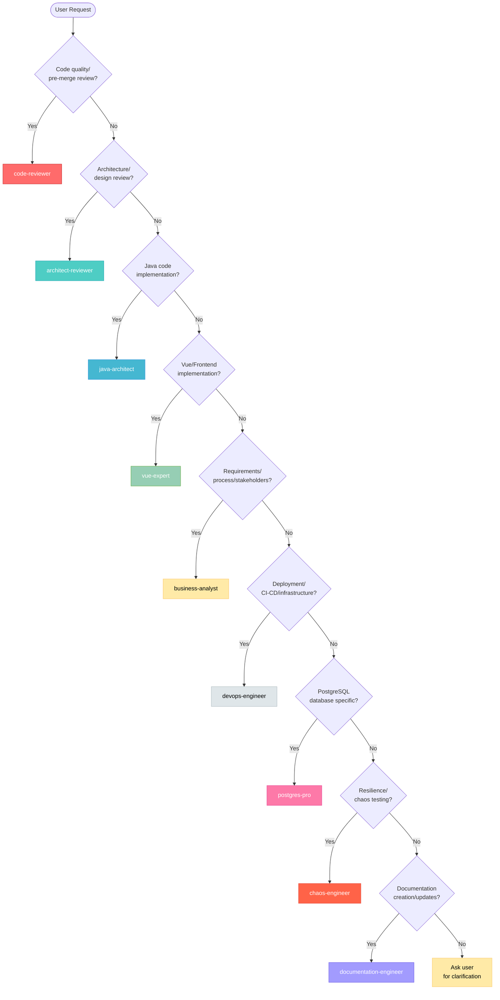

# Agent Selection Decision Matrix

**Purpose:** Help users and the main assistant quickly identify which agent to use for any given task.

## Quick Decision Flow

### Text-Based Decision Tree

```
[User Request]
    ↓
Is it a code quality/pre-merge review? ──YES──→ code-reviewer
    ↓ NO
Is it an architecture/design review? ──YES──→ architect-reviewer
    ↓ NO
Is it about Java code implementation? ──YES──→ java-architect
    ↓ NO
Is it about Vue/Frontend implementation? ──YES──→ vue-expert
    ↓ NO
Is it about requirements/process/stakeholders? ──YES──→ business-analyst
    ↓ NO
Is it about deployment/CI-CD/infrastructure? ──YES──→ devops-engineer
    ↓ NO
Is it PostgreSQL database specific? ──YES──→ postgres-pro
    ↓ NO
Is it about resilience/chaos testing? ──YES──→ chaos-engineer
    ↓ NO
Use general-purpose or ask user for clarification
```

### Visual Decision Flow



## Keyword-Based Agent Mapping

| Keywords in Request | Agent | Confidence | Example Requests |
|---------------------|-------|------------|------------------|
| **Java Development** ||||
| Spring Boot, @Transactional, @Service, Controller, REST API, layering, MyBatis Plus, entity, service layer | **java-architect** | High | "implement employee API", "add REST endpoint", "optimize JPA queries", "fix N+1 problem", "review service code" |
| **Frontend Development** ||||
| Vue, Component, Frontend, UI, Ant Design Vue, Composition API, form-modal, v-privilege, Pinia, reactive, Vite | **vue-expert** | High | "create employee list page", "implement form validation", "integrate backend API", "add permission controls", "optimize Vue performance" |
| **Business Analysis** ||||
| requirements, stakeholders, ROI, business process, user story, workflow, acceptance criteria, KPI, metrics | **business-analyst** | High | "gather requirements", "analyze process", "improve workflow", "calculate ROI", "define success metrics" |
| **DevOps & Deployment** ||||
| deploy, CI/CD, Docker, Kubernetes, pipeline, container, infrastructure, monitoring, Prometheus, Grafana | **devops-engineer** | High | "setup deployment", "configure monitoring", "create pipeline", "containerize app", "deploy to production" |
| **Database** ||||
| PostgreSQL, query optimization, index, replication, pg_stat, slow query, database performance | **postgres-pro** | High | "optimize database", "setup replication", "analyze query performance", "create indexes", "backup strategy" |
| **Resilience** ||||
| resilience, chaos, failure injection, game day, circuit breaker, fallback, antifragility, disaster recovery | **chaos-engineer** | High | "test failover", "improve resilience", "design chaos experiment", "validate recovery", "test failure scenarios" |
| **Architecture Review** ||||
| architecture, design, scalability, pattern validation, layer boundaries, module structure, technical debt assessment, architectural patterns, refactoring strategy | **architect-reviewer** | High | "review architecture", "validate design", "assess scalability", "evaluate module structure", "identify technical debt", "architecture audit" |
| **Code Quality Review** ||||
| code quality, security review, pull request, pre-merge, quality gate, code standards, vulnerability, code review, best practices, maintainability | **code-reviewer** | High | "review code", "pre-merge review", "check code quality", "security audit", "validate standards", "quality gate check" |
| **Documentation** ||||
| documentation, API docs, README, tutorial, architecture guide, user guide, developer docs, Swagger, OpenAPI, technical writing, doc generation | **documentation-engineer** | High | "document API", "update README", "create architecture guide", "write tutorial", "generate API docs", "document layered architecture" |

## Context-Based Decision Logic

### Scenario 1: New Feature Implementation (Full-Stack)

**Request:** "Add employee performance review feature"

**Agent Sequence:**
1. **business-analyst** (first) - Gather requirements, define user stories, create process flows
2. **java-architect** (second) - Implement backend API (Controller → Service → Dao)
3. **vue-expert** (third) - Implement frontend pages (list, form-modal) and integrate with backend API
4. **postgres-pro** (if complex queries) - Optimize database performance
5. **devops-engineer** (fourth) - Deploy to staging/production
6. **chaos-engineer** (fifth) - Validate resilience of critical path

### Scenario 2: Performance Problem

**Request:** "Employee search is slow"

**Parallel Investigation:**
- **java-architect** (lead) - Review code, check N+1 queries, caching strategy
- **postgres-pro** (parallel) - Analyze query execution plans, check indexes
- Converge on integrated solution

**Then:**
- **devops-engineer** - Deploy optimization, monitor improvements

### Scenario 3: Production Issue

**Request:** "Getting 503 errors in production"

**Sequential Response:**
1. **devops-engineer** (triage) - Check infrastructure, logs, monitoring
2. **Appropriate specialist** - Based on root cause:
   - Application error → **java-architect**
   - Database issue → **postgres-pro**
   - Infrastructure → **devops-engineer** (continues)
3. **chaos-engineer** (prevention) - Create test to prevent recurrence

### Scenario 4: Frontend Performance Issue

**Request:** "Employee list page is lagging"

**Sequential Response:**
1. **vue-expert** (lead) - Profile Vue reactivity, check for unnecessary re-renders
2. **java-architect** (if API slow) - Review backend API performance
3. **postgres-pro** (if query slow) - Optimize database queries
4. **devops-engineer** (deploy) - Deploy optimizations, monitor improvements

### Scenario 5: API Integration Issue

**Request:** "Frontend getting 500 errors from backend"

**Parallel Investigation:**
- **vue-expert** - Check frontend request payload, error handling
- **java-architect** - Review backend API, check logs and validation

**Convergence:** Align on data structures, fix contract mismatch

### Scenario 6: Process Improvement

**Request:** "Employee onboarding takes too long"

**Agent Sequence:**
1. **business-analyst** (lead) - Analyze current process, identify bottlenecks
2. **java-architect** (if automation needed) - Implement workflow automation
3. **vue-expert** (if UI needed) - Create frontend interface for automation
4. **devops-engineer** (if infrastructure change) - Update deployment process
5. **chaos-engineer** (if critical) - Test resilience of new process

### Scenario 7: Architecture Review

**Request:** "Can you review the architecture of our employee module?"

**Agent Sequence:**
1. **architect-reviewer** (lead) - Comprehensive architecture assessment, validate layered architecture, check dependencies
2. **java-architect** (if code changes needed) - Implement recommended refactoring
3. **vue-expert** (if frontend architectural impact) - Review frontend architecture alignment
4. **devops-engineer** (if infrastructure impact) - Assess deployment and scaling implications
5. **postgres-pro** (if database architectural concerns) - Evaluate database schema and query patterns

**When to Use:** Module restructuring, pre-refactoring evaluation, technical debt assessment, scalability review

### Scenario 8: Pre-Merge Code Review (Quality Gate)

**Request:** "I've finished the notification feature, please check if it's ready for merge"

**Hub-and-Spoke Pattern:**
1. **code-reviewer** (hub) - Initial scan for security, correctness, performance, maintainability
2. **Dispatch to specialists** based on change scope:
   - Backend changes → **java-architect** (SmartAdmin patterns validation)
   - Frontend changes → **vue-expert** (Vue 3 best practices)
   - Database changes → **postgres-pro** (query optimization)
   - Architectural impact → **architect-reviewer** (layer boundary validation)
3. **code-reviewer** (consolidate) - Aggregate findings, determine pass/fail
4. **java-architect** or **vue-expert** (fix) - Address critical/major issues
5. **code-reviewer** (validate) - Re-check after fixes, approve merge or iterate

**When to Use:** Before merging feature branches, critical fixes, major refactoring

## Ambiguous Requests - How to Clarify

### "How do I..."

| User Says | Likely Means | Agent |
|-----------|--------------|-------|
| "How do I add a feature?" | Implementation guidance (backend) | **java-architect** |
| "How do I create a Vue component?" | Frontend implementation | **vue-expert** |
| "How do I improve this process?" | Process optimization | **business-analyst** |
| "How do I deploy this?" | Deployment setup | **devops-engineer** |
| "How do I optimize queries?" | Database performance | **postgres-pro** |
| "How do I test resilience?" | Chaos testing | **chaos-engineer** |

### "I need help with..."

| User Says | Likely Means | Agent |
|-----------|--------------|-------|
| "...my Java code" | Backend code review | **java-architect** |
| "...my Vue component" | Frontend code review | **vue-expert** |
| "...requirements" | Requirements analysis | **business-analyst** |
| "...deployment" | CI/CD and infrastructure | **devops-engineer** |
| "...database" | Database operations | **postgres-pro** |
| "...testing failures" | Resilience testing | **chaos-engineer** |

### "Can you review..."

| User Says | What They Want Reviewed | Agent |
|-----------|-------------------------|-------|
| "...this code before merge" | Pre-merge code quality gate | **code-reviewer** |
| "...our architecture" | System design, layering, scalability | **architect-reviewer** |
| "...this Java class" | Backend code quality, patterns | **java-architect** |
| "...this Vue component" | Frontend code quality, patterns | **vue-expert** |
| "...this business process" | Process efficiency | **business-analyst** |
| "...this pipeline" | CI/CD configuration | **devops-engineer** |
| "...this query" | Query performance | **postgres-pro** |
| "...our resilience" | System robustness | **chaos-engineer** |

## Multi-Agent Coordination Scenarios

### When to Use Multiple Agents Sequentially

**Indicator:** Task spans multiple domains
**Pattern:** Complete one domain before moving to next
**Example:** New feature (BA → Java → Deploy → Test)

### When to Use Multiple Agents in Parallel

**Indicator:** Independent investigations needed
**Pattern:** Agents work simultaneously, converge on solution
**Example:** Performance issue (Java + DB investigate in parallel)

### When to Loop Back to Previous Agent

**Indicator:** New information changes requirements
**Pattern:** Agent B discovers issue, route back to Agent A
**Example:** DevOps finds deployment blocker → back to Java architect

## Special Cases

### "Just deployed and something broke"

**Priority Agent:** devops-engineer (rollback first, diagnose second)

### "Customer complaining about X"

**Priority Agent:** business-analyst (understand impact, gather context) → technical agent

### "Code review needed before merge"

**Agent:** java-architect (architecture compliance critical)

### "Production database slow"

**Urgent Path:** postgres-pro (immediate) + devops-engineer (monitoring)

### "Want to start chaos engineering"

**Agent:** chaos-engineer (establish practice, create roadmap)

## Decision Confidence Levels

| Confidence | Meaning | Action |
|------------|---------|--------|
| **High (>90%)** | Clear keywords match | Route directly to agent |
| **Medium (60-90%)** | Context suggests agent | Route with clarifying question |
| **Low (<60%)** | Ambiguous request | Ask user for clarification |

## Agent Selection Anti-Patterns

❌ **Don't:**
- Route deployment questions to java-architect (use devops-engineer)
- Route business questions to postgres-pro (use business-analyst)
- Route Java implementation to chaos-engineer (use java-architect)
- Skip business-analyst for "quick features" (requirements matter)
- Skip chaos-engineer for critical features (resilience matters)

✅ **Do:**
- Use business-analyst before java-architect for new features
- Coordinate java-architect + postgres-pro for complex queries
- Always involve devops-engineer for production changes
- Include chaos-engineer for critical business paths
- Ask clarifying questions when uncertain

## Edge Cases

### User provides code snippet

**If Java code:** java-architect (review, improve)
**If Vue/TypeScript code:** vue-expert (review, improve)
**If SQL:** postgres-pro (optimize query)
**If YAML/config:** devops-engineer (review infrastructure config)

### User mentions specific technology

**Spring Boot, MyBatis Plus:** java-architect
**PostgreSQL, pg_stat_statements:** postgres-pro
**Docker, Kubernetes, Terraform:** devops-engineer
**Resilience4j, circuit breaker:** chaos-engineer (or java-architect for implementation)

### User mentions stakeholders

**Almost always:** business-analyst (stakeholder management is their expertise)

## Summary

**Primary Rule:** Match keywords to agent expertise
**Secondary Rule:** Consider task lifecycle (requirements → implementation → deployment → testing)
**Tertiary Rule:** When uncertain, ask clarifying questions

**Most Common Patterns:**
1. New full-stack feature: BA → Java → Vue → DevOps → Chaos
2. Backend-only feature: BA → Java → DevOps → Chaos
3. Frontend-only feature: BA → Vue → DevOps
4. Bug fix (backend): Java → (DB if needed) → DevOps
5. Bug fix (frontend): Vue → DevOps
6. Performance (backend): Java + DB parallel → DevOps
7. Performance (frontend): Vue → (Java/DB if API slow) → DevOps
8. Production issue: DevOps → Specialist → Chaos
9. Process improvement: BA → (Java/Vue if automation) → DevOps
10. API integration: Java + Vue parallel → Integration testing
