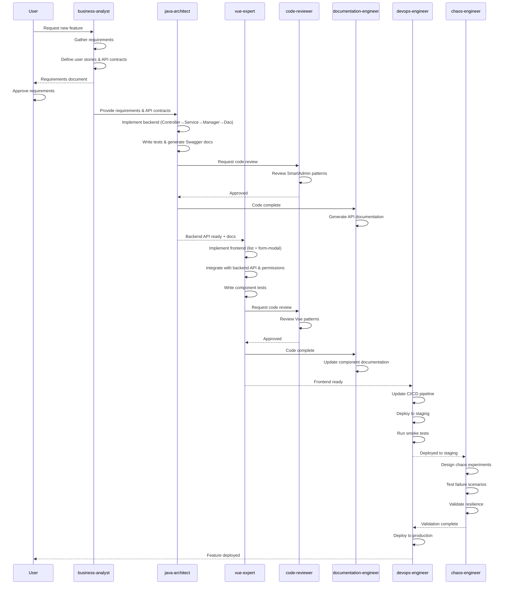
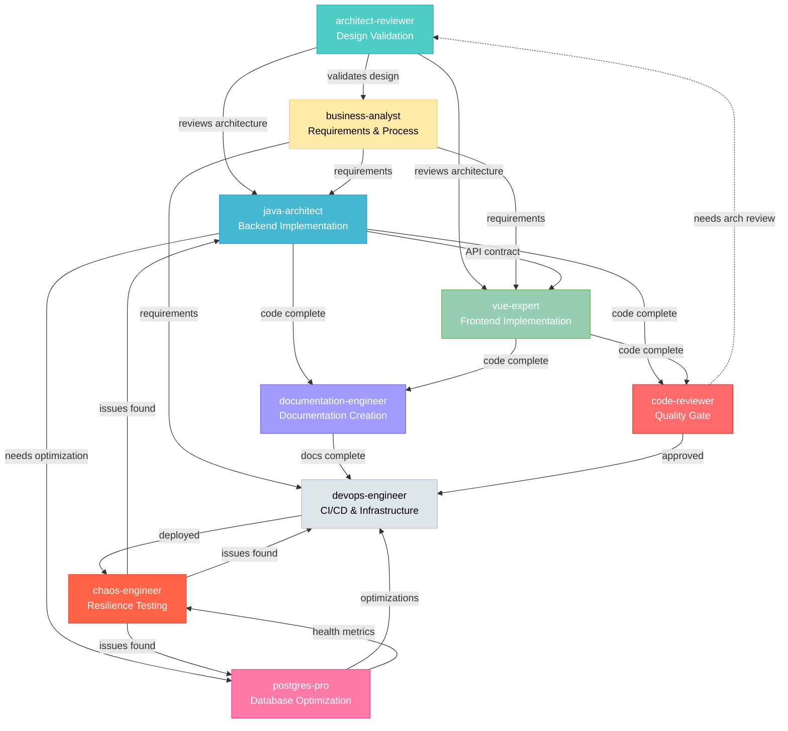
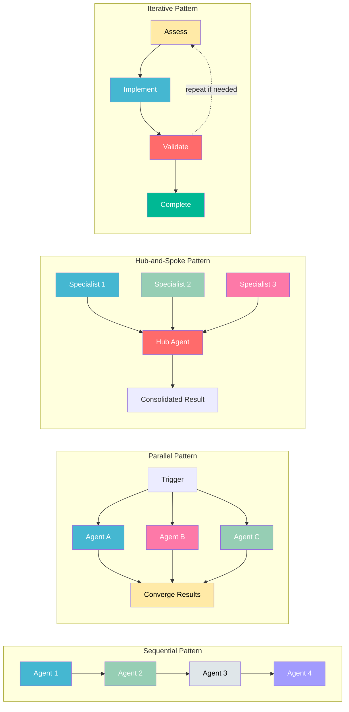

# SmartAdmin Agent Orchestration Playbook

**Purpose**: Unified guide for agent selection, multi-agent workflows, collaboration patterns, and handoff protocols.

**Last Updated**: 2026-01-27
**Version**: 1.0.0

---

## Table of Contents

1. [Agent Selection](#part-1-agent-selection)
2. [Multi-Agent Workflow Patterns](#part-2-multi-agent-workflow-patterns)
3. [Agent Dependencies & Collaboration](#part-3-agent-dependencies--collaboration)
4. [Best Practices & Anti-Patterns](#part-4-best-practices--anti-patterns)

---

## Part 1: Agent Selection

### Unified Decision Center

For complete agent routing, skill selection, and scenario-based decision trees, see:

→ **[.agent/rules/00-INDEX.md](../../../.agent/rules/00-INDEX.md)** - Unified Decision Center

**What you'll find there**:
- Scenario-based rule routing (query keyword → rule file)
- Skill selection logic (task type → recommended skill)
- Agent orchestration (development scenario → agent workflow)
- Complete keyword mapping

---

## Part 2: Multi-Agent Workflow Patterns

### Pattern Selection Quick Guide

| Pattern | When to Use | Timeline | Agents |
|---------|-------------|----------|--------|
| **Pattern 1: Full-Stack Sequential** | New feature (backend + frontend) | 2-7 days | BA → Java → Vue → Code → DevOps → Chaos |
| **Pattern 2: Parallel Investigation** | Performance optimization | 1-2 days | Java + PG (parallel) → DevOps |
| **Pattern 3: Hub-and-Spoke** | Production incident | Minutes-hours | DevOps (hub) → specialists |
| **Pattern 4: Sequential w/ Checkpoints** | Database migration | 0.5-2 days | PG → Java → DevOps |
| **Pattern 5: Collaborative Review** | Architecture decision | 2-4 hours | All technical agents |
| **Pattern 6: Iterative Refinement** | Technical debt reduction | 1-2 days/iteration | Java + DevOps + Chaos |
| **Pattern 7: API Integration** | Frontend-backend integration issues | 0.5-1 day | Java + Vue (parallel) → DevOps |
| **Pattern 8: Frontend Performance** | UI performance issues | 0.5-2 days | Vue → Java + PG → DevOps |
| **Pattern 9: Architecture Review** | Pre-refactoring evaluation | 1-3 days | Arch → All → BA → Arch |
| **Pattern 10: Pre-Merge Quality Gate** | Code review before merge | 30 min-2 hours | Code (hub) → specialists |

---

### Pattern 1: New Full-Stack Feature Implementation (Sequential)

**When:** User requests a new business feature requiring both backend and frontend

**Agents:** business-analyst → java-architect → vue-expert → code-reviewer → devops-engineer → chaos-engineer

**Timeline:** 2-7 days depending on complexity

#### Workflow Diagram



#### Phase 1: Requirements (business-analyst)

**Duration:** 0.5-1 day

**Activities:**
- Gather stakeholder requirements
- Define user stories with acceptance criteria
- Create process flows
- Define API contracts
- Document business rules
- Calculate ROI and prioritize

**Deliverables:**
- Requirements document
- User stories
- API contract specifications
- Success metrics

**Handoff to java-architect when:**
- Requirements approved by stakeholders
- Technical feasibility validated
- Acceptance criteria clear

---

#### Phase 2: Backend Implementation (java-architect)

**Duration:** 1-3 days

**Activities:**
- Design domain objects (Entity, Form, VO)
- Implement Dao layer
- Implement Manager layer (if transactions/caching needed)
- Implement Service layer (business logic)
- Implement Controller layer (API endpoints)
- Write unit and integration tests
- Run ArchitectureTest validation
- Generate Swagger documentation

**Deliverables:**
- Backend API code following SmartAdmin patterns
- Unit tests (>85% coverage)
- Integration tests
- Swagger/OpenAPI documentation
- Sample test data

**Handoff to vue-expert when:**
- All tests passing
- ArchitectureTest passing
- API accessible in dev environment
- Swagger documentation complete
- Sample request/response data available

---

#### Phase 3: Frontend Implementation (vue-expert)

**Duration:** 1-3 days

**Activities:**
- Define TypeScript interfaces matching backend DTOs
- Create API module (employee-api.ts)
- Implement list page component (employee-list.vue)
- Implement form modal component (employee-form-modal.vue)
- Integrate with backend API (ResponseModel handling)
- Add permission controls (v-privilege directives)
- Write component tests (>80% coverage)
- Run type checking and build validation

**Deliverables:**
- Frontend pages following SmartAdmin patterns
- Component tests (>80% coverage)
- TypeScript type definitions
- Build artifacts (dist/ folder)
- Frontend working in dev environment

**Handoff to devops-engineer when:**
- All tests passing (unit + integration)
- Type checking passing
- Frontend successfully integrated with backend API
- Build succeeds without errors
- Permissions working correctly

---

#### Phase 4: Deployment (devops-engineer)

**Duration:** 0.5-1 day

**Activities:**
- Update CI/CD pipeline if needed (backend + frontend)
- Configure environment-specific settings (backend configs, frontend .env)
- Deploy backend to staging
- Deploy frontend to staging (static files to CDN/nginx)
- Run smoke tests (backend API + frontend UI)
- Monitor deployment
- Deploy to production (manual approval)

**Deliverables:**
- Backend and frontend deployed to staging
- Production deployment ready
- Monitoring dashboards updated
- Runbook updated

**Handoff to chaos-engineer when:**
- Full-stack feature deployed to staging
- Monitoring in place (backend + frontend)
- Rollback tested (both layers)

---

#### Phase 5: Resilience Validation (chaos-engineer)

**Duration:** 0.5-1 day

**Activities:**
- Design chaos experiments
- Test failure scenarios
- Validate graceful degradation
- Document findings
- Recommend improvements

**Deliverables:**
- Chaos experiment results
- Resilience report
- Improvement recommendations

**Complete when:**
- Critical paths validated
- Known failure modes tested
- Improvements documented

---

### Pattern 2: Performance Optimization (Parallel)

**When:** User reports slow performance

**Agents:** java-architect + postgres-pro (parallel) → devops-engineer

**Timeline:** 1-2 days

#### Phase 1: Parallel Investigation

**Duration:** 0.5-1 day

**java-architect Activities:**
- Review code for N+1 queries
- Check caching strategy
- Profile application performance
- Identify algorithmic bottlenecks
- Review object creation patterns

**postgres-pro Activities:**
- Analyze slow queries log
- Review query execution plans
- Check index usage
- Assess database resource utilization
- Identify missing indexes

**Sync Point:**
- Share findings
- Identify root cause(s)
- Agree on optimization strategy

---

#### Phase 2: Implementation (Coordinated)

**Duration:** 0.5-1 day

**java-architect:**
- Implement caching in Manager layer
- Fix N+1 queries (batch fetching or join queries)
- Optimize algorithms
- Add performance monitoring

**postgres-pro:**
- Create indexes
- Rewrite complex queries
- Update statistics
- Tune database parameters

**Deliverables:**
- Optimized code
- New/modified indexes
- Performance test results
- Before/after metrics

---

#### Phase 3: Deployment & Validation (devops-engineer)

**Duration:** 0.5 day

**Activities:**
- Deploy optimizations to staging
- Monitor performance improvements
- Validate target metrics achieved
- Deploy to production
- Continue monitoring

**Complete when:**
- Performance targets met
- No regression in other areas
- Monitoring confirms improvement

---

### Pattern 3: Production Incident Response (Hub-and-Spoke)

**When:** Production issue detected

**Hub:** devops-engineer (triage)
**Spokes:** java-architect, postgres-pro, chaos-engineer (as needed)

**Timeline:** Minutes to hours

#### Phase 1: Triage (devops-engineer - 5-15 min)

**Activities:**
- Check infrastructure health
- Review monitoring dashboards
- Analyze logs
- Assess customer impact
- Determine severity

**Decision Point:**
- **Application error** → java-architect
- **Database issue** → postgres-pro
- **Infrastructure problem** → devops-engineer (continues)
- **Unknown** → all hands investigation

---

#### Phase 2: Diagnosis (Specialist - 15-60 min)

**java-architect (if application):**
- Review error logs
- Analyze stack traces
- Check recent deployments
- Identify code issue

**postgres-pro (if database):**
- Check connection pool
- Review slow queries
- Check replication lag
- Identify database bottleneck

**devops-engineer (if infrastructure):**
- Check resource utilization
- Review network issues
- Check auto-scaling
- Identify infrastructure issue

---

#### Phase 3: Resolution (15-60 min)

**Immediate Actions:**
- Rollback deployment if recent change
- Scale resources if capacity issue
- Kill problematic queries if database
- Apply hotfix if code issue

**Communication:**
- Update status to team
- Notify stakeholders
- Document timeline

---

#### Phase 4: Post-Mortem (chaos-engineer - 1-2 hours)

**Activities:**
- Conduct blameless post-mortem
- Document timeline and decisions
- Identify prevention measures
- Design chaos experiment to test fix

**Deliverables:**
- Incident report
- Action items with owners
- Chaos experiment plan

---

### Pattern 4: Database Migration (Sequential with Checkpoints)

**When:** Schema changes or data migration needed

**Agents:** postgres-pro → java-architect → devops-engineer

**Timeline:** 0.5-2 days

#### Phase 1: Migration Design (postgres-pro)

**Activities:**
- Design schema changes
- Write migration scripts (up/down)
- Plan data transformation
- Estimate downtime
- Create rollback procedure

**Checkpoints:**
- Review with java-architect (code impact)
- Review with devops-engineer (deployment strategy)

---

#### Phase 2: Code Updates (java-architect)

**Activities:**
- Update Entity classes
- Modify Dao queries if needed
- Update Service logic for new schema
- Add/update tests
- Validate backward compatibility if needed

**Checkpoint:**
- Review with postgres-pro (query correctness)

---

#### Phase 3: Deployment (devops-engineer)

**Activities:**
- Schedule maintenance window
- Deploy to staging and test migration
- Backup production database
- Execute migration in production
- Validate data integrity
- Monitor application

**Complete when:**
- Migration successful
- Application functioning correctly
- Rollback procedure validated

---

### Pattern 5: Architecture Review (Collaborative)

**When:** Reviewing significant architectural change

**Agents:** All technical agents (java-architect leads)

**Timeline:** 2-4 hours

#### Preparation (java-architect)

- Document proposed architecture
- Create diagrams
- List trade-offs
- Identify risks

---

#### Review Session (All)

**Each agent reviews from their perspective:**

**java-architect:**
- Code maintainability
- Design patterns alignment
- SmartAdmin compliance

**postgres-pro:**
- Database implications
- Query patterns
- Data model impact

**devops-engineer:**
- Deployment complexity
- Infrastructure requirements
- Monitoring needs

**chaos-engineer:**
- Failure modes
- Resilience implications
- Testing strategy

---

#### Output

- Consensus on approach
- List of concerns addressed
- Action items for each agent
- Documented decision and rationale

---

### Pattern 6: Technical Debt Reduction (Iterative)

**When:** Addressing accumulated technical debt

**Agents:** java-architect (lead) + devops-engineer + chaos-engineer

**Timeline:** Ongoing, 1-2 days per iteration

#### Iteration Cycle

1. **Identify** (java-architect): List debt items, prioritize by impact
2. **Plan** (java-architect): Break into small, safe changes
3. **Implement** (java-architect): Refactor with comprehensive tests
4. **Deploy** (devops-engineer): Safe, incremental deployments
5. **Validate** (chaos-engineer): Ensure no regression in resilience
6. **Repeat**: Next debt item

#### Key Principles

- Small, incremental changes
- Comprehensive test coverage
- No new features during refactoring
- Monitor for regressions
- Document improvements

---

### Pattern 7: API Integration & Debugging (Parallel Convergence)

**When:** Frontend and backend integration issues (500 errors, data mismatch, contract issues)

**Agents:** java-architect + vue-expert (parallel investigation) → converge → devops-engineer

**Timeline:** 0.5-1 day

#### Phase 1: Parallel Investigation (java-architect + vue-expert)

**Duration:** 15-30 minutes

**java-architect Activities:**
- Review backend logs for errors
- Check request validation logic
- Verify DTO structure matches documentation
- Test API endpoint with curl/Postman
- Check @SaCheckPermission annotations

**vue-expert Activities:**
- Review frontend request payload in Network tab
- Check TypeScript interface matches backend DTO
- Verify API request method (postRequest/getRequest)
- Check response.success handling
- Verify v-privilege permission strings

**Sync Point:**
- Share findings (logs, screenshots, payloads)
- Identify root cause (contract mismatch, validation error, permission issue)
- Agree on fix location (backend, frontend, or both)

---

#### Phase 2: Aligned Fix (Coordinated)

**Duration:** 30-60 minutes

**If Contract Mismatch:**
- **java-architect:** Update DTO field names/types OR
- **vue-expert:** Update TypeScript interface OR
- **Both:** Align on new contract structure

**If Validation Error:**
- **java-architect:** Fix backend validation logic OR
- **vue-expert:** Fix frontend form validation

**If Permission Error:**
- **java-architect:** Update @SaCheckPermission OR
- **vue-expert:** Update v-privilege string OR
- **devops-engineer:** Update role configuration

**Deliverables:**
- Aligned API contract (Java DTO ↔ TypeScript interface)
- Fixed validation/permission issues
- Integration tests passing
- Documentation updated (if contract changed)

---

#### Phase 3: Verification & Deployment (devops-engineer)

**Duration:** 15-30 minutes

**Activities:**
- Deploy fixes to dev environment
- Run integration tests (frontend + backend)
- Verify API contract alignment
- Deploy to staging if tests pass

**Complete when:**
- Frontend successfully calls backend API
- No 500 errors
- Data flows correctly
- Permissions working

---

### Pattern 8: Frontend Performance Optimization (Sequential)

**When:** Frontend UI is slow (laggy table, slow rendering, excessive re-renders)

**Agents:** vue-expert → java-architect (if API slow) → postgres-pro (if query slow) → devops-engineer

**Timeline:** 0.5-2 days

#### Phase 1: Frontend Profiling (vue-expert)

**Duration:** 1-2 hours

**Activities:**
- Profile component with Vue DevTools
- Identify unnecessary re-renders
- Check for reactive data issues (large arrays, deep nesting)
- Review computed property dependencies
- Check v-for key usage
- Profile Vite build size

**Findings:**
- If frontend issue → Phase 2A
- If API slow → Phase 2B
- If both → Phase 2A then 2B

---

#### Phase 2A: Frontend Optimization (vue-expert)

**Duration:** 2-4 hours

**Activities:**
- Implement shallow reactivity (shallowRef/shallowReactive) for large datasets
- Add virtual scrolling for large tables (if >1000 rows)
- Optimize computed dependencies
- Debounce user input
- Memoize expensive computations
- Lazy load components
- Optimize bundle size (code splitting)

**Deliverables:**
- Optimized Vue components
- Performance test results (before/after)
- Bundle size reduction metrics

---

#### Phase 2B: Backend/Database Optimization (java-architect + postgres-pro)

**Duration:** 2-4 hours

**If API response time >500ms:**
- **java-architect:** Review service logic, add caching (Manager layer)
- **postgres-pro:** Optimize queries, add indexes

**Follow Pattern 2 (Performance Optimization - Parallel)**

---

#### Phase 3: Deployment & Validation (devops-engineer)

**Duration:** 0.5-1 hour

**Activities:**
- Deploy optimizations to staging
- Run performance tests
- Monitor metrics (page load time, API response time, render time)
- Deploy to production
- Continue monitoring

**Complete when:**
- Page load time <2 seconds
- Table rendering smooth (<100ms per interaction)
- No user-reported lag
- Metrics show improvement

---

### Pattern 9: Architecture Review & Refactoring (Collaborative)

**When:** Periodic architecture assessment, pre-refactoring, technical debt reduction, scalability evaluation

**Agents:** architect-reviewer → (java-architect + vue-expert + postgres-pro + devops-engineer parallel) → business-analyst → architect-reviewer

**Timeline:** 1-3 days

#### Phase 1: Architecture Assessment (architect-reviewer - 4-8 hours)

**Activities:**
- Comprehensive architecture review
- Validate layered architecture compliance (Controller → Service → Manager → Dao)
- Check layer boundary violations
- Assess module structure and cohesion
- Identify technical debt hotspots
- Evaluate scalability and maintainability
- Review architectural patterns adherence

**Deliverables:**
- Architecture review report
- Violations list with severity
- Technical debt assessment
- Scalability concerns
- Refactoring priorities

**Handoff when:**
- Architecture violations documented
- Technical debt quantified
- Refactoring priorities identified

---

#### Phase 2: Impact Analysis (Parallel - 4-8 hours)

**java-architect:**
- Analyze code refactoring effort
- Estimate complexity and risk
- Identify affected modules
- Plan implementation approach

**vue-expert:**
- Assess frontend architectural impact
- Identify component restructuring needs
- Estimate frontend refactoring effort

**postgres-pro:**
- Review database schema implications
- Assess query pattern changes needed
- Estimate database refactoring effort

**devops-engineer:**
- Evaluate infrastructure impact
- Assess deployment complexity
- Estimate infrastructure changes needed

**Deliverables (from each):**
- Impact assessment report
- Effort estimates
- Risk assessment
- Dependencies identified

---

#### Phase 3: Business Impact & ROI (business-analyst - 2-4 hours)

**Activities:**
- Calculate refactoring costs
- Estimate business value of improvements
- Assess risk of NOT refactoring (technical debt interest)
- Prioritize improvements by ROI
- Create phased refactoring roadmap

**Deliverables:**
- ROI analysis
- Cost-benefit summary
- Prioritized refactoring backlog
- Phased implementation plan

---

#### Phase 4: Final Refactoring Roadmap (architect-reviewer - 2-4 hours)

**Activities:**
- Consolidate all findings
- Create comprehensive refactoring roadmap
- Define success metrics
- Document architectural principles to follow
- Identify quick wins vs long-term improvements

**Deliverables:**
- Comprehensive refactoring roadmap
- Phased implementation plan (with business priorities)
- Architectural principles document
- Success metrics and KPIs

---

#### Phase 5: Implementation (Per Phase)

**Execute with code-reviewer validation:**
- java-architect implements backend refactoring
- vue-expert implements frontend refactoring
- code-reviewer validates each phase (quality gate)
- devops-engineer deploys incremental changes
- chaos-engineer tests resilience after critical changes

**Complete when:**
- All critical architectural violations resolved
- High-priority technical debt addressed
- ArchitectureTest passing
- Scalability concerns mitigated
- Team aligned on new patterns

---

### Pattern 10: Pre-Merge Quality Gate (Hub-and-Spoke)

**When:** Before merging feature branches, critical fixes, major refactoring

**Hub:** code-reviewer (orchestrates all specialist reviews)
**Spokes:** architect-reviewer, java-architect, vue-expert, postgres-pro (as needed)

**Timeline:** 30 minutes - 2 hours

#### Phase 1: Initial Scan (code-reviewer - 10-20 min)

**Activities:**
- Review pull request changes (git diff)
- Identify change scope (backend, frontend, database, architecture)
- Check for obvious issues:
  - Security vulnerabilities (SQL injection, XSS, auth bypass)
  - Critical bugs (null pointer, logic errors)
  - Performance red flags (N+1 queries, missing indexes)
  - Code quality issues (complexity, duplication)

**Decision Point - Dispatch to specialists:**
- **Backend changes** → java-architect
- **Frontend changes** → vue-expert
- **Database changes** → postgres-pro
- **Architectural impact** → architect-reviewer
- **None needed** → Proceed to decision

---

#### Phase 2: Specialist Reviews (Parallel - 15-45 min)

**java-architect (if backend):**
- Validate SmartAdmin patterns (layered architecture)
- Check ResponseDTO usage
- Verify dependency injection (constructor injection only)
- Review transaction management (@Transactional in Manager only)
- Check naming conventions
- Validate MyBatis Plus patterns (LambdaQueryWrapper)

**vue-expert (if frontend):**
- Validate Vue 3 Composition API patterns
- Check Ant Design Vue component usage
- Verify API integration (ResponseModel handling)
- Check permission controls (v-privilege vs @SaCheckPermission alignment)
- Review TypeScript interfaces (alignment with backend DTOs)
- Validate frontend performance patterns

**postgres-pro (if database):**
- Review query patterns and performance
- Check index usage
- Validate migration scripts (if any)
- Assess query optimization opportunities

**architect-reviewer (if architectural):**
- Validate layer boundaries (no Controller → Dao violations)
- Check module dependencies
- Assess architectural debt introduced
- Verify adherence to architectural principles

**Each delivers:**
- Domain-specific findings (Critical/Major/Minor/Suggestions)
- File paths and line numbers
- Specific recommendations
- Pass/Fail for their domain

---

#### Phase 3: Consolidation (code-reviewer - 10-15 min)

**Activities:**
- Aggregate all specialist findings
- Categorize by severity:
  - **Critical** (must fix, blocks merge)
  - **Major** (should fix, may block merge)
  - **Minor** (nice to fix, doesn't block)
  - **Suggestions** (improvements)
- Eliminate duplicates
- Create consolidated review report
- Make pass/fail decision

**Pass Criteria:**
- Zero critical issues
- Zero major security issues
- ArchitectureTest passing (if backend changes)
- Test coverage >85% for backend, >80% for frontend
- No architectural violations

**Fail Criteria:**
- Any critical issue present
- Security vulnerabilities
- ArchitectureTest failures
- Test coverage below threshold

---

#### Phase 4: Fix Issues (java-architect or vue-expert - 30-60 min)

**If FAIL:**
- Developer (java-architect/vue-expert) fixes critical/major issues
- Updates tests if needed
- Commits fixes to same PR

**Communication:**
- code-reviewer provides clear, actionable feedback
- Developers acknowledge and commit to timeline
- code-reviewer tracks fix progress

---

#### Phase 5: Re-Validation (code-reviewer - 10-15 min)

**Activities:**
- Review fixes
- Verify critical/major issues resolved
- Check no new issues introduced
- Confirm tests passing
- Make final pass/fail decision

**If PASS:**
- Approve merge ✅
- Notify devops-engineer for deployment

**If FAIL:**
- Document remaining issues
- Iterate back to Phase 4

**Complete when:**
- All critical and major issues resolved
- Tests passing
- No architectural violations
- Ready for merge and deployment

---

## Part 3: Agent Dependencies & Collaboration

### Dependency Graph

#### Agent Dependency Flow



---

### Collaboration Patterns



---

### Agent-to-Agent Dependencies

#### java-architect Dependencies

**Depends On:**
- **business-analyst** (requirements input)
  - Needs: User stories, business rules, acceptance criteria
  - Before: Starting implementation
  - Format: Written requirements, API contracts

**Collaborates With:**
- **postgres-pro** (database optimization)
  - When: Complex queries, performance issues
  - Exchange: Query patterns, index recommendations
  - Format: SQL queries, execution plans

- **devops-engineer** (deployment coordination)
  - When: Configuration changes, new features
  - Exchange: Application configs, resource requirements
  - Format: application.yml, environment variables

**Feeds Into:**
- **vue-expert** (backend API contracts)
  - Provides: API documentation, Request/Response DTOs, permission requirements
  - When: Backend API complete
  - Format: Swagger docs, API contracts, test data

- **chaos-engineer** (code for testing)
  - Provides: Critical code paths, error handling
  - When: Feature complete
  - Format: Code locations, failure scenarios

---

#### business-analyst Dependencies

**Depends On:**
- **No direct dependencies** (starts the chain)

**Collaborates With:**
- **java-architect** (technical feasibility)
  - When: Defining requirements
  - Exchange: Feasibility assessment, complexity estimates
  - Format: Requirements ↔ technical constraints

- **devops-engineer** (operational requirements)
  - When: Defining NFRs (performance, availability)
  - Exchange: SLAs, monitoring needs
  - Format: Performance targets, uptime requirements

- **chaos-engineer** (resilience requirements)
  - When: Critical business processes
  - Exchange: Recovery objectives (RTO/RPO)
  - Format: Business impact analysis

**Feeds Into:**
- **java-architect** (requirements for implementation)
- **All agents** (context and priorities)

---

#### devops-engineer Dependencies

**Depends On:**
- **java-architect** (application code)
  - Needs: Build artifacts, configuration requirements
  - Before: Deployment
  - Format: JAR files, Dockerfiles, configs

- **postgres-pro** (database requirements)
  - Needs: Database schema, migration scripts
  - Before: Infrastructure provisioning
  - Format: SQL scripts, connection requirements

**Collaborates With:**
- **java-architect** (application configuration)
  - When: Deployment setup, environment configs
  - Exchange: JVM parameters, connection pools
  - Format: application-{env}.yml

- **postgres-pro** (database infrastructure)
  - When: Database deployment, backups
  - Exchange: Infrastructure specs, backup schedules
  - Format: Terraform configs, backup procedures

- **chaos-engineer** (chaos infrastructure)
  - When: Setting up chaos testing
  - Exchange: Monitoring setup, rollback automation
  - Format: Kubernetes configs, alert rules

**Feeds Into:**
- **chaos-engineer** (deployed system for testing)
- **business-analyst** (deployment metrics, uptime data)

---

#### vue-expert Dependencies

**Depends On:**
- **business-analyst** (UI/UX requirements)
  - Needs: User workflows, UI mockups, interaction patterns
  - Before: Starting frontend implementation
  - Format: User stories, wireframes, acceptance criteria

- **java-architect** (backend API contracts)
  - Needs: API endpoints, Request/Response models, permissions
  - Before: API integration
  - Format: Swagger/OpenAPI docs, sample requests, test data

**Collaborates With:**
- **java-architect** (API alignment)
  - When: Integrating frontend with backend
  - Exchange: Request/Response structure validation, permission alignment
  - Format: TypeScript interfaces ↔ Java DTOs, v-privilege ↔ @SaCheckPermission

- **devops-engineer** (frontend deployment)
  - When: Frontend build configuration
  - Exchange: Build artifacts, environment configs, CDN setup
  - Format: Vite configs, environment variables, deployment scripts

- **business-analyst** (UI feedback)
  - When: Reviewing implemented UI
  - Exchange: User workflow validation, UI improvement suggestions
  - Format: Screenshots, interactive prototypes

**Feeds Into:**
- **devops-engineer** (frontend build artifacts)
  - Provides: Built static files, deployment configs
  - When: Frontend complete
  - Format: dist/ folder, nginx configs, environment files

---

#### postgres-pro Dependencies

**Depends On:**
- **java-architect** (application queries)
  - Needs: Query patterns, data access code
  - Before: Optimization
  - Format: MyBatis XML, LambdaQueryWrapper code

**Collaborates With:**
- **java-architect** (query optimization)
  - When: Performance issues, complex queries
  - Exchange: Optimized queries, index recommendations
  - Format: SQL, EXPLAIN ANALYZE output

- **devops-engineer** (database infrastructure)
  - When: Database deployment, monitoring
  - Exchange: Infrastructure requirements, metrics
  - Format: Resource specs, monitoring queries

- **chaos-engineer** (database resilience)
  - When: Testing failover, replication lag
  - Exchange: Database health metrics, failure scenarios
  - Format: SQL scripts, monitoring queries

**Feeds Into:**
- **java-architect** (optimized query patterns)
- **devops-engineer** (database health metrics)
- **chaos-engineer** (database failure scenarios)

---

#### chaos-engineer Dependencies

**Depends On:**
- **java-architect** (application code)
  - Needs: Critical paths, error handling logic
  - Before: Designing experiments
  - Format: Code walkthrough, architecture diagram

- **postgres-pro** (database architecture)
  - Needs: Replication setup, backup procedures
  - Before: Database chaos experiments
  - Format: Database topology, health checks

- **devops-engineer** (infrastructure)
  - Needs: Deployment architecture, monitoring
  - Before: Infrastructure chaos
  - Format: Infrastructure diagram, rollback procedures

**Collaborates With:**
- **All technical agents** (experiment design)
  - When: Designing chaos scenarios
  - Exchange: Failure modes, expected behavior
  - Format: Experiment plans, success criteria

**Feeds Into:**
- **java-architect** (resilience improvements)
- **postgres-pro** (database resilience patterns)
- **devops-engineer** (infrastructure improvements)
- **business-analyst** (resilience reports, risk assessments)

---

#### architect-reviewer Dependencies

**Depends On:**
- **java-architect** (code for architecture review)
  - Needs: Current architecture, module structure, layer implementations
  - Before: Starting architecture review
  - Format: Code walkthrough, architecture diagrams, dependency analysis

- **vue-expert** (frontend architecture)
  - Needs: Frontend architecture patterns, component structure
  - Before: Full-stack architecture review
  - Format: Component hierarchy, state management patterns

**Collaborates With:**
- **java-architect** (architecture validation)
  - When: Reviewing layered architecture, module boundaries
  - Exchange: Architecture compliance findings, refactoring recommendations
  - Format: Architecture review report, violation list

- **postgres-pro** (database architecture)
  - When: Reviewing database schema design, query patterns
  - Exchange: Database architecture assessment, optimization recommendations
  - Format: Schema review, index strategy

- **devops-engineer** (infrastructure architecture)
  - When: Reviewing deployment architecture, scalability
  - Exchange: Infrastructure recommendations, scaling strategies
  - Format: Architecture assessment, capacity planning

**Feeds Into:**
- **java-architect** (refactoring priorities)
  - Provides: Architecture violations, recommended patterns, technical debt priorities
  - When: Architecture review complete
  - Format: Architecture review report, refactoring roadmap

- **business-analyst** (technical debt assessment)
  - Provides: Technical debt impact, ROI for refactoring
  - When: Prioritizing improvements
  - Format: Risk assessment, cost-benefit analysis

---

#### code-reviewer Dependencies

**Depends On:**
- **java-architect** (code to review)
  - Needs: Recently written code, pull request changes
  - Before: Starting code review
  - Format: Git diff, pull request link, implementation context

- **vue-expert** (frontend code to review)
  - Needs: Vue component changes, frontend code
  - Before: Frontend code review
  - Format: Git diff, component files, style changes

**Collaborates With:**
- **architect-reviewer** (architectural violations)
  - When: Code changes impact architecture
  - Exchange: Layer boundary violations, architectural concerns
  - Format: Architecture compliance check

- **java-architect** (SmartAdmin pattern validation)
  - When: Reviewing backend code
  - Exchange: Pattern violations, best practice recommendations
  - Format: Code review comments, refactoring suggestions

- **vue-expert** (Vue best practices)
  - When: Reviewing frontend code
  - Exchange: Vue 3 pattern violations, performance issues
  - Format: Code review comments, optimization suggestions

- **postgres-pro** (query validation)
  - When: Database queries in code changes
  - Exchange: Query optimization recommendations, index suggestions
  - Format: Query review, performance analysis

**Feeds Into:**
- **java-architect** (fixes needed)
  - Provides: Critical/major issues to fix, line-specific feedback
  - When: Code review complete
  - Format: Code review report with severity levels

- **vue-expert** (frontend fixes needed)
  - Provides: Frontend code issues, component improvements
  - When: Frontend review complete
  - Format: Code review report, component feedback

---

### Handoff Protocols

#### business-analyst → java-architect

**Handoff Trigger:** Requirements approved and signed off

**Handoff Package:**
- User stories with acceptance criteria
- Business rules and validation logic
- API contracts (endpoints, request/response)
- Performance requirements (response time, throughput)
- Security requirements (permissions, authentication)

**Acceptance Criteria:**
- Requirements clear and unambiguous
- Technical feasibility validated
- All stakeholders aligned

---

#### java-architect → devops-engineer

**Handoff Trigger:** Feature implemented and tests passing

**Handoff Package:**
- Build artifacts (JAR files)
- Configuration requirements (application.yml changes)
- Environment variables needed
- Database migration scripts (if any)
- Resource requirements (CPU, memory)
- Monitoring endpoints (/actuator/health)

**Acceptance Criteria:**
- All tests pass including ArchitectureTest
- Test coverage >85%
- No security vulnerabilities
- Documentation updated

---

#### java-architect → vue-expert

**Handoff Trigger:** Backend API implemented and tested

**Handoff Package:**
- Swagger/OpenAPI documentation (accessible at /swagger-ui.html)
- API endpoint URLs and HTTP methods
- Request DTO structures (Form objects)
- Response DTO structures (VO objects)
- Permission requirements (@SaCheckPermission annotations)
- Sample request/response JSON
- Error codes and messages (ErrorCode enum)
- Test data (employee IDs, valid payloads)
- Mock server URL (if available)

**Acceptance Criteria:**
- All tests pass (unit + integration)
- API accessible in dev environment
- Swagger documentation complete
- Sample data available for testing
- Permissions configured

**API Contract Alignment Checklist:**
- [ ] Request DTO fields match frontend Form interfaces
- [ ] Response DTO fields match frontend VO interfaces
- [ ] Permission strings documented (for v-privilege)
- [ ] Error handling patterns documented
- [ ] Pagination parameters consistent (pageNum, pageSize)

---

#### java-architect → postgres-pro

**Handoff Trigger:** Complex query or performance issue identified

**Handoff Package:**
- Slow query examples
- Current execution plans (EXPLAIN ANALYZE)
- Expected query volume
- Current performance metrics
- Business requirements for query

**Acceptance Criteria:**
- Query patterns documented
- Performance baseline established
- Optimization goals defined

---

#### vue-expert → devops-engineer

**Handoff Trigger:** Frontend implementation complete and tested

**Handoff Package:**
- Build artifacts (dist/ folder with static files)
- Environment configuration (.env files for dev/test/prod)
- Build commands (npm run build, npm run type-check)
- Vite configuration (vite.config.ts)
- Nginx configuration (if custom routing needed)
- Asset optimization settings
- API proxy configuration
- Frontend resource requirements (CDN, bandwidth)

**Acceptance Criteria:**
- All tests pass (unit + integration)
- Build succeeds without errors
- Type checking passes (TypeScript)
- No linting errors
- Test coverage >80%
- Frontend accessible in dev environment

---

#### devops-engineer → chaos-engineer

**Handoff Trigger:** Critical feature deployed to staging

**Handoff Package:**
- Deployment architecture diagram
- Monitoring dashboards
- Alert rules configured
- Rollback procedures documented
- Steady state metrics defined

**Acceptance Criteria:**
- Monitoring comprehensive
- Rollback tested
- Team trained on procedures

---

#### architect-reviewer → java-architect

**Handoff Trigger:** Architecture review complete with recommendations

**Handoff Package:**
- Architecture review report
- Identified architectural violations
- Recommended patterns and refactoring priorities
- Layer boundary issues
- Module structure improvements
- Technical debt assessment with ROI estimates

**Acceptance Criteria:**
- All architectural violations documented with severity
- Refactoring recommendations are specific and actionable
- Technical debt prioritized by business impact
- Architecture compliance checklist provided

---

#### code-reviewer → java-architect / vue-expert

**Handoff Trigger:** Code review complete with findings

**Handoff Package:**
- Code review report (categorized: Critical/Major/Minor/Suggestions)
- File-specific feedback with line numbers
- Security vulnerabilities identified
- Performance issues flagged
- SmartAdmin pattern violations
- Test coverage gaps
- Pass/Fail decision with rationale

**Acceptance Criteria:**
- All issues categorized by severity
- Specific line numbers and file paths provided
- Suggested fixes included for critical issues
- Clear pass/fail criteria defined
- Re-review requested if needed

---

### Coordination Checklist

#### Before Starting Work

- [ ] Read shared knowledge documents
- [ ] Check decision matrix - am I the right agent?
- [ ] Review dependencies - do I have required inputs?
- [ ] Check if other agents working on related tasks
- [ ] Notify dependent agents that I'm starting

---

#### During Work

- [ ] Update todos to track progress
- [ ] Document key decisions and rationale
- [ ] Flag issues that affect other agents
- [ ] Seek input when needed (don't guess)

---

#### After Completing Work

- [ ] Mark todos as completed
- [ ] Notify dependent agents work is ready
- [ ] Handoff package complete per protocol
- [ ] Document learnings for future work

---

### Dependency Matrix

| Agent | Depends On | Feeds Into | Parallel With |
|-------|------------|------------|---------------|
| **architect-reviewer** | java-architect, vue-expert | java-architect, business-analyst | - |
| **business-analyst** | architect-reviewer (optional) | java-architect, vue-expert, All | - |
| **java-architect** | business-analyst | vue-expert, devops, chaos, code-reviewer | postgres-pro |
| **vue-expert** | business-analyst, java-architect | devops, code-reviewer | java-architect (for API debugging) |
| **devops-engineer** | java-architect, vue-expert, postgres-pro | chaos, business-analyst | - |
| **postgres-pro** | java-architect | java-architect, devops | java-architect |
| **code-reviewer** | java-architect, vue-expert | java-architect, vue-expert (for fixes) | architect-reviewer, postgres-pro |
| **chaos-engineer** | All technical | All technical | - |

---

## Part 4: Best Practices & Anti-Patterns

### Workflow Best Practices

#### 1. Clear Entry and Exit Criteria

**Each phase should have:**
- Clear trigger to start
- Defined deliverables
- Acceptance criteria
- Handoff protocol

---

#### 2. Communication Cadence

**Status updates:**
- **Start**: Notify dependent agents
- **Progress**: Daily standups or async updates
- **Blockers**: Immediate escalation
- **Complete**: Handoff notification

---

#### 3. Documentation

**Always document:**
- Decisions and rationale
- Trade-offs considered
- Risks identified
- Lessons learned

---

#### 4. Parallel When Possible

**Maximize efficiency:**
- Identify independent workstreams
- Coordinate sync points
- Avoid blocking dependencies

---

#### 5. Quality Gates

**Don't skip:**
- ArchitectureTest validation
- Test coverage checks
- Security scanning
- Performance validation
- Monitoring verification

---

### Anti-Patterns to Avoid

❌ **Skipping business-analyst** for "quick features"
- **Result**: Unclear requirements, rework

❌ **Deploying without devops-engineer** review
- **Result**: Configuration issues, downtime

❌ **Ignoring chaos-engineer** for critical paths
- **Result**: Production incidents

❌ **Working in complete isolation**
- **Result**: Misalignment, integration issues

❌ **Skipping handoff protocols**
- **Result**: Missing information, delays

❌ **Starting frontend before backend API ready**
- **Result**: Mocked APIs, rework when real API differs

❌ **Not aligning API contracts between java-architect and vue-expert**
- **Result**: 500 errors, data mismatch, integration failures

❌ **Deploying frontend without testing API integration**
- **Result**: Production errors, broken user flows

❌ **Skipping architecture review before major refactoring**
- **Result**: Architectural debt, incorrect patterns, wasted effort

❌ **Merging code without quality gate review**
- **Result**: Bugs in production, technical debt accumulation, security vulnerabilities

---

### Communication Standards

#### Information Sharing Format

**When sharing context:**
```markdown
## Context
- **From:** [Agent Name]
- **To:** [Agent Name]
- **Task:** [Brief description]
- **Background:** [Relevant context]
- **Artifacts:** [Links to files, data, logs]
- **Expected Output:** [What you need from them]
- **Deadline:** [If time-sensitive]
```

---

#### Status Updates

**Progress updates:**
- Started work on X
- Completed analysis of Y
- Blocked on Z (need input from [Agent])
- Ready for handoff to [Agent]

---

#### Escalation

**When to escalate:**
- Conflicting requirements from multiple agents
- Technical constraint blocks requirement
- Timeline at risk
- Resource constraint identified

**How to escalate:**
- Document the blocker clearly
- Identify who needs to make decision
- Propose options with trade-offs
- Request timely decision

---

### Escalation Paths

#### When to Escalate to business-analyst

Escalate when:
- ❗ Requirements unclear or ambiguous
- ❗ Business logic questions arise during implementation
- ❗ Conflicting requirements discovered
- ❗ Scope creep detected
- ❗ Stakeholder decision needed

**How to escalate**:
1. Document the ambiguity/conflict clearly
2. Provide context (what you're trying to implement)
3. List questions or options
4. Tag business-analyst with blocker template

---

#### When to Escalate to architect-reviewer

Escalate when:
- ❗ Significant architectural decision required
- ❗ Design patterns unclear or conflicting
- ❗ Scalability concerns
- ❗ Technical debt tradeoffs needed
- ❗ Cross-cutting concerns (security, performance) require design

**How to escalate**:
1. Describe the architectural challenge
2. Provide context (current design, constraints)
3. List architectural options with pros/cons
4. Tag architect-reviewer with blocker template

---

#### When to Escalate to code-reviewer

Escalate when:
- ❗ Code quality concerns during implementation
- ❗ Security vulnerabilities discovered
- ❗ Performance issues detected
- ❗ Architectural violations in existing code
- ❗ Need pre-merge review guidance

**How to escalate**:
1. Describe the code quality/security/performance issue
2. Provide file paths and line numbers
3. Ask for recommended approach
4. Tag code-reviewer with clear question

---

## Summary

### Key Principles

1. **Clear handoffs** - Know when to pass work to next agent
2. **Complete packages** - Provide all information needed
3. **Continuous communication** - Don't work in silos
4. **Respect dependencies** - Don't skip required inputs
5. **Parallel when possible** - Work simultaneously when independent

---

### Most Important Collaborations

- **architect-reviewer** validates design before implementation (optional but recommended for complex features)
- **business-analyst** typically starts new features
- **java-architect** implements backend APIs
- **vue-expert** implements frontend UI
- **java-architect ↔ vue-expert** must align on API contracts
- **devops-engineer** enables deployment (both backend + frontend)
- **postgres-pro** optimizes database
- **code-reviewer** performs pre-merge quality gate
- **chaos-engineer** validates resilience

---

### Key Handoffs

- **Architect-Reviewer → Java**: Architecture validation + refactoring priorities
- **BA → Java**: Requirements with API contracts
- **Java → Vue**: Swagger docs + test data + permissions
- **Vue → DevOps**: Build artifacts + configs
- **Java/Vue → Code-Reviewer**: Pull request for pre-merge review
- **Code-Reviewer → Java/Vue**: Review findings + fixes needed
- **Java/Vue → DevOps**: Complete feature for deployment

---

### Remember

**Collaboration beats isolation!**

Choose the right pattern for your task, follow handoff protocols, communicate frequently, and maintain quality gates throughout the workflow.

---

**Document Version**: 1.0.0
**Last Updated**: 2026-01-27
**Source Files**: agent-dependencies.md (1,291 lines) + workflow-patterns.md (1,005 lines) = 2,296 lines consolidated
