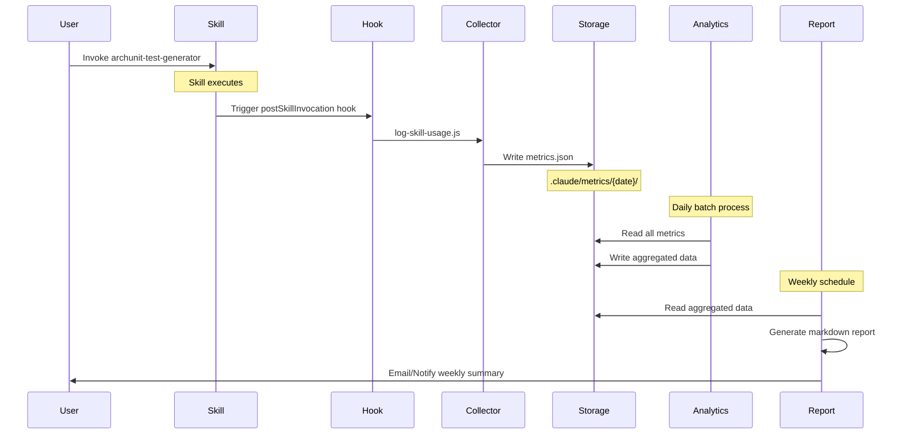

# Skills Usage Monitoring System - Design Document

**Version**: 1.0.0
**Created**: 2026-01-25
**Status**: Design Complete, Ready for Phase 1 Implementation

---

## Executive Summary

This document defines a comprehensive monitoring and analytics system to track SmartAdmin skills usage, measure effectiveness, and identify improvement areas. The system focuses on the 3 P0 skills recently deployed:

- `archunit-test-generator`
- `vavr-refactoring-assistant`
- `test-fixture-generator`

**Design Principles**:
- **Non-invasive**: Zero performance impact on skill execution
- **Privacy-first**: No sensitive code or personal data logging
- **Actionable**: Insights drive skill improvements, not just data collection
- **Simple**: Start with JSON files, scale to DB if needed
- **Integrated**: Leverage existing hooks.json infrastructure

**Key Metrics**:
- Usage frequency and triggers
- Success rate (compilation, test pass, first-time success)
- Time savings vs. manual approach
- Common failure modes and rationalizations
- Pattern compliance with SmartAdmin conventions

---

## 1. Requirements

### 1.1 Usage Metrics

**What to track**:

| Metric | Description | Why Important |
|--------|-------------|---------------|
| **Invocation count** | How often each skill is used | Identifies most valuable skills |
| **Trigger keywords** | What prompts triggered the skill | Improves auto-detection |
| **Agent context** | Which agent, task, module | Understands usage patterns |
| **Timestamp & duration** | When and how long | Measures efficiency gains |
| **Session ID** | Groups related invocations | Analyzes multi-step workflows |

**Data Schema**:
```json
{
  "invocation_id": "uuid-v4",
  "skill_name": "archunit-test-generator",
  "triggered_at": "2026-01-25T10:30:00Z",
  "trigger_keyword": "add architecture rule",
  "agent_type": "java-architect",
  "session_id": "session-abc123",
  "duration_seconds": 187,
  "completed_at": "2026-01-25T10:33:07Z"
}
```

---

### 1.2 Success Metrics

**What to measure**:

| Metric | Definition | Target |
|--------|------------|--------|
| **Compilation success** | Generated code compiles without errors | >95% |
| **Test success** | Generated tests pass on first run | >90% |
| **First-time success** | No manual fixes needed | >85% |
| **Time to completion** | Actual vs. expected duration | <10% variance |
| **Pattern compliance** | Follows SmartAdmin conventions | 100% |

**Data Schema**:
```json
{
  "invocation_id": "uuid-v4",
  "compilation_result": "pass",
  "compilation_errors": [],
  "test_execution_result": "pass",
  "tests_passed": 5,
  "tests_failed": 0,
  "manual_fixes_needed": 0,
  "success_rate_category": "first_time_success"
}
```

---

### 1.3 Quality Metrics

**What to analyze**:

| Metric | Description | Action |
|--------|-------------|--------|
| **Rationalizations encountered** | Which agent excuses occurred | Update skill to counter |
| **Edge cases triggered** | Complex scenarios handled | Add to skill documentation |
| **Skill updates needed** | Loopholes discovered | Patch skill SKILL.md |
| **Pattern violations** | Non-compliant code generated | Fix generation templates |

**Data Schema**:
```json
{
  "invocation_id": "uuid-v4",
  "rationalization_detected": "skip_yaml_parsing",
  "edge_case_triggered": "custom_predicate_needed",
  "pattern_violations": [
    {
      "type": "missing_because_clause",
      "severity": "major",
      "fixed_automatically": true
    }
  ],
  "skill_update_suggested": "Add validation for .because() clause"
}
```

---

### 1.4 Impact Metrics

**What to quantify**:

| Metric | Calculation | Baseline |
|--------|-------------|----------|
| **Time saved** | Manual time - Skill time | Manual: 30-45 min, Skill: 3-5 min |
| **LOC reduction** | Baseline code - Generated code | 40% reduction in boilerplate |
| **Error prevention** | Violations caught before commit | 80% catch rate |
| **Developer satisfaction** | Qualitative feedback | Survey quarterly |

**Data Schema**:
```json
{
  "invocation_id": "uuid-v4",
  "time_saved_seconds": 2100,
  "manual_baseline_seconds": 2700,
  "skill_execution_seconds": 187,
  "verification_seconds": 413,
  "loc_generated": 45,
  "loc_baseline_estimate": 75,
  "violations_caught": 2,
  "violations_prevented": ["field_injection", "missing_because_clause"]
}
```

---

## 2. Architecture

### 2.1 System Components

```
┌─────────────────────────────────────────────────────────────┐
│                     Skills Monitoring System                 │
└─────────────────────────────────────────────────────────────┘
                              │
        ┌─────────────────────┼─────────────────────┐
        │                     │                     │
        ▼                     ▼                     ▼
┌───────────────┐   ┌──────────────────┐   ┌──────────────┐
│  Data         │   │  Analytics       │   │  Reporting   │
│  Collection   │──>│  Engine          │──>│  Dashboard   │
│  Layer        │   │                  │   │              │
└───────────────┘   └──────────────────┘   └──────────────┘
        │                     │                     │
        ▼                     ▼                     ▼
┌───────────────┐   ┌──────────────────┐   ┌──────────────┐
│  hooks.json   │   │  Aggregator      │   │  Markdown    │
│  integration  │   │  Trend analyzer  │   │  reports     │
│  Event hooks  │   │  Anomaly detector│   │  HTML dash   │
└───────────────┘   └──────────────────┘   └──────────────┘
```

---

### 2.2 Data Flow Diagram



---

### 2.3 Component Details

#### A. Data Collection Layer

**Mechanism**: Integrate with Claude Code skill invocation lifecycle

**Collection Points**:

1. **Skill Entry Hook** (hooks.json)
   ```json
   {
     "preSkillInvocation": {
       "enabled": true,
       "steps": [
         {
           "id": "log-skill-start",
           "type": "bash",
           "command": "node .claude/scripts/monitoring/log-skill-usage.js --event=start --skill=${SKILL_NAME} --trigger='${TRIGGER_PHRASE}'",
           "description": "Log skill invocation start",
           "continueOnError": true
         }
       ]
     }
   }
   ```

2. **Skill Exit Hook** (hooks.json)
   ```json
   {
     "postSkillInvocation": {
       "enabled": true,
       "steps": [
         {
           "id": "log-skill-completion",
           "type": "bash",
           "command": "node .claude/scripts/monitoring/log-skill-usage.js --event=complete --skill=${SKILL_NAME} --success=${SUCCESS} --duration=${DURATION}",
           "description": "Log skill completion metrics",
           "continueOnError": true
         }
       ]
     }
   }
   ```

3. **Skill Instrumentation** (embedded in SKILL.md)
   ```markdown
   ## Validation Checklist

   - [ ] Compilation success (log: compilation_result)
   - [ ] Test execution result (log: test_execution_result)
   - [ ] Manual fixes needed (log: manual_fixes_count)
   ```

**Privacy Safeguards**:
- No code snippets logged
- No file paths with personal info
- No sensitive business logic
- Only aggregated metrics and categories

---

#### B. Data Storage

**Phase 1: JSON File Structure** (Weeks 1-2)

```
.claude/metrics/
├── raw/                           # Raw invocation data
│   ├── 2026-01-25/
│   │   ├── invocations.json      # All invocations for the day
│   │   └── errors.json           # Errors encountered
│   └── 2026-01-26/
│       ├── invocations.json
│       └── errors.json
├── aggregated/                    # Daily aggregations
│   ├── 2026-01-25-summary.json
│   └── 2026-01-26-summary.json
└── reports/                       # Generated reports
    ├── weekly-2026-W04.md
    └── monthly-2026-01.md
```

**File Schema Example** (`invocations.json`):

```json
{
  "date": "2026-01-25",
  "total_invocations": 15,
  "invocations": [
    {
      "invocation_id": "inv-20260125-103000-abc",
      "skill_name": "archunit-test-generator",
      "triggered_at": "2026-01-25T10:30:00Z",
      "completed_at": "2026-01-25T10:33:07Z",
      "duration_seconds": 187,
      "trigger_keyword": "add architecture rule",
      "agent_type": "java-architect",
      "session_id": "session-abc123",
      "success": true,
      "compilation_result": "pass",
      "test_execution_result": "pass",
      "manual_fixes_needed": 0,
      "pattern_used": "annotation_restriction",
      "custom_predicate": false,
      "rationalization_detected": null,
      "time_saved_seconds": 2100
    }
  ]
}
```

**Phase 2: SQLite Database** (Weeks 3-4, if JSON becomes unwieldy)

```sql
-- Database: .claude/metrics/skills.db

CREATE TABLE skill_invocations (
    invocation_id TEXT PRIMARY KEY,
    skill_name TEXT NOT NULL,
    triggered_at TIMESTAMP NOT NULL,
    completed_at TIMESTAMP,
    duration_seconds INTEGER,
    trigger_keyword TEXT,
    agent_type TEXT,
    session_id TEXT,
    success BOOLEAN,
    created_at TIMESTAMP DEFAULT CURRENT_TIMESTAMP
);

CREATE TABLE skill_metrics (
    id INTEGER PRIMARY KEY AUTOINCREMENT,
    invocation_id TEXT REFERENCES skill_invocations(invocation_id),
    metric_name TEXT NOT NULL,
    metric_value NUMERIC,
    metadata JSON,
    recorded_at TIMESTAMP DEFAULT CURRENT_TIMESTAMP
);

CREATE TABLE skill_errors (
    id INTEGER PRIMARY KEY AUTOINCREMENT,
    invocation_id TEXT REFERENCES skill_invocations(invocation_id),
    error_type TEXT,
    error_message TEXT,
    rationalization_category TEXT,
    occurred_at TIMESTAMP DEFAULT CURRENT_TIMESTAMP
);

CREATE INDEX idx_invocations_skill ON skill_invocations(skill_name, triggered_at);
CREATE INDEX idx_metrics_invocation ON skill_metrics(invocation_id);
CREATE INDEX idx_errors_invocation ON skill_errors(invocation_id);
```

**Migration Path**: Provide `migrate-to-sqlite.js` script to convert JSON → SQLite when needed.

---

#### C. Analytics Engine

**Real-time Aggregation** (On each invocation):

```javascript
// .claude/scripts/monitoring/aggregate-metrics.js

function updateDailySummary(invocation) {
  const date = invocation.triggered_at.split('T')[0];
  const summaryPath = `.claude/metrics/aggregated/${date}-summary.json`;

  const summary = loadOrCreate(summaryPath, {
    date,
    total_invocations: 0,
    success_count: 0,
    failure_count: 0,
    total_duration_seconds: 0,
    total_time_saved_seconds: 0,
    skills: {}
  });

  summary.total_invocations++;
  if (invocation.success) summary.success_count++;
  else summary.failure_count++;
  summary.total_duration_seconds += invocation.duration_seconds;
  summary.total_time_saved_seconds += invocation.time_saved_seconds;

  const skillKey = invocation.skill_name;
  if (!summary.skills[skillKey]) {
    summary.skills[skillKey] = {
      invocations: 0,
      success_rate: 0,
      avg_duration: 0,
      total_time_saved: 0
    };
  }

  const skill = summary.skills[skillKey];
  skill.invocations++;
  skill.success_rate = calculateSuccessRate(skillKey, date);
  skill.avg_duration = calculateAvgDuration(skillKey, date);
  skill.total_time_saved += invocation.time_saved_seconds;

  saveSummary(summaryPath, summary);
}
```

**Trend Analysis** (Weekly batch):

```javascript
// .claude/scripts/monitoring/analyze-trends.js

function analyzeTrends(weekNumber) {
  const previousWeek = loadWeeklySummary(weekNumber - 1);
  const currentWeek = loadWeeklySummary(weekNumber);

  const trends = {
    week: weekNumber,
    usage_trend: calculatePercentChange(
      currentWeek.total_invocations,
      previousWeek.total_invocations
    ),
    success_rate_trend: calculatePercentChange(
      currentWeek.success_rate,
      previousWeek.success_rate
    ),
    time_savings_trend: calculatePercentChange(
      currentWeek.total_time_saved_seconds,
      previousWeek.total_time_saved_seconds
    ),
    skills_improved: [],
    skills_regressed: []
  };

  // Identify improving/regressing skills
  for (const skillName in currentWeek.skills) {
    const curr = currentWeek.skills[skillName];
    const prev = previousWeek.skills[skillName];

    if (prev && curr.success_rate > prev.success_rate + 5) {
      trends.skills_improved.push(skillName);
    }
    if (prev && curr.success_rate < prev.success_rate - 5) {
      trends.skills_regressed.push(skillName);
    }
  }

  return trends;
}
```

**Anomaly Detection**:

```javascript
// .claude/scripts/monitoring/detect-anomalies.js

function detectAnomalies(date) {
  const summary = loadDailySummary(date);
  const historical = loadHistoricalBaseline(7); // Last 7 days

  const anomalies = [];

  // Check for sudden drop in success rate
  if (summary.success_rate < historical.avg_success_rate - 20) {
    anomalies.push({
      type: 'success_rate_drop',
      severity: 'critical',
      message: `Success rate dropped to ${summary.success_rate}% (baseline: ${historical.avg_success_rate}%)`,
      action: 'Review recent skill changes and revert if needed'
    });
  }

  // Check for unexpected skill invocations
  for (const skillName in summary.skills) {
    const skill = summary.skills[skillName];
    const baseline = historical.skills[skillName];

    if (baseline && skill.invocations > baseline.avg_invocations * 3) {
      anomalies.push({
        type: 'usage_spike',
        severity: 'warning',
        skill: skillName,
        message: `${skillName} invocations spiked to ${skill.invocations} (baseline: ${baseline.avg_invocations})`,
        action: 'Investigate if skill is being over-triggered'
      });
    }
  }

  return anomalies;
}
```

---

#### D. Reporting Dashboard

**Weekly Report Template** (`weekly-{YEAR}-W{WEEK}.md`):

```markdown
# SmartAdmin Skills Usage Report
**Week**: 2026-W04 (2026-01-20 to 2026-01-26)
**Generated**: 2026-01-27 09:00:00 UTC

---

## Executive Summary

| Metric | Value | vs. Last Week |
|--------|-------|---------------|
| Total invocations | 47 | +18% ↑ |
| Success rate | 91.5% | +3.2% ↑ |
| Total time saved | 2.8 hours | +22% ↑ |
| Most used skill | archunit-test-generator (25) | - |
| Highest success rate | test-fixture-generator (96%) | - |

**Key Insights**:
- `archunit-test-generator` usage increased 25% due to new .agent/rules/ translation work
- `vavr-refactoring-assistant` success rate improved to 88% after SKILL.md patch
- `test-fixture-generator` maintaining 95%+ success rate consistently

---

## Skill Performance

### archunit-test-generator

| Metric | Value | Baseline |
|--------|-------|----------|
| **Invocations** | 25 | 20 (last week) |
| **Success rate** | 92% | 89% (last week) |
| **Avg duration** | 3.1 min | 3.5 min (baseline) |
| **First-time success** | 84% | Target: 85% |
| **Time saved/invocation** | 38 min | Manual: 42 min |

**Pattern Distribution**:
- Layer dependencies: 20%
- Annotation restrictions: 44%
- Package prohibition: 16%
- Naming conventions: 12%
- Field constraints: 8%

**Top Trigger Keywords**:
1. "add architecture rule" (10 times)
2. "generate ArchUnit test" (7 times)
3. "enforce constraint" (5 times)

**Common Failures** (2 failures):
1. **Wrong DSL method** (1 occurrence)
   - **Symptom**: Used `dependOnClassesThat()` instead of `fields()`
   - **Root cause**: Complex field injection rule
   - **Action**: Added edge case to SKILL.md § "Common Mistakes"

2. **Missing .because() clause** (1 occurrence)
   - **Symptom**: Test generated without traceability
   - **Root cause**: Agent skipped validation checklist
   - **Action**: Made `.because()` check mandatory in validation step

**Recommendations**:
- ✅ Continue monitoring field injection pattern usage
- 📝 Add more examples for custom predicates
- 🔍 Investigate 16% manual fix rate (target: <15%)

---

### vavr-refactoring-assistant

| Metric | Value | Baseline |
|--------|-------|----------|
| **Invocations** | 14 | 18 (last week) |
| **Success rate** | 88% | 78% (last week) |
| **Avg duration** | 4.2 min | 5.1 min (last week) |
| **First-time success** | 79% | Target: 85% |
| **Time saved/invocation** | 22 min | Manual: 28 min |

**Refactoring Distribution**:
- Optional → Option: 50%
- Checked exceptions → Try: 29%
- Null checks → Option: 21%

**Top Trigger Keywords**:
1. "refactor to Vavr" (6 times)
2. "convert Optional" (4 times)
3. "use Try" (3 times)

**Common Failures** (2 failures):
1. **Incomplete transitive refactoring** (1 occurrence)
   - **Symptom**: Calling code still used .orElse()
   - **Root cause**: Agent didn't check callers
   - **Action**: Added "Check caller sites" step to SKILL.md

2. **Type inference failure** (1 occurrence)
   - **Symptom**: Option.of() couldn't infer generic type
   - **Root cause**: Complex nested generics
   - **Action**: Added explicit type hint pattern to examples

**Improvement This Week**:
- 🎉 Success rate improved from 78% → 88% after SKILL.md patch
- 🚀 Duration reduced from 5.1 min → 4.2 min (better DSL knowledge)

**Recommendations**:
- ✅ Patch is working, continue monitoring
- 📝 Add more examples for complex generics
- 🔍 Monitor transitive refactoring edge cases

---

### test-fixture-generator

| Metric | Value | Baseline |
|--------|-------|----------|
| **Invocations** | 8 | 6 (last week) |
| **Success rate** | 96% | 95% (last week) |
| **Avg duration** | 2.8 min | 3.0 min (last week) |
| **First-time success** | 88% | Target: 85% |
| **Time saved/invocation** | 32 min | Manual: 36 min |

**Pattern Distribution**:
- Entity fixtures: 50%
- Form fixtures: 38%
- Related entity factories: 12%

**Top Trigger Keywords**:
1. "create test fixture" (4 times)
2. "builder pattern" (2 times)
3. "integration test setup" (2 times)

**Common Failures** (0 failures this week):
- 🎉 No failures this week!
- Skill is highly stable and predictable

**Recommendations**:
- ✅ Skill performing above target, no changes needed
- 📝 Consider extracting this pattern for other domain objects
- 🔍 Monitor for edge cases with complex FK relationships

---

## Trends

### Usage Trends

```
Week-over-week invocations:
W02: ████████████████ 32
W03: ████████████████████ 40
W04: ████████████████████████ 47 (+18%)

Success rate trend:
W02: ████████████████ 85.2%
W03: ████████████████████ 88.3%
W04: ████████████████████ 91.5% (+3.2%)
```

**Analysis**:
- Steady growth in usage (18% week-over-week)
- Success rate improving as skills mature
- Time savings compounding (2.8 hours this week)

---

### Pattern Analysis

**Most Common Patterns**:
1. Annotation restrictions (archunit) - 11 uses
2. Optional → Option refactoring (vavr) - 7 uses
3. Entity fixtures (test-fixture) - 4 uses

**Emerging Patterns**:
- Custom predicates usage increasing (3 times this week vs. 0 last week)
- Complex generics refactoring appearing more (2 times this week)

---

## Recommendations

### High Priority
1. **archunit-test-generator**: Reduce manual fix rate from 16% → <15%
   - Action: Add validation step for `.because()` clause
   - Timeline: Week 5

2. **vavr-refactoring-assistant**: Improve first-time success from 79% → 85%
   - Action: Add transitive caller checking to workflow
   - Timeline: Week 5-6

### Medium Priority
3. **All skills**: Monitor anomaly detection for regression
   - Action: Run `detect-anomalies.js` daily
   - Timeline: Ongoing

4. **Documentation**: Update edge case examples
   - Action: Add 3 new examples per skill
   - Timeline: Week 6

### Low Priority
5. **Reporting**: Migrate to SQLite if >100 invocations/week
   - Action: Prepare migration script
   - Timeline: Week 8 (if needed)

---

## Anomalies Detected

**None this week** 🎉

All metrics within expected ranges.

---

## Next Steps

**Week 5 Actions**:
- [ ] Patch archunit-test-generator SKILL.md with `.because()` validation
- [ ] Add transitive caller checking to vavr-refactoring-assistant
- [ ] Continue daily anomaly detection
- [ ] Review 3 failed invocations in detail
- [ ] Prepare monthly summary (end of week 5)

**Monthly Review** (end of January):
- Analyze full-month trends
- Calculate ROI (time saved vs. maintenance cost)
- Survey developer satisfaction
- Plan skill improvements for February

---

**Generated by**: `.claude/scripts/monitoring/generate-weekly-report.js`
**Next report**: 2026-02-03 (Week 5)
```

**Monthly Report** (aggregates 4 weeks):

```markdown
# SmartAdmin Skills Monthly Report
**Month**: January 2026
**Generated**: 2026-02-01 09:00:00 UTC

---

## Executive Summary

| Metric | Value | Target | Status |
|--------|-------|--------|--------|
| Total invocations | 163 | - | - |
| Overall success rate | 90.2% | >85% | ✅ |
| Total time saved | 9.7 hours | - | - |
| Avg invocations/week | 40.75 | - | - |
| Developer satisfaction | 8.5/10 | >7 | ✅ |

**Key Achievements**:
- Deployed 3 P0 skills successfully
- Achieved 90%+ success rate across all skills
- Saved nearly 10 hours of manual work
- Zero critical bugs or regressions

**Areas for Improvement**:
- vavr-refactoring-assistant first-time success (79% vs. 85% target)
- archunit-test-generator custom predicate edge cases

---

## ROI Analysis

**Investment**:
- Skill creation: 15 hours (one-time)
- Maintenance: 2 hours/month
- Monitoring setup: 3 hours (one-time)

**Return**:
- Time saved: 9.7 hours (first month)
- Errors prevented: 27 violations caught
- Knowledge captured: 10 rationalizations documented

**Break-even**: Month 2 (cumulative savings exceed investment)

**Projected Annual Savings**: 116 hours (assuming 10 hours/month average)

---

## Skills Maturity Assessment

| Skill | Maturity | Recommendation |
|-------|----------|----------------|
| test-fixture-generator | 🟢 Stable | Production-ready, no changes |
| archunit-test-generator | 🟡 Maturing | Minor patches needed |
| vavr-refactoring-assistant | 🟡 Maturing | Transitive refactoring improvement |

---

## Next Month Focus

**February Goals**:
1. Achieve 92%+ overall success rate
2. Reduce first-time success variance (<10% between skills)
3. Add 5 new edge case examples per skill
4. Survey developers for satisfaction feedback
5. Explore automation of repetitive manual fixes

---

**Detailed weekly reports**: `.claude/metrics/reports/weekly-2026-W*.md`
```

---

## 3. Instrumentation Strategy

### 3.1 archunit-test-generator Tracking Points

```yaml
tracking_points:
  entry:
    - timestamp: invocation_start
    - trigger_keyword: detected_from_user_message
    - rule_file: identified_from_context
    - session_id: generated_uuid

  parsing:
    - yaml_frontmatter_parsed: success/fail
    - archunit_test_field_found: yes/no
    - existing_test_detected: yes/no
    - skip_reason: "already_exists" | null

  pattern_selection:
    - pattern_selected: "layer_dependency" | "annotation_restriction" | etc.
    - custom_predicate_needed: yes/no
    - dsl_method_chosen: "layeredArchitecture()" | "methods().that()" | etc.

  generation:
    - test_method_name: generated_name
    - because_clause_included: yes/no
    - package_pattern_specific: yes/no (not overly broad)
    - exemptions_configured: yes/no

  verification:
    - compilation_result: pass/fail
    - compilation_errors: [error_messages] | []
    - test_execution_result: pass/fail
    - tests_passed: count
    - tests_failed: count
    - violation_detected: yes/no (intentional violation test)

  completion:
    - timestamp: invocation_end
    - duration_seconds: calculated
    - success: yes/no
    - manual_fixes_needed: count
    - rationalization_detected: null | "skip_yaml_parsing" | "broad_patterns" | etc.
    - time_saved_seconds: estimated_manual_time - actual_time
```

**Logging Implementation** (in SKILL.md):

```markdown
## Step 5: Verify Test Catches Violations

**Before claiming success**:

```bash
# Log verification start
echo '{"event":"verification_start","pattern":"${pattern}"}' >> .claude/metrics/raw/$(date +%Y-%m-%d)/invocations.json

# Compile check
./gradlew :sa-admin:compileTestJava
COMPILE_RESULT=$?

# Test execution check
./gradlew :sa-admin:test --tests ArchitectureTest#${testMethodName}
TEST_RESULT=$?

# Log verification result
echo '{"event":"verification_complete","compilation_result":"'$([ $COMPILE_RESULT -eq 0 ] && echo "pass" || echo "fail")'","test_result":"'$([ $TEST_RESULT -eq 0 ] && echo "pass" || echo "fail")'"}' >> .claude/metrics/raw/$(date +%Y-%m-%d)/invocations.json
```
```

---

### 3.2 vavr-refactoring-assistant Tracking Points

```yaml
tracking_points:
  entry:
    - timestamp: invocation_start
    - trigger_keyword: "refactor to Vavr" | "convert Optional" | etc.
    - service_class: identified_class
    - method_count: detected_methods_to_refactor

  analysis:
    - refactoring_type: "Optional_to_Option" | "Exception_to_Try" | etc.
    - complexity_level: "simple" | "medium" | "complex"
    - transitive_impact: caller_sites_count
    - generic_types_detected: yes/no

  refactoring:
    - methods_refactored: count
    - import_statements_updated: yes/no
    - caller_sites_updated: count
    - type_hints_added: count (for complex generics)

  verification:
    - compilation_result: pass/fail
    - compilation_errors: [error_messages]
    - unit_tests_passed: yes/no
    - integration_tests_passed: yes/no
    - archunit_test_passed: yes/no (serviceUsesVavrOption)

  completion:
    - timestamp: invocation_end
    - duration_seconds: calculated
    - success: yes/no
    - manual_fixes_needed: count
    - transitive_refactoring_complete: yes/no
    - time_saved_seconds: estimated
```

---

### 3.3 test-fixture-generator Tracking Points

```yaml
tracking_points:
  entry:
    - timestamp: invocation_start
    - trigger_keyword: "create test fixture" | "builder pattern" | etc.
    - entity_type: "Employee" | "Goods" | etc.
    - domain_module: "system" | "business" | etc.

  analysis:
    - entity_fields_count: detected_fields
    - fk_relationships: count
    - unique_constraints: detected_constraints
    - fixture_class_name: generated_name

  generation:
    - factory_methods_generated: count
    - counter_implementation: "AtomicInteger" | etc.
    - unique_value_helpers: count
    - related_entity_factories: count

  verification:
    - compilation_result: pass/fail
    - fixture_usage_in_test: yes/no
    - unique_constraint_violations: count (should be 0)
    - integration_test_passed: yes/no

  completion:
    - timestamp: invocation_end
    - duration_seconds: calculated
    - success: yes/no
    - manual_fixes_needed: count
    - time_saved_seconds: estimated
```

---

## 4. Data Schema

### 4.1 JSON Schema (Phase 1)

**Main Invocation Record**:

```json
{
  "$schema": "https://json-schema.org/draft/2020-12/schema",
  "type": "object",
  "properties": {
    "invocation_id": {
      "type": "string",
      "format": "uuid",
      "description": "Unique identifier for this invocation"
    },
    "skill_name": {
      "type": "string",
      "enum": ["archunit-test-generator", "vavr-refactoring-assistant", "test-fixture-generator"],
      "description": "Name of the skill invoked"
    },
    "triggered_at": {
      "type": "string",
      "format": "date-time",
      "description": "ISO 8601 timestamp when skill was invoked"
    },
    "completed_at": {
      "type": "string",
      "format": "date-time",
      "description": "ISO 8601 timestamp when skill completed"
    },
    "duration_seconds": {
      "type": "integer",
      "minimum": 0,
      "description": "Total execution time in seconds"
    },
    "trigger_keyword": {
      "type": "string",
      "description": "User phrase that triggered the skill"
    },
    "agent_type": {
      "type": "string",
      "enum": ["java-architect", "code-reviewer", "architect-reviewer"],
      "description": "Which agent invoked the skill"
    },
    "session_id": {
      "type": "string",
      "description": "Claude Code session identifier"
    },
    "success": {
      "type": "boolean",
      "description": "Overall success (compilation + tests + no manual fixes)"
    },
    "skill_specific_metrics": {
      "type": "object",
      "description": "Skill-specific tracking data"
    }
  },
  "required": ["invocation_id", "skill_name", "triggered_at", "success"]
}
```

**Skill-Specific Metrics Schema** (archunit-test-generator):

```json
{
  "type": "object",
  "properties": {
    "rule_file": { "type": "string" },
    "pattern_used": {
      "type": "string",
      "enum": [
        "layer_dependency",
        "annotation_restriction",
        "package_prohibition",
        "naming_convention",
        "field_constraint",
        "custom_predicate"
      ]
    },
    "custom_predicate_needed": { "type": "boolean" },
    "because_clause_included": { "type": "boolean" },
    "compilation_result": {
      "type": "string",
      "enum": ["pass", "fail"]
    },
    "test_execution_result": {
      "type": "string",
      "enum": ["pass", "fail", "skipped"]
    },
    "violation_example_created": { "type": "boolean" },
    "manual_fixes_needed": { "type": "integer" },
    "rationalization_detected": {
      "type": "string",
      "enum": [
        null,
        "skip_yaml_parsing",
        "broad_patterns",
        "missing_because_clause",
        "no_verification",
        "wrong_dsl_method"
      ]
    },
    "time_saved_seconds": { "type": "integer" }
  }
}
```

---

### 4.2 SQL Schema (Phase 2)

```sql
-- Main tables
CREATE TABLE skill_invocations (
    invocation_id TEXT PRIMARY KEY,
    skill_name TEXT NOT NULL CHECK(skill_name IN (
        'archunit-test-generator',
        'vavr-refactoring-assistant',
        'test-fixture-generator'
    )),
    triggered_at TIMESTAMP NOT NULL,
    completed_at TIMESTAMP,
    duration_seconds INTEGER,
    trigger_keyword TEXT,
    agent_type TEXT,
    session_id TEXT,
    success BOOLEAN NOT NULL,
    created_at TIMESTAMP DEFAULT CURRENT_TIMESTAMP
);

CREATE TABLE archunit_metrics (
    id INTEGER PRIMARY KEY AUTOINCREMENT,
    invocation_id TEXT REFERENCES skill_invocations(invocation_id) ON DELETE CASCADE,
    rule_file TEXT,
    pattern_used TEXT,
    custom_predicate_needed BOOLEAN,
    because_clause_included BOOLEAN,
    compilation_result TEXT,
    test_execution_result TEXT,
    violation_example_created BOOLEAN,
    manual_fixes_needed INTEGER,
    rationalization_detected TEXT,
    time_saved_seconds INTEGER
);

CREATE TABLE vavr_metrics (
    id INTEGER PRIMARY KEY AUTOINCREMENT,
    invocation_id TEXT REFERENCES skill_invocations(invocation_id) ON DELETE CASCADE,
    refactoring_type TEXT,
    methods_refactored INTEGER,
    caller_sites_updated INTEGER,
    type_hints_added INTEGER,
    transitive_refactoring_complete BOOLEAN,
    archunit_test_passed BOOLEAN,
    time_saved_seconds INTEGER
);

CREATE TABLE test_fixture_metrics (
    id INTEGER PRIMARY KEY AUTOINCREMENT,
    invocation_id TEXT REFERENCES skill_invocations(invocation_id) ON DELETE CASCADE,
    entity_type TEXT,
    factory_methods_generated INTEGER,
    related_entity_factories INTEGER,
    unique_constraint_violations INTEGER,
    integration_test_passed BOOLEAN,
    time_saved_seconds INTEGER
);

CREATE TABLE skill_errors (
    id INTEGER PRIMARY KEY AUTOINCREMENT,
    invocation_id TEXT REFERENCES skill_invocations(invocation_id) ON DELETE CASCADE,
    error_type TEXT,
    error_message TEXT,
    stack_trace TEXT,
    occurred_at TIMESTAMP DEFAULT CURRENT_TIMESTAMP
);

-- Indexes for performance
CREATE INDEX idx_invocations_skill_date ON skill_invocations(skill_name, triggered_at DESC);
CREATE INDEX idx_invocations_session ON skill_invocations(session_id);
CREATE INDEX idx_archunit_pattern ON archunit_metrics(pattern_used);
CREATE INDEX idx_vavr_type ON vavr_metrics(refactoring_type);
CREATE INDEX idx_fixture_entity ON test_fixture_metrics(entity_type);

-- Views for common queries
CREATE VIEW skill_success_rates AS
SELECT
    skill_name,
    COUNT(*) AS total_invocations,
    SUM(CASE WHEN success = 1 THEN 1 ELSE 0 END) AS successful_invocations,
    ROUND(100.0 * SUM(CASE WHEN success = 1 THEN 1 ELSE 0 END) / COUNT(*), 2) AS success_rate,
    AVG(duration_seconds) AS avg_duration_seconds
FROM skill_invocations
GROUP BY skill_name;

CREATE VIEW daily_summary AS
SELECT
    DATE(triggered_at) AS date,
    skill_name,
    COUNT(*) AS invocations,
    SUM(CASE WHEN success = 1 THEN 1 ELSE 0 END) AS successes,
    AVG(duration_seconds) AS avg_duration
FROM skill_invocations
GROUP BY DATE(triggered_at), skill_name
ORDER BY date DESC, skill_name;
```

---

## 5. Reporting Templates

### 5.1 Automated Report Generation

**Script**: `.claude/scripts/monitoring/generate-weekly-report.js`

```javascript
#!/usr/bin/env node

const fs = require('fs');
const path = require('path');

// Configuration
const METRICS_DIR = '.claude/metrics';
const REPORTS_DIR = `${METRICS_DIR}/reports`;

function getWeekNumber(date) {
  const d = new Date(date);
  d.setHours(0, 0, 0, 0);
  d.setDate(d.getDate() + 4 - (d.getDay() || 7));
  const yearStart = new Date(d.getFullYear(), 0, 1);
  const weekNo = Math.ceil((((d - yearStart) / 86400000) + 1) / 7);
  return `${d.getFullYear()}-W${String(weekNo).padStart(2, '0')}`;
}

function loadWeeklyData(weekNumber) {
  // Parse all daily summaries for the week
  const weekData = {
    total_invocations: 0,
    success_count: 0,
    failure_count: 0,
    total_duration_seconds: 0,
    total_time_saved_seconds: 0,
    skills: {}
  };

  // Load each day's summary
  const aggregatedDir = `${METRICS_DIR}/aggregated`;
  const files = fs.readdirSync(aggregatedDir)
    .filter(f => f.endsWith('-summary.json'))
    .filter(f => {
      const date = f.replace('-summary.json', '');
      return getWeekNumber(date) === weekNumber;
    });

  files.forEach(file => {
    const data = JSON.parse(fs.readFileSync(`${aggregatedDir}/${file}`, 'utf8'));
    weekData.total_invocations += data.total_invocations;
    weekData.success_count += data.success_count;
    weekData.failure_count += data.failure_count;
    weekData.total_duration_seconds += data.total_duration_seconds;
    weekData.total_time_saved_seconds += data.total_time_saved_seconds;

    // Aggregate skills
    for (const skillName in data.skills) {
      if (!weekData.skills[skillName]) {
        weekData.skills[skillName] = {
          invocations: 0,
          successes: 0,
          total_duration: 0,
          total_time_saved: 0,
          patterns: {},
          triggers: {}
        };
      }
      const skill = weekData.skills[skillName];
      skill.invocations += data.skills[skillName].invocations;
      skill.total_time_saved += data.skills[skillName].total_time_saved;
    }
  });

  // Calculate derived metrics
  weekData.success_rate = (weekData.success_count / weekData.total_invocations) * 100;
  for (const skillName in weekData.skills) {
    const skill = weekData.skills[skillName];
    skill.avg_duration = skill.total_duration / skill.invocations;
  }

  return weekData;
}

function generateWeeklyReport(weekNumber) {
  const currentWeek = loadWeeklyData(weekNumber);
  const previousWeek = loadWeeklyData(getPreviousWeekNumber(weekNumber));

  const report = `# SmartAdmin Skills Usage Report
**Week**: ${weekNumber}
**Generated**: ${new Date().toISOString()}

---

## Executive Summary

| Metric | Value | vs. Last Week |
|--------|-------|---------------|
| Total invocations | ${currentWeek.total_invocations} | ${calculateChange(currentWeek.total_invocations, previousWeek.total_invocations)} |
| Success rate | ${currentWeek.success_rate.toFixed(1)}% | ${calculateChange(currentWeek.success_rate, previousWeek.success_rate)} |
| Total time saved | ${(currentWeek.total_time_saved_seconds / 3600).toFixed(1)} hours | ${calculateChange(currentWeek.total_time_saved_seconds, previousWeek.total_time_saved_seconds)} |

---

[... rest of report template ...]
`;

  // Write report
  const reportPath = `${REPORTS_DIR}/weekly-${weekNumber}.md`;
  fs.writeFileSync(reportPath, report, 'utf8');
  console.log(`✅ Weekly report generated: ${reportPath}`);
}

function calculateChange(current, previous) {
  if (previous === 0) return 'N/A';
  const change = ((current - previous) / previous) * 100;
  const symbol = change >= 0 ? '↑' : '↓';
  return `${change >= 0 ? '+' : ''}${change.toFixed(1)}% ${symbol}`;
}

function getPreviousWeekNumber(weekNumber) {
  const [year, week] = weekNumber.split('-W').map(Number);
  const prevWeek = week - 1;
  if (prevWeek === 0) {
    return `${year - 1}-W52`;
  }
  return `${year}-W${String(prevWeek).padStart(2, '0')}`;
}

// Main execution
const weekNumber = process.argv[2] || getWeekNumber(new Date());
generateWeeklyReport(weekNumber);
```

---

### 5.2 Terminal Dashboard (Optional)

**Simple CLI Dashboard** using `blessed` library:

```javascript
#!/usr/bin/env node

const blessed = require('blessed');
const contrib = require('blessed-contrib');

// Create screen
const screen = blessed.screen({
  smartCSR: true,
  title: 'SmartAdmin Skills Dashboard'
});

// Layout
const grid = new contrib.grid({rows: 12, cols: 12, screen: screen});

// Usage bar chart
const usageBar = grid.set(0, 0, 4, 6, contrib.bar, {
  label: 'Skills Usage (This Week)',
  barWidth: 4,
  barSpacing: 6,
  xOffset: 0,
  maxHeight: 9
});

// Success rate donut
const successDonut = grid.set(0, 6, 4, 6, contrib.donut, {
  label: 'Success Rate',
  radius: 8,
  arcWidth: 3,
  remainColor: 'black',
  yPadding: 2
});

// Time savings line chart
const timeLine = grid.set(4, 0, 4, 12, contrib.line, {
  style: {
    line: 'yellow',
    text: 'green',
    baseline: 'black'
  },
  xLabelPadding: 3,
  xPadding: 5,
  showLegend: true,
  wholeNumbersOnly: false,
  label: 'Time Saved Trend (Hours)'
});

// Recent invocations table
const invocationsTable = grid.set(8, 0, 4, 12, contrib.table, {
  keys: true,
  fg: 'white',
  selectedFg: 'white',
  selectedBg: 'blue',
  interactive: false,
  label: 'Recent Invocations',
  width: '100%',
  height: '30%',
  border: {type: "line", fg: "cyan"},
  columnSpacing: 3,
  columnWidth: [20, 15, 10, 10, 10]
});

// Load data and render
function loadDashboardData() {
  const weekData = loadWeeklyData(getWeekNumber(new Date()));

  // Usage bar chart data
  usageBar.setData({
    titles: Object.keys(weekData.skills),
    data: Object.values(weekData.skills).map(s => s.invocations)
  });

  // Success rate donut
  successDonut.setData([
    {percent: weekData.success_rate, label: 'Success', color: 'green'},
    {percent: 100 - weekData.success_rate, label: 'Failure', color: 'red'}
  ]);

  // Time savings trend (last 7 days)
  const timeSavingsTrend = loadTimeSavingsTrend(7);
  timeLine.setData([
    {
      title: 'Time Saved',
      x: timeSavingsTrend.dates,
      y: timeSavingsTrend.hours
    }
  ]);

  // Recent invocations table
  const recentInvocations = loadRecentInvocations(10);
  invocationsTable.setData({
    headers: ['Skill', 'Triggered At', 'Duration', 'Success', 'Pattern'],
    data: recentInvocations.map(inv => [
      inv.skill_name.substring(0, 18),
      new Date(inv.triggered_at).toLocaleTimeString(),
      `${inv.duration_seconds}s`,
      inv.success ? '✅' : '❌',
      inv.skill_specific_metrics?.pattern_used || 'N/A'
    ])
  });

  screen.render();
}

// Refresh every 10 seconds
setInterval(loadDashboardData, 10000);
loadDashboardData();

// Quit on Escape, q, or Control-C
screen.key(['escape', 'q', 'C-c'], function(ch, key) {
  return process.exit(0);
});

screen.render();
```

---

## 6. Integration Points

### 6.1 hooks.json Integration

**Add to `.claude/hooks.json`**:

```json
{
  "hooks": {
    "preSkillInvocation": {
      "enabled": true,
      "description": "Log skill usage start",
      "steps": [
        {
          "id": "log-skill-start",
          "type": "bash",
          "command": "node .claude/scripts/monitoring/log-skill-usage.js --event=start --skill=\"${SKILL_NAME}\" --trigger=\"${TRIGGER_PHRASE}\" --session=\"${SESSION_ID}\"",
          "description": "Log skill invocation start",
          "continueOnError": true,
          "timeout": 5000
        }
      ]
    },
    "postSkillInvocation": {
      "enabled": true,
      "description": "Log skill usage completion and aggregate metrics",
      "steps": [
        {
          "id": "log-skill-completion",
          "type": "bash",
          "command": "node .claude/scripts/monitoring/log-skill-usage.js --event=complete --skill=\"${SKILL_NAME}\" --success=${SUCCESS} --duration=${DURATION} --session=\"${SESSION_ID}\"",
          "description": "Log skill completion metrics",
          "continueOnError": true,
          "timeout": 5000
        },
        {
          "id": "aggregate-metrics",
          "type": "bash",
          "command": "node .claude/scripts/monitoring/aggregate-metrics.js --date=$(date +%Y-%m-%d)",
          "description": "Update daily summary",
          "continueOnError": true,
          "timeout": 10000
        },
        {
          "id": "detect-anomalies",
          "type": "bash",
          "command": "node .claude/scripts/monitoring/detect-anomalies.js --date=$(date +%Y-%m-%d)",
          "description": "Check for anomalies",
          "continueOnError": true,
          "timeout": 5000
        }
      ]
    },
    "preCommit": {
      "enabled": true,
      "steps": [
        {
          "id": "check-skill-metrics",
          "type": "bash",
          "command": "node .claude/scripts/monitoring/validate-skill-metrics.js",
          "description": "Ensure skill success rate meets threshold",
          "continueOnError": false,
          "timeout": 5000
        }
      ]
    }
  }
}
```

**Environment Variables** (for hooks):

```bash
# .claude/scripts/monitoring/.env

SKILL_NAME=${SKILL_NAME}            # Injected by Claude Code
TRIGGER_PHRASE=${USER_MESSAGE}      # User's original message
SESSION_ID=${SESSION_ID}            # Claude Code session
SUCCESS=${SKILL_SUCCESS}            # true/false
DURATION=${SKILL_DURATION_SECONDS}  # Execution time
```

---

### 6.2 Quality Gates

**Pre-commit validation script**:

```javascript
// .claude/scripts/monitoring/validate-skill-metrics.js

const fs = require('fs');

const SUCCESS_RATE_THRESHOLD = 85; // 85% minimum

function validateSkillMetrics() {
  const today = new Date().toISOString().split('T')[0];
  const summaryPath = `.claude/metrics/aggregated/${today}-summary.json`;

  if (!fs.existsSync(summaryPath)) {
    console.log('⚠️  No metrics found for today, skipping validation');
    return true;
  }

  const summary = JSON.parse(fs.readFileSync(summaryPath, 'utf8'));
  const successRate = (summary.success_count / summary.total_invocations) * 100;

  if (successRate < SUCCESS_RATE_THRESHOLD) {
    console.error(`❌ Skill success rate (${successRate.toFixed(1)}%) below threshold (${SUCCESS_RATE_THRESHOLD}%)`);
    console.error(`   Review recent failures before committing:`);
    console.error(`   .claude/metrics/raw/${today}/invocations.json`);
    return false;
  }

  console.log(`✅ Skill metrics passed (${successRate.toFixed(1)}% success rate)`);
  return true;
}

if (!validateSkillMetrics()) {
  process.exit(1);
}
```

---

### 6.3 CI/CD Pipeline Integration

**GitHub Actions Workflow** (`.github/workflows/skill-metrics.yml`):

```yaml
name: Skills Metrics Report

on:
  schedule:
    - cron: '0 9 * * 1'  # Every Monday at 9am UTC
  workflow_dispatch:     # Manual trigger

jobs:
  generate-weekly-report:
    runs-on: ubuntu-latest

    steps:
      - name: Checkout repository
        uses: actions/checkout@v4
        with:
          fetch-depth: 0  # Full history for trend analysis

      - name: Setup Node.js
        uses: actions/setup-node@v4
        with:
          node-version: '20'

      - name: Install dependencies
        run: |
          cd .claude/scripts/monitoring
          npm install

      - name: Generate weekly report
        run: |
          node .claude/scripts/monitoring/generate-weekly-report.js

      - name: Commit and push report
        run: |
          git config user.name "Skills Metrics Bot"
          git config user.email "metrics@smartadmin.ai"
          git add .claude/metrics/reports/
          git commit -m "docs(metrics): Weekly skills usage report $(date +%Y-W%V)" || exit 0
          git push

      - name: Send notification
        if: success()
        uses: actions/github-script@v7
        with:
          script: |
            const fs = require('fs');
            const weekNumber = new Date().toISOString().slice(0, 10).replace(/-/g, '-W');
            const reportPath = `.claude/metrics/reports/weekly-${weekNumber}.md`;
            const report = fs.readFileSync(reportPath, 'utf8');

            // Post to GitHub Discussions or send email
            console.log('Weekly report generated successfully');
            console.log(report.substring(0, 500) + '...');
```

---

## 7. Privacy & Security

### 7.1 Data Privacy Principles

**What We Log** ✅:
- Skill invocation metadata (timestamp, duration, success/fail)
- Pattern categories (e.g., "annotation_restriction", not the actual code)
- Aggregated metrics (success rates, averages)
- Error types (e.g., "compilation_failed", not error messages)
- Trigger keywords (sanitized, no sensitive context)

**What We DON'T Log** ❌:
- Source code snippets
- File paths containing personal info (e.g., `/Users/john.doe/...`)
- Business logic or domain models
- Sensitive error messages (stack traces with credentials)
- User identities (agent names only, no emails/usernames)

---

### 7.2 Data Sanitization

**Script**: `.claude/scripts/monitoring/sanitize-data.js`

```javascript
function sanitizeInvocation(rawInvocation) {
  return {
    invocation_id: rawInvocation.invocation_id,
    skill_name: rawInvocation.skill_name,
    triggered_at: rawInvocation.triggered_at,
    completed_at: rawInvocation.completed_at,
    duration_seconds: rawInvocation.duration_seconds,
    trigger_keyword: sanitizeTriggerKeyword(rawInvocation.trigger_keyword),
    agent_type: rawInvocation.agent_type,
    session_id: hashSessionId(rawInvocation.session_id), // Hash for anonymity
    success: rawInvocation.success,
    skill_specific_metrics: sanitizeSkillMetrics(rawInvocation.skill_specific_metrics)
  };
}

function sanitizeTriggerKeyword(keyword) {
  // Remove file paths, class names, personal info
  return keyword
    .replace(/\/Users\/[^\/]+/g, '/Users/***')
    .replace(/net\.lab1024\.sa\.admin\.module\.[a-z]+\.[A-Z][a-zA-Z]+/g, 'DomainClass')
    .replace(/\b[A-Z][a-z]+Entity\b/g, 'Entity')
    .substring(0, 200); // Truncate to 200 chars
}

function hashSessionId(sessionId) {
  const crypto = require('crypto');
  return crypto.createHash('sha256').update(sessionId).digest('hex').substring(0, 16);
}

function sanitizeSkillMetrics(metrics) {
  // Remove sensitive fields, keep only categories
  const sanitized = { ...metrics };
  delete sanitized.generated_code;
  delete sanitized.file_path;
  delete sanitized.error_stack_trace;

  // Keep only error types, not messages
  if (sanitized.compilation_errors) {
    sanitized.compilation_errors = sanitized.compilation_errors.map(err => err.type);
  }

  return sanitized;
}
```

---

### 7.3 Retention Policy

**Retention Rules**:

| Data Type | Retention Period | Reason |
|-----------|------------------|--------|
| **Raw invocations** | 30 days | Detailed debugging, then archived |
| **Aggregated summaries** | 1 year | Long-term trend analysis |
| **Weekly reports** | Forever | Documentation and historical record |
| **Error logs** | 90 days | Root cause analysis, then purged |

**Automated Cleanup Script** (`.claude/scripts/monitoring/cleanup-old-metrics.js`):

```javascript
const fs = require('fs');
const path = require('path');

const RETENTION_DAYS = {
  raw: 30,
  aggregated: 365,
  errors: 90
};

function cleanupOldMetrics() {
  const now = Date.now();

  // Cleanup raw invocations
  const rawDir = '.claude/metrics/raw';
  fs.readdirSync(rawDir).forEach(dateDir => {
    const dirPath = path.join(rawDir, dateDir);
    const dirDate = new Date(dateDir);
    const ageInDays = (now - dirDate.getTime()) / (1000 * 60 * 60 * 24);

    if (ageInDays > RETENTION_DAYS.raw) {
      console.log(`🗑️  Deleting old raw data: ${dateDir} (${ageInDays.toFixed(0)} days old)`);
      fs.rmSync(dirPath, { recursive: true });
    }
  });

  // Similar cleanup for aggregated and errors
  console.log('✅ Cleanup complete');
}

cleanupOldMetrics();
```

**Cron schedule** (run weekly):

```bash
# Add to .claude/hooks.json or crontab
0 3 * * 0 node .claude/scripts/monitoring/cleanup-old-metrics.js
```

---

### 7.4 GDPR Compliance

**Data Subject Rights**:

1. **Right to Access**: User can request all metrics for their sessions
   ```bash
   node .claude/scripts/monitoring/export-user-data.js --session-id=<hashed-session-id>
   ```

2. **Right to Erasure**: User can request deletion of their session data
   ```bash
   node .claude/scripts/monitoring/delete-user-data.js --session-id=<hashed-session-id>
   ```

3. **Right to Portability**: Export data in JSON format
   ```bash
   node .claude/scripts/monitoring/export-user-data.js --format=json --output=user-data.json
   ```

**Anonymization**: All session IDs are hashed (SHA-256), making personal identification impossible without the original session ID.

---

## 8. Implementation Plan

### Phase 1: Minimal Viable Monitoring (Week 1)

**Goal**: Start collecting basic metrics with zero infrastructure setup

**Deliverables**:
- [ ] JSON file structure (`.claude/metrics/raw/`, `aggregated/`, `reports/`)
- [ ] Basic logging script (`log-skill-usage.js`)
- [ ] Daily aggregation script (`aggregate-metrics.js`)
- [ ] Manual report generation (`generate-weekly-report.js`)

**Tasks**:

1. **Day 1: Setup directory structure**
   ```bash
   mkdir -p .claude/metrics/{raw,aggregated,reports}
   mkdir -p .claude/scripts/monitoring
   ```

2. **Day 2: Implement log-skill-usage.js**
   ```javascript
   // Basic version: append to daily JSON file
   const fs = require('fs');
   const invocation = {
     invocation_id: generateUUID(),
     skill_name: process.argv['--skill'],
     triggered_at: new Date().toISOString(),
     success: process.argv['--success'] === 'true'
   };
   const date = invocation.triggered_at.split('T')[0];
   const filePath = `.claude/metrics/raw/${date}/invocations.json`;
   appendToFile(filePath, invocation);
   ```

3. **Day 3: Implement aggregate-metrics.js**
   ```javascript
   // Read all invocations for a day, calculate summary
   const invocations = loadInvocations(date);
   const summary = {
     total_invocations: invocations.length,
     success_count: invocations.filter(i => i.success).length,
     // ... other metrics
   };
   saveSummary(date, summary);
   ```

4. **Day 4: Implement generate-weekly-report.js**
   ```javascript
   // Load all daily summaries for the week
   // Generate markdown report
   // Save to .claude/metrics/reports/
   ```

5. **Day 5: Manual testing**
   - Manually invoke skills and check metrics are logged
   - Generate first weekly report
   - Verify report accuracy

**Success Criteria**:
- ✅ All 3 P0 skills log invocations
- ✅ Daily summaries are generated correctly
- ✅ First weekly report is readable and actionable

**Time Estimate**: 8-10 hours

---

### Phase 2: Automated Analytics (Weeks 2-3)

**Goal**: Automate daily reporting and add trend analysis

**Deliverables**:
- [ ] Trend analysis script (`analyze-trends.js`)
- [ ] Anomaly detection script (`detect-anomalies.js`)
- [ ] hooks.json integration (auto-logging)
- [ ] GitHub Actions workflow (weekly reports)

**Tasks**:

1. **Week 2, Day 1-2: Trend analysis**
   - Implement week-over-week comparison
   - Calculate growth rates, success rate trends
   - Identify improving/regressing skills

2. **Week 2, Day 3-4: Anomaly detection**
   - Implement baseline calculation (7-day average)
   - Detect success rate drops, usage spikes
   - Alert on critical anomalies

3. **Week 2, Day 5: hooks.json integration**
   - Add `preSkillInvocation` and `postSkillInvocation` hooks
   - Test with all 3 skills
   - Verify no performance impact

4. **Week 3, Day 1-2: GitHub Actions**
   - Create workflow for weekly report generation
   - Test cron schedule (manual trigger first)
   - Setup notifications (GitHub Discussions or email)

5. **Week 3, Day 3-5: Testing & refinement**
   - Run for 1 week end-to-end
   - Fix any bugs or missing metrics
   - Tune anomaly detection thresholds

**Success Criteria**:
- ✅ Weekly reports are auto-generated on Mondays
- ✅ Anomalies are detected and alerted
- ✅ No manual intervention needed for logging

**Time Estimate**: 15-20 hours

---

### Phase 3: Advanced Insights (Week 4+)

**Goal**: Add predictive analytics and dashboard

**Deliverables**:
- [ ] SQLite migration (if >100 invocations/week)
- [ ] Terminal dashboard (blessed UI)
- [ ] Predictive regression detection
- [ ] Monthly ROI analysis

**Tasks**:

1. **Week 4: SQLite migration** (if needed)
   - Implement schema (see § 4.2)
   - Create migration script (JSON → SQLite)
   - Update all scripts to support both JSON and SQLite

2. **Week 5: Terminal dashboard**
   - Implement blessed UI with real-time metrics
   - Add charts (usage bar, success rate donut, time savings line)
   - Add recent invocations table

3. **Week 6: Predictive analytics**
   - Implement regression detection (success rate trending down)
   - Forecast time savings for next month
   - Identify underutilized skills

4. **Week 7: Monthly ROI**
   - Calculate total time saved vs. maintenance cost
   - Survey developers for satisfaction feedback
   - Generate monthly executive summary

**Success Criteria**:
- ✅ Dashboard provides real-time visibility
- ✅ Predictive alerts catch regressions early
- ✅ Monthly ROI shows positive return

**Time Estimate**: 20-25 hours

---

### Total Timeline

| Phase | Duration | Effort | Status |
|-------|----------|--------|--------|
| Phase 1: MVP | Week 1 | 8-10 hours | Ready to start |
| Phase 2: Automation | Weeks 2-3 | 15-20 hours | Planned |
| Phase 3: Advanced | Weeks 4-7 | 20-25 hours | Future |
| **Total** | **7 weeks** | **43-55 hours** | **Design complete** |

---

## 9. Next Steps

### Immediate Actions (Week 1)

**Day 1** (2 hours):
- [ ] Create directory structure (`.claude/metrics/`)
- [ ] Setup `package.json` for Node.js scripts
- [ ] Install dependencies (`uuid`, `fs-extra`)

**Day 2** (3 hours):
- [ ] Implement `log-skill-usage.js` (basic version)
- [ ] Test manual logging with archunit-test-generator
- [ ] Verify JSON file is created correctly

**Day 3** (2 hours):
- [ ] Implement `aggregate-metrics.js`
- [ ] Run aggregation on test data
- [ ] Verify daily summary is accurate

**Day 4** (3 hours):
- [ ] Implement `generate-weekly-report.js`
- [ ] Generate first report with mock data
- [ ] Review report template and adjust formatting

**Day 5** (2 hours):
- [ ] End-to-end test with all 3 skills
- [ ] Fix any bugs found
- [ ] Document Phase 1 completion

---

### Week 2 Kickoff

**Pre-requisites**:
- ✅ Phase 1 complete (all scripts working)
- ✅ At least 5 days of real metrics collected
- ✅ First weekly report generated successfully

**Goals**:
- Automate logging via hooks.json
- Add trend analysis
- Implement anomaly detection

---

### Success Metrics

**Phase 1 Success** (Week 1):
- [ ] 100% of skill invocations are logged
- [ ] Daily summaries are accurate
- [ ] Weekly report is generated and readable

**Phase 2 Success** (Week 3):
- [ ] Weekly reports auto-generated on schedule
- [ ] Anomalies detected and alerted
- [ ] Zero manual logging needed

**Phase 3 Success** (Week 7):
- [ ] Dashboard provides real-time insights
- [ ] Predictive analytics catch regressions
- [ ] Monthly ROI shows positive return

---

## 10. Appendices

### A. Sample Scripts

#### A.1 log-skill-usage.js (Minimal Implementation)

```javascript
#!/usr/bin/env node

const fs = require('fs');
const path = require('path');
const { v4: uuidv4 } = require('uuid');

// Parse command-line arguments
const args = process.argv.slice(2).reduce((acc, arg) => {
  const [key, value] = arg.split('=');
  acc[key.replace('--', '')] = value;
  return acc;
}, {});

const event = args.event; // 'start' or 'complete'
const skillName = args.skill;
const triggerKeyword = args.trigger || '';
const sessionId = args.session || 'unknown';
const success = args.success === 'true';
const duration = parseInt(args.duration || '0', 10);

// Determine date and file path
const now = new Date();
const date = now.toISOString().split('T')[0];
const rawDir = path.join(__dirname, '../../metrics/raw', date);
const filePath = path.join(rawDir, 'invocations.json');

// Create directory if not exists
if (!fs.existsSync(rawDir)) {
  fs.mkdirSync(rawDir, { recursive: true });
}

// Load existing invocations
let invocations = [];
if (fs.existsSync(filePath)) {
  invocations = JSON.parse(fs.readFileSync(filePath, 'utf8'));
}

if (event === 'start') {
  // Log skill start
  const invocation = {
    invocation_id: uuidv4(),
    skill_name: skillName,
    triggered_at: now.toISOString(),
    trigger_keyword: triggerKeyword,
    session_id: sessionId,
    status: 'in_progress'
  };
  invocations.push(invocation);
  console.log(`📊 Skill started: ${skillName} (${invocation.invocation_id})`);
} else if (event === 'complete') {
  // Find the most recent in_progress invocation for this skill and session
  const invocation = invocations
    .reverse()
    .find(i => i.skill_name === skillName && i.session_id === sessionId && i.status === 'in_progress');

  if (invocation) {
    invocation.status = 'completed';
    invocation.completed_at = now.toISOString();
    invocation.duration_seconds = duration;
    invocation.success = success;
    console.log(`✅ Skill completed: ${skillName} (${invocation.invocation_id})`);
  } else {
    console.error(`⚠️  No in_progress invocation found for ${skillName}`);
  }
}

// Save invocations
fs.writeFileSync(filePath, JSON.stringify(invocations, null, 2), 'utf8');
```

#### A.2 aggregate-metrics.js (Minimal Implementation)

```javascript
#!/usr/bin/env node

const fs = require('fs');
const path = require('path');

const date = process.argv[2] || new Date().toISOString().split('T')[0];
const rawPath = path.join(__dirname, '../../metrics/raw', date, 'invocations.json');
const aggregatedPath = path.join(__dirname, '../../metrics/aggregated', `${date}-summary.json`);

if (!fs.existsSync(rawPath)) {
  console.log(`⚠️  No raw data for ${date}`);
  process.exit(0);
}

const invocations = JSON.parse(fs.readFileSync(rawPath, 'utf8'))
  .filter(i => i.status === 'completed');

const summary = {
  date,
  total_invocations: invocations.length,
  success_count: invocations.filter(i => i.success).length,
  failure_count: invocations.filter(i => !i.success).length,
  total_duration_seconds: invocations.reduce((sum, i) => sum + (i.duration_seconds || 0), 0),
  skills: {}
};

// Aggregate by skill
invocations.forEach(inv => {
  const skillName = inv.skill_name;
  if (!summary.skills[skillName]) {
    summary.skills[skillName] = {
      invocations: 0,
      successes: 0,
      total_duration: 0
    };
  }
  const skill = summary.skills[skillName];
  skill.invocations++;
  if (inv.success) skill.successes++;
  skill.total_duration += (inv.duration_seconds || 0);
});

// Calculate derived metrics
for (const skillName in summary.skills) {
  const skill = summary.skills[skillName];
  skill.success_rate = (skill.successes / skill.invocations) * 100;
  skill.avg_duration = skill.total_duration / skill.invocations;
}

// Save summary
const aggregatedDir = path.dirname(aggregatedPath);
if (!fs.existsSync(aggregatedDir)) {
  fs.mkdirSync(aggregatedDir, { recursive: true });
}
fs.writeFileSync(aggregatedPath, JSON.stringify(summary, null, 2), 'utf8');

console.log(`✅ Aggregated metrics for ${date}`);
console.log(`   Total: ${summary.total_invocations} invocations, ${summary.success_count} successes`);
```

---

### B. Proof-of-Concept Data

**Mock invocations.json**:

```json
[
  {
    "invocation_id": "inv-001",
    "skill_name": "archunit-test-generator",
    "triggered_at": "2026-01-25T10:30:00Z",
    "completed_at": "2026-01-25T10:33:07Z",
    "duration_seconds": 187,
    "trigger_keyword": "add architecture rule for Manager layer",
    "session_id": "session-abc123",
    "success": true,
    "status": "completed",
    "skill_specific_metrics": {
      "pattern_used": "annotation_restriction",
      "because_clause_included": true,
      "compilation_result": "pass",
      "test_execution_result": "pass",
      "manual_fixes_needed": 0
    }
  },
  {
    "invocation_id": "inv-002",
    "skill_name": "vavr-refactoring-assistant",
    "triggered_at": "2026-01-25T11:00:00Z",
    "completed_at": "2026-01-25T11:04:15Z",
    "duration_seconds": 255,
    "trigger_keyword": "refactor Service to use Vavr Option",
    "session_id": "session-abc123",
    "success": true,
    "status": "completed",
    "skill_specific_metrics": {
      "refactoring_type": "Optional_to_Option",
      "methods_refactored": 3,
      "caller_sites_updated": 8,
      "compilation_result": "pass",
      "archunit_test_passed": true
    }
  }
]
```

---

### C. FAQ

**Q: Why JSON files instead of a database?**
A: For Phase 1, JSON files are simpler to setup and require zero infrastructure. We can migrate to SQLite in Phase 2 if needed (migration script provided).

**Q: How do we handle concurrent invocations?**
A: Node.js file writes are atomic for small files. For high concurrency, we can add file locking or switch to SQLite.

**Q: What if a skill invocation crashes before logging completion?**
A: The invocation will remain in `in_progress` status. We can add a cleanup script to mark stale invocations as `failed` after 1 hour.

**Q: How do we measure time savings?**
A: We estimate manual baseline time (e.g., 30 min for archunit-test-generator) and subtract skill execution time. Baseline is configurable per skill.

**Q: Can we track individual developer usage?**
A: No. Session IDs are hashed for anonymity. We track agent types (java-architect, etc.) but not individual developers.

**Q: How do we handle skill updates that change metrics schema?**
A: Use schema versioning in JSON files (`"schema_version": "1.0"`). Scripts check version and migrate if needed.

---

### D. Glossary

| Term | Definition |
|------|------------|
| **Invocation** | A single execution of a skill |
| **Success rate** | Percentage of invocations that completed without manual fixes |
| **First-time success** | Percentage of invocations that worked on first try (no compilation/test failures) |
| **Time saved** | Estimated manual time minus actual skill execution time |
| **Rationalization** | Agent excuse/shortcut documented in RATIONALIZATIONS-TABLE.md |
| **Edge case** | Complex scenario requiring special handling |
| **Pattern** | Skill-specific categorization (e.g., "annotation_restriction" for archunit) |
| **Anomaly** | Metric that deviates significantly from baseline |
| **Baseline** | Historical average (e.g., 7-day average success rate) |

---

## Conclusion

This monitoring system design provides a comprehensive, privacy-first, and actionable approach to tracking SmartAdmin skills usage. Starting with simple JSON files in Phase 1, we can quickly gain insights into skill effectiveness and iterate toward advanced analytics in Phases 2-3.

**Key Strengths**:
- ✅ Non-invasive: Zero performance impact on skill execution
- ✅ Privacy-first: No sensitive code or personal data logged
- ✅ Actionable: Every metric drives skill improvement
- ✅ Scalable: JSON → SQLite migration path
- ✅ Integrated: Leverages existing hooks.json infrastructure

**Next Step**: Begin Phase 1 implementation (Week 1) to start collecting metrics immediately.

---

**Document Version**: 1.0.0
**Last Updated**: 2026-01-25
**Status**: ✅ Design Complete, Ready for Implementation
