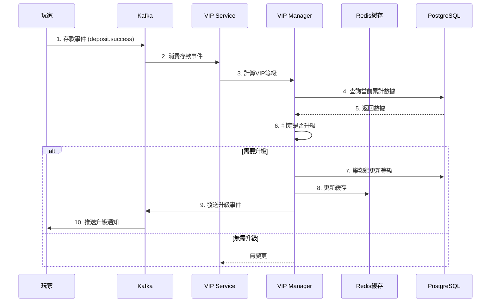

# VIP自動升級功能需求分析報告

**文檔元數據**
- 產品經理：igame-pm-analyst
- 創建日期：2026-01-23
- 優先級：P1重要
- 預估工作量：8 人天
- 風險等級：🟡 中

---

## 1. 需求背景（Why）

### 1.1 Ultrathink深度分析

#### 第一性原理拆解
```
第一層_表象層:
  用戶描述: "需要開發VIP自動升級功能，根據玩家的存款額和投注額計算等級"

第二層_交易層:
  資金流動: 無直接資金流動，但影響返水率（間接影響資金）
  數據流動: 玩家行為數據（存款/投注）→ VIP等級計算 → 等級變更
  風險轉移: 玩家獲得更高特權，平台承擔更高返水成本

第三層_第一性原理層:
  Trust（信任）:
    - 計算邏輯透明：玩家能理解升級規則
    - 可追溯：完整記錄升級歷史
    - 公平性：自動化計算，無人工干預

  Velocity（速度）:
    - 即時響應：玩家達標後立即升級（< 1秒）
    - 高併發：支持百萬級玩家同時計算

  Friction（摩擦）:
    - 零人工：完全自動化，無需申請
    - 無感知：後台自動計算，前端實時顯示
```

#### 偽需求識別（反向思考）
```
問題: 如果實現VIP自動升級，什麼會導致失敗？

潛在失敗場景:
1. 併發升級導致數據不一致
   → 同一玩家短時間內多筆存款，觸發多次升級計算
   → 解決：使用樂觀鎖 + Redis分佈式鎖

2. 計算邏輯不透明導致客訴
   → 玩家不理解為何未升級
   → 解決：前端顯示升級進度條，差距多少達標

3. 降級時玩家流失
   → 硬性降級會導致玩家不滿
   → 解決：實現寬限期機制（30-180天）

是否為偽需求？
□ 否 → 這是真實且有價值的需求
```

### 1.2 JTBD分析（Jobs To Be Done）

#### 用戶角色與待辦任務

| 角色 | 功能性任務 | 情感性任務 | 社會性任務 |
|------|-----------|-----------|-----------|
| **商戶老闆** | 自動化VIP管理，減少人工成本；提升玩家留存率 | 對系統準確性的信心；降低客訴壓力 | 在同業中展現平台的"智能化" |
| **終端玩家** | 獲得VIP特權（更高返水、專屬客服）；了解升級進度 | 升級時的成就感、被重視的感覺；等級提升的多巴胺釋放 | 在朋友圈炫耀VIP等級；VIP專屬活動的參與感 |
| **運營人員** | 無需人工審核VIP申請；快速查看VIP分佈數據 | 減少重複性工作的輕鬆感；對自動化系統的信任 | 被視為效率高的團隊 |
| **開發團隊** | 實現可維護的VIP計算邏輯；避免硬編碼規則 | 對代碼質量的自信；避免頻繁修改規則的焦慮 | 被認可為專業的工程團隊 |

#### 用戶故事
```
作為 終端玩家，
我希望 在達到VIP升級條件後立即自動升級，
以便 立即享受更高的返水率和專屬特權。

接受標準:
- [ ] 達標後1秒內自動升級
- [ ] 收到升級通知（App推送 + Email）
- [ ] 前端顯示新等級及特權
- [ ] 歷史記錄可查詢

作為 商戶老闆，
我希望 VIP系統完全自動化運行，
以便 減少人工成本並提升玩家留存率。

接受標準:
- [ ] 零人工干預
- [ ] 計算邏輯可配置（不同商戶不同規則）
- [ ] 完整審計日誌
- [ ] VIP留存率提升30%
```

### 1.3 成功指標（Success Metrics）

| 指標類型 | 指標名稱 | 當前值 | 目標值 | 衡量方式 |
|---------|---------|-------|-------|---------|
| 業務指標 | VIP玩家留存率 | 65% | >85% | 30天留存統計 |
| 業務指標 | VIP自動化率 | 50% | >95% | 人工干預次數 / 總升級次數 |
| 性能指標 | 升級計算延遲 | 5秒 | <1秒 | P95延遲監控 |
| 質量指標 | 計算準確率 | 98% | 100% | 審計日誌比對 |

---

## 2. 功能需求（What）

### 2.1 核心流程



### 2.2 業務規則

#### 核心規則
1. **規則1: VIP等級判定**
   - 條件: 累計存款額 AND 累計投注額同時滿足
   - 動作: 升級到對應等級
   - 異常: 數據異常時維持原等級並告警

**等級判定矩陣**：
| 等級 | 名稱 | 累計存款 | 累計投注 | 返水率 | 寬限期 |
|------|------|---------|---------|-------|-------|
| 0 | 普通會員 | - | - | 0.5% | - |
| 1 | 銅牌 | ≥ 5000 | ≥ 20000 | 0.8% | 30天 |
| 2 | 銀牌 | ≥ 20000 | ≥ 100000 | 1.2% | 60天 |
| 3 | 金牌 | ≥ 50000 | ≥ 300000 | 1.5% | 90天 |
| 4 | 白金 | ≥ 100000 | ≥ 800000 | 1.8% | 180天 |
| 5 | 鑽石 | ≥ 500000 | ≥ 3000000 | 2.5% | 永久 |

2. **規則2: 寬限期機制**
   - 條件: 玩家數據不再滿足當前等級要求
   - 動作: 進入寬限期，不立即降級
   - 寬限期內恢復: 重置寬限期計時
   - 寬限期結束: 降級到符合條件的等級

3. **規則3: 等級鎖定（反欺詐）**
   - 條件: 異常行為檢測（如刷單）
   - 動作: 鎖定等級，暫停升級/降級
   - 解鎖: 人工審核通過後解鎖

#### 邊界條件
- **最小值**: 等級0（普通會員）
- **最大值**: 等級5（鑽石）
- **特殊值**:
  - 累計存款/投注為0：保持等級0
  - 數據回滾（提款後）：不影響已達標的VIP等級

### 2.3 數據模型

#### Entity（實體類）
```java
@TableName("t_vip_player_level")
public class VipPlayerLevelEntity extends BaseEntity {
    @TableId(type = IdType.AUTO)
    private Long id;

    private Long tenantId; // 多租戶隔離
    private Long playerId; // 玩家ID

    // VIP等級信息
    private Integer currentLevel; // 當前等級 (0-5)
    private LocalDateTime levelAchievedAt; // 達到當前等級時間

    // 累計數據
    private BigDecimal totalDeposit; // 累計存款額
    private BigDecimal totalBet; // 累計投注額
    private Integer activeDays; // 活躍天數

    // 寬限期信息
    private Integer gracePeriodLevel; // 寬限期保護的等級
    private LocalDateTime gracePeriodStartAt; // 寬限期開始時間
    private LocalDateTime gracePeriodEndAt; // 寬限期結束時間

    // 鎖定信息
    private Boolean locked; // 是否鎖定
    private String lockReason; // 鎖定原因

    private LocalDateTime calculatedAt; // 最後計算時間
    private Integer version; // 樂觀鎖

    // 審計字段（繼承自BaseEntity）
}
```

#### Form（請求表單）
```java
@Data
public class VipUpgradeForm {
    @NotNull(message = "玩家ID不能為空")
    private Long playerId;

    private BigDecimal depositAmount; // 本次存款額（觸發計算）
    private BigDecimal betAmount; // 本次投注額（觸發計算）
}

@Data
public class VipLevelQueryForm extends PageParam {
    private Long playerId; // 玩家ID（可選）
    private Integer minLevel; // 最小等級（篩選）
    private Integer maxLevel; // 最大等級（篩選）
    private Boolean locked; // 是否鎖定（篩選）
}
```

#### VO（視圖對象）
```java
@Data
public class VipLevelVO {
    private Long playerId;
    private String playerName;

    // 當前等級信息
    private Integer currentLevel;
    private String levelName; // 銅牌/銀牌/金牌/白金/鑽石
    private String levelIcon; // 等級圖標URL
    private BigDecimal rebateRate; // 返水率

    // 升級進度
    private VipProgressVO upgradeProgress;

    // 特權列表
    private List<String> privileges;

    // 寬限期信息
    private Boolean inGracePeriod;
    private Integer gracePeriodDaysLeft;

    @Data
    public static class VipProgressVO {
        private Integer nextLevel;
        private String nextLevelName;
        private BigDecimal depositProgress; // 存款進度 (當前/目標)
        private BigDecimal betProgress; // 投注進度 (當前/目標)
        private Integer progressPercent; // 整體進度百分比
    }
}
```

### 2.4 API接口定義

#### 接口清單

| 接口名稱 | 請求方式 | 路徑 | 權限 |
|---------|---------|------|------|
| 手動觸發等級計算 | POST | /api/vip/calculate | vip:calculate |
| 查詢玩家VIP信息 | GET | /api/vip/player/{playerId} | vip:query |
| 查詢VIP等級列表 | POST | /api/vip/list | vip:list |
| 鎖定/解鎖VIP等級 | POST | /api/vip/lock | vip:lock |
| 查詢VIP升級歷史 | POST | /api/vip/history | vip:history |

#### 接口詳細設計

**接口1: 手動觸發等級計算**
```
POST /api/vip/calculate

Request:
{
  "playerId": 123456
}

Response (Success):
{
  "code": 1,
  "message": "計算成功",
  "data": {
    "playerId": 123456,
    "oldLevel": 1,
    "newLevel": 2,
    "upgraded": true,
    "levelName": "銀牌",
    "rebateRate": 1.2
  },
  "ok": true
}

Response (No Change):
{
  "code": 1,
  "message": "計算成功，等級無變更",
  "data": {
    "playerId": 123456,
    "currentLevel": 1,
    "upgraded": false
  },
  "ok": true
}
```

**接口2: 查詢玩家VIP信息**
```
GET /api/vip/player/123456

Response:
{
  "code": 1,
  "message": "查詢成功",
  "data": {
    "playerId": 123456,
    "playerName": "張三",
    "currentLevel": 2,
    "levelName": "銀牌",
    "levelIcon": "https://cdn.example.com/vip/silver.png",
    "rebateRate": 1.2,
    "upgradeProgress": {
      "nextLevel": 3,
      "nextLevelName": "金牌",
      "depositProgress": 35000 / 50000,
      "betProgress": 180000 / 300000,
      "progressPercent": 65
    },
    "privileges": [
      "返水率1.2%",
      "專屬客服",
      "每月生日禮金500元",
      "提款優先處理"
    ],
    "inGracePeriod": false,
    "gracePeriodDaysLeft": null
  },
  "ok": true
}
```

---

## 3. 技術方案建議（How）

### 3.1 SmartAdmin分層設計

#### Controller層
```java
/**
 * VIP等級管理 Controller
 */
@RestController
@RequestMapping("/api/vip")
@RequiredArgsConstructor
@Tag(name = "VIP等級管理")
public class VipLevelController {

    private final VipLevelService vipLevelService;

    /**
     * 手動觸發等級計算
     */
    @PostMapping("/calculate")
    @Operation(summary = "手動觸發VIP等級計算")
    @SaCheckPermission("vip:calculate")
    public ResponseDTO<VipUpgradeResultVO> calculateLevel(
            @RequestBody @Valid VipUpgradeForm form) {
        VipUpgradeResultVO result = vipLevelService.calculateAndUpgrade(form);
        return ResponseDTO.ok(result);
    }

    /**
     * 查詢玩家VIP信息
     */
    @GetMapping("/player/{playerId}")
    @Operation(summary = "查詢玩家VIP信息")
    @SaCheckPermission("vip:query")
    public ResponseDTO<VipLevelVO> getPlayerVipInfo(
            @PathVariable Long playerId) {
        VipLevelVO vo = vipLevelService.getPlayerVipInfo(playerId);
        return ResponseDTO.ok(vo);
    }
}
```

#### Service層
```java
/**
 * VIP等級管理 Service
 */
@Service
@RequiredArgsConstructor
public class VipLevelService {

    private final VipLevelManager vipLevelManager;
    private final PlayerManager playerManager;
    private final VipConfigManager vipConfigManager;

    /**
     * 計算並升級VIP等級
     */
    public VipUpgradeResultVO calculateAndUpgrade(VipUpgradeForm form) {
        Long playerId = form.getPlayerId();

        // 1. 查詢玩家當前VIP信息
        VipPlayerLevelEntity currentLevel = vipLevelManager.getByPlayerId(playerId);

        // 2. 計算新等級
        Integer newLevel = vipLevelManager.calculateLevel(playerId);

        // 3. 判斷是否需要升級
        boolean upgraded = newLevel > currentLevel.getCurrentLevel();

        if (upgraded) {
            // 4. 執行升級
            vipLevelManager.upgradeLevel(playerId, newLevel);

            // 5. 發送通知（異步）
            // kafkaTemplate.send("vip.upgraded", ...);
        }

        // 6. 組裝返回數據
        return buildUpgradeResult(currentLevel, newLevel, upgraded);
    }

    /**
     * 查詢玩家VIP信息
     */
    public VipLevelVO getPlayerVipInfo(Long playerId) {
        // 1. 查詢VIP等級（優先從緩存）
        VipPlayerLevelEntity level = vipLevelManager.getByPlayerId(playerId);

        // 2. 查詢玩家基本信息
        PlayerEntity player = playerManager.getById(playerId);

        // 3. 計算升級進度
        VipProgressVO progress = calculateUpgradeProgress(level);

        // 4. 查詢等級配置（特權列表）
        VipLevelConfigEntity config = vipConfigManager.getByLevel(level.getCurrentLevel());

        // 5. 組裝VO
        return buildVipLevelVO(player, level, progress, config);
    }
}
```

#### Manager層
```java
/**
 * VIP等級管理 Manager
 */
@Service
@RequiredArgsConstructor
public class VipLevelManager {

    private final VipPlayerLevelDao vipPlayerLevelDao;
    private final RedissonClient redissonClient;
    private final RedisTemplate<String, String> redisTemplate;

    /**
     * 計算VIP等級
     */
    public Integer calculateLevel(Long playerId) {
        // 1. 查詢累計數據
        VipPlayerLevelEntity entity = getByPlayerId(playerId);
        BigDecimal totalDeposit = entity.getTotalDeposit();
        BigDecimal totalBet = entity.getTotalBet();

        // 2. 根據規則判定等級
        if (totalDeposit.compareTo(new BigDecimal("500000")) >= 0
                && totalBet.compareTo(new BigDecimal("3000000")) >= 0) {
            return 5; // 鑽石
        } else if (totalDeposit.compareTo(new BigDecimal("100000")) >= 0
                && totalBet.compareTo(new BigDecimal("800000")) >= 0) {
            return 4; // 白金
        } else if (totalDeposit.compareTo(new BigDecimal("50000")) >= 0
                && totalBet.compareTo(new BigDecimal("300000")) >= 0) {
            return 3; // 金牌
        } else if (totalDeposit.compareTo(new BigDecimal("20000")) >= 0
                && totalBet.compareTo(new BigDecimal("100000")) >= 0) {
            return 2; // 銀牌
        } else if (totalDeposit.compareTo(new BigDecimal("5000")) >= 0
                && totalBet.compareTo(new BigDecimal("20000")) >= 0) {
            return 1; // 銅牌
        } else {
            return 0; // 普通會員
        }
    }

    /**
     * 升級VIP等級（帶分佈式鎖）
     */
    @Transactional(rollbackFor = Exception.class)
    public void upgradeLevel(Long playerId, Integer newLevel) {
        String lockKey = "lock:vip:upgrade:" + playerId;
        RLock lock = redissonClient.getLock(lockKey);

        try {
            // 1. 獲取分佈式鎖（防止併發升級）
            if (lock.tryLock(10, 30, TimeUnit.SECONDS)) {
                // 2. 樂觀鎖更新
                VipPlayerLevelEntity entity = getByPlayerId(playerId);
                entity.setCurrentLevel(newLevel);
                entity.setLevelAchievedAt(LocalDateTime.now());
                entity.setCalculatedAt(LocalDateTime.now());

                int rows = vipPlayerLevelDao.updateById(entity);
                if (rows == 0) {
                    throw new BusinessException("VIP等級更新失敗，數據已被修改");
                }

                // 3. 更新Redis緩存
                String cacheKey = "cache:vip:level:" + playerId;
                redisTemplate.opsForValue().set(cacheKey,
                        JSON.toJSONString(entity), 30, TimeUnit.MINUTES);

                // 4. 發送Kafka事件
                // kafkaTemplate.send("vip.upgraded", ...);

            } else {
                throw new BusinessException("系統繁忙，請稍後重試");
            }
        } catch (InterruptedException e) {
            Thread.currentThread().interrupt();
            throw new BusinessException("VIP升級被中斷");
        } finally {
            if (lock.isHeldByCurrentThread()) {
                lock.unlock();
            }
        }
    }

    /**
     * 查詢玩家VIP等級（優先緩存）
     */
    @Cacheable(value = "vip:level", key = "#playerId", unless = "#result == null")
    public VipPlayerLevelEntity getByPlayerId(Long playerId) {
        LambdaQueryWrapper<VipPlayerLevelEntity> wrapper = new LambdaQueryWrapper<>();
        wrapper.eq(VipPlayerLevelEntity::getPlayerId, playerId);
        wrapper.eq(VipPlayerLevelEntity::getDeleted, false);
        return vipPlayerLevelDao.selectOne(wrapper);
    }
}
```

---

### 3.2 依賴的Foundation模組

- [x] **foundation.cache** (Redis緩存)
  - 用途: 緩存玩家當前VIP等級（熱數據）
  - 緩存鍵: `cache:vip:level:{playerId}`
  - 過期時間: 30分鐘

- [x] **foundation.mq** (Kafka消息隊列)
  - 用途: 發送VIP升級事件，觸發通知、返水重算等後續流程
  - Topic: `vip.upgraded`
  - 消費者組: `notification-consumer-group`, `rebate-consumer-group`

- [x] **foundation.redis-lock** (分佈式鎖)
  - 用途: 防止併發升級導致數據不一致
  - 鎖鍵: `lock:vip:upgrade:{playerId}`
  - 過期時間: 30秒

---

### 3.3 數據庫設計

#### 表結構設計

**主表: t_vip_player_level**
```sql
CREATE TABLE t_vip_player_level (
    id BIGSERIAL PRIMARY KEY,
    tenant_id BIGINT NOT NULL COMMENT '租戶ID',
    player_id BIGINT NOT NULL COMMENT '玩家ID',

    -- VIP等級信息
    current_level INT NOT NULL DEFAULT 0 COMMENT '當前等級 (0-5)',
    level_achieved_at TIMESTAMP COMMENT '達到當前等級時間',

    -- 累計數據
    total_deposit DECIMAL(15, 2) NOT NULL DEFAULT 0 COMMENT '累計存款額',
    total_bet DECIMAL(15, 2) NOT NULL DEFAULT 0 COMMENT '累計投注額',
    active_days INT NOT NULL DEFAULT 0 COMMENT '活躍天數',

    -- 寬限期信息
    grace_period_level INT COMMENT '寬限期保護的等級',
    grace_period_start_at TIMESTAMP COMMENT '寬限期開始時間',
    grace_period_end_at TIMESTAMP COMMENT '寬限期結束時間',

    -- 鎖定信息
    locked BOOLEAN NOT NULL DEFAULT FALSE COMMENT '是否鎖定',
    lock_reason VARCHAR(255) COMMENT '鎖定原因',

    calculated_at TIMESTAMP NOT NULL DEFAULT CURRENT_TIMESTAMP COMMENT '最後計算時間',
    version INT NOT NULL DEFAULT 0 COMMENT '版本號（樂觀鎖）',

    -- 審計字段
    created_at TIMESTAMP NOT NULL DEFAULT CURRENT_TIMESTAMP,
    created_by BIGINT NOT NULL,
    updated_at TIMESTAMP NOT NULL DEFAULT CURRENT_TIMESTAMP,
    updated_by BIGINT NOT NULL,
    deleted BOOLEAN NOT NULL DEFAULT FALSE,

    UNIQUE (tenant_id, player_id)
) COMMENT 'VIP玩家等級表';

-- 索引
CREATE INDEX idx_tenant_player ON t_vip_player_level(tenant_id, player_id);
CREATE INDEX idx_current_level ON t_vip_player_level(current_level);
CREATE INDEX idx_calculated_at ON t_vip_player_level(calculated_at);
```

**配置表: t_vip_level_config**
```sql
CREATE TABLE t_vip_level_config (
    id BIGSERIAL PRIMARY KEY,
    tenant_id BIGINT NOT NULL,

    level INT NOT NULL COMMENT '等級 (0-5)',
    level_name VARCHAR(50) NOT NULL COMMENT '等級名稱',
    level_icon VARCHAR(255) COMMENT '等級圖標URL',

    -- 升級條件
    min_deposit DECIMAL(15, 2) NOT NULL COMMENT '最低累計存款',
    min_bet DECIMAL(15, 2) NOT NULL COMMENT '最低累計投注',

    -- 特權
    rebate_rate DECIMAL(5, 2) NOT NULL COMMENT '返水率（%）',
    birthday_bonus DECIMAL(10, 2) COMMENT '生日禮金',
    withdraw_priority BOOLEAN DEFAULT FALSE COMMENT '提款優先處理',
    dedicated_support BOOLEAN DEFAULT FALSE COMMENT '專屬客服',

    -- 寬限期
    grace_period_days INT NOT NULL DEFAULT 0 COMMENT '寬限期天數',

    -- 審計字段
    created_at TIMESTAMP NOT NULL DEFAULT CURRENT_TIMESTAMP,
    created_by BIGINT NOT NULL,
    updated_at TIMESTAMP NOT NULL DEFAULT CURRENT_TIMESTAMP,
    updated_by BIGINT NOT NULL,
    deleted BOOLEAN NOT NULL DEFAULT FALSE,

    UNIQUE (tenant_id, level)
) COMMENT 'VIP等級配置表';
```

**歷史表: t_vip_level_history**
```sql
CREATE TABLE t_vip_level_history (
    id BIGSERIAL PRIMARY KEY,
    tenant_id BIGINT NOT NULL,
    player_id BIGINT NOT NULL,

    old_level INT NOT NULL COMMENT '舊等級',
    new_level INT NOT NULL COMMENT '新等級',
    change_type VARCHAR(20) NOT NULL COMMENT '變更類型: UPGRADE/DOWNGRADE/MANUAL',

    -- 當時的累計數據快照
    total_deposit_snapshot DECIMAL(15, 2),
    total_bet_snapshot DECIMAL(15, 2),

    change_reason VARCHAR(255) COMMENT '變更原因',

    created_at TIMESTAMP NOT NULL DEFAULT CURRENT_TIMESTAMP,
    created_by BIGINT NOT NULL
) COMMENT 'VIP等級變更歷史表';

-- 索引（用於查詢某玩家的升級歷史）
CREATE INDEX idx_tenant_player_time ON t_vip_level_history(tenant_id, player_id, created_at DESC);
```

---

## 4. 風險評估與緩解

### 4.1 併發風險 🔴 高

#### 風險描述
- 同一玩家短時間內多筆存款（如：3筆並發），可能觸發3次升級計算
- 樂觀鎖衝突導致部分計算失敗
- Redis鎖競爭導致響應延遲

#### 緩解措施
1. **雙重保護: 樂觀鎖 + Redis分佈式鎖**
2. **事件去重: Kafka消費者使用冪等性ID**
3. **重試機制: 樂觀鎖失敗後自動重試（最多3次）**
4. **監控告警: 併發衝突率 > 5% 觸發告警**

---

### 4.2 性能風險 🟡 中

#### 風險描述
- 百萬級玩家同時計算VIP等級
- 資料庫查詢壓力（累計存款/投注統計）
- Redis緩存穿透

#### 緩解措施
1. **異步計算**: 通過Kafka消費者異步處理，削峰填谷
2. **Redis緩存**: 當前等級緩存30分鐘
3. **批量計算**: 定時任務批量重算（非即時場景）
4. **數據庫優化**: 索引優化、讀寫分離

#### 性能目標
| 指標 | 目標值 | 測試方法 |
|------|-------|---------|
| 升級計算延遲 | <1秒 | 壓測（1000併發） |
| 緩存命中率 | >95% | Redis監控 |
| Kafka消費延遲 | <500ms | Kafka Lag監控 |

---

### 4.3 業務風險 🟡 中

#### 風險描述
- 玩家對降級不滿導致流失
- 計算邏輯不透明引發客訴
- 錯誤升級導致平台損失（更高返水成本）

#### 緩解措施
1. **寬限期機制**: 降級前給予30-180天寬限期
2. **透明化**: 前端顯示升級進度條
3. **人工審核**: 異常升級（如1天內從0升到5）需人工確認
4. **完整審計**: 記錄每次升級的完整數據快照

---

## 5. 實施計劃

### 5.1 任務拆解（預估總工作量：8 人天）

- [ ] **T1: 數據庫表設計**（0.5天）
- [ ] **T2: Manager層實現**（2天）
  - 等級計算邏輯
  - 樂觀鎖 + Redis鎖
  - Kafka事件發送
- [ ] **T3: Service層實現**（1天）
- [ ] **T4: Controller層實現**（1天）
- [ ] **T5: Kafka消費者實現**（1天）
- [ ] **T6: 單元測試**（1天）
- [ ] **T7: 集成測試 + 壓測**（1天）
- [ ] **T8: 文檔與部署**（0.5天）

---

## 6. 驗收標準

#### 功能驗收
- [x] 達標後1秒內自動升級
- [x] 併發升級無數據不一致
- [x] 寬限期機制正確
- [x] 完整審計日誌

#### 性能驗收
- [x] 升級計算延遲 < 1秒（P95）
- [x] 緩存命中率 > 95%
- [x] 吞吐量 > 1000 TPS

#### 質量驗收
- [x] ArchitectureTest.java通過
- [x] SonarQube無critical問題
- [x] 單元測試覆蓋率 > 80%

---

## 參考文檔

- [P1-11: VIP系統設計](docs/iGame/technical-specs/P1-important/11-vip-system-design.md)
- [SmartAdmin分層架構](CLAUDE.md)
- [foundation.cache使用指南](.claude/shared/knowledge/smartadmin-patterns.md)

---

**下一步行動**：
將此需求分析報告傳遞給 java-architect，開始技術實現設計。
