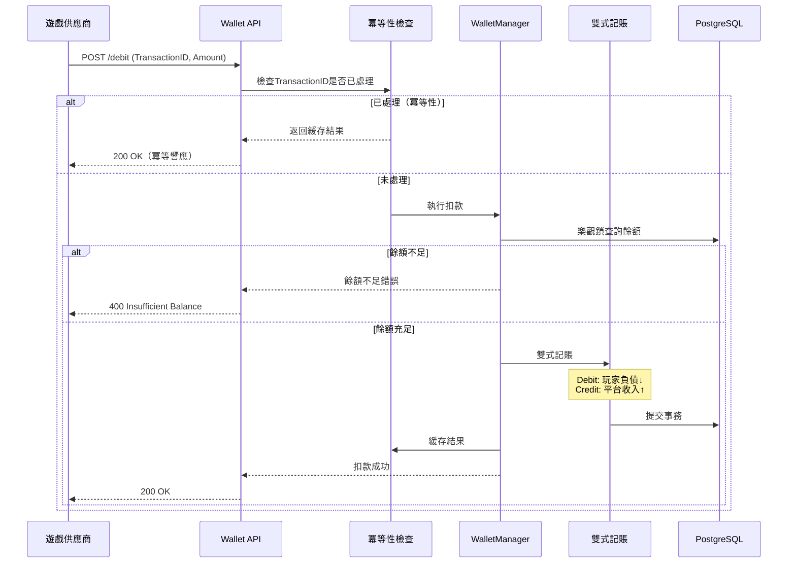

# 無縫錢包API需求分析報告（示例）

**文檔元數據**
- 產品經理：igame-pm-analyst
- 創建日期：2026-01-23
- 優先級：P0關鍵
- 預估工作量：12 人天
- 風險等級：🔴 高（涉及資金安全）

---

## 1. 需求背景（Why）

### 1.1 Ultrathink深度分析

#### 第一性原理拆解
```
第一層_表象層:
  需求描述: "實現無縫錢包API，供遊戲供應商調用扣款/加款"

第二層_交易層:
  資金流動:
    - 玩家下注 → 扣款（平台負債↓，遊戲廠商收入↑）
    - 玩家贏款 → 加款（平台負債↑，遊戲廠商支出↑）
  風險轉移:
    - 供應商API失敗 → 資金不一致風險
    - 網路重試 → 重複扣款風險

第三層_第一性原理層:
  Trust（信任）:
    - 數學保證：雙式記賬，帳務必定平衡
    - 冪等性保證：重試不會重複扣款
    - 審計完整：每筆交易可追溯

  Velocity（速度）:
    - API延遲 < 200ms（供應商SLA要求）
    - 支持10,000 TPS併發下注

  Friction（摩擦）:
    - 零轉帳：玩家無需在主帳戶與遊戲帳戶間劃轉
    - 即時響應：下注立即知道結果（非pending狀態）
```

#### 關鍵決策：為何選擇無縫錢包？

```
對比分析：

轉帳錢包（Transfer Wallet）:
❌ 玩家需手動劃轉資金到遊戲帳戶
❌ 摩擦增加，轉化率降低15-20%
❌ 用戶體驗差，競爭力弱
✅ 技術實現簡單

無縫錢包（Seamless Wallet）:
✅ 玩家無感知，直接下注
✅ 提升轉化率15-20%（行業數據）
✅ 競爭優勢明顯
❌ 技術實現複雜（需API驅動）
❌ 對性能要求極高（<200ms SLA）

結論：無縫錢包是競爭必需，技術挑戰可通過架構設計解決。
```

---

## 2. 功能需求（What）

### 2.1 核心API列表

| API名稱 | 用途 | 調用方 | 頻率 | SLA |
|---------|------|--------|------|-----|
| **GET /balance** | 查詢餘額 | 遊戲供應商 | 高頻 | <50ms |
| **POST /debit** | 扣款（下注） | 遊戲供應商 | 極高頻 | <200ms |
| **POST /credit** | 加款（贏款） | 遊戲供應商 | 極高頻 | <200ms |
| **POST /rollback** | 回滾（取消下注） | 遊戲供應商 | 低頻 | <500ms |

### 2.2 核心流程：下注扣款



### 2.3 API接口詳細設計

#### API 1: 查詢餘額
```
GET /api/wallet/balance?playerId=123456&currency=USD

Request Headers:
X-Operator-ID: operator123
X-Signature: sha256(secret + timestamp + playerId)

Response (Success):
{
  "code": 1,
  "message": "查詢成功",
  "data": {
    "playerId": 123456,
    "currency": "USD",
    "balance": 1234.56,
    "frozenBalance": 100.00,
    "availableBalance": 1134.56
  },
  "ok": true
}
```

#### API 2: 扣款（下注）
```
POST /api/wallet/debit

Request:
{
  "transactionId": "bet-20260123-123456",  // 供應商唯一ID（冪等性鍵）
  "playerId": 123456,
  "amount": 100.00,
  "currency": "USD",
  "gameId": "slot-001",
  "roundId": "round-123",
  "timestamp": 1706000000
}

Request Headers:
X-Operator-ID: operator123
X-Signature: sha256(secret + body)

Response (Success):
{
  "code": 1,
  "message": "扣款成功",
  "data": {
    "transactionId": "bet-20260123-123456",
    "playerId": 123456,
    "beforeBalance": 1234.56,
    "afterBalance": 1134.56,
    "amount": 100.00,
    "currency": "USD",
    "timestamp": 1706000005
  },
  "ok": true
}

Response (Insufficient Balance):
{
  "code": -1,
  "message": "餘額不足",
  "data": {
    "availableBalance": 50.00,
    "requiredAmount": 100.00
  },
  "ok": false
}

Response (Idempotent - Already Processed):
{
  "code": 1,
  "message": "該交易已處理（冪等響應）",
  "data": {
    "transactionId": "bet-20260123-123456",
    "processedAt": 1706000005,
    "cached": true
  },
  "ok": true
}
```

---

## 3. 技術方案摘要

### 3.1 架構設計：零悲觀鎖

```
為何禁用悲觀鎖（SELECT FOR UPDATE）？

問題：
- 高併發下，鎖等待導致延遲暴增（>1秒）
- 死鎖風險增加
- 無法達到<200ms SLA

解決方案：樂觀鎖 + Redis冪等性

流程：
1. 冪等性檢查（Redis）：O(1)，<5ms
2. 樂觀鎖查詢餘額（PostgreSQL）：無鎖等待
3. 業務邏輯判斷：內存計算
4. 雙式記賬寫入（version+1）：樂觀鎖保證一致性
5. 如失敗（version衝突）：自動重試（最多3次）
```

### 3.2 SmartAdmin分層設計

```java
// Controller層
@PostMapping("/wallet/debit")
@NoNeedLogin // 供應商調用，使用簽名驗證
public ResponseDTO<DebitResultVO> debit(@RequestBody @Valid DebitForm form) {
    // 1. 簽名驗證（供應商安全）
    signatureValidator.validate(form);

    // 2. 執行扣款
    DebitResultVO result = walletService.debit(form);

    return ResponseDTO.ok(result);
}

// Service層
@Service
@RequiredArgsConstructor
public class WalletService {
    private final WalletManager walletManager;
    private final LedgerManager ledgerManager;

    public DebitResultVO debit(DebitForm form) {
        // 1. 冪等性檢查（快速路徑）
        DebitResultVO cachedResult = checkIdempotency(form.getTransactionId());
        if (cachedResult != null) {
            return cachedResult; // 冪等響應
        }

        // 2. 執行扣款
        return walletManager.processDebit(form);
    }
}

// Manager層（事務 + 冪等性）
@Service
@RequiredArgsConstructor
public class WalletManager {
    private final WalletAccountDao walletAccountDao;
    private final LedgerEntryDao ledgerEntryDao;
    private final RedisTemplate redisTemplate;

    @Transactional(rollbackFor = Exception.class)
    public DebitResultVO processDebit(DebitForm form) {
        String lockKey = "lock:wallet:debit:" + form.getPlayerId();
        RLock lock = redissonClient.getLock(lockKey);

        try {
            if (lock.tryLock(5, 10, TimeUnit.SECONDS)) {
                // 1. 樂觀鎖查詢餘額
                WalletAccountEntity account = walletAccountDao.selectById(form.getPlayerId());

                // 2. 驗證餘額
                if (account.getAvailableBalance().compareTo(form.getAmount()) < 0) {
                    throw new BusinessException("餘額不足");
                }

                // 3. 雙式記賬
                ledgerManager.recordDebit(form);

                // 4. 樂觀鎖更新餘額（version自動+1）
                account.setBalance(account.getBalance().subtract(form.getAmount()));
                int rows = walletAccountDao.updateById(account);
                if (rows == 0) {
                    throw new BusinessException("餘額已被修改，請重試");
                }

                // 5. 緩存冪等性結果（24小時）
                cacheIdempotencyResult(form.getTransactionId(), result);

                return buildResult(account, form);
            } else {
                throw new BusinessException("系統繁忙，請稍後重試");
            }
        } finally {
            if (lock.isHeldByCurrentThread()) {
                lock.unlock();
            }
        }
    }
}
```

### 3.3 依賴的Foundation模組

- [x] **P0-01: 雙式記賬架構**（必須）
  - 確保資金安全的數學保證

- [x] **P0-02: 冪等性架構**（必須）
  - 防止網路重試導致重複扣款

- [x] **foundation.redis-lock** (分佈式鎖)
  - 防止併發扣款衝突

- [x] **foundation.cache** (Redis緩存)
  - 緩存冪等性結果（24小時）
  - 緩存玩家餘額（5分鐘）

---

## 4. 風險評估

### 4.1 資金安全風險 🔴 高

#### 風險場景
1. **重複扣款**：網路重試導致同一筆下注扣款2次
2. **餘額變負數**：併發扣款未正確處理
3. **帳務不平衡**：系統崩潰時記賬數據不一致

#### 緩解措施
1. ✅ **強制冪等性**：TransactionID唯一性驗證 + Redis緩存
2. ✅ **雙式記賬**：Sum(Debit) = Sum(Credit)，每日自動對帳
3. ✅ **樂觀鎖**：version字段防止併發衝突
4. ✅ **熔斷機制**：帳務不平衡自動熔斷，停止交易

---

### 4.2 性能風險 🔴 高

#### 風險場景
- API延遲超過200ms，供應商超時重試
- 10,000 TPS併發下資料庫連接池耗盡

#### 緩解措施
1. ✅ **冪等性快速路徑**：Redis檢查<5ms，直接返回緩存結果
2. ✅ **樂觀鎖替代悲觀鎖**：無鎖等待
3. ✅ **異步記帳日誌**：Kafka異步寫入明細日誌
4. ✅ **連接池優化**：HikariCP，最大連接數100

#### 性能目標
| 指標 | 目標值 | 壓測驗證 |
|------|-------|---------|
| 餘額查詢延遲 | <50ms（P95） | JMeter 10K QPS |
| 扣款API延遲 | <200ms（P95） | JMeter 10K TPS |
| 吞吐量 | >10,000 TPS | 持續壓測30分鐘 |

---

### 4.3 合規風險 🟡 中

#### 風險場景
- 審計日誌不完整，無法追溯交易
- 供應商惡意調用，資金被盜

#### 緩解措施
1. ✅ **完整審計日誌**：每筆交易記錄前後餘額
2. ✅ **簽名驗證**：供應商請求必須攜帶簽名
3. ✅ **IP白名單**：僅允許供應商IP調用
4. ✅ **異常告警**：單筆>10萬或單日>100萬觸發告警

---

## 5. 實施計劃（預估12人天）

### 階段1：核心功能開發（6天）
- [ ] T1: 雙式記賬架構集成（2天）
- [ ] T2: 冪等性架構實現（1天）
- [ ] T3: 樂觀鎖 + Redis鎖機制（1天）
- [ ] T4: Manager/Service/Controller實現（2天）

### 階段2：安全與性能（3天）
- [ ] T5: 簽名驗證機制（1天）
- [ ] T6: 性能優化（緩存策略）（1天）
- [ ] T7: 熔斷與告警（1天）

### 階段3：測試與驗證（3天）
- [ ] T8: 冪等性測試（網路重試）（1天）
- [ ] T9: 併發測試（10,000 TPS）（1天）
- [ ] T10: 帳務對帳測試（1天）

---

## 6. 驗收標準

#### 功能驗收
- [x] 冪等性：網路重試無重複扣款
- [x] 一致性：每日對帳 Sum(Debit) = Sum(Credit)
- [x] 併發：10,000 TPS無餘額變負數

#### 性能驗收
- [x] 餘額查詢 < 50ms（P95）
- [x] 扣款API < 200ms（P95）
- [x] 吞吐量 > 10,000 TPS

#### 安全驗收
- [x] 簽名驗證100%通過
- [x] 無SQL注入漏洞
- [x] 審計日誌完整

---

## 參考文檔

- [P0-01: 雙式記賬架構](../../docs/iGame/technical-specs/P0-critical/01-double-entry-ledger-schema.md)
- [P0-02: 冪等性架構](../../docs/iGame/technical-specs/P0-critical/02-idempotency-architecture.md)
- [P0-03: 無縫錢包實現](../../docs/iGame/technical-specs/P0-critical/03-seamless-wallet-implementation.md)

---

**下一步行動**：
將此需求分析報告傳遞給 java-architect，優先實現P0-01和P0-02基礎架構。
