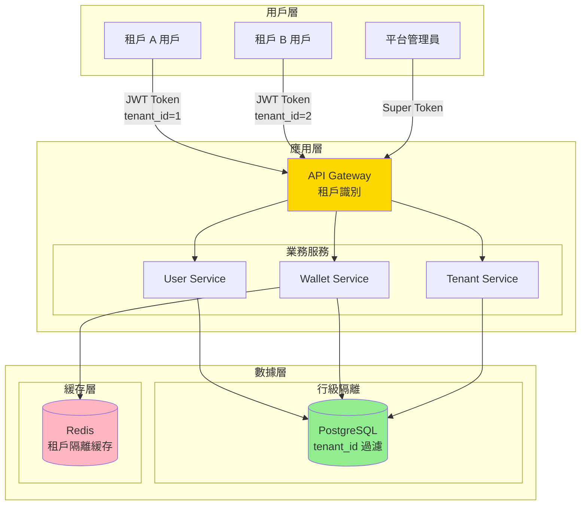
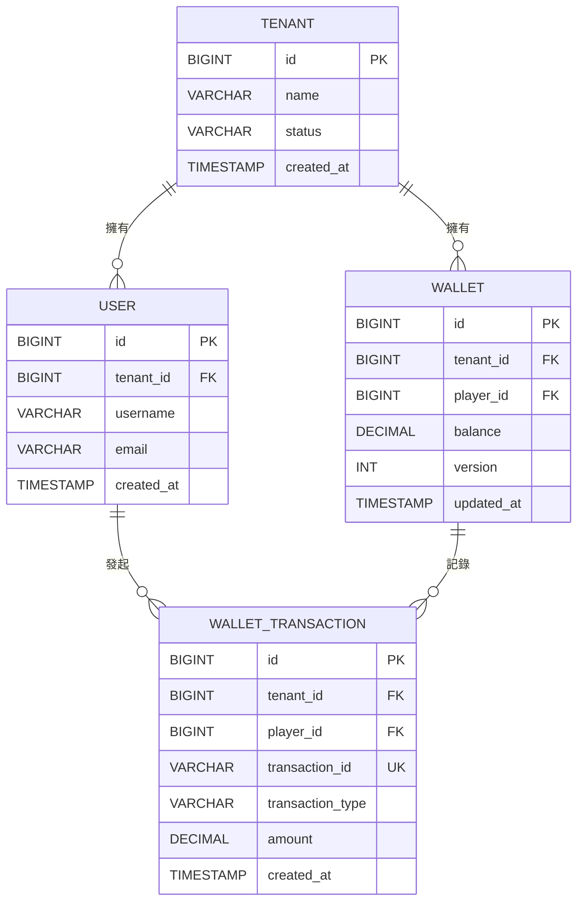
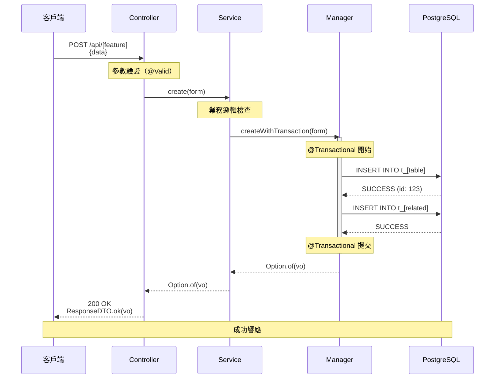
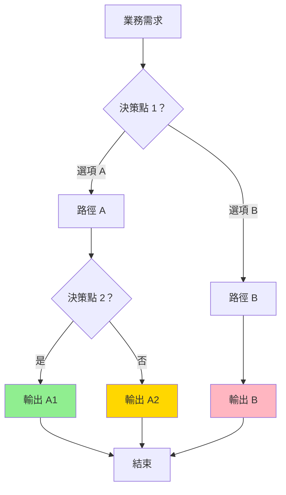

# PRD 文檔模板（繁體中文標準格式）

**文檔版本**: v1.0.0
**用途**: 為 igaming-multi-tenant-wallet-pm Skill 提供標準化的 PRD 文檔結構模板

---

## 📋 模板使用說明

本模板遵循 6 章節結構,適用於 iGaming 多商戶和無縫錢包相關的產品需求文檔。

**6 章節結構**:
1. §1 執行摘要
2. §2 需求分析
3. §3 技術方案
4. §4 深度分析（Ultrathink）
5. §5 實施計劃
6. §6 風險與合規

**Mermaid 圖表要求**:
- §3.1 架構設計: 必須包含 1 個 C4 架構圖（graph TB / flowchart）
- §3.3 數據模型: 必須包含 1 個 erDiagram
- §3.4 API 規格: 必須包含至少 1 個 sequenceDiagram
- §4.3 場景枚舉: 推薦使用 flowchart

---

## 🎯 完整 PRD 模板

```markdown
# [功能名稱] 產品需求文檔（PRD）

## 文檔資訊

- **版本**: v1.0.0
- **創建日期**: 2026-01-29
- **最後更新**: 2026-01-29
- **文檔類型**: 產品需求文檔（PRD）
- **狀態**: 待評審
- **作者**: [產品經理姓名]
- **審核者**: [技術 Leader, 法務, 財務]

---

## 📋 目錄

- [§1 執行摘要](#1-執行摘要)
- [§2 需求分析](#2-需求分析)
- [§3 技術方案](#3-技術方案)
- [§4 深度分析（Ultrathink）](#4-深度分析ultrathink)
- [§5 實施計劃](#5-實施計劃)
- [§6 風險與合規](#6-風險與合規)
- [附錄](#附錄)

---

## §1 執行摘要

### 1.1 背景與目標

**業務背景**:
[描述為什麼需要這個功能，當前存在什麼問題或機會]

**目標**:
- **商業目標**: [如：支持 SaaS 訂閱模式，降低部署成本]
- **技術目標**: [如：統一代碼庫管理多租戶，降低運維複雜度]
- **用戶目標**: [如：為企業級客戶提供獨立空間，保障數據安全]

**範圍界定**:
- ✅ **包含**: [列舉明確包含的功能]
- ❌ **不包含**: [列舉明確排除的功能]

---

### 1.2 核心價值

| 價值維度 | 說明 | 預期成果 |
|---------|------|---------|
| **商業價值** | [如：支持 SaaS 訂閱模式] | [如：6 個月內獲客 50 家企業] |
| **技術價值** | [如：統一代碼庫管理多租戶] | [如：運維成本降低 40%] |
| **用戶價值** | [如：獨立空間，數據安全] | [如：客戶滿意度 > 90%] |

---

### 1.3 關鍵指標（KPI）

| 指標類型 | 指標名稱 | 目標值 | 測量方式 |
|---------|---------|-------|---------|
| **商業指標** | [如：新增商戶數量] | [如：50 家/季度] | [如：商戶註冊統計] |
| **技術指標** | [如：API 響應時間 P95] | [如：< 200ms] | [如：APM 監控] |
| **用戶指標** | [如：客戶滿意度] | [如：> 90%] | [如：NPS 調查] |

---

## §2 需求分析

### 2.1 業務場景

#### 場景 1: [場景名稱]

**角色**: [用戶角色]

**需求**:
- [需求 1]
- [需求 2]
- [需求 3]

**示例**: [具體示例，如：某 SaaS 公司提供企業 OA 服務...]

**優先級**: [P0 / P1 / P2]

---

#### 場景 2: [場景名稱]

[同上結構]

---

### 2.2 用戶角色

| 角色 | 權限範圍 | 典型操作 | 使用場景 |
|-----|---------|---------|---------|
| [角色 1] | [權限範圍] | [典型操作] | [使用場景] |
| [角色 2] | [權限範圍] | [典型操作] | [使用場景] |

---

### 2.3 功能需求清單

| 編號 | 功能名稱 | 說明 | 優先級 | 預估工時 | 依賴項 |
|------|---------|------|-------|---------|--------|
| FR-01 | [功能 1] | [說明] | P0 | 5 天 | 無 |
| FR-02 | [功能 2] | [說明] | P1 | 3 天 | FR-01 |
| FR-03 | [功能 3] | [說明] | P2 | 2 天 | FR-01 |

---

### 2.4 非功能性需求

| 類型 | 需求 | 目標值 | 驗證方式 |
|------|------|-------|---------|
| **性能** | API 響應時間 P95 | < 200ms | 壓力測試 |
| **性能** | 支持並發 TPS | > 1000 | JMeter 測試 |
| **安全** | 數據加密 | AES-256 | 安全審計 |
| **合規** | GDPR 合規 | 100% | 法務審核 |
| **可用性** | 系統可用性 | 99.9% | 監控統計 |

---

## §3 技術方案

### 3.1 架構設計

#### 系統架構圖（Mermaid C4 模型）



#### 架構設計說明

**架構類型**: [如：多商戶行級隔離架構]

**核心組件**:
- **API Gateway**: [職責說明]
- **業務服務**: [職責說明]
- **數據層**: [職責說明]

**關鍵決策**:
| 決策點 | 方案 A | 方案 B | 選擇 | 理由 |
|-------|-------|-------|------|------|
| [決策點 1] | [方案 A] | [方案 B] | ✅ 方案 A | [理由] |

---

### 3.2 SmartAdmin 分層設計

#### Controller 層

**職責**:
- 接收 HTTP 請求
- 參數驗證（@Valid）
- 調用 Service 層
- 使用 ResponseDTO 統一返回格式

**規範**:
- ❌ **禁止**: 直接調用 Dao/Manager
- ✅ **必須**: 使用 ResponseDTO.ok() / ResponseDTO.error()

**示例**:

```java
@RestController
@RequiredArgsConstructor
public class [FeatureName]Controller {
    private final [FeatureName]Service service;

    @PostMapping("/api/[feature]")
    public ResponseDTO<[ResponseVO]> create(@RequestBody @Valid [FeatureForm] form) {
        return service.create(form)
            .map(ResponseDTO::ok)
            .getOrElse(() -> ResponseDTO.error(UserErrorCode.DATA_NOT_EXIST));
    }
}
```

---

#### Service 層

**職責**:
- 業務邏輯編排
- 可直接調用 Dao（單表 CRUD）
- 委託給 Manager（需要 @Transactional 或 @Cacheable）

**規範**:
- ❌ **禁止**: 使用 @Transactional（必須委託給 Manager）
- ✅ **必須**: 返回 Option<T>（Vavr）

**示例**:

```java
@Service
@RequiredArgsConstructor
public class [FeatureName]Service {
    private final [FeatureName]Dao dao;
    private final [FeatureName]Manager manager;

    // 單表查詢：直接調用 Dao
    public Option<[FeatureVO]> getById(Long id) {
        return dao.selectById(id)
            .map(entity -> SmartBeanUtil.copy(entity, [FeatureVO].class));
    }

    // 需要事務：委託給 Manager
    public Option<[FeatureVO]> create([FeatureForm] form) {
        return manager.createWithTransaction(form);
    }
}
```

---

#### Manager 層

**職責**:
- 跨表事務管理
- 緩存管理（@Cacheable）
- 複雜業務邏輯

**規範**:
- ✅ **必須**: @Transactional(rollbackFor = Throwable.class)
- ✅ **可選**: @Cacheable（僅在 Manager 層）

**示例**:

```java
@Service
@RequiredArgsConstructor
public class [FeatureName]Manager {
    private final [FeatureName]Dao dao;
    private final [Related]Dao relatedDao;

    @Transactional(rollbackFor = Throwable.class)
    public Option<[FeatureVO]> createWithTransaction([FeatureForm] form) {
        // 插入主表
        [FeatureName]Entity entity = SmartBeanUtil.copy(form, [FeatureName]Entity.class);
        dao.insert(entity);

        // 插入關聯表
        [Related]Entity related = new [Related]Entity();
        related.setFeatureId(entity.getId());
        relatedDao.insert(related);

        return Option.of(SmartBeanUtil.copy(entity, [FeatureVO].class));
    }
}
```

---

#### Dao 層

**職責**:
- 數據訪問
- MyBatis Mapper

**規範**:
- ✅ **必須**: 繼承 BaseMapper<T>
- ❌ **禁止**: 業務邏輯

**示例**:

```java
@Mapper
public interface [FeatureName]Dao extends BaseMapper<[FeatureName]Entity> {
    // MyBatis Plus 自動提供 CRUD 方法
    // 自定義查詢方法
}
```

---

### 3.3 數據模型

#### ER 圖（Mermaid erDiagram）



---

#### 數據庫 DDL

**主表**:

```sql
-- [表名] 表
CREATE TABLE t_[table_name] (
    id BIGSERIAL PRIMARY KEY,
    tenant_id BIGINT NOT NULL COMMENT '租戶ID（多商戶隔離）',
    -- [業務欄位]
    created_at TIMESTAMP DEFAULT NOW() COMMENT '創建時間',
    updated_at TIMESTAMP DEFAULT NOW() COMMENT '更新時間',
    version INT DEFAULT 0 COMMENT '樂觀鎖版本號',
    deleted_flag TINYINT DEFAULT 0 COMMENT '刪除標記',
    CONSTRAINT ck_tenant_id CHECK (tenant_id > 0),
    INDEX idx_[table]_tenant (tenant_id, deleted_flag)
);

COMMENT ON TABLE t_[table_name] IS '[表說明]';
```

**關聯表**:

```sql
-- [關聯表名] 表
CREATE TABLE t_[related_table] (
    id BIGSERIAL PRIMARY KEY,
    tenant_id BIGINT NOT NULL COMMENT '租戶ID',
    [main_table]_id BIGINT NOT NULL COMMENT '主表外鍵',
    -- [業務欄位]
    created_at TIMESTAMP DEFAULT NOW(),
    deleted_flag TINYINT DEFAULT 0,
    INDEX idx_[related]_main (tenant_id, [main_table]_id)
);
```

---

#### Foundation 模組依賴

本功能依賴以下 SmartAdmin Foundation 模組:

| 模組 | 用途 | 引用示例 |
|------|------|---------|
| `foundation.tenant` | 多租戶上下文（TenantContextHolder） | `TenantContextHolder.getCurrentTenantId()` |
| `foundation.cache` | Redis 緩存 | `@Cacheable`, RedisTemplate |
| `foundation.redis-lock` | 分佈式鎖 | RedissonClient |
| [其他模組] | [用途] | [示例] |

---

### 3.4 API 規格

#### API 時序圖（Mermaid sequenceDiagram）

**示例：創建 [功能] API 時序圖**



---

#### API 端點清單

| 端點 | 方法 | 說明 | 權限 | Request | Response |
|------|------|------|------|---------|----------|
| `/api/[feature]` | POST | 創建 [功能] | 需登錄 | [FeatureForm] | ResponseDTO<[FeatureVO]> |
| `/api/[feature]/{id}` | GET | 查詢 [功能] | 需登錄 | - | ResponseDTO<[FeatureVO]> |
| `/api/[feature]/{id}` | PUT | 更新 [功能] | 需登錄 | [FeatureForm] | ResponseDTO<Void> |
| `/api/[feature]/{id}` | DELETE | 刪除 [功能] | 需登錄 | - | ResponseDTO<Void> |

---

#### Request/Response 結構

**CreateRequest**:

```java
@Data
public class [Feature]Form {
    @NotNull(message = "[欄位]不能為空")
    private String field1;

    @Size(max = 100, message = "[欄位]長度不能超過 100")
    private String field2;
}
```

**Response**:

```java
@Data
@Builder
public class [Feature]VO {
    private Long id;
    private String field1;
    private String field2;
    private LocalDateTime createdAt;
}
```

---

## §4 深度分析（Ultrathink）

### 4.1 問題拆解

**核心問題**: [描述需要解決的核心問題]

**子問題**:
1. **Q1**: [子問題 1]
2. **Q2**: [子問題 2]
3. **Q3**: [子問題 3]

---

### 4.2 第一性原理

**基本事實**:
- **事實 1**: [從第一性原理出發的基本事實]
- **事實 2**: [從第一性原理出發的基本事實]
- **事實 3**: [從第一性原理出發的基本事實]

**推理過程**:
[從基本事實出發,推理出解決方案]

---

### 4.3 場景枚舉

#### Mermaid 決策樹



---

#### 場景對比表

| 場景 | 條件 | 處理方式 | 預期結果 | 優先級 |
|------|------|---------|---------|-------|
| 場景 1 | [條件] | [處理方式] | [預期結果] | P0 |
| 場景 2 | [條件] | [處理方式] | [預期結果] | P1 |
| 場景 3 | [條件] | [處理方式] | [預期結果] | P2 |

---

### 4.4 風險評估

#### 三維風險矩陣

| 風險類型 | 風險等級 | 影響範圍 | 觸發條件 | 緩解方案 | 負責人 |
|---------|---------|---------|---------|---------|--------|
| **資金安全** |  |  |  |  |  |
| [風險 1] | 🔴 Critical | [影響] | [觸發條件] | [緩解方案] | [負責人] |
| [風險 2] | 🟠 High | [影響] | [觸發條件] | [緩解方案] | [負責人] |
| **性能風險** |  |  |  |  |  |
| [風險 3] | 🟡 Medium | [影響] | [觸發條件] | [緩解方案] | [負責人] |
| **合規風險** |  |  |  |  |  |
| [風險 4] | 🔴 Critical | [影響] | [觸發條件] | [緩解方案] | [負責人] |

**風險等級定義**:
- 🔴 **Critical**: 直接經濟損失或合規風險，立即響應
- 🟠 **High**: 重大影響但無直接損失，24 小時內響應
- 🟡 **Medium**: 中等影響，可容忍短期存在，1 週內響應
- 🟢 **Low**: 輕微影響，技術債務，1 個月內響應

---

### 4.5 方案對比

| 方案 | 優勢 | 劣勢 | 適用場景 | 實現複雜度 | 推薦度 |
|------|------|------|---------|-----------|--------|
| **方案 A** | [優勢] | [劣勢] | [場景] | ⭐⭐⭐ | ✅ **推薦** |
| **方案 B** | [優勢] | [劣勢] | [場景] | ⭐⭐⭐⭐ | ❌ 不推薦 |
| **方案 C** | [優勢] | [劣勢] | [場景] | ⭐⭐ | 🟡 可選 |

---

### 4.6 決策推理

**最終決策**: [選擇方案 A]

**理由**:
1. [理由 1]
2. [理由 2]
3. [理由 3]

**業界標準對比**:
- **Pragmatic Play**: [業界標準 1]
- **Evolution Gaming**: [業界標準 2]
- **Bet365**: [業界標準 3]

**未選擇其他方案的原因**:
- **方案 B**: [不選擇的理由]
- **方案 C**: [不選擇的理由]

---

## §5 實施計劃

### 5.1 開發任務拆解

| 任務編號 | 任務名稱 | 說明 | 預估工時 | 負責人 | 依賴項 | 優先級 |
|---------|---------|------|---------|--------|--------|-------|
| TASK-01 | [任務 1] | [說明] | 2 天 | 後端 Leader | 無 | P0 |
| TASK-02 | [任務 2] | [說明] | 3 天 | 後端團隊 | TASK-01 | P0 |
| TASK-03 | [任務 3] | [說明] | 1 天 | 前端團隊 | TASK-02 | P1 |
| TASK-04 | [任務 4] | [說明] | 2 天 | 測試團隊 | TASK-03 | P1 |

---

### 5.2 時間估算

| 階段 | 開始日期 | 結束日期 | 工作日 | 負責團隊 | 交付物 |
|------|---------|---------|-------|---------|--------|
| **需求評審** | 2026-02-01 | 2026-02-03 | 3 天 | 產品 + 技術 | PRD 文檔終版 |
| **技術設計** | 2026-02-04 | 2026-02-07 | 4 天 | 後端 Leader | 技術設計文檔 |
| **開發實施** | 2026-02-08 | 2026-02-21 | 10 天 | 後端團隊 | 後端代碼 |
| **前端開發** | 2026-02-15 | 2026-02-25 | 8 天 | 前端團隊 | 前端代碼 |
| **聯調測試** | 2026-02-22 | 2026-02-28 | 5 天 | QA 團隊 | 測試報告 |
| **上線部署** | 2026-03-01 | 2026-03-03 | 3 天 | DevOps | 生產環境 |

**總工期**: 約 30 個工作日（6 週）

---

### 5.3 里程碑

| 里程碑 | 日期 | 驗收標準 | 狀態 |
|-------|------|---------|------|
| **M1: 需求評審通過** | 2026-02-03 | PRD 文檔簽字確認 | ⏳ 待完成 |
| **M2: 技術設計完成** | 2026-02-07 | 技術評審會議通過 | ⏳ 待完成 |
| **M3: 後端開發完成** | 2026-02-21 | 單元測試覆蓋率 > 80% | ⏳ 待完成 |
| **M4: 前端開發完成** | 2026-02-25 | UI/UX 評審通過 | ⏳ 待完成 |
| **M5: 聯調測試通過** | 2026-02-28 | 所有測試用例通過 | ⏳ 待完成 |
| **M6: 生產上線** | 2026-03-03 | 煙霧測試通過 | ⏳ 待完成 |

---

## §6 風險與合規

### 6.1 地區合規要求

**對比表**：歐洲/亞洲/美洲/中國

| 地區 | 牌照類型 | KYC 嚴格度 | 稅率 | 處理時間 | 推薦場景 |
|-----|---------|----------|------|---------|---------|
| 🇪🇺 **歐洲 MGA** | 馬爾他博彩管理局 | ⭐⭐⭐⭐⭐ 嚴格 | 5% GGR | 6-12 個月 | 合規要求高的歐洲市場 |
| 🇨🇼 **Curacao** | Curacao eGaming | ⭐⭐ 寬鬆 | 固定費用 | 1-3 個月 | 快速上線,預算有限 |
| 🇵🇭 **菲律賓 PAGCOR** | 菲律賓娛樂博彩公司 | ⭐⭐⭐ 中等 | 5% GGR | 3-6 個月 | 亞洲市場主流選擇 |
| 🇺🇸 **內華達州** | Nevada Gaming Control Board | ⭐⭐⭐⭐⭐ 最嚴格 | 6.75% GGR | 12-24 個月 | 美國合法市場 |
| 🇨🇷 **哥斯達黎加** | 自我監管 | ⭐ 最寬鬆 | 無稅 | 1 個月 | 離岸運營（風險高） |
| 🇲🇴 **澳門** | 澳門博彩監察協調局 | ⭐⭐⭐⭐ 嚴格 | 39% GGR | 特許制 | 實體賭場為主 |

**本功能目標地區**: [列舉本功能支持的地區]

**合規要求檢查清單**:
- [ ] KYC 驗證流程完整（分級：1-5）
- [ ] AML 檢測機制完整（大額交易閾值）
- [ ] GDPR 合規（如適用於歐洲）
- [ ] 稅務計算正確（GGR 稅率）
- [ ] 法務團隊審核通過

---

### 6.2 安全風險評估

| 風險 | 風險等級 | 緩解方案 | 驗證方法 | 負責人 |
|------|---------|---------|---------|--------|
| 重複扣款 | 🔴 Critical | 三層冪等性防護（Redis + DB + 鎖） | 並發壓測（1000 TPS） | 後端 Leader |
| 數據洩漏 | 🔴 Critical | tenant_id 自動注入（MyBatis 攔截器） | ArchitectureTest 驗證 | 後端 Leader |
| SQL 注入 | 🟠 High | MyBatis 預編譯 + 參數化查詢 | 滲透測試 | 安全團隊 |
| XSS 攻擊 | 🟠 High | 前端輸入過濾 + 後端轉義 | 安全審計 | 前端 Leader |
| [其他風險] | [等級] | [緩解方案] | [驗證方法] | [負責人] |

---

### 6.3 性能風險評估

| 風險 | 風險等級 | 影響 | 緩解方案 | 驗證方法 |
|------|---------|------|---------|---------|
| 高並發扣款超時 | 🟠 High | 用戶體驗差 | Redis 緩存 + 數據庫分片 | JMeter 壓測 |
| 數據庫連接池耗盡 | 🟠 High | 服務不可用 | 連接池監控 + 告警 | APM 監控 |
| Redis 快取擊穿 | 🟡 Medium | 短暫延遲 | 布隆過濾器 + 永不過期 | 壓測 + 監控 |
| [其他風險] | [等級] | [影響] | [緩解方案] | [驗證方法] |

---

### 6.4 緩解方案

#### 資金安全緩解方案

**風險**: 重複扣款

**緩解方案**:
1. **Layer 1**: Redis 快取（TTL 24 小時）
2. **Layer 2**: 資料庫唯一索引（transaction_id UNIQUE）
3. **Layer 3**: 分佈式鎖（Redisson，超時 10 秒）

**驗證方法**:
- 並發壓測（1000 TPS）
- 模擬 Redis 故障場景
- 驗證 DB 唯一索引生效

---

#### 性能緩解方案

**風險**: 高並發扣款超時

**緩解方案**:
1. **Redis 緩存**: 餘額查詢緩存（TTL 5 分鐘）
2. **數據庫分片**: 按 user_id 分表（避免熱點用戶）
3. **連接池優化**: HikariCP 連接池大小 50

**驗證方法**:
- JMeter 壓測（1000 TPS，持續 10 分鐘）
- APM 監控 API P95 延遲 < 200ms

---

#### 合規緩解方案

**風險**: KYC 驗證不足

**緩解方案**:
1. **多層級 KYC 驗證**:
   - Level 1: 基本資訊（姓名、郵箱）
   - Level 2: 身份證明（護照、駕照）
   - Level 3: 地址證明（水電費賬單）
   - Level 4: 財務證明（銀行流水）
   - Level 5: 視頻驗證（視頻通話）

2. **自動 KYC 服務整合**:
   - 歐洲：Onfido, Jumio
   - 亞洲：ADVANCE.AI, Accuity

**驗證方法**:
- 法務團隊審核 KYC 流程
- 合規團隊模擬測試

---

## 附錄

### 附錄 A: 術語表

| 術語 | 英文 | 說明 |
|------|------|------|
| [術語 1] | [English] | [說明] |
| [術語 2] | [English] | [說明] |

---

### 附錄 B: 參考文檔

- [文檔 1 名稱](文檔 1 路徑)
- [文檔 2 名稱](文檔 2 路徑)

---

### 附錄 C: 變更歷史

| 版本 | 日期 | 變更內容 | 作者 |
|------|------|---------|------|
| v1.0.0 | 2026-01-29 | 初始版本 | [作者] |

---

**文檔結束**
```

---

## 🎨 模板變數說明

### 必須替換的變數

| 變數 | 說明 | 示例 |
|------|------|------|
| `[功能名稱]` | 功能的中文名稱 | 多商戶 VIP 系統 |
| `[FeatureName]` | 功能的英文名稱（駝峰命名） | MultiTenantVip |
| `[table_name]` | 資料庫表名 | multi_tenant_vip |
| `[產品經理姓名]` | 作者姓名 | 張三 |
| `[技術 Leader]` | 審核者姓名 | 李四 |

### 可選替換的變數

| 變數 | 說明 | 默認值 |
|------|------|-------|
| `[如：...]` | 示例說明 | 根據實際情況填寫 |
| `[描述...]` | 詳細描述 | 根據實際情況填寫 |

---

## ✅ PRD 質量檢查清單

使用本模板生成 PRD 後，請完成以下檢查:

### 內容完整性

- [ ] §1 執行摘要：背景、目標、核心價值、KPI 完整
- [ ] §2 需求分析：業務場景、用戶角色、功能需求清單完整
- [ ] §3 技術方案：架構圖、分層設計、數據模型、API 規格完整
- [ ] §4 深度分析：Ultrathink 六步驟完整
- [ ] §5 實施計劃：任務拆解、時間估算、里程碑完整
- [ ] §6 風險與合規：地區合規、安全風險、性能風險、緩解方案完整

### Mermaid 圖表

- [ ] §3.1 架構設計：包含 1 個 C4 架構圖（graph TB / flowchart）
- [ ] §3.3 數據模型：包含 1 個 erDiagram
- [ ] §3.4 API 規格：包含至少 1 個 sequenceDiagram
- [ ] §4.3 場景枚舉：包含 flowchart 決策樹
- [ ] 所有 Mermaid 圖表渲染正常（節點數 ≤ 20）

### SmartAdmin 規範

- [ ] §3.2 明確 Controller → Service → Manager → Dao 分層
- [ ] §3.3 列出 Foundation 模組依賴
- [ ] 數據庫 DDL 包含 tenant_id 欄位
- [ ] Manager 層標註 @Transactional(rollbackFor = Throwable.class)
- [ ] Service 層返回 Option<T>（Vavr）
- [ ] 避免反模式（如：多租戶數據洩漏、非冪等、Token 驗證混淆）

### 風險評估

- [ ] 資金安全風險評估完整
- [ ] 性能風險評估完整
- [ ] 合規風險評估完整
- [ ] 每個風險都有緩解方案和驗證方法

### 格式規範

- [ ] 所有表格格式正確（Markdown 表格語法）
- [ ] 代碼區塊語法高亮標記正確（```java, ```sql, ```mermaid）
- [ ] 繁體中文用詞統一
- [ ] 文檔版本號、日期、作者資訊完整

---

**模板版本**: v1.0.0
**最後更新**: 2026-01-29
**維護者**: SmartAdmin Team
