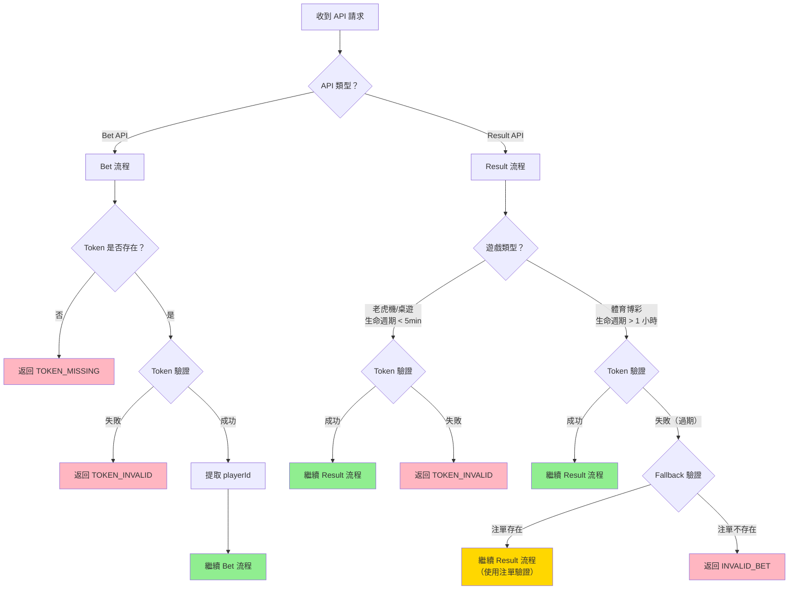
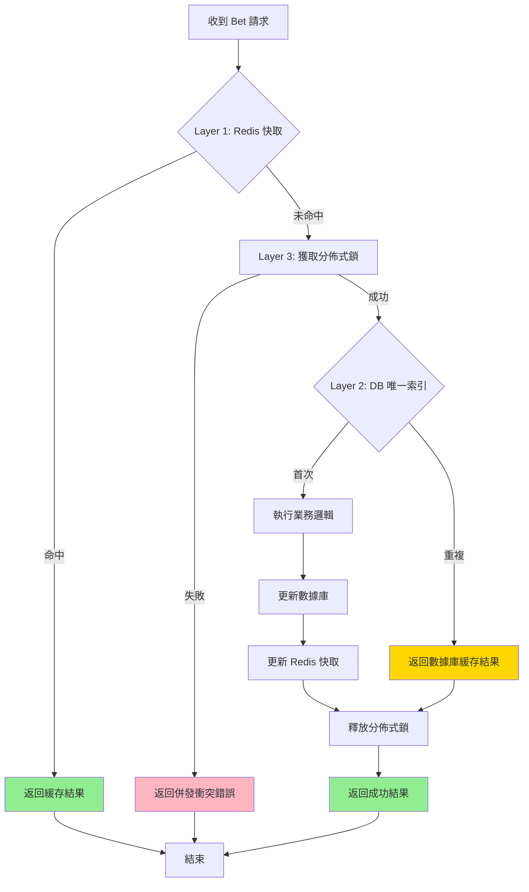
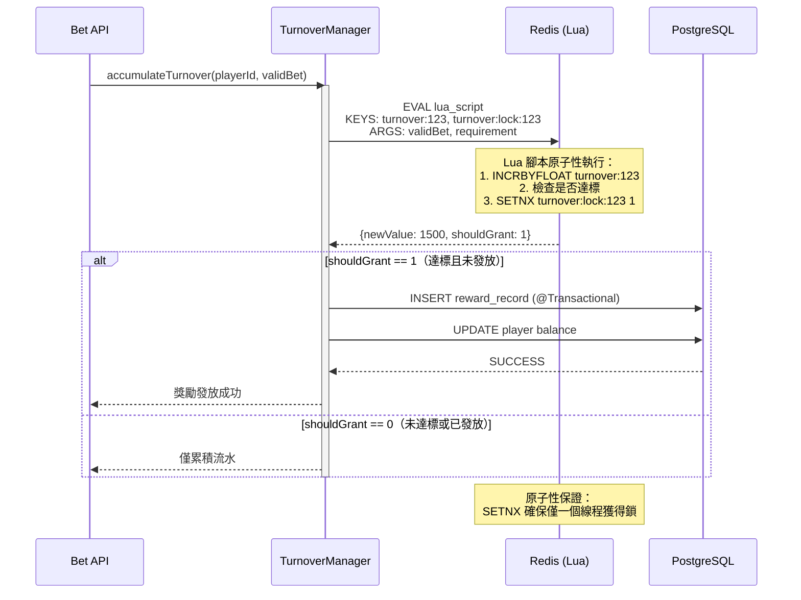
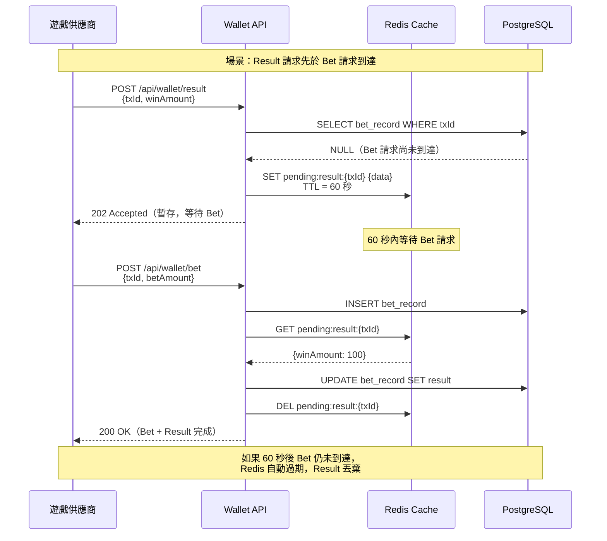

# 無縫錢包核心模式（13 個專題整合）

**文檔版本**: v1.0.0
**創建日期**: 2026-01-29
**來源**: `docs/IGaming/seamless_wallet_analysis/` (13 個專題文檔)
**用途**: 為 igaming-multi-tenant-wallet-pm Skill 提供可複用的無縫錢包模式庫

---

## 📋 目錄

- [模式索引](#模式索引)
- [快速查詢表](#快速查詢表)
- [模式詳解](#模式詳解)
  - [P0 模式（必須實現）](#p0-模式必須實現)
  - [P1 模式（核心業務）](#p1-模式核心業務)
  - [P2 模式（可選優化）](#p2-模式可選優化)
- [SmartAdmin 集成指南](#smartadmin-集成指南)
- [參考資料](#參考資料)

---

## 模式索引

| 編號 | 專題 | 原始文檔 | 使用場景 | 優先級 | 章節 |
|------|------|---------|---------|-------|------|
| 01 | Token 驗證決策樹 | 01_token_verification_decision_tree.md | API 身份驗證 | P0 | [§1](#模式-01token-驗證決策樹) |
| 02 | 冪等性分層設計 | 02_idempotency_layered_design.md | 防止重複扣款 | P0 | [§2](#模式-02冪等性分層設計) |
| 03 | 體育博彩邏輯 | 03_sports_betting_valid_bet_logic.md | 體育遊戲流水計算 | P1 | [§3](#模式-03體育博彩-valid-bet-邏輯) |
| 04 | 免費旋轉流水 | 04_free_spins_turnover_calculation.md | 老虎機活動 | P1 | [§4](#模式-04免費旋轉流水計算) |
| 05 | 輪盤對沖檢測 | 05_roulette_coverage_detection_algorithm.md | 風控檢測 | P1 | [§5](#模式-05輪盤對沖檢測算法) |
| 06 | 百家樂平局邏輯 | 06_baccarat_tie_bet_valid_bet_logic.md | 桌面遊戲流水 | P2 | [§6](#模式-06百家樂平局邏輯) |
| 07 | 流水並發累積 | 07_turnover_accumulation_concurrency.md | 高併發場景 | P0 | [§7](#模式-07流水並發累積) |
| 08 | 會計條目修正 | 08_accounting_entries_correction.md | 財務合規 | P1 | [§8](#模式-08會計條目修正) |
| 09 | 對賬模型分離 | 09_reconciliation_model_separation.md | 財務對賬 | P1 | [§9](#模式-09對賬模型分離) |
| 10 | 錯誤恢復場景 | 10_error_recovery_scenarios.md | 異常處理 | P0 | [§10](#模式-10錯誤恢復場景) |
| 11 | 流水要求追蹤 | 11_wagering_requirement_timing_and_traceability.md | 紅利流水 | P1 | [§11](#模式-11流水要求追蹤) |
| 12 | 紅利錢包轉賬 | 12_promo_wallet_transfer_logic_analysis.md | 錢包間轉賬 | P1 | [§12](#模式-12紅利錢包轉賬邏輯) |
| 99 | 最終建議 | 99_FINAL_SUMMARY_AND_RECOMMENDATIONS.md | 綜合建議 | - | [參考資料](#參考資料) |

---

## 快速查詢表

### 按業務場景查詢

| 業務場景 | 推薦模式 | 優先級 |
|---------|---------|-------|
| 第三方遊戲對接 | 01 + 02 + 10 | P0 |
| 體育博彩平台 | 03 + 07 | P1 |
| 老虎機活動 | 04 + 11 | P1 |
| 風控檢測 | 05 | P1 |
| 財務對賬 | 08 + 09 | P1 |
| 紅利系統 | 11 + 12 | P1 |

### 按優先級查詢

**P0（必須實現）**:
- 模式 01：Token 驗證決策樹
- 模式 02：冪等性分層設計
- 模式 07：流水並發累積
- 模式 10：錯誤恢復場景

**P1（核心業務）**:
- 模式 03, 04, 05, 08, 09, 11, 12

**P2（可選優化）**:
- 模式 06

---

## 模式詳解

## P0 模式（必須實現）

### 模式 01：Token 驗證決策樹

**原始文檔**: `docs/IGaming/seamless_wallet_analysis/01_token_verification_decision_tree.md`

#### 問題描述

遊戲供應商調用 Wallet API 時，需要驗證玩家身份（Token），但不同供應商的 Token 格式和驗證邏輯不同。更關鍵的是：

- **Bet API** 和 **Result API** 的 Token 驗證邏輯應該不同
- **短生命週期遊戲**（老虎機，< 5 分鐘）和**長生命週期遊戲**（體育博彩，1-3 天）的驗證策略不同

**風險**：
- 🔴 安全漏洞：過期 Token 可能被接受
- 🔴 業務影響：體育博彩需 1-3 天結算，嚴格驗證會導致所有 Result API 失敗

#### 解決方案

統一的 Token 驗證決策樹，支持多種 Token 格式和驗證策略。

#### Mermaid 決策樹



#### 決策矩陣

| API 類型 | 遊戲類型 | 驗證策略 | 原因 | 風險 |
|---------|---------|---------|------|------|
| **Bet API** | 所有遊戲 | STRICT（嚴格驗證有效期） | 安全優先 | 無 |
| **Result API** | 老虎機/桌遊 | STRICT（重用 Bet Token） | 生命週期 < 5 分鐘 | 無 |
| **Result API** | 體育博彩 | CONDITIONAL（Fallback 到注單） | 1-3 天結算週期 | 需業務確認 |

#### SmartAdmin 實現

**Service 層**:

```java
@Service
@RequiredArgsConstructor
public class WalletService {
    private final TokenManager tokenManager;
    private final BetRecordDao betRecordDao;

    // Bet API: 嚴格驗證
    public Option<Long> validateTokenForBet(String token) {
        return Try.of(() -> tokenManager.parseAndValidate(token))
            .filter(ctx -> !ctx.isExpired())
            .map(TokenContext::getPlayerId)
            .toOption();
    }

    // Result API: 條件驗證
    public Option<Long> validateTokenForResult(String token, String gameType, String betId) {
        // 短生命週期遊戲：嚴格驗證
        if (isShortLifecycleGame(gameType)) {
            return validateTokenForBet(token);
        }

        // 長生命週期遊戲：Fallback 驗證
        return Try.of(() -> tokenManager.parseAndValidate(token))
            .filter(ctx -> !ctx.isExpired())
            .map(TokenContext::getPlayerId)
            .toOption()
            .orElse(() -> {
                // Fallback: 驗證注單是否存在
                return betRecordDao.selectByBetId(betId)
                    .map(BetRecordEntity::getPlayerId);
            });
    }

    private boolean isShortLifecycleGame(String gameType) {
        return Arrays.asList("SLOT", "TABLE", "LIVE_CASINO").contains(gameType);
    }
}
```

**Foundation 依賴**:
- `foundation.cache`（Redis 緩存 Token）

**關鍵要點**:
- ✅ Redis 緩存 Token（TTL: 30 分鐘）
- ✅ 支持多種 Token 格式（JWT, Session, Custom）
- ✅ 統一錯誤碼（TOKEN_MISSING, TOKEN_INVALID, TOKEN_EXPIRED）
- ✅ Fallback 機制僅用於長生命週期遊戲

---

### 模式 02：冪等性分層設計

**原始文檔**: `docs/IGaming/seamless_wallet_analysis/02_idempotency_layered_design.md`

#### 問題描述

僅依賴 Redis 快取實現冪等性存在以下問題：
- Redis 故障/重啟時快取失效
- 缺少分散式鎖防護，可能出現並發衝突

**風險**：
- 🔴 資金風險：Redis 快取失效時可能重複扣款
- 🔴 並發風險：兩個線程同時處理相同 transaction_id

#### 解決方案

三層冪等性防護：

1. **Layer 1**: Redis 快取（1-5ms，處理 99% 重複請求）
2. **Layer 2**: 資料庫唯一索引（10-50ms，真相來源）
3. **Layer 3**: 分散式鎖（Redisson，防止並發衝突）

#### Mermaid 流程圖



#### 防護層對比

| 防護層 | 技術方案 | 響應時間 | 適用場景 | 實現優先級 |
|-------|---------|---------|---------|-----------|
| Layer 1 | Redis 快取 | 1-5ms | 99% 重複請求 | P0 - 必須實現 |
| Layer 2 | 資料庫唯一索引 | 10-50ms | Redis 快取失效 | P0 - 必須實現 |
| Layer 3 | 分散式鎖（Redisson） | 5-20ms | 並發衝突 | P1 - 強烈推薦 |

#### SmartAdmin 實現

**Manager 層（@Transactional）**:

```java
@Service
@RequiredArgsConstructor
public class WalletManager {
    private final WalletDao walletDao;
    private final WalletTransactionDao transactionDao;
    private final RedissonClient redissonClient;
    private final StringRedisTemplate redisTemplate;

    @Transactional(rollbackFor = Throwable.class)
    public ResponseDTO<BetResponseVO> processBet(BetRequest request) {
        String transactionId = request.getTransactionId();
        String cacheKey = "idempotency:" + transactionId;

        // Layer 1: Redis 快取檢查
        String cached = redisTemplate.opsForValue().get(cacheKey);
        if (cached != null) {
            return JSON.parseObject(cached, ResponseDTO.class);
        }

        // Layer 3: 分佈式鎖
        RLock lock = redissonClient.getLock("wallet:lock:" + request.getPlayerId());
        try {
            if (!lock.tryLock(5, 10, TimeUnit.SECONDS)) {
                return ResponseDTO.error(UserErrorCode.CONCURRENT_CONFLICT, "系統繁忙，請稍後重試");
            }

            // Layer 2: 資料庫唯一索引
            try {
                WalletTransactionEntity tx = new WalletTransactionEntity();
                tx.setTransactionId(transactionId); // UNIQUE 索引
                tx.setPlayerId(request.getPlayerId());
                tx.setAmount(request.getAmount());
                // ... 其他欄位

                transactionDao.insert(tx); // 如果重複會拋出 DuplicateKeyException

            } catch (DuplicateKeyException e) {
                // 重複請求，返回數據庫緩存結果
                WalletTransactionEntity existing = transactionDao.selectByTransactionId(transactionId);
                ResponseDTO<BetResponseVO> response = ResponseDTO.ok(
                    BetResponseVO.builder()
                        .transactionId(transactionId)
                        .newBalance(existing.getBalanceAfter())
                        .build()
                );

                // 更新 Redis 快取
                redisTemplate.opsForValue().set(cacheKey, JSON.toJSONString(response), 24, TimeUnit.HOURS);
                return response;
            }

            // 執行業務邏輯（扣款）
            walletDao.updateBalance(request.getPlayerId(), request.getAmount());

            // 構造響應
            ResponseDTO<BetResponseVO> response = ResponseDTO.ok(
                BetResponseVO.builder()
                    .transactionId(transactionId)
                    .newBalance(/* 新餘額 */)
                    .build()
            );

            // 更新 Redis 快取（TTL 24 小時）
            redisTemplate.opsForValue().set(cacheKey, JSON.toJSONString(response), 24, TimeUnit.HOURS);

            return response;

        } catch (InterruptedException e) {
            Thread.currentThread().interrupt();
            return ResponseDTO.error(UserErrorCode.SYSTEM_ERROR, "獲取鎖失敗");
        } finally {
            if (lock.isHeldByCurrentThread()) {
                lock.unlock();
            }
        }
    }
}
```

**數據庫 DDL**:

```sql
CREATE TABLE t_wallet_transaction (
    id BIGSERIAL PRIMARY KEY,
    tenant_id BIGINT NOT NULL COMMENT '租戶ID',
    player_id BIGINT NOT NULL COMMENT '玩家ID',
    transaction_id VARCHAR(64) NOT NULL COMMENT '交易ID（冪等性保證）',
    amount NUMERIC(18,2) NOT NULL,
    balance_before NUMERIC(18,2) NOT NULL,
    balance_after NUMERIC(18,2) NOT NULL,
    created_at TIMESTAMP DEFAULT NOW(),
    version INT DEFAULT 0,
    deleted_flag TINYINT DEFAULT 0,
    CONSTRAINT uk_transaction_id UNIQUE (transaction_id), -- Layer 2: 唯一索引
    INDEX idx_wallet_tx_player (tenant_id, player_id)
);
```

**Foundation 依賴**:
- `foundation.redis-lock`（Redisson 分佈式鎖）
- `foundation.cache`（Redis 冪等性緩存）

**關鍵要點**:
- ✅ Redis 快取 TTL: 24 小時
- ✅ 分佈式鎖超時: 10 秒（防止死鎖）
- ✅ 資料庫唯一索引: 真相來源
- ✅ 異常時釋放鎖（finally 區塊）

---

### 模式 07：流水並發累積

**原始文檔**: `docs/IGaming/seamless_wallet_analysis/07_turnover_accumulation_concurrency.md`

#### 問題描述

`Redis.incr()` + `get status` + `發放獎勵` + `set status` 不是原子操作，存在 Time-of-Check Time-of-Use (TOCTOU) 競爭窗口。

**風險**：
- 🔴 資金風險：可能重複發放獎勵（直接經濟損失）
- 🔴 用戶信任：部分玩家獲得雙倍獎勵，部分玩家無獎勵

#### 解決方案

使用 Lua 腳本實現原子性流水累積 + 獎勵觸發。

#### Mermaid 時序圖



#### Lua 腳本實現

```lua
-- turnover_accumulation.lua
local turnover_key = KEYS[1]                    -- 流水累積 Key
local lock_key = KEYS[2]                         -- 獎勵發放鎖 Key
local increment = tonumber(ARGV[1])              -- 本次有效投注額
local requirement = tonumber(ARGV[2])            -- 流水要求

-- Phase 1: 原子性累積流水
local new_value = redis.call('INCRBYFLOAT', turnover_key, increment)

-- Phase 2: 檢查是否達標
if new_value >= requirement then
    -- Phase 3: 原子性標記（防止重複發放）
    local locked = redis.call('SETNX', lock_key, '1')

    if locked == 1 then
        -- 設置鎖過期時間（防止死鎖）
        redis.call('EXPIRE', lock_key, 3600)
        return {new_value, 1}  -- 返回 [累積值, 需發放獎勵]
    else
        -- 其他線程已發放獎勵
        return {new_value, 0}  -- 返回 [累積值, 無需發放獎勵]
    end
else
    -- 未達標
    return {new_value, 0}  -- 返回 [累積值, 無需發放獎勵]
end
```

#### SmartAdmin 實現

**Manager 層（@Transactional）**:

```java
@Service
@RequiredArgsConstructor
public class TurnoverAccumulationManager {
    private final RedisScript<List> luaScript;
    private final StringRedisTemplate redisTemplate;
    private final RewardRecordDao rewardRecordDao;
    private final WalletDao walletDao;

    @Transactional(rollbackFor = Throwable.class)
    public void accumulateTurnover(Long playerId, BigDecimal validBet, BigDecimal requirement) {
        List<String> keys = Arrays.asList(
            "turnover:" + playerId,
            "turnover:lock:" + playerId
        );

        List<String> args = Arrays.asList(
            validBet.toString(),
            requirement.toString()
        );

        // 執行 Lua 腳本（原子性）
        List result = redisTemplate.execute(luaScript, keys, args.toArray());

        if (result == null || result.size() < 2) {
            throw new BusinessException("流水累積失敗");
        }

        BigDecimal newValue = new BigDecimal(result.get(0).toString());
        int shouldGrantReward = Integer.parseInt(result.get(1).toString());

        if (shouldGrantReward == 1) {
            // 原子性保證，僅執行一次
            grantReward(playerId, newValue);
        }
    }

    private void grantReward(Long playerId, BigDecimal turnoverValue) {
        // 發放獎勵記錄
        RewardRecordEntity record = new RewardRecordEntity();
        record.setPlayerId(playerId);
        record.setRewardType("TURNOVER_REWARD");
        record.setTurnoverValue(turnoverValue);
        rewardRecordDao.insert(record);

        // 更新玩家餘額
        walletDao.increaseBalance(playerId, /* 獎勵金額 */);
    }
}
```

**配置 Lua 腳本**:

```java
@Configuration
public class RedisConfig {
    @Bean
    public RedisScript<List> turnoverAccumulationScript() {
        DefaultRedisScript<List> script = new DefaultRedisScript<>();
        script.setScriptSource(new ResourceScriptSource(
            new ClassPathResource("lua/turnover_accumulation.lua")
        ));
        script.setResultType(List.class);
        return script;
    }
}
```

**Foundation 依賴**:
- `foundation.cache`（Redis Lua 腳本執行）

**關鍵要點**:
- ✅ Lua 腳本原子性執行（INCRBYFLOAT + SETNX）
- ✅ 鎖過期時間 3600 秒（防止死鎖）
- ✅ 分佈式環境安全（Redis 單線程執行 Lua）
- ✅ Manager 層 @Transactional 確保數據庫一致性

---

### 模式 10：錯誤恢復場景

**原始文檔**: `docs/IGaming/seamless_wallet_analysis/10_error_recovery_scenarios.md`

#### 問題描述

極端情況下可能出現以下錯誤場景：
1. **亂序請求**：Result 請求先於 Bet 請求到達
2. **預回滾**：Rollback 請求先於 Bet 請求到達
3. **部分失敗**：Bet 扣款成功但注單記錄失敗（資料庫崩潰）

**風險**：
- 🟡 數據不一致：極端情況下可能出現注單丟失
- 🟡 用戶體驗差：系統無法優雅處理網路延遲

#### 解決方案

為每種錯誤場景設計恢復機制。

#### 場景 1：亂序請求



**SmartAdmin 實現**:

```java
@Service
@RequiredArgsConstructor
public class WalletService {
    private final StringRedisTemplate redisTemplate;
    private final BetRecordDao betRecordDao;

    public ResponseDTO<Void> processResult(ResultRequest request) {
        String txId = request.getTransactionId();

        // 檢查 Bet 記錄是否存在
        Option<BetRecordEntity> betRecord = betRecordDao.selectByTxId(txId);

        if (betRecord.isEmpty()) {
            // Bet 尚未到達，暫存 Result（TTL 60 秒）
            redisTemplate.opsForValue().set(
                "pending:result:" + txId,
                JSON.toJSONString(request),
                60,
                TimeUnit.SECONDS
            );
            return ResponseDTO.userErrorParam("Bet 請求尚未到達，已暫存 Result");
        }

        // Bet 已存在，正常處理 Result
        return processResultNormally(request);
    }

    public ResponseDTO<BetResponseVO> processBet(BetRequest request) {
        String txId = request.getTransactionId();

        // 正常處理 Bet
        ResponseDTO<BetResponseVO> response = processBetNormally(request);

        // 檢查是否有暫存的 Result
        String pendingResult = redisTemplate.opsForValue().get("pending:result:" + txId);
        if (pendingResult != null) {
            // 處理暫存的 Result
            ResultRequest resultRequest = JSON.parseObject(pendingResult, ResultRequest.class);
            processResultNormally(resultRequest);

            // 刪除暫存
            redisTemplate.delete("pending:result:" + txId);
        }

        return response;
    }
}
```

#### 場景 2：預回滾

```mermaid
flowchart TD
    START[收到 Rollback 請求] --> CHECK_BET{Bet 記錄存在？}

    CHECK_BET -->|是| NORMAL_ROLLBACK[正常回滾流程]
    CHECK_BET -->|否| PRE_ROLLBACK[預回滾標記]

    PRE_ROLLBACK --> SET_FLAG[Redis: SET pre_rollback:{txId} 1<br/>TTL = 5 分鐘]
    SET_FLAG --> WAIT[等待 Bet 請求]

    WAIT --> BET_ARRIVE[Bet 請求到達]
    BET_ARRIVE --> CHECK_FLAG{檢查預回滾標記}
    CHECK_FLAG -->|存在| CANCEL_BET[直接取消 Bet<br/>不扣款]
    CHECK_FLAG -->|不存在| NORMAL_BET[正常 Bet 流程]

    CANCEL_BET --> DEL_FLAG[刪除預回滾標記]
    NORMAL_BET --> END[結束]
    DEL_FLAG --> END

    style CANCEL_BET fill:#FFB6C1
    style NORMAL_BET fill:#90EE90
```

**SmartAdmin 實現**:

```java
public ResponseDTO<Void> processRollback(RollbackRequest request) {
    String txId = request.getTransactionId();

    // 檢查 Bet 記錄是否存在
    Option<BetRecordEntity> betRecord = betRecordDao.selectByTxId(txId);

    if (betRecord.isEmpty()) {
        // Bet 尚未到達，標記預回滾（TTL 5 分鐘）
        redisTemplate.opsForValue().set(
            "pre_rollback:" + txId,
            "1",
            5,
            TimeUnit.MINUTES
        );
        return ResponseDTO.ok();
    }

    // Bet 已存在，正常回滾
    return rollbackNormally(request);
}

public ResponseDTO<BetResponseVO> processBet(BetRequest request) {
    String txId = request.getTransactionId();

    // 檢查是否有預回滾標記
    String preRollback = redisTemplate.opsForValue().get("pre_rollback:" + txId);
    if (preRollback != null) {
        // 直接取消 Bet，不扣款
        redisTemplate.delete("pre_rollback:" + txId);
        return ResponseDTO.userErrorParam("此注單已被預回滾");
    }

    // 正常處理 Bet
    return processBetNormally(request);
}
```

#### 場景 3：部分失敗

**兩階段提交**：

```
Phase 1: PREPARED（準備階段）
- 扣款成功
- 記錄狀態: PREPARED

Phase 2: SUCCESS（提交階段）
- 記錄注單
- 更新狀態: SUCCESS

恢復機制:
- 定時任務掃描 PREPARED 狀態超過 5 分鐘的記錄
- 自動補償（插入注單）或回滾（退款）
```

**SmartAdmin 實現**:

```java
@Transactional(rollbackFor = Throwable.class)
public ResponseDTO<BetResponseVO> processBet(BetRequest request) {
    String txId = request.getTransactionId();

    // Phase 1: PREPARED
    WalletTransactionEntity tx = new WalletTransactionEntity();
    tx.setTransactionId(txId);
    tx.setStatus("PREPARED"); // 準備階段
    tx.setAmount(request.getAmount());
    transactionDao.insert(tx);

    // 扣款
    walletDao.updateBalance(request.getPlayerId(), request.getAmount());

    // Phase 2: SUCCESS
    try {
        BetRecordEntity betRecord = new BetRecordEntity();
        betRecord.setTransactionId(txId);
        betRecordDao.insert(betRecord);

        // 更新狀態
        tx.setStatus("SUCCESS");
        transactionDao.updateById(tx);

        return ResponseDTO.ok(/* 成功響應 */);

    } catch (Exception e) {
        // 如果 Phase 2 失敗，狀態保持 PREPARED
        // 定時任務會自動補償
        log.error("Bet 記錄插入失敗，txId={}", txId, e);
        throw e;
    }
}

// 定時任務：每 1 分鐘掃描一次
@Scheduled(cron = "0 * * * * ?")
public void recoverPreparedTransactions() {
    List<WalletTransactionEntity> prepared = transactionDao.selectPreparedTransactions(5); // 超過 5 分鐘

    for (WalletTransactionEntity tx : prepared) {
        try {
            // 嘗試補償：插入注單記錄
            BetRecordEntity betRecord = new BetRecordEntity();
            betRecord.setTransactionId(tx.getTransactionId());
            betRecordDao.insert(betRecord);

            // 更新狀態
            tx.setStatus("SUCCESS");
            transactionDao.updateById(tx);

        } catch (Exception e) {
            log.error("補償失敗，需人工介入，txId={}", tx.getTransactionId(), e);
        }
    }
}
```

**Foundation 依賴**:
- `foundation.cache`（Redis 暫存）

**關鍵要點**:
- ✅ 亂序請求：Redis 暫存 60 秒
- ✅ 預回滾：Redis 標記 5 分鐘
- ✅ 部分失敗：兩階段提交 + 定時任務補償
- ✅ 所有恢復機制都有超時保護

---

## P1 模式（核心業務）

### 模式 03：體育博彩 Valid Bet 邏輯

**原始文檔**: `docs/IGaming/seamless_wallet_analysis/03_sports_betting_valid_bet_logic.md`

#### 問題描述

體育博彩中的**贏半/輸半**場景，Valid Bet 計算方式存在爭議：

- ❌ 錯誤做法：Valid Bet = 實際輸贏金額（50 元）
- ✅ 正確做法：Valid Bet = 投注本金（100 元）

**風險**：
- 🟠 返水不公平：相同投注額，不同結果導致不同返水
- 🟠 套利機會：玩家可利用此邏輯刷返水
- 🟠 業界不符：90% 營運商採用本金法

#### 解決方案

**標準本金法**: Valid Bet = 投注本金（不考慮結果）

**例外情況**: VOID/CANCELLED/PUSH → Valid Bet = 0

#### 決策矩陣

| 場景 | 投注額 | 結果 | Valid Bet | Turnover | 原因 |
|------|-------|------|-----------|----------|------|
| 贏全 | 100 | 贏 100 | 100 | 100 | 承擔全部風險 |
| 贏半 | 100 | 贏 50 | 100 | 100 | 本金法：不考慮結果 |
| 輸半 | 100 | 輸 50 | 100 | 100 | 本金法：不考慮結果 |
| 輸全 | 100 | 輸 100 | 100 | 100 | 承擔全部風險 |
| PUSH | 100 | 退款 | 0 | 0 | 未承擔風險 |
| VOID | 100 | 取消 | 0 | 0 | 注單無效 |

#### SmartAdmin 實現

```java
@Service
@RequiredArgsConstructor
public class ValidBetCalculationService {
    public BigDecimal calculateValidBet(BetRequest request) {
        String betType = request.getBetType();
        String outcome = request.getOutcome();
        BigDecimal betAmount = request.getBetAmount();

        // 例外情況：VOID/CANCELLED/PUSH
        if (Arrays.asList("VOID", "CANCELLED", "PUSH").contains(outcome)) {
            return BigDecimal.ZERO;
        }

        // 標準本金法：所有其他情況
        return betAmount;
    }
}
```

**關鍵要點**:
- ✅ 不考慮結果，僅考慮本金
- ✅ VOID/CANCELLED/PUSH → Valid Bet = 0
- ✅ 符合業界標準（Bet365, Pinnacle）

---

### 模式 04：免費旋轉流水計算

**原始文檔**: `docs/IGaming/seamless_wallet_analysis/04_free_spins_turnover_calculation.md`

#### 問題描述

免費旋轉（Free Spins）的 Turnover 計算錯誤：

- ❌ 錯誤做法：Free Spins Turnover = 0
- ✅ 正確做法：Turnover = 面額（50 元），Valid Bet = 0

**風險**：
- 🟠 財務報表錯誤：GGR 被高估（未扣除免費旋轉派彩成本）
- 🟠 決策誤導：管理層無法評估促銷活動真實成本
- 🟠 監管風險：部分司法管轄區要求披露真實 GGR

#### 解決方案

```
Turnover = 面額（例如 50 元）  → 計入 GGR 計算
Valid Bet = 0                   → 不計入流水要求
```

#### 計算公式

```
GGR = 總投注額（Turnover）- 總派彩額（Payout）

示例：
- 玩家充值 1000 元，投注 1000 元，輸光
  GGR = 1000 - 0 = 1000 元

- 營運商發放 50 元免費旋轉，玩家中獎 100 元
  Turnover = 50 元（計入）
  Payout = 100 元
  GGR = 50 - 100 = -50 元（營運商成本）

- 總 GGR = 1000 - 50 = 950 元（真實收入）
```

#### SmartAdmin 實現

```java
@Service
@RequiredArgsConstructor
public class TurnoverCalculationService {
    public TurnoverCalculationResult calculate(BetRequest request) {
        boolean isFreeSpins = request.getBonusType() != null &&
                              request.getBonusType().equals("FREE_SPINS");

        if (isFreeSpins) {
            return TurnoverCalculationResult.builder()
                .turnover(request.getFaceValue())  // 面額計入 Turnover
                .validBet(BigDecimal.ZERO)         // 不計入流水要求
                .build();
        }

        // 正常投注
        return TurnoverCalculationResult.builder()
            .turnover(request.getBetAmount())
            .validBet(request.getBetAmount())
            .build();
    }
}
```

**關鍵要點**:
- ✅ Turnover ≠ Valid Bet
- ✅ 免費旋轉計入 GGR 計算
- ✅ 符合 IFRS 15 收入確認準則

---

### 模式 05：輪盤對沖檢測算法

**原始文檔**: `docs/IGaming/seamless_wallet_analysis/05_roulette_coverage_detection_algorithm.md`

#### 問題描述

使用「投注項數量」而非「實際號碼覆蓋數量」，玩家可透過區域投注（一打、兩打）繞過檢測。

**風險**：
- 🟠 風控失效：對沖投注無法被識別
- 🟠 業務損失：玩家可利用漏洞降低 Valid Bet

#### 解決方案

**集合運算**: 使用 Set 合併計算實際覆蓋號碼

**閾值設定**: 覆蓋率 > 70% → Valid Bet = 0

#### 算法實現

```java
@Service
@RequiredArgsConstructor
public class RouletteHedgingDetectionService {
    private static final int EUROPEAN_ROULETTE_TOTAL = 37; // 0-36
    private static final BigDecimal COVERAGE_THRESHOLD = new BigDecimal("0.70"); // 70%

    public BigDecimal calculateValidBet(RouletteDetRequest request) {
        // 解析所有投注項，合併為號碼集合
        Set<Integer> coveredNumbers = new HashSet<>();

        for (RouletteBet bet : request.getBets()) {
            coveredNumbers.addAll(parseB(bet.getBetCode()));
        }

        // 計算覆蓋率
        BigDecimal coverageRate = new BigDecimal(coveredNumbers.size())
            .divide(new BigDecimal(EUROPEAN_ROULETTE_TOTAL), 4, RoundingMode.HALF_UP);

        // 閾值判斷
        if (coverageRate.compareTo(COVERAGE_THRESHOLD) > 0) {
            return BigDecimal.ZERO; // 對沖投注，Valid Bet = 0
        }

        // 正常投注
        return request.getTotalBetAmount();
    }

    private Set<Integer> parseBetCode(String betCode) {
        // 解析 Evolution Gaming bet_code
        // 例如: "1D" → [1,2,3,4,5,6,7,8,9,10,11,12]
        // 例如: "RED" → [1,3,5,7,9,12,14,16,18,19,21,23,25,27,30,32,34,36]
        // ... 詳細映射邏輯
    }
}
```

**Foundation 依賴**:
- 無（純業務邏輯）

**關鍵要點**:
- ✅ 使用集合運算計算實際覆蓋號碼
- ✅ 覆蓋率閾值可配置（默認 70%）
- ✅ 支持歐式輪盤（37 個號碼）和美式輪盤（38 個號碼）

---

### 模式 11：流水要求追蹤

**原始文檔**: `docs/IGaming/seamless_wallet_analysis/11_wagering_requirement_timing_and_traceability.md`

#### 問題描述

流水要求驗證時機錯誤：

- ❌ 錯誤做法：投注時自動解鎖紅利錢包
- ✅ 正確做法：取款時驗證達標才解鎖

**風險**：
- 🔴 資金風險：玩家達標後繼續遊戲虧損，紅利已解鎖無法追回
- 🟠 審計風險：無法回推驗證流水計算的正確性

#### 解決方案

**驗證時機修正**:

```
投注時：實時累積有效投注額，更新進度，但不解鎖
取款時：驗證流水要求達標，才解鎖紅利錢包
```

**回推機制實現**:

- 創建 `t_wagering_detail` 表記錄原始數據 + 計算結果
- 記錄計算版本號支持識別需要重算的記錄
- 提供回推重算接口和審計追溯接口

#### 數據庫 DDL

```sql
CREATE TABLE t_wagering_detail (
    id BIGSERIAL PRIMARY KEY,
    tenant_id BIGINT NOT NULL,
    user_id BIGINT NOT NULL,
    promotion_id BIGINT NOT NULL COMMENT '活動ID',
    transaction_id VARCHAR(64) NOT NULL COMMENT '關聯交易ID',
    bet_amount NUMERIC(18,2) NOT NULL COMMENT '投注金額',
    game_type VARCHAR(50) NOT NULL COMMENT '遊戲類型',
    valid_bet NUMERIC(18,2) NOT NULL COMMENT '有效投注額',
    game_contribution DECIMAL(5,4) NOT NULL COMMENT '遊戲貢獻率（如 1.0000, 0.5000）',
    contributed_amount NUMERIC(18,2) NOT NULL COMMENT '貢獻的流水額',
    calculation_version VARCHAR(20) DEFAULT 'v1.0.0' COMMENT '計算版本號',
    created_at TIMESTAMP DEFAULT NOW(),
    deleted_flag TINYINT DEFAULT 0,
    INDEX idx_wagering_user_promo (tenant_id, user_id, promotion_id),
    INDEX idx_wagering_tx (transaction_id)
);

CREATE TABLE t_wagering_progress (
    id BIGSERIAL PRIMARY KEY,
    tenant_id BIGINT NOT NULL,
    user_id BIGINT NOT NULL,
    promotion_id BIGINT NOT NULL,
    requirement NUMERIC(18,2) NOT NULL COMMENT '流水要求',
    accumulated NUMERIC(18,2) DEFAULT 0 COMMENT '已累積流水',
    remaining NUMERIC(18,2) NOT NULL COMMENT '剩餘流水',
    status VARCHAR(20) DEFAULT 'ACTIVE' COMMENT 'ACTIVE/COMPLETED/WITHDRAWN',
    unlocked_at TIMESTAMP NULL COMMENT '解鎖時間（取款時）',
    created_at TIMESTAMP DEFAULT NOW(),
    updated_at TIMESTAMP DEFAULT NOW(),
    version INT DEFAULT 0 COMMENT '樂觀鎖',
    deleted_flag TINYINT DEFAULT 0,
    CONSTRAINT uk_wagering_user_promo UNIQUE (tenant_id, user_id, promotion_id, deleted_flag)
);
```

#### SmartAdmin 實現

**投注時：累積流水（不解鎖）**:

```java
@Service
@RequiredArgsConstructor
public class WageringManager {
    private final WageringDetailDao detailDao;
    private final WageringProgressDao progressDao;

    @Transactional(rollbackFor = Throwable.class)
    public void accumulateWagering(Long userId, Long promotionId, BetRequest request) {
        // 計算有效投注額
        BigDecimal validBet = calculateValidBet(request);

        // 計算遊戲貢獻率
        BigDecimal contribution = getGameContribution(request.getGameType());

        // 計算貢獻的流水額
        BigDecimal contributedAmount = validBet.multiply(contribution);

        // 記錄明細（審計追溯）
        WageringDetailEntity detail = new WageringDetailEntity();
        detail.setUserId(userId);
        detail.setPromotionId(promotionId);
        detail.setTransactionId(request.getTransactionId());
        detail.setBetAmount(request.getBetAmount());
        detail.setGameType(request.getGameType());
        detail.setValidBet(validBet);
        detail.setGameContribution(contribution);
        detail.setContributedAmount(contributedAmount);
        detail.setCalculationVersion("v1.0.0");
        detailDao.insert(detail);

        // 更新進度（樂觀鎖）
        WageringProgressEntity progress = progressDao.selectByUserAndPromotion(userId, promotionId);
        int updated = progressDao.updateAccumulatedOptimistic(
            progress.getId(),
            progress.getAccumulated().add(contributedAmount),
            progress.getVersion()
        );

        if (updated == 0) {
            throw new BusinessException("並發衝突，請重試");
        }

        // 注意：此處不自動解鎖紅利錢包
    }
}
```

**取款時：驗證達標才解鎖**:

```java
@Service
@RequiredArgsConstructor
public class WithdrawalManager {
    private final WageringProgressDao progressDao;
    private final BonusWalletDao bonusWalletDao;

    @Transactional(rollbackFor = Throwable.class)
    public ResponseDTO<Void> requestWithdrawal(WithdrawalRequest request) {
        Long userId = request.getUserId();

        // 檢查所有活動的流水要求
        List<WageringProgressEntity> activePromotions =
            progressDao.selectActiveByUser(userId);

        for (WageringProgressEntity progress : activePromotions) {
            if (progress.getRemaining().compareTo(BigDecimal.ZERO) > 0) {
                return ResponseDTO.error(
                    "流水要求未達標，剩餘：" + progress.getRemaining() + " 元"
                );
            }
        }

        // 所有流水要求達標，解鎖紅利錢包
        for (WageringProgressEntity progress : activePromotions) {
            if (progress.getStatus().equals("ACTIVE")) {
                progress.setStatus("COMPLETED");
                progress.setUnlockedAt(LocalDateTime.now());
                progressDao.updateById(progress);

                // 解鎖紅利錢包（轉入現金錢包）
                unlockBonusWallet(userId, progress.getPromotionId());
            }
        }

        // 執行取款
        return processWithdrawal(request);
    }
}
```

**回推重算接口**:

```java
@Service
@RequiredArgsConstructor
public class WageringRecalculationManager {
    @Transactional(rollbackFor = Throwable.class)
    public void recalculateWagering(Long userId, Long promotionId, String targetVersion) {
        // 查詢所有明細記錄
        List<WageringDetailEntity> details =
            detailDao.selectByUserAndPromotion(userId, promotionId);

        BigDecimal totalContributed = BigDecimal.ZERO;

        for (WageringDetailEntity detail : details) {
            if (!detail.getCalculationVersion().equals(targetVersion)) {
                // 使用新版本重新計算
                BigDecimal newValidBet = calculateValidBetV2(detail);
                BigDecimal newContribution = getGameContributionV2(detail.getGameType());
                BigDecimal newContributedAmount = newValidBet.multiply(newContribution);

                // 更新明細
                detail.setValidBet(newValidBet);
                detail.setGameContribution(newContribution);
                detail.setContributedAmount(newContributedAmount);
                detail.setCalculationVersion(targetVersion);
                detailDao.updateById(detail);
            }

            totalContributed = totalContributed.add(detail.getContributedAmount());
        }

        // 更新進度
        WageringProgressEntity progress = progressDao.selectByUserAndPromotion(userId, promotionId);
        progress.setAccumulated(totalContributed);
        progress.setRemaining(progress.getRequirement().subtract(totalContributed));
        progressDao.updateById(progress);
    }
}
```

**Foundation 依賴**:
- 無（純業務邏輯 + 數據庫事務）

**關鍵要點**:
- ✅ 投注時：僅累積進度，不解鎖
- ✅ 取款時：驗證達標才解鎖
- ✅ 明細表記錄計算版本號，支持回推
- ✅ 審計追溯：可逐筆展示計算過程

---

## P2 模式（可選優化）

### 模式 06：百家樂平局邏輯

**原始文檔**: `docs/IGaming/seamless_wallet_analysis/06_baccarat_tie_bet_valid_bet_logic.md`

#### 問題描述

「僅計算輸贏金額」表述不明確，未區分「莊閒投注遇和局」vs「和局投注本身」。

#### 解決方案

```java
if ((betType == BANKER || betType == PLAYER) && outcome == TIE) {
    return BigDecimal.ZERO;  // Push 狀態
}
return betAmount;  // 所有其他情況（含和局投注）
```

**詳細分析**: 見原始文檔

---

## SmartAdmin 集成指南

### Foundation 模組依賴總覽

| 模式 | Foundation 模組 | 用途 |
|------|----------------|------|
| 01 | `foundation.cache` | Redis 緩存 Token |
| 02 | `foundation.redis-lock`, `foundation.cache` | 分佈式鎖 + 冪等性緩存 |
| 07 | `foundation.cache` | Redis Lua 腳本執行 |
| 10 | `foundation.cache` | Redis 暫存錯誤恢復數據 |
| 其他 | 無 | 純業務邏輯 |

### ArchitectureTest 驗證

所有 Manager 層方法必須標註 `@Transactional(rollbackFor = Throwable.class)`：

```java
@Test
void allManagerMethodsShouldHaveTransaction() {
    methods()
        .that().areDeclaredInClassesThat().haveSimpleNameEndingWith("Manager")
        .and().arePublic()
        .should().beAnnotatedWith(Transactional.class)
        .andShould(new ArchCondition<JavaMethod>("have rollbackFor = Throwable.class") {
            @Override
            public void check(JavaMethod method, ConditionEvents events) {
                Transactional annotation = method.getAnnotation(Transactional.class);
                if (annotation != null) {
                    Class<?>[] rollbackFor = annotation.rollbackFor();
                    if (rollbackFor.length == 0 || rollbackFor[0] != Throwable.class) {
                        events.add(SimpleConditionEvent.violated(method,
                            method.getFullName() + " @Transactional 缺少 rollbackFor = Throwable.class"));
                    }
                }
            }
        })
        .check(importedClasses);
}
```

---

## 參考資料

### 原始文檔

- [完整分析報告](../../../docs/IGaming/seamless_wallet_analysis/99_FINAL_SUMMARY_AND_RECOMMENDATIONS.md)
- [13 個專題文檔](../../../docs/IGaming/seamless_wallet_analysis/)

### SmartAdmin 模式

- [SmartAdmin 核心模式](../../../.claude/shared/knowledge/smartadmin-patterns.md)
- [架構規則](../../../.agent/rules/foundation/10-architecture-rules.md)

### 業界標準

- Pragmatic Play: "Wagering requirement is only cleared when player initiates withdrawal"
- Evolution Gaming: "Bonus balance remains locked until requirement met AND withdrawal requested"
- Bet365, Pinnacle: 採用標準本金法計算 Valid Bet

---

**文檔版本**: v1.0.0
**最後更新**: 2026-01-29
**維護者**: SmartAdmin Team
