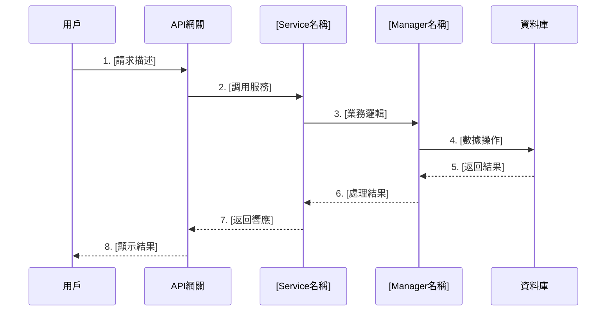

# [功能名稱] 需求分析報告

**文檔元數據**
- 產品經理：igame-pm-analyst
- 創建日期：YYYY-MM-DD
- 優先級：P0關鍵 / P1重要 / P2增強
- 預估工作量：X 人天
- 風險等級：🔴 高 / 🟡 中 / 🟢 低

---

## 1. 需求背景（Why）

### 1.1 Ultrathink深度分析

#### 第一性原理拆解
```
第一層_表象層:
  用戶描述: [需求的表面描述]

第二層_交易層:
  資金流動: [是否涉及資金？如何流動？]
  數據流動: [哪些數據被創建/修改/刪除？]
  風險轉移: [風險如何在系統中傳遞？]

第三層_第一性原理層:
  Trust（信任）: [需要何種信任保證？]
    - 雙式記賬？冪等性？審計日誌？

  Velocity（速度）: [性能要求是什麼？]
    - 併發量？響應時間？吞吐量？

  Friction（摩擦）: [用戶體驗如何優化？]
    - 操作步驟？自動化程度？
```

#### 偽需求識別（反向思考）
```
問題: 如果實現這個需求，什麼會導致失敗？

潛在失敗場景:
1. [場景1]: [描述] → 因此需要 [架構決策]
2. [場景2]: [描述] → 因此需要 [架構決策]
3. [場景3]: [描述] → 因此需要 [架構決策]

是否為偽需求？
□ 是 → 真實需求: [重新定義]
□ 否 → 繼續分析
```

### 1.2 JTBD分析（Jobs To Be Done）

#### 用戶角色與待辦任務

| 角色 | 功能性任務 | 情感性任務 | 社會性任務 |
|------|-----------|-----------|-----------|
| **商戶老闆** | [實際要完成的操作] | [情緒需求] | [社交需求] |
| **終端玩家** | [實際要完成的操作] | [情緒需求] | [社交需求] |
| **風控人員** | [實際要完成的操作] | [情緒需求] | [社交需求] |
| **開發團隊** | [實際要完成的操作] | [情緒需求] | [社交需求] |

#### 用戶故事
```
作為 [角色]，
我希望 [動作]，
以便 [目標]。

接受標準:
- [ ] 標準1: [具體可驗證的標準]
- [ ] 標準2: [具體可驗證的標準]
- [ ] 標準3: [具體可驗證的標準]
```

### 1.3 成功指標（Success Metrics）

| 指標類型 | 指標名稱 | 當前值 | 目標值 | 衡量方式 |
|---------|---------|-------|-------|---------|
| 業務指標 | [如：轉化率] | X% | Y% | [如何衡量] |
| 性能指標 | [如：API延遲] | Xms | <Yms | P95延遲 |
| 質量指標 | [如：錯誤率] | X% | <Y% | 錯誤日誌統計 |

---

## 2. 功能需求（What）

### 2.1 核心流程



### 2.2 業務規則

#### 核心規則
1. **規則1**: [詳細描述]
   - 條件: [觸發條件]
   - 動作: [執行動作]
   - 異常: [異常處理]

2. **規則2**: [詳細描述]
   - 條件: [觸發條件]
   - 動作: [執行動作]
   - 異常: [異常處理]

#### 邊界條件
- **最小值**: [描述]
- **最大值**: [描述]
- **特殊值**: [描述（如0、null、負數）]

### 2.3 數據模型

#### Entity（實體類）
```java
@TableName("t_[module]_[table]")
public class [Entity]Entity extends BaseEntity {
    @TableId(type = IdType.AUTO)
    private Long id;

    private Long tenantId; // 多租戶隔離

    // 業務字段
    private String fieldName;

    private Integer version; // 樂觀鎖

    // 審計字段（繼承自BaseEntity）
    // private LocalDateTime createdAt;
    // private Long createdBy;
    // private LocalDateTime updatedAt;
    // private Long updatedBy;
    // private Boolean deleted;
}
```

#### Form（請求表單）
```java
@Data
public class [Action]Form {
    @NotNull(message = "XX不能為空")
    private Long id;

    @NotBlank(message = "XX不能為空")
    private String fieldName;

    // 其他驗證註解：@Min, @Max, @Size, @Pattern
}
```

#### VO（視圖對象）
```java
@Data
public class [Entity]VO {
    private Long id;
    private String fieldName;
    private LocalDateTime createdAt;

    // 關聯數據
    private String relatedFieldName;
}
```

### 2.4 API接口定義

#### 接口清單

| 接口名稱 | 請求方式 | 路徑 | 權限 |
|---------|---------|------|------|
| [操作名稱] | POST/GET | /api/[module]/[action] | [permission:code] |
| [操作名稱] | POST/GET | /api/[module]/[action] | [permission:code] |

#### 接口詳細設計

**接口1: [操作名稱]**
```
POST /api/[module]/[action]

Request:
{
  "field1": "value",
  "field2": 123
}

Response (Success):
{
  "code": 1,
  "message": "操作成功",
  "data": {
    "id": 123,
    "field": "value"
  },
  "ok": true
}

Response (Error):
{
  "code": -1,
  "message": "錯誤描述",
  "data": null,
  "ok": false
}
```

---

## 3. 技術方案建議（How）

### 3.1 SmartAdmin分層設計

#### Controller層
```java
/**
 * [功能描述] Controller
 *
 * @author igame-pm-analyst
 * @date YYYY-MM-DD
 */
@RestController
@RequestMapping("/api/[module]")
@RequiredArgsConstructor
@Tag(name = "[模組名稱]")
public class [Module]Controller {

    private final [Module]Service service;

    /**
     * [操作描述]
     */
    @PostMapping("/[action]")
    @Operation(summary = "[操作描述]")
    @SaCheckPermission("[module]:[action]")
    public ResponseDTO<[Result]VO> action(@RequestBody @Valid [Action]Form form) {
        [Result]VO result = service.action(form);
        return ResponseDTO.ok(result);
    }
}
```

**職責**:
- API接口定義
- 參數驗證（@Valid）
- 權限控制（@SaCheckPermission）
- 統一返回格式（ResponseDTO）

**約束**:
- ✅ 只能調用Service層
- ❌ 不能直接調用Manager/Dao
- ❌ 不能包含業務邏輯

---

#### Service層
```java
/**
 * [功能描述] Service
 *
 * @author igame-pm-analyst
 * @date YYYY-MM-DD
 */
@Service
@RequiredArgsConstructor
public class [Module]Service {

    private final [Module]Manager manager;
    private final [Related]Manager relatedManager; // 如需跨模組協調

    /**
     * [操作描述]
     */
    public [Result]VO action([Action]Form form) {
        // 1. 業務邏輯驗證
        // 2. 協調多個Manager
        // 3. 組裝返回數據

        return result;
    }
}
```

**職責**:
- 業務邏輯協調
- 跨Manager調用
- VO組裝

**約束**:
- ✅ 可調用多個Manager
- ✅ 可調用Dao（簡單查詢）
- ❌ 不能使用@Transactional

---

#### Manager層
```java
/**
 * [功能描述] Manager
 *
 * @author igame-pm-analyst
 * @date YYYY-MM-DD
 */
@Service
@RequiredArgsConstructor
public class [Module]Manager {

    private final [Module]Dao dao;

    /**
     * [操作描述]
     */
    @Transactional(rollbackFor = Exception.class)
    @Cacheable(value = "cache:key", key = "#id", unless = "#result == null")
    public [Entity] action([Params]) {
        // 1. 資料庫操作
        // 2. 緩存管理
        // 3. 事務控制

        return result;
    }
}
```

**職責**:
- 數據庫事務（唯一可用@Transactional）
- 緩存管理（@Cacheable/@CacheEvict）
- 數據持久化

**約束**:
- ✅ 只能調用Dao層
- ❌ 不能調用Service
- ❌ 不能調用其他Manager
- ✅ 使用構造器注入（@RequiredArgsConstructor）

---

#### Dao層
```java
/**
 * [功能描述] Dao
 *
 * @author igame-pm-analyst
 * @date YYYY-MM-DD
 */
@Mapper
public interface [Module]Dao extends BaseMapper<[Entity]Entity> {

    /**
     * 自定義查詢方法
     */
    List<[Entity]> selectCustom(@Param("param") String param);
}
```

**職責**:
- 數據庫訪問
- 自定義SQL（XML配置）

**約束**:
- ✅ 繼承BaseMapper<Entity>
- ✅ 使用MyBatis-Plus
- ❌ 不包含業務邏輯

---

### 3.2 依賴的Foundation模組

#### 必需模組
- [ ] **foundation.cache** (Redis緩存)
  - 用途: [描述]
  - 緩存鍵: `cache:[module]:[key]`
  - 過期時間: X秒/分鐘/小時

- [ ] **foundation.mq** (Kafka消息隊列)
  - 用途: [描述]
  - Topic: `[module].[event]`
  - 消費者組: `[module]-consumer-group`

- [ ] **foundation.redis-lock** (分佈式鎖)
  - 用途: [描述]
  - 鎖鍵: `lock:[module]:[operation]:{id}`
  - 過期時間: X秒

- [ ] **foundation.repeat-submit** (防重複提交)
  - 用途: [描述]
  - 應用場景: [描述]

#### 可選模組
- [ ] **foundation.api-encrypt** (API加密)
- [ ] **foundation.captcha** (驗證碼)
- [ ] **foundation.data-masking** (數據脫敏)
- [ ] **foundation.security-protect** (安全防護)

---

### 3.3 技術棧選型

#### 核心技術
| 組件 | 版本 | 用途 | 備註 |
|------|------|------|------|
| PostgreSQL | 16 | OLTP數據庫 | 主要數據存儲 |
| Redis | 7.2 | 緩存/分佈式鎖 | Cluster模式 |
| Kafka | 3.7.0 | 消息隊列 | 事件驅動 |
| Flink | 1.20.0 | 流處理 | 實時計算（如需） |
| Apache Doris | 2.1 | OLAP分析 | 報表查詢（如需） |

#### 特殊技術（根據需求選擇）
- **LiteFlow 2.12.5**: 流程編排引擎（複雜業務流程）
- **Snail-Job 1.2.0**: 分佈式任務調度（定時任務）
- **Redisson 3.50.0**: Redis客戶端（分佈式鎖）
- **MinIO**: 對象存儲（文件上傳）

---

### 3.4 數據庫設計

#### 表結構設計

**主表: t_[module]_[table]**
```sql
CREATE TABLE t_[module]_[table] (
    id BIGSERIAL PRIMARY KEY,
    tenant_id BIGINT NOT NULL COMMENT '租戶ID（多租戶隔離）',

    -- 業務字段
    field_name VARCHAR(255) NOT NULL COMMENT '字段描述',

    -- 樂觀鎖
    version INT NOT NULL DEFAULT 0 COMMENT '版本號',

    -- 審計字段
    created_at TIMESTAMP NOT NULL DEFAULT CURRENT_TIMESTAMP COMMENT '創建時間',
    created_by BIGINT NOT NULL COMMENT '創建人ID',
    updated_at TIMESTAMP NOT NULL DEFAULT CURRENT_TIMESTAMP COMMENT '更新時間',
    updated_by BIGINT NOT NULL COMMENT '更新人ID',
    deleted BOOLEAN NOT NULL DEFAULT FALSE COMMENT '刪除標記',

    -- 索引
    CONSTRAINT idx_tenant_id INDEX (tenant_id),
    CONSTRAINT idx_field_name INDEX (field_name)
) COMMENT '[表描述]';
```

**關聯表: t_[module]_[related]**
```sql
-- 如需關聯表，在此定義
```

#### 索引策略
- **主鍵索引**: id (自動)
- **租戶索引**: tenant_id (必須)
- **業務索引**: [根據查詢場景設計]
- **複合索引**: (tenant_id, field1, field2)

#### 分區策略（如需）
```sql
-- 按月分區
PARTITION BY RANGE (created_at) (
    PARTITION p202601 VALUES LESS THAN ('2026-02-01'),
    PARTITION p202602 VALUES LESS THAN ('2026-03-01'),
    ...
);
```

---

### 3.5 緩存策略

#### 多級緩存架構
```
L1: Caffeine本地緩存（進程內，毫秒級）
  ├─ 熱點數據（如VIP等級、配置）
  ├─ 過期時間: 5分鐘
  └─ 最大容量: 10000條

L2: Redis分佈式緩存（網路，毫秒級）
  ├─ 共享數據（如玩家餘額、遊戲列表）
  ├─ 過期時間: 30分鐘
  └─ 淘汰策略: LRU
```

#### 緩存鍵設計
```
格式: {prefix}:{module}:{entity}:{id}

示例:
cache:wallet:balance:{playerId}      # 玩家餘額
cache:vip:level:{playerId}            # VIP等級
cache:game:metadata:{gameId}          # 遊戲元數據
```

#### 緩存失效策略
- **寫穿策略**: 寫入DB同時更新緩存
- **延遲雙刪**: 刪除緩存 → 更新DB → 再次刪除緩存（解決併發不一致）
- **定時刷新**: 對於變化慢的數據，定時全量刷新

---

### 3.6 併發控制策略

#### 樂觀鎖（推薦）
```java
// 使用version字段
@Version
private Integer version;

// MyBatis-Plus自動處理
int rows = dao.updateById(entity); // version自動+1
if (rows == 0) {
    throw new BusinessException("數據已被修改，請重試");
}
```

**適用場景**: 低衝突率、高併發讀場景

---

#### Redis分佈式鎖
```java
RLock lock = redisson.getLock("lock:[module]:[operation]:{id}");
try {
    // 嘗試獲取鎖，等待10秒，鎖自動過期30秒
    if (lock.tryLock(10, 30, TimeUnit.SECONDS)) {
        // 業務邏輯
    } else {
        throw new BusinessException("系統繁忙，請稍後重試");
    }
} finally {
    if (lock.isHeldByCurrentThread()) {
        lock.unlock();
    }
}
```

**適用場景**: 高衝突率、需要絕對順序執行

---

#### 冪等性保證
```java
// 1. 生成冪等性鍵
String idempotencyKey = form.getTransactionId();
String redisKey = "idempotency:" + idempotencyKey;

// 2. 檢查是否已處理
String cachedResult = redisTemplate.opsForValue().get(redisKey);
if (cachedResult != null) {
    return JSON.parseObject(cachedResult, ResultVO.class);
}

// 3. 執行業務邏輯
ResultVO result = processBusinessLogic(form);

// 4. 緩存結果（24小時過期）
redisTemplate.opsForValue().set(redisKey, JSON.toJSONString(result), 24, TimeUnit.HOURS);

return result;
```

**適用場景**: 涉及資金操作、防止重複提交

---

## 4. 風險評估與緩解

### 4.1 資金安全風險 🔴

#### 風險描述
- [具體風險場景描述]
- 影響: [資金損失/數據不一致]
- 可能性: 高/中/低

#### 緩解措施
1. **雙式記賬**:
   - 強制使用P0-01雙式記賬架構
   - 每筆交易必須有Debit/Credit對應
   - 每日自動試算平衡

2. **冪等性保證**:
   - 強制使用P0-02冪等性架構
   - TransactionID唯一性驗證
   - Redis緩存處理結果

3. **審計日誌**:
   - 完整記錄操作前後狀態
   - 不可刪除（邏輯刪除）
   - 保留至少7年（合規要求）

4. **熔斷機制**:
   - 帳務不平衡自動熔斷
   - 異常金額告警（>X萬）
   - 人工複核流程

---

### 4.2 性能風險 🟡

#### 風險描述
- 預期併發: [X TPS / Y QPS]
- 瓶頸點: [數據庫寫入/網路延遲/複雜計算]
- 影響: [響應超時/系統崩潰]

#### 緩解措施
1. **緩存優化**:
   - Caffeine L1 + Redis L2多級緩存
   - 緩存命中率 >90%
   - 熱點數據預加載

2. **數據庫優化**:
   - 索引優化（覆蓋索引/複合索引）
   - 分區/分片（按tenant_id或日期）
   - 讀寫分離（主從複製）

3. **異步處理**:
   - Kafka削峰填谷
   - 非關鍵路徑異步化
   - 批量處理（合併請求）

4. **降級策略**:
   - 非核心功能降級（如排行榜）
   - 限流保護（Sentinel/Redisson）
   - 熔斷器（Resilience4j）

#### 性能目標
| 指標 | 目標值 | 測試方法 |
|------|-------|---------|
| API延遲（P95） | <Xms | JMeter壓測 |
| 吞吐量（TPS） | >Y | 持續壓測30分鐘 |
| 緩存命中率 | >90% | Redis監控 |
| 數據庫連接池 | 使用率<70% | HikariCP監控 |

---

### 4.3 合規風險 🟡

#### 風險描述
- 監管要求: [MGA/Curacao/GDPR]
- 敏感數據: [PII/支付信息]
- 審計留存: [保留期限]

#### 緩解措施
1. **KYC/AML合規**:
   - 參照P0-04 KYC/AML自動化
   - 漸進式驗證（等級0-3）
   - 第三方驗證集成（Jumio/Onfido）

2. **數據保護**:
   - PII加密存儲（AES-256）
   - 敏感字段脫敏顯示
   - 訪問權限控制（RBAC）

3. **審計日誌**:
   - 完整操作記錄（Who/What/When/Where）
   - 不可篡改（Write-Once）
   - 保留期限: 7年

4. **GDPR合規**:
   - 用戶同意機制
   - 數據可攜權（導出）
   - 被遺忘權（刪除）

---

### 4.4 技術債風險 🟢

#### 風險描述
- 與現有架構衝突: [描述]
- 依賴版本衝突: [描述]
- 代碼維護成本: [描述]

#### 緩解措施
1. **架構合規驗證**:
   - 執行ArchitectureTest.java
   - 確保分層架構正確
   - 代碼審查（Code Review）

2. **質量門檻**:
   - SonarQube掃描無critical問題
   - PMD/SpotBugs檢查通過
   - 單元測試覆蓋率 >80%

3. **文檔完善**:
   - 技術設計文檔
   - API接口文檔（Swagger）
   - 運維手冊

---

## 5. 依賴與約束

### 5.1 前置依賴

#### 必需完成的前置任務
- [ ] **P0-01: 雙式記賬架構**（如涉及資金操作）
  - 狀態: 已完成 / 進行中 / 未開始
  - 阻塞原因: [如未完成]

- [ ] **P0-02: 冪等性架構**（如涉及扣款操作）
  - 狀態: 已完成 / 進行中 / 未開始
  - 阻塞原因: [如未完成]

- [ ] **P1-07: 多租戶隔離**（如需租戶隔離）
  - 狀態: 已完成 / 進行中 / 未開始
  - 阻塞原因: [如未完成]

#### 並行依賴（可同時開發）
- [ ] **相關模組1**: [描述]
- [ ] **相關模組2**: [描述]

---

### 5.2 架構約束

#### SmartAdmin強制規範
✅ **必須遵守**:
- [x] 分層架構：Controller → Service → Manager → Dao
- [x] Controller只能調用Service
- [x] Manager只能調用Dao（不能調用其他Manager）
- [x] @Transactional僅在Manager層使用
- [x] 使用構造器注入（@RequiredArgsConstructor）
- [x] 禁用@Autowired字段注入
- [x] 統一返回格式：ResponseDTO.ok(data)
- [x] 異常處理：BusinessException + GlobalExceptionHandler
- [x] 命名規範：遵循Alibaba Java編碼規範

#### iGame特定約束
✅ **必須遵守**:
- [x] 涉及資金操作必須使用雙式記賬
- [x] 涉及扣款操作必須保證冪等性
- [x] 多租戶系統必須隔離tenant_id
- [x] 敏感數據必須加密存儲
- [x] 審計日誌必須完整記錄

#### 驗證方式
```bash
# 架構合規驗證
./gradlew :smartadmin-app:test --tests ArchitectureTest

# 代碼質量檢查
./gradlew :smartadmin-app:pmdMain :smartadmin-app:spotbugsMain

# 單元測試
./gradlew :smartadmin-app:test
```

---

## 6. 實施計劃

### 6.1 任務拆解（預估總工作量：X 人天）

#### 階段1：設計與準備（1-2天）
- [ ] **T1: 數據庫表設計**（0.5天）
  - 負責人: [開發者A]
  - 交付物: DDL SQL腳本
  - 驗收: DBA Review通過

- [ ] **T2: API接口設計**（0.5天）
  - 負責人: [開發者A]
  - 交付物: Swagger接口文檔
  - 驗收: 前端確認接口定義

#### 階段2：核心開發（3-5天）
- [ ] **T3: Manager層實現**（2天）
  - 負責人: [開發者B]
  - 內容:
    - 數據庫事務邏輯
    - 緩存管理
    - 併發控制（樂觀鎖/Redis鎖）
  - 交付物: [Module]Manager.java
  - 驗收: 單元測試通過

- [ ] **T4: Service層實現**（1天）
  - 負責人: [開發者B]
  - 內容:
    - 業務邏輯協調
    - VO組裝
  - 交付物: [Module]Service.java
  - 驗收: 單元測試通過

- [ ] **T5: Controller層實現**（1天）
  - 負責人: [開發者C]
  - 內容:
    - API接口實現
    - 參數驗證
    - 權限控制
  - 交付物: [Module]Controller.java
  - 驗收: Postman測試通過

- [ ] **T6: Dao層實現**（1天）
  - 負責人: [開發者A]
  - 內容:
    - MyBatis-Plus Mapper
    - 自定義SQL（如需）
  - 交付物: [Module]Dao.java + XML
  - 驗收: 數據庫操作正確

#### 階段3：測試與優化（2-3天）
- [ ] **T7: 單元測試**（1天）
  - 負責人: [開發者B/C]
  - 覆蓋率: >80%
  - 工具: JUnit 5 + Mockito

- [ ] **T8: 集成測試**（1天）
  - 負責人: [測試工程師]
  - 場景: 正常流程 + 異常流程
  - 工具: Postman + JMeter

- [ ] **T9: 性能測試**（1天）
  - 負責人: [性能工程師]
  - 目標: [X TPS, <Yms延遲]
  - 工具: JMeter

- [ ] **T10: 架構合規驗證**（0.5天）
  - 負責人: [開發者A]
  - 驗證: ArchitectureTest.java通過
  - 驗證: PMD/SpotBugs無critical

#### 階段4：部署與上線（1天）
- [ ] **T11: 文檔完善**（0.5天）
  - API文檔（Swagger）
  - 技術設計文檔
  - 運維手冊

- [ ] **T12: 部署上線**（0.5天）
  - 灰度發布（10% → 50% → 100%）
  - 監控告警配置
  - 回滾預案準備

---

### 6.2 里程碑（Milestones）

| 里程碑 | 日期 | 交付物 | 負責人 |
|--------|------|--------|--------|
| **M1: 設計完成** | YYYY-MM-DD | DDL + API文檔 | [開發者A] |
| **M2: 開發完成** | YYYY-MM-DD | 所有代碼提交 | [團隊] |
| **M3: 測試通過** | YYYY-MM-DD | 測試報告 | [測試] |
| **M4: 上線完成** | YYYY-MM-DD | 生產環境運行 | [運維] |

---

### 6.3 驗收標準（Acceptance Criteria）

#### 功能驗收
- [ ] 所有用戶故事的接受標準通過
- [ ] 正常流程測試通過
- [ ] 異常流程測試通過
- [ ] 邊界條件測試通過

#### 性能驗收
- [ ] API延遲（P95）< [X]ms
- [ ] 吞吐量（TPS）> [Y]
- [ ] 緩存命中率 > 90%
- [ ] 數據庫連接池使用率 < 70%

#### 質量驗收
- [ ] ArchitectureTest.java通過（架構合規）
- [ ] SonarQube掃描無critical問題
- [ ] PMD/SpotBugs檢查無critical問題
- [ ] 單元測試覆蓋率 > 80%
- [ ] 代碼審查（Code Review）通過

#### 安全驗收
- [ ] 無SQL注入漏洞
- [ ] 無XSS漏洞
- [ ] 敏感數據加密存儲
- [ ] 權限控制正確
- [ ] 審計日誌完整

#### 文檔驗收
- [ ] API文檔完整（Swagger）
- [ ] 技術設計文檔完整
- [ ] 運維手冊完整
- [ ] 代碼註釋充分

---

## 7. 監控與運維

### 7.1 監控指標

#### 業務指標
- **核心指標**: [如：成功率、轉化率]
- **告警閾值**: [如：成功率 < 95%]
- **監控工具**: Grafana + Prometheus

#### 技術指標
- **API延遲**: P95 < [X]ms
- **錯誤率**: < 0.1%
- **TPS**: 實時吞吐量
- **緩存命中率**: > 90%
- **數據庫連接數**: < 最大連接數70%

#### 告警配置
```yaml
alerts:
  - name: API延遲告警
    condition: p95_latency > 500ms
    severity: warning
    channel: 釘釘群

  - name: 錯誤率告警
    condition: error_rate > 1%
    severity: critical
    channel: 電話告警

  - name: 資金不平衡告警
    condition: sum(debit) != sum(credit)
    severity: critical
    channel: 電話告警 + 簡訊
```

---

### 7.2 日誌規範

#### 日誌等級
- **ERROR**: 系統錯誤、業務異常（需要立即處理）
- **WARN**: 預警信息（需要關注）
- **INFO**: 關鍵業務節點（審計用）
- **DEBUG**: 調試信息（僅開發環境）

#### 日誌格式
```java
// 關鍵操作記錄（INFO）
log.info("[{}] 用戶[{}]執行[{}]操作，參數：{}",
    traceId, userId, operationType, JSON.toJSONString(params));

// 異常記錄（ERROR）
log.error("[{}] 用戶[{}]執行[{}]操作失敗，錯誤：{}",
    traceId, userId, operationType, e.getMessage(), e);
```

#### 審計日誌
```java
// 涉及資金操作必須記錄完整審計日誌
AuditLog auditLog = AuditLog.builder()
    .traceId(traceId)
    .userId(userId)
    .operation("WITHDRAW")
    .beforeState(JSON.toJSONString(beforeBalance))
    .afterState(JSON.toJSONString(afterBalance))
    .result("SUCCESS")
    .build();
auditLogDao.insert(auditLog);
```

---

### 7.3 回滾預案

#### 回滾觸發條件
- 錯誤率 > 5%
- API延遲 > 2秒
- 資金不平衡
- 關鍵功能不可用

#### 回滾步驟
```bash
# 1. 停止新版本流量
kubectl set image deployment/[service] [container]=[old-image]

# 2. 驗證舊版本正常
curl https://api.example.com/health

# 3. 數據回滾（如需）
psql -U postgres -d igame -f rollback-[version].sql

# 4. 清理緩存
redis-cli FLUSHDB

# 5. 通知相關人員
# 發送告警通知
```

#### 數據修復
- 如資金數據異常，立即觸發熔斷
- 人工介入核對帳務
- 使用對帳腳本修復
- 完成後解除熔斷

---

## 附錄

### A. 參考文檔

#### iGame技術規格
- [iGame技術規格索引](docs/iGame/index.md)
- [P0-01: 雙式記賬架構](docs/iGame/technical-specs/P0-critical/01-double-entry-ledger-schema.md)
- [P0-02: 冪等性架構](docs/iGame/technical-specs/P0-critical/02-idempotency-architecture.md)
- [P0-03: 無縫錢包實現](docs/iGame/technical-specs/P0-critical/03-seamless-wallet-implementation.md)
- [P1-XX: 相關技術規格](docs/iGame/technical-specs/P1-important/XX.md)

#### SmartAdmin規範
- [CLAUDE.md快速參考](CLAUDE.md)
- [SmartAdmin模式](.claude/shared/knowledge/smartadmin-patterns.md)
- [架構規則](CLAUDE.md)
- [Manager層規範](CLAUDE.md)
- [命名規範](CLAUDE.md)

#### Support模組（原Foundation）
- [Support模組總覽](smartadmin-support/README.md)
- [Cache模組](smartadmin-support/src/main/java/net/lab1024/sa/support/cache/)
- [MQ模組](smartadmin-support/src/main/java/net/lab1024/sa/support/mq/)
- [Redis Lock模組](smartadmin-support/src/main/java/net/lab1024/sa/support/redis-lock/)

---

### B. 術語表

| 術語 | 定義 | 參考 |
|------|------|------|
| GGR | Gross Gaming Revenue（總博弈收入） | [概念詞典](knowledge/igame-concepts.yaml) |
| NGR | Net Gaming Revenue（淨博弈收入） | [概念詞典](knowledge/igame-concepts.yaml) |
| 雙式記賬 | Double-Entry Ledger | [P0-01](docs/iGame/technical-specs/P0-critical/01-double-entry-ledger-schema.md) |
| 無縫錢包 | Seamless Wallet | [P0-03](docs/iGame/technical-specs/P0-critical/03-seamless-wallet-implementation.md) |
| [其他術語] | [定義] | [參考] |

---

### C. 變更歷史

| 版本 | 日期 | 變更內容 | 作者 |
|------|------|---------|------|
| 1.0 | YYYY-MM-DD | 初始版本 | igame-pm-analyst |
| 1.1 | YYYY-MM-DD | [變更描述] | [作者] |

---

## 下一步行動

**傳遞給 java-architect**：
將此需求分析報告傳遞給 java-architect 進行技術實現設計。

**待確認問題**（如有）：
1. [問題1]
2. [問題2]

**風險提示**：
🔴 [高風險項]
🟡 [中風險項]

---

**文檔結束**
