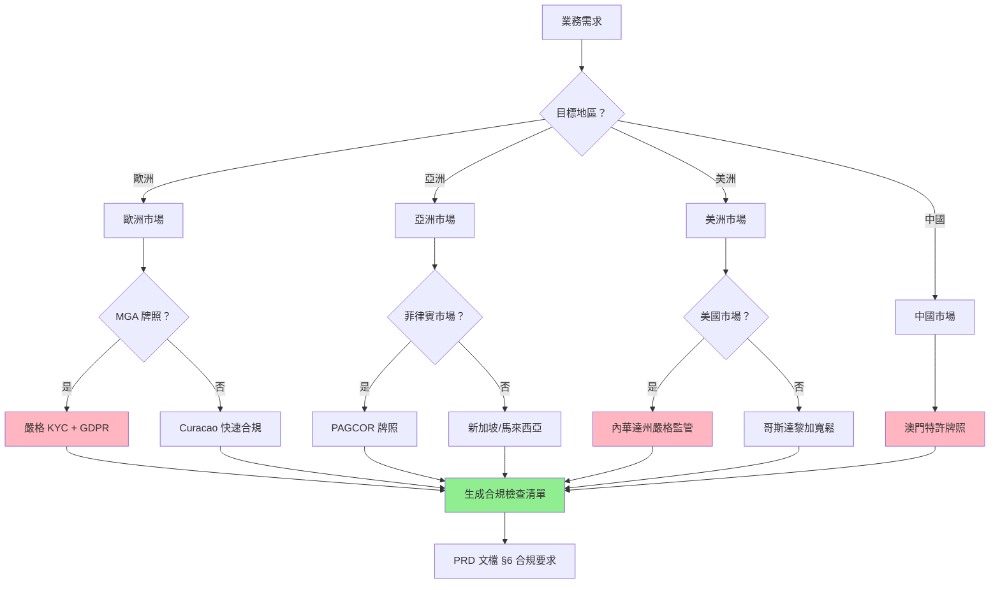
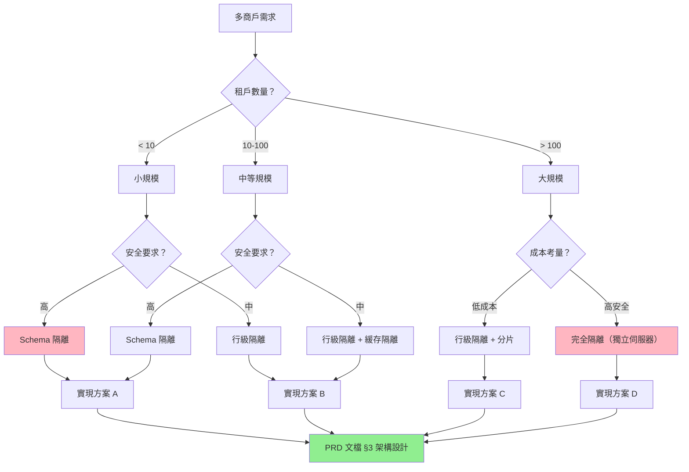
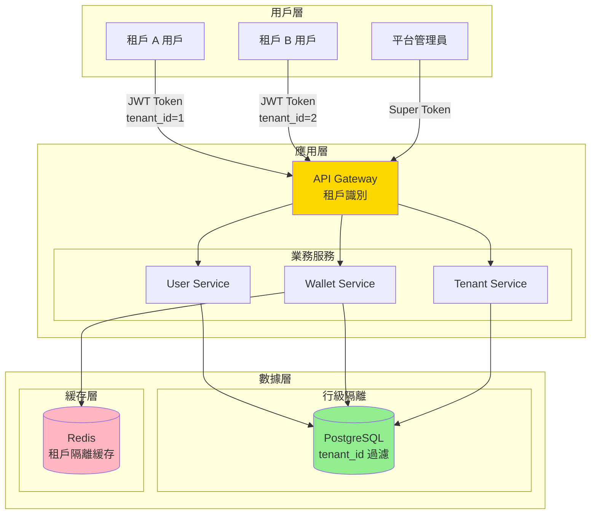
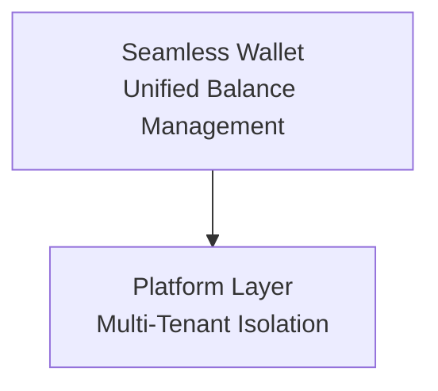

# iGaming Multi-Tenant Wallet PM Expert

## 🎯 Quick Start

### 最常見使用示例

```bash
# 完整流程（所有階段）
"設計多商戶 VIP 系統，支持白標定制，歐洲牌照合規"
→ 執行: Phase 1-4 (需求收集 → 多商戶設計 → 無縫錢包設計 → 地區合規)

# 單階段執行
"無縫錢包對接 Evolution Gaming"
→ 執行: Phase 3 (無縫錢包設計)

# 地區合規查詢
"歐洲市場 KYC 合規要求對比表"
→ 執行: Phase 4 (地區合規)
```

### 輸出物範例

- ✅ 標準化繁體中文 PRD 文檔（6 章節結構）
- ✅ 多種 Mermaid 圖表（flowchart, sequenceDiagram, erDiagram, architecture）
- ✅ SmartAdmin 分層設計方案（Controller → Service → Manager → Dao）
- ✅ 地區合規對比表（歐洲/亞洲/美洲/中國）
- ✅ 風險評估矩陣（資金安全/性能/合規三維）

## Trigger Keywords

This skill is automatically activated when the user's request contains:

**Primary Keywords** (High confidence):
- "multi-tenant" - Multi-tenant architecture design
- "多商戶" - Multi-merchant/tenant (Traditional Chinese)
- "white-label" - White-label platform solution
- "白標" - White-label (Traditional Chinese)
- "seamless wallet" - Seamless wallet integration

**Secondary Keywords** (Medium confidence):
- "無縫錢包" (seamless wallet) - Context: wallet integration design
- "tenant isolation" / "租戶隔離" - Context: data isolation strategy
- "wallet integration" / "錢包對接" - Context: game provider wallet integration
- "regional compliance" / "地區合規" - Context: KYC/AML compliance requirements
- "MGA" / "PAGCOR" - Context: European/Asian gaming license compliance
- "VIP 定制" (VIP customization) - Context: white-label VIP tier customization

**Phrase Patterns**:
- "設計 [多商戶功能]" - Example: "設計多商戶 VIP 系統"
- "[無縫錢包] 對接 [供應商]" - Example: "無縫錢包對接 Evolution Gaming"
- "[地區] 合規要求" - Example: "歐洲市場 KYC 合規要求對比表"

**Example User Requests**:
```
User: "設計多商戶 VIP 系統，支持白標定制，歐洲牌照合規"
User: "無縫錢包對接 Evolution Gaming"
User: "多商戶錢包架構設計，Schema 隔離 vs 行級隔離"
User: "歐洲市場 KYC 合規要求對比表"
User: "白標平台 VIP 層級配置方案"
```

**Note**: This skill can also be manually invoked via `/igaming-multi-tenant-wallet-pm` command. Supports phase-based execution: `--phase=1` (requirements), `--phase=2` (multi-tenant), `--phase=3` (wallet), `--phase=4` (compliance).

---

## 🚀 Why This Skill Exists

### 問題描述

1. **igame-pm-analyst 不足**: 處理通用 iGaming 需求,但缺乏多商戶和無縫錢包的深度專業知識
2. **跨地區合規複雜**: 歐洲 MGA、亞洲菲律賓 PAGCOR、美洲內華達州、中國澳門——每個地區牌照、KYC、稅率不同
3. **無縫錢包專業知識缺失**: 13 個核心模式（Token 驗證、冪等性、流水計算、風控檢測）分散在多個文檔中
4. **缺乏標準化 PRD 模板**: 文檔結構不統一,缺少 Mermaid 圖表策略
5. **深度思考不足**: 需要 Ultrathink 方法論（第一性原理分析）

### 解決方案

本 Skill 提供:

| 核心能力 | 說明 | 文檔參考 |
|---------|------|---------|
| **Regional Compliance Mapping** | 自動生成歐洲/亞洲/美洲/中國的牌照、KYC、稅率對比表 | [knowledge/regional-requirements.md](knowledge/regional-requirements.md) |
| **Multi-Tenant Architecture Design** | 多商戶隔離策略（Schema/行級/完全隔離）與白標定制 | [knowledge/multi-tenant-patterns.md](knowledge/multi-tenant-patterns.md) |
| **Seamless Wallet Pattern Generation** | 無縫錢包核心模式（13 個專題整合） | [knowledge/wallet-patterns.md](knowledge/wallet-patterns.md) |
| **Ultrathink Methodology** | 第一性原理深度分析框架 | [references/ultrathink-methodology.md](references/ultrathink-methodology.md) |
| **PRD Document Generation** | 標準化繁體中文 PRD 生成（6 章節結構） | [knowledge/prd-template.md](knowledge/prd-template.md) |
| **Mermaid Diagram Strategy** | 5 種圖表類型的場景化應用 | [knowledge/mermaid-best-practices.md](knowledge/mermaid-best-practices.md) |
| **Risk Assessment Framework** | 資金安全/性能/合規三維風險評估 | 本文檔 §7 |

---

## 📋 核心模式（7 個核心模式）

### 模式 1: Regional Compliance Mapping（地區合規映射）

#### 模式描述

自動生成多地區牌照與合規要求的對比表,支持歐洲（MGA, Curacao）、亞洲（菲律賓 PAGCOR, 新加坡）、美洲（內華達州, 哥斯達黎加）、中國（澳門）。

#### 使用場景

- ✅ 跨地區部署前的合規評估
- ✅ 多商戶不同地區配置
- ✅ 風險評估與法務審查
- ✅ 運營團隊合規培訓

#### Mermaid 示例：地區選擇決策樹



#### 決策矩陣

| 地區 | 牌照類型 | KYC 嚴格度 | 稅率 | 處理時間 | 推薦場景 |
|-----|---------|----------|------|---------|---------|
| 🇪🇺 **歐洲 MGA** | 馬爾他博彩管理局 | ⭐⭐⭐⭐⭐ 嚴格 | 5% GGR | 6-12 個月 | 合規要求高的歐洲市場 |
| 🇨🇼 **Curacao** | Curacao eGaming | ⭐⭐ 寬鬆 | 固定費用 | 1-3 個月 | 快速上線,預算有限 |
| 🇵🇭 **菲律賓 PAGCOR** | 菲律賓娛樂博彩公司 | ⭐⭐⭐ 中等 | 5% GGR | 3-6 個月 | 亞洲市場主流選擇 |
| 🇺🇸 **內華達州** | Nevada Gaming Control Board | ⭐⭐⭐⭐⭐ 最嚴格 | 6.75% GGR | 12-24 個月 | 美國合法市場 |
| 🇨🇷 **哥斯達黎加** | 自我監管 | ⭐ 最寬鬆 | 無稅 | 1 個月 | 離岸運營（風險高） |
| 🇲🇴 **澳門** | 澳門博彩監察協調局 | ⭐⭐⭐⭐ 嚴格 | 39% GGR | 特許制 | 實體賭場為主 |

#### SmartAdmin 集成

**Foundation 模組依賴**:
- `foundation.tenant`（多租戶上下文）
- `foundation.cache`（Redis 緩存地區配置）

**數據庫設計**:

```sql
-- 租戶地區配置表
CREATE TABLE t_tenant_compliance_config (
    id BIGSERIAL PRIMARY KEY,
    tenant_id BIGINT NOT NULL COMMENT '租戶ID',
    region VARCHAR(50) NOT NULL COMMENT '地區代碼: EU_MGA, CW, PH_PAGCOR, US_NV, CR, MO',
    license_type VARCHAR(100) COMMENT '牌照類型',
    kyc_level INT NOT NULL DEFAULT 3 COMMENT 'KYC 嚴格度: 1-5',
    tax_rate DECIMAL(5,4) COMMENT 'GGR 稅率（小數形式，如 0.05 表示 5%）',
    compliance_checklist TEXT COMMENT 'JSON 格式合規檢查清單',
    created_at TIMESTAMP DEFAULT NOW(),
    updated_at TIMESTAMP DEFAULT NOW(),
    deleted_flag TINYINT DEFAULT 0,
    CONSTRAINT uk_tenant_region UNIQUE (tenant_id, region, deleted_flag)
);
```

**Service 層實現**:

```java
@Service
@RequiredArgsConstructor
public class ComplianceService {
    private final ComplianceConfigDao complianceConfigDao;
    private final TenantContextHolder tenantContext;

    public Option<ComplianceConfigVO> getComplianceConfig(String region) {
        Long tenantId = tenantContext.getCurrentTenantId();
        return complianceConfigDao.selectByTenantAndRegion(tenantId, region)
            .map(entity -> SmartBeanUtil.copy(entity, ComplianceConfigVO.class));
    }

    public ComplianceChecklistVO generateChecklist(String region) {
        // 根據地區生成合規檢查清單
        return RegionalComplianceFactory.create(region).generateChecklist();
    }
}
```

---

### 模式 2: Multi-Tenant Architecture Design（多商戶架構設計）

#### 模式描述

設計多商戶隔離策略,支持三種隔離級別:
1. **Schema 隔離**（完全隔離,每個租戶獨立資料庫）
2. **行級隔離**（共享資料庫,通過 tenant_id 過濾）
3. **完全隔離**（獨立伺服器 + 獨立資料庫）

#### 使用場景

- ✅ SaaS 平台多企業客戶部署
- ✅ 白標定制（每個租戶自定義 Logo、主題色）
- ✅ 集團企業多子公司管理
- ✅ 代理商/分銷商體系

#### Mermaid 示例：多商戶架構決策樹



#### 隔離策略對比

| 隔離策略 | 優勢 | 劣勢 | 適用場景 | 實現複雜度 |
|---------|------|------|---------|-----------|
| **Schema 隔離** | 完全隔離,安全性最高,備份恢復簡單 | 運維成本高,資料庫連接數多 | 租戶數 < 50,安全要求極高 | ⭐⭐⭐⭐ |
| **行級隔離** | 成本低,擴展性好,統一查詢簡單 | 需防止 tenant_id 洩漏,查詢需加過濾 | 租戶數 > 100,成本敏感 | ⭐⭐⭐ |
| **完全隔離** | 極致安全,性能獨立,合規性最佳 | 成本最高,運維複雜 | 頂級客戶,金融級安全要求 | ⭐⭐⭐⭐⭐ |

#### SmartAdmin 集成

**Foundation 模組依賴**:
- `foundation.tenant`（TenantContextHolder, TenantInterceptor）
- `foundation.redis-lock`（分佈式鎖防止租戶切換競爭）

**MyBatis 攔截器自動注入 tenant_id**:

```java
@Intercepts({
    @Signature(type = Executor.class, method = "query", args = {MappedStatement.class, Object.class, RowBounds.class, ResultHandler.class}),
    @Signature(type = Executor.class, method = "update", args = {MappedStatement.class, Object.class})
})
public class TenantInterceptor implements Interceptor {
    @Override
    public Object intercept(Invocation invocation) throws Throwable {
        Long tenantId = TenantContextHolder.getCurrentTenantId();
        if (tenantId == null) {
            throw new BusinessException("租戶上下文缺失");
        }

        // 自動注入 tenant_id 到 WHERE 子句
        MappedStatement ms = (MappedStatement) invocation.getArgs()[0];
        Object parameter = invocation.getArgs()[1];

        BoundSql boundSql = ms.getBoundSql(parameter);
        String originalSql = boundSql.getSql();
        String newSql = addTenantFilter(originalSql, tenantId);

        // 替換 SQL
        // ... 詳細實現見 MULTI_TENANT_TECHNICAL_GUIDE.md

        return invocation.proceed();
    }
}
```

**ArchitectureTest 驗證**:

```java
@Test
void allDaoMethodsShouldUseTenantContext() {
    classes()
        .that().resideInAPackage("..dao..")
        .and().haveSimpleNameEndingWith("Dao")
        .should(new ArchCondition<JavaClass>("use tenant context") {
            @Override
            public void check(JavaClass javaClass, ConditionEvents events) {
                // 驗證所有 Dao 方法都通過 TenantInterceptor 注入 tenant_id
            }
        })
        .check(importedClasses);
}
```

---

### 模式 3: Seamless Wallet Pattern Generation（無縫錢包模式生成）

#### 模式描述

整合 13 個無縫錢包核心模式（來自 `docs/IGaming/02_Finance_Center/seamless-wallet/`）,生成完整的錢包 API 規格文檔。

#### 核心模式索引

| 模式 | 說明 | 優先級 | 文檔參考 |
|------|------|-------|---------|
| **Token 驗證決策樹** | 統一的 Token 驗證決策樹,支持多種 Token 格式 | P0 | [wallet-patterns.md §1](knowledge/wallet-patterns.md) |
| **冪等性分層設計** | 三層冪等性防護（Redis + DB + 分佈式鎖） | P0 | [wallet-patterns.md §2](knowledge/wallet-patterns.md) |
| **體育博彩邏輯** | 贏半/輸半 Valid Bet 計算（標準本金法） | P1 | [wallet-patterns.md §3](knowledge/wallet-patterns.md) |
| **免費旋轉流水** | 免費旋轉 Turnover 計算（Turnover ≠ Valid Bet） | P1 | [wallet-patterns.md §4](knowledge/wallet-patterns.md) |
| **輪盤對沖檢測** | 輪盤覆蓋率檢測算法（集合運算） | P1 | [wallet-patterns.md §5](knowledge/wallet-patterns.md) |
| **百家樂平局邏輯** | 百家樂和局 Valid Bet 計算 | P2 | [wallet-patterns.md §6](knowledge/wallet-patterns.md) |
| **流水並發累積** | Lua 腳本原子性流水累積（防止 TOCTOU） | P0 | [wallet-patterns.md §7](knowledge/wallet-patterns.md) |
| **會計條目修正** | 財務報表會計科目設計（IFRS 15 合規） | P1 | [wallet-patterns.md §8](knowledge/wallet-patterns.md) |
| **對賬模型分離** | 遊戲交易對賬 vs 存提款對賬 | P1 | [wallet-patterns.md §9](knowledge/wallet-patterns.md) |
| **錯誤恢復場景** | 亂序請求、預回滾、部分失敗恢復 | P0 | [wallet-patterns.md §10](knowledge/wallet-patterns.md) |
| **流水要求追蹤** | 取款時驗證流水要求（非投注時自動解鎖） | P1 | [wallet-patterns.md §11](knowledge/wallet-patterns.md) |
| **紅利錢包轉賬** | 紅利錢包與現金錢包轉賬邏輯 | P1 | [wallet-patterns.md §12](knowledge/wallet-patterns.md) |

#### 使用場景

- ✅ 第三方遊戲供應商對接（Evolution Gaming, Pragmatic Play）
- ✅ 無縫錢包 API 設計（Bet, Settle, Rollback）
- ✅ 風控檢測邏輯（對沖投注、覆蓋率檢測）
- ✅ 財務對賬系統設計

#### Mermaid 示例：Bet API 時序圖

```mermaid
sequenceDiagram
    participant GP as 遊戲供應商<br/>(Evolution Gaming)
    participant API as Wallet API
    participant Service as WalletService
    participant Manager as WalletManager
    participant Redis as Redis Cache
    participant DB as PostgreSQL

    GP->>API: POST /api/wallet/bet<br/>{token, amount, txId}

    Note over API,Service: Phase 1: Token 驗證
    API->>Service: validateToken(token)
    Service->>Redis: GET player:{token}
    Redis-->>Service: playerId: 12345
    Service-->>API: playerId

    Note over API,Redis: Phase 2: 冪等性檢查
    API->>Redis: EXISTS idempotency:{txId}
    Redis-->>API: false (未處理過)

    Note over API,Manager: Phase 3: 扣款事務（@Transactional）
    API->>Manager: debitBalance(playerId, amount, txId)
    activate Manager

    Manager->>Redis: LOCK player:{playerId}
    Manager->>DB: SELECT balance FOR UPDATE<br/>(樂觀鎖)
    DB-->>Manager: balance: 1000

    alt 餘額充足
        Manager->>DB: UPDATE balance = 900<br/>version++
        Manager->>DB: INSERT t_wallet_transaction
        Manager->>Redis: SETEX idempotency:{txId} 1 86400<br/>(TTL 24 小時)
        Manager->>Redis: UNLOCK player:{playerId}
        Manager-->>API: SUCCESS {newBalance: 900}
        deactivate Manager
        API-->>GP: 200 OK<br/>{balance: 900, txId}
    else 餘額不足
        Manager->>Redis: UNLOCK player:{playerId}
        Manager-->>API: INSUFFICIENT_BALANCE
        deactivate Manager
        API-->>GP: 400 Bad Request<br/>{error: "INSUFFICIENT_BALANCE"}
    end

    Note over GP,DB: 冪等性保證：<br/>Redis txId cache + DB 唯一索引
```

#### SmartAdmin 集成

**Foundation 模組依賴**:
- `foundation.redis-lock`（Redisson 分佈式鎖）
- `foundation.cache`（Redis 冪等性緩存）

**Manager 層事務管理**:

```java
@Service
@RequiredArgsConstructor
public class WalletManager {
    private final WalletDao walletDao;
    private final WalletTransactionDao transactionDao;
    private final RedissonClient redissonClient;
    private final StringRedisTemplate redisTemplate;

    @Transactional(rollbackFor = Throwable.class)
    public ResponseDTO<BetResponseVO> debitBalance(Long playerId, BigDecimal amount, String transactionId) {
        // Phase 1: 分佈式鎖
        RLock lock = redissonClient.getLock("wallet:lock:" + playerId);
        try {
            if (!lock.tryLock(5, 10, TimeUnit.SECONDS)) {
                return ResponseDTO.error(UserErrorCode.CONCURRENT_CONFLICT, "系統繁忙，請稍後重試");
            }

            // Phase 2: 樂觀鎖查詢餘額
            WalletEntity wallet = walletDao.selectByPlayerIdForUpdate(playerId);
            if (wallet.getBalance().compareTo(amount) < 0) {
                return ResponseDTO.error(UserErrorCode.INSUFFICIENT_BALANCE, "餘額不足");
            }

            // Phase 3: 扣款
            int updated = walletDao.updateBalanceOptimistic(
                playerId,
                wallet.getBalance().subtract(amount),
                wallet.getVersion()
            );
            if (updated == 0) {
                throw new BusinessException("並發衝突，請重試");
            }

            // Phase 4: 記錄交易
            WalletTransactionEntity tx = new WalletTransactionEntity();
            tx.setPlayerId(playerId);
            tx.setTransactionId(transactionId);
            tx.setTransactionType("BET");
            tx.setAmount(amount);
            tx.setBalanceBefore(wallet.getBalance());
            tx.setBalanceAfter(wallet.getBalance().subtract(amount));
            transactionDao.insert(tx);

            // Phase 5: Redis 冪等性緩存
            redisTemplate.opsForValue().set(
                "idempotency:" + transactionId,
                "1",
                24,
                TimeUnit.HOURS
            );

            return ResponseDTO.ok(BetResponseVO.builder()
                .transactionId(transactionId)
                .newBalance(wallet.getBalance().subtract(amount))
                .build());

        } catch (InterruptedException e) {
            Thread.currentThread().interrupt();
            return ResponseDTO.error(UserErrorCode.SYSTEM_ERROR, "獲取鎖失敗");
        } finally {
            if (lock.isHeldByCurrentThread()) {
                lock.unlock();
            }
        }
    }
}
```

**數據庫 DDL**:

```sql
CREATE TABLE t_wallet_transaction (
    id BIGSERIAL PRIMARY KEY,
    tenant_id BIGINT NOT NULL COMMENT '租戶ID（多商戶隔離）',
    player_id BIGINT NOT NULL COMMENT '玩家ID',
    transaction_id VARCHAR(64) UNIQUE NOT NULL COMMENT '交易ID（冪等性保證）',
    transaction_type VARCHAR(20) NOT NULL COMMENT 'BET/SETTLE/ROLLBACK',
    amount NUMERIC(18,2) NOT NULL COMMENT '金額',
    balance_before NUMERIC(18,2) NOT NULL COMMENT '交易前餘額',
    balance_after NUMERIC(18,2) NOT NULL COMMENT '交易後餘額',
    game_provider VARCHAR(50) COMMENT '遊戲供應商',
    game_id VARCHAR(100) COMMENT '遊戲ID',
    round_id VARCHAR(100) COMMENT '回合ID',
    created_at TIMESTAMP DEFAULT NOW(),
    version INT DEFAULT 0 COMMENT '樂觀鎖版本號',
    deleted_flag TINYINT DEFAULT 0,
    CONSTRAINT ck_tenant_id CHECK (tenant_id > 0),
    INDEX idx_wallet_tx_player (tenant_id, player_id),
    UNIQUE INDEX idx_wallet_tx_id (transaction_id)
);
```

---

### 模式 4: Ultrathink Methodology（第一性原理深度分析）

#### 模式描述

採用 Ultrathink 方法論進行 step by step 深度思考，從第一性原理出發分析問題。

#### 分析框架

```
1️⃣ 問題拆解（Problem Decomposition）
   - 將複雜需求拆解為最小可驗證單元
   - 識別核心問題與邊緣場景

2️⃣ 第一性原理（First Principles）
   - 從基本事實出發，避免類比推理
   - 質疑現有假設

3️⃣ 場景枚舉（Scenario Enumeration）
   - 列舉所有可能的場景與邊界條件
   - 使用決策矩陣評估每個場景

4️⃣ 風險評估（Risk Assessment）
   - 資金安全風險（P0）
   - 性能風險（P1）
   - 合規風險（P1）

5️⃣ 方案對比（Solution Comparison）
   - 列舉至少 2-3 種方案
   - 使用對比表評估優劣

6️⃣ 決策推理（Decision Reasoning）
   - 明確決策理由與權衡
   - 記錄未選擇方案的原因
```

#### 使用場景

- ✅ 複雜業務邏輯設計（如流水要求驗證時機）
- ✅ 架構選型決策（如多商戶隔離策略）
- ✅ 風險評估與緩解方案
- ✅ 合規要求分析

#### 示例：流水要求驗證時機分析

**問題描述**：玩家獲得紅利後，何時驗證流水要求達標並解鎖資金？

**Ultrathink 分析**：

```
1️⃣ 問題拆解
   Q1: 何時計算流水進度？
   Q2: 何時解鎖紅利錢包？
   Q3: 解鎖後玩家繼續遊戲虧損，誰承擔損失？

2️⃣ 第一性原理
   - 事實 1: 紅利是營運商給予的"條件性獎勵"
   - 事實 2: 流水要求是"防止套利"的風控手段
   - 事實 3: 解鎖後的資金視為"玩家真實資金"

3️⃣ 場景枚舉
   場景 A: 投注時自動解鎖（文檔錯誤做法）
   場景 B: 取款時驗證達標才解鎖（正確做法）

4️⃣ 風險評估
   場景 A 風險:
   - 🔴 資金風險: 玩家達標後繼續遊戲虧損，紅利已解鎖無法追回
   - 🔴 審計風險: 無法回推驗證流水計算的正確性

   場景 B 風險:
   - 🟢 無重大風險，符合業界標準

5️⃣ 方案對比
   | 方案 | 優勢 | 劣勢 | 業界標準 |
   |------|------|------|---------|
   | A: 投注時解鎖 | 實時性好 | 資金風險高 | ❌ 非標準 |
   | B: 取款時解鎖 | 安全可控 | 需額外驗證步驟 | ✅ 標準做法 |

6️⃣ 決策推理
   選擇方案 B: 取款時驗證

   理由:
   - Pragmatic Play: "Wagering requirement is only cleared when player initiates withdrawal"
   - Evolution Gaming: "Bonus balance remains locked until requirement met AND withdrawal requested"
   - 符合風險控制第一性原理
```

#### SmartAdmin 集成

**PRD 文檔中的 Ultrathink 章節**：

```markdown
## §4 深度分析（Ultrathink）

### 4.1 問題拆解

[詳細分析...]

### 4.2 第一性原理

[從基本事實出發...]

### 4.3 場景枚舉

[列舉所有可能場景...]

### 4.4 風險評估

| 風險類型 | 風險等級 | 影響 | 緩解方案 |
|---------|---------|------|---------|
| 資金安全 | 🔴 Critical | ... | ... |
| 性能風險 | 🟠 High | ... | ... |
| 合規風險 | 🟡 Medium | ... | ... |

### 4.5 方案對比

[對比表...]

### 4.6 決策推理

[最終決策及理由...]
```

---

### 模式 5: PRD Document Generation（PRD 文檔生成）

#### 模式描述

生成標準化的繁體中文 PRD 文檔，遵循 6 章節結構。

#### 6 章節結構

```markdown
# [功能名稱] 產品需求文檔（PRD）

## 文檔資訊
- 版本: v1.0.0
- 創建日期: 2026-01-29
- 最後更新: 2026-01-29
- 狀態: 待評審

---

## §1 執行摘要
### 1.1 背景與目標
### 1.2 核心價值
### 1.3 關鍵指標

## §2 需求分析
### 2.1 業務場景
### 2.2 用戶角色
### 2.3 功能需求清單

## §3 技術方案
### 3.1 架構設計（Mermaid 架構圖）
### 3.2 SmartAdmin 分層設計
### 3.3 數據模型（Mermaid erDiagram）
### 3.4 API 規格（Mermaid sequenceDiagram）

## §4 深度分析（Ultrathink）
### 4.1 問題拆解
### 4.2 第一性原理
### 4.3 場景枚舉
### 4.4 風險評估
### 4.5 方案對比
### 4.6 決策推理

## §5 實施計劃
### 5.1 開發任務拆解
### 5.2 時間估算
### 5.3 里程碑

## §6 風險與合規
### 6.1 地區合規要求（對比表）
### 6.2 安全風險評估
### 6.3 性能風險評估
### 6.4 緩解方案
```

#### 使用場景

- ✅ 產品經理撰寫 PRD
- ✅ 開發團隊技術評審
- ✅ 法務團隊合規審查
- ✅ 測試團隊用例設計

#### SmartAdmin 集成

**Foundation 模組依賴**:
- 所有 PRD 文檔必須明確列出依賴的 Foundation 模組
- 例如: `foundation.tenant`, `foundation.cache`, `foundation.redis-lock`

**ArchitectureTest 驗證**:

```markdown
## §3.2 SmartAdmin 分層設計

### Controller 層
- 職責: 接收 HTTP 請求，參數驗證，調用 Service 層
- ❌ 禁止: 直接調用 Dao/Manager
- ✅ 必須: 使用 ResponseDTO 統一返回格式

### Service 層
- 職責: 業務邏輯編排，可直接調用 Dao（單表 CRUD）
- ❌ 禁止: 使用 @Transactional（必須委託給 Manager）
- ✅ 必須: 返回 Option<T>（Vavr）

### Manager 層
- 職責: 跨表事務管理，緩存管理
- ✅ 必須: @Transactional(rollbackFor = Throwable.class)
- ✅ 可選: @Cacheable（僅在 Manager 層）

### Dao 層
- 職責: 數據訪問，MyBatis Mapper
- ✅ 必須: 繼承 BaseMapper<T>
- ❌ 禁止: 業務邏輯
```

---

### 模式 6: Mermaid Diagram Strategy（Mermaid 圖表策略）

#### 模式描述

根據不同場景選擇合適的 Mermaid 圖表類型。

#### 5 種圖表類型

| 圖表類型 | 使用場景 | 節點數量限制 | 示例 |
|---------|---------|------------|------|
| **flowchart** | 決策流程、業務流程、狀態機 | ≤ 20 個節點 | Token 驗證決策樹 |
| **sequenceDiagram** | API 調用時序、系統交互 | ≤ 8 個參與者 | Bet API 時序圖 |
| **erDiagram** | 數據庫設計、實體關係 | ≤ 10 個實體 | 錢包交易表設計 |
| **architecture（C4）** | 系統架構、模組關係 | ≤ 15 個組件 | 多商戶架構圖 |
| **stateDiagram** | 狀態轉換、工作流 | ≤ 12 個狀態 | 訂單狀態流轉 |

#### 最佳實踐

```markdown
✅ DO（推薦做法）:
- 單個圖表 ≤ 20 個節點
- 使用 subgraph 分組
- 關鍵節點使用顏色標記（style）
- 添加 Note 說明複雜邏輯

❌ DON'T（避免）:
- 超過 20 個節點的複雜圖表
- 嵌套超過 3 層的 subgraph
- 缺少圖例說明
- 箭頭方向不清晰
```

#### 示例：多商戶架構圖（C4 模型）



#### SmartAdmin 集成

**PRD 文檔中的圖表要求**：

- §3.1 架構設計: 必須包含 1 個 C4 架構圖
- §3.3 數據模型: 必須包含 1 個 erDiagram
- §3.4 API 規格: 必須包含至少 1 個 sequenceDiagram
- §4.3 場景枚舉: 推薦使用 flowchart

---

### 模式 7: Risk Assessment Framework（風險評估框架）

#### 模式描述

三維風險評估矩陣：資金安全、性能、合規。

#### 風險評估矩陣

```markdown
## 風險評估矩陣

| 風險類型 | 風險等級 | 影響範圍 | 觸發條件 | 緩解方案 | 負責人 |
|---------|---------|---------|---------|---------|--------|
| **資金安全** |  |  |  |  |  |
| 重複扣款 | 🔴 Critical | 直接經濟損失 | 冪等性失效 | 三層冪等性防護 | 後端 Leader |
| 重複發放獎勵 | 🔴 Critical | 直接經濟損失 | TOCTOU 競爭 | Lua 腳本原子性 | 後端 Leader |
| 餘額計算錯誤 | 🔴 Critical | 財務報表錯誤 | 並發衝突 | 樂觀鎖 + 分佈式鎖 | 後端 Leader |
| **性能風險** |  |  |  |  |  |
| 高並發扣款超時 | 🟠 High | 用戶體驗差 | TPS > 1000 | Redis 緩存 + 分片 | DevOps |
| 數據庫連接池耗盡 | 🟠 High | 服務不可用 | 慢查詢堆積 | 連接池監控 + 告警 | DBA |
| Redis 快取擊穿 | 🟡 Medium | 短暫延遲 | 熱點 Key 過期 | 布隆過濾器 + 永不過期 | 後端團隊 |
| **合規風險** |  |  |  |  |  |
| KYC 驗證不足 | 🔴 Critical | 牌照吊銷 | 地區合規要求 | 多層級 KYC 驗證 | 合規團隊 |
| AML 檢測缺失 | 🔴 Critical | 洗錢風險 | 大額交易未標記 | 實時 AML 規則引擎 | 風控團隊 |
| GDPR 違規 | 🟠 High | 罰款 | 個資洩漏 | 數據加密 + 訪問日誌 | 法務 + IT |
```

#### 風險等級定義

| 等級 | 顏色 | 定義 | 響應時間 | 升級流程 |
|------|------|------|---------|---------|
| 🔴 **Critical** | 紅色 | 直接經濟損失或合規風險 | 立即響應 | CEO + CTO |
| 🟠 **High** | 橙色 | 重大影響但無直接損失 | 24 小時內 | 部門 Leader |
| 🟡 **Medium** | 黃色 | 中等影響，可容忍短期存在 | 1 週內 | 項目經理 |
| 🟢 **Low** | 綠色 | 輕微影響，技術債務 | 1 個月內 | 開發團隊 |

#### 使用場景

- ✅ PRD 文檔 §6 風險與合規章節
- ✅ 技術評審會議
- ✅ 上線前安全審計
- ✅ 事故回顧（Postmortem）

#### SmartAdmin 集成

**PRD 文檔中的風險評估章節**：

```markdown
## §6 風險與合規

### 6.1 地區合規要求

[地區對比表...]

### 6.2 安全風險評估

| 風險 | 風險等級 | 緩解方案 | 驗證方法 |
|------|---------|---------|---------|
| 重複扣款 | 🔴 Critical | 三層冪等性防護 | 並發壓測（1000 TPS） |
| ... | ... | ... | ... |

### 6.3 性能風險評估

[性能瓶頸分析...]

### 6.4 緩解方案

[詳細緩解方案...]
```

---

## 🔄 Phase-Based Execution（4 階段執行）

### Phase 1: Requirement Gathering（需求收集）

**目標**: 收集用戶需求,明確功能範圍和約束條件

**輸入**:
- 用戶描述的需求（自然語言）
- 參考文檔/競品分析
- 業務場景描述

**執行**:
1. 提問澄清需求（使用 Ultrathink 問題拆解）
2. 識別核心用戶角色
3. 列舉功能需求清單
4. 定義非功能性需求（性能、安全、合規）

**輸出**:
- 需求分析文檔（PRD §1 + §2）
- 用戶角色定義表
- 功能需求清單
- 非功能性需求清單

**時間估計**: 10-15 分鐘

**詳細文檔**: [phases/phase-1-requirement-gathering.md](phases/phase-1-requirement-gathering.md)

---

### Phase 2: Multi-Tenant Design（多商戶設計）

**目標**: 設計多商戶隔離策略與白標定制方案

**輸入**:
- Phase 1 的需求分析文檔
- 租戶數量（< 10, 10-100, > 100）
- 安全要求（高/中/低）
- 成本考量（低成本/高安全）

**執行**:
1. 選擇隔離策略（Schema 隔離/行級隔離/完全隔離）
2. 設計租戶識別機制（JWT Token, HTTP Header, Subdomain）
3. 設計租戶配置模型（功能開關、配額限制）
4. 設計白標定制（Logo、主題色、域名）
5. 生成多商戶架構圖（Mermaid C4 模型）

**輸出**:
- 多商戶架構設計文檔（PRD §3.1）
- 租戶數據模型（Mermaid erDiagram）
- 租戶配置表 DDL
- MyBatis 攔截器示例代碼
- ArchitectureTest 驗證代碼

**時間估計**: 15-20 分鐘

**詳細文檔**: [phases/phase-2-multi-tenant-design.md](phases/phase-2-multi-tenant-design.md)

---

### Phase 3: Seamless Wallet Design（無縫錢包設計）

**目標**: 設計無縫錢包 API 規格與流水計算邏輯

**輸入**:
- Phase 2 的多商戶架構設計文檔
- 遊戲供應商列表（如 Evolution Gaming, Pragmatic Play）
- 錢包類型（單錢包/多錢包）
- 流水規則要求

**執行**:
1. 選擇錢包模式（整合 13 個專題）
2. 設計 Token 驗證策略（決策樹）
3. 設計冪等性機制（三層防護）
4. 設計餘額計算公式（Playable Balance）
5. 設計流水累積邏輯（Lua 腳本原子性）
6. 生成 Bet API 時序圖（Mermaid sequenceDiagram）

**輸出**:
- 錢包 API 規格文檔（Bet, Settle, Rollback）
- Token 驗證決策樹（Mermaid flowchart）
- Bet API 時序圖（Mermaid sequenceDiagram）
- 冪等性設計文檔
- 餘額計算公式
- 數據庫 DDL（t_wallet_transaction）

**時間估計**: 20-25 分鐘

**詳細文檔**: [phases/phase-3-seamless-wallet-design.md](phases/phase-3-seamless-wallet-design.md)

---

### Phase 4: Regional Compliance（地區合規）

**目標**: 生成地區合規要求對比表與風險評估

**輸入**:
- Phase 3 的錢包設計文檔
- 目標地區列表（歐洲/亞洲/美洲/中國）
- KYC 要求
- AML 要求

**執行**:
1. 查詢地區合規知識庫（knowledge/regional-requirements.md）
2. 生成地區對比表（牌照、KYC、稅率、處理時間）
3. 評估合規風險（KYC 驗證不足、AML 檢測缺失、GDPR 違規）
4. 生成緩解方案
5. 生成地區選擇決策樹（Mermaid flowchart）

**輸出**:
- 地區合規對比表（PRD §6.1）
- 合規風險評估（PRD §6.2）
- 緩解方案（PRD §6.4）
- 地區選擇決策樹（Mermaid flowchart）
- KYC 流程圖（Mermaid sequenceDiagram）

**時間估計**: 10-15 分鐘

**詳細文檔**: [phases/phase-4-regional-compliance.md](phases/phase-4-regional-compliance.md)

---

## ✅ 驗證清單

### PRD 質量檢查

- [ ] 包含 Ultrathink 深度分析（§4 章節）
- [ ] 包含至少 2 種 Mermaid 圖表（flowchart + sequenceDiagram）
- [ ] 明確 SmartAdmin 分層設計（§3.2）
- [ ] 評估三維風險（資金/性能/合規，§6）
- [ ] 列出 Foundation 模組依賴
- [ ] 包含數據庫 DDL（§3.3）
- [ ] 包含 ArchitectureTest 驗證代碼

### 多租戶設計檢查

- [ ] 明確隔離策略（Schema/行級/完全隔離）
- [ ] 定義租戶配置項清單（功能開關、配額限制）
- [ ] 設計租戶識別機制（JWT Token / HTTP Header / Subdomain）
- [ ] MyBatis 攔截器自動注入 tenant_id
- [ ] 所有業務表包含 tenant_id 欄位
- [ ] Redis 緩存包含租戶隔離（key 前綴）
- [ ] 分佈式鎖包含租戶隔離（lock key 前綴）

### 無縫錢包設計檢查

- [ ] Token 驗證策略明確（Bet API vs Result API）
- [ ] 冪等性機制完整（Redis + DB + 分佈式鎖）
- [ ] 餘額計算公式正確（Playable Balance）
- [ ] 流水累積邏輯正確（Lua 腳本原子性）
- [ ] Bet/Settle/Rollback API 完整
- [ ] 時序圖清晰（至少 2 個）
- [ ] 數據庫 DDL 包含 tenant_id
- [ ] 審計日誌完整

### 地區合規檢查

- [ ] 地區對比表完整（歐洲/亞洲/美洲/中國）
- [ ] KYC 要求明確（分級：1-5）
- [ ] AML 要求明確（大額交易閾值）
- [ ] 稅率計算正確（GGR 稅率）
- [ ] 合規風險評估完整（風險等級 + 緩解方案）
- [ ] 法務團隊審核通過

---


---

## 📚 詳細文檔

**[常見錯誤與反模式](docs/anti-patterns.md)** - 完整的反模式清單和修正建議

---

## 🔗 交叉引用與技能協作

本技能作為多租戶錢包架構 PM 專家，需遵循以下 SmartAdmin 規範：

### 相關規則文件

- **[Architecture Rules - Complete](./../../../.agent/rules/foundation/10-architecture-rules.md)**
  - 多租戶隔離架構設計（MyBatis 攔截器自動注入 tenant_id）
  - Controller → Service → Manager → Dao 分層架構
  - @Transactional 僅在 Manager 層使用

- **[Naming Conventions](./../../../.agent/rules/foundation/01-naming-conventions.md)**
  - 租戶相關實體命名：TenantEntity, TenantConfigEntity
  - 錢包相關實體命名：WalletEntity, WalletTransactionEntity
  - Manager 命名：TenantManager, WalletManager（不是 XXXManagerImpl）

- **[Manager Layer Rules](./../../../.agent/rules/foundation/09-manager-layer.md)**
  - 跨租戶查詢使用 Manager 層處理事務
  - @Transactional(isolation = Isolation.SERIALIZABLE, rollbackFor = Throwable.class)
  - Manager 層處理分佈式鎖（Redis）和樂觀鎖（version 欄位）

- **[Concurrency Safety Rules](./../../../.agent/rules/technology/patterns/05-concurrency-safety.md)**
  - 並發扣款使用 Lua 腳本保證原子性
  - 分佈式鎖防止重複扣款（Redisson RLock）
  - Redis 快取包含租戶隔離（key 前綴：tenant:{tenantId}:）

### 相關技能

- **前置技能**:
  - `igame-pm-analyst` - PRD 需求分析（自動觸發本技能）

- **後續技能**:
  - **[igame-feature-builder](./../igame-feature-builder/SKILL.md)** - 多租戶錢包功能實現
  - `java-architect` - 技術架構設計

- **並行技能**:
  - **[fraud-detection-pattern-generator](./../fraud-detection-pattern-generator/SKILL.md)** - 跨租戶風控隔離
  - **[liteflow-rule-builder](./../liteflow-rule-builder/SKILL.md)** - 租戶配置驅動工作流

### 技能定位

本技能是 **PM 專家技能**（產品經理視角），不調用其他技能，專注於：
- 多租戶架構設計
- 無縫錢包設計
- 地區合規要求
- PRD 文檔生成

**與 igame-feature-builder 的區別**：
- `igaming-multi-tenant-wallet-pm`: PM 視角，輸出 PRD 文檔
- `igame-feature-builder`: 開發視角，輸出代碼實現

---

## Mermaid Diagram Standards

**CRITICAL**: All Mermaid diagrams in generated documentation must follow these syntax rules:

- ✅ **Use `\n` for line breaks**, NOT `<br/>` HTML tags
- ✅ **Wrap multi-line labels with double quotes**: `["Line 1\nLine 2"]`
- ✅ **Avoid HTML tags**: `<b>`, `<i>`, `<span>` are not supported in Mermaid
- ✅ **Use `note` blocks for complex annotations** in state/sequence diagrams

**Example** (Correct Usage):


**Reference**: See `knowledge/mermaid-best-practices.md` for complete guidelines and iGaming-specific examples.

---

**Version**: 1.1.0 (Optimized)
**Last Updated**: 2026-02-01
**Documentation Structure**: Main + Anti-Patterns Doc

