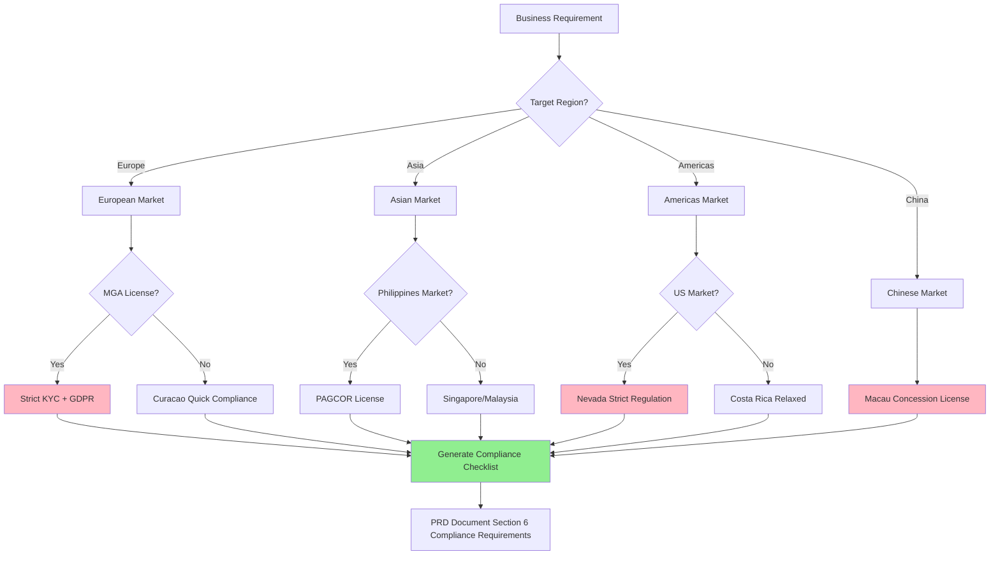
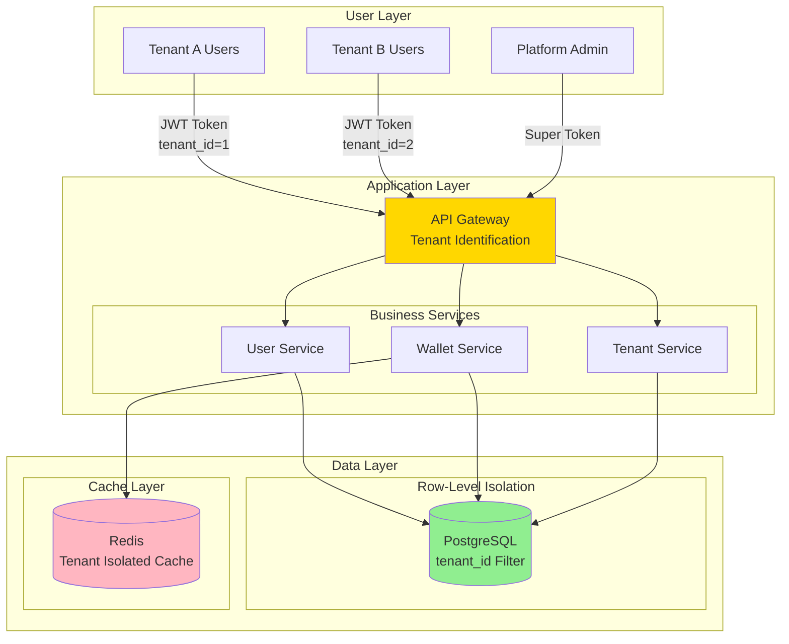

# Extracted Patterns: iGaming Multi-Tenant Wallet PM

> Extracted from SKILL.md to keep the main file focused on AI agent instructions.
> This file contains code examples, SQL schemas, Mermaid diagrams, and detailed implementation patterns.

---

## Pattern 1: Regional Compliance Mapping - Implementation Details

### Mermaid: Regional Selection Decision Tree



### Regional Decision Matrix

| Region | License Type | KYC Strictness | Tax Rate | Processing Time | Recommended Scenario |
|--------|-------------|---------------|----------|----------------|---------------------|
| EU MGA | Malta Gaming Authority | 5/5 Strict | 5% GGR | 6-12 months | High compliance European market |
| Curacao | Curacao eGaming | 2/5 Relaxed | Fixed fee | 1-3 months | Fast launch, limited budget |
| Philippines PAGCOR | Philippine Amusement & Gaming Corp | 3/5 Medium | 5% GGR | 3-6 months | Mainstream Asian market choice |
| US Nevada | Nevada Gaming Control Board | 5/5 Strictest | 6.75% GGR | 12-24 months | Legal US market |
| Costa Rica | Self-regulated | 1/5 Most relaxed | No tax | 1 month | Offshore operations (high risk) |
| Macau | Macau Gaming Inspection Bureau | 4/5 Strict | 39% GGR | Concession-based | Physical casino focused |

### Database Schema

```sql
-- Tenant Regional Compliance Configuration
CREATE TABLE t_tenant_compliance_config (
    id BIGSERIAL PRIMARY KEY,
    tenant_id BIGINT NOT NULL COMMENT 'Tenant ID',
    region VARCHAR(50) NOT NULL COMMENT 'Region code: EU_MGA, CW, PH_PAGCOR, US_NV, CR, MO',
    license_type VARCHAR(100) COMMENT 'License type',
    kyc_level INT NOT NULL DEFAULT 3 COMMENT 'KYC strictness: 1-5',
    tax_rate DECIMAL(5,4) COMMENT 'GGR tax rate (decimal, e.g., 0.05 = 5%)',
    compliance_checklist TEXT COMMENT 'JSON format compliance checklist',
    created_at TIMESTAMP DEFAULT NOW(),
    updated_at TIMESTAMP DEFAULT NOW(),
    deleted_flag TINYINT DEFAULT 0,
    CONSTRAINT uk_tenant_region UNIQUE (tenant_id, region, deleted_flag)
);
```

### Service Layer Implementation

```java
@Service
@RequiredArgsConstructor
public class ComplianceService {
    private final ComplianceConfigDao complianceConfigDao;
    private final TenantContextHolder tenantContext;

    public Option<ComplianceConfigVO> getComplianceConfig(String region) {
        Long tenantId = tenantContext.getCurrentTenantId();
        return complianceConfigDao.selectByTenantAndRegion(tenantId, region)
            .map(entity -> SmartBeanUtil.copy(entity, ComplianceConfigVO.class));
    }

    public ComplianceChecklistVO generateChecklist(String region) {
        return RegionalComplianceFactory.create(region).generateChecklist();
    }
}
```

---

## Pattern 2: Multi-Tenant Architecture Design - Implementation Details

### Mermaid: Multi-Tenant Architecture Decision Tree

```mermaid
flowchart TD
    START[Multi-Tenant Requirement] --> SCALE{Tenant Count?}

    SCALE -->|< 10| SMALL[Small Scale]
    SCALE -->|10-100| MEDIUM[Medium Scale]
    SCALE -->|> 100| LARGE[Large Scale]

    SMALL --> SECURITY_S{Security Requirement?}
    SECURITY_S -->|High| SCHEMA_S[Schema Isolation]
    SECURITY_S -->|Medium| ROW_S[Row-Level Isolation]

    MEDIUM --> SECURITY_M{Security Requirement?}
    SECURITY_M -->|High| SCHEMA_M[Schema Isolation]
    SECURITY_M -->|Medium| ROW_M[Row-Level Isolation + Cache Isolation]

    LARGE --> COST{Cost Consideration?}
    COST -->|Low cost| ROW_L[Row-Level Isolation + Sharding]
    COST -->|High security| ISOLATED[Full Isolation (Dedicated Server)]

    SCHEMA_S --> IMPL1[Implementation Plan A]
    ROW_S --> IMPL2[Implementation Plan B]
    SCHEMA_M --> IMPL1
    ROW_M --> IMPL2
    ROW_L --> IMPL3[Implementation Plan C]
    ISOLATED --> IMPL4[Implementation Plan D]

    IMPL1 --> OUTPUT[PRD Document Section 3 Architecture Design]
    IMPL2 --> OUTPUT
    IMPL3 --> OUTPUT
    IMPL4 --> OUTPUT

    style SCHEMA_S fill:#FFB6C1
    style ISOLATED fill:#FFB6C1
    style OUTPUT fill:#90EE90
```

### Isolation Strategy Comparison

| Strategy | Advantage | Disadvantage | Applicable Scenario | Complexity |
|----------|-----------|-------------|---------------------|------------|
| **Schema Isolation** | Full isolation, highest security, simple backup/restore | High ops cost, many DB connections | Tenants < 50, extreme security needs | 4/5 |
| **Row-Level Isolation** | Low cost, good scalability, simple unified queries | Must prevent tenant_id leaks, needs filter on queries | Tenants > 100, cost sensitive | 3/5 |
| **Full Isolation** | Ultimate security, independent performance, best compliance | Highest cost, complex operations | Top-tier clients, financial-grade security | 5/5 |

### MyBatis Interceptor for Auto tenant_id Injection

```java
@Intercepts({
    @Signature(type = Executor.class, method = "query", args = {MappedStatement.class, Object.class, RowBounds.class, ResultHandler.class}),
    @Signature(type = Executor.class, method = "update", args = {MappedStatement.class, Object.class})
})
public class TenantInterceptor implements Interceptor {
    @Override
    public Object intercept(Invocation invocation) throws Throwable {
        Long tenantId = TenantContextHolder.getCurrentTenantId();
        if (tenantId == null) {
            throw new BusinessException("Tenant context missing");
        }

        // Auto-inject tenant_id into WHERE clause
        MappedStatement ms = (MappedStatement) invocation.getArgs()[0];
        Object parameter = invocation.getArgs()[1];

        BoundSql boundSql = ms.getBoundSql(parameter);
        String originalSql = boundSql.getSql();
        String newSql = addTenantFilter(originalSql, tenantId);

        // Replace SQL
        // ... detailed implementation see MULTI_TENANT_TECHNICAL_GUIDE.md

        return invocation.proceed();
    }
}
```

### ArchitectureTest Verification

```java
@Test
void allDaoMethodsShouldUseTenantContext() {
    classes()
        .that().resideInAPackage("..dao..")
        .and().haveSimpleNameEndingWith("Dao")
        .should(new ArchCondition<JavaClass>("use tenant context") {
            @Override
            public void check(JavaClass javaClass, ConditionEvents events) {
                // Verify all Dao methods go through TenantInterceptor for tenant_id injection
            }
        })
        .check(importedClasses);
}
```

---

## Pattern 3: Seamless Wallet - Implementation Details

### Mermaid: Bet API Sequence Diagram

```mermaid
sequenceDiagram
    participant GP as Game Provider<br/>(Evolution Gaming)
    participant API as Wallet API
    participant Service as WalletService
    participant Manager as WalletManager
    participant Redis as Redis Cache
    participant DB as PostgreSQL

    GP->>API: POST /api/wallet/bet<br/>{token, amount, txId}

    Note over API,Service: Phase 1: Token Validation
    API->>Service: validateToken(token)
    Service->>Redis: GET player:{token}
    Redis-->>Service: playerId: 12345
    Service-->>API: playerId

    Note over API,Redis: Phase 2: Idempotency Check
    API->>Redis: EXISTS idempotency:{txId}
    Redis-->>API: false (not processed)

    Note over API,Manager: Phase 3: Debit Transaction (@Transactional)
    API->>Manager: debitBalance(playerId, amount, txId)
    activate Manager

    Manager->>Redis: LOCK player:{playerId}
    Manager->>DB: SELECT balance FOR UPDATE<br/>(Optimistic Lock)
    DB-->>Manager: balance: 1000

    alt Sufficient Balance
        Manager->>DB: UPDATE balance = 900<br/>version++
        Manager->>DB: INSERT t_wallet_transaction
        Manager->>Redis: SETEX idempotency:{txId} 1 86400<br/>(TTL 24 hours)
        Manager->>Redis: UNLOCK player:{playerId}
        Manager-->>API: SUCCESS {newBalance: 900}
        deactivate Manager
        API-->>GP: 200 OK<br/>{balance: 900, txId}
    else Insufficient Balance
        Manager->>Redis: UNLOCK player:{playerId}
        Manager-->>API: INSUFFICIENT_BALANCE
        deactivate Manager
        API-->>GP: 400 Bad Request<br/>{error: "INSUFFICIENT_BALANCE"}
    end

    Note over GP,DB: Idempotency guarantee:<br/>Redis txId cache + DB unique index
```

### Manager Layer Transaction Management

```java
@Service
@RequiredArgsConstructor
public class WalletManager {
    private final WalletDao walletDao;
    private final WalletTransactionDao transactionDao;
    private final RedissonClient redissonClient;
    private final StringRedisTemplate redisTemplate;

    @Transactional(rollbackFor = Throwable.class)
    public ResponseDTO<BetResponseVO> debitBalance(Long playerId, BigDecimal amount, String transactionId) {
        // Phase 1: Distributed lock
        RLock lock = redissonClient.getLock("wallet:lock:" + playerId);
        try {
            if (!lock.tryLock(5, 10, TimeUnit.SECONDS)) {
                return ResponseDTO.error(UserErrorCode.CONCURRENT_CONFLICT, "System busy, please retry");
            }

            // Phase 2: Optimistic lock query balance
            WalletEntity wallet = walletDao.selectByPlayerIdForUpdate(playerId);
            if (wallet.getBalance().compareTo(amount) < 0) {
                return ResponseDTO.error(UserErrorCode.INSUFFICIENT_BALANCE, "Insufficient balance");
            }

            // Phase 3: Debit
            int updated = walletDao.updateBalanceOptimistic(
                playerId,
                wallet.getBalance().subtract(amount),
                wallet.getVersion()
            );
            if (updated == 0) {
                throw new BusinessException("Concurrent conflict, please retry");
            }

            // Phase 4: Record transaction
            WalletTransactionEntity tx = new WalletTransactionEntity();
            tx.setPlayerId(playerId);
            tx.setTransactionId(transactionId);
            tx.setTransactionType("BET");
            tx.setAmount(amount);
            tx.setBalanceBefore(wallet.getBalance());
            tx.setBalanceAfter(wallet.getBalance().subtract(amount));
            transactionDao.insert(tx);

            // Phase 5: Redis idempotency cache
            redisTemplate.opsForValue().set(
                "idempotency:" + transactionId,
                "1",
                24,
                TimeUnit.HOURS
            );

            return ResponseDTO.ok(BetResponseVO.builder()
                .transactionId(transactionId)
                .newBalance(wallet.getBalance().subtract(amount))
                .build());

        } catch (InterruptedException e) {
            Thread.currentThread().interrupt();
            return ResponseDTO.error(UserErrorCode.SYSTEM_ERROR, "Failed to acquire lock");
        } finally {
            if (lock.isHeldByCurrentThread()) {
                lock.unlock();
            }
        }
    }
}
```

### Wallet Transaction DDL

```sql
CREATE TABLE t_wallet_transaction (
    id BIGSERIAL PRIMARY KEY,
    tenant_id BIGINT NOT NULL COMMENT 'Tenant ID (multi-tenant isolation)',
    player_id BIGINT NOT NULL COMMENT 'Player ID',
    transaction_id VARCHAR(64) UNIQUE NOT NULL COMMENT 'Transaction ID (idempotency guarantee)',
    transaction_type VARCHAR(20) NOT NULL COMMENT 'BET/SETTLE/ROLLBACK',
    amount NUMERIC(18,2) NOT NULL COMMENT 'Amount',
    balance_before NUMERIC(18,2) NOT NULL COMMENT 'Balance before transaction',
    balance_after NUMERIC(18,2) NOT NULL COMMENT 'Balance after transaction',
    game_provider VARCHAR(50) COMMENT 'Game provider',
    game_id VARCHAR(100) COMMENT 'Game ID',
    round_id VARCHAR(100) COMMENT 'Round ID',
    created_at TIMESTAMP DEFAULT NOW(),
    version INT DEFAULT 0 COMMENT 'Optimistic lock version',
    deleted_flag TINYINT DEFAULT 0,
    CONSTRAINT ck_tenant_id CHECK (tenant_id > 0),
    INDEX idx_wallet_tx_player (tenant_id, player_id),
    UNIQUE INDEX idx_wallet_tx_id (transaction_id)
);
```

---

## Pattern 4: Ultrathink Methodology - Example Analysis

### Wagering Requirement Verification Timing Analysis

**Problem**: After a player receives a bonus, when should the wagering requirement be verified and funds unlocked?

**Ultrathink Analysis:**

```
1. Problem Decomposition
   Q1: When to calculate wagering progress?
   Q2: When to unlock bonus wallet?
   Q3: After unlocking, if player continues playing and loses, who bears the loss?

2. First Principles
   - Fact 1: Bonus is operator's "conditional reward"
   - Fact 2: Wagering requirement is "anti-arbitrage" risk control measure
   - Fact 3: Unlocked funds are treated as "player's real funds"

3. Scenario Enumeration
   Scenario A: Auto-unlock on bet (incorrect approach)
   Scenario B: Verify on withdrawal request (correct approach)

4. Risk Assessment
   Scenario A risks:
   - CRITICAL Fund risk: Player continues playing after meeting requirement, bonus already unlocked, cannot recover
   - CRITICAL Audit risk: Cannot retroactively verify wagering calculation correctness

   Scenario B risks:
   - LOW No major risk, aligns with industry standard

5. Solution Comparison
   | Plan | Advantage | Disadvantage | Industry Standard |
   |------|-----------|-------------|-------------------|
   | A: Unlock on bet | Good real-time | High fund risk | Non-standard |
   | B: Unlock on withdrawal | Safe and controllable | Extra verification step | Standard practice |

6. Decision Reasoning
   Choose Plan B: Verify on withdrawal

   Reasons:
   - Pragmatic Play: "Wagering requirement is only cleared when player initiates withdrawal"
   - Evolution Gaming: "Bonus balance remains locked until requirement met AND withdrawal requested"
   - Aligns with first principles of risk control
```

---

## Pattern 5: PRD Document Template Structure

```markdown
# [Feature Name] Product Requirements Document (PRD)

## Document Info
- Version: v1.0.0
- Created: 2026-01-29
- Last Updated: 2026-01-29
- Status: Pending Review

---

## Section 1: Executive Summary
### 1.1 Background & Goals
### 1.2 Core Value
### 1.3 Key Metrics

## Section 2: Requirements Analysis
### 2.1 Business Scenarios
### 2.2 User Roles
### 2.3 Functional Requirements List

## Section 3: Technical Solution
### 3.1 Architecture Design (Mermaid architecture diagram)
### 3.2 SmartAdmin Layered Design
### 3.3 Data Model (Mermaid erDiagram)
### 3.4 API Specification (Mermaid sequenceDiagram)

## Section 4: Deep Analysis (Ultrathink)
### 4.1 Problem Decomposition
### 4.2 First Principles
### 4.3 Scenario Enumeration
### 4.4 Risk Assessment
### 4.5 Solution Comparison
### 4.6 Decision Reasoning

## Section 5: Implementation Plan
### 5.1 Development Task Breakdown
### 5.2 Time Estimates
### 5.3 Milestones

## Section 6: Risk & Compliance
### 6.1 Regional Compliance Requirements (Comparison Table)
### 6.2 Security Risk Assessment
### 6.3 Performance Risk Assessment
### 6.4 Mitigation Plans
```

---

## Pattern 6: Mermaid Diagram Strategy - C4 Architecture Example

### Multi-Tenant Architecture Diagram



### Diagram Type Selection Guide

| Diagram Type | Use Case | Node Limit | Example |
|-------------|---------|------------|---------|
| **flowchart** | Decision flows, business processes, state machines | ≤ 20 nodes | Token validation decision tree |
| **sequenceDiagram** | API call sequences, system interactions | ≤ 8 participants | Bet API sequence diagram |
| **erDiagram** | Database design, entity relationships | ≤ 10 entities | Wallet transaction table design |
| **architecture (C4)** | System architecture, module relationships | ≤ 15 components | Multi-tenant architecture diagram |
| **stateDiagram** | State transitions, workflows | ≤ 12 states | Order status flow |

---

## Pattern 7: Risk Assessment Framework - Full Matrix

### Risk Assessment Matrix

| Risk Type | Risk Level | Impact Scope | Trigger Condition | Mitigation | Owner |
|-----------|-----------|-------------|-------------------|------------|-------|
| **Fund Safety** | | | | | |
| Duplicate deduction | CRITICAL | Direct financial loss | Idempotency failure | Three-layer idempotency protection | Backend Lead |
| Duplicate reward issuance | CRITICAL | Direct financial loss | TOCTOU race condition | Lua script atomicity | Backend Lead |
| Balance calculation error | CRITICAL | Financial report errors | Concurrent conflicts | Optimistic lock + distributed lock | Backend Lead |
| **Performance** | | | | | |
| High-concurrency deduction timeout | HIGH | Poor user experience | TPS > 1000 | Redis cache + sharding | DevOps |
| DB connection pool exhaustion | HIGH | Service unavailable | Slow query accumulation | Connection pool monitoring + alerts | DBA |
| Redis cache breakdown | MEDIUM | Brief latency | Hotspot key expiration | Bloom filter + never-expire | Backend Team |
| **Compliance** | | | | | |
| Insufficient KYC verification | CRITICAL | License revocation | Regional compliance requirements | Multi-level KYC verification | Compliance Team |
| Missing AML detection | CRITICAL | Money laundering risk | Large transaction not flagged | Real-time AML rule engine | Risk Control Team |
| GDPR violation | HIGH | Fines | Personal data leak | Data encryption + access logging | Legal + IT |

### Risk Level Definitions

| Level | Color | Definition | Response Time | Escalation |
|-------|-------|-----------|---------------|------------|
| **Critical** | Red | Direct financial loss or compliance risk | Immediate | CEO + CTO |
| **High** | Orange | Major impact without direct loss | Within 24 hours | Department Lead |
| **Medium** | Yellow | Moderate impact, tolerable short-term | Within 1 week | Project Manager |
| **Low** | Green | Minor impact, technical debt | Within 1 month | Dev Team |

---

**Version**: 1.0.0
**Extracted From**: SKILL.md v1.1.0
**Last Updated**: 2026-02-06
