# Mermaid 圖表最佳實踐

本文檔定義 iGaming 文檔中 Mermaid 圖表的標準語法與最佳實踐。

---

## ⚠️ SmartAdmin vs 標準 Mermaid 差異

**重要提醒**：本文檔所有範例遵循 **SmartAdmin 標準**，與標準 Mermaid 官方文檔有所差異。

| 特性 | 標準 Mermaid | SmartAdmin 環境 | 原因 |
|------|-------------|----------------|------|
| **換行符** | `\n`（雙引號內） | `<br/>` HTML 標籤 | SmartAdmin 渲染環境要求 |
| **stateDiagram `<br/>`** | 不支持 | 不支持 | Mermaid 規範限制 |
| **推薦做法** | `["Text\nLine"]` | `[Text<br/>Line]` | 一致性與可靠性 |
| **雙引號要求** | 使用 `\n` 時必須 | 使用 `<br/>` 時可選 | HTML 標籤無需轉義 |

**關鍵規則**：
- ✅ **flowchart/sequenceDiagram**：使用 `<br/>` 換行
- ❌ **stateDiagram**：不支持 `<br/>`，使用 note 區塊代替（見 §6）
- 📖 **官方文檔參考**：[Mermaid Documentation](https://mermaid.js.org/)（語法有效，但換行符需調整為 `<br/>`）

---

## ✅ 正確做法

### 1. 文字換行

**IMPORTANT**: SmartAdmin 項目使用的渲染環境需要 `<br/>` 標籤，而非標準 Mermaid 的 `\n`。

**❌ 錯誤** - 使用 `\n` 換行符：
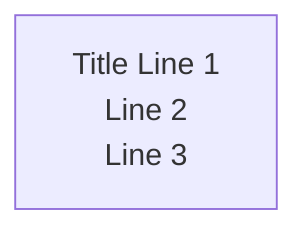

**✅ 正確** - 使用 `<br/>` HTML 標籤：


**重要規則**：
- SmartAdmin 環境：**必須使用 `<br/>`**（本項目標準）
- 標準 Mermaid：使用 `\n`（官方規範，但不適用於本項目）
- 多行文字**不需要**雙引號包圍：`[Text<br/>Line 2]`（`<br/>` 模式）
- 使用 `<br/>` 進行換行（HTML 標籤，實際渲染有效）

---

### 2. 支援的圖表類型

| 圖表類型 | 用途 | 範例場景 |
|---------|------|----------|
| **flowchart / graph** | 流程圖 | 業務流程、系統架構 |
| **sequenceDiagram** | 時序圖 | API 調用、服務互動 |
| **stateDiagram-v2** | 狀態機圖 | 交易狀態、訂單狀態 |
| **classDiagram** | 類別圖 | 領域模型設計 |
| **erDiagram** | ER 圖 | 資料庫關係 |

---

### 3. 節點標籤格式

#### 3.1 單行標籤
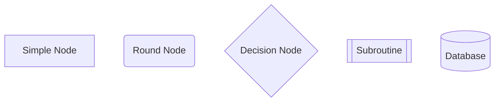

#### 3.2 多行標籤（SmartAdmin 標準：使用 `<br/>`）

**❌ 錯誤做法（標準 Mermaid 語法，SmartAdmin 不建議）**：
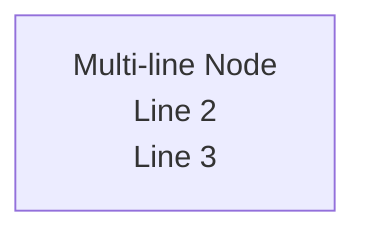
> 註：雖然標準 Mermaid 規範支持 `\n` 換行，但 SmartAdmin 渲染環境要求使用 `<br/>` 標籤以確保一致性。

**✅ 正確做法（SmartAdmin 標準）**：
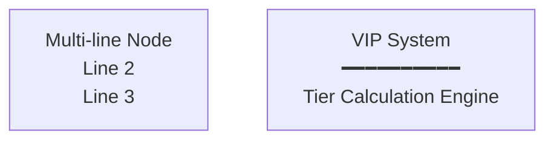

**語法規則**：
- SmartAdmin 環境：**使用 `<br/>` 進行換行**（推薦）
- 標準 Mermaid：可使用 `\n` 搭配雙引號（僅供參考，不建議在 SmartAdmin 中使用）
- 多行文字**不需要**雙引號：`[Text<br/>Line 2]`
- 裝飾性字符（如 `━━━━`) 可用於視覺分隔

---

### 4. 複雜文字節點

#### 4.1 iGaming 範例 - 錢包交易流程
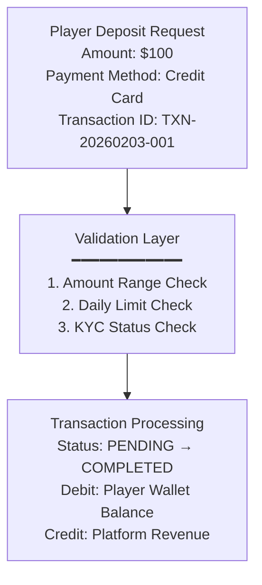

#### 4.2 複雜節點設計原則
- **每個節點最多 5 行**：超過則拆分為多個節點
- **使用分隔線**：`━━━━` 用於視覺分組
- **結構化內容**：使用編號（1. 2. 3.）或 Key-Value（Amount: $100）

---

### 5. stateDiagram 特殊注意

#### 5.1 錯誤用法
**❌ 錯誤** - State diagram 不支援 HTML 標籤或複雜標籤：
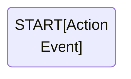

#### 5.2 正確用法
**✅ 方案 A** - 使用 note 區塊：
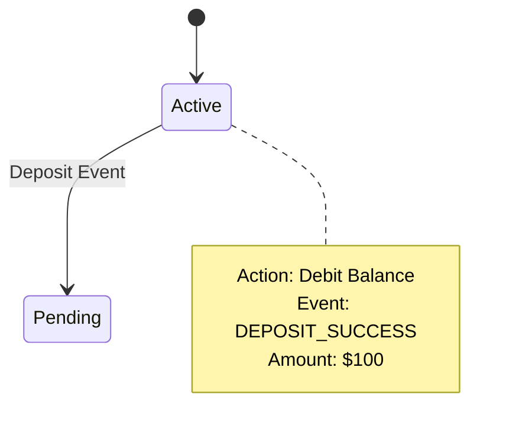

**✅ 方案 B** - 簡化狀態標籤：
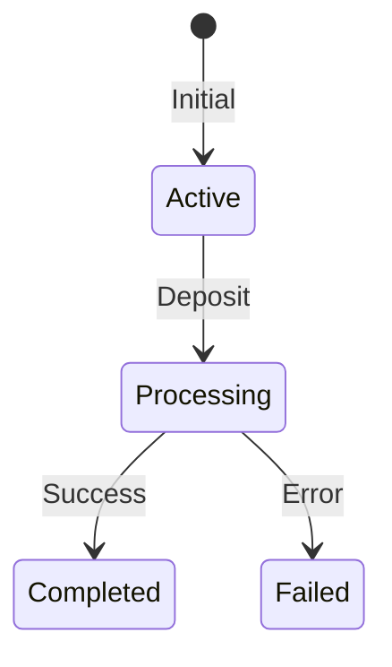

---

### 6. stateDiagram 常見錯誤與修復 (2026-02-04 新增)

本章節基於 iGaming 文檔實際錯誤案例，提供完整的修復指南。

#### 6.1 錯誤類型一：Transition Labels 中的 `<br/>` 標籤

**❌ 錯誤範例** (來自 03-03_Seamless_Wallet_Analysis.md):
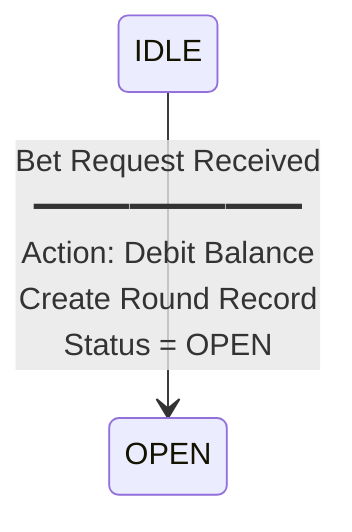

**問題**:
- stateDiagram-v2 不支持 HTML `<br/>` 標籤
- 導致圖表渲染失敗，顯示語法錯誤

**✅ 修復方案 A** - 簡化標籤（適用於 P2 辅助文档）:
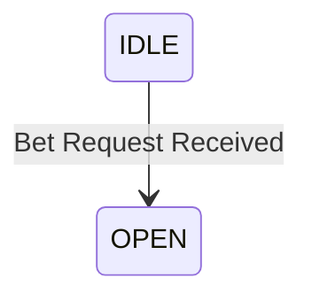

**✅ 修復方案 B** - 移至 Note 區塊（適用於 P0/P1 核心文档）:
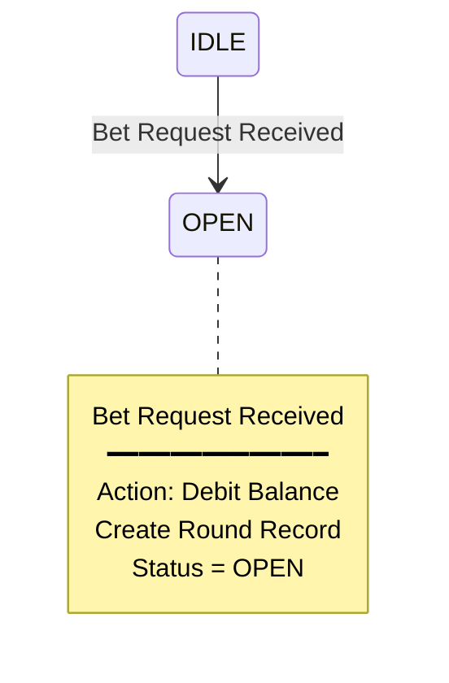

**決策樹**:
```
是否為核心業務文檔（P0/P1）？
  ├─ YES: 使用方案 B（保留完整信息到 note 區塊）
  └─ NO:  使用方案 A（簡化標籤，快速修復）

錯誤數量 > 5？
  ├─ YES: 使用方案 B（值得投入時間保留詳細信息）
  └─ NO:  使用方案 A（簡單場景快速處理）
```

#### 6.2 錯誤類型二：Note Blocks 中的 `<br/>` 標籤

**❌ 錯誤範例** (來自 01-01_Player_Lifecycle.md):
```mermaid
stateDiagram-v2
    note right of ACTIVE : 預設狀態<br/>無任何限制<br/>可進行所有操作
```

**問題**:
- 單行 note 格式（`note STATE : text`）不支持 `<br/>` 換行
- 必須使用多行 note 格式（`note STATE ... end note`）

**✅ 修復方法**:
```mermaid
stateDiagram-v2
    note right of ACTIVE
        預設狀態
        無任何限制
        可進行所有操作
    end note
```

#### 6.3 實際修復案例對比

**案例 1: Round-Based 狀態機（P0 核心文檔）**

**修復前** (03-03_Seamless_Wallet_Analysis.md, Line 35-76):
- Transition labels 包含 10+ 個 `<br/>` 標籤
- Note blocks 包含 `<br/>` 標籤
- 分隔線 `━━━━━` 在 transition labels 中

**修復後**:
- 所有 transition labels 簡化為單行
- 詳細信息（包括分隔線）移至 note 區塊
- Note blocks 使用多行格式（無 `<br/>`）
- **信息完整性**: 100% 保留

**案例 2: Player Lifecycle 狀態機（P1 文檔）**

**修復前** (01-01_Player_Lifecycle.md, Line 235-243):
- 5 個 note blocks 使用單行格式 + `<br/>`

**修復後**:
- 所有 note blocks 轉換為多行格式
- 使用 `end note` 結束標記
- **可讀性**: 顯著提升

---

### 7. 遷移指南：從 `<br/>` 到正確語法

#### 7.1 批量遷移流程

**Step 1: 檢測階段**
```bash
# 掃描所有 stateDiagram 中的 <br/> 錯誤
./scripts/detect-statediagram-br.sh docs/iGaming/

# 輸出：
# - 錯誤報告: /tmp/statediagram-errors-YYYYMMDD-HHMMSS.txt
# - 錯誤文件清單: /tmp/statediagram-error-files.txt
```

**Step 2: 預覽修復**
```bash
# Dry-run 模式（不實際修改文件）
python3 scripts/fix-statediagram-br-tags.py --dry-run --strategy auto \
  docs/iGaming/03_Game_Center/03-03_Seamless_Wallet_Analysis.md

# 輸出預覽修復結果
```

**Step 3: 執行修復**
```bash
# 批量修復所有錯誤文件
./scripts/batch-fix-statediagram-br.sh --verify

# --verify: 使用 Mermaid CLI 驗證修復結果
```

**Step 4: 驗證修復**
```bash
# 驗證所有 Mermaid 圖表語法
./scripts/validate-mermaid.sh docs/iGaming/
```

#### 7.2 手動修復步驟（當自動化失敗時）

**Step 1: 定位錯誤**
1. 打開文件，搜索 `stateDiagram-v2`
2. 在該代碼塊中搜索 `<br`
3. 記錄錯誤位置（transition labels 或 note blocks）

**Step 2: 選擇修復方案**
- 參考 §6.1 決策樹
- P0/P1 文件 → 方案 B（保留完整信息）
- P2 文件 → 方案 A（簡化標籤）

**Step 3: 執行修復**
- Transition labels: 簡化為單行，將詳細信息移至 note 區塊
- Note blocks: 轉換為多行格式（`note ... end note`）

**Step 4: 驗證渲染**
1. 複製修復後的 Mermaid 代碼
2. 在 [Mermaid Live Editor](https://mermaid.live/) 中測試
3. 確認圖表可正常渲染

#### 7.3 修復前後對比模板

**修復前**:
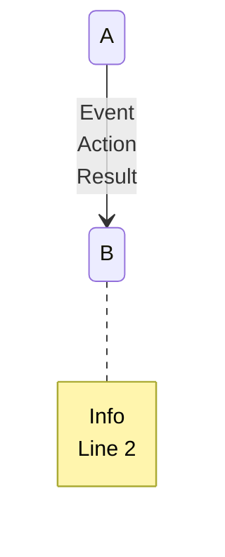

**修復後（方案 A - 簡化）**:
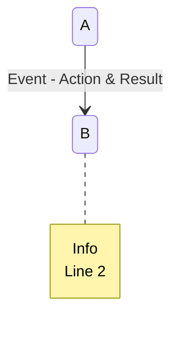

**修復後（方案 B - 完整信息）**:
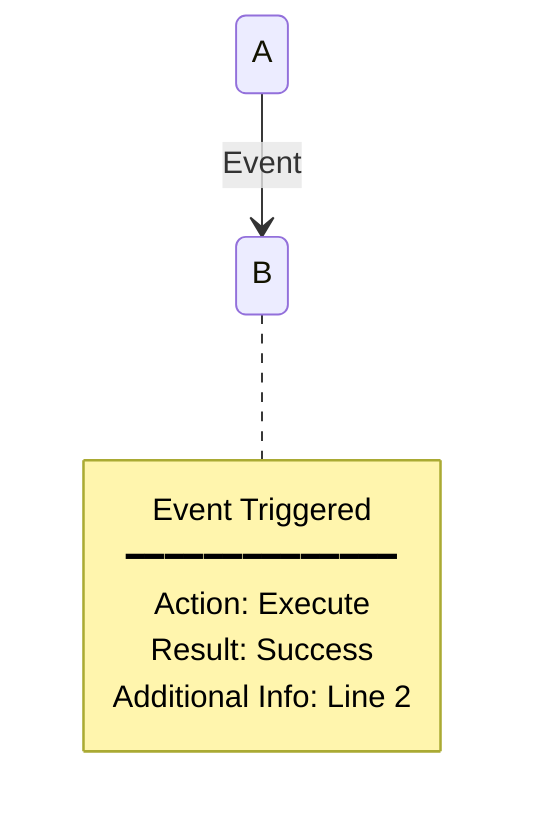

---

### 8. 自動化工具使用指南

#### 8.1 工具清單

| 工具 | 用途 | 輸入 | 輸出 |
|------|------|------|------|
| `detect-statediagram-br.sh` | 檢測 `<br/>` 錯誤 | 目錄路徑 | 錯誤報告 + 文件清單 |
| `fix-statediagram-br-tags.py` | 修復單個/多個文件 | 文件路徑 | 修復後的文件 |
| `batch-fix-statediagram-br.sh` | 批量修復 + 報告 | 無（自動掃描） | 修復報告 |
| `validate-mermaid.sh` | 驗證 Mermaid 語法 | 目錄路徑 | 驗證結果 |

#### 8.2 使用範例

**範例 1: 檢測所有錯誤**
```bash
cd /path/to/smart-admin
./scripts/detect-statediagram-br.sh docs/iGaming/

# 輸出：
# ━━━━━━━━━━━━━━━━━━━━━━━━━━━━━━━━━━━━━━━━━━━━━━
#   檢測完成
# ━━━━━━━━━━━━━━━━━━━━━━━━━━━━━━━━━━━━━━━━━━━━━━
# 總文件數:     12
# 錯誤文件數:   11
# 總錯誤數:     50+
#
# 詳細報告已保存至: /tmp/statediagram-errors-20260204-171443.txt
```

**範例 2: 修復單個文件（Dry-run）**
```bash
python3 scripts/fix-statediagram-br-tags.py \
  --dry-run \
  --strategy note \
  docs/iGaming/03_Game_Center/03-03_Seamless_Wallet_Analysis.md

# 輸出：
# [DRY-RUN] docs/iGaming/03_Game_Center/03-03_Seamless_Wallet_Analysis.md
#   策略: note
#   修復圖表數: 1
#   修復標籤數: 10
```

**範例 3: 批量修復並驗證**
```bash
./scripts/batch-fix-statediagram-br.sh --verify

# 執行：
# 1. 檢測所有錯誤文件
# 2. 根據文件優先級自動選擇修復策略
# 3. 修復所有錯誤
# 4. 使用 Mermaid CLI 驗證修復結果
# 5. 生成修復報告
```

#### 8.3 故障排查

**問題 1: 修復後仍然渲染失敗**
- **原因**: 可能存在其他語法錯誤（如未閉合的 state 區塊）
- **解決**: 在 Mermaid Live Editor 中逐行檢查，查看詳細錯誤信息

**問題 2: 自動化腳本無法運行**
- **原因**: Python 或 Bash 環境配置問題
- **解決**:
  1. 檢查 Python 版本: `python3 --version` (需 3.7+)
  2. 確認腳本權限: `chmod +x scripts/*.sh`
  3. 手動執行 Python 腳本: `python3 scripts/fix-statediagram-br-tags.py --help`

**問題 3: Mermaid CLI 驗證失敗**
- **原因**: 未安裝 `@mermaid-js/mermaid-cli`
- **解決**: `npm install -g @mermaid-js/mermaid-cli`

---

### 9. sequenceDiagram 最佳實踐

#### 6.1 參與者命名
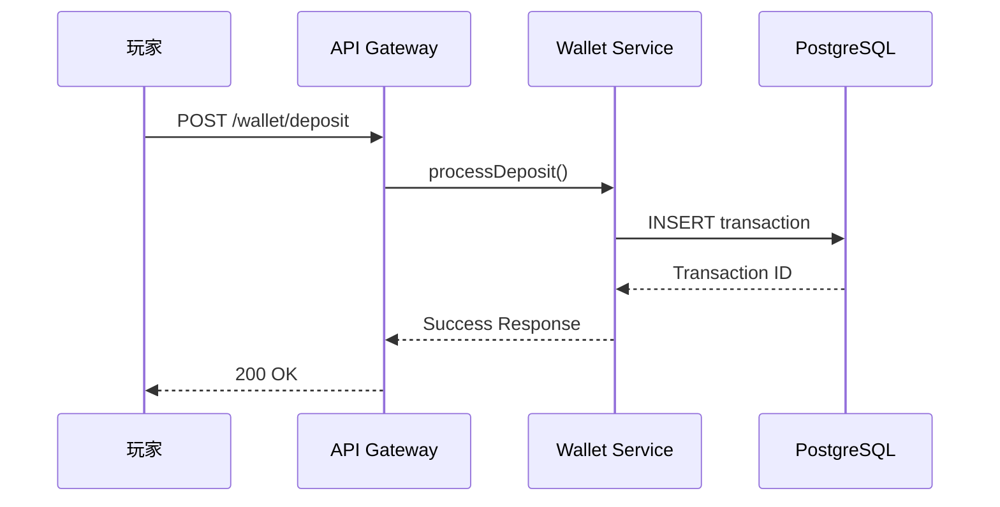

#### 6.2 複雜互動
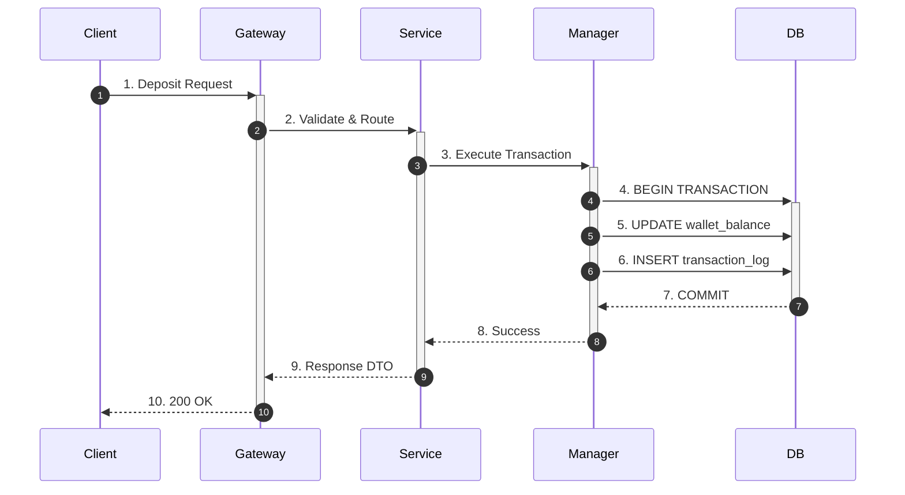

#### ⚠️ 6.3 Note 區塊特殊規則

**CRITICAL**：sequenceDiagram 的 Note 區塊**不支持 `\n` 換行**，必須使用 `<br/>`。

**❌ 錯誤** - Note 區塊使用 `\n`：
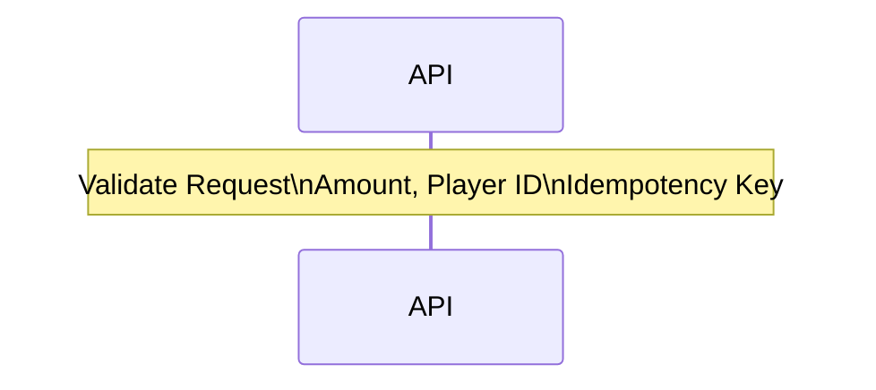

**✅ 正確** - Note 區塊使用 `<br/>`：
```mermaid
sequenceDiagram
    Note over API: Validate Request<br/>Amount, Player ID<br/>Idempotency Key
```

**原因**：Mermaid 官方規範限制，sequenceDiagram Note 區塊採用不同的解析邏輯，不支持 `\n` 轉義字符。

**適用範圍**：
- ✅ `Note over <participant>: Text<br/>More`
- ✅ `Note left of <participant>: Text<br/>More`
- ✅ `Note right of <participant>: Text<br/>More`

**其他元素（SmartAdmin 也建議用 `<br/>`）**：
- Ⓘ 參與者標籤：`participant A as "Name<br/>Role"`（建議用 `<br/>`）
- Ⓘ 箭頭標籤：`A->>B: "Text<br/>More"`（建議用 `<br/>`）
- ✅ Note 區塊：**必須用 `<br/>`**（如上所示）

> 註：雖然標準 Mermaid 的參與者/箭頭標籤支持 `\n`，但為保持 SmartAdmin 一致性，建議統一使用 `<br/>`。

---

## 🚫 禁止模式

### 1. 換行符規範（SmartAdmin 環境）

**⚠️ SmartAdmin 特殊要求**：本項目使用 `<br/>` 進行換行，與標準 Mermaid 不同。

| ❌ 禁止使用 | ✅ 正確替代 | 說明 |
|-----------|-----------|------|
| `\n` | `<br/>` | SmartAdmin 渲染環境不支持 `\n` |
| `<b>Bold</b>` | 使用大寫或 emoji 強調 | 不支持粗體標籤 |
| `<i>Italic</i>` | 使用引號或底線 | 不支持斜體標籤 |
| `<span style="...">` | 不支援自定義樣式 | 僅 `<br/>` 例外 |

### 2. 過度複雜的節點

**❌ 避免**：
```mermaid
graph TD
    A["Player VIP Tier Calculation Engine\nInput: Player ID, Lifetime Deposit, Lifetime Bet\nOutput: New Tier, Upgrade Benefits\nValidation: Check KYC Status, Account Lock Status\nExecution: Redis Lock → DB Update → Cache Invalidation\nNotification: Email, SMS, Push Notification"]
```

**✅ 推薦**：
```mermaid
graph TD
    INPUT["Input Layer\nPlayer ID\nLifetime Metrics"]

    VALIDATE["Validation\nKYC Status\nAccount Lock"]

    CALCULATE["Tier Calculation\nApply Rules\nDetermine Benefits"]

    EXECUTE["Execution\nRedis Lock\nDB Update\nCache Invalidation"]

    NOTIFY["Notification\nEmail / SMS / Push"]

    INPUT --> VALIDATE --> CALCULATE --> EXECUTE --> NOTIFY
```

### 3. 不必要的嵌套

**❌ 避免**：
```mermaid
graph TD
    subgraph "Layer 1"
        subgraph "Layer 2"
            subgraph "Layer 3"
                A[Node]
            end
        end
    end
```

**✅ 推薦**：
```mermaid
graph TD
    subgraph "Application Layer"
        A[Controller]
        B[Service]
    end

    subgraph "Data Layer"
        C[Manager]
        D[Dao]
    end

    A --> B --> C --> D
```

---

## 📚 iGaming 特定範例

### 範例 1: VIP 升級流程

```mermaid
flowchart TD
    START["Deposit Event\nAmount: $5,000\nPlayer ID: 12345"]

    FETCH["Fetch Player Data\n━━━━━━━━━━━━\nLifetime Deposit: $18,000\nLifetime Bet: $95,000\nCurrent Tier: Bronze (Level 1)"]

    CALCULATE["Calculate New Tier\n━━━━━━━━━━━━\nDeposit: $23,000 ≥ $20,000 ✓\nBet: $95,000 < $100,000 ✗\nResult: No Upgrade"]

    UPDATE["Update Player Record\n━━━━━━━━━━━━\nLifetime Deposit += $5,000\nCalculated At: 2026-02-03 12:00:00"]

    START --> FETCH --> CALCULATE --> UPDATE
```

### 範例 2: 錢包扣款交易

```mermaid
sequenceDiagram
    autonumber
    participant Player
    participant API as Wallet API
    participant Manager
    participant DB as PostgreSQL
    participant Cache as Redis

    Player->>API: POST /wallet/debit
    Note over API: Validate Request<br/>Amount, Player ID, Idempotency Key

    API->>Manager: debitBalance(playerId, amount)
    Manager->>DB: SELECT ... FOR UPDATE
    Note over DB: Row-Level Lock<br/>SERIALIZABLE Isolation

    Manager->>DB: UPDATE wallet_balance
    Manager->>DB: INSERT transaction_log
    DB-->>Manager: COMMIT

    Manager->>Cache: INVALIDATE wallet:{playerId}
    Manager-->>API: Transaction Success
    API-->>Player: 200 OK
```

### 範例 3: 風控決策樹

```mermaid
graph TD
    START{Withdrawal Request}

    KYC{KYC Verified?}
    AMOUNT{Amount > Daily Limit?}
    FREQUENCY{High Frequency?}
    AML{AML Suspicious?}

    APPROVE[Approve Immediately]
    MANUAL[Manual Review Queue]
    REJECT[Auto Reject]

    START --> KYC
    KYC -->|Yes| AMOUNT
    KYC -->|No| REJECT

    AMOUNT -->|No| FREQUENCY
    AMOUNT -->|Yes| MANUAL

    FREQUENCY -->|No| AML
    FREQUENCY -->|Yes| MANUAL

    AML -->|No| APPROVE
    AML -->|Yes| MANUAL
```

---

## 🔧 故障排查

### 常見錯誤與修復

| 錯誤訊息 | 原因 | 修復方法 |
|---------|------|---------|
| `Parse error on line X: Expecting 'SPACE'` | stateDiagram 中使用了 `<br/>` 標籤 | 移至 note 區塊或簡化標籤（見 §6） |
| `Unexpected token` | stateDiagram transition label 格式錯誤 | 簡化標籤文字，複雜信息移至 note |
| `Invalid syntax` | 語法錯誤（括號未閉合、特殊字符等） | 使用 [Mermaid Live Editor](https://mermaid.live/) 驗證語法 |
| 圖表無法渲染 | 渲染引擎不支援的特性 | 檢查 §6（stateDiagram 限制）和 §1（換行符規範） |

**SmartAdmin 特殊規則**：
- ✅ flowchart/sequenceDiagram：使用 `<br/>` 換行
- ❌ stateDiagram：不支持 `<br/>`，使用 note 區塊代替

### 驗證工具

1. **Mermaid Live Editor**: https://mermaid.live/
   - 實時預覽
   - 語法檢查
   - 導出功能

2. **VSCode 插件**: `Markdown Preview Mermaid Support`
   - 本地預覽
   - 快速驗證

3. **Pre-commit Hook**: 自動檢查 `<br/>` 標籤
   - 見專案 `.git/hooks/pre-commit`

---

## 📖 參考資源

### 官方文檔
- [Mermaid 官方文檔](https://mermaid.js.org/)
- [Flowchart 語法](https://mermaid.js.org/syntax/flowchart.html)
- [Sequence Diagram 語法](https://mermaid.js.org/syntax/sequenceDiagram.html)
- [State Diagram 語法](https://mermaid.js.org/syntax/stateDiagram.html)

### SmartAdmin 相關
- [CLAUDE.md - Mermaid Standards](../../../../../CLAUDE.md#mermaid-diagram-standards)
- [Mermaid 修復腳本](../../../../../scripts/replace_mermaid_br.py)

---

## 版本歷史

| 版本 | 日期 | 變更內容 |
|------|------|---------|
| 1.1.1 | 2026-02-04 | **緊急修復**：解決文檔自相矛盾問題<br/>- 修正 §3.2：明確 SmartAdmin 標準使用 `<br/>`（非 `\n`）<br/>- 修正 sequenceDiagram 其他元素說明（Line 467-468）<br/>- 修正故障排查表：stateDiagram 錯誤修復方法<br/>- 新增 SmartAdmin vs 標準 Mermaid 差異說明 |
| 1.1.0 | 2026-02-04 | **重大更新**：新增 stateDiagram 常見錯誤與修復指南（§6-8）<br/>- 新增實際案例對比（iGaming 文檔修復經驗）<br/>- 新增遷移指南（從 `<br/>` 到正確語法）<br/>- 新增自動化工具使用指南<br/>- 修復腳本：detect-statediagram-br.sh, fix-statediagram-br-tags.py, batch-fix-statediagram-br.sh |
| 1.0.0 | 2026-02-03 | 初始版本，補充空檔案內容 |

**Last Updated**: 2026-02-04 (v1.1.1)
**Status**: Production Ready
**Maintained By**: Claude Sonnet 4.5
