# Mermaid 圖表最佳實踐

本文檔定義 iGaming 文檔中 Mermaid 圖表的標準語法與最佳實踐。

---

## ✅ 正確做法

### 1. 文字換行

**❌ 錯誤** - 使用 HTML 標籤：
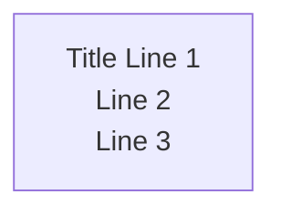

**✅ 正確** - 使用 `\n` 換行符：

**重要規則**：
- Mermaid 不支援 HTML 標籤（` `, `<b>`, `<i>`, `` 等）
- 多行文字必須使用雙引號包圍：`["Text\nLine 2"]`
- 使用 `\n` 進行換行（字面上的反斜線 + n，非實際換行符）

---

### 2. 支援的圖表類型

| 圖表類型 | 用途 | 範例場景 |
|---------|------|----------|
| **flowchart / graph** | 流程圖 | 業務流程、系統架構 |
| **sequenceDiagram** | 時序圖 | API 調用、服務互動 |
| **stateDiagram-v2** | 狀態機圖 | 交易狀態、訂單狀態 |
| **classDiagram** | 類別圖 | 領域模型設計 |
| **erDiagram** | ER 圖 | 資料庫關係 |

---

### 3. 節點標籤格式

#### 3.1 單行標籤
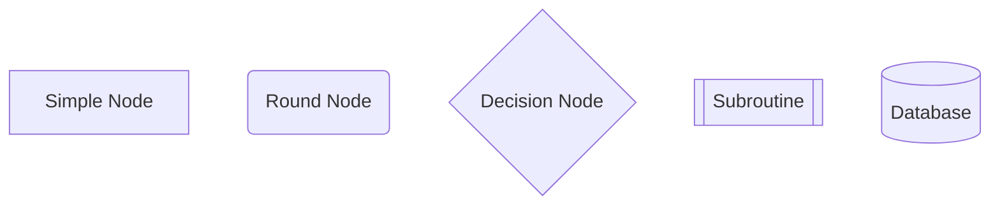

#### 3.2 多行標籤（使用雙引號 + `\n`）
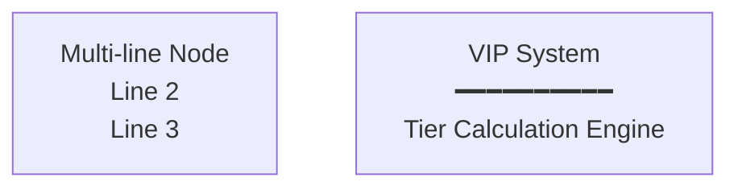

**語法規則**：
- 雙引號 `"` 必須包圍整個標籤
- 使用 `\n` 進行換行（不是 ` `）
- 裝飾性字符（如 `━━━━`) 可用於視覺分隔

---

### 4. 複雜文字節點

#### 4.1 iGaming 範例 - 錢包交易流程
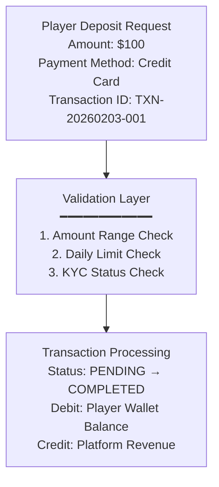

#### 4.2 複雜節點設計原則
- **每個節點最多 5 行**：超過則拆分為多個節點
- **使用分隔線**：`━━━━` 用於視覺分組
- **結構化內容**：使用編號（1. 2. 3.）或 Key-Value（Amount: $100）

---

### 5. stateDiagram 特殊注意

#### 5.1 錯誤用法
**❌ 錯誤** - State diagram 不支援 HTML 標籤或複雜標籤：
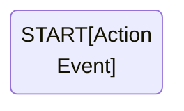

#### 5.2 正確用法
**✅ 方案 A** - 使用 note 區塊：
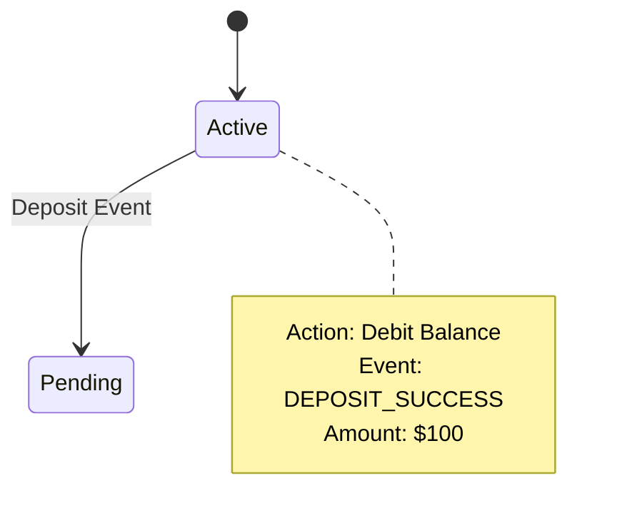

**✅ 方案 B** - 簡化狀態標籤：
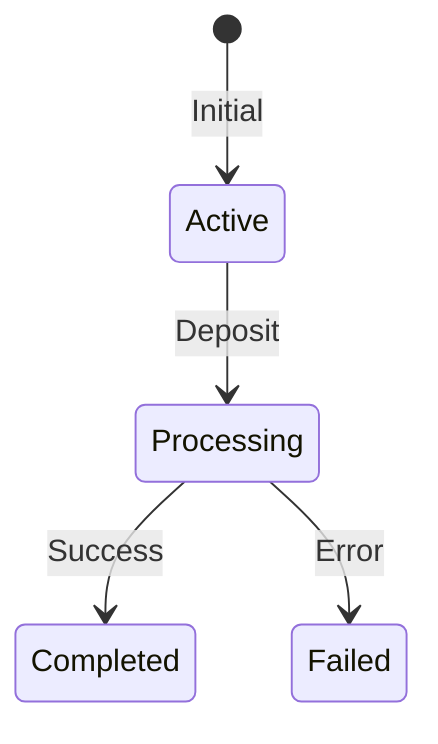

---

### 6. sequenceDiagram 最佳實踐

#### 6.1 參與者命名
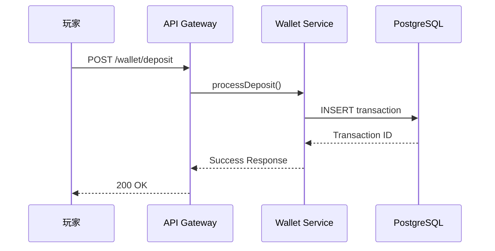

#### 6.2 複雜互動
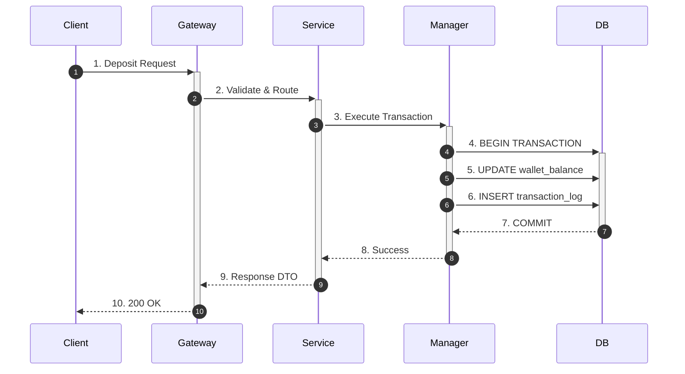

---

## 🚫 禁止模式

### 1. HTML 標籤在 Mermaid 中

| ❌ 禁止使用 | ✅ 正確替代 |
|-----------|-----------|
| ` ` | `\n` |
| `<b>Bold</b>` | 使用大寫或 emoji 強調 |
| `<i>Italic</i>` | 使用引號或底線 |
| `` | 不支援自定義樣式 |

### 2. 過度複雜的節點

**❌ 避免**：
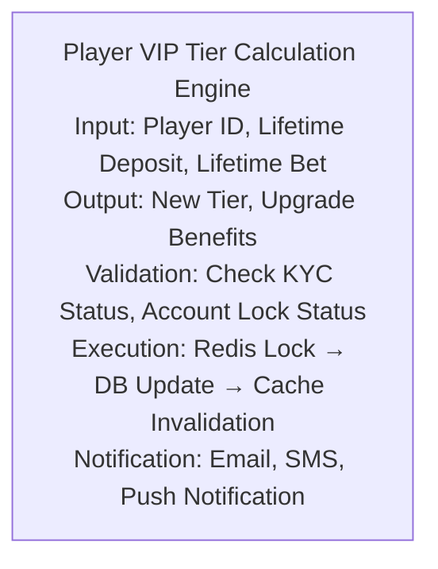

**✅ 推薦**：
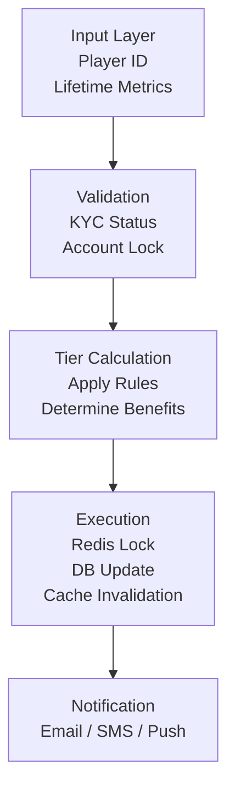

### 3. 不必要的嵌套

**❌ 避免**：
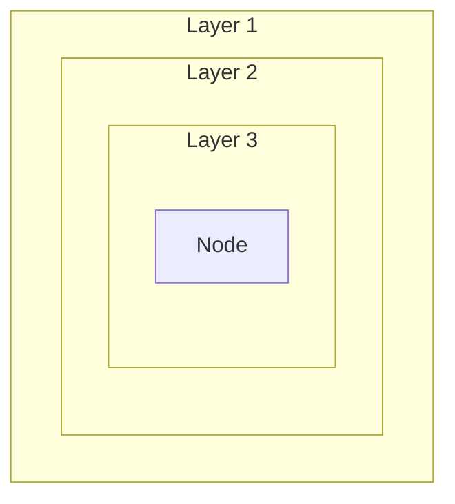

**✅ 推薦**：
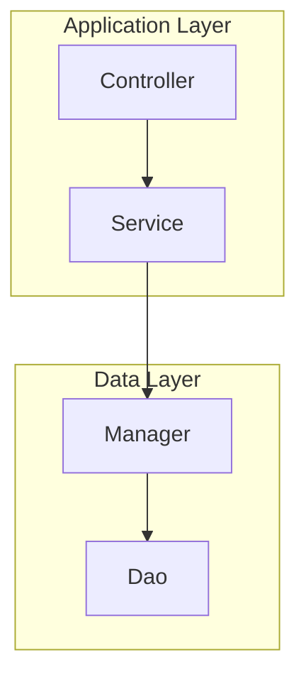

---

## 📚 iGaming 特定範例

### 範例 1: VIP 升級流程

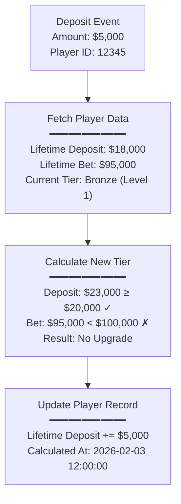

### 範例 2: 錢包扣款交易

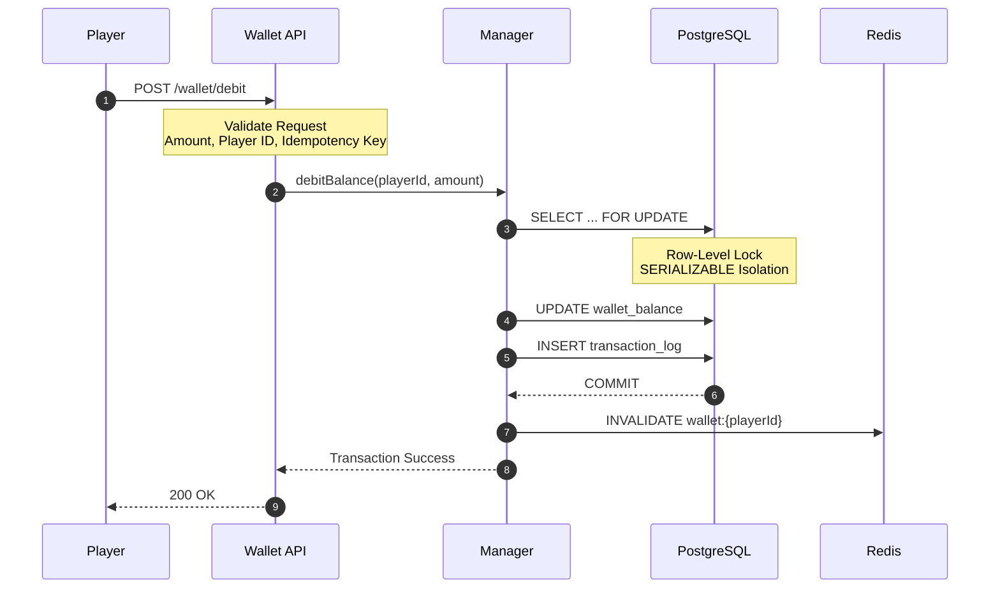

### 範例 3: 風控決策樹

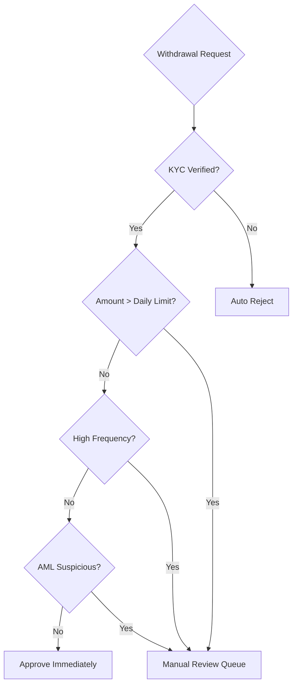

---

## 🔧 故障排查

### 常見錯誤與修復

| 錯誤訊息 | 原因 | 修復方法 |
|---------|------|---------|
| `Parse error on line X: Expecting 'SPACE'` | 使用了 ` ` 標籤 | 替換為 `\n` |
| `Unexpected token` | 多行文字未使用雙引號 | 添加雙引號：`["Text\nLine 2"]` |
| `Invalid syntax` | HTML 標籤在節點中 | 移除所有 HTML 標籤 |
| 圖表無法渲染 | 語法錯誤或不支援的特性 | 使用 [Mermaid Live Editor](https://mermaid.live/) 驗證 |

### 驗證工具

1. **Mermaid Live Editor**: https://mermaid.live/
   - 實時預覽
   - 語法檢查
   - 導出功能

2. **VSCode 插件**: `Markdown Preview Mermaid Support`
   - 本地預覽
   - 快速驗證

3. **Pre-commit Hook**: 自動檢查 ` ` 標籤
   - 見專案 `.git/hooks/pre-commit`

---

## 📖 參考資源

### 官方文檔
- [Mermaid 官方文檔](https://mermaid.js.org/)
- [Flowchart 語法](https://mermaid.js.org/syntax/flowchart.html)
- [Sequence Diagram 語法](https://mermaid.js.org/syntax/sequenceDiagram.html)
- [State Diagram 語法](https://mermaid.js.org/syntax/stateDiagram.html)

### SmartAdmin 相關
- [CLAUDE.md - Mermaid Standards](../../../../../CLAUDE.md#mermaid-diagram-standards)
- [Mermaid 修復腳本](../../../../../scripts/replace_mermaid_br.py)

---

## 版本歷史

| 版本 | 日期 | 變更內容 |
|------|------|---------|
| 1.0.0 | 2026-02-03 | 初始版本，補充空檔案內容 |

**Last Updated**: 2026-02-03
**Status**: Production Ready
**Maintained By**: Claude Sonnet 4.5
