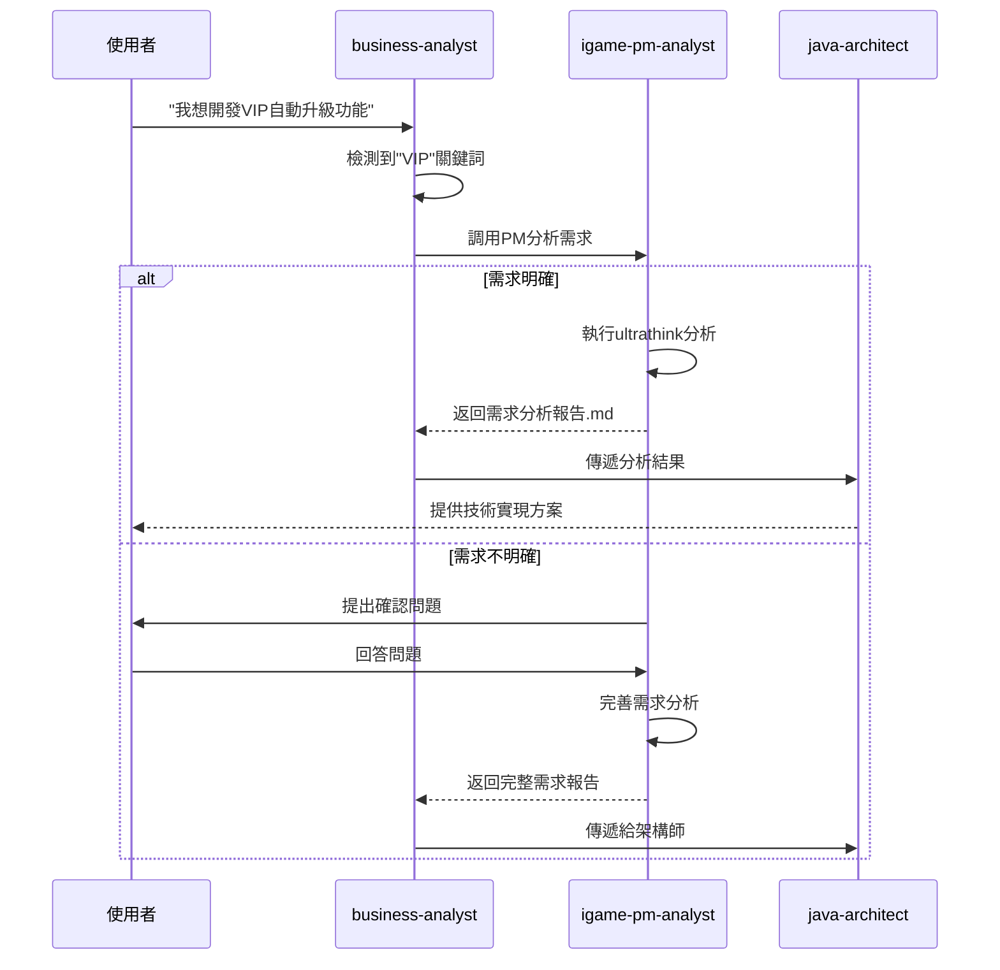

# iGame包網PM分析助手使用指南

## 📋 概述

**igame-pm-analyst** 是專為iGaming包網平台設計的智能產品經理助手，基於第一性原理與SmartAdmin架構提供專業的需求分析與技術方案建議。

### 核心能力

✅ **Ultrathink深度分析**：運用第一性原理拆解需求本質
✅ **JTBD框架應用**：識別用戶真實待辦任務
✅ **偽需求過濾**：反向思考識別無價值需求
✅ **SmartAdmin架構映射**：完美對齊分層架構規範
✅ **iGame風險識別**：資金安全/性能/合規三大風險評估
✅ **繁體中文PRD生成**：標準化需求分析報告
✅ **互動式需求澄清**：智能提問引導需求明確化

---

## 🚀 快速開始

### 方式1：自動觸發（推薦）

當 `business-analyst` 識別到iGame相關關鍵詞時，自動調用PM分析：

```
用戶: "需要開發VIP自動升級功能"
     ↓
business-analyst 識別到"VIP"關鍵詞
     ↓
自動調用 igame-pm-analyst
     ↓
返回完整需求分析報告
```

**觸發關鍵詞**：
- iGame、包網、博弈、遊戲平台
- 錢包、存款、提款、風控
- VIP、優惠、返水、傭金
- 遊戲聚合、供應商、多租戶

### 方式2：命令調用

```bash
# 明確調用PM分析
/pm analyze "需要開發玩家返水計算功能"
```

---

## 📖 使用示例

### 示例1：明確需求場景

**輸入**：
```
需要開發VIP自動升級功能，
根據玩家的存款額和投注額計算等級
```

**PM輸出**（摘要）：
```markdown
# VIP自動升級功能需求分析報告

## 1. Ultrathink深度分析
第一性原理拆解:
- Trust（信任）：自動化計算，透明化邏輯
- Velocity（速度）：<1秒響應，高併發支持
- Friction（摩擦）：零人工，無感知

JTBD分析:
- 玩家：獲得特權、成就感、社交炫耀
-商戶：自動化管理、提升留存率
- 運營：減少人工成本

## 2. 技術方案
SmartAdmin分層設計:
Controller → Service → Manager → Dao

依賴Foundation模組:
- foundation.cache (Redis緩存)
- foundation.mq (Kafka事件)
- foundation.redis-lock (分佈式鎖)

## 3. 風險評估
🔴 併發風險：使用樂觀鎖 + Redis鎖
🟡 性能風險：異步計算 + 緩存優化
🟡 業務風險：寬限期機制 + 審計日誌

## 4. 實施計劃
預估工作量：8人天
關鍵任務：Manager層實現（2天）、測試（2天）
```

完整報告見：[examples/vip-upgrade.md](examples/vip-upgrade.md)

---

### 示例2：需求不明確場景

**輸入**：
```
需要做一個風控功能
```

**PM輸出**：
```markdown
# 需求澄清問題

您的需求"風控功能"範圍較廣，請回答以下問題：

## 1️⃣ 風控目標
請選擇主要防範的風險類型（可多選）：
- [ ] 套利行為（延遲套利、打水）
- [ ] 多帳號關聯
- [ ] 洗錢行為（AML）
- [ ] 異常提款
- [ ] 獎金濫用

## 2️⃣ 觸發時機
- [ ] 註冊時（KYC驗證）
- [ ] 存款時
- [ ] 下注時（即時風控）
- [ ] 提款時
- [ ] 定時批量檢查

## 3️⃣ 處理動作
- [ ] 自動攔截
- [ ] 標記異常（人工審核）
- [ ] 限制額度
- [ ] 凍結帳號

... 更多問題
```

---

## 🎯 輸出物類型

### 1. 需求分析報告（PRD）

**結構**：
```
1. 需求背景（Why）
   - Ultrathink深度分析
   - JTBD分析
   - 成功指標

2. 功能需求（What）
   - 核心流程（Mermaid圖）
   - 業務規則
   - 數據模型（Entity/Form/VO）
   - API接口定義

3. 技術方案（How）
   - SmartAdmin分層設計（代碼示例）
   - Foundation模組依賴
   - 技術棧選型
   - 數據庫設計（DDL）
   - 緩存策略
   - 併發控制策略

4. 風險評估與緩解
   - 資金安全風險 🔴
   - 性能風險 🟡
   - 合規風險 🟡
   - 技術債風險 🟢

5. 實施計劃
   - 任務拆解（X人天）
   - 里程碑
   - 驗收標準

6. 監控與運維
   - 監控指標
   - 日誌規範
   - 回滾預案

附錄：參考文檔、術語表、變更歷史
```

**模板**：[knowledge/prd-template.md](knowledge/prd-template.md)

---

### 2. 需求澄清問題

當需求不明確時，PM會生成精準問題清單：

**問題類型**：
- 業務目標類（解決誰的痛點？預期指標？）
- 技術約束類（併發量？一致性要求？）
- iGame特定類（風控規則？多租戶隔離？KYC等級？）

---

### 3. 風險評估清單

**評估維度**：
- 🔴 資金安全風險（雙式記賬？冪等性？審計？）
- 🟡 性能風險（TPS？延遲？緩存策略？）
- 🟡 合規風險（KYC/AML？GDPR？審計留存？）
- 🟢 技術債風險（架構衝突？維護成本？）

---

## 📚 知識庫

### iGame核心概念

**金融概念**：
- GGR/NGR（總/淨博弈收入）
- 雙式記賬（Double-Entry Ledger）
- 無縫錢包（Seamless Wallet）
- 冪等性（Idempotency）

**風控概念**：
- 套利（Arbitrage）
- 設備指紋（Device Fingerprint）
- 行為分析（Behavioral Analysis）
- KYC/AML合規

**技術架構**：
- OLTP vs OLAP
- HD錢包（分層確定性錢包）
- 冷熱錢包隔離
- Saga模式（分佈式事務）

完整詞典：[knowledge/igame-concepts.yaml](knowledge/igame-concepts.yaml)

---

### 需求模式映射

**自動識別需求類型**：
- 關鍵詞："餘額/存款/提款" → 資金操作（P0關鍵）
- 關鍵詞："VIP/等級" → 玩家體驗（P1重要）
- 關鍵詞："風控/套利" → 風險管理（P1重要）
- 關鍵詞："遊戲/供應商" → 遊戲聚合（P1重要）

**架構決策映射**：
- 涉及資金 → 必須P0-01雙式記賬 + P0-02冪等性
- 需要即時計算 → Flink流處理 + Redis緩存
- 複雜流程 → LiteFlow流程編排
- 定時任務 → Snail-Job調度

完整映射：[knowledge/pattern-mapping.yaml](knowledge/pattern-mapping.yaml)

---

## 🔧 協作流程

### 與business-analyst協作



---

### 與java-architect協作

**分工**：
- **PM（igame-pm-analyst）**：提供 What + Why
  - 需求背景與目標
  - 業務規則與流程
  - 風險評估與優先級
  - SmartAdmin架構建議（分層設計）

- **java-architect**：設計 How（實現細節）
  - 具體代碼實現
  - 性能優化方案
  - 測試策略
  - 部署方案

**交接物**：需求分析報告（PRD.md）

---

## ✅ 質量門檻

### 必須滿足的標準

- [ ] 需求映射到SmartAdmin分層架構（Controller/Service/Manager/Dao）
- [ ] 涉及資金操作必須提及雙式記賬/冪等性
- [ ] 必須評估資金安全/性能/合規三大風險
- [ ] 必須識別依賴的foundation模組
- [ ] 必須提供參考文檔連結（iGame技術規格/SmartAdmin規範）
- [ ] 文檔必須使用**繁體中文**
- [ ] 必須提供實施計劃與驗收標準

### 架構合規驗證

```bash
# 架構規範檢查
./gradlew :sa-admin:test --tests ArchitectureTest

# 代碼質量檢查
./gradlew :sa-admin:pmdMain :sa-admin:spotbugsMain
```

---

## 📊 成功指標

### 定量指標

- ✅ 需求分析準確率：≥ 90%
- ✅ 文檔生成效率：需求→PRD ≤ 5分鐘（vs 人工2小時）
- ✅ 架構合規率：100%（符合SmartAdmin規範）
- ✅ 風險識別率：≥ 95%（資金安全/性能/合規）

### 定性指標

- ✅ 開發團隊理解度：PRD可直接轉化為技術任務
- ✅ 風險提前識別：在開發前發現潛在問題
- ✅ 知識沉澱：形成標準化的iGame需求模式庫

---

## 🔍 常見問題

### Q1: PM分析需要多久？
**A**: 通常 < 5分鐘生成完整PRD（包括ultrathink分析、架構設計、風險評估）

### Q2: 如果需求特別複雜怎麼辦？
**A**: PM會自動識別複雜度，如果需求涉及多個模組或高風險，會：
1. 拆解為多個子需求
2. 標記依賴關係
3. 建議分階段實施

### Q3: 如何確保架構合規？
**A**: PM生成的所有設計都基於SmartAdmin規範：
- 強制分層架構（Controller→Service→Manager→Dao）
- 禁用@Autowired字段注入
- @Transactional僅在Manager層
- 統一ResponseDTO返回格式
- ArchitectureTest驗證

### Q4: 如何處理與現有架構衝突？
**A**: PM會在"技術債風險"章節識別衝突，並提供：
- 衝突點描述
- 重構建議
- 臨時解決方案
- 長期演進路徑

### Q5: 支持哪些語言？
**A**: 目前僅支持**繁體中文**輸出（根據iGame項目需求）

---

## 📖 參考文檔

### iGame項目文檔
- [iGame技術規格索引](../../docs/iGame/index.md)
- [P0關鍵文檔](../../docs/iGame/technical-specs/P0-critical/)
- [P1重要文檔](../../docs/iGame/technical-specs/P1-important/)
- [架構決策ADR](../../docs/iGame/architecture-decisions/)

### SmartAdmin規範
- [CLAUDE.md快速參考](../../CLAUDE.md)
- [SmartAdmin模式](../shared/knowledge/smartadmin-patterns.md)
- [架構規則](../../.agent/rules/10-architecture-rules.md)
- [Foundation模組](../../sa-base/foundation/)

---

## 🛠️ 文件結構

```
.claude/skills/igame-pm-analyst/
├── skill.json              # Skill元數據配置
├── prompt.md               # 核心Prompt模板
├── knowledge/
│   ├── igame-concepts.yaml # iGame概念詞典（金融/風控/技術）
│   ├── pattern-mapping.yaml # 需求模式自動映射
│   └── prd-template.md     # PRD文檔標準模板
├── examples/
│   ├── vip-upgrade.md      # 示例：VIP升級需求
│   ├── risk-control.md     # 示例：風控功能需求（TODO）
│   └── wallet-api.md       # 示例：錢包API需求（TODO）
└── README.md               # 使用指南（本文件）
```

---

## 🚧 未來優化方向

**Phase 2 增強功能**：
- 🔮 集成歷史需求庫（從過去的PRD學習）
- 🔮 自動生成測試用例（基於需求生成JUnit測試）
- 🔮 成本估算（基於複雜度自動評估工作量）
- 🔮 技術債務評估（識別與現有架構的衝突）
- 🔮 多語言支持（簡體中文/英文）

---

## 📞 獲取幫助

### 問題反饋
- 在 `.claude/skills/igame-pm-analyst/` 目錄下創建 issue
- 或聯繫 SmartAdmin 團隊

### 改進建議
歡迎提出改進建議，特別是：
- iGame行業特定的需求模式
- 更多的需求分析範例
- 質量門檻的優化建議

---

## 📜 版本歷史

| 版本 | 日期 | 變更內容 |
|------|------|---------|
| 1.0.0 | 2026-01-23 | 初始版本，完整功能實現 |

---

**最後更新**：2026-01-23
**維護者**：SmartAdmin Team
**License**：內部使用
