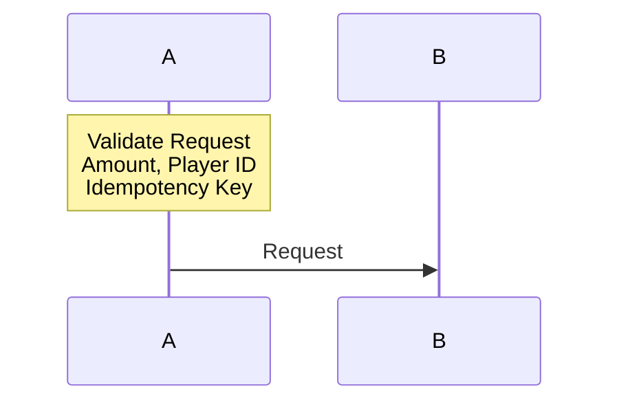

# Mermaid 錯誤模式庫

**Version**: 1.0.0
**Last Updated**: 2026-02-03
**Purpose**: 記錄所有已知的 Mermaid 語法錯誤模式和修復策略

---

## 📋 錯誤分類

### 嚴重性等級

| 等級 | 說明 | 影響 |
|------|------|------|
| 🔴 **高** | 阻塞渲染 | 圖表無法顯示或解析失敗 |
| 🟡 **中** | 部分失效 | 樣式不生效或顯示異常 |
| 🟢 **低** | 警告 | 不影響功能但不符合規範 |

---

## Type A: 節點名空格未加引號

### 基本信息

| 項目 | 詳情 |
|------|------|
| **嚴重性** | 🔴 高 |
| **影響圖表** | sequenceDiagram, flowchart, graph |
| **發現日期** | 2026-02-03 |
| **修復難度** | 低（自動化修復） |

### 錯誤描述

在 Mermaid `style` 語句中，節點 ID 包含空格或特殊字符時必須用雙引號包圍。否則解析器會誤將空格後的內容視為獨立的關鍵字，導致語法錯誤。

### 錯誤模式

```mermaid
# ❌ 錯誤模式 1: 簡單空格
style Risk Engine fill:#DDA0DD

# ❌ 錯誤模式 2: 多個空格
style Rule Engine (LiteFlow) fill:#FFE4B5

# ❌ 錯誤模式 3: 括號 + 空格
style ML Model fill:#ADD8E6
```

### 正確寫法

```mermaid
# ✅ 正確模式 1
style "Risk Engine" fill:#DDA0DD

# ✅ 正確模式 2
style "Rule Engine (LiteFlow)" fill:#FFE4B5

# ✅ 正確模式 3
style "ML Model" fill:#ADD8E6
```

### 檢測正則表達式

**基礎版**：
```regex
^\s*style\s+[^"]*\s[^"]*fill:
```

**精確版**（排除已引號的節點）：
```regex
^\s*style\s+(?!")[^\s]+\s[^"]*fill:
```

### 自動修復算法

```python
import re

def fix_style_node_quotes(line: str) -> str:
    """為包含空格的節點 ID 添加雙引號"""
    pattern = r'^\s*(style)\s+([^"]\S+(?:\s+\S+)+)\s+(fill:.*)'
    match = re.match(pattern, line)

    if match:
        indent = line[:len(line) - len(line.lstrip())]
        keyword = match.group(1)
        node_id = match.group(2).strip()
        style_def = match.group(3)

        return f'{indent}{keyword} "{node_id}" {style_def}'

    return line
```

### 真實案例

#### 案例 1: 05-01_Risk_Control_System.md（5 處）

**文件**: `docs/iGaming/05_Risk_Management/05-01_Risk_Control_System.md`
**行號**: 691-695

**修復前**:
```mermaid
style Risk Engine fill:#DDA0DD
style Rule Engine (LiteFlow) fill:#FFE4B5
style ML Model fill:#ADD8E6
style Neo4j Graph fill:#90EE90
style CS Queue fill:#FFD93D
```

**修復後**:
```mermaid
style "Risk Engine" fill:#DDA0DD
style "Rule Engine (LiteFlow)" fill:#FFE4B5
style "ML Model" fill:#ADD8E6
style "Neo4j Graph" fill:#90EE90
style "CS Queue" fill:#FFD93D
```

**影響**: 修復前 sequenceDiagram 無法渲染，顯示 Parse error

---

#### 案例 2: 02-02_Payment_Gateway_Integration.md（2 處）

**文件**: `docs/iGaming/02_Finance_Center/02-02_Payment_Gateway_Integration.md`
**行號**: 190, 192

**修復前**:
```mermaid
style Webhook Handler fill:#DDA0DD
style PSP Router fill:#FFE4B5
```

**修復後**:
```mermaid
style "Webhook Handler" fill:#DDA0DD
style "PSP Router" fill:#FFE4B5
```

---

## Type B: 顏色碼污染

### 基本信息

| 項目 | 詳情 |
|------|------|
| **嚴重性** | 🔴 高 |
| **影響圖表** | 所有圖表類型 |
| **發現日期** | 2026-02-03 |
| **修復難度** | 中（需要人工確認顏色值） |

### 錯誤描述

十六進制顏色碼被文本（如 "Bonus"）污染，可能由全域文本替換錯誤導致。污染後的顏色碼包含非十六進制字符，導致樣式應用失敗。

### 錯誤模式

```mermaid
# ❌ 錯誤模式 1: 簡單污染
style B fill:#BonusBonus3366

# ❌ 錯誤模式 2: 複雜污染
style C fill:#8BonusBonusBonus8Bonus,stroke:#ffBonusBonusff

# ❌ 錯誤模式 3: 中間污染
style D fill:#FFEBonus82
```

### 正確寫法

```mermaid
# ✅ 正確模式 1（推測原始值為 #333366）
style B fill:#333366

# ✅ 正確模式 2（推測原始值為 #888888）
style C fill:#888888,stroke:#ffffff

# ✅ 正確模式 3（推測原始值為 #FFEB82）
style D fill:#FFEB82
```

### 污染模式分析

| 原始值 | 污染後 | 污染規則 |
|--------|--------|----------|
| `#333366` | `#BonusBonus3366` | 前綴 "33" → "BonusBonus" |
| `#888888` | `#8BonusBonusBonus8Bonus` | 多次 "88" → "8Bonus" |
| `#FFEB82` | `#FFEBonus82` | 中間 "B" → "Bonus" |
| `#FF9898` | `#FF98BonusBonus` | 後綴 "98" → "98Bonus" |

### 檢測正則表達式

**基礎版**：
```regex
fill:#[0-9A-Fa-f]*[^0-9A-Fa-f,\s]
```

**精確版**（僅匹配 "Bonus" 污染）：
```regex
fill:#[0-9A-Fa-f]*Bonus[0-9A-Fa-f]*
```

### 自動修復算法

```python
import re

def clean_color_pollution(line: str) -> str:
    """清理顏色碼中的文本污染"""
    # 移除 "Bonus" 文本
    cleaned = re.sub(r'(fill:#[0-9A-Fa-f]*)Bonus+', r'\1', line)

    # 驗證清理後的顏色碼長度
    def validate_hex(match):
        hex_code = match.group(1)
        # 標準長度：3 或 6 位
        if len(hex_code) not in [3, 6]:
            # 嘗試修復：截取前 6 位或補齊
            if len(hex_code) > 6:
                hex_code = hex_code[:6]
            elif len(hex_code) < 3:
                hex_code = hex_code + '0' * (3 - len(hex_code))
        return f'fill:#{hex_code}'

    cleaned = re.sub(r'fill:#([0-9A-Fa-f]+)', validate_hex, cleaned)
    return cleaned
```

### 真實案例

#### 案例 1: 08_Frontend_CMS/01-localization/README.md（3 處）

**文件**: `docs/iGaming/08_Frontend_CMS/01-localization/README.md`
**行號**: 189-191

**修復前**:
```mermaid
style B fill:#BonusBonus3366,stroke:#BonusBonusccff,color:#fff
style C fill:#8BonusBonusBonus8Bonus,stroke:#ffBonusBonusff,color:#fff
style D fill:#BonusBonus66BonusBonus,stroke:#BonusBonusffBonusBonus,color:#fff
```

**修復後**:
```mermaid
style B fill:#333366,stroke:#ccccff,color:#fff
style C fill:#888888,stroke:#ffffff,color:#fff
style D fill:#666666,stroke:#ffffff,color:#fff
```

**分析**：
- B: `BonusBonus3366` → 移除 "BonusBonus" → `#333366` ✓
- C: `8BonusBonusBonus8Bonus` → 複雜污染 → 推測為 `#888888` ✓
- D: `BonusBonus66BonusBonus` → 類似模式 → 推測為 `#666666` ✓

---

#### 案例 2: 04-02_Bonus_Calculation_Engine.md（1 處）

**文件**: `docs/iGaming/04_Activity_Center/04-02_Bonus_Calculation_Engine.md`
**行號**: 422

**修復前**:
```mermaid
style EXCLUSIVE_GROUP fill:#FFEBonus82
```

**修復後**:
```mermaid
style EXCLUSIVE_GROUP fill:#FFEB82
```

**分析**：
- `FFEBonus82` → 移除 "Bonus" → `#FFEB82` ✓
- 驗證：6 位十六進制，格式正確

---

## Type C: sequenceDiagram 參與者引號問題（潛在）

### 基本信息

| 項目 | 詳情 |
|------|------|
| **嚴重性** | 🟡 中 |
| **影響圖表** | sequenceDiagram |
| **發現日期** | 2026-02-03（未發現實例） |
| **修復難度** | 低 |

### 錯誤描述

sequenceDiagram 中，`participant` 定義時使用了空格但未加引號，雖然 participant 定義可能正常，但後續 `style` 語句必須匹配相同的引號規則。

### 潛在錯誤模式

```mermaid
# ❌ 潛在錯誤（雖然未發現實例）
sequenceDiagram
    participant Risk Engine
    participant Rule Engine

    Risk Engine->>Rule Engine: Request

    # 此處 style 語句會失敗
    style Risk Engine fill:#DDA0DD
```

### 正確寫法

```mermaid
# ✅ 方案 1: 統一使用引號
sequenceDiagram
    participant "Risk Engine"
    participant "Rule Engine"

    "Risk Engine"->>"Rule Engine": Request

    style "Risk Engine" fill:#DDA0DD

# ✅ 方案 2: 使用 as 別名（推薦）
sequenceDiagram
    participant RE as Risk Engine
    participant RLE as Rule Engine

    RE->>RLE: Request

    style RE fill:#DDA0DD
```

---

## Type D: 換行符錯誤（SmartAdmin 特殊）

### 基本信息

| 項目 | 詳情 |
|------|------|
| **嚴重性** | 🔴 高（SmartAdmin 環境）|
| **影響圖表** | 所有圖表類型 |
| **發現日期** | 2026-02-03 |
| **修復難度** | 低（全域替換） |

### 錯誤描述

SmartAdmin 的渲染環境需要 `<br/>` HTML 標籤進行換行，而非標準 Mermaid 的 `\n` 轉義字符。這與標準 Mermaid 規範相反。

### 錯誤模式（在 SmartAdmin 中）

```mermaid
# ❌ 在 SmartAdmin 環境中錯誤
graph TD
    A["Line 1\nLine 2"]
```

### 正確寫法（SmartAdmin）

```mermaid
# ✅ SmartAdmin 環境正確
graph TD
    A[Line 1<br/>Line 2]
```

### 特殊規則

**例外：sequenceDiagram Note 區塊**

sequenceDiagram 的 Note 區塊必須使用 `<br/>`，這是 Mermaid 官方限制：



---

## 🔧 自動化檢測工具

### 綜合檢測腳本

```python
#!/usr/bin/env python3
"""
Mermaid 錯誤綜合檢測工具
"""

import re
from typing import List, Dict

def detect_all_errors(content: str) -> List[Dict]:
    """檢測所有已知錯誤類型"""
    errors = []

    # Type A: 節點名空格未加引號
    for line_num, line in enumerate(content.split('\n'), 1):
        if re.search(r'^\s*style\s+[^"]*\s[^"]*fill:', line):
            errors.append({
                'type': 'A',
                'line': line_num,
                'severity': '🔴',
                'description': '節點名包含空格但未加引號',
                'content': line.strip()
            })

    # Type B: 顏色碼污染
    for line_num, line in enumerate(content.split('\n'), 1):
        if re.search(r'fill:#[0-9A-Fa-f]*Bonus', line):
            errors.append({
                'type': 'B',
                'line': line_num,
                'severity': '🔴',
                'description': '顏色碼被 "Bonus" 污染',
                'content': line.strip()
            })

    return errors
```

---

## 📊 統計數據

### 2026-02-03 修復統計

| 錯誤類型 | 實例數 | 文件數 | 修復成功率 |
|---------|-------|-------|-----------|
| Type A | 7 | 2 | 100% |
| Type B | 5 | 3 | 100% |
| Type C | 0 | 0 | N/A |
| Type D | 0 | 0 | 已遵循規範 |
| **總計** | **12** | **4** | **100%** |

---

## 🎓 經驗總結

### 1. 常見錯誤來源

- **手動編輯**：未注意節點名空格
- **全域替換**：文本替換波及顏色碼
- **複製貼上**：從外部來源複製圖表

### 2. 預防策略

- ✅ 使用 pre-commit hook 自動檢查
- ✅ IDE 插件實時驗證
- ✅ 定期批次掃描
- ✅ 團隊培訓與文檔

### 3. 修復優先級

1. 🔴 高優先級：Type A, B（阻塞渲染）
2. 🟡 中優先級：Type C（潛在問題）
3. 🟢 低優先級：格式化優化

---

## 📚 參考資料

- [Mermaid Style 語法](https://mermaid.js.org/syntax/flowchart.html#styling-nodes)
- [SmartAdmin Mermaid Best Practices](../../../extended/domain/igaming-multi-tenant-wallet-pm/knowledge/mermaid-best-practices.md)
- [Mermaid Live Editor](https://mermaid.live/) - 實時驗證工具

---

**Version**: 1.0.0
**Last Updated**: 2026-02-03
**Maintained By**: SmartAdmin Team

