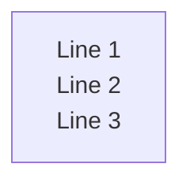
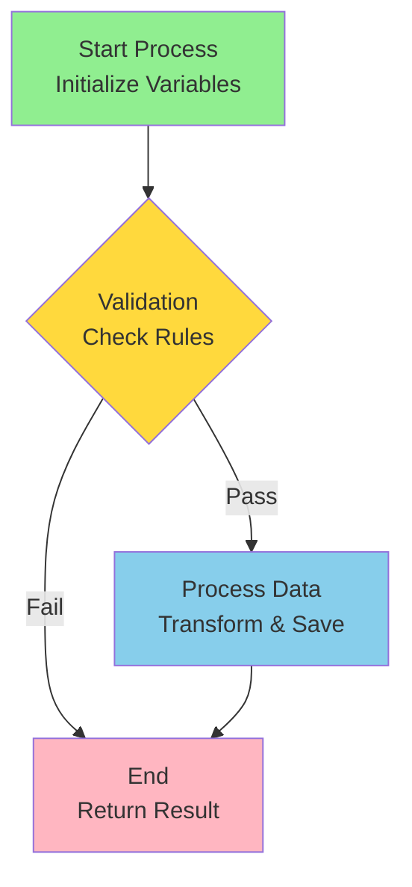
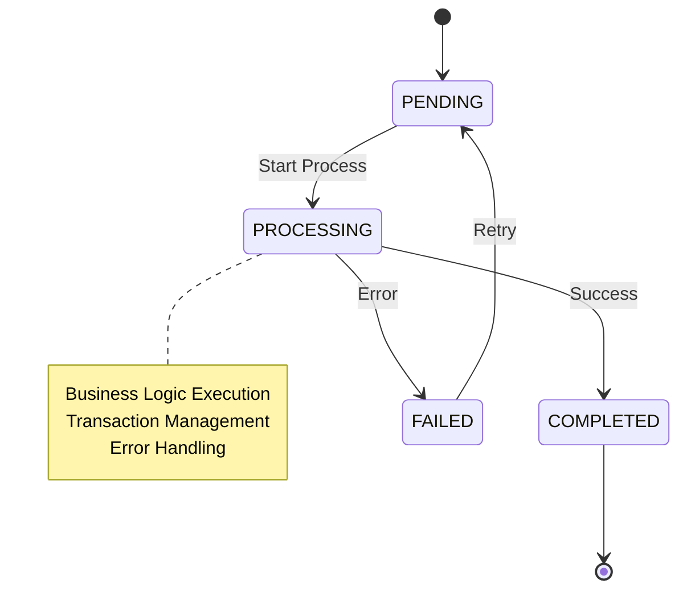
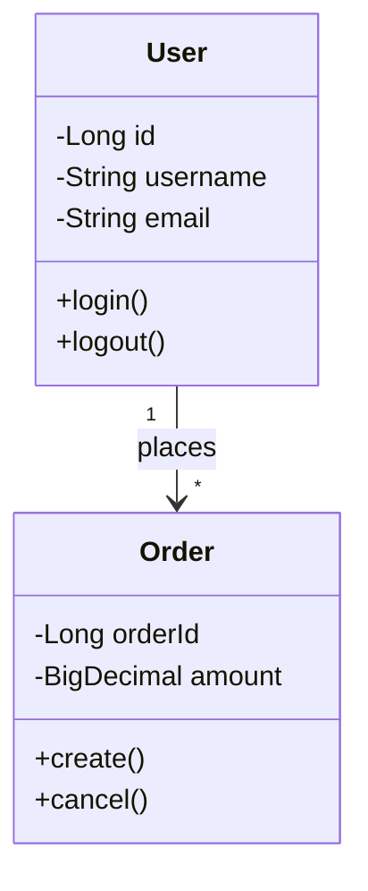
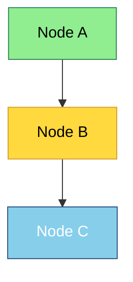
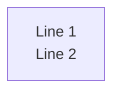
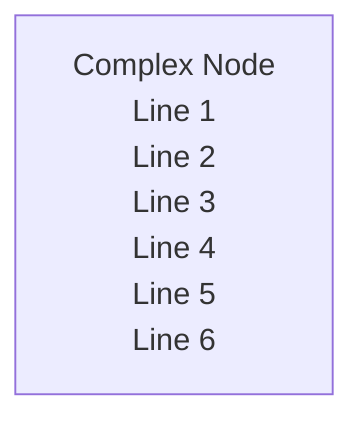
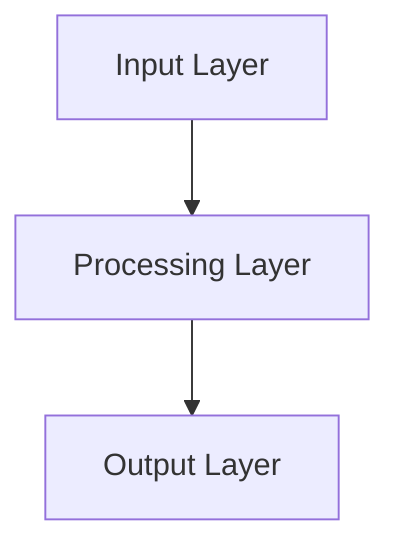

# SmartAdmin Mermaid 規範

**Version**: 1.0.0
**Status**: ✅ Production Ready
**Last Updated**: 2026-02-03

---

## 📋 概述

SmartAdmin 項目使用特殊的 Mermaid 渲染環境，與標準 Mermaid 規範存在差異。本文檔定義 SmartAdmin 的 Mermaid 使用規範。

---

## 🎯 核心差異

### 與標準 Mermaid 的差異對比

| 特性 | 標準 Mermaid | SmartAdmin | 原因 |
|------|-------------|-----------|------|
| **換行符** | `\n` | `<br/>` | 渲染環境限制 |
| **節點引號** | 可選 | 空格必須加引號 | 解析器規則 |
| **Note 區塊** | `\n` | `<br/>` | sequenceDiagram 特殊規則 |
| **Style 語法** | 相同 | 相同 | 標準規範 |

---

## ✅ 必須遵循的規則

### 規則 1: 使用 `<br/>` 進行換行

**❌ 錯誤**（標準 Mermaid 寫法）：


**✅ 正確**（SmartAdmin 寫法）：


**適用範圍**：
- ✅ flowchart / graph 節點標籤
- ✅ sequenceDiagram 箭頭標籤
- ✅ sequenceDiagram Note 區塊
- ✅ stateDiagram 狀態標籤
- ✅ classDiagram 類成員

---

### 規則 2: 節點 ID 包含空格必須加引號

**❌ 錯誤**：
```mermaid
sequenceDiagram
    participant Risk Engine
    participant Rule Engine

    style Risk Engine fill:#DDA0DD
```

**✅ 正確**：
```mermaid
sequenceDiagram
    participant "Risk Engine"
    participant "Rule Engine"

    style "Risk Engine" fill:#DDA0DD
```

**或使用別名（推薦）**：
```mermaid
sequenceDiagram
    participant RE as Risk Engine
    participant RLE as Rule Engine

    style RE fill:#DDA0DD
```

---

### 規則 3: 顏色碼必須為標準十六進制

**❌ 錯誤**：
```mermaid
style A fill:#FFEBonus82
style B fill:#BonusBonus3366
```

**✅ 正確**：
```mermaid
style A fill:#FFEB82
style B fill:#333366
```

**顏色碼格式**：
- 3 位：`#RGB`（如 `#F00`）
- 6 位：`#RRGGBB`（如 `#FF0000`）
- 不支持 8 位（Alpha 通道）

---

## 📊 圖表類型規範

### flowchart / graph

**基本語法**：


**節點形狀支持**：
- `[]` - 矩形
- `()` - 圓角矩形
- `{}` - 菱形（決策）
- `[[]]` - 子程序
- `[()]` - 圓柱（數據庫）
- `[/\]` - 平行四邊形（輸入/輸出）

---

### sequenceDiagram

**基本語法**：
```mermaid
sequenceDiagram
    autonumber

    participant Client as 客戶端
    participant API as API Gateway
    participant Service as Business Service
    participant DB as PostgreSQL

    Client->>API: POST /api/endpoint<br/>(Request Payload)
    Note over API: Validate Request<br/>Auth, Schema, Rate Limit

    API->>Service: processRequest()
    Service->>DB: SELECT ... FOR UPDATE
    Note over DB: Row-Level Lock<br/>SERIALIZABLE

    DB-->>Service: Result Set
    Service->>DB: INSERT/UPDATE
    DB-->>Service: Success

    Service-->>API: Response DTO
    API-->>Client: 200 OK<br/>Success Response

    style API fill:#FFD93D
    style Service fill:#87CEEB
    style DB fill:#90EE90
```

**關鍵要點**：
- ✅ 使用 `participant <alias> as <display-name>` 定義參與者
- ✅ Note 區塊必須使用 `<br/>`
- ✅ 箭頭標籤可使用 `<br/>`
- ✅ style 語句使用別名（如 `style API`）

---

### stateDiagram-v2

**基本語法**：


**關鍵要點**：
- ✅ 狀態名建議使用 UPPER_CASE
- ✅ note 區塊使用 `<br/>`
- ✅ 避免過度複雜的狀態轉換

---

### classDiagram

**基本語法**：


**關鍵要點**：
- ✅ 類成員可使用 `<br/>` 換行（但通常不需要）
- ✅ 關係標籤可使用 `<br/>`

---

## 🎨 樣式規範

### 顏色系統

**SmartAdmin 推薦配色**：

| 用途 | 顏色碼 | 顏色名 | 視覺 |
|------|--------|--------|------|
| 成功/正常 | `#90EE90` | Light Green | 🟢 |
| 警告 | `#FFD93D` | Yellow | 🟡 |
| 信息 | `#87CEEB` | Sky Blue | 🔵 |
| 錯誤/危險 | `#FF6B6B` | Red | 🔴 |
| 主要 | `#4A90E2` | Blue | 🔵 |
| 次要 | `#D3D3D3` | Light Gray | ⚪ |

### Style 語句語法

**基本格式**：
```mermaid
style <node-id> fill:<color>,stroke:<color>,color:<text-color>
```

**示例**：


---

## 🚫 禁止模式

### 1. 不要使用 `\n` 換行

**❌ 錯誤**：


**原因**：SmartAdmin 渲染環境不支持 `\n`

---

### 2. 不要省略空格節點的引號

**❌ 錯誤**：
```mermaid
style Risk Engine fill:#DDA0DD
```

**原因**：解析器會將 "Engine" 誤認為是關鍵字

---

### 3. 不要使用污染的顏色碼

**❌ 錯誤**：
```mermaid
style A fill:#FFEBonus82
```

**原因**：非標準十六進制格式，樣式不生效

---

### 4. 不要過度複雜的節點標籤

**❌ 避免**：


**✅ 推薦**（拆分為多個節點）：


---

## 🔧 最佳實踐

### 1. 節點命名策略

**推薦**：
- ✅ 使用簡短別名：`RE` 代替 "Risk Engine"
- ✅ UPPER_CASE 用於狀態：`PENDING`, `COMPLETED`
- ✅ PascalCase 用於類：`UserService`, `OrderDao`
- ✅ 中文+英文混合：`Client as 客戶端`

---

### 2. 圖表分解

**原則**：單個圖表不超過 15 個節點

**❌ 過度複雜**：
```mermaid
# 包含 30+ 節點的巨型圖表
```

**✅ 分解為子圖**：
```mermaid
# 圖表 1: 整體架構（5 個主要模塊）
# 圖表 2: 模塊 A 詳細流程
# 圖表 3: 模塊 B 詳細流程
```

---

### 3. 使用 subgraph 組織

**推薦**：
```mermaid
flowchart TD
    subgraph "Application Layer"
        A[Controller]
        B[Service]
    end

    subgraph "Data Layer"
        C[Manager]
        D[Dao]
    end

    A --> B --> C --> D
```

---

## 📚 iGaming 業務場景範例

### 範例 1: VIP 升級流程

```mermaid
flowchart TD
    START[Deposit Event<br/>Amount: $5,000<br/>Player ID: 12345]

    FETCH[Fetch Player Data<br/>━━━━━━━━━━━━<br/>Lifetime Deposit: $18,000<br/>Current Tier: Bronze]

    CALCULATE{Calculate New Tier<br/>━━━━━━━━━━━━<br/>Deposit ≥ $20,000?<br/>Bet ≥ $100,000?}

    UPGRADE[Upgrade Tier<br/>Bronze → Silver<br/>Notify Player]

    NO_CHANGE[No Upgrade<br/>Update Lifetime<br/>Deposit Only]

    START --> FETCH --> CALCULATE
    CALCULATE -->|Yes| UPGRADE
    CALCULATE -->|No| NO_CHANGE

    style START fill:#87CEEB
    style FETCH fill:#FFD93D
    style CALCULATE fill:#FF6B6B
    style UPGRADE fill:#90EE90
    style NO_CHANGE fill:#D3D3D3
```

---

### 範例 2: 錢包交易時序圖

```mermaid
sequenceDiagram
    autonumber

    participant Player as 玩家
    participant API as Wallet API
    participant Manager as Transaction Manager
    participant DB as PostgreSQL
    participant Cache as Redis

    Player->>API: POST /wallet/debit<br/>Amount: $100

    Note over API: Validate Request<br/>Player ID, Amount<br/>Idempotency Key

    API->>Manager: debitBalance(playerId, amount)
    Manager->>DB: SELECT ... FOR UPDATE
    Note over DB: Row-Level Lock<br/>SERIALIZABLE Isolation

    Manager->>DB: UPDATE wallet_balance<br/>balance = balance - 100
    Manager->>DB: INSERT transaction_log
    DB-->>Manager: COMMIT

    Manager->>Cache: INVALIDATE wallet:12345
    Manager-->>API: Transaction Success

    API-->>Player: 200 OK<br/>New Balance: $1,900

    style API fill:#FFD93D
    style Manager fill:#87CEEB
    style DB fill:#90EE90
    style Cache fill:#FF6B6B
```

---

## ⚙️ 驗證工具

### 1. Pre-commit Hook 檢查

SmartAdmin 的 `.git/hooks/pre-commit` 會自動檢查：
- ✅ 節點名空格未加引號
- ✅ 顏色碼格式錯誤
- ✅ 使用 `\n` 而非 `<br/>`（待實現）

### 2. Mermaid Live Editor

**使用方式**：
1. 訪問 https://mermaid.live/
2. 粘貼圖表代碼
3. 檢查渲染結果

**注意**：Mermaid Live Editor 支持 `\n`，但 SmartAdmin 環境不支持。

### 3. VSCode 插件

**推薦插件**：
- `Markdown Preview Mermaid Support`
- `Mermaid Editor`

---

## 🎓 常見問題

### Q1: 為什麼 SmartAdmin 不使用標準 `\n`？

**A**: SmartAdmin 使用特定的 Markdown 渲染環境，該環境解析 Mermaid 代碼時僅支持 `<br/>` HTML 標籤。這是環境限制，非項目選擇。

---

### Q2: 如何批量轉換 `\n` 到 `<br/>`？

**A**: 使用項目提供的腳本：
```bash
python scripts/fix_all_mermaid_newlines.py <file_path>
```

---

### Q3: sequenceDiagram Note 為何必須用 `<br/>`？

**A**: 這是 Mermaid 官方規範限制，與 SmartAdmin 環境無關。sequenceDiagram 的 Note 區塊解析邏輯不同，不支持 `\n` 轉義。

---

### Q4: 如何選擇節點別名 vs 完整名稱？

**A**: 推薦策略：
- ✅ 簡單名稱（無空格）：直接使用
- ✅ 複雜名稱（有空格）：使用別名 + as
- ❌ 避免：直接使用帶空格的名稱

---

## 📊 合規性檢查清單

### 圖表提交前檢查

- [ ] 所有換行使用 `<br/>`，無 `\n`
- [ ] 節點名包含空格已加引號
- [ ] 顏色碼為標準十六進制格式
- [ ] 圖表在 Mermaid Live Editor 渲染正常
- [ ] 圖表在 GitHub Markdown 預覽正常
- [ ] Pre-commit hook 通過

---

## 📚 參考資料

### 內部文檔

- [mermaid-best-practices.md](../../../extended/domain/igaming-multi-tenant-wallet-pm/knowledge/mermaid-best-practices.md)
- [CLAUDE.md](../../../../../CLAUDE.md#mermaid-diagram-standards)
- [error-patterns.md](error-patterns.md)

### 外部資源

- [Mermaid 官方文檔](https://mermaid.js.org/)
- [Mermaid Live Editor](https://mermaid.live/)
- [Mermaid GitHub Repository](https://github.com/mermaid-js/mermaid)

---

**Version**: 1.0.0
**Last Updated**: 2026-02-03
**Maintained By**: SmartAdmin Team

