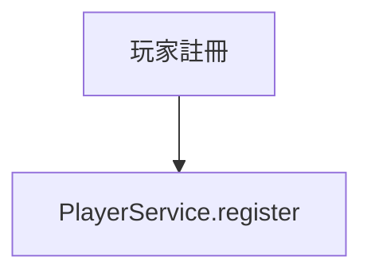

# CLAUDE.md

**For Claude Code**: This documentation is designed for **Claude Code**. Read this as the primary entry point to SmartAdmin development guidelines.

**For Developers**: Quick Reference Card for SmartAdmin development patterns, conventions, and commands.

**Navigation**:
- [README.md](README.md) - Project overview and "I want to..." guide
- [.claude/README.md](.claude/README.md) - AI agent system and orchestration
- [Architecture Documentation](docs/) - High-level system design

---

## Quick Reference Card

| Task | Pattern | Details |
|------|---------|---------|
| Return success | `ResponseDTO.ok(data)` | [→](.claude/shared/knowledge/smartadmin-patterns.md#responsedto-pattern) |
| Paginated query | `SmartPageUtil.convert2PageQuery(form)` | [→](.claude/shared/knowledge/smartadmin-patterns.md#pagination-pattern) |
| Bean copy | `SmartBeanUtil.copy(source, Target.class)` | [→](.claude/shared/knowledge/smartadmin-patterns.md#bean-conversion) |
| Transaction | `@Transactional` in Manager only | [→](.claude/shared/knowledge/smartadmin-patterns.md#transaction-management) |
| Boolean → SMALLINT | `typeHandler=BooleanToSmallintTypeHandler` | [→](.claude/shared/knowledge/smartadmin-patterns.md) |

**Complete Patterns**: [SmartAdmin Patterns](.claude/shared/knowledge/smartadmin-patterns.md)

---

## For AI Coding Assistants

### Reading Priority (AI Assistants)

When working with SmartAdmin codebase, read documentation in this order:

1. **CLAUDE.md** (this file) - Quick reference, key constraints, and navigation hub
2. **[.claude/shared/knowledge/](.claude/shared/knowledge/)** - SmartAdmin implementation patterns
3. **[.claude/skills/](.claude/skills/)** - Specialized skills for complex tasks
4. **[.claude/agents/](.claude/agents/)** - Specialized agent definitions

### Interaction Language

- **Documentation**: All AI instruction documents are in English
- **User Communication**: Respond to users in **Traditional Chinese (繁體中文)**
- **Code Comments**: English (SmartAdmin standard - no Chinese in code comments)

### iGaming Documentation Language Standards

**Effective Date**: 2026-02-11
**Scope**: All documentation under `docs/iGaming/` (Requirements, Architecture, ADR)

#### Language Policy

- **Primary Language**: 繁體中文 (Traditional Chinese)
- **Technical Terms**: Preserve in English (see list below)
- **Code Elements**: All code (Java/SQL/YAML), class names, method names, variable names remain in English
- **First Mention**: Business terms show English in parentheses on first appearance

#### Technical Terms (Preserve in English)

**SmartAdmin Architecture**:
- Controller, Service, Manager, Dao, Repository
- Entity, VO, DTO, Form, QueryForm, UpdateForm
- ResponseDTO, PageResult, Option (Vavr), Try, Either
- @Transactional, @RequiredArgsConstructor, @SaCheckPermission, @Cacheable

**Infrastructure**:
- API, REST, HTTP, HTTPS, JSON, YAML
- Database, PostgreSQL, Redis, Kafka, Multi-Tenant
- Row-Level Security (RLS), Session, Token, JWT, OAuth

**Data Security**:
- AES-256-GCM, HMAC-SHA256, Argon2id
- PII (Personally Identifiable Information)
- Blind Index, Crypto-Shredding, DEK, KEK

**Full Technical Terms List**: [docs/iGaming/TRANSLATION_GLOSSARY.md](docs/iGaming/TRANSLATION_GLOSSARY.md)

#### Business Terms (繁體中文 Translation)

| English | 繁體中文 | First Mention Format |
|---------|---------|---------------------|
| Valid Turnover | 有效投注額 | 有效投注額 (Valid Turnover) |
| Playable Balance | 可下注餘額 | 可下注餘額 (Playable Balance) |
| Self-Exclusion | 自我排除 | 自我排除 (Self-Exclusion) |
| KYC | 身份驗證 | 身份驗證 (KYC, Know Your Customer) |
| AML | 反洗錢 | 反洗錢 (AML, Anti-Money Laundering) |

**Full Business Terms Glossary**: [docs/iGaming/TRANSLATION_GLOSSARY.md](docs/iGaming/TRANSLATION_GLOSSARY.md)

#### Translation Rules

**Rule 1**: Technical terms NEVER translate
✅ `PlayerService` → 保留
❌ `PlayerService` → 玩家服務（錯誤）

**Rule 2**: Business terms use Traditional Chinese + English on first mention
✅ `有效投注額 (Valid Turnover)` → First mention
✅ `有效投注額` → Subsequent mentions

**Rule 3**: Code snippets remain entirely in English
```java
// Code comments may use Traditional Chinese (if project allows)
public class PlayerService {
    private final PlayerDao playerDao;
}
```

**Rule 4**: Mermaid diagrams use Traditional Chinese labels, but preserve class/method names


**Rule 5**: SQL table/column names remain in English, but COMMENT uses Traditional Chinese
```sql
CREATE TABLE t_player (player_id BIGINT);
COMMENT ON COLUMN t_player.player_id IS '玩家唯一標識';
```

#### Translation Templates

- **Requirements**: [docs/iGaming/TEMPLATE_REQUIREMENTS.md](docs/iGaming/TEMPLATE_REQUIREMENTS.md)
- **Architecture**: [docs/iGaming/TEMPLATE_ARCHITECTURE.md](docs/iGaming/TEMPLATE_ARCHITECTURE.md)
- **ADR**: [docs/iGaming/TEMPLATE_ADR.md](docs/iGaming/TEMPLATE_ADR.md)

#### Validation Scripts

```bash
# Verify technical terms remain in English
./scripts/check-technical-terms.sh docs/iGaming/

# Verify Traditional Chinese encoding
./scripts/validate-zh-tw-encoding.sh docs/iGaming/

# Verify terminology consistency
./scripts/check-terminology-consistency-zh-tw.sh docs/iGaming/

# Verify Mermaid syntax
./scripts/validate-mermaid.sh docs/iGaming/
```

#### Related Documentation

- **Translation Glossary**: [docs/iGaming/TRANSLATION_GLOSSARY.md](docs/iGaming/TRANSLATION_GLOSSARY.md) - 500+ term mappings
- **Ralph Loop P14 Rule**: [docs/ralph/guardrails.md](docs/ralph/guardrails.md) - Updated 2026-02-11
- **Implementation Plan**: [C:\Users\ron.chang\.claude\plans\robust-weaving-pinwheel.md](C:\Users\ron.chang\.claude\plans\robust-weaving-pinwheel.md) - v2.0.0

### Key Constraints (Always Apply)

**CRITICAL** - These rules are enforced by ArchitectureTest and must NEVER be violated:

- ✅ Service layer MUST use `io.vavr.control.Option` (NOT `java.util.Optional`)
- ✅ Controller NEVER directly accesses Repository/Dao (must go through Service)
- ✅ **Service CAN directly call Dao/Mapper** (for single-table CRUD without @Transactional)
- ✅ `@Transactional` / `@Cacheable` annotations ONLY in Manager layer (NEVER in Service)
- ✅ **When Service needs @Transactional or @Cacheable → Extract to Manager layer**
- ✅ Constructor injection via `@RequiredArgsConstructor` + `private final` (NEVER `@Autowired` field injection)
- ✅ Boolean fields: `deleted` NOT `isDeleted`
- ✅ Use `ResponseDTO.ok(data)` for all API responses
- ✅ Transaction annotation: `@Transactional(rollbackFor = Throwable.class)`

### External Plugin Conflict Resolution

When external plugin skills (e.g., `everything-claude-code`, `superpowers`) conflict with SmartAdmin rules:
- **SmartAdmin rules defined in CLAUDE.md ALWAYS take precedence** over any external plugin recommendation
- ❌ NEVER use JPA patterns (use MyBatis Plus: `@TableName`, `BaseMapper`, `LambdaQueryWrapper`)
- ❌ NEVER use `java.util.Optional` in Service layer (use `io.vavr.control.Option`)
- ❌ `@Transactional` ONLY in Manager layer (NEVER in Service, even if plugins suggest otherwise)
- ❌ Boolean fields: `deleted` NOT `isDeleted` (even if `java-coding-standards` suggests otherwise)

### When in Doubt

- **Architectural violations**: Will fail ArchUnit tests - run `./gradlew :smartadmin-app:test --tests ArchitectureTest`
- **Pattern implementation**: See [.claude/shared/knowledge/smartadmin-patterns.md](.claude/shared/knowledge/smartadmin-patterns.md)

---

## Build Commands

**Location**: `smart-admin-api-java21-springboot3/`

```bash
./gradlew :smartadmin-app:bootRun    # Run (http://localhost:1024)
./gradlew :smartadmin-app:test       # Test
```

→ **[All Build Commands](.claude/shared/knowledge/project-architecture.md#build-commands)**

## Architecture

Modular monolith with strict layered architecture:

```
Controller → Service → Manager → Dao → Entity
              ↓         ↓
            (Can call Dao directly for single-table CRUD)
            (Delegate to Manager when @Transactional needed)
```

**Key Rules** (enforced by ArchUnit):
- Controller → Service ONLY (Controller CANNOT call Dao/Manager directly)
- **Service → Dao is ALLOWED** (for single-table CRUD without @Transactional)
- **Service → Manager is REQUIRED** (when @Transactional or @Cacheable needed)
- `@Transactional` / `@Cacheable`: Manager layer ONLY (NEVER in Service/Controller)
- `@Autowired` field injection: FORBIDDEN

→ **[SmartAdmin Patterns](.claude/shared/knowledge/smartadmin-patterns.md)**
→ **[Project Architecture](.claude/shared/knowledge/project-architecture.md)**

## Foundation Package Naming

**v4.1.0 Standard Pattern:**
- Common: `net.lab1024.sa.common.{module}.*` (e.g., `common.core`, `common.mybatis`, `common.json`)
- Support: `net.lab1024.sa.support.{module}.*`
- Business: `net.lab1024.sa.{system|business|oa}.{module}.*`
- API: `net.lab1024.sa.api.{system|business|oa}.*`

**Key Classes (v4.1.0 verified):**
- `net.lab1024.sa.common.core.domain.response.ResponseDTO`
- `net.lab1024.sa.common.core.domain.response.PageResult`
- `net.lab1024.sa.common.core.util.SmartBeanUtil`
- `net.lab1024.sa.common.mybatis.util.SmartPageUtil`

→ **[Complete Package Naming Guide](docs/archive/migration/foundation-packages.md)** (archived)
→ **[v4.0.0 Breaking Changes](#v40-breaking-changes)**

## SmartAdmin Patterns

**Core Patterns:**
- [ResponseDTO Pattern](.claude/shared/knowledge/smartadmin-patterns.md#responsedto-pattern) - API responses (ok, error, exceptions)
- [Domain Objects](.claude/shared/knowledge/smartadmin-patterns.md#domain-object-pattern) - Entity, Form, VO, QueryForm
- [Pagination](.claude/shared/knowledge/smartadmin-patterns.md#pagination-pattern) - SmartPageUtil usage
- [Bean Conversion](.claude/shared/knowledge/smartadmin-patterns.md#bean-conversion) - SmartBeanUtil patterns
- [Authentication](.claude/shared/knowledge/smartadmin-patterns.md#authentication-sa-token) - Sa-Token (@NoNeedLogin, @SaCheckPermission)
- [Dependency Injection](.claude/shared/knowledge/smartadmin-patterns.md#dependency-injection) - Constructor injection (MANDATORY)
- [Transaction Management](.claude/shared/knowledge/smartadmin-patterns.md#transaction-management) - Manager layer only

**See**: [Complete SmartAdmin Patterns](.claude/shared/knowledge/smartadmin-patterns.md)

## Key Conventions

**Dependency Injection (MANDATORY):**
- `@RequiredArgsConstructor` + `private final` fields
- NEVER `@Autowired` field injection

**Naming Examples:**
- Classes: `UserController`, `UserService`, `UserManager`, `UserDao`
- Boolean: `deleted` NOT `isDeleted`

**Commit Format:** `<type>(<scope>): <subject>`

→ **[Quality Standards](.claude/shared/knowledge/quality-standards.md)**

## Anti-Patterns to Avoid

**Top 3 Critical:**

| ❌ Never | ✅ Always |
|---------|----------|
| `@Transactional` in Service | Manager layer only |
| Field injection | Constructor injection |
| Controller → Dao | Controller → Service → Dao |

→ **[Complete Anti-Patterns List](.claude/shared/knowledge/quality-standards.md#anti-patterns-to-avoid)**

## Technology Stack

| Component | Version |
|-----------|---------|
| Java | 21 |
| Spring Boot | 3.5.4 |
| MyBatis Plus | 3.5.12 |
| Sa-Token | 1.44.0 |
| Redisson | 3.50.0 |
| Knife4j | 4.6.0 |

**See also**: [Project Architecture](.claude/shared/knowledge/project-architecture.md) for detailed version compatibility and configuration.

## Java 21 Features

SmartAdmin v4.0.0+ leverages Java 21 features for improved type safety and performance:

**Sealed Classes (Type Safety):**
- `ErrorCode` interface uses sealed classes to restrict implementations
- Compiler-enforced exhaustiveness in switch expressions
- Pattern: `sealed interface ErrorCode permits SystemErrorCode, UserErrorCode, UnexpectedErrorCode`

**Virtual Threads (Performance):**
- Enabled for `@Async` and `@Scheduled` tasks
- 30-50% throughput improvement for I/O-intensive operations
- Configuration: `spring.threads.virtual.enabled=true`
- Low memory footprint: ~1KB per virtual thread (vs ~1MB for platform threads)

**Implementation Details:**
- Virtual Threads: [VirtualThreadsConfig.java](smart-admin-api-java21-springboot3/smartadmin-app/src/main/java/net/lab1024/sa/config/VirtualThreadsConfig.java)
- Sealed ErrorCode: [ErrorCode.java](smart-admin-api-java21-springboot3/smartadmin-common/smartadmin-common-core/src/main/java/net/lab1024/sa/common/core/domain/code/ErrorCode.java)

→ **[Complete Java 21 Features Guide](docs/architecture/java21-features.md)**

## Development Guidelines

**Validation**:
```bash
./gradlew :smartadmin-app:test --tests ArchitectureTest
```

→ **[Quality Standards](.claude/shared/knowledge/quality-standards.md)**

### Mermaid Diagram Standards

**CRITICAL RULE**: All Mermaid diagrams in SmartAdmin project must use `<br/>` HTML tags for line breaks, NOT `\n` escape sequences.

**SmartAdmin Environment Requirement**:
- ✅ Use `<br/>` tags: `A[Line 1<br/>Line 2]`
- ❌ Do NOT use `\n`: `A["Line 1\nLine 2"]` (not supported in our rendering environment)

```mermaid
# ❌ 錯誤
graph TD
    A["Line 1\nLine 2"]

# ✅ 正確
graph TD
    A[Line 1<br/>Line 2]
```

**Note**: This differs from standard Mermaid specification, which recommends `\n`. SmartAdmin's rendering environment requires HTML tags.

**⚠️ IMPORTANT EXCEPTION**: stateDiagram-v2 does NOT support `<br/>` tags.

### stateDiagram-v2 Specific Rules

**CRITICAL**: stateDiagram-v2 has different syntax requirements than other Mermaid diagram types.

**❌ Do NOT use HTML line break tags in stateDiagram-v2:**
- ❌ Transition labels with HTML breaks (will fail)
- ❌ Note blocks with HTML breaks (will fail)

**✅ Correct stateDiagram-v2 syntax:**
```mermaid
# ✅ Correct - Simplified transition labels
stateDiagram-v2
    A --> B: Event

# ✅ Correct - Multi-line note blocks
stateDiagram-v2
    note right of A
        Event Triggered
        Action Executed
        Result Achieved
    end note
```

**When to use which approach:**
- **P0/P1 core documents**: Use multi-line note blocks to preserve detailed information
- **P2 supporting documents**: Simplify transition labels for quick fixes

**Automatic fix tools:**
- Detection: `./scripts/detect-statediagram-br.sh docs/iGaming/`
- Fix: `./scripts/batch-fix-statediagram-br.sh --verify`
- Validation: `./scripts/validate-mermaid.sh docs/iGaming/`

**Pre-commit Hook**: Automatically validates Mermaid syntax before commit (detects stateDiagram `<br/>` errors).

→ **[Complete Mermaid Best Practices](.claude/shared/knowledge/mermaid-best-practices.md)** (v1.1.0 - Added stateDiagram error guide)

## Specialized Skills

SmartAdmin 提供兩套並行的技能系統（v4.0.0 優化後）：

### 1. Claude Code 技能系統 (`.claude/skills/`)
**適用對象**：Claude Code CLI 使用者
**技能數量**：15個（P0:7, P1:8）
**詳細說明**：[.claude/skills/README.md](.claude/skills/README.md)

**組織結構**:
```
.claude/skills/
├── foundation/      (P0 - 7 skills: Critical foundation)
│   ├── backend/     (3 skills: ArchUnit, Security, Vavr)
│   ├── frontend/    (1 skill: React CRUD)
│   ├── full-stack/  (2 skills: CRUD Generator, Integration Test)
│   └── testing/     (1 skill: Test Fixture)
└── extended/        (P1 - 9 skills: Domain, Quality)
    ├── domain/      (3 skills: iGaming PM, iGaming Feature Builder, LiteFlow)
    └── quality/     (6 skills: Concurrency, Spring, Naming, Manager Extractor, PostgreSQL, Java21+PG Migration)
```

**P0 Skills (Foundation)** - 7 skills:
- **[archunit-test-generator](.claude/skills/foundation/backend/archunit-test-generator/)** - ArchUnit tests for architecture enforcement
- **[security-hardening-pro](.claude/skills/foundation/backend/security-hardening-pro/)** - SM2/SM3/SM4, data masking, XSS/CSRF
- **[vavr-refactoring-assistant](.claude/skills/foundation/backend/vavr-refactoring-assistant/)** - Vavr Option/Try/Either refactoring
- **[smartadmin-react-crud](.claude/skills/foundation/frontend/smartadmin-react-crud/)** - React 19 CRUD (TypeScript, Ant Design 5)
- **[smartadmin-crud-generator](.claude/skills/foundation/full-stack/smartadmin-crud-generator/)** - Full-stack CRUD (Backend + Frontend + Tests)
- **[smartadmin-integration-test](.claude/skills/foundation/full-stack/smartadmin-integration-test/)** - Testcontainers integration tests
- **[test-fixture-generator](.claude/skills/foundation/testing/test-fixture-generator/)** - Test data builders

**P1 Skills (Extended)** - 9 skills:
- **[igaming-pm-analyst](.claude/skills/extended/domain/igame-pm-analyst/)** - iGaming PM (PRD, multi-tenant, seamless wallet, compliance)
- **[igaming-feature-builder](.claude/skills/extended/domain/igame-feature-builder/)** - iGaming features (VIP, Wallet, Bonus, Fraud detection)
- **[liteflow-rule-builder](.claude/skills/extended/domain/liteflow-rule-builder/)** - LiteFlow DSL for business workflows
- **[concurrency-safety-auditor](.claude/skills/extended/quality/concurrency-safety-auditor/)** - Concurrency audit with risk rating
- **[spring-pattern-checker](.claude/skills/extended/quality/spring-pattern-checker/)** - Spring pattern validation
- **[naming-convention-checker](.claude/skills/extended/quality/naming-convention-checker/)** - SmartAdmin naming validation
- **[smartadmin-manager-extractor](.claude/skills/extended/quality/smartadmin-manager-extractor/)** - Auto-extract @Transactional to Manager (83% time saving)
- **[postgresql-best-practices](.claude/skills/extended/quality/postgresql-best-practices/)** - PostgreSQL performance analysis
- **[java21-postgresql-migration](.claude/skills/extended/quality/java21-postgresql-migration/)** - Java 17→21 + MySQL→PostgreSQL 遷移規範與驗收 checklist

→ **[Complete Skills Catalog](.claude/skills/README.md)**

## Quality Tool Patterns

Common quality tool violations and approved solutions:

### PMD Suppressions
- **CallSuperInConstructor**: Empty constructors (default behavior is acceptable)
- **AvoidReassigningParameters**: Create local variable copy instead
- **ShortClassName**: Use `@SuppressWarnings` for utility inner classes (Dict, Expire)
- **MissingStaticMethodInNonInstantiatableClass**: Constant-only classes are valid

### SpotBugs Exclusions
- **EI_EXPOSE_REP/EI_EXPOSE_REP2**: DTO/VO/Form/Config classes don't need defensive copying
- **NP_NULL_ON_SOME_PATH**: CompletableFuture.getNow(null) and Kafka null keys are valid
- **ST_WRITE_TO_STATIC_FROM_INSTANCE_METHOD**: @PostConstruct static field initialization pattern
- **CT_CONSTRUCTOR_THROW**: Constructor validation pattern is safe for internal classes

Detailed rules: See [quality-standards.md](.claude/shared/knowledge/quality-standards.md)

---

## v4.0.0 → v4.1.0 Breaking Changes

**v4.1.0 Module Restructure**: Migrated from `sa-admin`/`sa-base` to 6-layer modular architecture.

**Key Changes:**
- ❌ OLD: `net.lab1024.sa.admin.module.{system|business|oa}.{module}.*`
- ✅ NEW: `net.lab1024.sa.{system|business|oa}.{module}.*`
- ❌ OLD module path: `sa-admin/src/main/java/`
- ✅ NEW module path: `smartadmin-modules/smartadmin-{system|business|oa}/src/main/java/`
- ❌ OLD build: `./gradlew :sa-admin:test`
- ✅ NEW build: `./gradlew :smartadmin-app:test`
- ℹ️ `ResponseDTO` is at `net.lab1024.sa.common.core.domain.response.ResponseDTO`
- ℹ️ `SmartBeanUtil` remains in `net.lab1024.sa.common.core.util.*`

→ **[Complete Package Migration Guide](docs/archive/migration/foundation-packages.md)** (archived)

---

## Documentation Structure

SmartAdmin 採用分層文檔組織結構，確保當前文檔和歷史資料清晰分離。

### 📁 Active Documentation (當前有效文檔)

```
docs/
├── migration/              # 遷移指南（當前有效）
│   └── foundation-packages.md  # v4.0.0 包命名遷移
├── testing/                # 測試文檔（當前有效）
│   ├── testing-strategy.md
│   ├── integration-testing-quick-reference.md
│   └── architecture/
├── plans/                  # 技術計畫（當前活躍）
│   ├── job/               # Snail-Job 排程計畫
│   ├── liteflow/          # LiteFlow 規則引擎計畫
│   ├── minio/             # MinIO 對象存儲計畫
│   └── tenant/            # 多租戶計畫
├── iGame/                  # iGaming 業務模塊
│   ├── architecture-decisions/  # ADR 記錄
│   └── technical-specs/         # 技術規格
└── audit/                  # 審計歷史追蹤
    └── AUDIT_HISTORY.md    # 架構審計記錄
```

### 🗄️ Archived Documentation (已歸檔文檔)

```
docs/archive/
├── INDEX.md                # 歸檔總索引
├── 2026-01-audit/          # 2026-01 架構審計報告
│   ├── README.md           # 審計報告版本說明
│   ├── ARCHITECTURE-AUDIT-REPORT.md (v1.0.0)
│   ├── ARCHITECTURE-AUDIT-REPORT-CORRECTED.md (v1.1.0)
│   └── ARCHITECTURE-AUDIT-SUCCESS-REPORT.md (v2.0.0)
├── legacy-kafka-v1/        # Kafka v1 文檔（46 個文件）
│   ├── INDEX.md
│   └── kafka/              # 架構、指南、範例、測試等
├── legacy-planning/        # 舊計劃文檔（11 個文件）
│   ├── INDEX.md
│   ├── FEASIBILITY-ANALYSIS-CORRECTION.md
│   ├── IMPLEMENTATION_PROGRESS.md
│   └── ...
├── evrete/                 # Evrete 規則引擎（已替換）
├── migration/              # 舊遷移報告（已完成）
└── testing/                # 舊測試文檔（已更新）
```

### 📝 Documentation Principles

**歸檔原則**：
- ✅ 已完成的階段性報告（審計、遷移等）
- ✅ 被新版本替代的技術文檔
- ✅ 已實施完成的計劃文檔
- ✅ 保留完整 Git 歷史用於追溯

**查找文檔**：
- **當前開發**：直接查看 `docs/` 對應子目錄
- **歷史追溯**：參考 [docs/archive/INDEX.md](docs/archive/INDEX.md)
- **審計記錄**：查看 [docs/audit/AUDIT_HISTORY.md](docs/audit/AUDIT_HISTORY.md)

→ **[Complete Archive Index](docs/archive/INDEX.md)** - 所有歸檔文檔的完整導航

---

## Documentation System Version

| Component | Version | Status | Metadata |
|-----------|---------|--------|----------|
| **This Document** | 3.5.0 | ✅ v4.1.0 Module Structure Sync | - |
| **AI Doc System** | 3.0.2 | ✅ Optimized | [.claude/META.md](.claude/META.md) |
| **.claude/** | 3.0.2 | ✅ Optimized | [.claude/README.md](.claude/README.md) |
| **SmartAdmin** | v4.1.0 | ✅ Production | - |

**System Metadata**: [.claude/META.md](.claude/META.md) - Unified version tracking and content ownership

**Last Updated**: 2026-02-07

**Change History**:
- 3.6.0 (2026-02-07): Skill system optimization - P0 frontmatter fix (spring-pattern-checker), P1 naming-convention-checker + 3 .agent/ config.yml, P2 8 shorthand aliases, Mermaid Type F (stateDiagram exception), version sync across all documentation files
- 3.5.0 (2026-02-05): v4.1.0 documentation sync - Updated all ~159 documentation files (.claude/, .agent/) to reflect new 6-layer modular architecture (sa-admin/sa-base → smartadmin-common/smartadmin-support/smartadmin-modules/smartadmin-api/smartadmin-starter/smartadmin-app). Updated build commands, package names, commit scopes, CRUD generator paths, ArchUnit test references.
- 3.4.0 (2026-01-31): Java 21 features documentation - Added dedicated Java 21 section covering Sealed Classes and Virtual Threads implementations, Phase 4 Manager layer testing completion (100% coverage, 8 test classes, 92 test cases)
- 3.3.0 (2026-01-27): Documentation structure update - Added "Documentation Structure" section with active/archived documentation organization, updated archive navigation with INDEX.md references
- 3.2.0 (2026-01-27): P1 improvements - Enhanced reading priority guidance with decision-making note, clarified code comment language standard, expanded skills catalog from 6 to 15 (P0: 6, P1: 3, P2: 6)
- 3.1.0 (2026-01-27): P0 critical fixes - Version synchronization (.agent/ v1.0.0 production release), fixed broken migration links
- 3.0.0 (2026-01-24): Content deduplication, universal AI support, unified version management
- 2.0.0 (2026-01-23): v4.0.0 breaking changes, foundation package documentation
- 1.0.0 (2026-01-22): Initial versioned release
