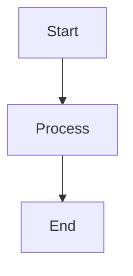
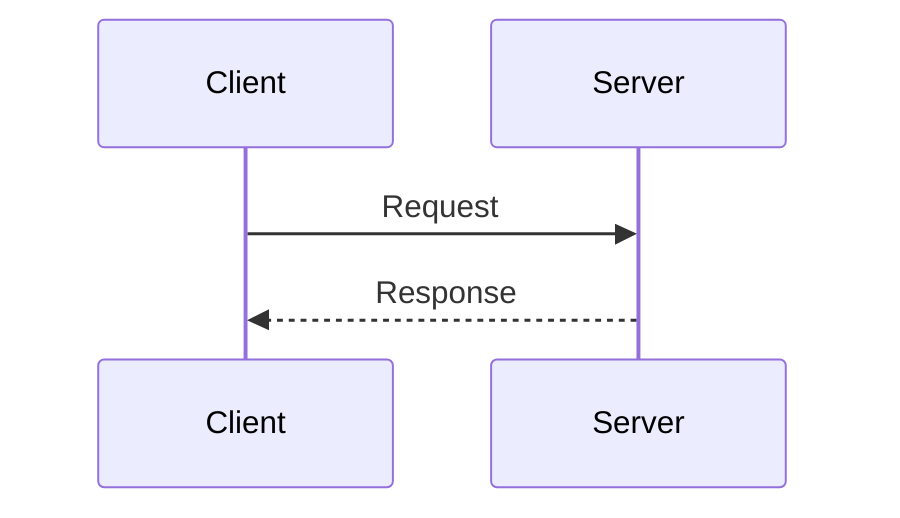
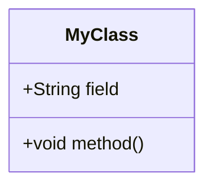

# Documentation Developer Guide

Quick reference for developers working on the SmartAdmin documentation.

## Quick Start

### Local Development

```bash
cd docs
npm install
npm run dev
```

Visit `http://localhost:5173`

### Production Build

```bash
npm run build
npm run preview
```

### Docker

```bash
# Build
docker build -t smart-admin-docs:latest .

# Run
docker run -d -p 8081:80 smart-admin-docs:latest

# Via Docker Compose
cd ../docker
docker compose up -d docs
```

---

## File Structure

```
docs/
├── .vitepress/
│   ├── config.ts           # Site configuration, navigation
│   ├── theme/
│   │   ├── index.ts        # Theme customization
│   │   └── custom.css      # Custom styles
│   └── public/             # Static assets (images, etc.)
│
├── kafka/                  # Kafka documentation
│   ├── index.md            # Kafka homepage
│   ├── getting-started/    # Quick start guides
│   ├── architecture/       # Architecture docs
│   ├── guides/             # User guides
│   ├── operations/         # Ops & deployment
│   ├── troubleshooting/    # Debugging guides
│   ├── advanced/           # Advanced topics
│   ├── examples/           # Code examples
│   ├── testing/            # Testing guides
│   ├── reference/          # API & config reference
│   └── appendix/           # Glossary, changelog, etc.
│
└── index.md                # Documentation homepage
```

---

## Writing Documentation

### Markdown Basics

```markdown
# H1 Title
## H2 Section
### H3 Subsection

**Bold text**
*Italic text*

- Bullet list
1. Numbered list

[Link text](./path/to/file.md)

```

### Code Blocks

````markdown
```java
@RestController
public class ExampleController {
    // Java code
}
```

```yaml
# YAML configuration
spring:
  kafka:
    bootstrap-servers: localhost:9092
```

```bash
# Shell commands
docker compose up -d
```
````

### Admonitions (Tips, Warnings, etc.)

```markdown
::: tip
This is a helpful tip
:::

::: warning
This is a warning
:::

::: danger
This is a danger notice
:::

::: info
This is info
:::
```

### Mermaid Diagrams

````markdown





````

### Tables

```markdown
| Column 1 | Column 2 | Column 3 |
|----------|----------|----------|
| Data 1   | Data 2   | Data 3   |
| Data 4   | Data 5   | Data 6   |
```

---

## Navigation Configuration

Edit `.vitepress/config.ts`:

### Top Navigation

```typescript
nav: [
  { text: 'Home', link: '/' },
  { text: 'Kafka', link: '/kafka/' },
  { text: 'Guide', link: '/guide/' }
]
```

### Sidebar

```typescript
sidebar: {
  '/kafka/': [
    {
      text: 'Getting Started',
      collapsed: false,
      items: [
        { text: 'Quick Start', link: '/kafka/getting-started/quick-start' },
        { text: 'Tutorial', link: '/kafka/getting-started/tutorial' }
      ]
    }
  ]
}
```

---

## Best Practices

### 1. File Organization

- Group related docs in directories
- Use clear, descriptive filenames
- Follow naming convention: `kebab-case.md`

### 2. Document Structure

Every document should have:

```markdown
# Title

Brief introduction paragraph.

## Section 1

Content...

## Section 2

Content...

## See Also

- [Related Doc 1](./link1.md)
- [Related Doc 2](./link2.md)
```

### 3. Code Examples

- ✅ All code must be tested and runnable
- ✅ Include necessary imports
- ✅ Add comments for complex logic
- ✅ Show both usage and output

### 4. Links

- **Internal links**: Use relative paths
  ```markdown
  [Link text](./other-doc.md)
  [Link to section](./doc.md#section-heading)
  ```

- **External links**: Use full URLs
  ```markdown
  [Kafka Docs](https://kafka.apache.org/documentation/)
  ```

### 5. Images

- Store in `.vitepress/public/images/`
- Use descriptive filenames
- Add alt text for accessibility

```markdown

```

---

## Common Tasks

### Add a New Page

1. Create markdown file in appropriate directory
2. Add to sidebar in `.vitepress/config.ts`
3. Add cross-references from related pages

### Add a New Section

1. Create directory structure
2. Add `index.md` for section homepage
3. Update main navigation
4. Create individual pages
5. Add to sidebar configuration

### Update Styling

Edit `.vitepress/theme/custom.css`:

```css
:root {
  --vp-c-brand-1: #3c8772;  /* Primary color */
}

.custom-class {
  /* Custom styles */
}
```

### Add Custom Component

1. Create Vue component in `.vitepress/theme/components/`
2. Register in `.vitepress/theme/index.ts`
3. Use in markdown:

```markdown
<MyComponent prop="value" />
```

---

## Deployment

### Build for Production

```bash
npm run build
# Output: .vitepress/dist/
```

### Deploy to Docker

```bash
# Build image
docker build -t smart-admin-docs:latest .

# Push to registry (if needed)
docker tag smart-admin-docs:latest registry.example.com/smart-admin-docs:latest
docker push registry.example.com/smart-admin-docs:latest
```

### Deploy to Nginx

```bash
# Copy built files
cp -r .vitepress/dist/* /var/www/html/docs/

# Nginx configuration
location /docs/ {
    alias /var/www/html/docs/;
    try_files $uri $uri/ $uri.html /docs/index.html;
}
```

---

## Troubleshooting

### Build Errors

```bash
# Clear cache
rm -rf .vitepress/cache/ .vitepress/dist/ node_modules/

# Reinstall
npm install

# Rebuild
npm run build
```

### Broken Links

```bash
# Check for broken links (manual check)
npm run build
# Review build output for warnings
```

### Mermaid Diagrams Not Rendering

- Check syntax at https://mermaid.live/
- Ensure plugin is installed: `vitepress-plugin-mermaid`
- Verify config includes `withMermaid()`

---

## Quality Checklist

Before committing documentation:

- [ ] All code examples tested
- [ ] All links verified (no 404s)
- [ ] Proper heading hierarchy (no skipped levels)
- [ ] Mermaid diagrams render correctly
- [ ] Images have alt text
- [ ] Spelling and grammar checked
- [ ] Consistent formatting
- [ ] Related docs cross-referenced
- [ ] "See Also" section included
- [ ] Local build successful

---

## Resources

### VitePress

- [Official Docs](https://vitepress.dev/)
- [Markdown Extensions](https://vitepress.dev/guide/markdown)
- [Theme Config](https://vitepress.dev/reference/default-theme-config)

### Mermaid

- [Live Editor](https://mermaid.live/)
- [Documentation](https://mermaid.js.org/)
- [Syntax Reference](https://mermaid.js.org/intro/syntax-reference.html)

### Markdown

- [GitHub Flavored Markdown](https://github.github.com/gfm/)
- [CommonMark Spec](https://commonmark.org/)

---

## Getting Help

- **Documentation Issues**: Create issue on GitHub
- **Questions**: Check existing docs or ask team
- **Build Problems**: See troubleshooting section above

---

**Last Updated**: 2026-01-21
