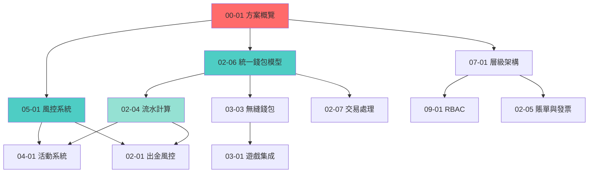

# IGaming需求框架 - 文檔導航地圖

> **版本**: 1.0.0
> **最後更新**: 2026-01-27
> **維護者**: Architecture Team

---

## 📋 目錄

- [快速導航](#快速導航)
  - [按角色導航](#按角色導航)
  - [按業務流程導航](#按業務流程導航)
  - [按優先級閱讀](#按優先級閱讀)
- [文檔編號規範](#文檔編號規範)
- [核心概念依賴圖](#核心概念依賴圖)
- [完整文檔清單](#完整文檔清單)
- [變更日誌](#變更日誌)

---

## 🗺️ 快速導航

### 按角色導航

#### 產品經理
**建議閱讀路徑**：
1. [00-01 方案概覽](./00-01_Solution_Overview.md) - 了解整體架構
2. [00-02 行業術語](./00-02_Industry_Terminology.md) - 掌握行業術語
3. [01-01 玩家賬戶系統](../01_Player_Center/01-01_Player_Account_System.md) - 玩家管理
4. [04-01 活動系統設計](../04_Activity_Center/04-01_Activity_System_Design.md) - 活動規則
5. [06-01 代理系統設計](../06_Agent_Center/06-01_Affiliate_System_Design.md) - 代理架構

#### 架構師
**建議閱讀路徑**：
1. [00-01 方案概覽](./00-01_Solution_Overview.md) - 整體架構
2. [07-01 層級架構](../07_Platform_Management/07-01_Hierarchy_Architecture.md) - 多租戶架構
3. [02-06 統一錢包模型](../02_Finance_Center/02-06_Unified_Wallet_Model.md) - 核心錢包設計
4. [05-01 風控系統](../05_Risk_Management/05-01_Risk_Control_System.md) - 風控架構
5. [12-03 網關架構](../12_Technical_Operations/12-03_Gateway_Architecture.md) - API網關設計
6. [07-04 數據管道架構](../07_Platform_Management/07-04_Data_Pipeline_Architecture.md) - 數據架構

#### 後端開發工程師
**建議閱讀路徑**：

**財務中心開發**：
1. [02-06 統一錢包模型](../02_Finance_Center/02-06_Unified_Wallet_Model.md) - 錢包核心邏輯
2. [02-07 交易處理流程](../02_Finance_Center/02-07_Transaction_Processing_Flow.md) - 事件驅動架構
3. [02-01 出金風控](../02_Finance_Center/02-01_Withdrawal_Risk_Control.md) - 出金流程
4. [02-04 流水計算與對賬](../02_Finance_Center/02-04_Turnover_and_Game_Reconciliation_Analysis.md) - 流水算法

**遊戲集成開發**：
1. [03-01 遊戲集成標準](../03_Game_Center/03-01_Game_Integration_Standard.md) - API規格
2. [03-03 無縫錢包對接分析](../03_Game_Center/03-03_Seamless_Wallet_Analysis.md) - 特殊場景處理
3. [02-04 流水計算與對賬](../02_Finance_Center/02-04_Turnover_and_Game_Reconciliation_Analysis.md) - 遊戲對賬

**風控開發**：
1. [05-01 風控系統](../05_Risk_Management/05-01_Risk_Control_System.md) - 規則引擎
2. [02-01 出金風控](../02_Finance_Center/02-01_Withdrawal_Risk_Control.md) - 出金風控規則
3. [04-01 活動系統設計](../04_Activity_Center/04-01_Activity_System_Design.md) - 活動風控

#### 前端開發工程師
**建議閱讀路徑**：
1. [08-01 前端佈局引擎](../08_Frontend_CMS/08-01_Frontend_Layout_Engine.md) - Layout設計
2. [08-05 多語言系統](../08_Frontend_CMS/08-05_Localization_System.md) - i18n架構
3. [08-03 SEO與性能](../08_Frontend_CMS/08-03_SEO_&_Performance.md) - 性能優化
4. [08-04 移動應用架構](../08_Frontend_CMS/08-04_Mobile_App_Architecture.md) - 移動端

#### 測試工程師
**建議閱讀路徑**：
1. [12-02 QA測試標準](../12_Technical_Operations/12-02_QA_Testing_Standard.md) - 測試規範
2. [02-06 統一錢包模型](../02_Finance_Center/02-06_Unified_Wallet_Model.md) - 核心業務邏輯
3. [05-01 風控系統](../05_Risk_Management/05-01_Risk_Control_System.md) - 風控測試場景
4. [03-03 無縫錢包對接分析](../03_Game_Center/03-03_Seamless_Wallet_Analysis.md) - 極端場景測試

#### 運維工程師
**建議閱讀路徑**：
1. [12-01 部署架構](../12_Technical_Operations/12-01_Deployment_Architecture.md) - CI/CD流程
2. [12-03 網關架構](../12_Technical_Operations/12-03_Gateway_Architecture.md) - 流量控制
3. [12-04 維護程序](../12_Technical_Operations/12-04_Maintenance_Procedure.md) - 維護SOP
4. [09-03 數據安全標準](../09_System_Security/09-03_Data_Security_Standard.md) - 安全運維

#### 信息安全工程師
**建議閱讀路徑**：
1. [09-03 數據安全標準](../09_System_Security/09-03_Data_Security_Standard.md) - 加密與盲索引
2. [09-01 管理後台RBAC](../09_System_Security/09-01_Admin_RBAC.md) - 權限管理
3. [09-02 審計日誌與審批](../09_System_Security/09-02_Audit_Log_&_Approval.md) - 審計合規
4. [05-01 風控系統](../05_Risk_Management/05-01_Risk_Control_System.md) - 反欺詐

---

### 按業務流程導航

#### 🎮 玩家註冊流程
```
[01-01 玩家賬戶系統]
    → 註冊 & KYC驗證
[09-01 管理後台RBAC]
    → 權限初始化
[02-06 統一錢包模型]
    → 創建錢包
[09-02 審計日誌與審批]
    → 記錄註冊日誌
```

**相關文檔**：
- [01-01 玩家賬戶系統](../01_Player_Center/01-01_Player_Account_System.md) - 註冊邏輯、KYC、MFA
- [09-01 管理後台RBAC](../09_System_Security/09-01_Admin_RBAC.md) - 玩家權限
- [02-06 統一錢包模型](../02_Finance_Center/02-06_Unified_Wallet_Model.md) - 錢包初始化
- [09-02 審計日誌與審批](../09_System_Security/09-02_Audit_Log_&_Approval.md) - 日誌記錄

---

#### 💰 存款流程
```
[02-02 支付網關集成]
    → PSP支付請求
[02-07 交易處理流程]
    → 交易事件處理
[02-06 統一錢包模型]
    → 錢包入賬 (Cash餘額)
[09-02 審計日誌與審批]
    → 記錄交易日誌
[04-01 活動系統設計]
    → 觸發存送紅利（如有）
```

**相關文檔**：
- [02-02 支付網關集成](../02_Finance_Center/02-02_Payment_Gateway_Integration.md) - 支付通道
- [02-07 交易處理流程](../02_Finance_Center/02-07_Transaction_Processing_Flow.md) - Kafka事件
- [02-06 統一錢包模型](../02_Finance_Center/02-06_Unified_Wallet_Model.md) - 餘額更新
- [04-01 活動系統設計](../04_Activity_Center/04-01_Activity_System_Design.md) - 紅利發放

---

#### 🎲 遊戲流程
```
[03-01 遊戲集成標準]
    → GP API調用
[03-03 無縫錢包對接分析]
    → 下注扣款 / 結算入賬
[02-06 統一錢包模型]
    → 更新可下注餘額
[02-04 流水計算與對賬]
    → 計算有效流水
[05-01 風控系統]
    → 異常流水檢測（對沖/套利）
```

**相關文檔**：
- [03-01 遊戲集成標準](../03_Game_Center/03-01_Game_Integration_Standard.md) - API規格
- [03-03 無縫錢包對接分析](../03_Game_Center/03-03_Seamless_Wallet_Analysis.md) - 極端場景
- [02-06 統一錢包模型](../02_Finance_Center/02-06_Unified_Wallet_Model.md) - 錢包邏輯
- [02-04 流水計算與對賬](../02_Finance_Center/02-04_Turnover_and_Game_Reconciliation_Analysis.md) - 流水算法
- [05-01 風控系統](../05_Risk_Management/05-01_Risk_Control_System.md) - 風控檢測

---

#### 💸 提款流程
```
[02-01 出金風控]
    → 多層審核（L1/L2/L3）
[05-01 風控系統]
    → 風控規則檢測
[09-02 審計日誌與審批]
    → Maker-Checker審批
[02-02 支付網關集成]
    → PSP代付執行
[02-06 統一錢包模型]
    → 錢包扣款
[02-03 對賬系統]
    → 三方對賬
```

**相關文檔**：
- [02-01 出金風控](../02_Finance_Center/02-01_Withdrawal_Risk_Control.md) - 審核流程
- [05-01 風控系統](../05_Risk_Management/05-01_Risk_Control_System.md) - 風控引擎
- [09-02 審計日誌與審批](../09_System_Security/09-02_Audit_Log_&_Approval.md) - 審批工作流
- [02-02 支付網關集成](../02_Finance_Center/02-02_Payment_Gateway_Integration.md) - 代付
- [02-06 統一錢包模型](../02_Finance_Center/02-06_Unified_Wallet_Model.md) - 餘額扣減
- [02-03 對賬系統](../02_Finance_Center/02-03_Reconciliation_System.md) - 對賬

---

#### 🎁 活動領取流程
```
[04-01 活動系統設計]
    → 檢查領取條件
[02-04 流水計算與對賬]
    → 驗證流水是否達標
[02-06 統一錢包模型]
    → 發放紅利（Bonus餘額）
[05-01 風控系統]
    → 紅利濫用檢測
```

**相關文檔**：
- [04-01 活動系統設計](../04_Activity_Center/04-01_Activity_System_Design.md) - 活動規則
- [02-04 流水計算與對賬](../02_Finance_Center/02-04_Turnover_and_Game_Reconciliation_Analysis.md) - 流水驗證
- [02-06 統一錢包模型](../02_Finance_Center/02-06_Unified_Wallet_Model.md) - 紅利發放
- [05-01 風控系統](../05_Risk_Management/05-01_Risk_Control_System.md) - 濫用防護

---

#### 👥 代理佣金結算流程
```
[06-01 代理系統設計]
    → 計算佣金
[02-04 流水計算與對賬]
    → 下級有效流水彙總
[06-02 信用網絡邏輯]
    → 處理信用額度結算
[02-05 賬單與發票]
    → 生成佣金賬單
```

**相關文檔**：
- [06-01 代理系統設計](../06_Agent_Center/06-01_Affiliate_System_Design.md) - 佣金算法
- [02-04 流水計算與對賬](../02_Finance_Center/02-04_Turnover_and_Game_Reconciliation_Analysis.md) - 流水數據
- [06-02 信用網絡邏輯](../06_Agent_Center/06-02_Credit_Network_Logic.md) - 信用結算
- [02-05 賬單與發票](../02_Finance_Center/02-05_Billing_&_Invoicing.md) - 賬單生成

---

### 按優先級閱讀

#### 🔴 P0 - 必讀文檔（理解整體架構）

1. **[00-01 方案概覽](./00-01_Solution_Overview.md)**
   全局架構、技術選型、市場分析

2. **[00-02 行業術語](./00-02_Industry_Terminology.md)**
   200+行業術語標準化定義

3. **[02-06 統一錢包模型](../02_Finance_Center/02-06_Unified_Wallet_Model.md)**
   核心錢包邏輯、可下注餘額公式

4. **[05-01 風控系統](../05_Risk_Management/05-01_Risk_Control_System.md)**
   平台級風控引擎、規則引擎架構

5. **[09-01 管理後台RBAC](../09_System_Security/09-01_Admin_RBAC.md)**
   權限管理、多租戶隔離

---

#### 🟠 P1 - 核心業務文檔（理解業務邏輯）

6. **[01-01 玩家賬戶系統](../01_Player_Center/01-01_Player_Account_System.md)**
   註冊、KYC、MFA

7. **[02-01 出金風控](../02_Finance_Center/02-01_Withdrawal_Risk_Control.md)**
   多層審核、SAGA事務、多地區合規

8. **[02-04 流水計算與對賬](../02_Finance_Center/02-04_Turnover_and_Game_Reconciliation_Analysis.md)**
   三層驗證架構、流水算法

9. **[03-01 遊戲集成標準](../03_Game_Center/03-01_Game_Integration_Standard.md)**
   GP API規格、安全設計

10. **[04-01 活動系統設計](../04_Activity_Center/04-01_Activity_System_Design.md)**
    紅利系統、流水要求

---

#### 🟡 P2 - 專項技術文檔（深入實現細節）

11. **[02-07 交易處理流程](../02_Finance_Center/02-07_Transaction_Processing_Flow.md)**
    事件驅動、Outbox Pattern

12. **[03-03 無縫錢包對接分析](../03_Game_Center/03-03_Seamless_Wallet_Analysis.md)**
    GP對接極端場景

13. **[07-01 層級架構](../07_Platform_Management/07-01_Hierarchy_Architecture.md)**
    四層多租戶架構

14. **[09-02 審計日誌與審批](../09_System_Security/09-02_Audit_Log_&_Approval.md)**
    Elasticsearch審計、Maker-Checker

15. **[09-03 數據安全標準](../09_System_Security/09-03_Data_Security_Standard.md)**
    加密、盲索引、GDPR Crypto-Shredding

16. **[12-01 部署架構](../12_Technical_Operations/12-01_Deployment_Architecture.md)**
    Blue-Green、Canary、回滾流程

17. **[12-03 網關架構](../12_Technical_Operations/12-03_Gateway_Architecture.md)**
    限流、熔斷、DDoS防護

---

#### 🟢 P3 - 支撐系統文檔（可選閱讀）

18. **[02-02 支付網關集成](../02_Finance_Center/02-02_Payment_Gateway_Integration.md)**
    PSP集成、智能路由

19. **[02-03 對賬系統](../02_Finance_Center/02-03_Reconciliation_System.md)**
    三方對賬流程

20. **[02-05 賬單與發票](../02_Finance_Center/02-05_Billing_&_Invoicing.md)**
    B2B租戶計費

21. **[06-01 代理系統設計](../06_Agent_Center/06-01_Affiliate_System_Design.md)**
    無限層級代理

22. **[08-05 多語言系統](../08_Frontend_CMS/08-05_Localization_System.md)**
    i18n完整架構

23. **其他前端、運維文檔** - 按需閱讀

---

## 📐 文檔編號規範

### 編號格式

```
格式：XX-YY[-ZZ]
```

- **XX**: 主模塊編號（00-13，兩位數字）
- **YY**: 子模塊編號（01-99，兩位數字）
- **ZZ**: 細分文檔編號（可選，用於超長文件拆分）

### 模塊編號分配

| 編號範圍 | 模塊名稱 | 英文名稱 | 說明 |
|---------|---------|---------|------|
| **00** | 概念與分析 | Concept & Analysis | 行業知識、術語、標準 |
| **01** | 玩家中心 | Player Center | 玩家賬戶、VIP系統 |
| **02** | 財務中心 | Finance Center | 錢包、支付、對賬、流水 |
| **03** | 遊戲中心 | Game Center | 遊戲集成、無縫錢包 |
| **04** | 活動中心 | Activity Center | 紅利、活動系統 |
| **05** | 風險管理 | Risk Management | 風控引擎、信用風控 |
| **06** | 代理中心 | Agent Center | 代理系統、信用網絡 |
| **07** | 平台管理 | Platform Management | 多租戶、通知、數據管道 |
| **08** | 前端CMS | Frontend CMS | 佈局、多語言、移動端 |
| **09** | 系統安全 | System Security | RBAC、審計、加密 |
| **10** | 報表與BI | Reporting & BI | **預留**（未來擴展） |
| **11** | 客戶服務 | Customer Service | 客服平台、工單系統 |
| **12** | 技術運維 | Technical Operations | 部署、測試、網關、維護 |
| **13** | 第三方集成 | Third-Party Integration | **預留**（未來擴展） |

### 編號規則

1. **唯一性**：每個編號只能對應一個文件
2. **連續性**：同一模塊內盡量連續編號（如 02-01, 02-02, 02-03...）
3. **預留**：10、13 為預留編號，明確用途後再使用
4. **拆分**：超長文件（>600行）可拆分為 XX-YY-01, XX-YY-02 等

### 文件命名規範

```
格式：XX-YY[-ZZ]_英文標題.md

示例：
✅ 02-06_Unified_Wallet_Model.md
✅ 09-02-01_Audit_Log_System.md
❌ 2-6_wallet.md（編號不足兩位）
❌ 02-06-錢包模型.md（中文標題）
```

### 文件大小建議

| 文件行數 | 建議操作 |
|---------|---------|
| < 60行 | 考慮擴充內容或與相關文檔合併 |
| 60-400行 | **理想範圍**，保持單文件 |
| 400-600行 | 可接受，視章節獨立性決定是否拆分 |
| > 600行 | **強烈建議拆分**為多個子文檔 |

---

## 🔗 核心概念依賴圖

### 整體架構依賴

```
                    ┌─────────────────┐
                    │  00 概念與分析   │
                    │  (知識庫層)      │
                    └────────┬────────┘
                             │
         ┌───────────────────┼───────────────────┐
         │                   │                   │
    ┌────▼─────┐      ┌──────▼─────┐      ┌─────▼────┐
    │ 09 安全  │      │ 12 技術運維 │      │          │
    │ (基礎設施層)    │ (基礎設施層) │      │          │
    └────┬─────┘      └──────┬─────┘      │          │
         │                   │            │          │
         └───────────────────┼────────────┘          │
                             │                       │
              ┌──────────────▼──────────────┐        │
              │  02 財務 / 05 風控 / 07 平台 │        │
              │      (核心服務層)            │        │
              └──────────────┬──────────────┘        │
                             │                       │
       ┌─────────────────────┼────────────────┐      │
       │                     │                │      │
  ┌────▼────┐          ┌─────▼─────┐    ┌────▼───┐  │
  │ 01 玩家 │          │ 03 遊戲   │    │ 04 活動│  │
  │ 06 代理 │          │           │    │ 11 客服│  │
  └────┬────┘          └─────┬─────┘    └────┬───┘  │
       │                     │                │      │
       └─────────────────────┼────────────────┘      │
                             │                       │
                      ┌──────▼──────┐                │
                      │  08 前端CMS  │                │
                      │  (用戶界面層)│◄───────────────┘
                      └─────────────┘
```

### 核心模塊依賴關係



### 關鍵依賴說明

| 上游文檔 | 下游文檔 | 依賴關係說明 |
|---------|---------|-------------|
| [02-06 統一錢包](../02_Finance_Center/02-06_Unified_Wallet_Model.md) | [02-07 交易處理](../02_Finance_Center/02-07_Transaction_Processing_Flow.md) | 交易處理依賴錢包模型定義 |
| [02-06 統一錢包](../02_Finance_Center/02-06_Unified_Wallet_Model.md) | [03-03 無縫錢包](../03_Game_Center/03-03_Seamless_Wallet_Analysis.md) | GP對接使用錢包API |
| [02-04 流水計算](../02_Finance_Center/02-04_Turnover_and_Game_Reconciliation_Analysis.md) | [04-01 活動系統](../04_Activity_Center/04-01_Activity_System_Design.md) | 活動使用流水驗證數據 |
| [05-01 風控系統](../05_Risk_Management/05-01_Risk_Control_System.md) | [02-01 出金風控](../02_Finance_Center/02-01_Withdrawal_Risk_Control.md) | 出金引用風控引擎API |
| [05-01 風控系統](../05_Risk_Management/05-01_Risk_Control_System.md) | [04-01 活動系統](../04_Activity_Center/04-01_Activity_System_Design.md) | 活動引用風控檢測 |
| [07-01 層級架構](../07_Platform_Management/07-01_Hierarchy_Architecture.md) | [09-01 RBAC](../09_System_Security/09-01_Admin_RBAC.md) | RBAC基於層級架構 |
| [09-02 審計日誌](../09_System_Security/09-02_Audit_Log_&_Approval.md) | [02-01 出金風控](../02_Finance_Center/02-01_Withdrawal_Risk_Control.md) | 出金審批使用審批工作流 |

---

## 📚 完整文檔清單

### 00 - 概念與分析 (Concept & Analysis)

| 編號 | 文檔名稱 | 簡介 | 行數 |
|------|---------|------|------|
| 00-00 | [Document_Map.md](./00-00_Document_Map.md) | **本文檔** - 導航地圖 | - |
| 00-01 | [Solution_Overview.md](./00-01_Solution_Overview.md) | 全局方案概覽、市場分析 | 440 |
| 00-02 | [Industry_Terminology.md](./00-02_Industry_Terminology.md) | 200+行業術語標準化 | 336 |

---

### 01 - 玩家中心 (Player Center)

| 編號 | 文檔名稱 | 簡介 | 行數 |
|------|---------|------|------|
| 01-01 | [Player_Account_System.md](../01_Player_Center/01-01_Player_Account_System.md) | 玩家註冊、KYC、MFA | 67 |
| 01-02 | [VIP_&_Loyalty_System.md](../01_Player_Center/01-02_VIP_&_Loyalty_System.md) | VIP等級、忠誠度積分 | 44 ⚠️ |

> ⚠️ **待擴充**：01-02 文檔較短，建議補充VIP權益詳細清單、積分計算規則

---

### 02 - 財務中心 (Finance Center)

| 編號 | 文檔名稱 | 簡介 | 行數 |
|------|---------|------|------|
| 02-01 | [Withdrawal_Risk_Control.md](../02_Finance_Center/02-01_Withdrawal_Risk_Control.md) | 出金風控、多層審核、SAGA | 430+ |
| 02-02 | [Payment_Gateway_Integration.md](../02_Finance_Center/02-02_Payment_Gateway_Integration.md) | PSP集成、智能路由 | 44 ⚠️ |
| 02-03 | [Reconciliation_System.md](../02_Finance_Center/02-03_Reconciliation_System.md) | 三方對賬系統 | 47 ⚠️ |
| 02-04 | [Turnover_and_Game_Reconciliation_Analysis.md](../02_Finance_Center/02-04_Turnover_and_Game_Reconciliation_Analysis.md) | **核心** - 流水計算三層驗證 | 538 |
| 02-05 | [Billing_&_Invoicing.md](../02_Finance_Center/02-05_Billing_&_Invoicing.md) | B2B租戶計費系統 | 67 |
| 02-06 | [Unified_Wallet_Model.md](../02_Finance_Center/02-06_Unified_Wallet_Model.md) | **核心** - 錢包模型、可下注餘額公式 | 100+ |
| 02-07 | [Transaction_Processing_Flow.md](../02_Finance_Center/02-07_Transaction_Processing_Flow.md) | 事件驅動、Outbox Pattern | 113 |

> ⚠️ **待擴充**：02-02、02-03 文檔較短

---

### 03 - 遊戲中心 (Game Center)

| 編號 | 文檔名稱 | 簡介 | 行數 |
|------|---------|------|------|
| 03-01 | [Game_Integration_Standard.md](../03_Game_Center/03-01_Game_Integration_Standard.md) | GP API規格、HMAC安全 | 80 |
| 03-02 | [Game_Lobby_Management.md](../03_Game_Center/03-02_Game_Lobby_Management.md) | 遊戲大廳元數據管理 | 51 |
| 03-03 | [Seamless_Wallet_Analysis.md](../03_Game_Center/03-03_Seamless_Wallet_Analysis.md) | 無縫錢包極端場景分析 | 240 |

> ✅ **編號衝突已修復**：原 03-02_Seamless_Wallet_Analysis.md 已重命名為 03-03

---

### 04 - 活動中心 (Activity Center)

| 編號 | 文檔名稱 | 簡介 | 行數 |
|------|---------|------|------|
| 04-01 | [Activity_System_Design.md](../04_Activity_Center/04-01_Activity_System_Design.md) | 紅利系統、流水要求、風控整合 | 80+ |

---

### 05 - 風險管理 (Risk Management)

| 編號 | 文檔名稱 | 簡介 | 行數 |
|------|---------|------|------|
| 05-01 | [Risk_Control_System.md](../05_Risk_Management/05-01_Risk_Control_System.md) | **核心** - 平台級風控引擎、ML模型 | 80+ |
| 05-02 | [Agent_Credit_Risk.md](../05_Risk_Management/05-02_Agent_Credit_Risk.md) | 代理信用評分、Margin Call | 86 |

---

### 06 - 代理中心 (Agent Center)

| 編號 | 文檔名稱 | 簡介 | 行數 |
|------|---------|------|------|
| 06-01 | [Affiliate_System_Design.md](../06_Agent_Center/06-01_Affiliate_System_Design.md) | 無限層級代理系統 | 61 |
| 06-02 | [Credit_Network_Logic.md](../06_Agent_Center/06-02_Credit_Network_Logic.md) | 信用額度網絡、持倉 | 70 |

---

### 07 - 平台管理 (Platform Management)

| 編號 | 文檔名稱 | 簡介 | 行數 |
|------|---------|------|------|
| 07-01 | [Hierarchy_Architecture.md](../07_Platform_Management/07-01_Hierarchy_Architecture.md) | 四層多租戶架構 | 39 ⚠️ |
| 07-02 | [Tenant_Configuration.md](../07_Platform_Management/07-02_Tenant_Configuration.md) | 租戶自助配置 | 55 |
| 07-03 | [Notification_Architecture.md](../07_Platform_Management/07-03_Notification_Architecture.md) | 多渠道通知系統 | 80 |
| 07-04 | [Data_Pipeline_Architecture.md](../07_Platform_Management/07-04_Data_Pipeline_Architecture.md) | ODS→DWD→DWS→ADS 數據分層 | 82 |

> ⚠️ **待擴充**：07-01 文檔較短

---

### 08 - 前端CMS (Frontend CMS)

| 編號 | 文檔名稱 | 簡介 | 行數 |
|------|---------|------|------|
| 08-01 | [Frontend_Layout_Engine.md](../08_Frontend_CMS/08-01_Frontend_Layout_Engine.md) | 拖拽式佈局引擎 | 71 |
| 08-02 | [Banner_&_Announcement.md](../08_Frontend_CMS/08-02_Banner_&_Announcement.md) | Banner管理 | 35 |
| 08-03 | [SEO_&_Performance.md](../08_Frontend_CMS/08-03_SEO_&_Performance.md) | SSR/ISR、Core Web Vitals | 58 |
| 08-04 | [Mobile_App_Architecture.md](../08_Frontend_CMS/08-04_Mobile_App_Architecture.md) | Flutter/React Native | 49 |
| 08-05 | [Localization_System.md](../08_Frontend_CMS/08-05_Localization_System.md) | i18n完整架構、Crowdin集成 | 590 📏 |

> 📏 **考慮拆分**：08-05 文檔較長（590行），可拆分為多個子文檔

---

### 09 - 系統安全 (System Security)

| 編號 | 文檔名稱 | 簡介 | 行數 |
|------|---------|------|------|
| 09-01 | [Admin_RBAC.md](../09_System_Security/09-01_Admin_RBAC.md) | 管理後台權限管理 | 80+ |
| 09-02 | [Audit_Log_&_Approval.md](../09_System_Security/09-02_Audit_Log_&_Approval.md) | Elasticsearch審計、Maker-Checker | 740 📏 |
| 09-03 | [Data_Security_Standard.md](../09_System_Security/09-03_Data_Security_Standard.md) | 加密、盲索引、GDPR Crypto-Shredding | 676 📏 |

> 📏 **考慮拆分**：09-02（740行）、09-03（676行）文檔較長

---

### 10 - 報表與BI (Reporting & BI)

| 編號 | 文檔名稱 | 簡介 | 狀態 |
|------|---------|------|------|
| 10-XX | **預留模塊** | 報表系統、數據可視化、BI平台 | 🔜 待規劃 |

---

### 11 - 客戶服務 (Customer Service)

| 編號 | 文檔名稱 | 簡介 | 行數 |
|------|---------|------|------|
| 11-01 | [CS_Platform_Design.md](../11_Customer_Service/11-01_CS_Platform_Design.md) | 客服平台、Player 360 View | 57 ⚠️ |

> ⚠️ **待擴充**：建議補充知識庫管理、智能客服機器人、SLA監控

---

### 12 - 技術運維 (Technical Operations)

| 編號 | 文檔名稱 | 簡介 | 行數 |
|------|---------|------|------|
| 12-01 | [Deployment_Architecture.md](../12_Technical_Operations/12-01_Deployment_Architecture.md) | Blue-Green、Canary、回滾 | 501 |
| 12-02 | [QA_Testing_Standard.md](../12_Technical_Operations/12-02_QA_Testing_Standard.md) | 測試金字塔、K6性能測試 | 426 |
| 12-03 | [Gateway_Architecture.md](../12_Technical_Operations/12-03_Gateway_Architecture.md) | 限流、熔斷、DDoS防護 | 511 |
| 12-04 | [Maintenance_Procedure.md](../12_Technical_Operations/12-04_Maintenance_Procedure.md) | Graceful Shutdown、維護SOP | 611 |

---

### 13 - 第三方集成 (Third-Party Integration)

| 編號 | 文檔名稱 | 簡介 | 狀態 |
|------|---------|------|------|
| 13-XX | **預留模塊** | 第三方服務集成標準、Webhook管理 | 🔜 待規劃 |

---

## 📈 文檔質量指標

### 當前狀態

| 指標 | 目標值 | 當前值 | 狀態 |
|------|--------|--------|------|
| 編號唯一性 | 100% | ✅ 100% | 已修復衝突 |
| 術語一致性 | >95% | 🟡 ~85% | 待標準化 |
| 交叉引用覆蓋率 | >80% | 🟡 ~40% | 待增強 |
| 超長文件（>600行）| 0個 | 🔴 3個 | 待拆分 |
| 簡短文件（<60行）| <5個 | 🟡 5個 | 待擴充 |

### 改進計劃

- ✅ **Phase 1（已完成）**：修復編號衝突、創建文檔地圖、術語標準化
- 🔜 **Phase 2（計劃中）**：整合重複內容、添加交叉引用
- 🔜 **Phase 3（計劃中）**：拆分超長文件、擴充簡短文件
- 🔜 **Phase 4（計劃中）**：補充缺失文檔（數據模型總覽、API設計標準）

---

## 🔧 故障排除指南 (Troubleshooting Guide)

### "我需要實作..." (Implementation Scenarios)

#### 💳 ...新的支付方式
**導航路徑**：
1. **開始**: [02-02 支付網關集成](../02_Finance_Center/02-02_Payment_Gateway_Integration.md) - 理解PSP集成標準
2. **然後**: [02-03 對帳系統](../02_Finance_Center/02-03_Reconciliation_System.md) - 設計對帳流程
3. **參考**: [12-05 API設計標準](../12_Technical_Operations/12-05_API_Design_Standard.md) - 確保API規範一致性
4. **安全**: [09-03 數據安全標準](../09_System_Security/09-03_Data_Security_Standard.md) - 敏感數據加密要求

**關鍵檢查點**：
- ✅ PSP回調簽名驗證（防止偽造）
- ✅ 冪等性處理（防止重複到賬）
- ✅ 對帳差異處理流程
- ✅ 手續費計算邏輯

---

#### 🎲 ...流水計算邏輯
**重要提示**: 流水計算採用**三層架構**，請勿合併！

**理解架構** (必讀順序):
1. **Layer 1 - 風控基礎驗證**: [05-01 風控系統 §3.1](../05_Risk_Management/05-01_Risk_Control_System.md#31-validatebet) - 對沖檢測、賠率閾值
2. **Layer 2 - 財務狀態因子**: [02-04 流水計算 §1.6](../02_Finance_Center/02-04_Turnover_and_Game_Reconciliation_Analysis.md#16-跨模組流水一致性保障) - WIN/LOSS/DRAW狀態調整
3. **Layer 3 - 活動遊戲權重**: [04-01 活動系統](../04_Activity_Center/04-01_Activity_System_Design.md) - 遊戲權重應用（老虎機100%、百家樂15%）

**實作流程**:
```
1. 玩家投注 → 調用 Layer 1 (05-01) 基礎驗證
2. 驗證通過 → 調用 Layer 2 (02-04) 狀態因子計算
3. 如涉及活動 → 調用 Layer 3 (04-01) 遊戲權重調整
```

**常見錯誤**:
- ❌ 直接在活動系統計算流水（跳過風控驗證）
- ❌ 將三層邏輯合併到單一模塊（破壞分離關注點）
- ✅ 正確做法：遵循三層調用鏈，每層職責明確

---

#### 🎁 ...新的獎金類型
**導航路徑**:
1. **業務邏輯**: [04-01 活動系統設計](../04_Activity_Center/04-01_Activity_System_Design.md) - 獎金引擎架構
2. **錢包整合**: [02-06 統一錢包 - 獎金餘額](../02_Finance_Center/02-06_Unified_Wallet_Model.md) - 可下注餘額公式
3. **風控檢測**: [05-01 風控系統 - 獎金濫用檢測](../05_Risk_Management/05-01_Risk_Control_System.md) - 防刷獎金規則

**關鍵決策點**:
| 問題 | 參考章節 |
|------|---------|
| 獎金是否計入可下注餘額？ | 02-06 §2.3 可下注餘額公式 |
| 流水要求如何計算？ | 04-01 §流水驗證架構 |
| 如何防止多帳號領取？ | 05-01 §多帳號檢測 |
| 獎金過期如何處理？ | 02-06 §餘額調整邏輯 |

---

#### 👤 ...玩家KYC驗證流程
**導航路徑**:
1. **帳戶系統**: [01-01 玩家帳戶系統](../01_Player_Center/01-01_Player_Account_System.md) - KYC等級設計
2. **第三方整合**: [13-01 第三方整合標準](../13_Third_Party_Integration/13-01_Third_Party_Integration_Standard.md) - Onfido/Jumio集成
3. **數據安全**: [09-03 數據安全標準](../09_System_Security/09-03_Data_Security_Standard.md) - 身份證件加密存儲
4. **審批流程**: [09-02 審批工作流](../09_System_Security/09-02_Audit_Log_&_Approval.md) - KYC人工審核

---

#### 📊 ...後台管理功能
**導航路徑**:
1. **權限控制**: [09-01 管理後台RBAC](../09_System_Security/09-01_Admin_RBAC.md) - 角色權限設計
2. **審計日誌**: [09-02 審計日誌系統](../09_System_Security/09-02_Audit_Log_&_Approval.md) - 操作記錄要求
3. **API標準**: [12-05 API設計標準](../12_Technical_Operations/12-05_API_Design_Standard.md) - RESTful規範

---

### "我要找..." (Quick Reference)

#### 📐 ...數據庫設計
**單一來源**: [00-03 數據模型總覽](../00_Concept_&_Analysis/00-03_Data_Model_Overview.md)
- 完整ER圖
- 所有表結構定義
- 索引設計規範

#### 🔌 ...API規範
**依類型查找**:
- **通用標準**: [12-05 API設計標準](../12_Technical_Operations/12-05_API_Design_Standard.md) - RESTful、響應格式
- **風控API**: [05-01 風控系統 §3](../05_Risk_Management/05-01_Risk_Control_System.md) - 第204-334行
- **支付API**: [02-02 支付網關 §10](../02_Finance_Center/02-02_Payment_Gateway_Integration.md) - PSP集成規範
- **遊戲API**: [03-01 遊戲集成標準](../03_Game_Center/03-01_Game_Integration_Standard.md) - GP接入協議

#### 🔒 ...安全要求
**按場景查找**:
- **數據加密**: [09-03 數據安全標準 §2](../09_System_Security/09-03_Data_Security_Standard.md) - AES-256、盲索引
- **GDPR合規**: [09-03 §6](../09_System_Security/09-03_Data_Security_Standard.md) - Crypto-Shredding、數據刪除
- **密碼策略**: [01-01 玩家帳戶 §2.3](../01_Player_Center/01-01_Player_Account_System.md) - Argon2、MFA
- **API安全**: [12-03 網關架構 §5](../12_Technical_Operations/12-03_Gateway_Architecture.md) - 限流、防DDoS

#### 🎨 ...前端實作
**按功能查找**:
- **佈局引擎**: [08-01 前端佈局引擎](../08_Frontend_CMS/08-01_Frontend_Layout_Engine.md) - 拖拽式CMS
- **多語系**: [08-05 本地化系統](../08_Frontend_CMS/08-05_Localization_System.md) - i18n完整架構
- **SEO**: [08-03 SEO與效能](../08_Frontend_CMS/08-03_SEO_&_Performance.md) - SSR/ISR、Core Web Vitals
- **移動端**: [08-04 移動應用架構](../08_Frontend_CMS/08-04_Mobile_App_Architecture.md) - Flutter/React Native

#### 📈 ...報表與數據
**導航路徑**:
- **報表架構**: [10-01 報表與BI架構](../10_Reports_&_BI/10-01_Reporting_Architecture.md) - 數據分層、BI工具
- **數據管道**: [07-04 數據管道架構](../07_Platform_Management/07-04_Data_Pipeline_Architecture.md) - ODS→DWD→DWS→ADS
- **數據模型**: [00-03 數據模型總覽](../00_Concept_&_Analysis/00-03_Data_Model_Overview.md) - 完整表設計

---

### "出現錯誤..." (Error Resolution)

#### ❌ 錢包餘額不一致
**診斷流程**:
1. 檢查 [02-06 統一錢包 §2.3](../02_Finance_Center/02-06_Unified_Wallet_Model.md) - 可下注餘額公式是否正確
2. 查詢 [02-07 交易處理流程](../02_Finance_Center/02-07_Transaction_Processing_Flow.md) - TCC事務是否回滾
3. 執行 [02-03 對帳系統](../02_Finance_Center/02-03_Reconciliation_System.md) - 三方對帳驗證

#### ❌ 流水計算錯誤
**診斷流程**:
1. 驗證三層架構調用順序（05-01 → 02-04 → 04-01）
2. 檢查 [02-04 §1.6](../02_Finance_Center/02-04_Turnover_and_Game_Reconciliation_Analysis.md) - 跨模組一致性保障
3. 查看 [05-01 風控系統](../05_Risk_Management/05-01_Risk_Control_System.md) - 是否被風控規則攔截

#### ❌ 支付回調驗證失敗
**診斷流程**:
1. 檢查 [02-02 支付網關 §4](../02_Finance_Center/02-02_Payment_Gateway_Integration.md) - 簽名驗證邏輯
2. 確認 [09-03 數據安全 §3](../09_System_Security/09-03_Data_Security_Standard.md) - 密鑰管理是否正確
3. 查看 [12-03 網關架構](../12_Technical_Operations/12-03_Gateway_Architecture.md) - IP白名單配置

---

### "我是..." (Role-Based Quick Start)

#### 👨‍💻 後端工程師
**必讀清單** (按順序):
1. [00-02 行業術語表](../00_Concept_&_Analysis/00-02_Industry_Terminology.md) - 200+標準術語
2. [00-03 數據模型總覽](../00_Concept_&_Analysis/00-03_Data_Model_Overview.md) - 完整ER圖
3. [02-06 統一錢包模型](../02_Finance_Center/02-06_Unified_Wallet_Model.md) - 核心業務邏輯
4. [05-01 風控系統](../05_Risk_Management/05-01_Risk_Control_System.md) - API契約規範
5. [12-05 API設計標準](../12_Technical_Operations/12-05_API_Design_Standard.md) - 開發規範

#### 🎨 前端工程師
**必讀清單**:
1. [08-01 前端佈局引擎](../08_Frontend_CMS/08-01_Frontend_Layout_Engine.md) - 組件架構
2. [08-05 本地化系統](../08_Frontend_CMS/08-05_Localization_System.md) - i18n實作
3. [08-03 SEO與效能](../08_Frontend_CMS/08-03_SEO_&_Performance.md) - 效能優化
4. [12-05 API設計標準](../12_Technical_Operations/12-05_API_Design_Standard.md) - API調用規範

#### 🔒 安全工程師
**必讀清單**:
1. [09-01 管理後台RBAC](../09_System_Security/09-01_Admin_RBAC.md) - 權限模型
2. [09-03 數據安全標準](../09_System_Security/09-03_Data_Security_Standard.md) - 加密、GDPR
3. [12-03 網關架構](../12_Technical_Operations/12-03_Gateway_Architecture.md) - DDoS防護
4. [05-01 風控系統](../05_Risk_Management/05-01_Risk_Control_System.md) - 欺詐檢測

#### 💼 產品經理
**必讀清單**:
1. [00-01 解決方案總覽](../00_Concept_&_Analysis/00-01_Solution_Overview.md) - 商業模式
2. [01-02 VIP忠誠系統](../01_Player_Center/01-02_VIP_&_Loyalty_System.md) - 玩家運營
3. [04-01 活動系統設計](../04_Activity_Center/04-01_Activity_System_Design.md) - 獎金引擎
4. [11-01 客服平台設計](../11_Customer_Service/11-01_CS_Platform_Design.md) - 客服工具

---

## 📝 變更日誌 (CHANGELOG)

### v1.0.0 (2026-01-27)

#### ✅ Added
- **創建文檔導航地圖**（本文檔）
  - 按角色導航（產品、架構、開發、測試、運維、安全）
  - 按業務流程導航（註冊、存款、遊戲、提款、活動、代理）
  - 按優先級閱讀指南（P0-P3）
  - 文檔編號規範詳細說明
  - 核心概念依賴圖
  - 完整文檔清單（36個文檔）
  - 變更日誌

#### 🔧 Fixed
- **修復編號衝突**
  - 重命名 `03-02_Seamless_Wallet_Analysis.md` → `03-03_Seamless_Wallet_Analysis.md`
  - 確保所有文檔編號唯一

#### 📋 Changed
- **統一編號規範**
  - 明確XX-YY[-ZZ]格式
  - 明確預留編號（10: Reporting & BI, 13: Third-Party Integration）
  - 文件大小建議（<60行擴充，>600行拆分）

#### 🔜 Planned (Next Phase)
- **術語標準化**：更新 00-02_Industry_Terminology.md，執行全局術語替換
- **內容整合**：合併重複內容（錢包管理、流水計算、風控引擎等）
- **交叉引用**：為核心文檔添加"相關文檔"章節
- **文件優化**：拆分超長文件（08-05, 09-02, 09-03），擴充簡短文件
- **新增文檔**：
  - `00-03_Data_Model_Overview.md` - 數據模型總覽
  - `00-04_Technology_Stack.md` - 技術選型標準
  - `12-05_API_Design_Standard.md` - API設計規範

---

## 📮 反饋與貢獻

### 文檔維護責任

- **整體維護**：Architecture Team
- **模塊負責人**：
  - 00-02 財務中心：Finance Team Lead
  - 03 遊戲中心：Game Integration Team
  - 05 風險管理：Risk Control Team
  - 09 系統安全：Security Team
  - 12 技術運維：DevOps Team

### 文檔更新流程

1. **新增文檔**：
   - 按編號規範命名
   - 更新本文檔地圖的"完整文檔清單"章節
   - 在CHANGELOG中記錄新增

2. **修改文檔**：
   - 重大變更需在文檔頭部更新"最後更新日期"
   - 影響依賴關係的變更需更新"核心概念依賴圖"

3. **刪除文檔**：
   - 需經架構評審
   - 更新所有引用此文檔的鏈接
   - 在CHANGELOG中記錄刪除原因

### 聯繫方式

- **文檔問題反饋**：請聯繫 Architecture Team
- **內容錯誤修正**：請聯繫對應模塊負責人
- **新增模塊建議**：請提交架構評審申請

---

**文檔版本**: v1.0.0
**生成日期**: 2026-01-27
**下次審閱**: 2026-04-27（每季度審閱）
