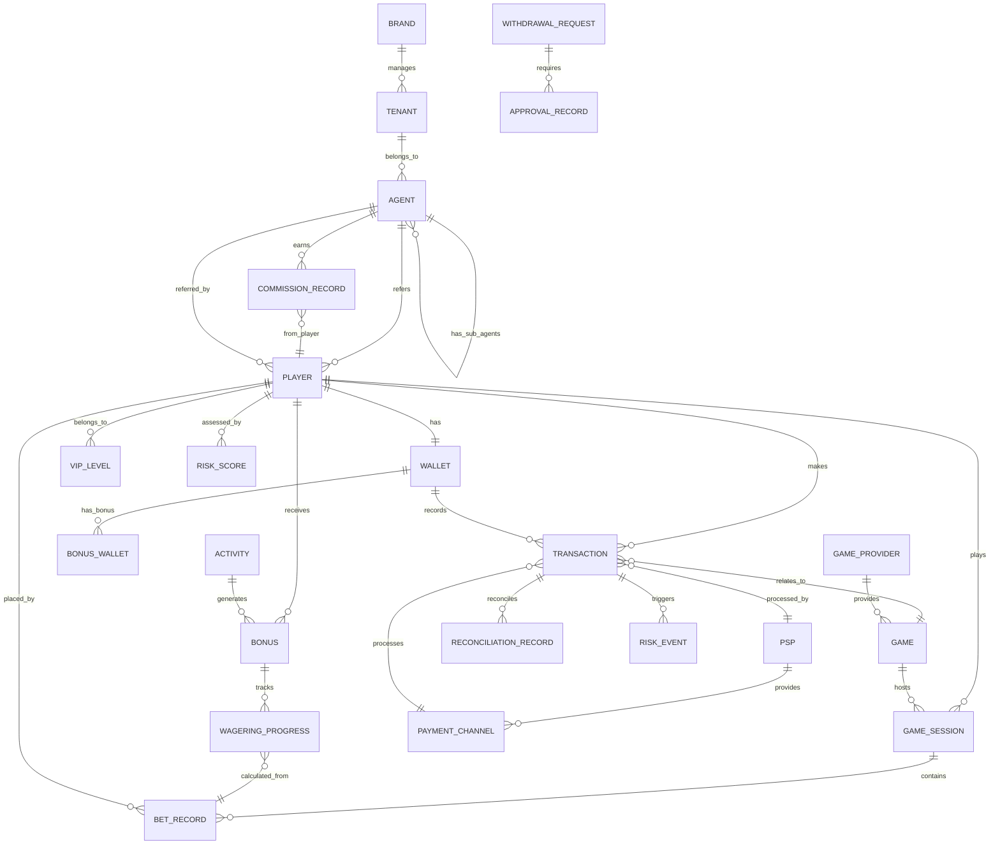

# 數據模型總覽 (Data Model Overview)

> **版本**: 1.0.0
> **最後更新**: 2026-01-27
> **目的**: 提供 IGaming 平台所有核心數據實體的統一視圖

---

## 📋 目錄

- [核心實體關係圖](#核心實體關係圖)
- [實體分層架構](#實體分層架構)
- [跨模組外鍵關係](#跨模組外鍵關係)
- [核心數據表設計](#核心數據表設計)
- [數據一致性約束](#數據一致性約束)
- [索引策略](#索引策略)
- [數據安全與加密](#數據安全與加密)

---

## 🔗 核心實體關係圖

### 整體 ER 圖



---

## 🏗️ 實體分層架構

### Layer 1: 多租戶與組織架構

```
Super Admin (系統級)
    └─ Brand (品牌)
        └─ Tenant (租戶/運營商)
            └─ Agent (代理)
                └─ Player (玩家)
```

**核心實體**:
- `brands` - 品牌主體
- `tenants` - 租戶/運營商
- `agents` - 代理系統（無限層級）
- `players` - 終端玩家

---

### Layer 2: 財務核心

```
Player Wallet (玩家錢包)
    ├─ Cash Balance (現金餘額)
    ├─ Bonus Balance (紅利餘額)
    └─ Credit Balance (信用額度)
```

**核心實體**:
- `wallets` - 統一錢包主表
- `transactions` - 所有資金流轉記錄
- `bonus_wallets` - 紅利子錢包
- `withdrawal_requests` - 提款申請
- `deposit_records` - 存款記錄

---

### Layer 3: 遊戲與投注

```
Game Provider
    └─ Game
        └─ Game Session
            └─ Bet Record (下注記錄)
```

**核心實體**:
- `game_providers` - 遊戲供應商 (GP)
- `games` - 遊戲目錄
- `game_sessions` - 遊戲會話
- `bet_records` - 投注明細
- `game_round_aggregation` - 遊戲局彙總

---

### Layer 4: 活動與風控

**活動系統**:
- `activities` - 活動配置
- `bonuses` - 紅利發放記錄
- `wagering_progress` - 流水進度追蹤

**風控系統**:
- `risk_rules` - 風控規則配置
- `risk_scores` - 玩家風險評分
- `risk_events` - 風險事件記錄
- `approval_workflows` - 審批工作流

---

## 🔑 跨模組外鍵關係

### 主鍵與外鍵約束表

| 子表 (From) | 外鍵字段 | 父表 (To) | 關係類型 | 級聯刪除 | 說明 |
|------------|---------|----------|---------|---------|------|
| **玩家相關** |
| `players` | `tenant_id` | `tenants` | N:1 | RESTRICT | 玩家屬於租戶 |
| `players` | `agent_id` | `agents` | N:1 | SET NULL | 推薦代理（可為空）|
| `players` | `vip_level_id` | `vip_levels` | N:1 | SET NULL | VIP等級 |
| `wallets` | `player_id` | `players` | 1:1 | CASCADE | 錢包與玩家綁定 |
| **交易相關** |
| `transactions` | `player_id` | `players` | N:1 | RESTRICT | 交易所有者 |
| `transactions` | `wallet_id` | `wallets` | N:1 | RESTRICT | 關聯錢包 |
| `transactions` | `game_id` | `games` | N:1 | SET NULL | 遊戲交易（可選）|
| `transactions` | `psp_id` | `psps` | N:1 | SET NULL | 支付服務商 |
| **遊戲相關** |
| `games` | `provider_id` | `game_providers` | N:1 | CASCADE | 遊戲屬於GP |
| `game_sessions` | `player_id` | `players` | N:1 | RESTRICT | 玩家會話 |
| `game_sessions` | `game_id` | `games` | N:1 | RESTRICT | 遊戲會話 |
| `bet_records` | `session_id` | `game_sessions` | N:1 | CASCADE | 屬於某會話 |
| `bet_records` | `player_id` | `players` | N:1 | RESTRICT | 下注玩家 |
| **活動相關** |
| `bonuses` | `player_id` | `players` | N:1 | CASCADE | 紅利所有者 |
| `bonuses` | `activity_id` | `activities` | N:1 | RESTRICT | 活動來源 |
| `wagering_progress` | `bonus_id` | `bonuses` | N:1 | CASCADE | 流水進度追蹤 |
| **代理相關** |
| `agents` | `parent_agent_id` | `agents` | N:1 | RESTRICT | 上級代理（自引用）|
| `agents` | `tenant_id` | `tenants` | N:1 | RESTRICT | 所屬租戶 |
| `commission_records` | `agent_id` | `agents` | N:1 | RESTRICT | 佣金所有者 |
| `commission_records` | `player_id` | `players` | N:1 | RESTRICT | 佣金來源玩家 |
| **風控相關** |
| `risk_scores` | `player_id` | `players` | N:1 | CASCADE | 玩家風險評分 |
| `risk_events` | `transaction_id` | `transactions` | N:1 | CASCADE | 風險事件觸發交易 |
| `withdrawal_requests` | `player_id` | `players` | N:1 | RESTRICT | 提款申請人 |
| `approval_records` | `request_id` | `withdrawal_requests` | N:1 | CASCADE | 審批記錄 |

---

## 📊 核心數據表設計

### 1. Player (玩家表)

**表名**: `players`
**功能**: 玩家賬戶核心信息

```sql
CREATE TABLE players (
    -- 主鍵
    player_id BIGINT PRIMARY KEY AUTO_INCREMENT,

    -- 基本信息
    username VARCHAR(50) UNIQUE NOT NULL,
    encrypted_email VARCHAR(255),           -- 加密後的郵箱
    email_blind_index CHAR(64) UNIQUE,      -- 盲索引（用於查詢）
    encrypted_phone VARCHAR(255),
    phone_blind_index CHAR(64),

    -- 身份信息（加密）
    encrypted_full_name VARCHAR(255),
    encrypted_id_number VARCHAR(255),
    id_number_blind_index CHAR(64),
    date_of_birth DATE,                     -- 明文（需年齡驗證）

    -- 地址信息
    country_code CHAR(2) NOT NULL,
    encrypted_address TEXT,
    city VARCHAR(100),
    postal_code VARCHAR(20),

    -- 關聯關係
    tenant_id BIGINT NOT NULL,
    agent_id BIGINT,                        -- 推薦代理（可為空）
    vip_level_id INT DEFAULT 1,

    -- 狀態
    status ENUM('active', 'suspended', 'self_excluded', 'closed') DEFAULT 'active',
    kyc_status ENUM('pending', 'verified', 'rejected', 'edd_required') DEFAULT 'pending',
    kyc_verified_at TIMESTAMP NULL,

    -- 安全
    password_hash VARCHAR(255) NOT NULL,    -- Argon2id
    salt VARCHAR(64) NOT NULL,
    mfa_enabled BOOLEAN DEFAULT FALSE,
    mfa_secret VARCHAR(255),

    -- 審計
    created_at TIMESTAMP DEFAULT CURRENT_TIMESTAMP,
    updated_at TIMESTAMP DEFAULT CURRENT_TIMESTAMP ON UPDATE CURRENT_TIMESTAMP,
    last_login_at TIMESTAMP NULL,
    last_login_ip VARCHAR(45),

    -- 索引
    INDEX idx_tenant (tenant_id),
    INDEX idx_agent (agent_id),
    INDEX idx_email_index (email_blind_index),
    INDEX idx_phone_index (phone_blind_index),
    INDEX idx_id_number_index (id_number_blind_index),
    INDEX idx_status (status),
    INDEX idx_created_at (created_at),

    -- 外鍵
    FOREIGN KEY (tenant_id) REFERENCES tenants(tenant_id) ON DELETE RESTRICT,
    FOREIGN KEY (agent_id) REFERENCES agents(agent_id) ON DELETE SET NULL,
    FOREIGN KEY (vip_level_id) REFERENCES vip_levels(level_id) ON DELETE SET NULL
) ENGINE=InnoDB DEFAULT CHARSET=utf8mb4 COLLATE=utf8mb4_unicode_ci;
```

**關鍵欄位說明**:
- **email_blind_index**: 使用 HMAC-SHA256 的盲索引，用於加密郵箱的可檢索查詢
- **password_hash**: 使用 Argon2id 算法，參數為 m=65536, t=3, p=4
- **kyc_status**: 支持增強盡職調查 (EDD) 流程

---

### 2. Wallet (錢包表)

**表名**: `wallets`
**功能**: 玩家統一錢包（現金+紅利+信用）

```sql
CREATE TABLE wallets (
    -- 主鍵
    wallet_id BIGINT PRIMARY KEY AUTO_INCREMENT,
    player_id BIGINT UNIQUE NOT NULL,      -- 1:1關係

    -- 餘額（單位：分，避免浮點數精度問題）
    cash_balance BIGINT NOT NULL DEFAULT 0,          -- 現金餘額
    bonus_balance BIGINT NOT NULL DEFAULT 0,         -- 紅利餘額
    credit_balance BIGINT NOT NULL DEFAULT 0,        -- 信用餘額
    locked_balance BIGINT NOT NULL DEFAULT 0,        -- 鎖定餘額（未決投注）

    -- 信用相關
    credit_limit BIGINT NOT NULL DEFAULT 0,          -- 信用上限
    credit_used BIGINT NOT NULL DEFAULT 0,           -- 已使用信用

    -- 計算字段（冗餘存儲以提升性能）
    total_balance BIGINT GENERATED ALWAYS AS
        (cash_balance + bonus_balance + credit_balance) VIRTUAL,
    playable_balance BIGINT GENERATED ALWAYS AS
        (cash_balance + bonus_balance + (credit_limit - credit_used) - locked_balance) VIRTUAL,

    -- 貨幣
    currency_code CHAR(3) NOT NULL DEFAULT 'USD',

    -- 版本號（樂觀鎖）
    version INT NOT NULL DEFAULT 0,

    -- 審計
    created_at TIMESTAMP DEFAULT CURRENT_TIMESTAMP,
    updated_at TIMESTAMP DEFAULT CURRENT_TIMESTAMP ON UPDATE CURRENT_TIMESTAMP,
    last_transaction_at TIMESTAMP NULL,

    -- 索引
    INDEX idx_player (player_id),
    INDEX idx_updated_at (updated_at),

    -- 外鍵
    FOREIGN KEY (player_id) REFERENCES players(player_id) ON DELETE CASCADE,

    -- 約束
    CHECK (cash_balance >= 0),
    CHECK (bonus_balance >= 0),
    CHECK (locked_balance >= 0),
    CHECK (credit_limit >= 0),
    CHECK (credit_used >= 0),
    CHECK (credit_used <= credit_limit)
) ENGINE=InnoDB DEFAULT CHARSET=utf8mb4;
```

**可下注餘額公式**:
```
Playable Balance = Cash + Bonus + (Credit Limit - Credit Used) - Locked Balance
```

**並發控制**:
- 使用 `version` 欄位實現樂觀鎖
- 更新語句示例：
```sql
UPDATE wallets
SET cash_balance = cash_balance + ?,
    version = version + 1,
    updated_at = NOW()
WHERE wallet_id = ? AND version = ?;
```

---

### 3. Transaction (交易表)

**表名**: `transactions`
**功能**: 所有資金流轉的統一記錄

```sql
CREATE TABLE transactions (
    -- 主鍵
    transaction_id BIGINT PRIMARY KEY AUTO_INCREMENT,
    external_txn_id VARCHAR(100) UNIQUE,    -- 外部交易ID（PSP/GP）

    -- 關聯
    player_id BIGINT NOT NULL,
    wallet_id BIGINT NOT NULL,
    game_id BIGINT NULL,                    -- 遊戲相關交易
    psp_id BIGINT NULL,                     -- 支付服務商
    session_id BIGINT NULL,                 -- 遊戲會話

    -- 交易基本信息
    type ENUM('deposit', 'withdrawal', 'bet', 'win', 'bonus', 'refund',
              'adjustment', 'commission', 'transfer') NOT NULL,
    amount BIGINT NOT NULL,                 -- 金額（分）
    currency_code CHAR(3) NOT NULL DEFAULT 'USD',

    -- 餘額快照（交易前後）
    balance_before BIGINT NOT NULL,
    balance_after BIGINT NOT NULL,

    -- 狀態
    status ENUM('pending', 'processing', 'completed', 'failed',
                'cancelled', 'expired') DEFAULT 'pending',

    -- 流水計算相關
    is_valid_turnover BOOLEAN DEFAULT FALSE,    -- 是否計入有效流水
    turnover_contribution BIGINT DEFAULT 0,     -- 流水貢獻值
    game_weight DECIMAL(5,4) DEFAULT 1.0000,   -- 遊戲權重

    -- 支付相關（僅存款/提款）
    payment_method VARCHAR(50),
    payment_channel VARCHAR(100),
    psp_reference VARCHAR(255),

    -- 描述與備註
    description VARCHAR(500),
    internal_note TEXT,

    -- IP與設備
    ip_address VARCHAR(45),
    user_agent VARCHAR(500),
    device_fingerprint VARCHAR(255),

    -- 審計
    created_at TIMESTAMP DEFAULT CURRENT_TIMESTAMP,
    completed_at TIMESTAMP NULL,
    created_by VARCHAR(100),                -- 系統/管理員ID

    -- 索引
    INDEX idx_player (player_id, created_at DESC),
    INDEX idx_wallet (wallet_id),
    INDEX idx_external_txn (external_txn_id),
    INDEX idx_type_status (type, status),
    INDEX idx_game (game_id),
    INDEX idx_session (session_id),
    INDEX idx_created_at (created_at),
    INDEX idx_turnover (is_valid_turnover, player_id),

    -- 外鍵
    FOREIGN KEY (player_id) REFERENCES players(player_id) ON DELETE RESTRICT,
    FOREIGN KEY (wallet_id) REFERENCES wallets(wallet_id) ON DELETE RESTRICT,
    FOREIGN KEY (game_id) REFERENCES games(game_id) ON DELETE SET NULL,
    FOREIGN KEY (psp_id) REFERENCES psps(psp_id) ON DELETE SET NULL
) ENGINE=InnoDB DEFAULT CHARSET=utf8mb4;
```

**分區策略**（建議）:
```sql
PARTITION BY RANGE (UNIX_TIMESTAMP(created_at)) (
    PARTITION p202601 VALUES LESS THAN (UNIX_TIMESTAMP('2026-02-01')),
    PARTITION p202602 VALUES LESS THAN (UNIX_TIMESTAMP('2026-03-01')),
    ...
);
```

---

### 4. Bonus (紅利表)

**表名**: `bonuses`
**功能**: 玩家紅利發放與流水追蹤

```sql
CREATE TABLE bonuses (
    -- 主鍵
    bonus_id BIGINT PRIMARY KEY AUTO_INCREMENT,

    -- 關聯
    player_id BIGINT NOT NULL,
    activity_id BIGINT,                     -- 活動來源
    wallet_id BIGINT NOT NULL,

    -- 紅利信息
    type ENUM('welcome', 'deposit', 'cashback', 'rakeback', 'vip', 'manual') NOT NULL,
    amount BIGINT NOT NULL,                 -- 紅利金額（分）
    currency_code CHAR(3) NOT NULL DEFAULT 'USD',

    -- 流水要求
    wagering_requirement_multiplier DECIMAL(5,2) NOT NULL,  -- 流水倍數（如30x）
    wagering_required BIGINT NOT NULL,                      -- 需完成流水
    wagering_completed BIGINT NOT NULL DEFAULT 0,           -- 已完成流水
    wagering_percentage AS (
        CASE WHEN wagering_required > 0
        THEN (wagering_completed * 100.0 / wagering_required)
        ELSE 0 END
    ) VIRTUAL,                                              -- 完成百分比

    -- 遊戲限制（JSON）
    game_restrictions JSON,                                 -- 遊戲白名單/黑名單
    game_weights JSON,                                      -- 遊戲權重配置

    -- 狀態與有效期
    status ENUM('active', 'locked', 'completed', 'forfeited', 'expired') DEFAULT 'active',
    expires_at TIMESTAMP NOT NULL,
    activated_at TIMESTAMP NULL,
    completed_at TIMESTAMP NULL,
    forfeited_at TIMESTAMP NULL,

    -- 最大獎金限制
    max_win_amount BIGINT,                  -- 最大贏得金額限制
    current_win_amount BIGINT DEFAULT 0,

    -- 審計
    created_at TIMESTAMP DEFAULT CURRENT_TIMESTAMP,
    updated_at TIMESTAMP DEFAULT CURRENT_TIMESTAMP ON UPDATE CURRENT_TIMESTAMP,
    created_by VARCHAR(100),

    -- 索引
    INDEX idx_player_status (player_id, status),
    INDEX idx_activity (activity_id),
    INDEX idx_status_expires (status, expires_at),
    INDEX idx_created_at (created_at),

    -- 外鍵
    FOREIGN KEY (player_id) REFERENCES players(player_id) ON DELETE CASCADE,
    FOREIGN KEY (activity_id) REFERENCES activities(activity_id) ON DELETE RESTRICT,
    FOREIGN KEY (wallet_id) REFERENCES wallets(wallet_id) ON DELETE RESTRICT,

    -- 約束
    CHECK (amount > 0),
    CHECK (wagering_required >= 0),
    CHECK (wagering_completed >= 0),
    CHECK (wagering_completed <= wagering_required)
) ENGINE=InnoDB DEFAULT CHARSET=utf8mb4;
```

**流水計算邏輯**:
```python
# 每筆有效投注更新流水進度
wagering_completed += bet_amount * game_weight * contribution_percentage
```

---

### 5. Game (遊戲表)

**表名**: `games`
**功能**: 遊戲目錄與元數據

```sql
CREATE TABLE games (
    -- 主鍵
    game_id BIGINT PRIMARY KEY AUTO_INCREMENT,
    provider_id BIGINT NOT NULL,

    -- 遊戲標識
    game_code VARCHAR(100) UNIQUE NOT NULL,     -- GP提供的唯一碼
    game_name VARCHAR(255) NOT NULL,
    game_name_localized JSON,                   -- 多語言名稱

    -- 遊戲分類
    category ENUM('slot', 'table', 'live_dealer', 'poker', 'sports', 'crash', 'other') NOT NULL,
    sub_category VARCHAR(50),
    tags JSON,                                  -- 遊戲標籤（如 "高波動性", "Megaways"）

    -- 遊戲特性
    rtp DECIMAL(5,4) NOT NULL,                 -- RTP% (如 96.50%)
    volatility ENUM('low', 'medium', 'high', 'very_high') DEFAULT 'medium',
    max_win_multiplier INT,                    -- 最大贏倍（如 x5000）

    -- 限制
    min_bet BIGINT NOT NULL DEFAULT 100,       -- 最小下注（分）
    max_bet BIGINT NOT NULL DEFAULT 10000000,  -- 最大下注

    -- 流水權重（用於活動流水計算）
    turnover_weight DECIMAL(5,4) DEFAULT 1.0000,

    -- 錢包類型
    wallet_type ENUM('seamless', 'transfer') NOT NULL,

    -- 狀態
    status ENUM('active', 'inactive', 'maintenance') DEFAULT 'active',
    is_featured BOOLEAN DEFAULT FALSE,
    is_new BOOLEAN DEFAULT FALSE,

    -- 元數據
    thumbnail_url VARCHAR(500),
    banner_url VARCHAR(500),
    description TEXT,
    launch_url_template VARCHAR(500),

    -- 統計（冗餘字段，定期更新）
    total_bets_count BIGINT DEFAULT 0,
    total_bets_amount BIGINT DEFAULT 0,
    total_wins_amount BIGINT DEFAULT 0,
    actual_rtp DECIMAL(5,4),                   -- 實際RTP（統計值）

    -- 審計
    created_at TIMESTAMP DEFAULT CURRENT_TIMESTAMP,
    updated_at TIMESTAMP DEFAULT CURRENT_TIMESTAMP ON UPDATE CURRENT_TIMESTAMP,
    last_played_at TIMESTAMP NULL,

    -- 索引
    INDEX idx_provider (provider_id),
    INDEX idx_game_code (game_code),
    INDEX idx_category_status (category, status),
    INDEX idx_featured (is_featured, status),
    INDEX idx_turnover_weight (turnover_weight),

    -- 外鍵
    FOREIGN KEY (provider_id) REFERENCES game_providers(provider_id) ON DELETE CASCADE
) ENGINE=InnoDB DEFAULT CHARSET=utf8mb4 COLLATE=utf8mb4_unicode_ci;
```

---

### 6. Withdrawal_Request (提款申請表)

**表名**: `withdrawal_requests`
**功能**: 玩家提款申請與審核流程

```sql
CREATE TABLE withdrawal_requests (
    -- 主鍵
    request_id BIGINT PRIMARY KEY AUTO_INCREMENT,
    player_id BIGINT NOT NULL,
    wallet_id BIGINT NOT NULL,

    -- 提款信息
    amount BIGINT NOT NULL,                     -- 提款金額（分）
    currency_code CHAR(3) NOT NULL DEFAULT 'USD',
    payment_method VARCHAR(50) NOT NULL,
    payment_details JSON NOT NULL,              -- 收款賬戶信息（加密）

    -- 審核狀態
    status ENUM('pending_review', 'level1_approved', 'level2_approved',
                'processing', 'completed', 'rejected', 'cancelled') DEFAULT 'pending_review',

    -- 多層審核
    level1_reviewer_id BIGINT NULL,
    level1_reviewed_at TIMESTAMP NULL,
    level1_comment TEXT,

    level2_reviewer_id BIGINT NULL,
    level2_reviewed_at TIMESTAMP NULL,
    level2_comment TEXT,

    level3_reviewer_id BIGINT NULL,
    level3_reviewed_at TIMESTAMP NULL,
    level3_comment TEXT,

    -- 風控檢測
    risk_score INT,                             -- 風險評分 (0-100)
    risk_level ENUM('low', 'medium', 'high', 'critical'),
    risk_flags JSON,                            -- 觸發的風控規則
    auto_approved BOOLEAN DEFAULT FALSE,

    -- 支付處理
    psp_id BIGINT NULL,
    psp_reference VARCHAR(255),
    psp_response JSON,
    processed_at TIMESTAMP NULL,
    completed_at TIMESTAMP NULL,

    -- KYC/AML驗證
    kyc_verified BOOLEAN DEFAULT FALSE,
    sof_verified BOOLEAN DEFAULT FALSE,         -- 資金來源驗證
    edd_required BOOLEAN DEFAULT FALSE,         -- 是否需要EDD

    -- 拒絕原因
    rejection_reason ENUM('kyc_failed', 'sof_unverified', 'fraud_detected',
                          'bonus_abuse', 'other'),
    rejection_detail TEXT,

    -- IP與設備
    ip_address VARCHAR(45),
    device_fingerprint VARCHAR(255),

    -- 審計
    created_at TIMESTAMP DEFAULT CURRENT_TIMESTAMP,
    updated_at TIMESTAMP DEFAULT CURRENT_TIMESTAMP ON UPDATE CURRENT_TIMESTAMP,

    -- 索引
    INDEX idx_player_status (player_id, status),
    INDEX idx_status_created (status, created_at),
    INDEX idx_risk_level (risk_level, status),
    INDEX idx_level1_reviewer (level1_reviewer_id),
    INDEX idx_level2_reviewer (level2_reviewer_id),

    -- 外鍵
    FOREIGN KEY (player_id) REFERENCES players(player_id) ON DELETE RESTRICT,
    FOREIGN KEY (wallet_id) REFERENCES wallets(wallet_id) ON DELETE RESTRICT,
    FOREIGN KEY (psp_id) REFERENCES psps(psp_id) ON DELETE SET NULL,

    -- 約束
    CHECK (amount > 0),
    CHECK (risk_score >= 0 AND risk_score <= 100)
) ENGINE=InnoDB DEFAULT CHARSET=utf8mb4;
```

**SAGA 分佈式事務流程**:
```
1. 創建提款申請 (Pending)
2. 鎖定錢包餘額 (Locked)
3. 風控檢測 (Risk Check)
4. 多層審批 (L1 → L2 → L3)
5. PSP代付 (Processing)
6. 完成/回滾 (Completed/Failed)
```

---

## ✅ 數據一致性約束

### 1. 錢包餘額一致性

**約束規則**:
```sql
-- 錢包餘額不能為負
CHECK (cash_balance >= 0)
CHECK (bonus_balance >= 0)

-- 信用使用不能超過額度
CHECK (credit_used <= credit_limit)

-- 鎖定餘額不能超過總餘額
CHECK (locked_balance <= (cash_balance + bonus_balance + credit_balance))
```

**定期校驗**（每日對帳）:
```sql
-- 驗證交易記錄與錢包餘額一致
SELECT
    w.player_id,
    w.cash_balance AS wallet_balance,
    SUM(CASE WHEN t.type IN ('deposit', 'win', 'bonus') THEN t.amount
             WHEN t.type IN ('bet', 'withdrawal') THEN -t.amount
             ELSE 0 END) AS calculated_balance
FROM wallets w
LEFT JOIN transactions t ON w.wallet_id = t.wallet_id
WHERE t.status = 'completed'
GROUP BY w.player_id
HAVING wallet_balance != calculated_balance;
```

---

### 2. 流水計算一致性

**三層驗證架構**:
```
Layer 1: 風控引擎驗證 (實時)
    ↓ 有效投注標記
Layer 2: 財務層驗證 (批次)
    ↓ 流水數據彙總
Layer 3: 活動層應用 (觸發)
    ↓ 活動進度更新
```

**一致性檢查**:
```sql
-- 驗證紅利流水進度與實際投注一致
SELECT
    b.bonus_id,
    b.wagering_completed AS bonus_wagering,
    SUM(t.turnover_contribution) AS actual_turnover
FROM bonuses b
LEFT JOIN transactions t ON t.player_id = b.player_id
    AND t.created_at BETWEEN b.activated_at AND COALESCE(b.completed_at, NOW())
    AND t.is_valid_turnover = TRUE
WHERE b.status IN ('active', 'completed')
GROUP BY b.bonus_id
HAVING ABS(bonus_wagering - actual_turnover) > 100;  -- 允許1元誤差
```

---

### 3. 多租戶數據隔離

**隔離策略**:

**Schema分離** (推薦用於大型租戶):
```
database_tenant_1
database_tenant_2
database_tenant_3
```

**行級隔離** (推薦用於中小型租戶):
```sql
-- 所有查詢必須帶 tenant_id 條件
SELECT * FROM players
WHERE tenant_id = :current_tenant_id AND player_id = :player_id;

-- 使用視圖強制隔離
CREATE VIEW tenant_players AS
SELECT * FROM players
WHERE tenant_id = get_current_tenant_id();
```

**混合模式**:
- 大型租戶：獨立數據庫
- 中小租戶：共享數據庫（行級隔離）

---

## 🔍 索引策略

### 高頻查詢索引

| 表名 | 索引名稱 | 索引列 | 索引類型 | 說明 |
|------|---------|--------|---------|------|
| `players` | `idx_tenant_username` | `(tenant_id, username)` | UNIQUE | 租戶內唯一用戶名 |
| `players` | `idx_email_blind_index` | `email_blind_index` | BTREE | 郵箱盲索引查詢 |
| `wallets` | `idx_player_updated` | `(player_id, updated_at)` | BTREE | 玩家錢包歷史 |
| `transactions` | `idx_player_type_date` | `(player_id, type, created_at DESC)` | BTREE | 玩家交易記錄 |
| `transactions` | `idx_turnover` | `(is_valid_turnover, player_id, created_at)` | BTREE | 流水計算查詢 |
| `bonuses` | `idx_player_status_expires` | `(player_id, status, expires_at)` | BTREE | 活動紅利查詢 |
| `games` | `idx_provider_category` | `(provider_id, category, status)` | BTREE | 遊戲目錄分類 |
| `withdrawal_requests` | `idx_status_risk_created` | `(status, risk_level, created_at)` | BTREE | 提款審核隊列 |

### 覆蓋索引 (Covering Index)

```sql
-- 玩家錢包餘額查詢（無需回表）
CREATE INDEX idx_wallet_balance_covering ON wallets(
    player_id,
    cash_balance,
    bonus_balance,
    locked_balance
);

-- 交易統計查詢
CREATE INDEX idx_transaction_stats ON transactions(
    player_id,
    type,
    status,
    amount,
    created_at
);
```

---

## 🔐 數據安全與加密

### 加密字段策略

| 數據類型 | 加密方式 | 密鑰管理 | 查詢策略 |
|---------|---------|---------|---------|
| **PII (個人身份信息)** |
| 郵箱 | AES-256-GCM | KMS (每租戶獨立) | 盲索引查詢 |
| 手機號 | AES-256-GCM | KMS | 盲索引查詢 |
| 身份證號 | AES-256-GCM | KMS | 盲索引查詢 |
| 姓名 | AES-256-GCM | KMS | 無法直接查詢 |
| 地址 | AES-256-GCM | KMS | 無法直接查詢 |
| **金融信息** |
| 銀行卡號 | AES-256-GCM | HSM | Token化 + 盲索引 |
| CVV | 不存儲 | N/A | 交易時即時處理 |
| **憑證** |
| 密碼 | Argon2id | Salt per-record | Hash比對 |
| MFA密鑰 | AES-256-GCM | KMS | 解密後驗證 |

### 盲索引 (Blind Index) 實現

**原理**:
```
Blind Index = HMAC-SHA256(index_key, plaintext_value)
```

**示例**:
```python
# 存儲郵箱
plaintext_email = "player@example.com"
encrypted_email = aes_encrypt(kms_key, plaintext_email)
email_blind_index = hmac_sha256(index_key, plaintext_email.lower())

# 查詢郵箱
search_index = hmac_sha256(index_key, search_email.lower())
SELECT * FROM players WHERE email_blind_index = search_index;
```

**金鑰輪替策略**:
1. 保留舊金鑰（grace period）
2. 創建新金鑰
3. 後台批次重加密
4. 雙金鑰查詢過渡期
5. 停用舊金鑰

---

### GDPR Crypto-Shredding

**數據刪除策略**:
```
Player Deletion Request
    ↓
1. 刪除 Data Encryption Key (DEK)
    ↓
2. 標記記錄為 "deleted"
    ↓
3. 保留交易記錄（監管要求，但無法解密PII）
    ↓
4. 生成合規報告
```

**實現**:
```sql
-- 刪除玩家數據加密金鑰
DELETE FROM data_encryption_keys
WHERE player_id = :player_id;

-- 標記玩家為已刪除（保留交易記錄）
UPDATE players
SET
    status = 'deleted',
    encrypted_email = NULL,
    email_blind_index = NULL,
    encrypted_phone = NULL,
    encrypted_full_name = NULL,
    encryption_key_deleted_at = NOW()
WHERE player_id = :player_id;
```

---

## 📚 相關文檔

### 數據模型參考
- [02-06 統一錢包模型](../02_Finance_Center/02-06_Unified_Wallet_Model.md) - 錢包詳細設計
- [02-04 流水計算與遊戲對賬](../02_Finance_Center/02-04_Turnover_and_Game_Reconciliation_Analysis.md) - 流水計算邏輯
- [05-01 風控系統](../05_Risk_Management/05-01_Risk_Control_System.md) - 風險評分模型
- [09-03 數據安全標準](../09_System_Security/09-03_Data_Security_Standard.md) - 加密與盲索引

### 架構參考
- [00-00 文檔導航地圖](./00-00_Document_Map.md) - 全局導航
- [00-01 方案概覽](./00-01_Solution_Overview.md) - 整體架構
- [07-01 層級架構](../07_Platform_Management/07-01_Hierarchy_Architecture.md) - 多租戶設計

---

**文檔版本**: 1.0.0
**維護團隊**: Architecture Team & Data Team
**下次審閱**: 2026-04-27（每季度審閱）
