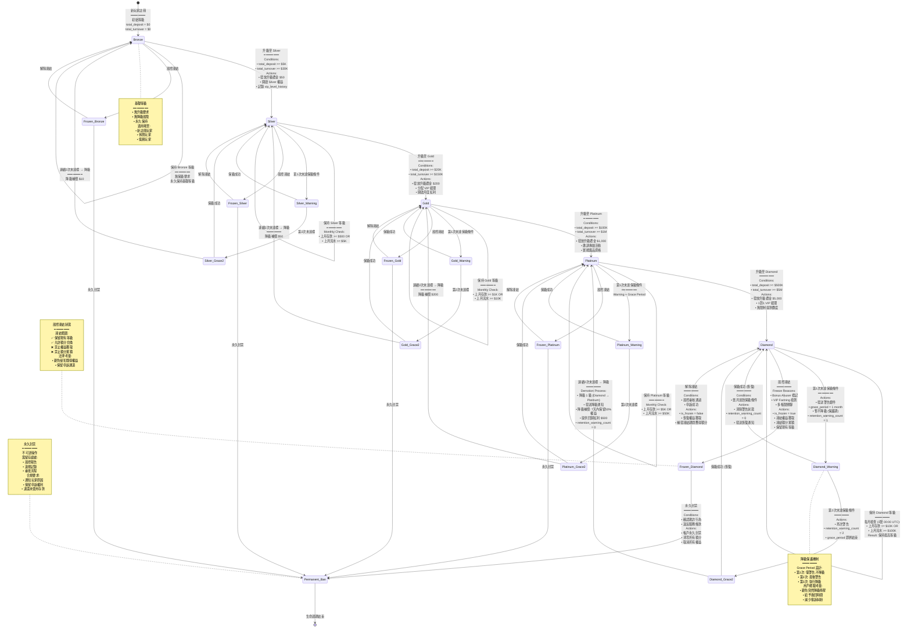

# 01-02 VIP 與忠誠度系統 (VIP & Loyalty System)

## 1. 系統概述 (Overview)
旨在透過獎勵機制提升玩家留存率 (Retention) 與終身價值 (LTV)。系統需具備高度靈活性，允許不同商戶自定義其 VIP 層級規則與權益。

## 2. 核心功能需求

### 2.1 層級與升降級 (Levels & Promotion)
- **層級設定**：
  - 支援無限制層級 (如 Bronze, Silver, Gold, Platinum, Diamond)
  - 每個層級需設定個別 Icon 與樣式
- **升級條件 (動態配置)**：
  - 累積存款 (Total Deposit)
  - 累積流水 (Total Turnover) —— 需排除無效投注
  - 積分 (Loyalty Points)
- **保級與降級 (Retention & Demotion)**：
  - 設定 "保級週期" (如每月) 與 "保級條件"
  - 若未達標，自動降級或扣除積分

#### 2.1.1 VIP 等級轉換狀態機 (VIP Tier State Machine)

**概述**：VIP 等級系統採用狀態機模式，確保升降級邏輯清晰、可追溯，並提供降級保護機制。



**VIP 等級轉換觸發條件矩陣**：

| 當前等級 | 目標等級 | 觸發類型 | 條件 | 自動化程度 | 通知機制 |
|---------|---------|---------|------|-----------|---------|
| Bronze | Silver | 升級 | total_deposit >= $5K AND total_turnover >= $30K | 100% 自動 | 站內信 + Push + Email |
| Silver | Gold | 升級 | total_deposit >= $20K AND total_turnover >= $150K | 100% 自動 | 站內信 + Push + Email + VIP經理致電 |
| Gold | Platinum | 升級 | total_deposit >= $100K AND total_turnover >= $1M | 100% 自動 | 全渠道通知 + 實體禮品郵寄 |
| Platinum | Diamond | 升級 | total_deposit >= $500K AND total_turnover >= $5M | 100% 自動 | 專人致電祝賀 + 豪華禮包 |
| Diamond | Diamond_Warning | 保級檢查 | 上月存款 < $10K AND 上月流水 < $100K (第1次) | 100% 自動 | Email 警告 (非緊急) |
| Diamond_Warning | Platinum | 降級 | 連續 2 次未達保級條件 | 100% 自動 | Email + SMS + VIP經理致電安撫 |
| Any Level | Frozen | 風控凍結 | 風控系統標記 Bonus Abuser / VIP Farming | 100% 自動 | 站內信 (說明原因 + 申訴途徑) |
| Frozen | Original Level | 解除凍結 | 風控審核通過 OR 申訴成功 | 需人工審批 | Email + VIP經理致電 |
| Frozen | Permanent_Ban | 永久封禁 | 確認欺詐 / 嚴重違規 | 需高層審批 | Email 正式通知 (包含法律條款) |

**關鍵業務規則說明**：

1. **升級條件組合邏輯**：
   - **邏輯**: `total_deposit >= X AND total_turnover >= Y`
   - **原因**: 防止玩家僅存款不玩遊戲套取升級禮金
   - **靈活性**: 支援配置為 OR 邏輯 (但不推薦,易被濫用)

2. **降級保護 (Grace Period)**：
   - **第1次未達標**: 僅警告,給予 1 個月寬限期
   - **第2次未達標**: 最後警告,grace_period 即將結束
   - **第3次未達標**: 執行降級,但提供補償
   - **原因**: 避免玩家因短期資金緊張而突然降級,導致客訴激增

3. **降級補償機制**：
   - **目的**: 減輕玩家心理落差,提供回歸激勵
   - **內容**:
     - 降級後 7 天內,保留原等級 50% 權益 (緩衝期)
     - 發放回歸紅利 (如 Diamond → Platinum 降級,補償 $500)
     - VIP 經理主動致電安撫,了解原因

4. **風控凍結 vs 降級**：
   - **凍結**: 保留等級,但禁止權益獲取 (可申訴解除)
   - **降級**: 永久降低等級 (需重新累積升級條件)
   - **法律考量**: 凍結是臨時措施,降級是確定結果

5. **永久封禁不可逆**：
   - 需經過: 風控初審 → 合規審查 → 高層審批 (三級審批)
   - 必須留存完整證據鏈 (滿足法律訴訟需求)
   - 退還未使用存款 (避免法律糾紛)

**典型狀態轉換耗時統計**：

| 玩家類型 | Bronze → Silver | Silver → Gold | Gold → Platinum | Platinum → Diamond | 保級週期 |
|---------|----------------|--------------|-----------------|-------------------|---------|
| 鯨魚玩家 (Whale) | 1-7 天 | 7-30 天 | 1-3 個月 | 3-6 個月 | 每月通過 |
| 高頻玩家 (High Roller) | 1-3 個月 | 3-6 個月 | 6-12 個月 | 1-2 年 | 每月通過 |
| 中頻玩家 (Regular) | 3-6 個月 | 6-12 個月 | 1-2 年 | 可能無法達到 | 偶爾警告 |
| 休閒玩家 (Casual) | 6-12 個月 | 1-2 年 | 可能無法達到 | 不可能 | 經常降級 |

**運營優化建議**：

- **監控升級轉化率**: Bronze → Silver 轉化率應 > 30% (說明門檻合理)
- **監控降級率**: 每月降級率應 < 10% (過高說明保級條件過嚴)
- **監控 Grace Period 有效性**: 第1次警告後的挽回率應 > 50%
- **監控風控凍結誤報率**: 申訴成功率應 < 20% (過高說明誤判嚴重)
- **監控 VIP 權益使用率**: 若專屬活動參與率 < 30%,說明吸引力不足

---

### 2.2 積分商城 (Point System)
- **積分獲取**：每投注 $X 元獲得 1 點積分 (可依遊戲類型設定權重，如老虎機 100%，百家樂 20%)
- **積分兌換**：
  - 兌換現金 (Bonus / Cash)
  - 兌換實體獎品 (iPhone, 禮券)
  - 兌換遊戲道具 (Free Spins)

### 2.3 VIP 權益 (Privileges)
- **專屬客服**：分配一對一 VIP 經理
- **提款優惠**：
  - 更高的單日提款限額
  - 更快的提款處理 SLA (如 VIP 5分鐘出款)
  - 免除提款手續費
- **專屬紅利**：
  - 升級禮金 (Level Up Bonus)
  - 生日禮金
  - 月度/週度紅利

### 2.4 VIP等級權益詳細清單

| 等級 | 門檻條件 | 專屬紅利 | 返水比例 | 提款限額 | 提款速度 | 專屬客服 | 其他權益 |
|------|---------|---------|---------|---------|---------|---------|---------|
| **Bronze** | 累積存款 $1K<br>累積流水 $5K | 升級禮金 $10 | 0.3% | $5K/日 | 24小時 | 在線客服 | - |
| **Silver** | 累積存款 $5K<br>累積流水 $30K | 升級禮金 $50<br>生日禮金 $20 | 0.5% | $10K/日 | 12小時 | 在線客服 | 每週額外紅利 |
| **Gold** | 累積存款 $20K<br>累積流水 $150K | 升級禮金 $200<br>生日禮金 $100 | 0.8% | $30K/日 | 6小時 | VIP經理 | 每月現金回饋 |
| **Platinum** | 累積存款 $100K<br>累積流水 $1M | 升級禮金 $1000<br>生日禮金 $500 | 1.2% | $100K/日 | 2小時 | VIP經理 | 實體獎品、活動邀請 |
| **Diamond** | 累積存款 $500K<br>累積流水 $5M | 升級禮金 $5000<br>生日禮金 $2000 | 1.5% | 無限制 | 30分鐘 | 1對1 VIP經理 | 豪華旅遊、定制獎勵 |

#### 2.4.1 VIP 權益綜合對比矩陣 (Comprehensive VIP Benefit Comparison Matrix)

**概述**：以多維度視角對比五個 VIP 等級的權益差異，幫助玩家直觀了解升級價值。

```mermaid
graph TD
    TITLE[VIP 等級權益對比矩陣<br/>━━━━━━━━━━━━━━━━━━━━━━]

    subgraph BRONZE[🥉 Bronze 青銅級]
        B1[門檻條件<br/>━━━━━━━━<br/>累積存款: $1K<br/>累積流水: $5K<br/>難度: ⭐]
        B2[金錢權益<br/>━━━━━━━━<br/>升級禮金: $10<br/>生日禮金: $0<br/>月度紅利: $0<br/>返水比例: 0.3%]
        B3[提款權益<br/>━━━━━━━━<br/>單日限額: $5K<br/>處理速度: 24h<br/>手續費: 收取]
        B4[服務權益<br/>━━━━━━━━<br/>客服: 在線客服<br/>VIP經理: ❌<br/>專屬活動: ❌]
        B5[積分權益<br/>━━━━━━━━<br/>積分倍數: 1.0x<br/>兌換優惠: ❌<br/>優先兌換: ❌]
    end

    subgraph SILVER[🥈 Silver 白銀級]
        S1[門檻條件<br/>━━━━━━━━<br/>累積存款: $5K<br/>累積流水: $30K<br/>難度: ⭐⭐]
        S2[金錢權益<br/>━━━━━━━━<br/>升級禮金: $50 ⬆️ 5x<br/>生日禮金: $20<br/>月度紅利: $0<br/>返水比例: 0.5% ⬆️ 1.67x]
        S3[提款權益<br/>━━━━━━━━<br/>單日限額: $10K ⬆️ 2x<br/>處理速度: 12h ⬆️ 2x<br/>手續費: 收取]
        S4[服務權益<br/>━━━━━━━━<br/>客服: 在線客服<br/>VIP經理: ❌<br/>專屬活動: 週度紅利]
        S5[積分權益<br/>━━━━━━━━<br/>積分倍數: 1.2x ⬆️<br/>兌換優惠: ❌<br/>優先兌換: ❌]
    end

    subgraph GOLD[🥇 Gold 黃金級]
        G1[門檻條件<br/>━━━━━━━━<br/>累積存款: $20K<br/>累積流水: $150K<br/>難度: ⭐⭐⭐]
        G2[金錢權益<br/>━━━━━━━━<br/>升級禮金: $200 ⬆️ 20x<br/>生日禮金: $100 ⬆️ 10x<br/>月度紅利: $50-200<br/>返水比例: 0.8% ⬆️ 2.67x]
        G3[提款權益<br/>━━━━━━━━<br/>單日限額: $30K ⬆️ 6x<br/>處理速度: 6h ⬆️ 4x<br/>手續費: 部分免除]
        G4[服務權益<br/>━━━━━━━━<br/>客服: VIP 經理 ✅<br/>專屬郵箱: ✅<br/>專屬活動: 月度錦標賽]
        G5[積分權益<br/>━━━━━━━━<br/>積分倍數: 1.5x ⬆️<br/>兌換優惠: 9折<br/>優先兌換: ✅]
    end

    subgraph PLATINUM[💎 Platinum 白金級]
        P1[門檻條件<br/>━━━━━━━━<br/>累積存款: $100K<br/>累積流水: $1M<br/>難度: ⭐⭐⭐⭐]
        P2[金錢權益<br/>━━━━━━━━<br/>升級禮金: $1,000 ⬆️ 100x<br/>生日禮金: $500 ⬆️ 50x<br/>月度紅利: $500-2000<br/>返水比例: 1.2% ⬆️ 4x]
        P3[提款權益<br/>━━━━━━━━<br/>單日限額: $100K ⬆️ 20x<br/>處理速度: 2h ⬆️ 12x<br/>手續費: 全免 ✅]
        P4[服務權益<br/>━━━━━━━━<br/>客服: VIP 經理 ✅<br/>專線電話: ✅<br/>專屬活動: 季度私密賽]
        P5[積分權益<br/>━━━━━━━━<br/>積分倍數: 2.0x ⬆️<br/>兌換優惠: 85折<br/>實體獎品: ✅]
    end

    subgraph DIAMOND[💠 Diamond 鑽石級]
        D1[門檻條件<br/>━━━━━━━━<br/>累積存款: $500K<br/>累積流水: $5M<br/>難度: ⭐⭐⭐⭐⭐]
        D2[金錢權益<br/>━━━━━━━━<br/>升級禮金: $5,000 ⬆️ 500x<br/>生日禮金: $2,000 ⬆️ 200x<br/>月度紅利: $5,000+<br/>返水比例: 1.5% ⬆️ 5x]
        D3[提款權益<br/>━━━━━━━━<br/>單日限額: 無限制 ⬆️ ∞<br/>處理速度: 30min ⬆️ 48x<br/>手續費: 全免 ✅<br/>優先通道: ✅]
        D4[服務權益<br/>━━━━━━━━<br/>客服: 1對1 VIP經理 ✅<br/>24/7專線: ✅<br/>專屬活動: 私人定制]
        D5[積分權益<br/>━━━━━━━━<br/>積分倍數: 3.0x ⬆️<br/>兌換優惠: 8折<br/>豪華獎品: 旅遊/汽車]
    end

    BRONZE -.-> SILVER
    SILVER -.-> GOLD
    GOLD -.-> PLATINUM
    PLATINUM -.-> DIAMOND

    COMPARISON[權益價值對比分析<br/>━━━━━━━━━━━━━━━━━━━━━━<br/>📊 升級回報倍數 ROI]

    COMPARISON --> ROI_TABLE[Bronze → Silver: 5x 升級禮金<br/>Silver → Gold: 4x 升級禮金<br/>Gold → Platinum: 5x 升級禮金<br/>Platinum → Diamond: 5x 升級禮金<br/>━━━━━━━━━━━━━━━━━━<br/>💡 最大提升階段: Bronze → Silver<br/>💰 最大絕對價值: Diamond]

    COMPARISON --> VALUE_PROP[核心價值主張<br/>━━━━━━━━━━━━━━━━━━<br/>Bronze: 基礎體驗,低門檻<br/>Silver: 開始感受 VIP 待遇<br/>Gold: 顯著權益提升,VIP 經理<br/>Platinum: 頂級服務,優先通道<br/>Diamond: 極致奢華,無限可能]

    style BRONZE fill:#CD7F32,color:#FFF
    style SILVER fill:#C0C0C0,color:#000
    style GOLD fill:#FFD700,color:#000
    style PLATINUM fill:#E5E4E2,color:#000
    style DIAMOND fill:#B9F2FF,color:#000
    style COMPARISON fill:#E8F5E9
    style ROI_TABLE fill:#FFF9C4
    style VALUE_PROP fill:#E1BEE7
```



**權益價值量化分析表**：

| 權益維度 | Bronze | Silver | Gold | Platinum | Diamond | 最大倍數差異 |
|---------|--------|--------|------|----------|---------|-------------|
| **升級禮金** | $10 | $50 | $200 | $1,000 | $5,000 | 500x |
| **生日禮金** | $0 | $20 | $100 | $500 | $2,000 | ∞ |
| **月度紅利 (最高)** | $0 | $0 | $200 | $2,000 | $5,000+ | ∞ |
| **返水比例** | 0.3% | 0.5% | 0.8% | 1.2% | 1.5% | 5x |
| **單日提款限額** | $5K | $10K | $30K | $100K | 無限制 | ∞ |
| **提款處理速度** | 24h | 12h | 6h | 2h | 30min | 48x |
| **積分倍數** | 1.0x | 1.2x | 1.5x | 2.0x | 3.0x | 3x |
| **年度預估價值** | ~$100 | ~$500 | ~$2,500 | ~$15,000 | ~$80,000+ | 800x+ |

**年度預估價值計算邏輯**：

```python
def calculate_annual_vip_value(level, annual_deposit, annual_turnover):
    """
    計算玩家在特定 VIP 等級的年度預估價值
    """
    # 權益配置
    level_config = {
        'Bronze': {'cashback': 0.003, 'monthly_bonus': 0, 'birthday': 0, 'points_mult': 1.0},
        'Silver': {'cashback': 0.005, 'monthly_bonus': 0, 'birthday': 20, 'points_mult': 1.2},
        'Gold': {'cashback': 0.008, 'monthly_bonus': 100, 'birthday': 100, 'points_mult': 1.5},
        'Platinum': {'cashback': 0.012, 'monthly_bonus': 1000, 'birthday': 500, 'points_mult': 2.0},
        'Diamond': {'cashback': 0.015, 'monthly_bonus': 5000, 'birthday': 2000, 'points_mult': 3.0}
    }

    config = level_config[level]

    # 1. 返水收益
    cashback_value = annual_turnover * config['cashback']

    # 2. 月度紅利
    monthly_bonus_value = config['monthly_bonus'] * 12

    # 3. 生日禮金
    birthday_value = config['birthday']

    # 4. 積分價值 (假設 100 積分 = $1)
    # 每投注 $10 獲得 1 基礎積分
    base_points = annual_turnover / 10
    actual_points = base_points * config['points_mult']
    points_value = actual_points / 100  # 100 積分兌換 $1

    # 5. 總價值
    total_value = cashback_value + monthly_bonus_value + birthday_value + points_value

    return {
        'cashback': cashback_value,
        'monthly_bonus': monthly_bonus_value,
        'birthday': birthday_value,
        'points': points_value,
        'total': total_value
    }

# 範例計算: Gold 玩家年度價值
gold_value = calculate_annual_vip_value(
    level='Gold',
    annual_deposit=50000,    # 年度存款 $50K
    annual_turnover=200000   # 年度流水 $200K (假設流水倍數 4x)
)

"""
結果:
{
    'cashback': $1,600 (返水),
    'monthly_bonus': $1,200 (月度紅利),
    'birthday': $100 (生日禮金),
    'points': $300 (積分價值),
    'total': $3,200
}

投資回報率 (ROI):
- 投入: $50,000 (年度存款)
- 回報: $3,200 (VIP 權益價值)
- ROI: 6.4%
"""
```

**不同玩家類型的 VIP 價值分析**：

| 玩家類型 | 年度存款 | 年度流水 | 推薦等級 | 年度權益價值 | ROI | 留存率提升 |
|---------|---------|---------|---------|-------------|-----|-----------|
| **鯨魚玩家<br/>(Whale)** | $500K+ | $5M+ | Diamond | $80,000+ | 16%+ | +50% |
| **高頻玩家<br/>(High Roller)** | $100K+ | $1M+ | Platinum | $15,000+ | 15%+ | +40% |
| **中頻玩家<br/>(Regular)** | $20K+ | $150K+ | Gold | $2,500+ | 12.5%+ | +30% |
| **休閒玩家<br/>(Casual)** | $5K+ | $30K+ | Silver | $500+ | 10%+ | +20% |
| **小額玩家<br/>(Casual Low)** | $1K+ | $5K+ | Bronze | $100+ | 10%+ | +10% |

**關鍵發現**：

1. **權益價值隨等級指數級增長**：
   - Bronze → Silver: 5x 提升
   - Silver → Diamond: 160x 提升
   - **原因**: 激勵高價值玩家持續投入

2. **ROI 隨等級遞增**：
   - Bronze: 10% ROI
   - Diamond: 16%+ ROI
   - **策略**: 高等級玩家實際獲得更高回報率,強化留存動機

3. **提款速度是關鍵差異點**：
   - Bronze (24h) vs Diamond (30min): 48x 差異
   - **用戶體驗**: 提款速度對高價值玩家滿意度影響最大

4. **積分倍數帶來複利效應**：
   - Diamond 玩家積分累積速度是 Bronze 的 3x
   - **長期價值**: 積分可兌換更多權益,形成正循環

5. **月度紅利是高等級核心吸引力**：
   - Platinum/Diamond 每月被動收入可觀
   - **留存策略**: 玩家為維持月度紅利而保持活躍

**運營策略建議**：

1. **Bronze → Silver 轉化重點**：
   - **目標**: 30%+ 轉化率
   - **策略**: 明確展示 Silver 的週度紅利價值
   - **工具**: 進度條 + 預估收益計算器

2. **Gold 是戰略關鍵等級**：
   - **原因**: 首次獲得 VIP 經理,體驗質變
   - **投資**: 確保 VIP 經理服務質量
   - **KPI**: Gold 玩家 6 個月留存率 > 70%

3. **Platinum/Diamond 高接觸服務**：
   - **頻率**: VIP 經理每週至少 2 次主動聯繫
   - **內容**: 專屬活動邀請、生日祝福、節日問候
   - **目標**: 建立情感連接,提升忠誠度

4. **透明化權益價值**：
   - **工具**: VIP 收益儀表板 (顯示年度累積權益價值)
   - **心理**: 讓玩家清晰看到「已獲得 $2,500 VIP 權益」
   - **效果**: 強化沉沒成本,提升留存

5. **降級預警與挽留**：
   - **時機**: 第 1 次未達保級條件時立即介入
   - **策略**: VIP 經理致電 + 專屬回歸優惠
   - **目標**: 降級挽回率 > 50%

---

### 2.5 積分計算規則詳解

**積分獲取公式**：
```
積分 = 有效投注額 × 遊戲權重 × VIP等級倍數
```

**遊戲權重表**：
| 遊戲類型 | 權重 | 說明 |
|---------|------|------|
| 老虎機 (Slots) | 100% | 每投注 $10 獲得 1 積分 |
| 真人娛樂場 (Live Casino) | 50% | 每投注 $20 獲得 1 積分 |
| 撲克 (Poker) | 80% | 每投注 $12.5 獲得 1 積分 |
| 體育投注 (Sports) | 30% | 每投注 $33 獲得 1 積分 |

**VIP等級倍數**：
- Bronze: 1.0x
- Silver: 1.2x
- Gold: 1.5x
- Platinum: 2.0x
- Diamond: 3.0x

**積分兌換比例**：
| 兌換項目 | 所需積分 | 實際價值 | 兌換比例 |
|---------|---------|---------|---------|
| 現金紅利 | 100 積分 | $1 | 100:1 |
| 免費旋轉 (10次) | 50 積分 | $2 | 25:1 |
| iPhone 15 Pro | 500,000 積分 | $1,200 | 416:1 |
| 豪華旅遊套餐 | 1,000,000 積分 | $5,000 | 200:1 |

#### 2.5.1 積分計算與兌換流程圖 (Loyalty Point Calculation & Redemption Flow)

**概述**：積分系統採用事件驅動架構，實時追蹤玩家投注行為並計算積分獎勵，支援多種兌換方式。

```mermaid
flowchart TD
    START[玩家完成遊戲回合] --> EVENT_PUB[遊戲服務發布事件<br/>━━━━━━━━━━━━<br/>GameRoundCompleted:<br/>• player_id<br/>• game_type: SLOTS<br/>• bet_amount: $100<br/>• win_amount: $250<br/>• round_id<br/>• timestamp]

    EVENT_PUB --> KAFKA[Kafka Topic<br/>game.rounds.completed]

    KAFKA --> LP_CONSUMER[Loyalty Point Service<br/>消費事件]

    LP_CONSUMER --> VALIDATE{1️⃣ 有效性驗證<br/>━━━━━━━━━━━━}

    VALIDATE --> VAL_FREEZE{玩家狀態檢查}
    VAL_FREEZE -->|is_frozen = true| REJECT_FROZEN[拒絕: 玩家已凍結<br/>━━━━━━━━━━━━<br/>freeze_reason:<br/>"Bonus Abuser"<br/>Actions:<br/>• 記錄拒絕日誌<br/>• 不累積積分]

    VAL_FREEZE -->|is_frozen = false| VAL_GAME{遊戲類型檢查}
    VAL_GAME -->|遊戲不在積分範圍| REJECT_GAME[拒絕: 遊戲不符合<br/>━━━━━━━━━━━━<br/>Example:<br/>• Poker Rake Games<br/>• 某些促銷遊戲<br/>Actions:<br/>• 不累積積分]

    VAL_GAME -->|遊戲符合| VAL_BONUS{紅利投注檢查}
    VAL_BONUS -->|使用 Bonus Wallet| REJECT_BONUS[拒絕: 紅利投注不計分<br/>━━━━━━━━━━━━<br/>Rule:<br/>僅 Cash Wallet 投注計分<br/>Actions:<br/>• 記錄但不累積]

    VAL_BONUS -->|使用 Cash Wallet| VAL_TURNOVER{流水有效性檢查}
    VAL_TURNOVER -->|風控標記無效| REJECT_TURNOVER[拒絕: 無效流水<br/>━━━━━━━━━━━━<br/>Reasons:<br/>• 對沖投注<br/>• 套利投注<br/>• 低賠率投注<br/>Actions:<br/>• 不累積積分]

    VAL_TURNOVER -->|有效流水| CALC_START[✅ 驗證通過<br/>開始計算積分]

    CALC_START --> STEP1{2️⃣ 查詢遊戲權重<br/>━━━━━━━━━━━━}

    STEP1 --> GAME_WEIGHT[Game Weight Table<br/>━━━━━━━━━━━━<br/>game_type: SLOTS<br/>→ weight: 1.0 (100%)]

    GAME_WEIGHT --> STEP2{3️⃣ 查詢 VIP 等級倍數<br/>━━━━━━━━━━━━}

    STEP2 --> VIP_MULT[VIP Level Config<br/>━━━━━━━━━━━━<br/>current_level: Gold<br/>→ multiplier: 1.5x]

    VIP_MULT --> STEP3{4️⃣ 計算基礎積分<br/>━━━━━━━━━━━━}

    STEP3 --> BASE_CALC[計算公式<br/>━━━━━━━━━━━━<br/>base_points = bet_amount ÷ earn_rate<br/>━━━━━━━━━━━━<br/>Example:<br/>• bet_amount = $100<br/>• earn_rate = $10 (每$10獲1分)<br/>• base_points = 100 ÷ 10 = 10]

    BASE_CALC --> STEP4{5️⃣ 應用遊戲權重<br/>━━━━━━━━━━━━}

    STEP4 --> WEIGHT_CALC[weighted_points = base_points × game_weight<br/>━━━━━━━━━━━━<br/>Example:<br/>• base_points = 10<br/>• game_weight = 1.0 (SLOTS)<br/>• weighted_points = 10 × 1.0 = 10]

    STEP4 --> STEP5{6️⃣ 應用 VIP 倍數<br/>━━━━━━━━━━━━}

    STEP5 --> FINAL_CALC[final_points = weighted_points × vip_multiplier<br/>━━━━━━━━━━━━<br/>Example:<br/>• weighted_points = 10<br/>• vip_multiplier = 1.5 (Gold)<br/>• final_points = 10 × 1.5 = 15]

    FINAL_CALC --> ROUND{7️⃣ 積分四捨五入<br/>━━━━━━━━━━━━}

    ROUND --> ROUNDED[rounded_points = ROUND(final_points)<br/>━━━━━━━━━━━━<br/>Example:<br/>• final_points = 15.0<br/>• rounded_points = 15]

    ROUNDED --> PROMO_CHECK{8️⃣ 促銷加成檢查<br/>━━━━━━━━━━━━}

    PROMO_CHECK -->|有活動加成| PROMO_BOOST[應用促銷倍數<br/>━━━━━━━━━━━━<br/>Example:<br/>• 週末雙倍積分活動<br/>• promo_multiplier = 2.0<br/>• boosted_points = 15 × 2 = 30]

    PROMO_CHECK -->|無加成| FINAL_POINTS[最終積分: 15]

    PROMO_BOOST --> FINAL_POINTS_BOOSTED[最終積分: 30 (含促銷)]

    FINAL_POINTS --> DB_UPDATE{9️⃣ 更新資料庫<br/>━━━━━━━━━━━━}
    FINAL_POINTS_BOOSTED --> DB_UPDATE

    DB_UPDATE --> TRANSACTION[創建積分交易記錄<br/>━━━━━━━━━━━━<br/>loyalty_point_transactions:<br/>• type: 'earn'<br/>• points: +15 (or +30)<br/>• balance_before: 1,000<br/>• balance_after: 1,015 (or 1,030)<br/>• source_type: 'game'<br/>• source_id: round_id]

    TRANSACTION --> UPDATE_BALANCE[更新玩家積分餘額<br/>━━━━━━━━━━━━<br/>player_vip_status:<br/>• loyalty_points += 15<br/>• updated_at = NOW()]

    UPDATE_BALANCE --> CHECK_MILESTONE{🔟 里程碑檢查<br/>━━━━━━━━━━━━}

    CHECK_MILESTONE -->|達到整千倍數| MILESTONE_NOTIFY[觸發里程碑通知<br/>━━━━━━━━━━━━<br/>Example:<br/>• 積分達到 10,000<br/>• 發送祝賀站內信<br/>• 推薦兌換商品]

    CHECK_MILESTONE -->|未達里程碑| NOTIFY_END[發送積分獲得通知<br/>━━━━━━━━━━━━<br/>• Push Notification:<br/>  "您獲得 15 積分"<br/>• 站內信 (可選)]

    MILESTONE_NOTIFY --> NOTIFY_END

    NOTIFY_END --> END[積分獲取流程結束]

    %% 兌換流程分支
    START2[玩家發起積分兌換] --> REDEEM_UI[選擇兌換項目<br/>━━━━━━━━━━━━<br/>Options:<br/>• 現金紅利: 100 積分 = $1<br/>• 免費旋轉: 50 積分 = 10 spins<br/>• iPhone 15 Pro: 500,000 積分<br/>• 豪華旅遊: 1,000,000 積分]

    REDEEM_UI --> REDEEM_REQ[提交兌換請求<br/>━━━━━━━━━━━━<br/>RedeemRequest:<br/>• player_id<br/>• item_id<br/>• required_points: 100<br/>• item_type: CASH_BONUS]

    REDEEM_REQ --> REDEEM_VALIDATE{兌換驗證<br/>━━━━━━━━━━━━}

    REDEEM_VALIDATE --> VAL_BALANCE{積分餘額檢查}
    VAL_BALANCE -->|餘額不足| REJECT_INSUFFICIENT[拒絕: 積分不足<br/>━━━━━━━━━━━━<br/>current_balance: 80<br/>required: 100<br/>shortage: 20<br/>Actions:<br/>• 返回錯誤提示<br/>• 推薦其他商品]

    VAL_BALANCE -->|餘額充足| VAL_STOCK{庫存檢查}
    VAL_STOCK -->|實體商品缺貨| REJECT_STOCK[拒絕: 庫存不足<br/>━━━━━━━━━━━━<br/>Actions:<br/>• 返回缺貨提示<br/>• 推薦替代商品<br/>• 加入補貨通知]

    VAL_STOCK -->|庫存充足| VAL_QUOTA{兌換限額檢查}
    VAL_QUOTA -->|超過限額| REJECT_QUOTA[拒絕: 超過兌換限額<br/>━━━━━━━━━━━━<br/>Example:<br/>• 每日最多兌換 5 次<br/>• 已兌換 5 次<br/>Actions:<br/>• 返回限額提示]

    VAL_QUOTA -->|未超限額| REDEEM_EXECUTE[✅ 執行兌換<br/>━━━━━━━━━━━━]

    REDEEM_EXECUTE --> LOCK_POINTS[鎖定積分<br/>━━━━━━━━━━━━<br/>BEGIN TRANSACTION<br/>SELECT * FROM player_vip_status<br/>WHERE player_id = X<br/>FOR UPDATE]

    LOCK_POINTS --> DEDUCT_POINTS[扣除積分<br/>━━━━━━━━━━━━<br/>UPDATE player_vip_status<br/>SET loyalty_points = loyalty_points - 100<br/>WHERE player_id = X]

    DEDUCT_POINTS --> CREATE_REDEEM_TX[創建兌換記錄<br/>━━━━━━━━━━━━<br/>loyalty_point_transactions:<br/>• type: 'redeem'<br/>• points: -100<br/>• balance_before: 1,015<br/>• balance_after: 915<br/>• redeem_item_id<br/>• redeem_item_name: "現金紅利"<br/>• redeem_item_value: $1]

    CREATE_REDEEM_TX --> FULFILL{兌換類型履行<br/>━━━━━━━━━━━━}

    FULFILL -->|現金/紅利| WALLET_CREDIT[錢包加款<br/>━━━━━━━━━━━━<br/>wallet_service.creditBonus($1)<br/>或 creditCash($1)]

    FULFILL -->|免費旋轉| TOKEN_ISSUE[發放 Token<br/>━━━━━━━━━━━━<br/>token_service.issueSpins(10)<br/>綁定遊戲 + 有效期]

    FULFILL -->|實體獎品| ORDER_CREATE[創建訂單<br/>━━━━━━━━━━━━<br/>redemption_orders:<br/>• 收集收貨地址<br/>• 生成訂單號<br/>• 狀態: PENDING_SHIPMENT<br/>• 整合物流系統]

    WALLET_CREDIT --> COMMIT[COMMIT TRANSACTION]
    TOKEN_ISSUE --> COMMIT
    ORDER_CREATE --> COMMIT

    COMMIT --> NOTIFY_REDEEM[發送兌換成功通知<br/>━━━━━━━━━━━━<br/>• 站內信<br/>• Push Notification<br/>• Email (實體獎品)<br/>• SMS (實體獎品物流)]

    NOTIFY_REDEEM --> END2[兌換流程結束]

    REJECT_FROZEN --> END
    REJECT_GAME --> END
    REJECT_BONUS --> END
    REJECT_TURNOVER --> END
    REJECT_INSUFFICIENT --> END2
    REJECT_STOCK --> END2
    REJECT_QUOTA --> END2

    %% 樣式定義
    style CALC_START fill:#C8E6C9
    style FINAL_POINTS fill:#81C784
    style FINAL_POINTS_BOOSTED fill:#66BB6A
    style REDEEM_EXECUTE fill:#C8E6C9
    style COMMIT fill:#81C784
    style REJECT_FROZEN fill:#FFCDD2
    style REJECT_GAME fill:#FFCDD2
    style REJECT_BONUS fill:#FFCDD2
    style REJECT_TURNOVER fill:#FFCDD2
    style REJECT_INSUFFICIENT fill:#FFCDD2
    style REJECT_STOCK fill:#FFCDD2
    style REJECT_QUOTA fill:#FFCDD2
```

**積分計算公式拆解**：

```python
# 完整計算公式
def calculate_loyalty_points(bet_amount, game_type, vip_level, has_promo=False):
    # Step 1: 基礎積分
    earn_rate = 10  # 每$10獲得1積分 (可配置)
    base_points = bet_amount / earn_rate

    # Step 2: 遊戲權重
    game_weights = {
        'SLOTS': 1.0,
        'LIVE_CASINO': 0.5,
        'POKER': 0.8,
        'SPORTS': 0.3
    }
    game_weight = game_weights.get(game_type, 0.5)
    weighted_points = base_points * game_weight

    # Step 3: VIP 倍數
    vip_multipliers = {
        'Bronze': 1.0,
        'Silver': 1.2,
        'Gold': 1.5,
        'Platinum': 2.0,
        'Diamond': 3.0
    }
    vip_multiplier = vip_multipliers.get(vip_level, 1.0)
    final_points = weighted_points * vip_multiplier

    # Step 4: 促銷加成 (可選)
    if has_promo:
        promo_multiplier = 2.0  # 雙倍積分活動
        final_points *= promo_multiplier

    # Step 5: 四捨五入
    return round(final_points)

# 範例計算
points = calculate_loyalty_points(
    bet_amount=100,      # 投注 $100
    game_type='SLOTS',   # 老虎機
    vip_level='Gold',    # Gold 等級
    has_promo=False      # 無促銷
)
# Result: 15 積分

# 範例計算 (週末雙倍積分)
points_promo = calculate_loyalty_points(
    bet_amount=100,
    game_type='SLOTS',
    vip_level='Gold',
    has_promo=True      # 週末雙倍積分
)
# Result: 30 積分
```

**兌換價值矩陣分析**：

| 兌換項目 | 所需積分 | 實際價值 | 兌換比例 | 獲取成本 | 推薦等級 | 性價比 |
|---------|---------|---------|---------|---------|---------|--------|
| 現金紅利 | 100 | $1 | 100:1 | 投注 $1,000 | ⭐⭐⭐⭐⭐ | 最佳 |
| 免費旋轉 (10次) | 50 | $2 | 25:1 | 投注 $500 | ⭐⭐⭐⭐⭐ | 最佳 |
| 實體商品 (小) | 5,000 | $20 | 250:1 | 投注 $50,000 | ⭐⭐⭐ | 一般 |
| iPhone 15 Pro | 500,000 | $1,200 | 416:1 | 投注 $5M | ⭐⭐ | 較差 |
| 豪華旅遊 | 1,000,000 | $5,000 | 200:1 | 投注 $10M | ⭐⭐⭐⭐ | 良好 (鑽石玩家適用) |

**分析**：
- **現金紅利**: 性價比最高，適合所有玩家
- **免費旋轉**: 性價比極高，但需綁定遊戲
- **iPhone 15 Pro**: 性價比較差，主要是品牌溢價，適合展示用途
- **豪華旅遊**: 性價比良好，但門檻極高，僅鑽石玩家可達

**兌換限額與風控規則**：

| 兌換類型 | 每日限額 | 每月限額 | 風控規則 | 審核流程 |
|---------|---------|---------|---------|---------|
| 現金紅利 | 5 次 | 50 次 | 單日兌換 > $100 觸發審核 | 自動 (< $100)<br/>人工 (≥ $100) |
| 免費旋轉 | 10 次 | 100 次 | 無限制 | 100% 自動 |
| 實體商品 (小) | 3 次 | 10 次 | 需驗證收貨地址 | 半自動 (地址驗證) |
| 實體商品 (大) | 1 次 | 3 次 | 需人工審核 + KYC 驗證 | 100% 人工 |

**關鍵設計決策說明**：

1. **為何紅利投注不計積分?**
   - **原因**: 防止玩家使用紅利無限刷積分
   - **例外**: 某些活動可配置紅利投注計分 (如 VIP 專屬活動)

2. **為何需要遊戲權重?**
   - **原因**: 不同遊戲莊家優勢差異大
   - **範例**: 老虎機 (5% 莊家優勢) vs 二十一點 (0.5% 莊家優勢)
   - **公平性**: 避免玩家僅玩低莊家優勢遊戲刷積分

3. **為何 VIP 等級有倍數加成?**
   - **原因**: 激勵玩家升級 VIP
   - **範例**: Diamond 玩家投注 $100 獲得 30 積分 (3x)，Bronze 玩家僅獲得 10 積分
   - **留存**: 高等級玩家獲得更多積分 → 更多兌換 → 更高留存率

4. **為何兌換需要限額?**
   - **原因**: 防止積分獵人 (Point Farmer) 大量兌換套現
   - **範例**: 玩家累積 100 萬積分後一次兌換 $10,000 現金 → 立即提款 → 流失
   - **平衡**: 限額強制玩家分批兌換 → 延長留存週期

5. **為何實體商品需人工審核?**
   - **原因**: 防止欺詐 (虛假地址、重複領取)
   - **成本**: 實體商品物流成本高 (iPhone = $1,200 + 運費)
   - **KYC**: 大額商品需驗證玩家身份，符合反洗錢要求

**運營優化建議**：

- **監控兌換率**: 積分兌換率應 > 30% (過低說明商品吸引力不足)
- **監控庫存週轉**: 實體商品週轉天數應 < 90 天 (過長說明定價過高)
- **監控促銷效果**: 雙倍積分活動期間，玩家活躍度應提升 50%+
- **監控欺詐率**: 實體商品兌換欺詐率應 < 2% (過高需加強 KYC)
- **監控里程碑通知效果**: 里程碑通知後 24 小時內的兌換率應 > 40%

---

### 2.6 降級保護機制

**保級週期**: 每月1號 00:00 UTC 檢查上月活動

**保級條件** (以Gold等級為例)：
```
IF 上月存款 >= $1,000 OR 上月流水 >= $10,000
THEN 保持Gold等級
ELSE 降級至Silver等級
```

**降級保護（Grace Period）**：
- **首次未達標**: 發送警告郵件，暫不降級（保護期1個月）
- **連續2次未達標**: 降級1級
- **連續3次未達標**: 降級2級

**降級補償**：
- 降級後7天內，仍享有原等級50%的權益
- 提供"回歸紅利"以激勵重新升級

### 2.7 VIP專屬活動設計

**1. 升級禮金活動**
- 觸發條件：玩家達到新VIP等級
- 發放方式：自動發放到紅利錢包
- 流水要求：5x（例如$100禮金需完成$500流水）

**2. 生日禮金**
- 觸發條件：生日當月
- 發放方式：需玩家主動申請（客服確認身份）
- 流水要求：3x

**3. 月度/週度紅利**
- Gold及以上等級：每週一發放
- 金額：根據上週有效流水的0.5-1.5%
- 流水要求：1x（低流水要求以提升體驗）

**4. 專屬錦標賽**
- Platinum及以上專屬
- 獎池：$50,000+
- 頻率：每季度1次

## 3. 業務規則與審批

### 3.1 配置變更審批流程

**敏感操作清單**：
1. 修改VIP升級/保級條件
2. 調整積分兌換比例
3. 變更VIP權益（返水、提款限額）
4. 批量升降級操作

**審批流程**：
```
1. 運營人員提交變更申請
   ↓
2. 系統自動試算影響範圍
   - 預估受影響玩家數
   - 預估成本/收益變化
   ↓
3. VIP主管審核
   - 批准：進入排程
   - 拒絕：返回修訂
   ↓
4. 排程生效
   - 即時生效
   - 定時生效（次日 00:00 UTC）
   ↓
5. 自動通知受影響玩家
```

**變更影響試算範例**：
```sql
-- 試算：將Gold升級條件從$20K降至$10K
SELECT
    '當前Gold玩家' AS category,
    COUNT(*) AS player_count
FROM players
WHERE vip_level = 'Gold'

UNION ALL

SELECT
    '新達標玩家' AS category,
    COUNT(*) AS player_count
FROM players
WHERE vip_level = 'Silver'
  AND total_deposit >= 10000
  AND total_deposit < 20000;
```

### 3.2 風控規則整合

**黑名單排除**：
- 風控標記為 "Bonus Abuser" 的玩家：
  - ❌ 凍結VIP權益獲取
  - ❌ 凍結積分累積
  - ⚠️ 保留已獲得的VIP等級（避免法律糾紛）
  - ✅ 允許積分兌換（已獲得權益）

**異常行為偵測**：
```
IF 玩家在24小時內：
   - 存款 > $10K
   - 僅遊戲 < 10 分鐘
   - 立即申請VIP權益
THEN 標記為 "VIP Farming" → 人工審核
```

### 3.3 多租戶配置

**租戶級配置項**：
- VIP等級數量（3-10級）
- 升級/保級條件
- 積分獲取倍率
- 權益內容
- UI主題色與圖標

**共享資源池**（可選）：
- 多個小型租戶共享積分商城實體獎品庫存
- 降低運營成本

## 4. 數據表設計

### 4.1 VIP Level Config Table (vip_level_configs)

```sql
CREATE TABLE vip_level_configs (
    level_id INT PRIMARY KEY AUTO_INCREMENT,
    tenant_id BIGINT NOT NULL,
    level_name VARCHAR(50) NOT NULL,  -- Bronze, Silver, Gold...
    level_order INT NOT NULL,         -- 排序：1, 2, 3...
    level_icon_url VARCHAR(255),
    level_color VARCHAR(7),           -- HEX顏色碼

    -- 升級條件
    required_total_deposit BIGINT NOT NULL,
    required_total_turnover BIGINT NOT NULL,
    required_loyalty_points INT DEFAULT 0,

    -- 保級條件（每月）
    retention_deposit BIGINT NOT NULL,
    retention_turnover BIGINT NOT NULL,

    -- 權益
    cashback_percentage DECIMAL(5,4) NOT NULL,  -- 返水比例 (0.0050 = 0.5%)
    withdrawal_limit_daily BIGINT NOT NULL,
    withdrawal_speed_hours INT NOT NULL,       -- 處理時效（小時）
    loyalty_point_multiplier DECIMAL(5,2) DEFAULT 1.0,

    -- 紅利
    level_up_bonus BIGINT DEFAULT 0,
    birthday_bonus BIGINT DEFAULT 0,
    monthly_bonus BIGINT DEFAULT 0,

    -- 狀態
    is_active BOOLEAN DEFAULT TRUE,
    created_at TIMESTAMP DEFAULT CURRENT_TIMESTAMP,

    INDEX idx_tenant (tenant_id),
    INDEX idx_order (level_order)
);
```

### 4.2 Player VIP Status Table (player_vip_status)

```sql
CREATE TABLE player_vip_status (
    status_id BIGINT PRIMARY KEY AUTO_INCREMENT,
    player_id BIGINT NOT NULL,
    tenant_id BIGINT NOT NULL,

    -- 當前VIP等級
    current_level_id INT NOT NULL,
    current_level_name VARCHAR(50),

    -- 升級進度
    total_deposit BIGINT DEFAULT 0,
    total_turnover BIGINT DEFAULT 0,
    loyalty_points INT DEFAULT 0,

    -- 保級狀態
    last_retention_check DATE,
    retention_warning_count INT DEFAULT 0,
    grace_period_end DATE,

    -- 歷史
    promoted_at TIMESTAMP,
    last_demoted_at TIMESTAMP,

    -- 狀態
    is_frozen BOOLEAN DEFAULT FALSE,     -- 風控凍結
    freeze_reason VARCHAR(255),

    created_at TIMESTAMP DEFAULT CURRENT_TIMESTAMP,
    updated_at TIMESTAMP DEFAULT CURRENT_TIMESTAMP ON UPDATE CURRENT_TIMESTAMP,

    UNIQUE INDEX idx_player (player_id),
    INDEX idx_tenant_level (tenant_id, current_level_id),
    FOREIGN KEY (player_id) REFERENCES players(player_id) ON DELETE CASCADE,
    FOREIGN KEY (current_level_id) REFERENCES vip_level_configs(level_id)
);
```

### 4.3 Loyalty Points Transactions Table (loyalty_point_transactions)

```sql
CREATE TABLE loyalty_point_transactions (
    transaction_id BIGINT PRIMARY KEY AUTO_INCREMENT,
    player_id BIGINT NOT NULL,
    tenant_id BIGINT NOT NULL,

    -- 交易類型
    type ENUM('earn', 'redeem', 'expire', 'manual_adjust') NOT NULL,

    -- 金額
    points INT NOT NULL,              -- 正數為獲得，負數為消耗
    balance_before INT NOT NULL,
    balance_after INT NOT NULL,

    -- 來源
    source_type ENUM('game', 'deposit', 'promotion', 'birthday', 'manual'),
    source_id BIGINT,                 -- 關聯的遊戲ID/交易ID

    -- 兌換詳情（僅redeem類型）
    redeem_item_id BIGINT,
    redeem_item_name VARCHAR(255),
    redeem_item_value BIGINT,

    -- 審計
    created_at TIMESTAMP DEFAULT CURRENT_TIMESTAMP,
    created_by VARCHAR(100),

    INDEX idx_player (player_id, created_at DESC),
    INDEX idx_tenant (tenant_id),
    INDEX idx_type (type),
    FOREIGN KEY (player_id) REFERENCES players(player_id) ON DELETE CASCADE
);
```

### 4.4 VIP Level History Table (vip_level_history)

```sql
CREATE TABLE vip_level_history (
    history_id BIGINT PRIMARY KEY AUTO_INCREMENT,
    player_id BIGINT NOT NULL,
    tenant_id BIGINT NOT NULL,

    -- 變更
    from_level_id INT,
    from_level_name VARCHAR(50),
    to_level_id INT NOT NULL,
    to_level_name VARCHAR(50) NOT NULL,

    -- 原因
    change_reason ENUM('promoted', 'demoted', 'manual_adjust') NOT NULL,
    change_note TEXT,

    -- 條件達成情況
    deposit_at_change BIGINT,
    turnover_at_change BIGINT,
    points_at_change INT,

    -- 審計
    created_at TIMESTAMP DEFAULT CURRENT_TIMESTAMP,
    created_by VARCHAR(100),

    INDEX idx_player (player_id, created_at DESC),
    INDEX idx_tenant (tenant_id),
    FOREIGN KEY (player_id) REFERENCES players(player_id) ON DELETE CASCADE
);
```

## 5. 相關文檔

### 業務邏輯參考
- [02-06 統一錢包模型](../02_Finance_Center/02-06_Unified_Wallet_Model.md) - 紅利錢包集成
- [04-01 活動系統設計](../04_Activity_Center/04-01_Activity_System_Design.md) - VIP專屬活動
- [02-04 流水計算與對賬](../02_Finance_Center/02-04_Turnover_and_Game_Reconciliation_Analysis.md) - 有效流水定義

### 技術架構參考
- [00-03 數據模型總覽](../00_Concept_&_Analysis/00-03_Data_Model_Overview.md) - 數據庫設計
- [09-02 審計日誌與審批](../09_System_Security/09-02_Audit_Log_&_Approval.md) - 配置變更審批

---

**文檔版本**: 1.1.0
**最後更新**: 2026-01-27
**維護團隊**: Product Team & Backend Team
