# IGaming 流水計算流程圖與時序圖

> **文檔目標**: 可視化展示 IGaming 平台流水計算的完整流程，包含三層驗證架構的詳細交互。
> **創建日期**: 2026-01-27
> **參考文檔**:
> - [05-01 風控系統](IGaming需求框架/05_Risk_Management/05-01_Risk_Control_System.md)
> - [02-04 流水與對帳](IGaming需求框架/02_Finance_Center/02-04_Turnover_and_Game_Reconciliation_Analysis.md)
> - [04-01 活動系統](IGaming需求框架/04_Activity_Center/04-01_Activity_System_Design.md)

---

## 📊 目錄

1. [架構概覽圖](#1-架構概覽圖)
2. [完整時序圖](#2-完整時序圖)
3. [詳細流程圖](#3-詳細流程圖)
4. [Layer 1: 風控驗證流程](#4-layer-1-風控驗證流程)
5. [Layer 2: 財務驗證流程](#5-layer-2-財務驗證流程)
6. [Layer 3: 活動驗證流程](#6-layer-3-活動驗證流程)
7. [注單狀態機](#7-注單狀態機)
8. [實際計算範例](#8-實際計算範例)

---

## 1. 架構概覽圖

### 1.1 三層驗證架構 (Three-Layer Validation Architecture)

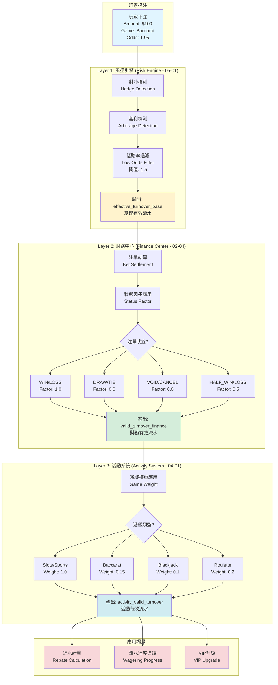

---

## 2. 完整時序圖

### 2.1 流水計算完整時序 (End-to-End Turnover Calculation Sequence)

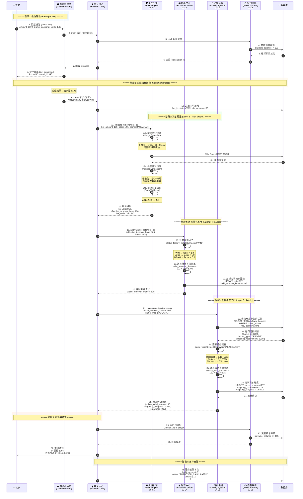

---

## 3. 詳細流程圖

### 3.1 流水計算主流程 (Main Turnover Calculation Flow)

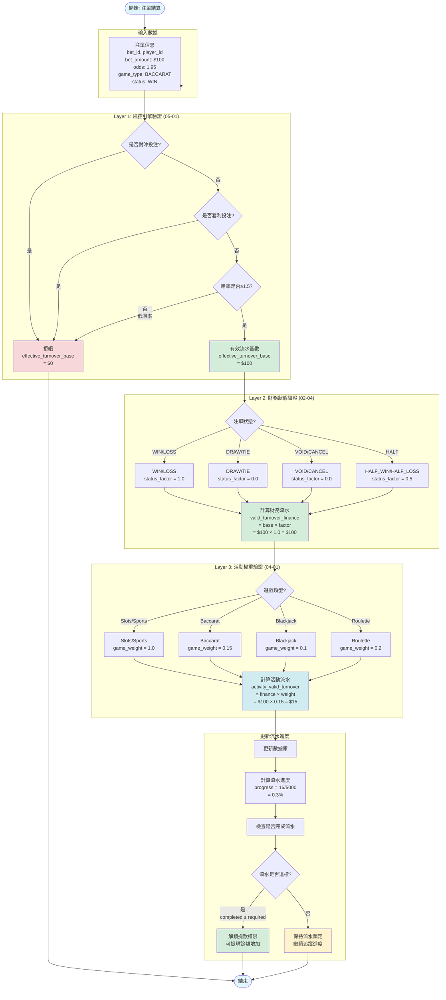

---

## 4. Layer 1: 風控驗證流程

### 4.1 對沖檢測流程 (Hedge Detection Flow)

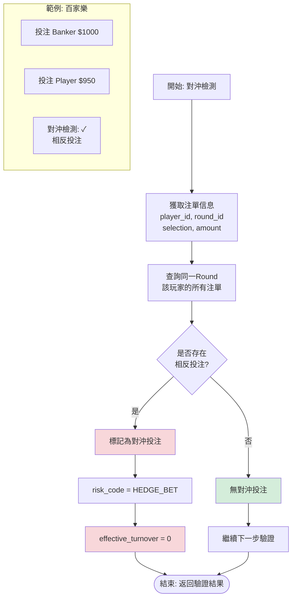

### 4.2 賠率閾值檢測 (Odds Threshold Check)

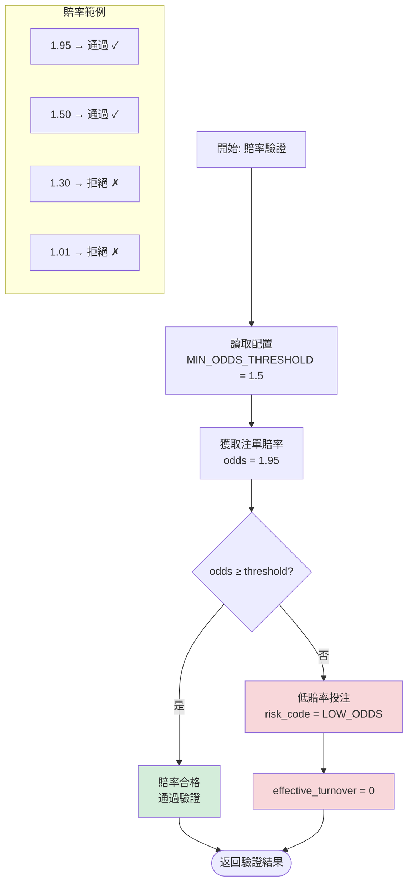

---

## 5. Layer 2: 財務驗證流程

### 5.1 狀態因子應用流程 (Status Factor Application)

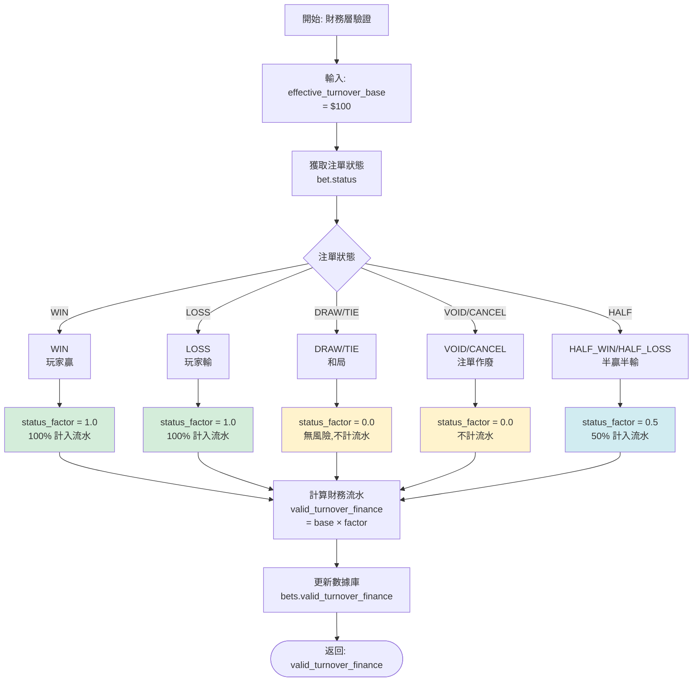

### 5.2 狀態因子對照表

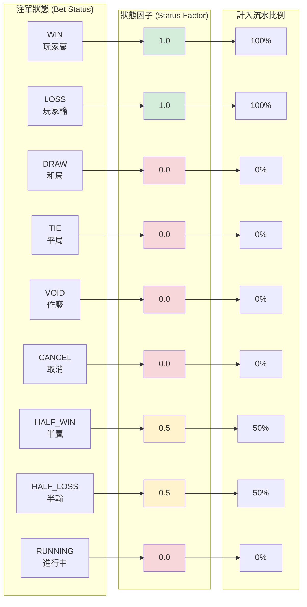

---

## 6. Layer 3: 活動驗證流程

### 6.1 遊戲權重應用流程 (Game Weight Application)

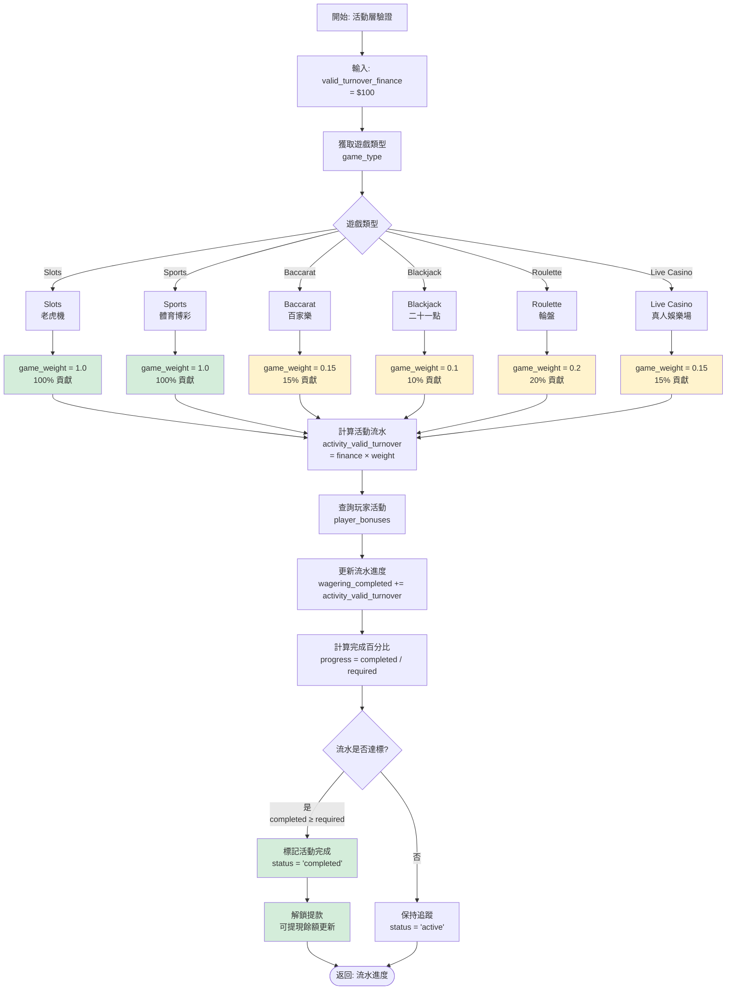

### 6.2 遊戲權重配置表

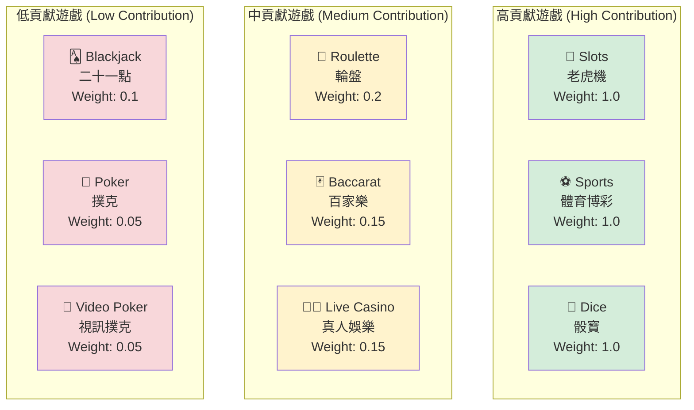

---

## 7. 注單狀態機

### 7.1 注單生命週期 (Bet Lifecycle State Machine)

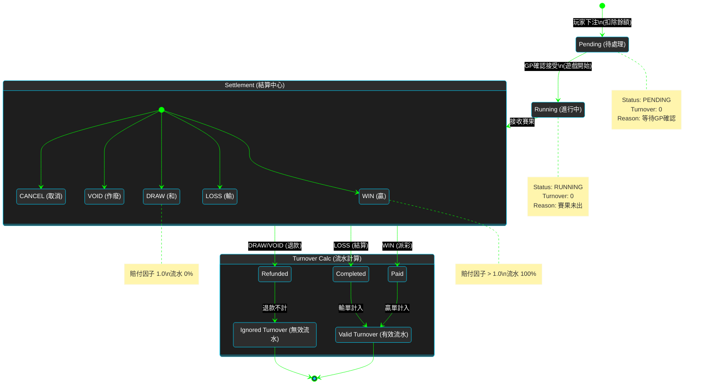

---

## 8. 實際計算範例

### 8.1 範例1: 百家樂投注 (Baccarat Bet)

**場景**: 玩家參與「首存100%紅利」活動，需完成 5x 流水要求 (Wagering Requirement)。

**投注詳情**:
- **存款金額**: $1,000
- **紅利金額**: $1,000 (100% Match)
- **流水要求**: ($1,000 + $1,000) × 5 = **$10,000**
- **當前投注**: 百家樂投注 $100，賠率 1.95，結果 WIN

**計算流程**:

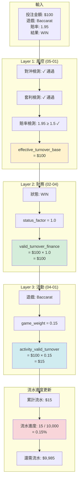

**結論**:
- ✅ 風控驗證通過
- ✅ 財務流水: $100
- ⚠️ 活動流水: $15 (僅15%貢獻)
- ⚠️ 需要更多投注才能完成流水要求

---

### 8.2 範例2: 老虎機投注 (Slots Bet)

**場景**: 同一玩家改玩老虎機，期望更快完成流水。

**投注詳情**:
- **當前流水進度**: $15 / $10,000 (0.15%)
- **當前投注**: 老虎機投注 $100，結果 LOSS

**計算流程**:

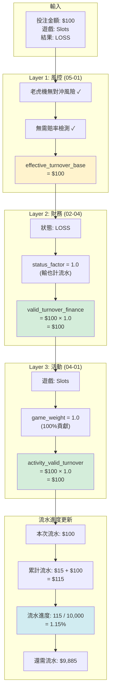

**對比分析**:

| 維度 | 百家樂 (Baccarat) | 老虎機 (Slots) |
|------|------------------|---------------|
| 投注金額 | $100 | $100 |
| 風控驗證 | 需檢查對沖/賠率 | 簡化驗證 |
| 財務流水 | $100 | $100 |
| 遊戲權重 | 0.15 (15%) | 1.0 (100%) |
| **活動流水** | **$15** | **$100** |
| 流水效率 | 低 (6.67倍投注才完成) | 高 (1倍投注完成) |

**結論**:
- ✅ 老虎機流水貢獻率高 (100%)
- ✅ 適合快速完成流水要求
- ⚠️ 但老虎機 RTP 較高，玩家期望值更好

---

### 8.3 範例3: 對沖投注被拒 (Hedge Bet Rejected)

**場景**: 玩家嘗試在同一局百家樂同時投注 Banker 和 Player。

**投注詳情**:
- **投注1**: Banker $1,000 (賠率 1.95)
- **投注2**: Player $950 (賠率 2.00)
- **遊戲結果**: Banker 贏

**計算流程**:

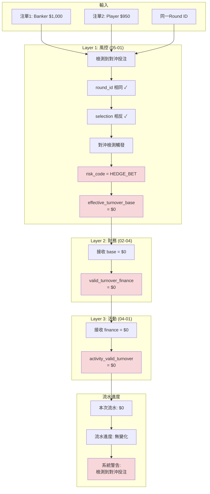

**風控邏輯**:
```python
# 偽代碼: 對沖檢測
def detect_hedge_bet(bet: Bet) -> bool:
    # 查詢同一局的其他投注
    other_bets = query_bets_by_round(bet.round_id, bet.player_id)

    for other_bet in other_bets:
        if is_opposite_selection(bet.selection, other_bet.selection):
            # 檢測到相反投注
            if is_hedge_pattern(bet.amount, other_bet.amount, bet.odds, other_bet.odds):
                return True  # 對沖投注

    return False  # 無對沖

def is_hedge_pattern(amount1, amount2, odds1, odds2) -> bool:
    # 檢查是否為無風險套利
    expected_return_1 = amount1 * odds1
    expected_return_2 = amount2 * odds2
    total_stake = amount1 + amount2

    # 如果任一結果都能保本或盈利,則為對沖
    if expected_return_1 >= total_stake and expected_return_2 >= total_stake:
        return True

    # 或者損失極小 (< 5%)
    min_return = min(expected_return_1, expected_return_2)
    loss_rate = (total_stake - min_return) / total_stake

    return loss_rate < 0.05  # 損失小於5%視為對沖
```

**結論**:
- ❌ 對沖投注被風控拒絕
- ❌ 兩筆投注流水均為 $0
- ⚠️ 可能觸發風控標籤 (Risk Tag: HEDGE_BETTOR)

---

## 9. 總結

### 9.1 核心設計原則

1. **三層驗證架構** (Three-Layer Architecture)
   - Layer 1 (風控): 過濾惡意行為
   - Layer 2 (財務): 確保財務準確性
   - Layer 3 (活動): 應用業務規則

2. **單一數據源** (Single Source of Truth)
   - 05-01 風控系統是風險驗證的權威來源
   - 其他模塊通過 API 調用,不重複實現邏輯

3. **關注點分離** (Separation of Concerns)
   - 風控關注: 對沖、套利、賠率
   - 財務關注: 注單狀態
   - 活動關注: 遊戲權重

### 9.2 關鍵指標

| 指標 | 定義 | 計算公式 |
|------|------|---------|
| **effective_turnover_base** | 風控有效流水 | 通過風控驗證的投注金額 |
| **valid_turnover_finance** | 財務有效流水 | base × status_factor |
| **activity_valid_turnover** | 活動有效流水 | finance × game_weight |
| **wagering_progress** | 流水完成進度 | completed / required × 100% |

### 9.3 常見問題 (FAQ)

**Q1: 為什麼 DRAW/TIE 不計流水?**
- A: 和局時玩家本金返還,無實際風險,因此不計入流水要求。

**Q2: 為什麼百家樂權重只有15%?**
- A: 百家樂 RTP 高 (98.94%),平台風險低,為防止流水濫用,降低權重。

**Q3: 對沖投注如何檢測?**
- A: 系統檢查同一玩家在同一局遊戲中是否有相反投注 (如同時投注 Banker/Player)。

**Q4: 流水計算是實時的嗎?**
- A: 是的,每筆注單結算後立即計算流水並更新進度。

---

## 📚 相關文檔

### 核心參考
- [05-01 風控系統](IGaming需求框架/05_Risk_Management/05-01_Risk_Control_System.md) - Layer 1 基礎驗證
- [02-04 流水與對帳](IGaming需求框架/02_Finance_Center/02-04_Turnover_and_Game_Reconciliation_Analysis.md) - Layer 2 狀態因子
- [04-01 活動系統](IGaming需求框架/04_Activity_Center/04-01_Activity_System_Design.md) - Layer 3 遊戲權重

### 相關系統
- [02-06 統一錢包](IGaming需求框架/02_Finance_Center/02-06_Unified_Wallet_Model.md) - 流水鎖定機制
- [03-01 遊戲整合](IGaming需求框架/03_Game_Center/03-01_Game_Integration_Standard.md) - 注單結算流程

---

**文檔版本**: 1.0.0
**創建日期**: 2026-01-27
**維護團隊**: Product Team & Tech Architecture Team
