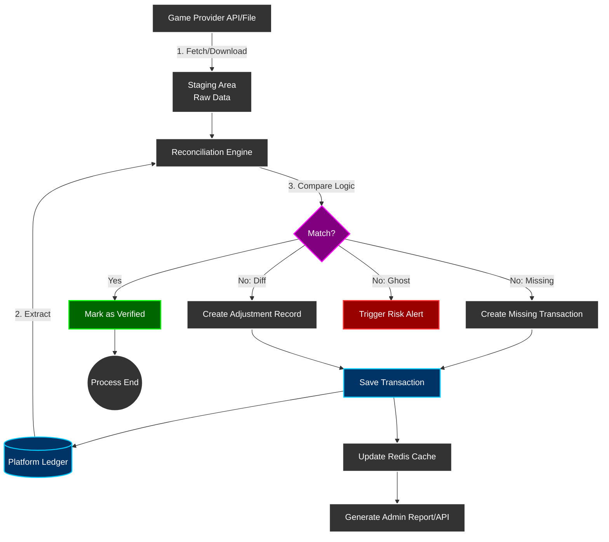
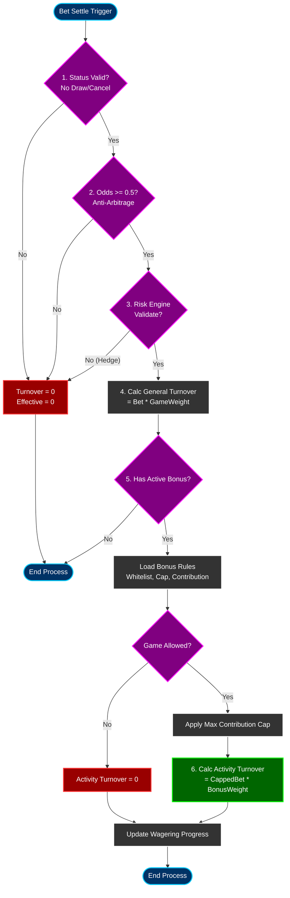

# 02-04 流水計算與遊戲對帳分析 (Turnover & Game Reconciliation Analysis)

> **三層風控架構定位**: **Layer 2 - 財務狀態因子**
> 本模塊負責根據遊戲結果 (WIN/LOSS/DRAW) 計算有效流水的狀態因子。
> 需依賴 Layer 1 (05-01) 完成風控驗證後才執行。
> 完整架構參見: [00-00 文檔地圖 §流水計算邏輯](../00_Concept_&_Analysis/00-00_Document_Map.md#-流水計算邏輯)

本文件詳細定義「有效流水 (Valid Turnover)」的計算邏輯以及「遊戲商對帳 (Game Reconciliation)」的完整流程，確保數據精確度與資金安全。

## 📚 補充資料

本文件提供流水計算的核心規則與業務邏輯。如需查看詳細的技術實作、流程圖與時序圖，請參考以下補充文檔：

- [流程圖與時序圖](./02-04-diagrams/02-04-01_Flowcharts_and_Sequences.md) - Mermaid 圖表、系統互動時序圖
- [計算邏輯詳解](./02-04-diagrams/02-04-02_Calculation_Logic.md) - 詳細計算流程、邊界條件處理
- [實作細節與代碼](./02-04-diagrams/02-04-03_Implementation_Details.md) - 代碼範例、資料庫設計、API 介面

## 1. 流水計算邏輯 (Turnover Calculation Logic)

### 1.1 有效流水定義
**核心原則**：僅計算「產生輸贏結果」、「具備風險」且「通過風控驗證」的注單。
公式：`ValidTurnover = BetAmount * GameWeight * OddsFactor * StatusFactor * RiskFactor`
- **RiskFactor**: `1` (Pass) 或 `0` (Reject, e.g. Hedge/Arbitrage)

### 1.2 狀態判定 (Status Factor) - Layer 2 核心邏輯

**前置條件**: ✅ 必須先通過 Layer 1 風控驗證 (05-01 §3.1 ValidateBet)

並非所有下注都算流水，需根據遊戲結果進行過濾：

| 狀態 (Status) | 描述 | 流水計算 | 備註 |
| :--- | :--- | :--- | :--- |
| **WIN** | 玩家贏 | 100% | 正常計算 |
| **LOSS** | 玩家輸 | 100% | 正常計算 |
| **DRAW / TIE** | 和局/走水 | **0%** | 無風險，不計流水 |
| **CANCEL / VOID** | 取消/作廢 | **0%** | 注單無效 |
| **HALF WIN** | 贏半 | **100%** | ✅ 標準本金法 (v2.0.0 推薦) |
| **HALF LOSS** | 輸半 | **100%** | ✅ 標準本金法 (v2.0.0 推薦) |
| **RUNNING** | 進行中 | 0% | 必須等待結算 (Settled) 後才計算 |

> **v2.0.0 重要變更 (2026-01-28)**:
> - **HALF_WIN/HALF_LOSS 現在計入 100% 流水** (採用標準本金法)
> - **「實際風險法」(50% 計算) 已廢棄** - 違反公平性原則
> - **理由**: 相同投注行為應有相同流水貢獻,與風控鎖定邏輯一致
> - **詳細分析**: [體育博彩 Valid Bet 計算邏輯](../seamless_wallet_analysis/03_sports_betting_valid_bet_logic.md)

### 1.3 賠率門檻 (Odds Factor)
避免玩家透過低風險投注 (Low Risk Betting) 洗水。

- **體育博彩要求**：
    - **歐洲盤 (Decimal)**: >= 1.5 (或 1.7，視配置)
    - **香港盤 (HK)**: >= 0.5 (或 0.7)
    - **馬來盤 (MY)**: 絕對值 > 0.5 (負盤全算)
    - **印尼盤 (ID)**: <= -1.2 (輸得更多) 或 >= 1.2

- **邏輯實作**：
  ```python
  if odds_type == 'EUR' and odds < 1.5:
      return 0
  elif odds_type == 'HK' and odds < 0.5:
      return 0
  else:
      return bet_amount
  ```

### 1.4 遊戲權重 (Game Contribution Weight)
不同遊戲類型的「刷水難度」不同，需設置權重。

| 遊戲類型 | 權重 | 說明 |
| :--- | :--- | :--- |
| **Slots (老虎機)** | 100% | 純機率，適合洗水 |
| **Live (真人)** | 10-50% | 視運營策略，百家樂通常較低 |
| **Sports (體育)** | 100% | 風險高 |
| **Lottery (彩票)** | 10-20% | 雙面盤 (大小單雙) 容易對押 |
| **PVP (棋牌/對戰)** | 0% | 通常不計，因涉及玩家間轉移 |

### 1.5 活動流水特別計算 (Activity Wagering Calculation)
區別於一般「有效流水 (Valid Turnover)」(用於返水/VIP)，活動流水 (Wagering Requirement) 具有更嚴格的限制與計算規則。

- **區別定義**：
    - **General Turnover**：全站通用，門檻低 (e.g. 賠率 0.5 以上即算)。
    - **Activity Wagering**：僅針對特定紅利活動，門檻高 (e.g. 僅特定遊戲、賠率 0.7 以上、有最高貢獻上限)。

- **計算公式**：
  `ActivityTurnover = Min(BetAmount, MaxContribution) * GameContribution%`

- **關鍵邏輯**：
  1.  **遊戲白名單 (Whitelist)**：若遊戲不在該活動允許列表中，貢獻度強制為 0% (甚至禁止遊玩)。
  2.  **單筆貢獻上限 (Max Contribution Cap)**：例如「每筆注單最多僅計算 $5 流水」。防止玩家用 $1000 一注梭哈快速解鎖。
  3.  **多重活動優先級 (Multiple Bonus Priority)**：
      - 若玩家同時參加 A 活動 (存送) 與 B 活動 (救援金)。
      - **FIFO 原則**：流水優先填補「最早領取」的活動。
      - **鎖定原則**：或者依據「資金鎖定」順序，先解鎖現金錢包綁定的活動。

- **狀態流轉**：
  `Pending` (進行中) -> `Completed` (流水達標，餘額解鎖 -> Cash)
  `Pending` -> `Expired` (過期，扣除 Bonus 與 Win)

---

## 1.6 免費旋轉流水計算 (Free Spins Turnover Calculation) ✅ v2.0.0

### 1.6.1 核心原則

**關鍵概念**: 免費旋轉的 **Turnover** 與 **Valid Bet** 必須分開處理,用途完全不同。

| 指標 | 定義 | 計算方式 | 用途 |
|------|------|---------|------|
| **Turnover** | 遊戲中流動的金額總和 | **免費旋轉面額總和** | 財務報表、GGR 計算 |
| **Valid Bet** | 計入流水要求的金額 | **0 (不計入)** | 優惠活動、返水計算 |

**為何 Turnover ≠ 0？**
```
場景: 贈送 10 次免費旋轉，每次面額 $1
遊戲結果: 玩家贏了 $8.50

❌ 錯誤計算 (Turnover = 0):
  Turnover = $0
  Payout = $8.50
  GGR = $0 - $8.50 = -$8.50  ← 看起來像虧損

✅ 正確計算 (Turnover = 面額總和):
  Turnover = $10.00
  Payout = $8.50
  GGR = $10.00 - $8.50 = $1.50  ← 促銷淨成本
```

### 1.6.2 業界標準

所有主流遊戲供應商均採用此邏輯:

| 供應商 | Turnover | Valid Bet | 依據 |
|-------|----------|-----------|------|
| **Evolution Gaming** | ✅ 面額總和 | 0 | 官方 API 文檔 |
| **Pragmatic Play** | ✅ 面額總和 | 0 | 官方 API 文檔 |
| **Hub88 (Aggregator)** | ✅ 面額總和 | 0 | 技術白皮書 |

**上市公司財報範例** (Evolution Gaming Annual Report 2023):
```
"Free spins provided to players are recorded as:
 - Turnover: At the face value of the free spin
 - Payout: At the actual win amount
 - Marketing Expense: Net cost (face value - payout)"
```

### 1.6.3 交易記錄設計

```sql
-- 交易記錄表 (擴展)
CREATE TABLE wallet_transactions (
    transaction_id VARCHAR(128) PRIMARY KEY,
    user_id BIGINT NOT NULL,

    -- 交易類型
    transaction_type ENUM(
        'CASH_BET',           -- 真錢投注
        'FREESPIN_BET',       -- ✅ 免費旋轉投注
        'CASH_WIN',           -- 真錢派彩
        'FREESPIN_WIN'        -- ✅ 免費旋轉派彩
    ) NOT NULL,

    amount DECIMAL(18, 4) NOT NULL,

    -- ✅ 關鍵: 分開記錄
    turnover DECIMAL(18, 4) NOT NULL DEFAULT 0,   -- 計入財務報表
    valid_bet DECIMAL(18, 4) NOT NULL DEFAULT 0,  -- 計入流水要求

    -- 免費旋轉特有欄位
    is_free_spin BOOLEAN DEFAULT FALSE,
    freespin_cost DECIMAL(18, 4),  -- 營運商的成本 (面額)

    INDEX idx_type (transaction_type),
    INDEX idx_freespin (is_free_spin)
);

-- 免費旋轉 Bet 階段記錄範例
INSERT INTO wallet_transactions VALUES (
    'fs_bet_123',
    'FREESPIN_BET',
    1.00,          -- 面額
    1.00,          -- ✅ Turnover = 面額 (計入 GGR)
    0.00,          -- ✅ Valid Bet = 0 (不計入流水要求)
    TRUE,
    1.00
);
```

### 1.6.4 GGR 計算實現

```typescript
/**
 * 計算 GGR (包含免費旋轉成本)
 */
public calculateGGR(date: LocalDate): GgrReport {
    const transactions = this.transactionRepository.findByDate(date);

    let totalTurnover = 0;
    let totalPayout = 0;
    let freespinTurnover = 0;  // 促銷成本追蹤

    for (const tx of transactions) {
        // Turnover 計算 (包含免費旋轉面額)
        if (tx.transactionType.endsWith('_BET')) {
            totalTurnover += tx.turnover;

            if (tx.isFreeRpin) {
                freespinTurnover += tx.turnover;  // ✅ 記錄促銷成本
            }
        }

        // Payout 計算
        if (tx.transactionType.endsWith('_WIN')) {
            totalPayout += tx.amount;
        }
    }

    // GGR = Turnover - Payout
    const ggr = totalTurnover - totalPayout;

    return {
        date,
        totalTurnover,
        freespinTurnover,      // 促銷成本
        cashTurnover: totalTurnover - freespinTurnover,
        totalPayout,
        ggr
    };
}
```

### 1.6.5 關鍵決策總結

✅ **推薦方案**: Turnover = 面額總和, Valid Bet = 0

**理由**:
1. **財務準確性**: 正確反映促銷成本
2. **GGR 計算**: 符合會計準則
3. **業界標準**: 所有主流 GP 都採用此邏輯
4. **上市合規**: 符合財報披露要求

**詳細分析**: [免費旋轉 Turnover 計算邏輯](../seamless_wallet_analysis/04_free_spins_turnover_calculation.md)

---

## 1.7 跨模組流水一致性保障 (Cross-Module Turnover Consistency)

為確保 **Finance System (財務系統, 本文件)** 與 **Activity System (活動系統, 04-01)** 的流水計算一致性,兩者必須共用統一的基礎驗證邏輯。本節定義財務模組在整體流水驗證架構中的角色與責任。

### 1.6.1 三層驗證架構中的財務層定位

財務模組負責 **Layer 2: Status-Based Turnover Adjustment**,在 Risk Engine 基礎驗證之上應用狀態因子 (Status Factor):

```
┌─────────────────────────────────────────────────────────────────┐
│              Unified Turnover Validation Stack                  │
├─────────────────────────────────────────────────────────────────┤
│                                                                 │
│  Layer 1: Base Validation (Risk Engine - 05-01)                │
│  RiskEngine.validateTurnover()                                 │
│  → effective_turnover_base                                     │
│                           ↓                                     │
│  Layer 2: Finance Layer (THIS MODULE - 02-04) ✅               │
│  effective_turnover_base × status_factor                       │
│  → valid_turnover_finance                                      │
│                           ↓                                     │
│  Layer 3: Activity Layer (04-01)                               │
│  valid_turnover_finance × game_weight                          │
│  → activity_valid_turnover                                     │
│                                                                 │
└─────────────────────────────────────────────────────────────────┘
```

### 1.6.2 財務層處理流程 (Finance Layer Processing)

財務模組必須嚴格遵循以下步驟計算有效流水:

**Step 1: 調用基礎驗證 (Call Base Validation)**
```typescript
// MUST call Risk Engine first
const riskValidation = await RiskEngine.validateTurnover({
  bet_id: bet.id,
  player_id: bet.player_id,
  game_type: bet.game_type,
  bet_amount: bet.amount,
  odds: bet.odds,
  odds_type: bet.odds_type
});

if (!riskValidation.is_valid) {
  // Rejected by risk engine (hedge/arbitrage/low odds)
  return {
    valid_turnover_finance: 0,
    rejection_reason: riskValidation.risk_code
  };
}

const effective_turnover_base = riskValidation.effective_turnover_base;
```

**Step 2: 應用狀態因子 (Apply Status Factor)**
```typescript
// Apply status-based adjustment (Finance Layer responsibility)
const status_factor = getStatusFactor(bet.status);
const valid_turnover_finance = effective_turnover_base * status_factor;

function getStatusFactor(status: BetStatus): number {
  const STATUS_FACTORS = {
    'WIN': 1.0,        // Full turnover
    'LOSS': 1.0,       // Full turnover
    'DRAW': 0.0,       // No risk, zero turnover
    'TIE': 0.0,        // Same as DRAW
    'VOID': 0.0,       // Cancelled bet
    'CANCEL': 0.0,     // Cancelled bet
    'HALF_WIN': 1.0,   // ✅ v2.0.0: Full turnover (Fixed Principal Method)
    'HALF_LOSS': 1.0,  // ✅ v2.0.0: Full turnover (Fixed Principal Method)
    'RUNNING': 0.0     // Not settled yet
  };
  return STATUS_FACTORS[status] ?? 0.0;
}
```

**Step 3: 記錄雙層流水 (Record Both Layers)**
```typescript
// Store both base and finance-adjusted turnover
await db.transaction(async (tx) => {
  await tx.insertInto('bet_turnover_record').values({
    bet_id: bet.id,
    player_id: bet.player_id,
    effective_turnover_base: effective_turnover_base,  // From Risk Engine
    status_factor: status_factor,                      // Finance adjustment
    valid_turnover_finance: valid_turnover_finance,    // Final result
    risk_code: riskValidation.risk_code,
    calculated_at: new Date()
  });
});
```

### 1.6.3 與活動系統的數據交換 (Data Exchange with Activity System)

財務模組計算完成後,需將 `valid_turnover_finance` 發布至事件總線供活動系統使用:

```typescript
// Publish finance turnover result to Kafka
await kafkaProducer.send({
  topic: 'finance.turnover.calculated',
  messages: [{
    key: bet.player_id,
    value: JSON.stringify({
      bet_id: bet.id,
      player_id: bet.player_id,
      game_type: bet.game_type,
      effective_turnover_base: effective_turnover_base,
      valid_turnover_finance: valid_turnover_finance,
      status: bet.status,
      status_factor: status_factor,
      timestamp: new Date().toISOString()
    })
  }]
});
```

**活動系統訂閱此事件**後,在 `valid_turnover_finance` 基礎上應用遊戲權重 (Game Weight):
```typescript
// Activity System consumes this event
const activity_valid_turnover = message.valid_turnover_finance * GAME_WEIGHTS[message.game_type];
```

### 1.6.4 每日對帳驗證程序 (Daily Reconciliation Procedure)

**執行時間**: 每日凌晨 03:00 (UTC+8)

**對帳邏輯**:
1. **財務內部一致性檢查** (Finance Internal Check):
   ```sql
   -- Verify all settled bets have turnover records
   SELECT b.id, b.player_id, b.amount, b.status
   FROM bets b
   LEFT JOIN bet_turnover_record t ON b.id = t.bet_id
   WHERE b.status IN ('WIN', 'LOSS', 'DRAW')
     AND b.settled_at BETWEEN '2026-01-26 00:00:00' AND '2026-01-27 00:00:00'
     AND t.bet_id IS NULL;  -- Missing turnover record
   ```

2. **跨模組一致性檢查** (Cross-Module Consistency Check):
   ```sql
   -- Compare Finance vs Activity calculations
   SELECT
     f.player_id,
     f.date,
     SUM(f.valid_turnover_finance) AS finance_total,
     SUM(a.activity_valid_turnover) AS activity_total,
     SUM(a.activity_valid_turnover) / NULLIF(SUM(f.valid_turnover_finance), 0) AS actual_ratio,
     AVG(g.game_weight) AS expected_ratio,
     ABS(SUM(a.activity_valid_turnover) - SUM(f.valid_turnover_finance * g.game_weight)) AS deviation
   FROM finance_turnover_daily f
   JOIN activity_turnover_daily a ON f.player_id = a.player_id AND f.date = a.date
   JOIN game_weights g ON a.game_type = g.game_type
   WHERE f.date = CURRENT_DATE - 1
   GROUP BY f.player_id, f.date
   HAVING deviation > (SUM(f.valid_turnover_finance) * 0.0001)  -- 0.01% threshold
   ORDER BY deviation DESC;
   ```

3. **異常處理流程** (Exception Handling):
   - **偏差 <0.01%**: 自動標記為已驗證 (Auto-verified)
   - **偏差 0.01%-1%**: 發送警報至 Slack #finance-ops 頻道
   - **偏差 >1%**: 觸發 PagerDuty 緊急警報,需立即人工介入

4. **對帳報告生成** (Reconciliation Report):
   ```typescript
   interface DailyReconciliationReport {
     date: string;
     total_bets_processed: number;
     total_finance_turnover: number;
     total_activity_turnover: number;
     expected_ratio: number;
     actual_ratio: number;
     deviation_percentage: number;
     mismatched_players: {
       player_id: string;
       finance_turnover: number;
       activity_turnover: number;
       deviation: number;
     }[];
     status: 'VERIFIED' | 'WARNING' | 'CRITICAL';
   }
   ```

### 1.6.5 配置同步要求 (Configuration Synchronization)

財務模組與活動模組必須從 **統一配置中心 (Unified Config Service)** 讀取以下參數,禁止本地硬編碼:

1. **賠率門檻 (Odds Thresholds)** - 由 Risk Engine 定義,財務模組需遵守:
   ```json
   {
     "odds_thresholds": {
       "EUR": 1.5,  // European decimal odds
       "HK": 0.5,   // Hong Kong odds
       "MY": 0.5,   // Malay odds
       "ID": 1.2    // Indonesian odds
     }
   }
   ```

2. **遊戲權重表 (Game Weights)** - 由活動模組定義,財務模組需知曉用於驗證:
   ```json
   {
     "game_weights": {
       "SLOTS": 1.0,
       "SPORTS": 1.0,
       "BACCARAT": 0.15,
       "BLACKJACK": 0.10,
       "ROULETTE": 0.20,
       "VIDEO_POKER": 0.15,
       "LOTTERY": 0.10,
       "PVP": 0.0
     }
   }
   ```

3. **狀態因子表 (Status Factors)** - 由財務模組定義與維護:
   ```json
   {
     "status_factors": {
       "WIN": 1.0,
       "LOSS": 1.0,
       "DRAW": 0.0,
       "TIE": 0.0,
       "VOID": 0.0,
       "CANCEL": 0.0,
       "HALF_WIN": 0.5,
       "HALF_LOSS": 0.5,
       "RUNNING": 0.0
     }
   }
   ```

### 1.6.6 監控指標與 SLA (Monitoring Metrics & SLA)

**關鍵監控指標**:
- `finance.turnover.calculation.latency_p99` < 100ms
- `finance.turnover.risk_engine.call.success_rate` > 99.9%
- `finance.turnover.daily_reconciliation.deviation_rate` < 0.01%
- `finance.turnover.event_publish.success_rate` > 99.99%

**警報規則**:
```yaml
alerts:
  - name: turnover_calculation_latency_high
    condition: finance.turnover.calculation.latency_p99 > 500ms
    severity: WARNING
    notify: slack:#finance-ops

  - name: risk_engine_call_failure
    condition: finance.turnover.risk_engine.call.success_rate < 99%
    severity: CRITICAL
    notify: pagerduty:finance-oncall

  - name: daily_reconciliation_deviation
    condition: finance.turnover.daily_reconciliation.deviation_rate > 0.01
    severity: WARNING
    notify: slack:#finance-ops, email:finance-team@company.com

  - name: event_publish_failure
    condition: finance.turnover.event_publish.success_rate < 99.9
    severity: CRITICAL
    notify: pagerduty:finance-oncall
```

---

## 2. 遊戲對帳計算邏輯 (Game Reconciliation Logic)

遊戲對帳旨在解決「平台資料庫」與「遊戲商 (GP) 紀錄」不一致的問題。

### 2.1 三層對帳體系 (Three-Layer Reconciliation)

#### **Layer 1: 即時串流對帳 (Real-time Stream Check)**
- **時機**：每次收到 `GameEnd` 或 `Settlement` Webhook 後 1-5 分鐘。
- **機制**：
    - 透過 GP API 查詢單筆詳情 (`GetTransactionStatus`)。
    - 比對 `Amount`, `Status`, `WinLoss`。
    - **目的**：快速修復即時掉單 (Latency Issue)。

#### **Layer 2: 準即時週期對帳 (Near Real-time Batch)**
- **時機**：每 10-30 分鐘執行一次。
- **機制**：
    - 呼叫 GP 的 `FetchHistory` API (依時間區間 Time Range)。
    - 拉取過去 30 分鐘的所有注單。
    - 與 DB 進行 `Anti-Join` (找出 GP 有但 DB 無的單)。
    - **目的**：補錄 Callback 丟失的注單 (Self-Healing)。

#### **Layer 3: T+1 全量日結對帳 (Daily Final Settlement)**
- **時機**：每日凌晨 (e.g. 02:00)，GP 產出昨日完整報表後。
- **機制**：
    - 下載 GP 提供的 Settlement Files (CSV/XML/JSON)。
    - 將數據載入 Staging Table。
    - 執行 `Full Outer Join` 比對：
        1.  **GP 有，DB 無** -> 補單 (Recover)。
        2.  **GP 無，DB 有** -> 標記異常 (Invaild/Rollback)，需人工確認是否扣錯款。
        3.  **金額不符** -> 產出 `<DiffReport>`, 以 GP 最終結算金額為準進行調帳 (Adjustment)。

### 2.2 異常處理矩陣
| 異常情境 | 系統行為 | 處置方式 |
| :--- | :--- | :--- |
| **補單 (Recover)** | 發現 GP 有單但 DB 無 | 自動建立注單，補扣/補發金額，記錄 Source="Reconciliation" |
| **金額差異 (Diff)** | 雙方金額不一致 | 若差異 < 容差 (e.g. 0.01)，自動平帳；否則 Alert |
| **狀態衝突 (Conflict)** | DB=Win, GP=Loss | 以 **GP 報表** 為準，執行 `Reverse + Re-settle` |
| **幽靈單 (Ghost)** | DB 有單，GP 查無 | 極度危險 (可能是駭客注入)。**凍結帳號**，人工查核。 |

## 3. 對帳數據流向圖 (Data Flow)



---

## 4. 流水計算流程圖 (Turnover Calculation Flow)

此圖展示單筆注單如何同時計算「一般流水」與「活動流水」。



---

**文檔版本**: 1.0.0
**最後更新**: 2026-01-28
**維護團隊**: Finance Team & Backend Team
