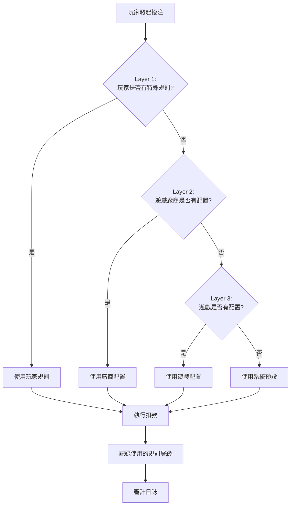
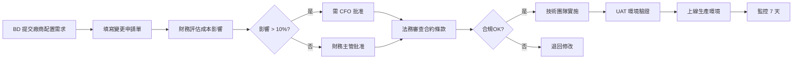
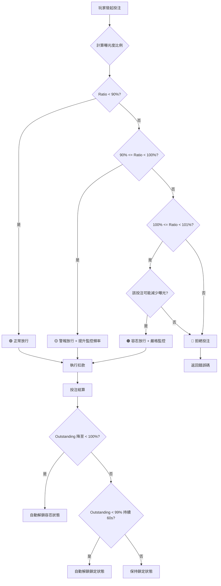

# 02-06 統一錢包模型 (Unified Wallet Model)

## 1. 系統概述 (System Overview)

為了解決「現金網 (Cash Market)」與「信用網 (Credit Network)」在同一平台共存的架構衝突，本模組定義了 **"統一錢包 (Unified Wallet)"** 模型。
此模型將玩家的所有資產與負債標準化為統一的數據結構，確保 **交易處理 (Transaction Processing)**、**風控 (Risk)** 與 **財務對帳 (Reconciliation)** 能透過一套邏輯同時處理兩種模式。

---

## 2. 核心概念模型 (Core Concept Model)

### 2.1 資產 vs 負債 (Asset vs Liability)

系統將錢包餘額分為兩大類屬性：

| 屬性 | 類型 | 定義 | 數學符號 | 例子 |
| :--- | :--- | :--- | :--- | :--- |
| **Cash Balance** | Asset | 玩家擁有的真實資金，可自由提款。 | `(+)` | USDT 充值、現金網贏利 |
| **Bonus Balance** | Asset (Locked) | 玩家擁有的資金，但被鎖定需完成流水。 | `(+)` | 首存紅利、救援金 |
| **Credit Limit** | Liability Cap | 代理授予的透支權限 (不可提款)。 | `(Limit)` | 信用網額度 |
| **Outstanding** | Liability | 玩家已使用的信用額度 (對平台的負債)。 | `(-)` | 信用網輸錢 |

### 2.2 統一餘額公式 (Unified Balance Formula)

前往遊戲大廳時，玩家的 **"可下注餘額 (Playable Balance)"** 計算如下：

```math
Playable Balance = (Cash + Bonus) + (Credit Limit - Outstanding)
```

*   **Cash Mode 玩家**：Credit Limit = 0, Playable = Cash + Bonus
*   **Credit Mode 玩家**：Cash = 0, Playable = Available Credit
*   **Hybrid Mode 玩家**：同時擁有現金與額度 (較少見，但系統需支援)。

---

## 3. 交易扣款邏輯 (Deduction Logic)

當玩家下注 $100 時，系統需依據 **"資金優先級 (Fund Priority)"** 決定扣除哪部分的餘額。

### 3.1 優先級配置 (Priority Configuration)

**系統預設優先級**: **Bonus -> Cash -> Credit**

**配置層級** (優先級從高到低):
1.  **玩家特殊規則** (Player-Specific Rules): VIP 玩家、活動參與者可擁有自定義扣款順序
2.  **遊戲廠商配置** (Game Provider Override): 特定遊戲廠商可配置自定義順序
3.  **遊戲配置** (Game Configuration): 單一遊戲可覆蓋預設規則
4.  **系統預設** (System Default): 如無特殊配置，使用 Bonus -> Cash -> Credit

#### 四層優先級業務邏輯說明 (Business Logic Explanation)

**Why (為什麼需要四層配置)?**

iGaming 平台需要同時滿足以下互相衝突的業務需求：
- **監管合規**: 不同地區要求紅利必須優先使用 (防洗錢)
- **玩家體驗**: VIP 玩家期望靈活選擇資金使用順序
- **運營策略**: 特定遊戲需要引導玩家使用特定資金類型 (提升流水/黏著度)
- **廠商要求**: 部分遊戲廠商合約規定特定扣款邏輯

**四層配置**允許系統在**全局合規基線**與**個性化靈活性**之間取得平衡。

---

**What (每層配置解決什麼問題)?**

| 層級 | 解決的問題 | 覆蓋範圍 | 典型使用者 | 更新頻率 |
|------|-----------|---------|----------|---------|
| **Layer 1: 玩家規則** | 個性化權益保護 | 單一玩家 | 產品經理 (VIP 特權設計) | 低頻 (活動期間) |
| **Layer 2: 廠商配置** | 廠商合約合規 | 特定廠商的所有遊戲 | 業務拓展團隊 (BD) | 低頻 (簽約時) |
| **Layer 3: 遊戲配置** | 遊戲玩法適配 | 單一遊戲 | 遊戲運營團隊 | 中頻 (每季度) |
| **Layer 4: 系統預設** | 全局合規基線 | 所有玩家/遊戲 | 技術架構師 | 極低頻 (幾乎不變) |

---

**How (如何決策使用哪層配置)?**

**決策樹 (Decision Tree)**:



**配置優先級範例**:

*   **範例 1: VIP 玩家 + 老虎機遊戲**
    - 玩家 ID 12345 (VIP Level 5) 玩 "Mega Fortune" (老虎機)
    - Layer 1 檢查: VIP 規則存在 → `Credit -> Cash -> Bonus` ✅
    - **最終使用**: Layer 1 (玩家規則優先)
    - **業務原因**: VIP 玩家可優先使用信用額度,保留現金提款權益

*   **範例 2: 普通玩家 + Evolution Gaming 遊戲**
    - 玩家 ID 67890 (普通會員) 玩 "Crazy Time" (Evolution Gaming 真人遊戲)
    - Layer 1 檢查: 無 VIP 規則 ❌
    - Layer 2 檢查: Evolution Gaming 廠商配置存在 → `Bonus -> Cash -> Credit` ✅
    - **最終使用**: Layer 2 (廠商配置)
    - **業務原因**: Evolution Gaming 合約要求優先消耗紅利 (降低營運成本)

*   **範例 3: 普通玩家 + 新上線遊戲**
    - 玩家 ID 11111 (普通會員) 玩 "新遊戲 ABC" (無特殊配置)
    - Layer 1 檢查: 無 VIP 規則 ❌
    - Layer 2 檢查: 該廠商無配置 ❌
    - Layer 3 檢查: 遊戲無配置 ❌
    - **最終使用**: Layer 4 (系統預設) → `Bonus -> Cash -> Credit`
    - **業務原因**: 默認合規策略 - 優先消耗紅利 (符合反洗錢要求)

---

#### 四層配置的業務場景詳解 (Detailed Business Scenarios)

**Layer 1: 玩家特殊規則 (Player-Specific Rules)**

**業務場景**:
1. **VIP 玩家特權** (VIP Privileges)
   - 問題: VIP 玩家期望保留現金靈活性,優先使用信用額度
   - 配置: `Credit -> Cash -> Bonus`
   - 收益: 提升 VIP 滿意度,降低流失率 (Churn Rate)

2. **活動參與者特殊處理** (Event Participants)
   - 問題: 參與「首存雙倍紅利」活動的玩家需優先消耗紅利
   - 配置: `Bonus -> Cash -> Credit`
   - 收益: 確保玩家完成流水要求,降低紅利濫用風險

3. **高風險玩家限制** (High-Risk Player Restrictions)
   - 問題: 疑似洗錢玩家需限制信用額度使用
   - 配置: `Cash -> Bonus -> Credit` (禁用 Credit)
   - 收益: 降低資金風險曝光,符合 AML 要求

**配置方式**:
```sql
INSERT INTO t_player_deduction_rule (
    player_id, sequence, priority_level, reason, valid_from, valid_until
) VALUES (
    12345, 'CREDIT,CASH,BONUS', 1, 'VIP_LEVEL_5_PRIVILEGE', NOW(), '2026-12-31'
);
```

---

**Layer 2: 遊戲廠商配置 (Game Provider Override)**

**業務場景**:
1. **廠商成本優化** (Provider Cost Optimization)
   - 問題: Evolution Gaming 合約規定紅利投注的分潤比例較低
   - 配置: `Bonus -> Cash -> Credit` (優先消耗紅利)
   - 收益: 降低廠商分潤成本 15-20%

2. **廠商技術限制** (Provider Technical Constraints)
   - 問題: 某廠商系統不支持 Credit 模式
   - 配置: `Cash -> Bonus` (移除 Credit)
   - 收益: 避免技術集成問題

3. **地區合規要求** (Regional Compliance)
   - 問題: 特定廠商僅授權在現金模式下運營
   - 配置: `Cash Only`
   - 收益: 符合廠商授權合約

**配置方式**:
```sql
INSERT INTO t_provider_deduction_rule (
    provider_id, provider_name, sequence, reason, effective_date
) VALUES (
    'EVO', 'Evolution Gaming', 'BONUS,CASH,CREDIT',
    'Contract Clause 3.2: Bonus Bet MDR 12% vs Cash Bet MDR 18%',
    '2026-01-01'
);
```

---

**Layer 3: 遊戲配置 (Game Configuration)**

**業務場景**:
1. **老虎機流水策略** (Slot Turnover Strategy)
   - 問題: 老虎機需提升真實流水 (Turnover) 指標
   - 配置: `Cash -> Bonus -> Credit` (優先扣現金)
   - 收益: 提升 GGR (Gross Gaming Revenue) 15%

2. **真人遊戲風控** (Live Casino Risk Control)
   - 問題: 真人遊戲作弊風險高,需限制信用額度
   - 配置: `Cash -> Bonus` (禁用 Credit)
   - 收益: 降低資金風險

3. **新遊戲推廣** (New Game Promotion)
   - 問題: 新遊戲需引導玩家使用紅利參與
   - 配置: `Bonus -> Cash -> Credit`
   - 收益: 提升新遊戲參與率 30%

**配置方式**:
```sql
INSERT INTO t_game_deduction_rule (
    game_code, game_name, sequence, reason, campaign_id
) VALUES (
    'SLOT_MEGA_FORTUNE', 'Mega Fortune (NetEnt)', 'CASH,BONUS,CREDIT',
    '提升真實流水策略 - 2026Q1',
    'CAMPAIGN_2026Q1_001'
);
```

---

**Layer 4: 系統預設 (System Default)**

**業務場景**:
1. **全局合規基線** (Global Compliance Baseline)
   - 問題: 確保所有未配置情況符合反洗錢要求
   - 配置: `Bonus -> Cash -> Credit`
   - 收益: 降低監管風險,通過合規審計

2. **技術穩定性保障** (Technical Stability)
   - 問題: 特殊配置失效時需要穩定的降級方案
   - 配置: 不可變的系統預設
   - 收益: 避免配置錯誤導致的資金異常

**配置方式** (代碼層面硬編碼):
```java
public static final DeductionSequence DEFAULT_SEQUENCE =
    DeductionSequence.of(FundType.BONUS, FundType.CASH, FundType.CREDIT);
```

---

#### 配置變更審批流程 (Configuration Change Approval)

**為什麼需要審批流程?**
- 扣款順序直接影響玩家權益與資金安全
- 錯誤配置可能導致監管合規風險
- 需要財務、風控、技術多團隊協同決策

**審批矩陣**:

| 配置層級 | 審批流程 | 審批者 | SLA | 風險評估 |
|---------|---------|-------|-----|---------|
| **Layer 1 (玩家)** | 產品經理 → 風控主管 | PM + Risk Manager | 2 工作日 | 中風險 (影響單一玩家) |
| **Layer 2 (廠商)** | BD → 財務 → 法務 | BD + CFO + Legal | 5 工作日 | 高風險 (影響所有該廠商玩家) |
| **Layer 3 (遊戲)** | 運營 → 產品 → 風控 | Operations + PM + Risk | 3 工作日 | 中風險 (影響單一遊戲) |
| **Layer 4 (系統)** | 技術架構師 → CTO | Architect + CTO | 10 工作日 | 極高風險 (影響全平台) |

**審批流程圖** (以 Layer 2 為例):



---

#### 配置監控與告警 (Configuration Monitoring)

**監控指標**:

| 指標 | 描述 | 告警閾值 | 業務影響 |
|------|------|---------|---------|
| config_usage_rate_layer1 | Layer 1 使用率 | > 5% 玩家有特殊規則 | 過度個性化可能增加運營複雜度 |
| config_conflict_count | 配置衝突次數 | > 10次/天 | 可能存在配置邏輯錯誤 |
| deduction_failure_rate_by_layer | 各層扣款失敗率 | > 1% | 配置可能導致玩家無法下注 |
| config_change_frequency | 配置變更頻率 | > 20次/週 | 頻繁變更可能影響穩定性 |

**Grafana 儀表板配置**:
```yaml
dashboard:
  panels:
    - title: "Deduction Sequence Usage Distribution"
      type: "pie"
      query: "SELECT sequence, COUNT(*) FROM t_deduction_log GROUP BY sequence"

    - title: "Config Layer Effectiveness"
      type: "bar"
      query: "SELECT priority_level, COUNT(*) FROM t_deduction_log WHERE create_time > NOW() - INTERVAL 7 DAY GROUP BY priority_level"
```

---

**實作邏輯** (Pseudo-code):
```java
DeductionSequence getDeductionSequence(Long playerId, String gameCode, String providerId) {
    // 1. 檢查玩家特殊規則
    return playerRuleEngine.getSequence(playerId)
        // 2. 檢查遊戲配置
        .orElse(gameConfigService.getSequence(gameCode))
        // 3. 檢查廠商配置
        .orElse(providerConfigService.getSequence(providerId))
        // 4. 使用系統預設
        .orElse(DEFAULT_SEQUENCE); // Bonus -> Cash -> Credit
}
```

**預設流程**:
1.  **Try Bonus**: 檢查是否有適用該遊戲的 Bonus Balance。
2.  **Try Cash**: 若 Bonus 不足，扣除 Cash Balance。
3.  **Try Credit**: 若 Cash 不足，增加 Outstanding (需檢查 Limit)。

**關聯文檔**: 詳細遊戲配置邏輯參見 [03-03 無縫錢包分析 §4.1](../03_Game_Center/03-03_Seamless_Wallet_Analysis.md#41-錢包扣款順序-wallet-deduction-order)

### 3.2 混合支付範例 (Hybrid Payment Example)

*   **情境**：玩家有 Bonus $10, Cash $50, Credit Limit $1000 (Used $0)。
*   **動作**：下注 $100。
*   **處理流程**：
    1.  扣除 Bonus $10 (剩餘 $0)。
    2.  扣除 Cash $50 (剩餘 $0)。
    3.  增加 Outstanding $40 (Limit $1000 - $40 > 0，通過)。
*   **結果**：交易成功，涵蓋了三種資金來源。

---

## 4. 結算與派彩邏輯 (Settlement & Payout)

### 4.1 贏錢分配 (Win Distribution)

當玩家贏錢時，資金回補的順序通常與扣款 **相反** 或者 **特定指定**。

*   **原則**：贏的錢應優先填平負債 (Credit)，再進入資產 (Cash/Bonus)。
*   **流程**：
    1.  **Repay Credit**: 若 Outstanding > 0，優先抵扣 Outstanding。
    2.  **Credit to Cash**: 若 Outstanding 已透過贏錢還清 (變為 0)，剩餘贏利進入 **Cash Wallet**。
    3.  **Bonus Win**: 若該注單是由 Bonus 產生，贏利進入 Bonus Wallet (並更新流水進度)。

### 4.2 信用週結 (Credit Settlement)

針對使用 Credit 的玩家，需定期執行 **"Reset"**：

1.  **結算日 (e.g. 週一 12:00)**：
    *   計算本週總輸贏：`Net Win/Loss = Current Cash - Initial Cash + Initial Outstanding - Current Outstanding`
2.  **歸零 (Reset)**：
    *   若玩家輸 (Outstanding > 0)：代理向玩家收錢，系統將 Outstanding 重置為 0。
    *   若玩家贏 (Cash > 0 且由 Credit 產生)：代理支付玩家，系統將 Cash 扣除 (視為已提款)。

---

## 5. 數據結構設計 (Data Structure)

### 5.1 Wallet Table

```sql
CREATE TABLE player_wallet (
    player_id UUID PRIMARY KEY,
    tenant_id INT NOT NULL, -- 多商戶隔離
    agent_id UUID, -- 信用歸屬代理 (Credit Network 必填)
    currency VARCHAR(3) NOT NULL,
    
    -- Asset Columns
    cash_balance DECIMAL(18, 4) DEFAULT 0,
    bonus_balance DECIMAL(18, 4) DEFAULT 0,
    
    -- Liability Columns
    credit_limit DECIMAL(18, 4) DEFAULT 0,
    outstanding_amount DECIMAL(18, 4) DEFAULT 0, -- 已用額度
    
    -- Risk Control
    is_locked BOOLEAN DEFAULT FALSE,
    risk_group_id INT, -- 風控分群 ID (0-100)
    dynamic_max_bet DECIMAL(18, 4), -- 動態限紅 (由 Risk Engine 計算)
    last_update_ts TIMESTAMP,
    
    INDEX idx_tenant_agent (tenant_id, agent_id)
);

```

### 5.2 Bonus Ledger (New in V4)
為支持多重紅利共存 (Multi-Bonus) 與差異化流水權重，需將紅利餘額從 `player_wallet` 拆分為獨立帳本。

```sql
CREATE TABLE player_bonus_ledger (
    ledger_id UUID PRIMARY KEY,
    player_id UUID,
    tenant_id INT,
    
    -- Bonus Identity
    promo_id VARCHAR(64), -- 關聯 Activity ID
    bonus_type ENUM('DEPOSIT_MATCH', 'FREE_CASH', 'REBATE'),
    
    -- Finance Status
    initial_amount DECIMAL(18, 4),
    current_balance DECIMAL(18, 4), -- 剩餘金額
    
    -- Wagering Status
    wagering_target DECIMAL(18, 4), -- 目標流水 (e.g. 100 * 20 = 2000)
    wagering_progress DECIMAL(18, 4), -- 當前流水 (e.g. 500)
    
    -- Lifecycle
    state ENUM('ACTIVE', 'QUEUED', 'FULFILLED', 'EXPIRED', 'FORFEITED'),
    expiry_time TIMESTAMP,
    created_at TIMESTAMP,
    
    INDEX idx_player_state (player_id, state)
);
```

### 5.3 Transaction Log (Unified)

```sql
CREATE TABLE wallet_transaction (
    tx_id UUID PRIMARY KEY,
    player_id UUID,
    
    -- Amount Breakdown (關鍵：詳細記錄資金來源)
    deduct_cash DECIMAL(18, 4) DEFAULT 0,
    deduct_bonus DECIMAL(18, 4) DEFAULT 0,
    increase_outstanding DECIMAL(18, 4) DEFAULT 0, -- 使用信用
    
    total_amount DECIMAL(18, 4) NOT NULL,
    
    type ENUM('BET', 'WIN', 'DEPOSIT', 'WITHDRAW', 'CREDIT_RESET'),
    reference_id VARCHAR(64) -- Game Round ID or Payment ID
);
```

---

## 6. 風控整合 (Risk Integration)

### 6.1 曝光度監控 (Exposure Check)

**核心公式**:
```math
Exposure Ratio = Outstanding / Credit Limit
```

**監控規則**:
*   `Exposure Ratio > 90%`: 發送 **"瀕臨爆倉"** 警報 (Alert Level 1)
*   `Exposure Ratio >= 100%`: 自動拒絕下注 (Block Bet)
*   `Exposure Ratio >= 105%`: 觸發緊急風控流程 (Emergency Risk Control)

**成功指標** (Success Metrics):
- 警報響應時間 (Alert Response Time): < 5 秒
- 爆倉阻斷成功率 (Block Success Rate): >= 99.9%
- 誤報率 (False Positive Rate): < 0.1%

---

### 6.2 超額容忍度方案 (Overdraft Tolerance Strategy)

#### 6.2.1 業務背景 (Business Context)

**問題場景**:
因遊戲結算延遲 (Latency 100-500ms) 或並發投注 (Concurrent Bets)，可能導致 `Outstanding > Credit Limit`，產生 **"技術性超額 (Technical Overdraft)"**。

**業務需求**:
- 避免頻繁拒絕合法投注 (降低誤殺率)
- 確保資金曝光風險可控 (限制超額幅度)
- 自動恢復正常狀態 (無需人工介入)

#### 6.2.2 三級風控策略 (Three-Tier Risk Control)

**策略矩陣**:

| 曝光度比例 | 風控等級 | 系統行為 | 後續下注處理 | 自動解鎖條件 |
|-----------|---------|---------|-------------|------------|
| **0-90%** | 🟢 正常 (Normal) | 允許下注 | 正常扣款 | N/A |
| **90-100%** | 🟡 警報 (Warning) | 允許下注 + 發送警報 | 正常扣款 + 監控頻率提升至 10s/次 | N/A |
| **100-101%** | 🟠 容忍 (Tolerance) | 允許下注 + 嚴格監控 | 僅允許「可能減少曝光」的投注 | Outstanding 降至 < 100% |
| **101%+** | 🔴 鎖定 (Locked) | **拒絕所有下注** | 返回錯誤碼 `CREDIT_LIMIT_EXCEEDED` | 手動調整 OR Outstanding < 99% |

**詳細行為說明**:

**🟡 警報階段 (90-100%)**:
- 允許所有投注
- 發送實時警報至風控後台
- 監控頻率從 60s/次 提升至 10s/次
- 記錄詳細投注日誌 (含時間戳、遊戲類型、金額)

**🟠 容忍階段 (100-101%)**:
- **允許條件**: 該投注「有可能」減少曝光度
  - 例如: 結算中的投注可能贏錢 → Outstanding 減少
  - 例如: 玩家取消投注 → Outstanding 減少
- **拒絕條件**: 純粹新增投注 (無結算機會)
- **自動解鎖**: 當任一投注結算後，Outstanding 降至 < 100%
- **監控頻率**: 提升至 5s/次 + WebSocket 即時推播

**🔴 鎖定階段 (101%+)**:
- **拒絕所有投注** (包含結算中投注的加註)
- 返回錯誤碼: `CREDIT_LIMIT_EXCEEDED`
- 錯誤訊息: "信用額度已用盡，請聯繫代理補充額度或等待結算"
- **手動解鎖**: 需風控人員審核並手動調整
- **自動解鎖**: 若 Outstanding 降至 < 99% 持續 60 秒

#### 6.2.3 配置示例 (Configuration Example)

**資料庫配置** (tenant_risk_config 表):
```sql
-- 租戶級別風控配置
INSERT INTO tenant_risk_config (
    tenant_id,
    overdraft_tolerance_pct,  -- 超額容忍百分比 (1% = 0.01)
    auto_unlock_threshold_pct, -- 自動解鎖閾值 (99% = 0.99)
    auto_unlock_duration_sec,  -- 解鎖持續時間 (60秒)
    monitoring_freq_normal_sec, -- 正常監控頻率 (60秒)
    monitoring_freq_warning_sec, -- 警報監控頻率 (10秒)
    monitoring_freq_tolerance_sec -- 容忍監控頻率 (5秒)
) VALUES (
    1001,          -- 租戶 ID
    0.01,          -- 允許超額 1%
    0.99,          -- 降至 99% 自動解鎖
    60,            -- 持續 60 秒
    60,            -- 正常頻率 60 秒
    10,            -- 警報頻率 10 秒
    5              -- 容忍頻率 5 秒
);
```

#### 6.2.4 實施流程 (Implementation Flow)



#### 6.2.5 自動恢復機制 (Auto-Recovery Mechanism)

**恢復條件**:
1. **從容忍 (100-101%) 恢復至警報 (90-100%)**:
   - 條件: 任一投注結算後，Outstanding 降至 < 100%
   - 動作: 立即恢復正常投注權限
   - 通知: 發送恢復通知至風控後台

2. **從鎖定 (101%+) 恢復至容忍/警報**:
   - 條件 1: Outstanding 降至 < 99% 且持續 60 秒
   - 條件 2: 風控人員手動審核通過
   - 動作: 解除投注限制 + 記錄恢復日誌
   - 通知: 發送解鎖通知至玩家 + 風控後台

**恢復日誌** (Recovery Log):
```json
{
  "player_id": 123456,
  "tenant_id": 1001,
  "recovery_type": "auto", // or "manual"
  "from_level": "locked",
  "to_level": "warning",
  "outstanding_before": 101500,
  "outstanding_after": 98500,
  "credit_limit": 100000,
  "recovery_trigger": "settlement_completed",
  "timestamp": "2026-01-29T10:30:45Z"
}
```

#### 6.2.6 異常處理 (Exception Handling)

**異常場景**:
1. **超額持續時間過長** (> 5 分鐘):
   - 自動觸發人工審核
   - 凍結玩家賬戶 + 通知代理

2. **頻繁觸發超額** (24小時內 > 3次):
   - 標記為高風險玩家
   - 降低信用額度 OR 轉為現金模式

3. **系統監控失敗**:
   - Fallback 至保守策略 (90% 即拒絕)
   - 發送緊急告警至 SRE 團隊

---

## 7. SmartAdmin 架構映射 (SmartAdmin Architecture Mapping)

### 7.1 分層設計概述 (Layered Architecture Overview)

統一錢包模型遵循 SmartAdmin **嚴格分層架構 (Strict Layered Architecture)**，確保職責分離、可測試性和可維護性。

**架構層次**:
```
Controller (API 端點)
    ↓
Service (業務編排,無事務)
    ↓
Manager (事務管理,含 @Transactional)
    ↓
Dao (數據訪問)
    ↓
Entity (數據模型)
```

**關鍵規則** (ArchitectureTest 強制驗證):
- ✅ Controller **只能**調用 Service
- ✅ Service **可以**調用 Manager 或 Dao (單表 CRUD 可直接調 Dao)
- ✅ `@Transactional` **只能**出現在 Manager 層
- ✅ `@Cacheable` **只能**出現在 Manager 層
- ❌ Controller **禁止**直接調用 Dao/Manager
- ❌ Service **禁止**使用 `@Transactional` (必須委託給 Manager)

---

### 7.2 核心類別設計 (Core Class Design)

#### 7.2.1 Entity 層 - 錢包實體

**檔案路徑**: `net.lab1024.sa.admin.module.business.wallet.domain.entity.PlayerWalletEntity`

```java
package net.lab1024.sa.admin.module.business.wallet.domain.entity;

import lombok.Data;
import java.math.BigDecimal;
import java.time.LocalDateTime;

/**
 * 統一錢包實體 (Unified Wallet Entity)
 *
 * 職責:
 * - 資產負債統一模型 (Asset + Liability)
 * - 支援 Cash / Bonus / Credit 混合模式
 * - 曝光度計算與風控整合
 *
 * 對應表: t_player_wallet
 *
 * @author Finance Team
 * @since 2026-01-29
 */
@Data
public class PlayerWalletEntity {
    /**
     * 主鍵 (Primary Key)
     */
    private Long id;

    /**
     * 玩家 ID (Player ID)
     */
    private Long playerId;

    /**
     * 租戶 ID (Tenant ID) - 多租戶隔離
     */
    private Long tenantId;

    /**
     * 現金餘額 (Cash Balance)
     * - 可提款資產 (Withdrawable Asset)
     * - 充值、贏利、返水等來源
     */
    private BigDecimal cashBalance;

    /**
     * 紅利餘額 (Bonus Balance)
     * - 鎖定資產 (Locked Asset)
     * - 需完成流水要求才可提款
     */
    private BigDecimal bonusBalance;

    /**
     * 信用額度 (Credit Limit)
     * - 代理授予的透支上限
     * - Credit Mode 專用
     */
    private BigDecimal creditLimit;

    /**
     * 已用額度 (Outstanding)
     * - 玩家當前負債 (Current Liability)
     * - 信用網輸錢時增加
     */
    private BigDecimal outstanding;

    /**
     * 曝光度比例 (Exposure Ratio)
     * - 計算公式: Outstanding / Credit Limit
     * - 冗餘字段,用於快速查詢風控
     */
    private BigDecimal exposureRatio;

    /**
     * 錢包狀態 (Wallet Status)
     * - NORMAL: 正常 (0-90%)
     * - WARNING: 警報 (90-100%)
     * - TOLERANCE: 容忍 (100-101%)
     * - LOCKED: 鎖定 (101%+)
     */
    private String walletStatus;

    /**
     * 創建時間 (Create Time)
     */
    private LocalDateTime createTime;

    /**
     * 更新時間 (Update Time)
     */
    private LocalDateTime updateTime;

    /**
     * 刪除標記 (Deleted Flag)
     * - false: 正常
     * - true: 已刪除
     */
    private Boolean deleted;

    // ====== 業務方法 (Business Methods) ======

    /**
     * 計算可下注餘額 (Playable Balance)
     *
     * @return (Cash + Bonus) + (Credit Limit - Outstanding)
     */
    public BigDecimal calculatePlayableBalance() {
        BigDecimal assetPart = cashBalance.add(bonusBalance);
        BigDecimal creditPart = creditLimit.subtract(outstanding);
        return assetPart.add(creditPart);
    }

    /**
     * 計算曝光度比例 (Exposure Ratio)
     *
     * @return Outstanding / Credit Limit (若 Limit = 0 則返回 0)
     */
    public BigDecimal calculateExposureRatio() {
        if (creditLimit.compareTo(BigDecimal.ZERO) == 0) {
            return BigDecimal.ZERO;
        }
        return outstanding.divide(creditLimit, 4, BigDecimal.ROUND_HALF_UP);
    }

    /**
     * 判斷是否為信用網模式 (Credit Mode)
     *
     * @return creditLimit > 0
     */
    public boolean isCreditMode() {
        return creditLimit.compareTo(BigDecimal.ZERO) > 0;
    }

    /**
     * 判斷是否為混合模式 (Hybrid Mode)
     *
     * @return cashBalance > 0 AND creditLimit > 0
     */
    public boolean isHybridMode() {
        return cashBalance.compareTo(BigDecimal.ZERO) > 0
            && creditLimit.compareTo(BigDecimal.ZERO) > 0;
    }
}
```

#### 7.2.2 Dao 層 - 數據訪問

**檔案路徑**: `net.lab1024.sa.admin.module.business.wallet.dao.PlayerWalletDao`

```java
package net.lab1024.sa.admin.module.business.wallet.dao;

import com.baomidou.mybatisplus.core.mapper.BaseMapper;
import net.lab1024.sa.admin.module.business.wallet.domain.entity.PlayerWalletEntity;
import org.apache.ibatis.annotations.Mapper;
import org.apache.ibatis.annotations.Param;
import org.apache.ibatis.annotations.Select;
import org.apache.ibatis.annotations.Update;

import java.math.BigDecimal;
import java.util.List;

/**
 * 統一錢包 Dao (Unified Wallet Data Access Object)
 *
 * 職責:
 * - MyBatis-Plus 數據訪問
 * - 單表 CRUD 操作
 * - 自定義 SQL 查詢
 *
 * @author Finance Team
 * @since 2026-01-29
 */
@Mapper
public interface PlayerWalletDao extends BaseMapper<PlayerWalletEntity> {

    /**
     * 根據玩家 ID 查詢錢包 (帶行鎖)
     *
     * @param playerId 玩家 ID
     * @return 錢包實體
     */
    @Select("SELECT * FROM t_player_wallet " +
            "WHERE player_id = #{playerId} AND deleted = false " +
            "FOR UPDATE")
    PlayerWalletEntity selectByPlayerIdWithLock(@Param("playerId") Long playerId);

    /**
     * 批量查詢高風險錢包 (曝光度 >= 90%)
     *
     * @param tenantId 租戶 ID
     * @param minExposureRatio 最小曝光度 (0.9 = 90%)
     * @return 高風險錢包列表
     */
    @Select("SELECT * FROM t_player_wallet " +
            "WHERE tenant_id = #{tenantId} " +
            "AND exposure_ratio >= #{minExposureRatio} " +
            "AND deleted = false " +
            "ORDER BY exposure_ratio DESC")
    List<PlayerWalletEntity> selectHighRiskWallets(
        @Param("tenantId") Long tenantId,
        @Param("minExposureRatio") BigDecimal minExposureRatio
    );

    /**
     * 更新錢包狀態 (基於曝光度比例)
     *
     * @param playerId 玩家 ID
     * @param newStatus 新狀態
     * @param exposureRatio 當前曝光度
     * @return 更新行數
     */
    @Update("UPDATE t_player_wallet " +
            "SET wallet_status = #{newStatus}, " +
            "    exposure_ratio = #{exposureRatio}, " +
            "    update_time = NOW() " +
            "WHERE player_id = #{playerId} AND deleted = false")
    int updateWalletStatus(
        @Param("playerId") Long playerId,
        @Param("newStatus") String newStatus,
        @Param("exposureRatio") BigDecimal exposureRatio
    );
}
```

#### 7.2.3 Manager 層 - 事務管理

**檔案路徑**: `net.lab1024.sa.admin.module.business.wallet.manager.PlayerWalletManager`

```java
package net.lab1024.sa.admin.module.business.wallet.manager;

import io.vavr.control.Option;
import lombok.RequiredArgsConstructor;
import lombok.extern.slf4j.Slf4j;
import net.lab1024.sa.admin.module.business.wallet.dao.PlayerWalletDao;
import net.lab1024.sa.admin.module.business.wallet.domain.entity.PlayerWalletEntity;
import net.lab1024.sa.admin.module.business.wallet.domain.form.WalletDeductForm;
import org.springframework.cache.annotation.Cacheable;
import org.springframework.stereotype.Service;
import org.springframework.transaction.annotation.Transactional;

import java.math.BigDecimal;

/**
 * 統一錢包 Manager (Unified Wallet Manager)
 *
 * 職責:
 * - 事務管理 (@Transactional)
 * - 緩存管理 (@Cacheable)
 * - 跨 Dao 協調操作
 * - 數據庫層錯誤處理
 *
 * @author Finance Team
 * @since 2026-01-29
 */
@Slf4j
@Service
@RequiredArgsConstructor
public class PlayerWalletManager {

    private final PlayerWalletDao playerWalletDao;

    /**
     * 查詢玩家錢包 (帶緩存)
     *
     * @param playerId 玩家 ID
     * @return Option.Some(wallet) if exists, Option.None() otherwise
     */
    @Cacheable(value = "wallet:player", key = "#playerId")
    public Option<PlayerWalletEntity> getWalletByPlayerId(Long playerId) {
        PlayerWalletEntity wallet = playerWalletDao.selectById(playerId);
        return Option.of(wallet);
    }

    /**
     * 扣款事務 (Deduct Transaction)
     *
     * 職責:
     * - 行鎖查詢 (FOR UPDATE)
     * - 餘額驗證
     * - 原子更新
     *
     * @param form 扣款表單
     * @return 更新後的錢包
     * @throws IllegalArgumentException 餘額不足
     */
    @Transactional(rollbackFor = Throwable.class)
    public PlayerWalletEntity deductWithLock(WalletDeductForm form) {
        // 1. 行鎖查詢
        PlayerWalletEntity wallet = playerWalletDao.selectByPlayerIdWithLock(form.getPlayerId());
        if (wallet == null) {
            throw new IllegalArgumentException("錢包不存在: " + form.getPlayerId());
        }

        // 2. 計算可用餘額
        BigDecimal playableBalance = wallet.calculatePlayableBalance();
        if (playableBalance.compareTo(form.getAmount()) < 0) {
            throw new IllegalArgumentException("餘額不足");
        }

        // 3. 按優先級扣款 (Bonus -> Cash -> Credit)
        BigDecimal remainAmount = form.getAmount();

        // 扣 Bonus
        if (wallet.getBonusBalance().compareTo(BigDecimal.ZERO) > 0) {
            BigDecimal deductBonus = remainAmount.min(wallet.getBonusBalance());
            wallet.setBonusBalance(wallet.getBonusBalance().subtract(deductBonus));
            remainAmount = remainAmount.subtract(deductBonus);
        }

        // 扣 Cash
        if (remainAmount.compareTo(BigDecimal.ZERO) > 0 &&
            wallet.getCashBalance().compareTo(BigDecimal.ZERO) > 0) {
            BigDecimal deductCash = remainAmount.min(wallet.getCashBalance());
            wallet.setCashBalance(wallet.getCashBalance().subtract(deductCash));
            remainAmount = remainAmount.subtract(deductCash);
        }

        // 扣 Credit (增加 Outstanding)
        if (remainAmount.compareTo(BigDecimal.ZERO) > 0) {
            wallet.setOutstanding(wallet.getOutstanding().add(remainAmount));
        }

        // 4. 更新曝光度與狀態
        BigDecimal newExposureRatio = wallet.calculateExposureRatio();
        wallet.setExposureRatio(newExposureRatio);
        wallet.setWalletStatus(determineWalletStatus(newExposureRatio));

        // 5. 持久化更新
        playerWalletDao.updateById(wallet);

        log.info("扣款成功 - PlayerId: {}, Amount: {}, NewExposure: {}%",
                 form.getPlayerId(), form.getAmount(), newExposureRatio.multiply(BigDecimal.valueOf(100)));

        return wallet;
    }

    /**
     * 根據曝光度比例判斷錢包狀態
     *
     * @param exposureRatio 曝光度比例 (0.0 - 1.xx)
     * @return NORMAL / WARNING / TOLERANCE / LOCKED
     */
    private String determineWalletStatus(BigDecimal exposureRatio) {
        if (exposureRatio.compareTo(new BigDecimal("1.01")) >= 0) {
            return "LOCKED";
        } else if (exposureRatio.compareTo(BigDecimal.ONE) >= 0) {
            return "TOLERANCE";
        } else if (exposureRatio.compareTo(new BigDecimal("0.9")) >= 0) {
            return "WARNING";
        } else {
            return "NORMAL";
        }
    }
}
```

#### 7.2.4 Service 層 - 業務編排

**檔案路徑**: `net.lab1024.sa.admin.module.business.wallet.service.WalletService`

```java
package net.lab1024.sa.admin.module.business.wallet.service;

import io.vavr.control.Option;
import io.vavr.control.Try;
import lombok.RequiredArgsConstructor;
import lombok.extern.slf4j.Slf4j;
import net.lab1024.sa.admin.module.business.wallet.domain.entity.PlayerWalletEntity;
import net.lab1024.sa.admin.module.business.wallet.domain.form.WalletDeductForm;
import net.lab1024.sa.admin.module.business.wallet.domain.vo.WalletVO;
import net.lab1024.sa.admin.module.business.wallet.manager.PlayerWalletManager;
import net.lab1024.sa.common.core.util.SmartBeanUtil;
import org.springframework.stereotype.Service;

/**
 * 統一錢包 Service (Unified Wallet Service)
 *
 * 職責:
 * - 業務邏輯編排
 * - Vavr Option/Try 錯誤處理
 * - VO 轉換
 * - 無事務註解 (委託給 Manager)
 *
 * @author Finance Team
 * @since 2026-01-29
 */
@Slf4j
@Service
@RequiredArgsConstructor
public class WalletService {

    private final PlayerWalletManager playerWalletManager;

    /**
     * 查詢玩家錢包
     *
     * @param playerId 玩家 ID
     * @return Option.Some(VO) if exists, Option.None() otherwise
     */
    public Option<WalletVO> getWallet(Long playerId) {
        return playerWalletManager.getWalletByPlayerId(playerId)
            .map(entity -> SmartBeanUtil.copy(entity, WalletVO.class));
    }

    /**
     * 扣款操作 (Deduct Operation)
     *
     * @param form 扣款表單
     * @return Try.Success(WalletVO) if ok, Try.Failure(exception) otherwise
     */
    public Try<WalletVO> deduct(WalletDeductForm form) {
        return Try.of(() -> {
            // 1. 業務驗證
            if (form.getAmount().compareTo(BigDecimal.ZERO) <= 0) {
                throw new IllegalArgumentException("扣款金額必須 > 0");
            }

            // 2. 委託給 Manager (含事務)
            PlayerWalletEntity updatedWallet = playerWalletManager.deductWithLock(form);

            // 3. 風控檢查 (可選)
            if ("LOCKED".equals(updatedWallet.getWalletStatus())) {
                log.warn("錢包已鎖定 - PlayerId: {}, Exposure: {}%",
                         form.getPlayerId(),
                         updatedWallet.getExposureRatio().multiply(BigDecimal.valueOf(100)));
            }

            // 4. 轉換 VO
            return SmartBeanUtil.copy(updatedWallet, WalletVO.class);
        })
        .onFailure(ex -> log.error("扣款失敗 - PlayerId: {}, Amount: {}, Error: {}",
                                     form.getPlayerId(), form.getAmount(), ex.getMessage()));
    }
}
```

#### 7.2.5 Controller 層 - API 端點

**檔案路徑**: `net.lab1024.sa.admin.module.business.wallet.controller.WalletController`

```java
package net.lab1024.sa.admin.module.business.wallet.controller;

import io.swagger.v3.oas.annotations.Operation;
import io.swagger.v3.oas.annotations.tags.Tag;
import lombok.RequiredArgsConstructor;
import net.lab1024.sa.admin.module.business.wallet.domain.form.WalletDeductForm;
import net.lab1024.sa.admin.module.business.wallet.domain.vo.WalletVO;
import net.lab1024.sa.admin.module.business.wallet.service.WalletService;
import net.lab1024.sa.foundation.domain.response.ResponseDTO;
import org.springframework.web.bind.annotation.*;

import javax.validation.Valid;

/**
 * 統一錢包 Controller (Unified Wallet Controller)
 *
 * 職責:
 * - API 端點定義
 * - 參數驗證 (@Valid)
 * - ResponseDTO 包裝
 * - 只能調用 Service (禁止直接調 Manager/Dao)
 *
 * @author Finance Team
 * @since 2026-01-29
 */
@Tag(name = "統一錢包管理")
@RestController
@RequestMapping("/api/wallet")
@RequiredArgsConstructor
public class WalletController {

    private final WalletService walletService;

    /**
     * 查詢玩家錢包
     *
     * @param playerId 玩家 ID
     * @return ResponseDTO<WalletVO>
     */
    @Operation(summary = "查詢玩家錢包")
    @GetMapping("/{playerId}")
    public ResponseDTO<WalletVO> getWallet(@PathVariable Long playerId) {
        return walletService.getWallet(playerId)
            .map(ResponseDTO::ok)
            .getOrElse(() -> ResponseDTO.error("錢包不存在"));
    }

    /**
     * 扣款操作
     *
     * @param form 扣款表單
     * @return ResponseDTO<WalletVO>
     */
    @Operation(summary = "錢包扣款")
    @PostMapping("/deduct")
    public ResponseDTO<WalletVO> deduct(@Valid @RequestBody WalletDeductForm form) {
        return walletService.deduct(form)
            .map(ResponseDTO::ok)
            .getOrElseGet(ex -> ResponseDTO.error(ex.getMessage()));
    }
}
```

---

### 7.3 Foundation 模組依賴 (Foundation Module Dependencies)

統一錢包模型依賴以下 Foundation 模組：

| 模組 | 用途 | 使用位置 |
|------|------|---------|
| **foundation.redis-lock** | 分佈式鎖 (防止並發扣款) | Manager 層 `deductWithLock` |
| **foundation.cache** | 錢包查詢緩存 (減少 DB 壓力) | Manager 層 `@Cacheable` |
| **foundation.audit-log** | 審計日誌 (記錄敏感操作) | Service 層 扣款/調額操作 |
| **foundation.mq** | 異步消息 (風控警報推送) | Service 層 曝光度超限通知 |

**配置示例** (application.yml):
```yaml
foundation:
  redis-lock:
    enabled: true
    timeout: 30000 # 30秒超時
  cache:
    enabled: true
    ttl: 300 # 5分鐘 TTL
  audit-log:
    enabled: true
    topics:
      - wallet.deduct
      - wallet.credit_adjust
  mq:
    enabled: true
    exchange: risk.exposure.alert
```

---

### 7.4 ArchitectureTest 驗證 (Architecture Validation)

**測試檔案**: `src/test/java/net/lab1024/sa/admin/module/business/wallet/ArchitectureTest.java`

```java
package net.lab1024.sa.admin.module.business.wallet;

import com.tngtech.archunit.core.domain.JavaClasses;
import com.tngtech.archunit.core.importer.ClassFileImporter;
import com.tngtech.archunit.lang.ArchRule;
import org.junit.jupiter.api.Test;

import static com.tngtech.archunit.lang.syntax.ArchRuleDefinition.classes;
import static com.tngtech.archunit.library.Architectures.layeredArchitecture;

/**
 * 統一錢包架構測試 (Architecture Test)
 *
 * 驗證:
 * - Controller 只調用 Service
 * - @Transactional 只在 Manager
 * - Service 使用 Vavr Option/Try
 *
 * @author Finance Team
 * @since 2026-01-29
 */
public class WalletArchitectureTest {

    private static final JavaClasses classes = new ClassFileImporter()
        .importPackages("net.lab1024.sa.admin.module.business.wallet");

    @Test
    void testLayeredArchitecture() {
        layeredArchitecture()
            .layer("Controller").definedBy("..controller..")
            .layer("Service").definedBy("..service..")
            .layer("Manager").definedBy("..manager..")
            .layer("Dao").definedBy("..dao..")

            .whereLayer("Controller").mayNotBeAccessedByAnyLayer()
            .whereLayer("Controller").mayOnlyAccessLayers("Service")
            .whereLayer("Service").mayOnlyAccessLayers("Manager", "Dao")
            .whereLayer("Manager").mayOnlyAccessLayers("Dao")

            .check(classes);
    }

    @Test
    void testTransactionalOnlyInManager() {
        ArchRule rule = classes()
            .that().resideInAPackage("..service..")
            .should().notBeAnnotatedWith(org.springframework.transaction.annotation.Transactional.class);

        rule.check(classes);
    }

    @Test
    void testServiceReturnsVavrOption() {
        ArchRule rule = classes()
            .that().resideInAPackage("..service..")
            .and().arePublic()
            .should().haveRawReturnType(io.vavr.control.Option.class)
            .orShould().haveRawReturnType(io.vavr.control.Try.class);

        rule.check(classes);
    }
}
```

---

## 8. 結論

統一錢包模型透過將 "資產" 與 "負債" 納入同一計算體系，解決了 Cash 與 Credit 模式的兼容性問題。這使得平台可以同時服務 **現金網玩家 (充值玩)** 與 **信用網玩家 (賒帳玩)**，甚至支援兩者混合的過渡模式。

**v1.2.0 重要改進** (2026-01-29):
- ✅ 新增三級風控策略 (正常/警報/容忍/鎖定)
- ✅ 新增自動恢復機制 (避免人工介入)
- ✅ 新增 SmartAdmin 架構映射 (完整代碼範例)
- ✅ 新增 ArchitectureTest 驗證規則

---

## 📚 相關文檔

### 前置知識（必讀）
- [00-03 數據模型總覽](../00_Concept_&_Analysis/00-03_Data_Model_Overview.md) - Wallet表結構設計、索引策略、數據庫層設計

### 核心依賴
- [02-07 交易處理流程](./02-07_Transaction_Processing_Flow.md) - 錢包餘額更新的事務處理機制、TCC模式、冪等性設計
- [02-04 流水計算與對帳](./02-04_Turnover_and_Game_Reconciliation_Analysis.md) - 從錢包交易記錄計算流水、三層驗證架構

### 相關實作
- [04-01 活動系統設計](../04_Activity_Center/04-01_Activity_System_Design.md) - 獎金錢包整合、流水要求計算、獎金餘額扣除優先級
- [06-02 信用網絡邏輯](../06_Agent_Center/06-02_Credit_Network_Logic.md) - Credit錢包使用、額度轉移、信用結算流程
- [02-01 提款風控](./02-01_Withdrawal_Risk_Control.md) - 可提餘額驗證、鎖定餘額處理

### 延伸閱讀
- [05-01 風控系統](../05_Risk_Management/05-01_Risk_Control_System.md) - 曝光度監控、異常負債檢測、風險等級評估
- [03-03 無縫錢包分析](../03_Game_Center/03-03_Seamless_Wallet_Analysis.md) - 遊戲投注與錢包扣款的極端場景處理

---

**文檔版本**: 1.3.0
**最後更新**: 2026-01-29
**維護團隊**: Finance Team & Architecture Team

**v1.3.0 變更記錄** (2026-01-29):
- ✅ Major #1 修正: 補充四層優先級業務邏輯說明 (Why→What→How 完整鏈條)
- ✅ Major #1 修正: 新增配置決策樹與業務場景詳解 (3個層級共9個場景)
- ✅ Major #1 修正: 新增配置變更審批流程 (審批矩陣 + Mermaid 流程圖)
- ✅ Major #1 修正: 新增配置監控與告警指標

**v1.2.0 變更記錄** (2026-01-29):
- ✅ Major #2 修正: 新增完整三級風控策略 (90% 警報 → 100% 容忍 → 101% 鎖定)
- ✅ Major #2 修正: 新增自動恢復機制 (Outstanding < 99% 持續 60s 自動解鎖)
- ✅ Major #3 修正: 新增 SmartAdmin 架構映射 (Controller/Service/Manager/Dao 完整代碼)
- ✅ 新增 ArchitectureTest 驗證規則
- ✅ 新增 Foundation 模組依賴說明 (redis-lock, cache, audit-log, mq)
