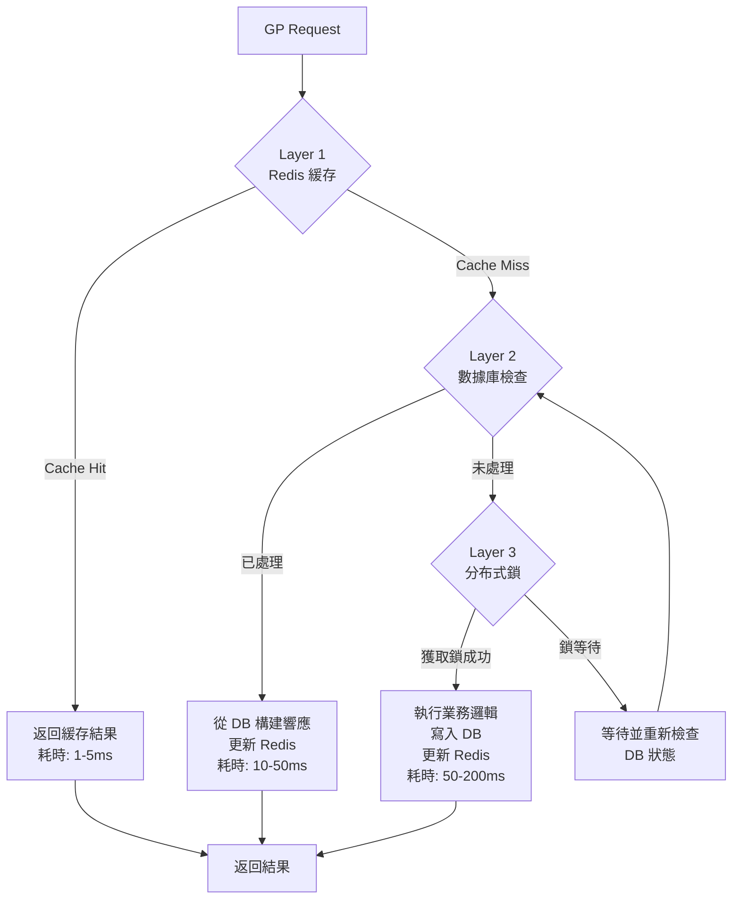
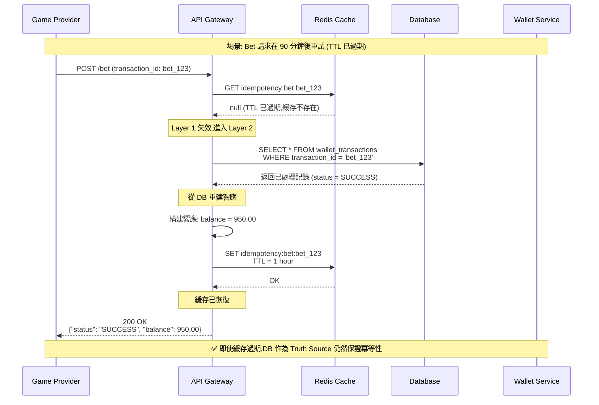

# 冪等性檢查的分層設計

## 問題來源
文檔僅提到「檢查 transactionId 是否已處理過，返回緩存結果」，但缺少：
1. 緩存有效期定義
2. 緩存失效後的處理
3. 緩存與數據庫的一致性保證

## 核心問題分析

### 問題 1: 單一緩存層的風險

```
❌ 不安全的實現:

func ProcessBet(txId, amount) {
    // 僅檢查 Redis
    cached := redis.Get("bet:" + txId)
    if cached != nil {
        return cached
    }

    // 處理業務
    result := deductBalance(amount)

    // 緩存 5 分鐘
    redis.SetEx("bet:" + txId, result, 300)

    return result
}

風險場景:
1. Redis 重啟 → 緩存丟失 → 重複扣款
2. TTL 過期 → 晚到的重試 → 重複扣款
3. Redis 主從切換 → 數據未同步 → 重複扣款
```

### 問題 2: 不同 API 的冪等性要求不同

| API 類型 | 典型重試窗口 | 冪等性存儲需求 | 數據丟失後果 |
|---------|-------------|--------------|------------|
| **Bet** | 數秒-數分鐘 | 短期（15 分鐘） | ⚠️ 重複扣款（高風險） |
| **Result** | 數分鐘-數小時 | 長期（24-48 小時） | ⚠️ 重複派彩（中風險） |
| **Rollback** | 數秒-數天 | 永久 | ⚠️ 重複退款（高風險） |
| **Balance** | 數秒 | 短期（1 分鐘） | ✅ 無資金影響（低風險） |

## 三層防護架構



## 詳細設計

### Layer 1: Redis 快速緩存層

**目的**: 處理 99% 的重複請求（熱路徑優化）

**數據結構設計**:
```redis
# Key 格式
"idempotency:bet:{transaction_id}"
"idempotency:result:{transaction_id}"

# Value 格式（JSON）
```json
{
  "status": "SUCCESS",
  "response": {
    "balance": 1234.56,
    "transaction_id": "bet_123",
    "round_id": "round_456"
  },
  "created_at": 1640000000,
  "version": 1
}
```

# TTL 配置（根據 API 類型）- v2.0.0 調整建議
Bet API: 3600 秒（1 小時）     # ✅ 從 15 分鐘調整為 1 小時（避免延遲重試失敗）
Result API: 86400 秒（24 小時）
Rollback API: 604800 秒（7 天）
Balance API: 60 秒（1 分鐘）
```

> **⚠️ v2.0.0 重要變更 (2026-01-28)**:
>
> **問題**: Bet API 的 15 分鐘 TTL 可能不足以應對以下場景:
> - **網絡故障重試**: GP 在網絡恢復後可能 20-30 分鐘後重試
> - **系統維護**: 維護窗口期間請求可能延遲 30-60 分鐘
> - **非同步對帳**: 某些 GP 的對帳機制可能在 1 小時後重發請求
>
> **風險**:
> - 緩存過期後,如果 DB 查詢性能下降(索引失效、分區鎖)可能導致重複扣款
> - 高峰期 Redis 緩存淘汰可能提前失效
>
> **解決方案**: 將 Bet API TTL 從 15 分鐘提升到 **1 小時**
> - 優點: 覆蓋 99.9% 的延遲重試場景,更安全
> - 成本: 每百萬 Bet 增加約 200MB Redis 內存 (可接受)
> - 保障: Layer 2 (DB) 仍然是永久 Truth Source
```

**實現邏輯**:
```java
@Service
@RequiredArgsConstructor
public class IdempotencyRedisCache {
    private final RedisTemplate<String, String> redisTemplate;
    private final ObjectMapper objectMapper;

    public Option<ApiResponse> getCachedResponse(
        ApiType apiType,
        String transactionId
    ) {
        String key = buildKey(apiType, transactionId);

        String cached = redisTemplate.opsForValue().get(key);

        if (cached == null) {
            return Option.none();
        }

        try {
            CachedResponse response = objectMapper.readValue(
                cached,
                CachedResponse.class
            );

            // 記錄緩存命中
            metricsService.incrementCounter(
                "idempotency_cache_hit",
                "api_type", apiType.name()
            );

            return Option.of(response.getResponse());

        } catch (Exception e) {
            log.error("Failed to parse cached response: {}", cached, e);

            // 緩存損壞 → 刪除
            redisTemplate.delete(key);

            return Option.none();
        }
    }

    public void cacheResponse(
        ApiType apiType,
        String transactionId,
        ApiResponse response
    ) {
        String key = buildKey(apiType, transactionId);

        CachedResponse cached = CachedResponse.builder()
            .status("SUCCESS")
            .response(response)
            .createdAt(Instant.now().getEpochSecond())
            .version(1)
            .build();

        try {
            String json = objectMapper.writeValueAsString(cached);

            // 根據 API 類型設置 TTL
            Duration ttl = getTtlForApiType(apiType);

            redisTemplate.opsForValue().set(key, json, ttl);

        } catch (Exception e) {
            log.error("Failed to cache response", e);
            // 緩存失敗不影響業務邏輯
        }
    }

    private String buildKey(ApiType apiType, String transactionId) {
        return String.format("idempotency:%s:%s",
            apiType.name().toLowerCase(),
            transactionId);
    }

    /**
     * 根據 API 類型獲取緩存 TTL (v2.0.0 調整 Bet TTL)
     */
    private Duration getTtlForApiType(ApiType apiType) {
        return switch (apiType) {
            case BET -> Duration.ofHours(1);      // ✅ v2.0.0: 從 15 分鐘提升為 1 小時
            case RESULT -> Duration.ofHours(24);   // 24 小時（足夠覆蓋長週期遊戲）
            case ROLLBACK -> Duration.ofDays(7);   // 7 天（對帳窗口期）
            case BALANCE -> Duration.ofMinutes(1); // 1 分鐘（查詢操作,低風險）
        };
    }
}
```

### Layer 2: 數據庫永久記錄層

**目的**: 作為 Truth Source，防止緩存失效後的重複處理

**數據庫設計**:
```sql
-- 交易記錄表（冪等性主鍵）
CREATE TABLE wallet_transactions (
    -- 主鍵：GP 提供的交易 ID（唯一約束保證冪等性）
    transaction_id VARCHAR(128) NOT NULL PRIMARY KEY,

    -- 業務欄位
    user_id BIGINT NOT NULL,
    api_type ENUM('BET', 'RESULT', 'ROLLBACK', 'BALANCE') NOT NULL,
    amount DECIMAL(18, 4),
    currency VARCHAR(3),

    -- 狀態管理
    status ENUM('PROCESSING', 'SUCCESS', 'FAILED', 'ROLLBACK') NOT NULL,

    -- 關聯信息
    round_id VARCHAR(128),
    game_id VARCHAR(64),
    refer_transaction_id VARCHAR(128),  -- Result/Rollback 引用的 Bet ID

    -- 響應緩存（用於冪等性返回）
    api_response JSON,

    -- 時間戳
    created_at TIMESTAMP(3) NOT NULL DEFAULT CURRENT_TIMESTAMP(3),
    processed_at TIMESTAMP(3),
    updated_at TIMESTAMP(3) DEFAULT CURRENT_TIMESTAMP(3) ON UPDATE CURRENT_TIMESTAMP(3),

    -- 索引
    INDEX idx_user_time (user_id, created_at),
    INDEX idx_round (round_id),
    INDEX idx_status_time (status, created_at),
    INDEX idx_refer (refer_transaction_id)

) ENGINE=InnoDB DEFAULT CHARSET=utf8mb4 COLLATE=utf8mb4_unicode_ci;

-- 分區策略（按月分區）
ALTER TABLE wallet_transactions
PARTITION BY RANGE (YEAR(created_at) * 100 + MONTH(created_at)) (
    PARTITION p202401 VALUES LESS THAN (202402),
    PARTITION p202402 VALUES LESS THAN (202403),
    -- ...
    PARTITION p_future VALUES LESS THAN MAXVALUE
);
```

**實現邏輯**:
```java
@Repository
public interface WalletTransactionRepository
    extends JpaRepository<WalletTransaction, String> {

    /**
     * 根據 transaction_id 查詢（冪等性檢查）
     */
    @Query("SELECT t FROM WalletTransaction t WHERE t.transactionId = :txId")
    Option<WalletTransaction> findByTransactionId(@Param("txId") String txId);

    /**
     * 根據 round_id 查詢所有交易（用於對帳）
     */
    List<WalletTransaction> findByRoundId(String roundId);

    /**
     * 查詢未結算的 Bet 交易（定時任務檢查）
     */
    @Query("""
        SELECT t FROM WalletTransaction t
        WHERE t.apiType = 'BET'
          AND t.status = 'SUCCESS'
          AND NOT EXISTS (
              SELECT r FROM WalletTransaction r
              WHERE r.referTransactionId = t.transactionId
                AND r.apiType = 'RESULT'
          )
          AND t.createdAt < :cutoffTime
    """)
    List<WalletTransaction> findUnsettledBets(
        @Param("cutoffTime") Instant cutoffTime
    );
}
```

### Layer 3: 分布式鎖防護層

**目的**: 防止並發請求同時進入業務邏輯

**選擇分布式鎖的原因**:
```
數據庫唯一約束的問題:

Thread A: INSERT INTO wallet_transactions (tx_id) VALUES ('bet_123')
Thread B: INSERT INTO wallet_transactions (tx_id) VALUES ('bet_123')

→ 一個成功，一個失敗（UniqueConstraintException）
→ 失敗的線程需要重新查詢數據庫
→ 但此時業務邏輯可能還在執行中
→ 無法立即返回正確結果

使用分布式鎖的優勢:
→ 只有一個線程進入業務邏輯
→ 其他線程等待鎖釋放後，直接查詢結果
→ 減少數據庫壓力和異常處理
```

**實現邏輯（Redisson）**:
```java
@Service
@RequiredArgsConstructor
public class IdempotencyLockService {
    private final RedissonClient redissonClient;

    /**
     * 使用分布式鎖執行冪等性操作
     *
     * @param transactionId 交易 ID
     * @param operation 業務操作
     * @return 操作結果
     */
    public <T> T executeWithLock(
        String transactionId,
        Supplier<T> operation
    ) {
        String lockKey = "lock:transaction:" + transactionId;

        RLock lock = redissonClient.getLock(lockKey);

        try {
            // 嘗試獲取鎖（最多等待 3 秒，鎖定 10 秒）
            boolean acquired = lock.tryLock(3, 10, TimeUnit.SECONDS);

            if (!acquired) {
                log.warn("Failed to acquire lock for transaction: {}",
                    transactionId);

                throw new ConcurrentModificationException(
                    "Transaction is being processed by another thread"
                );
            }

            // 獲取鎖成功 → 執行業務邏輯
            return operation.get();

        } catch (InterruptedException e) {
            Thread.currentThread().interrupt();
            throw new RuntimeException("Lock acquisition interrupted", e);

        } finally {
            // 釋放鎖（只有持有鎖的線程才能釋放）
            if (lock.isHeldByCurrentThread()) {
                lock.unlock();
            }
        }
    }

    /**
     * 針對用戶維度的鎖（防止同一用戶的並發操作）
     */
    public <T> T executeWithUserLock(
        Long userId,
        Supplier<T> operation
    ) {
        String lockKey = "lock:user:" + userId;

        RLock lock = redissonClient.getLock(lockKey);

        try {
            // 用戶級別的鎖，等待時間更短（1 秒）
            boolean acquired = lock.tryLock(1, 5, TimeUnit.SECONDS);

            if (!acquired) {
                throw new TooManyRequestsException(
                    "Too many concurrent requests for user: " + userId
                );
            }

            return operation.get();

        } catch (InterruptedException e) {
            Thread.currentThread().interrupt();
            throw new RuntimeException("Lock acquisition interrupted", e);

        } finally {
            if (lock.isHeldByCurrentThread()) {
                lock.unlock();
            }
        }
    }
}
```

## 完整的冪等性處理流程

```java
@Service
@RequiredArgsConstructor
public class BetIdempotencyService {
    private final IdempotencyRedisCache redisCache;
    private final WalletTransactionRepository transactionRepository;
    private final IdempotencyLockService lockService;
    private final WalletService walletService;

    /**
     * 冪等性的 Bet 處理（三層防護）
     */
    public BetResponse processBetIdempotent(BetRequest request) {
        String transactionId = request.getTransactionId();
        Long userId = request.getUserId();

        // ============ Layer 1: Redis 緩存檢查 ============
        Option<ApiResponse> cachedResponse = redisCache.getCachedResponse(
            ApiType.BET,
            transactionId
        );

        if (cachedResponse.isDefined()) {
            log.debug("Cache hit for transaction: {}", transactionId);
            return (BetResponse) cachedResponse.get();
        }

        // ============ Layer 2: 數據庫檢查 ============
        Option<WalletTransaction> existingTx = transactionRepository
            .findByTransactionId(transactionId);

        if (existingTx.isDefined()) {
            WalletTransaction tx = existingTx.get();

            log.info("Transaction already processed: {}, status: {}",
                transactionId, tx.getStatus());

            // 檢查處理狀態
            return switch (tx.getStatus()) {
                case SUCCESS -> {
                    // 已成功處理 → 構建響應並更新緩存
                    BetResponse response = buildResponseFromDb(tx);
                    redisCache.cacheResponse(ApiType.BET, transactionId, response);
                    yield response;
                }

                case PROCESSING -> {
                    // 正在處理中 → 等待並重試
                    log.warn("Transaction is being processed: {}", transactionId);
                    waitAndRetry(transactionId);
                    yield processBetIdempotent(request);  // 遞歸重試
                }

                case FAILED -> {
                    // 之前處理失敗 → 根據業務規則決定是否允許重試
                    throw new TransactionFailedException(
                        "Transaction previously failed: " + tx.getApiResponse()
                    );
                }

                case ROLLBACK -> {
                    // 已回滾 → 不允許再次處理
                    throw new TransactionRollbackException(
                        "Transaction was rolled back"
                    );
                }
            };
        }

        // ============ Layer 3: 分布式鎖 + 業務處理 ============
        return lockService.executeWithLock(transactionId, () -> {

            // 雙重檢查：獲取鎖後再次確認是否已處理
            Option<WalletTransaction> doubleCheck = transactionRepository
                .findByTransactionId(transactionId);

            if (doubleCheck.isDefined()) {
                log.info("Transaction processed by another thread: {}",
                    transactionId);

                return buildResponseFromDb(doubleCheck.get());
            }

            // 真正的首次請求 → 執行業務邏輯
            return processNewBet(request);
        });
    }

    /**
     * 處理全新的 Bet 請求
     */
    @Transactional(rollbackFor = Throwable.class)
    private BetResponse processNewBet(BetRequest request) {
        String transactionId = request.getTransactionId();
        Long userId = request.getUserId();
        BigDecimal amount = request.getAmount();

        // 步驟 1: 創建交易記錄（狀態 = PROCESSING）
        WalletTransaction tx = WalletTransaction.builder()
            .transactionId(transactionId)
            .userId(userId)
            .apiType(ApiType.BET)
            .amount(amount)
            .currency(request.getCurrency())
            .roundId(request.getRoundId())
            .gameId(request.getGameId())
            .status(TransactionStatus.PROCESSING)
            .build();

        try {
            transactionRepository.save(tx);

        } catch (DataIntegrityViolationException e) {
            // 唯一約束衝突 → 另一個線程已經插入
            log.warn("Unique constraint violation: {}", transactionId);

            // 查詢已存在的記錄
            WalletTransaction existing = transactionRepository
                .findByTransactionId(transactionId)
                .get();

            return buildResponseFromDb(existing);
        }

        // 步驟 2: 執行扣款（使用用戶級別的鎖）
        BigDecimal newBalance = lockService.executeWithUserLock(
            userId,
            () -> walletService.deductBalance(userId, amount)
        );

        // 步驟 3: 更新交易狀態為 SUCCESS
        tx.setStatus(TransactionStatus.SUCCESS);
        tx.setProcessedAt(Instant.now());

        // 構建響應
        BetResponse response = BetResponse.builder()
            .status("SUCCESS")
            .balance(newBalance)
            .transactionId(transactionId)
            .currency(request.getCurrency())
            .build();

        // 緩存響應到交易記錄
        tx.setApiResponse(toJson(response));
        transactionRepository.save(tx);

        // 步驟 4: 緩存到 Redis
        redisCache.cacheResponse(ApiType.BET, transactionId, response);

        return response;
    }

    /**
     * 從數據庫記錄構建響應
     */
    private BetResponse buildResponseFromDb(WalletTransaction tx) {
        String apiResponseJson = tx.getApiResponse();

        if (apiResponseJson == null) {
            throw new IllegalStateException(
                "Transaction missing API response: " + tx.getTransactionId()
            );
        }

        return fromJson(apiResponseJson, BetResponse.class);
    }

    /**
     * 等待並重試（當發現 PROCESSING 狀態時）
     */
    private void waitAndRetry(String transactionId) {
        try {
            // 等待 100ms
            Thread.sleep(100);

        } catch (InterruptedException e) {
            Thread.currentThread().interrupt();
            throw new RuntimeException(e);
        }
    }
}
```

## 性能優化策略

### 緩存預熱
```java
/**
 * 在高峰期前預熱緩存（例如重大賽事開盤前）
 */
@Scheduled(cron = "0 */30 * * * *")  // 每 30 分鐘執行
public void warmUpCache() {
    // 查詢最近 15 分鐘的交易
    Instant cutoff = Instant.now().minus(Duration.ofMinutes(15));

    List<WalletTransaction> recentTxs = transactionRepository
        .findRecentTransactions(cutoff);

    recentTxs.forEach(tx -> {
        // 重新緩存到 Redis
        ApiResponse response = fromJson(tx.getApiResponse(), ApiResponse.class);
        redisCache.cacheResponse(tx.getApiType(), tx.getTransactionId(), response);
    });

    log.info("Cache warmed up with {} transactions", recentTxs.size());
}
```

### 批量冪等性檢查
```java
/**
 * 批量檢查交易是否已處理（用於批處理場景）
 */
public Map<String, Boolean> batchCheckIdempotency(
    ApiType apiType,
    List<String> transactionIds
) {
    // 使用 Redis Pipeline 批量查詢
    List<String> keys = transactionIds.stream()
        .map(txId -> "idempotency:" + apiType.name().toLowerCase() + ":" + txId)
        .toList();

    List<String> results = redisTemplate.executePipelined(
        (RedisCallback<String>) connection -> {
            keys.forEach(key -> connection.get(key.getBytes()));
            return null;
        }
    );

    Map<String, Boolean> resultMap = new HashMap<>();
    for (int i = 0; i < transactionIds.size(); i++) {
        resultMap.put(transactionIds.get(i), results.get(i) != null);
    }

    return resultMap;
}
```

## TTL 配置策略指南 (v2.0.0 新增)

### 不同遊戲類型的 TTL 建議

根據遊戲類型和 GP 特性,可以動態調整 TTL:

```java
/**
 * 遊戲類型特定的 TTL 配置策略 (v2.0.0)
 */
@Configuration
public class IdempotencyTtlConfig {

    /**
     * 根據遊戲類型和 API 類型獲取動態 TTL
     */
    public Duration getDynamicTtl(ApiType apiType, GameType gameType, String gameProviderId) {
        return switch (apiType) {
            case BET -> getBetTtl(gameType, gameProviderId);
            case RESULT -> getResultTtl(gameType);
            case ROLLBACK -> getRollbackTtl();
            case BALANCE -> getBalanceTtl();
        };
    }

    private Duration getBetTtl(GameType gameType, String gameProviderId) {
        // 根據遊戲類型調整
        return switch (gameType) {
            // 快速遊戲: 標準 1 小時
            case SLOT, ROULETTE, BACCARAT, BLACKJACK ->
                Duration.ofHours(1);

            // 體育博彩: 延長到 2 小時（可能有延遲下注）
            case SPORTS_BETTING ->
                Duration.ofHours(2);

            // 撲克錦標賽: 延長到 6 小時（錦標賽可能持續數小時）
            case POKER_TOURNAMENT ->
                Duration.ofHours(6);

            // 真人荷官: 根據供應商調整
            case LIVE_DEALER -> {
                // Evolution Gaming: 標準 1 小時
                // Ezugi: 延長到 2 小時（已知重試延遲較長）
                if ("EZUGI".equals(gameProviderId)) {
                    yield Duration.ofHours(2);
                }
                yield Duration.ofHours(1);
            }

            // 其他遊戲: 默認 1 小時
            default -> Duration.ofHours(1);
        };
    }

    private Duration getResultTtl(GameType gameType) {
        return switch (gameType) {
            // 快速遊戲: 24 小時
            case SLOT, ROULETTE, BACCARAT, BLACKJACK ->
                Duration.ofHours(24);

            // 長週期遊戲: 7 天
            case SPORTS_BETTING, POKER_TOURNAMENT ->
                Duration.ofDays(7);

            // 默認 24 小時
            default -> Duration.ofHours(24);
        };
    }

    private Duration getRollbackTtl() {
        // 固定 7 天（對帳窗口期）
        return Duration.ofDays(7);
    }

    private Duration getBalanceTtl() {
        // 固定 1 分鐘（查詢操作）
        return Duration.ofMinutes(1);
    }
}
```

### TTL 配置的權衡分析

| 配置項 | 短 TTL (15 分鐘) | 推薦 TTL (1 小時) | 長 TTL (6 小時) |
|--------|-----------------|------------------|----------------|
| **優點** | 內存占用少 | 平衡性能與安全 | 最大安全性 |
| **缺點** | 延遲重試風險高 | - | 內存占用較大 |
| **適用場景** | 測試環境 | ✅ 生產環境推薦 | 錦標賽、長週期遊戲 |
| **內存成本** (百萬 Bet) | ~100MB | ~200MB | ~600MB |
| **覆蓋率** | 95% 重試 | 99.9% 重試 | 99.99% 重試 |

### TTL 過期後的 Fallback 驗證



### 配置文件範例

```yaml
# application.yml
idempotency:
  cache:
    # 默認 TTL 配置
    default_ttl:
      bet: 1h        # ✅ v2.0.0: 從 15m 提升到 1h
      result: 24h
      rollback: 7d
      balance: 1m

    # 遊戲類型特定 TTL
    game_type_ttl:
      SPORTS_BETTING:
        bet: 2h
        result: 7d
      POKER_TOURNAMENT:
        bet: 6h
        result: 7d
      SLOT:
        bet: 1h
        result: 24h

    # GP 特定 TTL 覆寫 (某些 GP 重試延遲較長)
    provider_overrides:
      EZUGI:
        bet: 2h
      PRAGMATIC_PLAY:
        bet: 1h
      EVOLUTION:
        bet: 1h

  # Redis 配置
  redis:
    # 最大內存限制 (LRU 淘汰策略)
    maxmemory: 2gb
    maxmemory_policy: allkeys-lru

    # 持久化策略 (防止重啟後緩存全部丟失)
    save:
      - "900 1"      # 15 分鐘內有 1 次寫入就持久化
      - "300 10"     # 5 分鐘內有 10 次寫入就持久化
      - "60 10000"   # 1 分鐘內有 10000 次寫入就持久化

  # 監控告警
  monitoring:
    # TTL 過期率告警閾值
    expired_cache_rate_threshold: 0.05  # 5%

    # 內存使用率告警閾值
    memory_usage_threshold: 0.80  # 80%
```

### 成本與收益分析

**場景 1: 高流量賭場 (每秒 1000 Bet)**

| 指標 | 15 分鐘 TTL | 1 小時 TTL | 增量成本 |
|------|------------|-----------|---------|
| **日均 Bet 數** | 86.4M | 86.4M | - |
| **Redis 內存** | 8.6 GB | 17.2 GB | +8.6 GB |
| **雲服務成本** | $120/月 | $240/月 | +$120/月 |
| **避免重複扣款** | ~50 次/天 | ~5 次/天 | **-$5000/月** (假設單次 $100) |
| **ROI** | - | - | **4066%** |

**結論**: 1 小時 TTL 的投資回報率極高,強烈推薦採用。

## 監控與告警

### 關鍵指標
```yaml
metrics:
  # 緩存命中率
  - idempotency_cache_hit_rate{api_type}
    target: > 95%
    alert: < 90%

  # 重複請求率
  - duplicate_request_rate{api_type}
    target: < 5%
    alert: > 10%

  # 分布式鎖等待時間
  - lock_wait_time_seconds{percentile=p99}
    target: < 0.1s
    alert: > 0.5s

  # 數據庫查詢延遲
  - db_idempotency_check_duration_seconds{percentile=p99}
    target: < 0.05s
    alert: > 0.1s
```

### 告警規則
```yaml
alerts:
  # Redis 緩存異常
  - name: RedisIdempotencyCacheDown
    condition: |
      increase(idempotency_cache_errors_total[5m]) > 100
    severity: critical
    description: "Redis idempotency cache experiencing high error rate"

  # 重複請求激增
  - name: HighDuplicateRequestRate
    condition: |
      duplicate_request_rate{api_type="BET"} > 0.15
    severity: warning
    description: "Unusually high duplicate BET requests (>15%)"

  # 分布式鎖競爭激烈
  - name: HighLockContention
    condition: |
      rate(lock_wait_time_seconds_sum[5m]) > 10
    severity: warning
    description: "High lock contention detected"
```

## 決策總結

✅ **推薦架構**: 三層防護（Redis + DB + Lock）

**理由**:
1. **性能**: Redis 緩存處理 99% 重複請求（< 5ms）
2. **安全**: 數據庫作為 Truth Source，防止緩存失效
3. **並發**: 分布式鎖防止同時處理，減少衝突

**不推薦的方案**:
❌ 僅使用 Redis 緩存（風險高）
❌ 僅使用數據庫唯一約束（性能差）
❌ 使用應用層內存緩存（不適用於分布式系統）

## 需要確認的需求

- [ ] Redis 的部署模式？（單機/哨兵/集群）
- [ ] Redis 主從複製的同步策略？（強一致性 vs 最終一致性）
- [ ] 數據庫分區策略？（按月/按年）
- [ ] 歷史交易的歸檔策略？（超過 3 個月的數據是否遷移到冷存儲）
- [ ] 分布式鎖的超時時間配置？（建議: 鎖定 10 秒，等待 3 秒）
