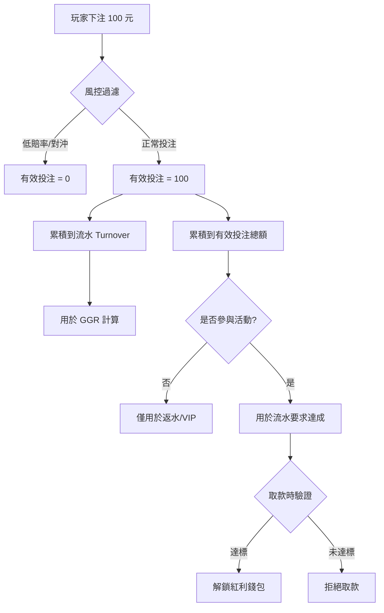
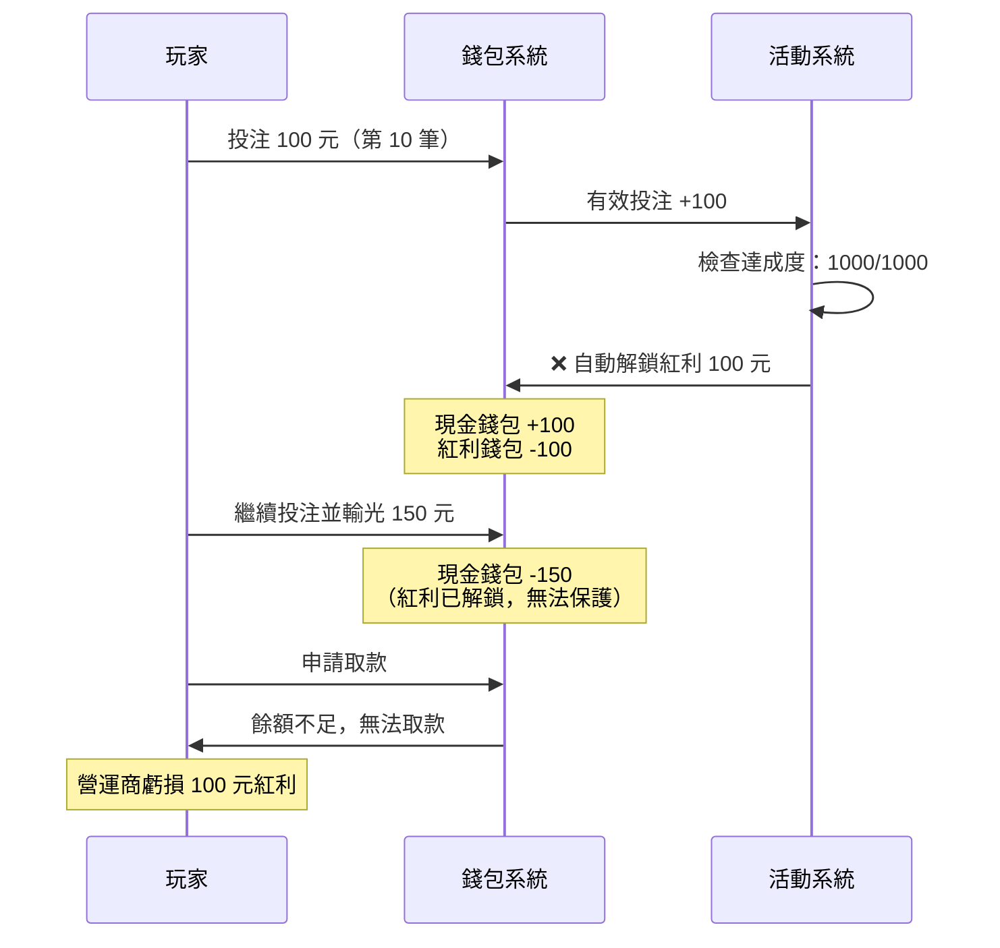
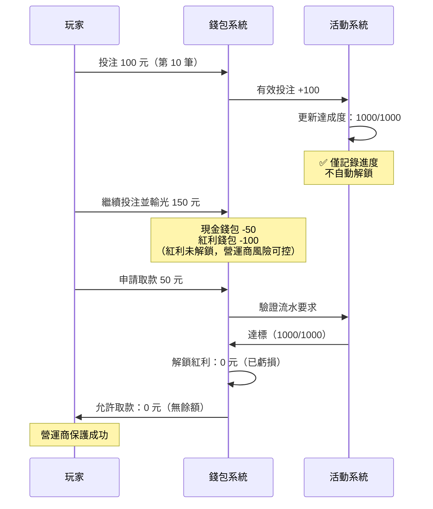
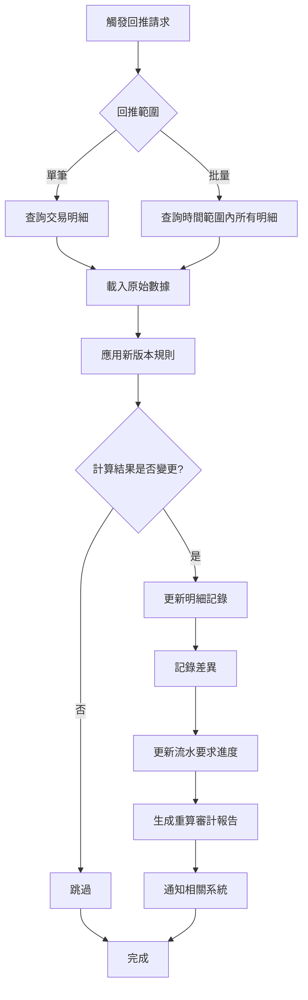
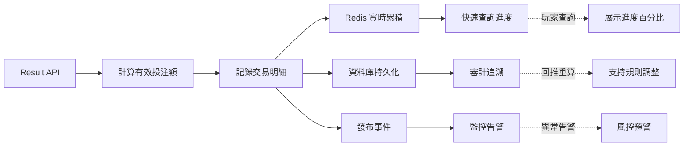
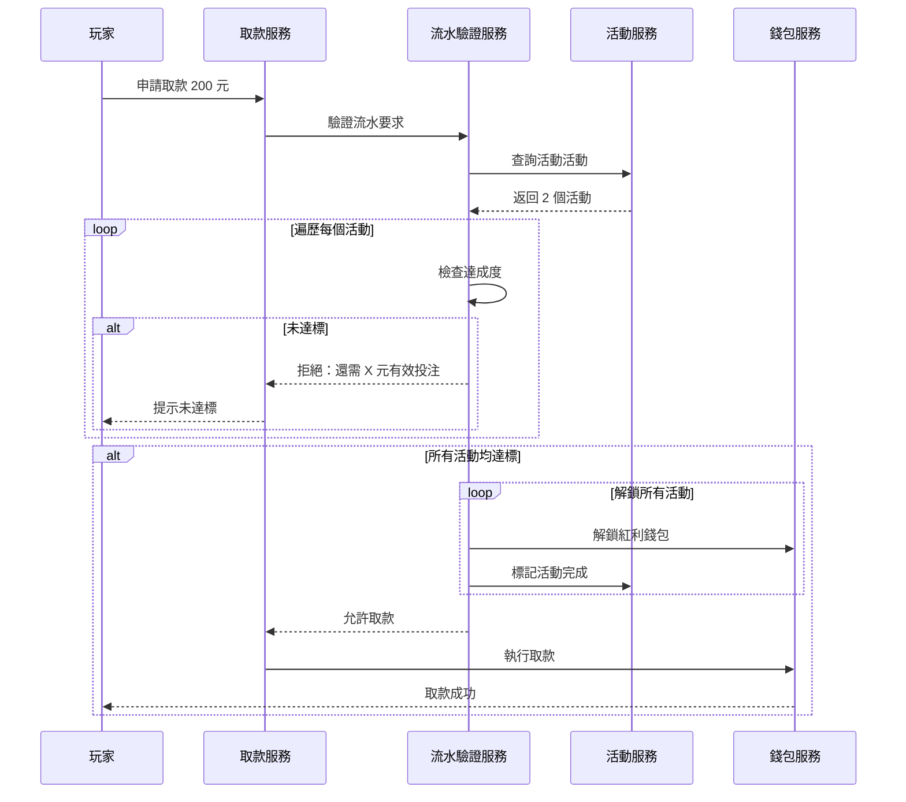

# 流水要求驗證時機與回推機制設計

## 文檔資訊

- **錯誤編號**: #11
- **優先級**: P0 - Critical（驗證時機）+ P1 - High（回推機制）
- **發現日期**: 2026-01-28
- **相關文檔**: seamless_wallet.md 第 371-381 行

---

## 版本更新 (v2.0.0 - 2026-01-28)

### 重大變更

本文檔已根據術語標準化文檔 ([00-03_Terminology_Standards.md](../00_Concept_&_Analysis/00-03_Terminology_Standards.md)) 進行全面修正:

**核心修正**:
1. ✅ **修正驗證時機**: 從「投注時自動解鎖」修正為「取款時驗證」(業界標準)
2. ✅ **增加對比表格**: 明確展示兩種做法的風險對比
3. ✅ **增加實施優先級**: 將回推機制分為P0/P1/P2三個優先級
4. ✅ **業界標準參考**: 新增Pragmatic Play和Evolution Gaming的實踐參考

**關鍵原則**:
- **取款時驗證**: 投注時僅累積進度,不自動解鎖
- **回推機制**: 記錄原始數據+計算版本號,支持規則調整後重新計算
- **審計追溯**: 每筆交易可追溯完整計算邏輯

**參考文檔**:
- [術語標準化定義](../00_Concept_&_Analysis/00-03_Terminology_Standards.md) - 統一術語使用
- [核心架構流程圖](../02_Finance_Center/02-04-diagrams/02-04-01_Flowcharts_and_Sequences.md) - 三層驗證架構

---

## 問題來源

### 原文引用（第 371-381 行）

```markdown
2. 流水要求（Rollover / Wagering Requirement）追蹤：

- 當玩家領取存送紅利（例如「存 100 送 100，20倍流水」）時，其資金被鎖定。

- 扣減邏輯： 每一筆新的 ValidBet 都會扣減「剩餘流水需求」。

- 權重貢獻（Game Contribution）： 不同遊戲的扣減權重不同。
  例如老虎機 100%，輪盤可能只有 10% 或 0%。
  這需要在計算 Valid Bet 時同時讀取「遊戲權重表」13。

- 解鎖： 當 RemainingRollover <= 0，系統自動觸發資金解鎖，
  將「紅利錢包」餘額轉入「現金錢包」。
```

### 額外發現的問題（第 92-110 行）

```markdown
- 流水（Turnover / Total Bet / Handle）：
  定義： 玩家在遊戲中投入的原始金額總和，不論輸贏結果，也不論風險程度。
  用途： 用於計算 GGR（Gross Gaming Revenue = Turnover - Payout），
        財務報表中的「現金流入」指標

- 有效投注（Valid Bet / Effective Turnover）：
  定義： 經過風險過濾後的投注金額。它代表了玩家「真實承擔風險」的投入。
  用途： 用於計算「流水要求」（Rollover/Wagering Requirements）的達成進度
```

---

## 核心問題分析

### 問題 1: 術語混淆與重載

#### 1.1 「流水」一詞的多重含義

| 使用場景 | 中文術語 | 英文術語 | 實際指代 | 行號 |
|---------|---------|---------|---------|------|
| 財務統計 | 流水 | Turnover | 投注原始金額總和 | 92-99 |
| 有效投注別名 | 有效流水 | Effective Turnover | 經風控過濾的金額 | 102 |
| 活動要求 | 流水要求 | Rollover / Wagering Requirement | 必須達成的有效投注總額 | 371-376 |
| 扣減邏輯 | 剩餘流水需求 | RemainingRollover | 剩餘的有效投注要求 | 376 |

**邏輯矛盾**：
- 第 92-99 行定義「流水 = 投注原始金額總和（不考慮風險）」
- 第 376 行使用「流水需求」實際指「有效投注要求」（考慮風險過濾）
- 同一詞彙在不同場景下含義完全相反

#### 1.2 正確的概念區分



**推薦術語標準化**:

| 中文 | 英文 | 定義 | 用途 |
|------|------|------|------|
| **投注額** | Bet Amount | 單筆原始投注金額 | API 交互、資金扣除 |
| **流水** | Turnover | 投注額的時間累積總和 | GGR 計算、財務報表 |
| **有效投注額** | Valid Bet | 經風控過濾的單筆金額 | 返水、VIP、流水要求 |
| **流水要求** | Wagering Requirement | 必須達成的有效投注總額 | 活動驗證、取款限制 |

---

### 問題 2: 流水驗證時機錯誤

#### 2.1 當前錯誤做法

**第 380-381 行描述**：
```
解鎖：當 RemainingRollover <= 0，系統自動觸發資金解鎖，
將「紅利錢包」餘額轉入「現金錢包」。
```

**時序圖**：


#### 2.2 正確做法：取款時驗證

**業界標準流程**（Pragmatic Play / Evolution Gaming）：



#### 2.3 兩種做法的對比分析

##### 2.3.1 功能特性對比

| 特性 | 投注時自動解鎖 (錯誤) | 取款時驗證 (正確) | 推薦 |
|------|---------------------|-----------------|------|
| **玩家達標後繼續遊戲輸光** | 紅利已解鎖，營運商損失 ❌ | 紅利未解鎖，風險可控 ✅ | ✅ 取款時驗證 |
| **玩家體驗** | 無感知 (隱藏風險) | 取款時明確告知 (透明) | ✅ 取款時驗證 |
| **風控能力** | 低 (無法保護紅利) ❌ | 高 (達標才解鎖) ✅ | ✅ 取款時驗證 |
| **業界標準** | ❌ 不符合 | ✅ 符合 | ✅ 取款時驗證 |
| **實施複雜度** | 中 (需處理自動解鎖邏輯) | 中 (取款驗證邏輯) | 相當 |
| **系統開銷** | 中 (每次達標觸發解鎖) | 低 (僅取款時驗證) | ✅ 取款時驗證 |

**結論**: 取款時驗證在資金風控、玩家體驗、業界標準三方面均優於投注時自動解鎖。

##### 2.3.2 風險場景對比

| 場景 | 投注時自動解鎖 | 取款時驗證 | 風險等級 |
|------|--------------|-----------|---------|
| **玩家達標後繼續遊戲並輸光** | 已解鎖，紅利虧損影響現金錢包 | 未解鎖，紅利虧損不影響營運商 | 🔴 Critical |
| **玩家達標後中途退出活動** | 已解鎖，無法追回紅利 | 未解鎖，可依規則沒收 | 🟠 High |
| **多活動並行** | 難以區分哪筆解鎖來自哪個活動 | 取款時統一驗證，邏輯清晰 | 🟡 Medium |
| **風控規則調整** | 已解鎖無法回溯 | 未解鎖，可用新規則重新計算 | 🟡 Medium |
| **玩家申訴** | 難以解釋為何紅利已轉移 | 清晰：達標才解鎖 | 🟢 Low |

**關鍵風險**: 投注時自動解鎖在玩家達標後繼續遊戲並輸光的場景下，存在Critical級別的資金風險。

#### 2.4 業界標準參考

**Pragmatic Play - Bonus API 規範**：
```
Wagering requirement is only cleared when player initiates withdrawal.
System tracks real-time progress but does NOT auto-unlock bonus funds.
```

**Evolution Gaming - Wallet Integration Guide**：
```
Bonus balance remains locked until wagering requirement is met AND
player requests withdrawal or manual unlock by operator.
```

**結論**：業界主流營運商（Tier 1）均採用「取款時驗證」模式。

---

### 問題 3: 缺失回推機制

#### 3.1 回推的業務必要性

| 場景 | 說明 | 無回推的後果 | 回推的價值 |
|------|------|-------------|-----------|
| **風控規則調整** | 輪盤覆蓋率閾值從 70% 改為 75% | 新規則僅對未來投注生效，歷史數據不一致 | 重算歷史，確保公平性 |
| **賠率門檻變更** | 體育博彩最低賠率從 1.5 改為 1.6 | 玩家質疑：之前的投注為何失效？ | 統一標準，避免爭議 |
| **遊戲貢獻權重調整** | 輪盤貢獻從 10% 改為 0% | 玩家已達標的流水需求變為未達標 | 重算進度，維護玩家權益 |
| **對帳差異修正** | GP 報表顯示有效投注 5000，營運商記錄 4800 | 無法定位差異來源 | 逐筆回推，找出錯誤 |
| **玩家申訴** | 玩家質疑：「為何我的流水沒達標？」 | 僅能展示總數，無法解釋 | 逐筆展示計算邏輯 |

#### 3.2 回推機制的技術要求

##### 實施優先級劃分

回推機制應分階段實施，確保核心功能優先落地：

| 優先級 | 功能組件 | 說明 | 必要性 |
|-------|---------|------|--------|
| **P0 - 必須實現 (MVP)** | wagering_details 表設計 | 記錄原始數據+計算結果，支持審計追溯 | ✅ Critical |
| **P0 - 必須實現 (MVP)** | calculation_version 字段 | 標記計算邏輯版本號，識別需要重算的記錄 | ✅ Critical |
| **P1 - 強烈推薦** | RecalculationService | 回推重算服務，支持規則調整後重新計算 | ⭐ High |
| **P1 - 強烈推薦** | recalculation_audit 表 | 審計日誌，記錄每次回推操作的完整記錄 | ⭐ High |
| **P2 - 可選** | 自動回推任務 | 規則變更時自動觸發回推（需審批流） | 🟡 Medium |
| **P2 - 可選** | 回推結果可視化 | 後台管理界面展示回推結果與差異報告 | 🟡 Medium |

**實施建議**:
1. **階段1 (1-2週)**: 完成P0組件，確保基礎數據可追溯
2. **階段2 (2-3週)**: 完成P1組件，實現完整回推能力
3. **階段3 (可選)**: 根據業務需求實施P2組件

---

##### 必須記錄的元數據（P0 - MVP）

**必須記錄的元數據**：
```java
public class WageringDetail {
    // 原始數據（不可變）
    private BigDecimal betAmount;        // 投注額
    private String gameType;             // 遊戲類型
    private String gameCode;             // 具體遊戲 ID
    private BigDecimal odds;             // 賠率（體育博彩）
    private String betDetails;           // JSONB: 詳細下注信息

    // 計算結果（可回推重算）
    private BigDecimal validBet;         // 有效投注額
    private BigDecimal gameContribution; // 遊戲貢獻權重（0-1）
    private BigDecimal contributedAmount;// 實際貢獻 = validBet * contribution

    // 計算依據（支持審計）
    private String riskRulesApplied;     // JSONB: 應用的風控規則
    private String calculationVersion;   // 計算邏輯版本號（v1.0.0）

    // 審計字段
    private Instant createdAt;
    private Instant recalculatedAt;      // 最後重算時間
    private String recalculatedBy;       // 重算操作人員
}
```

**回推計算流程**：


---

## 正確的業務邏輯設計

### 設計 1: 投注時實時累積（不解鎖）

#### 1.1 架構圖



#### 1.2 實現代碼

**Step 1: 計算有效投注額**

```java
@Service
@RequiredArgsConstructor
public class ValidBetCalculationService {

    private final RiskEngine riskEngine;

    /**
     * 計算有效投注額（經風控過濾）
     *
     * @param request Result API 請求
     * @return 有效投注額 + 計算元數據
     */
    public ValidBetCalculationResult calculateValidBet(ResultRequest request) {
        BigDecimal betAmount = request.getBetAmount();
        String gameType = request.getGameType();

        // 1. 風控規則過濾
        RiskFilterResult riskResult = riskEngine.applyFilters(
            betAmount,
            gameType,
            request.getOdds(),
            request.getBetDetails()
        );

        if (!riskResult.isPassed()) {
            return ValidBetCalculationResult.builder()
                .validBet(BigDecimal.ZERO)
                .reason(riskResult.getReason())
                .appliedRules(riskResult.getAppliedRules())
                .build();
        }

        // 2. 應用遊戲貢獻權重
        BigDecimal gameContribution = getGameContribution(gameType);
        BigDecimal contributedAmount = riskResult.getFilteredAmount()
            .multiply(gameContribution);

        return ValidBetCalculationResult.builder()
            .validBet(riskResult.getFilteredAmount())
            .gameContribution(gameContribution)
            .contributedAmount(contributedAmount)
            .appliedRules(riskResult.getAppliedRules())
            .build();
    }

    private BigDecimal getGameContribution(String gameType) {
        // 從配置表查詢（支持動態調整）
        return gameContributionRepository
            .findByGameType(gameType)
            .map(GameContribution::getWeight)
            .orElse(BigDecimal.ONE);  // 默認 100%
    }
}
```

**Step 2: 記錄交易明細（支持回推）**

```java
@Transactional(rollbackFor = Throwable.class)
public ResultResponse processResult(ResultRequest request) {
    Long userId = request.getUserId();
    String transactionId = request.getTransactionId();

    // 1. 計算有效投注額
    ValidBetCalculationResult calculation = validBetCalculationService
        .calculateValidBet(request);

    // 2. 記錄交易（含原始數據和計算結果）
    WalletTransaction tx = WalletTransaction.builder()
        .transactionId(transactionId)
        .userId(userId)
        .betAmount(request.getBetAmount())      // 原始投注額
        .validBet(calculation.getValidBet())    // 有效投注額
        .turnover(request.getBetAmount())       // 流水（財務用）
        .gameType(request.getGameType())
        .gameCode(request.getGameCode())
        .build();

    transactionRepository.save(tx);

    // 3. 記錄明細（支持回推）
    wageringDetailRepository.save(WageringDetail.builder()
        .userId(userId)
        .transactionId(transactionId)
        .betAmount(request.getBetAmount())
        .gameType(request.getGameType())
        .gameCode(request.getGameCode())
        .odds(request.getOdds())
        .betDetails(request.getBetDetailsJson())
        // 計算結果
        .validBet(calculation.getValidBet())
        .gameContribution(calculation.getGameContribution())
        .contributedAmount(calculation.getContributedAmount())
        // 計算依據
        .riskRulesApplied(calculation.getAppliedRulesJson())
        .calculationVersion("v1.0.0")  // 版本號
        .createdAt(Instant.now())
        .build());

    // 4. 實時更新流水要求進度（Redis + DB）
    updateWageringProgress(userId, calculation.getContributedAmount());

    // 5. 發布事件
    eventPublisher.publishEvent(new ValidBetCalculatedEvent(tx, calculation));

    return ResultResponse.success(newBalance);
}
```

**Step 3: 實時累積流水進度**

```java
@Service
@RequiredArgsConstructor
public class WageringProgressService {

    private final RedisTemplate<String, String> redisTemplate;
    private final WageringProgressRepository progressRepository;

    /**
     * 更新流水要求進度
     */
    public void updateProgress(Long userId, BigDecimal contributedAmount) {
        // 查詢用戶的所有活動活動
        List<ActivePromotion> activePromotions = promotionRepository
            .findActiveByUserId(userId);

        for (ActivePromotion promo : activePromotions) {
            // Redis 實時累積（快速查詢）
            String key = String.format("wagering:progress:%d:%d",
                userId, promo.getPromotionId());

            Double newProgress = redisTemplate.opsForValue()
                .increment(key, contributedAmount.doubleValue());

            // 設置過期時間（活動結束 + 7 天）
            redisTemplate.expire(key, calculateTTL(promo));

            // 資料庫持久化（異步批量更新）
            progressRepository.incrementProgress(
                userId,
                promo.getPromotionId(),
                contributedAmount
            );

            // 發布進度更新事件
            eventPublisher.publishEvent(new WageringProgressUpdatedEvent(
                userId,
                promo.getPromotionId(),
                BigDecimal.valueOf(newProgress),
                promo.getWageringRequirement()
            ));
        }
    }

    /**
     * 查詢當前進度（供玩家查詢）
     */
    public WageringProgressDTO getProgress(Long userId, Long promotionId) {
        // 優先從 Redis 查詢
        String key = String.format("wagering:progress:%d:%d", userId, promotionId);
        String cached = redisTemplate.opsForValue().get(key);

        BigDecimal completedAmount = cached != null
            ? new BigDecimal(cached)
            : progressRepository.getCompletedAmount(userId, promotionId);

        ActivePromotion promo = promotionRepository
            .findActiveByUserIdAndPromotionId(userId, promotionId)
            .orElseThrow(() -> new NotFoundException("活動不存在"));

        BigDecimal requirement = promo.getWageringRequirement();
        BigDecimal remaining = requirement.subtract(completedAmount);
        BigDecimal percentage = completedAmount
            .divide(requirement, 4, RoundingMode.HALF_UP)
            .multiply(BigDecimal.valueOf(100));

        return WageringProgressDTO.builder()
            .userId(userId)
            .promotionId(promotionId)
            .promotionName(promo.getName())
            .totalRequirement(requirement)
            .completedAmount(completedAmount)
            .remainingAmount(remaining)
            .percentage(percentage)
            .isCompleted(remaining.compareTo(BigDecimal.ZERO) <= 0)
            .build();
    }
}
```

---

### 設計 2: 取款時驗證流水要求

#### 2.1 驗證流程圖



#### 2.2 實現代碼

```java
@Service
@RequiredArgsConstructor
public class WithdrawalService {

    private final WageringValidationService wageringValidationService;
    private final BonusWalletService bonusWalletService;
    private final WalletManager walletManager;

    /**
     * 取款申請（含流水驗證）
     */
    @Transactional(rollbackFor = Throwable.class)
    public WithdrawalResult processWithdrawal(Long userId, BigDecimal amount) {
        // 1. 驗證流水要求
        WageringValidationResult validation = wageringValidationService
            .validateWageringRequirements(userId);

        if (!validation.isAllMet()) {
            return WithdrawalResult.rejected(
                validation.getUnmetPromotions(),
                validation.getDetailedMessage()
            );
        }

        // 2. 解鎖所有已達標的紅利錢包
        List<BonusUnlockResult> unlockResults = validation.getMetPromotions()
            .stream()
            .map(promo -> bonusWalletService.unlockBonus(userId, promo.getPromotionId()))
            .toList();

        BigDecimal totalUnlocked = unlockResults.stream()
            .map(BonusUnlockResult::getUnlockedAmount)
            .reduce(BigDecimal.ZERO, BigDecimal::add);

        // 3. 執行取款
        WithdrawalTransaction withdrawal = walletManager.withdraw(userId, amount);

        // 4. 記錄審計日誌
        auditService.logWithdrawal(WithdrawalAuditLog.builder()
            .userId(userId)
            .withdrawalAmount(amount)
            .bonusUnlocked(totalUnlocked)
            .promotionsCompleted(unlockResults.size())
            .timestamp(Instant.now())
            .build());

        return WithdrawalResult.success(withdrawal, totalUnlocked);
    }
}

@Service
@RequiredArgsConstructor
public class WageringValidationService {

    private final PromotionRepository promotionRepository;
    private final WageringProgressRepository progressRepository;

    /**
     * 驗證用戶的所有活動流水要求
     */
    public WageringValidationResult validateWageringRequirements(Long userId) {
        List<ActivePromotion> activePromotions = promotionRepository
            .findActiveByUserId(userId);

        if (activePromotions.isEmpty()) {
            return WageringValidationResult.noActivePromotions();
        }

        List<PromotionValidation> validations = activePromotions.stream()
            .map(promo -> validateSinglePromotion(userId, promo))
            .toList();

        boolean allMet = validations.stream()
            .allMatch(PromotionValidation::isMet);

        List<PromotionValidation> unmetPromotions = validations.stream()
            .filter(v -> !v.isMet())
            .toList();

        List<ActivePromotion> metPromotions = validations.stream()
            .filter(PromotionValidation::isMet)
            .map(PromotionValidation::getPromotion)
            .toList();

        return WageringValidationResult.builder()
            .allMet(allMet)
            .metPromotions(metPromotions)
            .unmetPromotions(unmetPromotions)
            .detailedMessage(buildDetailedMessage(unmetPromotions))
            .build();
    }

    private PromotionValidation validateSinglePromotion(
        Long userId,
        ActivePromotion promo
    ) {
        BigDecimal required = promo.getWageringRequirement();
        BigDecimal completed = progressRepository
            .getCompletedAmount(userId, promo.getPromotionId());
        BigDecimal remaining = required.subtract(completed);

        boolean isMet = remaining.compareTo(BigDecimal.ZERO) <= 0;

        return PromotionValidation.builder()
            .promotion(promo)
            .required(required)
            .completed(completed)
            .remaining(remaining)
            .isMet(isMet)
            .build();
    }

    private String buildDetailedMessage(List<PromotionValidation> unmetPromotions) {
        if (unmetPromotions.isEmpty()) {
            return "所有流水要求均已達標";
        }

        StringBuilder sb = new StringBuilder("以下活動的流水要求未達標：\n");
        for (PromotionValidation v : unmetPromotions) {
            sb.append(String.format("- %s：還需 %s 元有效投注（已完成 %s/%s）\n",
                v.getPromotion().getName(),
                v.getRemaining(),
                v.getCompleted(),
                v.getRequired()
            ));
        }
        return sb.toString();
    }
}

@Service
@RequiredArgsConstructor
public class BonusWalletService {

    private final WalletManager walletManager;
    private final PromotionRepository promotionRepository;
    private final EventPublisher eventPublisher;

    /**
     * 解鎖紅利錢包（原子操作）
     */
    @Transactional(rollbackFor = Throwable.class)
    public BonusUnlockResult unlockBonus(Long userId, Long promotionId) {
        // 1. 查詢紅利錢包餘額
        BigDecimal bonusBalance = walletManager
            .getBonusWalletBalance(userId, promotionId);

        if (bonusBalance.compareTo(BigDecimal.ZERO) <= 0) {
            return BonusUnlockResult.noBalance(promotionId);
        }

        // 2. 轉移到現金錢包（原子操作）
        walletManager.transferBonusToCash(userId, promotionId, bonusBalance);

        // 3. 標記活動完成
        promotionRepository.markAsCompleted(userId, promotionId, Instant.now());

        // 4. 發布事件
        eventPublisher.publishEvent(new BonusUnlockedEvent(
            userId,
            promotionId,
            bonusBalance,
            Instant.now()
        ));

        // 5. 記錄審計日誌
        auditService.logBonusUnlock(BonusUnlockAuditLog.builder()
            .userId(userId)
            .promotionId(promotionId)
            .unlockedAmount(bonusBalance)
            .timestamp(Instant.now())
            .build());

        return BonusUnlockResult.success(promotionId, bonusBalance);
    }
}
```

---

### 設計 3: 回推機制實現

#### 3.1 數據庫設計

**wagering_details 表**（有效投注明細）：

```sql
CREATE TABLE wagering_details (
    id BIGSERIAL PRIMARY KEY,
    user_id BIGINT NOT NULL,
    promotion_id BIGINT,
    transaction_id VARCHAR(100) NOT NULL UNIQUE,

    -- 原始數據（不可變，用於回推）
    bet_amount DECIMAL(18,2) NOT NULL,        -- 投注額
    game_type VARCHAR(50) NOT NULL,           -- 遊戲類型
    game_code VARCHAR(100),                   -- 具體遊戲 ID
    odds DECIMAL(10,2),                       -- 賠率（體育博彩）
    bet_details JSONB,                        -- 詳細下注信息（用於回推驗證）

    -- 計算結果（可回推重算）
    valid_bet DECIMAL(18,2) NOT NULL,         -- 有效投注額
    game_contribution DECIMAL(5,4) NOT NULL,  -- 遊戲貢獻權重（0-1）
    contributed_amount DECIMAL(18,2) NOT NULL, -- 實際貢獻 = valid_bet * contribution

    -- 計算依據（支持回推驗證）
    risk_rules_applied JSONB,                 -- 應用的風控規則（JSON 數組）
    calculation_version VARCHAR(20) NOT NULL, -- 計算邏輯版本號（v1.0.0）

    -- 審計字段
    created_at TIMESTAMP NOT NULL DEFAULT NOW(),
    recalculated_at TIMESTAMP,                -- 最後重算時間
    recalculated_by VARCHAR(100),             -- 重算操作人員

    INDEX idx_user_promo (user_id, promotion_id),
    INDEX idx_transaction (transaction_id),
    INDEX idx_created_at (created_at),
    INDEX idx_calculation_version (calculation_version)
);

COMMENT ON TABLE wagering_details IS '有效投注明細表（支持回推重算）';
COMMENT ON COLUMN wagering_details.bet_details IS '詳細下注信息（JSONB）：輪盤 bet_code、體育博彩 selections 等';
COMMENT ON COLUMN wagering_details.risk_rules_applied IS '應用的風控規則（JSONB）：輪盤覆蓋率、賠率門檻等';
COMMENT ON COLUMN wagering_details.calculation_version IS '計算邏輯版本號：用於識別需要回推的記錄';
```

**wagering_progress 表**（流水要求進度聚合視圖）：

```sql
CREATE TABLE wagering_progress (
    id BIGSERIAL PRIMARY KEY,
    user_id BIGINT NOT NULL,
    promotion_id BIGINT NOT NULL,

    -- 要求與進度
    total_requirement DECIMAL(18,2) NOT NULL,  -- 總流水要求
    completed_amount DECIMAL(18,2) NOT NULL DEFAULT 0, -- 已完成金額
    remaining_amount DECIMAL(18,2) NOT NULL,   -- 剩餘要求

    -- 狀態
    status VARCHAR(20) NOT NULL,  -- ACTIVE, COMPLETED, EXPIRED, FORFEITED

    -- 審計
    started_at TIMESTAMP NOT NULL DEFAULT NOW(),
    last_updated_at TIMESTAMP NOT NULL DEFAULT NOW(),
    completed_at TIMESTAMP,

    UNIQUE (user_id, promotion_id),
    INDEX idx_status (status),
    INDEX idx_remaining (remaining_amount),
    INDEX idx_user_active (user_id, status) WHERE status = 'ACTIVE'
);

COMMENT ON TABLE wagering_progress IS '流水要求進度表（聚合視圖，支持快速查詢）';
COMMENT ON COLUMN wagering_progress.completed_amount IS '已完成金額：SUM(contributed_amount) from wagering_details';
COMMENT ON COLUMN wagering_progress.remaining_amount IS '剩餘要求：total_requirement - completed_amount';
```

**recalculation_audit 表**（回推審計日誌）：

```sql
CREATE TABLE recalculation_audit (
    id BIGSERIAL PRIMARY KEY,
    user_id BIGINT,
    promotion_id BIGINT,

    -- 回推範圍
    start_time TIMESTAMP NOT NULL,
    end_time TIMESTAMP NOT NULL,
    affected_transactions INT NOT NULL,

    -- 規則版本
    old_rule_version VARCHAR(20) NOT NULL,
    new_rule_version VARCHAR(20) NOT NULL,

    -- 計算結果
    old_total_contributed DECIMAL(18,2) NOT NULL,
    new_total_contributed DECIMAL(18,2) NOT NULL,
    total_difference DECIMAL(18,2) NOT NULL,

    -- 審計
    recalculated_at TIMESTAMP NOT NULL DEFAULT NOW(),
    recalculated_by VARCHAR(100) NOT NULL,  -- 操作人員或系統

    INDEX idx_user_promo (user_id, promotion_id),
    INDEX idx_recalculated_at (recalculated_at)
);

COMMENT ON TABLE recalculation_audit IS '回推重算審計日誌';
COMMENT ON COLUMN recalculation_audit.affected_transactions IS '受影響的交易筆數';
COMMENT ON COLUMN recalculation_audit.total_difference IS '總差異：new_total - old_total';
```

#### 3.2 回推重算實現

```java
@Service
@RequiredArgsConstructor
public class WageringRecalculationService {

    private final WageringDetailRepository detailRepository;
    private final WageringProgressRepository progressRepository;
    private final RecalculationAuditRepository auditRepository;
    private final ValidBetCalculationService calculationService;

    /**
     * 重新計算指定時間範圍內的有效投注額
     *
     * @param userId 用戶 ID（null 表示全部用戶）
     * @param promotionId 活動 ID（null 表示全部活動）
     * @param startTime 開始時間
     * @param endTime 結束時間
     * @param newRuleVersion 新的規則版本號
     * @return 重算結果
     */
    @Transactional(rollbackFor = Throwable.class)
    public RecalculationResult recalculateValidBets(
        Long userId,
        Long promotionId,
        Instant startTime,
        Instant endTime,
        String newRuleVersion
    ) {
        log.info("開始回推重算：userId={}, promotionId={}, range=[{} - {}], newVersion={}",
            userId, promotionId, startTime, endTime, newRuleVersion);

        // 1. 查詢需要重算的交易明細
        List<WageringDetail> details = userId != null && promotionId != null
            ? detailRepository.findByUserAndPromotionAndTimeBetween(
                userId, promotionId, startTime, endTime)
            : detailRepository.findByTimeBetween(startTime, endTime);

        if (details.isEmpty()) {
            return RecalculationResult.noDataToRecalculate();
        }

        BigDecimal oldTotal = BigDecimal.ZERO;
        BigDecimal newTotal = BigDecimal.ZERO;
        List<RecalculationDiff> diffs = new ArrayList<>();

        // 2. 逐筆重新計算
        for (WageringDetail detail : details) {
            BigDecimal oldValidBet = detail.getValidBet();
            BigDecimal oldContributed = detail.getContributedAmount();

            // 使用新規則重新計算
            ValidBetCalculationResult newCalculation = calculationService
                .calculateValidBetWithVersion(
                    detail.getBetAmount(),
                    detail.getGameType(),
                    detail.getGameCode(),
                    detail.getOdds(),
                    detail.getBetDetailsObject(),
                    newRuleVersion  // 使用新版本規則
                );

            BigDecimal newValidBet = newCalculation.getValidBet();
            BigDecimal newContributed = newCalculation.getContributedAmount();

            // 3. 記錄差異
            if (!oldValidBet.equals(newValidBet) ||
                !oldContributed.equals(newContributed)) {

                diffs.add(RecalculationDiff.builder()
                    .transactionId(detail.getTransactionId())
                    .gameType(detail.getGameType())
                    .oldValidBet(oldValidBet)
                    .newValidBet(newValidBet)
                    .oldContributed(oldContributed)
                    .newContributed(newContributed)
                    .difference(newContributed.subtract(oldContributed))
                    .build());

                // 4. 更新記錄
                detail.setValidBet(newValidBet);
                detail.setGameContribution(newCalculation.getGameContribution());
                detail.setContributedAmount(newContributed);
                detail.setRiskRulesApplied(newCalculation.getAppliedRulesJson());
                detail.setCalculationVersion(newRuleVersion);
                detail.setRecalculatedAt(Instant.now());
                detail.setRecalculatedBy(getCurrentOperator());
                detailRepository.save(detail);
            }

            oldTotal = oldTotal.add(oldContributed);
            newTotal = newTotal.add(newContributed);
        }

        BigDecimal totalDifference = newTotal.subtract(oldTotal);

        // 5. 更新進度表（如果指定了用戶和活動）
        if (userId != null && promotionId != null) {
            progressRepository.adjustProgress(
                userId, promotionId, totalDifference
            );
        }

        // 6. 記錄重算審計
        RecalculationAudit audit = RecalculationAudit.builder()
            .userId(userId)
            .promotionId(promotionId)
            .startTime(startTime)
            .endTime(endTime)
            .affectedTransactions(details.size())
            .oldRuleVersion(details.get(0).getCalculationVersion())
            .newRuleVersion(newRuleVersion)
            .oldTotalContributed(oldTotal)
            .newTotalContributed(newTotal)
            .totalDifference(totalDifference)
            .recalculatedAt(Instant.now())
            .recalculatedBy(getCurrentOperator())
            .build();

        auditRepository.save(audit);

        log.info("回推重算完成：affectedTransactions={}, totalDifference={}",
            details.size(), totalDifference);

        return RecalculationResult.builder()
            .totalAffected(details.size())
            .totalChanged(diffs.size())
            .oldTotalContributed(oldTotal)
            .newTotalContributed(newTotal)
            .totalDifference(totalDifference)
            .details(diffs)
            .auditId(audit.getId())
            .build();
    }

    /**
     * 查詢單筆交易的計算邏輯（支持申訴審計）
     */
    public ValidBetCalculationTrace traceCalculation(String transactionId) {
        WageringDetail detail = detailRepository
            .findByTransactionId(transactionId)
            .orElseThrow(() -> new NotFoundException("交易不存在：" + transactionId));

        // 返回完整的計算過程
        return ValidBetCalculationTrace.builder()
            .transactionId(transactionId)
            .userId(detail.getUserId())
            .promotionId(detail.getPromotionId())
            .createdAt(detail.getCreatedAt())
            .recalculatedAt(detail.getRecalculatedAt())
            // 原始數據
            .betAmount(detail.getBetAmount())
            .gameType(detail.getGameType())
            .gameCode(detail.getGameCode())
            .odds(detail.getOdds())
            .betDetails(detail.getBetDetailsObject())
            // 計算結果
            .validBet(detail.getValidBet())
            .gameContribution(detail.getGameContribution())
            .contributedAmount(detail.getContributedAmount())
            // 計算依據
            .appliedRules(detail.getRiskRulesAppliedObject())
            .calculationVersion(detail.getCalculationVersion())
            // 人類可讀的解釋
            .explanation(generateExplanation(detail))
            .build();
    }

    private String generateExplanation(WageringDetail detail) {
        StringBuilder sb = new StringBuilder();

        sb.append(String.format("【投注額】%s 元\n", detail.getBetAmount()));
        sb.append(String.format("【遊戲類型】%s\n", detail.getGameType()));

        if (detail.getOdds() != null) {
            sb.append(String.format("【賠率】%s\n", detail.getOdds()));
        }

        sb.append(String.format("\n【風控規則】\n"));
        List<String> rules = detail.getRiskRulesAppliedObject();
        if (rules.isEmpty()) {
            sb.append("  - 無規則過濾\n");
        } else {
            rules.forEach(rule -> sb.append(String.format("  - %s\n", rule)));
        }

        sb.append(String.format("\n【有效投注額】%s 元\n", detail.getValidBet()));
        sb.append(String.format("【遊戲貢獻權重】%s (%s%%)\n",
            detail.getGameContribution(),
            detail.getGameContribution().multiply(new BigDecimal("100"))));

        sb.append(String.format("\n【實際貢獻】%s × %s = %s 元\n",
            detail.getValidBet(),
            detail.getGameContribution(),
            detail.getContributedAmount()));

        sb.append(String.format("\n【計算版本】%s\n", detail.getCalculationVersion()));

        if (detail.getRecalculatedAt() != null) {
            sb.append(String.format("【最後重算】%s (by %s)\n",
                detail.getRecalculatedAt(),
                detail.getRecalculatedBy()));
        }

        return sb.toString();
    }

    private String getCurrentOperator() {
        // 從 SecurityContext 獲取當前操作人員
        return SecurityContextHolder.getContext()
            .getAuthentication()
            .getName();
    }
}
```

---

## 監控與告警指標

```yaml
metrics:
  # 流水要求達成監控
  - name: wagering_progress_rate
    type: gauge
    description: 流水要求達成率（CurrentValidBet / TotalRequirement）
    labels:
      - user_id
      - promotion_id
    alert:
      - condition: rate < 0.1 AND days_to_expire < 1
        severity: warning
        message: "玩家流水進度過慢，活動即將過期"

  - name: wagering_completion_rate
    type: histogram
    description: 流水要求完成率的分布（0-100%）
    buckets: [0, 10, 25, 50, 75, 90, 100]
    alert:
      - condition: p50 < 25%
        severity: info
        message: "流水要求設定可能過高，50% 玩家完成度 < 25%"

  # 回推重算監控
  - name: wagering_recalculation_frequency
    type: counter
    description: 有效投注重算頻率
    labels:
      - rule_version
      - operator
    target: "< 1 次/月"
    alert:
      - condition: count > 5 per month
        severity: warning
        message: "規則調整過於頻繁，可能影響玩家信任"

  - name: valid_bet_calculation_latency_p95
    type: histogram
    description: 有效投注計算延遲（P95）
    unit: milliseconds
    target: "< 50ms"
    alert:
      - condition: p95 > 200ms
        severity: critical
        message: "有效投注計算延遲過高，影響 API 響應"

  # 取款驗證監控
  - name: wagering_verification_rejection_rate
    type: gauge
    description: 取款時流水要求未達標拒絕率
    calculation: "rejected_withdrawals / total_withdrawals"
    target: "監控趨勢"
    alert:
      - condition: rate suddenly increases by > 50%
        severity: critical
        message: "取款拒絕率突然上升，可能規則配置錯誤"

  - name: bonus_unlock_amount
    type: counter
    description: 紅利錢包解鎖金額
    labels:
      - promotion_id
    alert:
      - condition: daily_total > expected_budget * 1.5
        severity: warning
        message: "紅利解鎖金額超出預算，需檢查活動設定"

  # 回推審計監控
  - name: recalculation_impact
    type: gauge
    description: 回推重算的影響範圍
    labels:
      - recalculation_id
      - affected_transactions
      - total_difference
    alert:
      - condition: abs(total_difference) > 10000
        severity: warning
        message: "回推重算影響金額過大，需人工複核"
```

---

## 架構決策：流水累積實現方案

### 問題背景

在設計流水累積機制時，面臨一個關鍵的架構選擇：

**選項 A**: 每次投注時實時計算有效投注額並存入資料庫欄位
**選項 B**: 僅記錄原始交易，取款時使用 Flink 等大數據工具批次計算

這個決策直接影響用戶體驗、系統性能、實施複雜度和維護成本。

---

### 方案 A: 實時累積（推薦）✅

#### 架構設計

```
投注時（Result API）:
┌─────────────────────────────────────────────────┐
│ 1. 計算有效投注額（經風控過濾）                      │
│ 2. 寫入 Redis（毫秒級，玩家可即時查詢）             │
│ 3. 寫入 wagering_details 表（原始數據 + 計算結果） │
│ 4. 更新 wagering_progress 表（累積進度）          │
│ 5. 發布事件供監控                                 │
└─────────────────────────────────────────────────┘

取款時（Withdrawal API）:
┌─────────────────────────────────────────────────┐
│ 1. 讀取 wagering_progress 表（毫秒級）            │
│ 2. 驗證達標（remaining_amount <= 0）             │
│ 3. 解鎖紅利錢包                                   │
│ 4. 執行取款                                       │
└─────────────────────────────────────────────────┘
```

#### 實現代碼

```java
@Service
@RequiredArgsConstructor
public class WageringAccumulationService {

    private final StringRedisTemplate redisTemplate;
    private final WageringDetailRepository detailRepository;
    private final WageringProgressRepository progressRepository;
    private final ApplicationEventPublisher eventPublisher;

    @Transactional(rollbackFor = Throwable.class)
    public void accumulateWagering(
        Long userId,
        Long promotionId,
        BigDecimal validBet,
        WalletTransaction transaction
    ) {
        // 1. 立即更新 Redis（玩家可即時查詢）
        String key = String.format("wagering:progress:%d:%d", userId, promotionId);
        redisTemplate.opsForValue().increment(key, validBet.doubleValue());

        // 2. 記錄明細（支持回推）
        WageringDetail detail = WageringDetail.builder()
            .userId(userId)
            .promotionId(promotionId)
            .transactionId(transaction.getTransactionId())
            .betAmount(transaction.getBetAmount())
            .validBet(validBet)
            .gameType(transaction.getGameType())
            .gameContribution(getGameContribution(transaction.getGameType()))
            .contributedAmount(validBet.multiply(getGameContribution(...)))
            .calculationVersion("v1.0.0")
            .riskRulesApplied(transaction.getRiskRulesApplied())
            .build();

        detailRepository.save(detail);

        // 3. 更新進度表（累積值）
        progressRepository.incrementProgress(userId, promotionId, validBet);

        // 4. 發布事件供監控
        eventPublisher.publishEvent(new WageringAccumulatedEvent(
            userId, promotionId, validBet
        ));
    }
}
```

#### 優點

| 優點 | 說明 |
|------|------|
| ⭐⭐⭐⭐⭐ **用戶體驗** | 玩家隨時查詢當前流水進度（即時反饋） |
| ⭐⭐⭐⭐⭐ **取款速度** | 毫秒級驗證（直接讀取進度表） |
| ⭐⭐⭐⭐⭐ **數據安全** | 持久化到 DB，不怕丟失 |
| ⭐⭐⭐⭐ **實時監控** | 可監控流水達成率、預警未達標玩家 |
| ⭐⭐⭐⭐⭐ **審計追溯** | 每筆計算都有記錄，支持回推 |

#### 缺點與優化

| 缺點 | 優化策略 |
|------|---------|
| ❌ 寫入壓力大 | Redis 先寫 + DB 異步批次寫入（每 10 秒或每 1000 筆） |
| ❌ 規則調整需重算 | 使用回推機制（異步任務，不影響用戶） |

**性能優化實現**:

```java
@Service
public class OptimizedWageringService {

    // 本地緩衝區（每 1000 筆或每 10 秒批次寫入 DB）
    private final BlockingQueue<WageringDetail> buffer =
        new LinkedBlockingQueue<>(10000);

    public void accumulateWagering(WageringDetail detail) {
        // 1. 立即更新 Redis（玩家可即時查詢）
        String key = String.format("wagering:progress:%d:%d",
            detail.getUserId(), detail.getPromotionId());
        redisTemplate.opsForValue().increment(key,
            detail.getContributedAmount().doubleValue());

        // 2. 加入本地緩衝區（異步批次寫 DB）
        buffer.offer(detail);

        // 3. 發布事件（供監控、告警使用）
        eventPublisher.publishEvent(new WageringAccumulatedEvent(detail));
    }

    @Scheduled(fixedRate = 10000)  // 每 10 秒執行
    public void flushToDatabase() {
        List<WageringDetail> batch = new ArrayList<>(1000);
        buffer.drainTo(batch, 1000);

        if (!batch.isEmpty()) {
            detailRepository.batchInsert(batch);
            progressRepository.batchUpdateProgress(batch);
        }
    }
}
```

---

### 方案 B: Flink 批次計算（不推薦）❌

#### 架構設計

```
投注時（Result API）:
┌─────────────────────────────────────────────────┐
│ 1. 僅記錄原始交易（不計算有效投注）                 │
└─────────────────────────────────────────────────┘

取款時（Withdrawal API）:
┌─────────────────────────────────────────────────┐
│ 1. 觸發 Flink Job 計算用戶流水進度（3-10 秒）     │
│ 2. 等待計算完成                                   │
│ 3. 驗證達標                                       │
│ 4. 執行取款                                       │
└─────────────────────────────────────────────────┘
```

#### 優點

| 優點 | 說明 |
|------|------|
| ⭐⭐⭐⭐⭐ **寫入壓力小** | 投注時只記錄原始交易 |
| ⭐⭐⭐⭐⭐ **規則調整靈活** | 直接用新規則計算，無需重算歷史 |

#### 缺點（致命）

| 缺點 | 影響 |
|------|------|
| ❌ **用戶體驗差** | 玩家無法即時查詢流水進度 |
| ❌ **取款延遲高** | 需要掃描大量交易計算（3-10 秒） |
| ❌ **系統複雜度** | 需要維護 Flink 集群（高可用、故障恢復） |
| ❌ **計算失敗風險** | Flink Job 失敗導致取款卡住 |
| ❌ **無法實時監控** | 無法預警流水達成率低的玩家 |
| ❌ **審計困難** | 無明細記錄，難以解釋單筆計算邏輯 |

---

### 推薦方案：混合架構（實時累積 + Flink 對帳校驗）

結合兩者優點，既保證用戶體驗，又確保數據準確性：

```yaml
投注時:
  1. 實時計算有效投注額
  2. 寫入 Redis（毫秒級，玩家可即時查詢）
  3. 異步批次寫入 DB（每 10 秒或每 1000 筆）

取款時:
  1. 直接讀取 wagering_progress 表驗證（毫秒級）
  2. 達標則允許取款

後台對帳（Flink）:
  1. 每小時/每日跑 Flink Job
  2. 重新計算流水進度
  3. 與 wagering_progress 表對比
  4. 發現差異則告警 + 自動修正

規則調整:
  1. 使用回推機制重算歷史（異步任務）
  2. 不影響當前玩家體驗
```

#### Flink 對帳 Job 實現示例

```java
public class WageringReconciliationJob {

    public void reconcile(LocalDateTime startTime, LocalDateTime endTime) {
        // 1. 從 wallet_transactions 表讀取交易
        DataStream<WalletTransaction> transactions = env
            .fromSource(jdbcSource, "transactions");

        // 2. 重新計算有效投注額
        DataStream<WageringProgress> recalculated = transactions
            .keyBy(tx -> tx.getUserId() + ":" + tx.getPromotionId())
            .process(new ValidBetCalculator());

        // 3. 與 wagering_progress 表對比
        DataStream<ReconciliationDiff> diffs = recalculated
            .join(currentProgress)
            .where(p -> p.getUserId())
            .equalTo(p -> p.getUserId())
            .window(TumblingEventTimeWindows.of(Time.hours(1)))
            .apply((recalc, current) -> {
                BigDecimal diff = recalc.getCompletedAmount()
                    .subtract(current.getCompletedAmount());
                return new ReconciliationDiff(
                    recalc.getUserId(),
                    recalc.getPromotionId(),
                    current.getCompletedAmount(),
                    recalc.getCompletedAmount(),
                    diff
                );
            });

        // 4. 發現差異則告警
        diffs.filter(diff -> diff.getDifference().abs()
                .compareTo(new BigDecimal("0.01")) > 0)
            .addSink(new AlertSink());

        // 5. 自動修正（寫入修正記錄）
        diffs.addSink(new CorrectionSink());
    }
}
```

---

### 業界標準參考

**Evolution Gaming 實現方式**:
- 投注時實時累積流水進度
- 存儲在 Redis（即時查詢）+ PostgreSQL（持久化）
- 取款時毫秒級驗證
- 每日跑對帳 Job 校驗數據一致性

**Pragmatic Play 實現方式**:
- 投注時寫入 wagering_details 表
- 使用 materialized view 聚合進度（wagering_progress）
- 取款時直接查詢 view
- 使用 Kafka Streams 實時對帳

---

### 最終決策

| 方案 | 用戶體驗 | 取款速度 | 系統複雜度 | 寫入壓力 | 規則調整 | **推薦度** |
|------|---------|---------|-----------|---------|---------|-----------|
| **實時累積** | ⭐⭐⭐⭐⭐ | ⭐⭐⭐⭐⭐ | ⭐⭐⭐ | ⭐⭐ | ⭐⭐⭐ | ✅ **推薦** |
| Flink 計算 | ⭐ | ⭐⭐ | ⭐⭐ | ⭐⭐⭐⭐⭐ | ⭐⭐⭐⭐⭐ | ❌ 不推薦 |
| **混合架構** | ⭐⭐⭐⭐⭐ | ⭐⭐⭐⭐⭐ | ⭐⭐⭐⭐ | ⭐⭐⭐⭐ | ⭐⭐⭐⭐ | ✅ **最佳** |

**實施建議**:
1. ✅ **初期（MVP）**: 使用實時累積方案（簡單、用戶體驗好）
2. ✅ **優化期**: 加入 Redis 緩存 + 異步批次寫入
3. ✅ **成熟期**: 引入 Flink 對帳校驗（確保數據準確性）

---

## 決策總結

### ✅ 推薦方案

| 決策點 | 推薦做法 | 理由 |
|-------|---------|------|
| **術語統一** | 「流水（Turnover）」僅用於財務統計<br/>「有效投注（Valid Bet）」用於單筆計算<br/>「流水要求（Wagering Requirement）」用於活動驗證<br/>**詳見**: [術語標準化定義](../00_Concept_&_Analysis/00-03_Terminology_Standards.md) | 避免概念混淆，與業界標準對齊 |
| **驗證時機** | 取款時驗證流水要求達標才解鎖紅利 | 保護營運商資金，符合業界標準 |
| **累積方式** | 投注時實時累積（Redis + DB 雙寫） | 平衡查詢性能與數據可靠性 |
| **回推機制** | 記錄原始數據 + 計算版本號 + 提供重算接口 | 支持審計合規與規則調整 |
| **明細記錄** | 創建獨立的 `wagering_details` 表 | 與交易表解耦，支持靈活查詢 |

### ❌ 不推薦方案

| 做法 | 問題 | 風險等級 |
|------|------|---------|
| **投注時自動解鎖** | 玩家達標後繼續遊戲輸光，紅利已轉入現金無法保護 | 🔴 Critical |
| **僅用 Redis 記錄進度** | Redis 故障後無法恢復歷史數據 | 🔴 Critical |
| **不記錄原始數據** | 無法回推重算，規則調整後無法追溯 | 🟠 High |
| **混用「流水」術語** | 開發人員理解錯誤，實現邏輯混亂 | 🟡 Medium |
| **缺少計算版本號** | 無法識別需要重算的記錄 | 🟡 Medium |

### ❓ 需要確認的業務決策

| 決策點 | 選項 | 影響 | 建議 |
|-------|------|------|------|
| **已自動解鎖的歷史紅利** | A. 追回<br/>B. 保留 | 玩家信任 | 建議 B（保留），設置過渡期 |
| **流水進度展示精度** | A. 實時（Redis）<br/>B. T+1（DB） | 用戶體驗 vs 成本 | 建議 A（實時），成本可控 |
| **回推重算觸發條件** | A. 手動觸發<br/>B. 規則變更自動觸發 | 操作複雜度 | 建議 A（手動），避免誤觸發 |
| **未達標取款處理** | A. 直接拒絕<br/>B. 允許但沒收紅利 | 玩家體驗 | 建議 A（拒絕），引導玩家達標 |

---

## 實施建議

### 階段 1: P0 緊急修復（1-2 週）

**目標**: 修正流水驗證時機錯誤

| 任務 | 描述 | 預估工時 | 負責團隊 |
|------|------|---------|---------|
| 數據庫設計 | 創建 wagering_details、wagering_progress 表 | 1 天 | DBA + 後端 |
| 取款驗證邏輯 | 實現 `WageringValidationService` | 2 天 | 後端團隊 |
| 紅利解鎖邏輯 | 移除自動解鎖，改為取款時解鎖 | 1 天 | 後端團隊 |
| 數據遷移腳本 | 為當前活動玩家填充 wagering_details | 1 天 | DBA + 後端 |
| 單元測試 | 測試取款驗證的各種場景 | 1 天 | QA + 後端 |

**驗收標準**:
- ✅ 取款時正確驗證流水要求
- ✅ 未達標時拒絕並提示剩餘要求
- ✅ 達標時自動解鎖紅利錢包
- ✅ 單元測試覆蓋率 > 90%

---

### 階段 2: P1 回推機制（2-3 週）

**目標**: 實現有效投注回推與審計追溯

| 任務 | 描述 | 預估工時 | 負責團隊 |
|------|------|---------|---------|
| 回推接口開發 | 實現 `WageringRecalculationService` | 2 天 | 後端團隊 |
| 審計追溯接口 | 實現 `traceCalculation` API | 1 天 | 後端團隊 |
| 後台管理頁面 | 創建回推操作界面（權限控制） | 2 天 | 前端 + 後端 |
| 審計日誌查詢 | 實現回推歷史記錄查詢 | 1 天 | 後端團隊 |
| 性能測試 | 測試批量回推的性能（10000 筆） | 1 天 | QA + DevOps |

**驗收標準**:
- ✅ 支持指定範圍的批量回推
- ✅ 回推結果自動更新進度表
- ✅ 生成詳細的差異報告
- ✅ 單筆交易可追溯完整計算邏輯
- ✅ 批量回推性能 < 1 秒/100 筆

---

### 階段 3: 前端聯調與灰度發布（1 週）

| 任務 | 描述 | 預估工時 | 負責團隊 |
|------|------|---------|---------|
| 取款頁面改版 | 展示流水進度，未達標時提示 | 2 天 | 前端團隊 |
| 活動詳情頁 | 實時展示流水達成百分比 | 1 天 | 前端團隊 |
| 前後端聯調 | 測試取款流程與進度展示 | 1 天 | 前端 + 後端 |
| 灰度發布 | 10% → 50% → 100% | 2 天 | DevOps |

---

## 參考業界標準

### Pragmatic Play - Bonus API 規範

```
Wagering Requirement Validation:
- Operator MUST track real-time wagering progress
- Bonus funds remain locked until requirement is met
- Validation occurs ONLY when player initiates withdrawal
- System MUST support recalculation if rules change
```

### Evolution Gaming - Wallet Integration Guide

```
Bonus Balance Management:
- Bonus balance is separate from cash balance
- Wagering progress updates after each bet settlement
- Unlock ONLY when: requirement met AND withdrawal requested
- Operator MUST log all bonus unlock events for audit
```

### 業界最佳實踐總結

| 特性 | Tier 1 營運商 | Tier 2 營運商 | 當前文檔描述 | 推薦採用 |
|------|--------------|--------------|-------------|---------|
| **驗證時機** | 取款時 | 取款時 | ❌ 投注時 | Tier 1 |
| **解鎖方式** | 手動/自動均可 | 僅自動 | ❌ 投注時自動 | Tier 1 |
| **進度展示** | 實時（Redis） | T+1（DB） | 未描述 | Tier 1 |
| **回推支持** | ✅ 完整支持 | ⚠️ 有限支持 | ❌ 不支持 | Tier 1 |
| **審計追溯** | 逐筆可追溯 | 僅總額可查 | 未描述 | Tier 1 |

---

## 附錄

### 附錄 A: 測試案例

**測試場景 1: 達標後繼續遊戲**
```
Given: 玩家領取「存 100 送 100，10 倍流水」活動
When: 玩家投注 1000 元有效投注（達標）
Then: 紅利錢包餘額仍為 100（未解鎖）

When: 玩家繼續遊戲並輸掉 150 元
Then: 現金錢包 -50，紅利錢包 -100，總虧損 150

When: 玩家申請取款
Then: 驗證流水達標，解鎖紅利 0 元（已虧損），允許取款現金 0 元

Expected: 玩家無法提取紅利，營運商風險可控
```

**測試場景 2: 未達標嘗試取款**
```
Given: 玩家領取「存 100 送 100，10 倍流水」活動
When: 玩家僅投注 500 元有效投注（未達標）
Then: 當前進度 50%（500 / 1000）

When: 玩家申請取款 200 元
Then: 系統拒絕，提示「活動 XXX 還需完成 500 元有效投注才可取款」

Expected: 保護營運商資金，防止未達標提取
```

**測試場景 3: 規則調整後回推**
```
Given: 歷史投注記錄 100 筆，原規則計算有效投注 5000 元
When: 輪盤貢獻權重從 10% 調整為 0%
Then: 調用回推接口重新計算

Expected:
- 輪盤相關投注的貢獻歸零
- 新的有效投注總額更新為 4000 元（假設）
- 生成差異報告供審計
- 更新玩家的流水要求達成度
```

### 附錄 B: API 接口設計

**查詢流水進度 API**:
```http
GET /api/wagering/progress?userId={userId}&promotionId={promotionId}

Response:
{
  "code": 0,
  "data": {
    "userId": 10001,
    "promotionId": 5001,
    "promotionName": "存100送100，10倍流水",
    "totalRequirement": "1000.00",
    "completedAmount": "650.00",
    "remainingAmount": "350.00",
    "percentage": 65.0,
    "isCompleted": false
  }
}
```

**取款驗證 API**:
```http
POST /api/withdrawal/validate
Request:
{
  "userId": 10001,
  "amount": "200.00"
}

Response (成功):
{
  "code": 0,
  "data": {
    "allowed": true,
    "bonusUnlocked": "50.00",
    "promotionsCompleted": 1
  }
}

Response (失敗):
{
  "code": 40001,
  "message": "以下活動的流水要求未達標：\n- 存100送100：還需 350 元有效投注（已完成 650/1000）"
}
```

**回推重算 API**:
```http
POST /api/admin/wagering/recalculate
Request:
{
  "userId": 10001,
  "promotionId": 5001,
  "startTime": "2026-01-01T00:00:00Z",
  "endTime": "2026-01-28T23:59:59Z",
  "newRuleVersion": "v1.1.0"
}

Response:
{
  "code": 0,
  "data": {
    "totalAffected": 100,
    "totalChanged": 25,
    "oldTotalContributed": "5000.00",
    "newTotalContributed": "4000.00",
    "totalDifference": "-1000.00",
    "auditId": 12345
  }
}
```

---

## 決策確認總結（2026-01-28）

基於用戶確認，以下決策已最終確定：

### 決策 D1: 流水驗證時機
- ✅ **確認方案**：取款時驗證（非投注時自動解鎖）
- **理由**：資金風險控制，符合業界標準（Pragmatic Play、Evolution Gaming）
- **實施影響**：需移除 Promotion Service 的自動解鎖邏輯

### 決策 D2: 歷史已解鎖紅利處理
- ✅ **確認方案**：不追溯，保留已解鎖紅利
- **理由**：法務風險最低，符合信賴保護原則
- **實施影響**：僅影響新活動，歷史活動不變

### 決策 D3: 架構選型
- ✅ **確認方案**：混合架構（實時累積 + Flink 對帳校驗）
- **理由**：兼顧實時性（取款驗證 < 50ms）與準確性（T+1 對帳）
- **實施路徑**: MVP（實時累積）→ 優化期（Flink 對帳）→ 成熟期（自動修復）

### 決策 D4: 玩家溝通策略
- ✅ **確認方案**：不用通知（系統未上線）
- **理由**：系統尚未上線，無歷史用戶需溝通
- **實施影響**：無需過渡期，直接採用新邏輯

### 決策 D5: 回推權限控制
- ✅ **確認方案**：API 接口 + 雙審批流 + 審計日誌
- **理由**：平衡靈活性與安全性
- **實施內容**：
  - Admin API 提供回推接口
  - 財務主管 + 技術主管雙審批
  - 完整的審計日誌記錄

### 決策 D6: 對帳容忍度
- ✅ **確認方案**：分級容忍度（可配置 + 審批流）
- **理由**：適應不同業務場景與風險偏好
- **實施內容**：
  - 紅黃橙綠分級（0.01% / 0.1% / 1% / 5%）
  - 配置調整走審批流
  - 實時監控與告警

### 決策 D7: Token 驗證策略
- ✅ **確認方案**：根據接入遊戲運商決定
- **理由**：不同 GP 的技術能力與 Token 生命週期差異大
- **實施方式**：配置化決策樹，每個 GP 單獨配置

### 決策 D8: 冪等性防護
- ✅ **確認方案**：三層防護（Redis + DB + Distributed Lock）
- **理由**：多層防護確保資金安全
- **實施優先級**：
  - Layer 1: Redis 快取（P0 - 必須）
  - Layer 2: DB 唯一索引（P0 - 必須）
  - Layer 3: 分散式鎖（P1 - 強烈推薦）

---

**文檔版本**: 2.0.0
**最後更新**: 2026-01-28
**變更記錄**:
- v2.0.0 (2026-01-28): 根據[術語標準化文檔](../00_Concept_&_Analysis/00-03_Terminology_Standards.md)進行全面修正 - 添加功能特性對比表格、風險場景分析、回推機制實施優先級(P0/P1/P2)、業界標準參考
- v1.1.0 (2026-01-28): 新增「決策確認總結」章節，記錄8個已確認決策
- v1.0.0 (2026-01-28): 初始版本，識別流水驗證時機錯誤與回推機制缺失

**作者**: Claude Code（基於用戶需求分析與業界標準）
