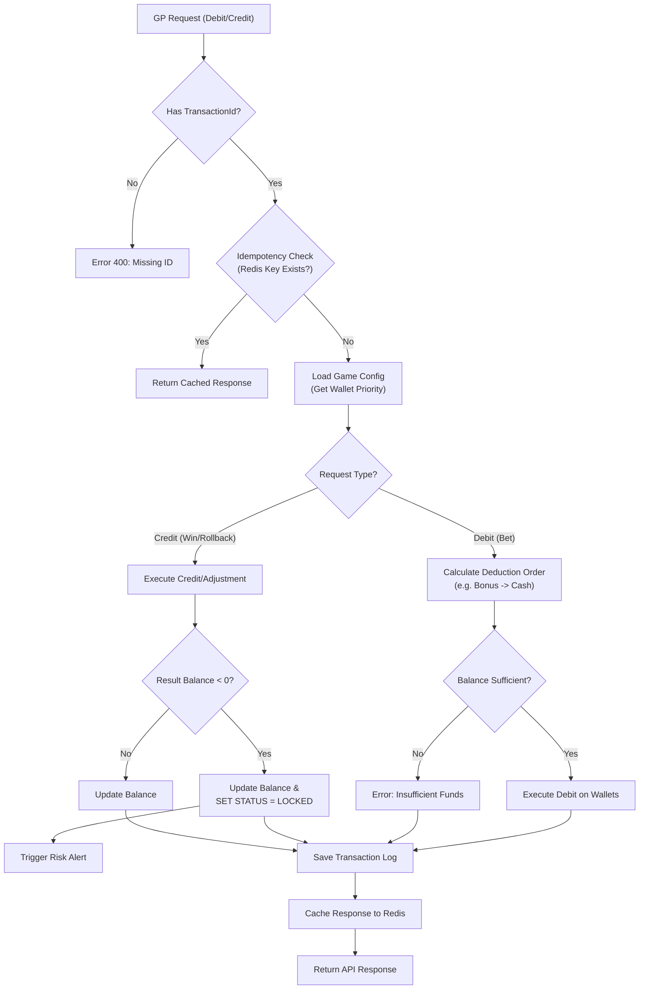

# 03-02 無縫錢包與遊戲商對接分析 (Seamless Wallet & GP Integration Analysis)

這份文件旨在深入分析無縫錢包（Seamless Wallet / Single Wallet）在與各類遊戲供應商（Game Provider, GP）對接時可能遇到的複雜場景、異常處理與設計缺失。

> [!IMPORTANT]
> 本文件僅作為**需求確認與架構分析**，不涉及具體程式碼實作。

## 1. 遊戲商整合類型缺失分析 (Missing Integration Types)

目前的 `03-01` 標準主要覆蓋了通用的 RESTful API 模式，但實際市場上的 GP 對接方式更為多元，現有文檔缺少對以下類型的詳細定義：

### 1.1 交易模型差異
| 類型 | 描述 | 代表廠商 | 潛在問題 |
| :--- | :--- | :--- | :--- |
| **Transaction-Based** | 每次請求都是一筆獨立交易 (Debit/Credit)，包含 `Amount` (正負值) 或 `Type`。 | PG Soft, JILI | 最標準，易於實作。需注意 `TransactionId` 全局唯一性。 |
| **Round-Based** | 請求綁定 `RoundId`。Bet 開啟 Round，Win 關閉 Round。 | Evolution, Pragmatic Play | **狀態一致性**挑戰：若 Bet 成功但 Win 丟失，Round 會卡在 "Open" 狀態。需實作排程檢查 Open Rounds。 |
| **Transfer-Based** | 舊式架構，模擬「轉入/轉出」。API 動作為 `TransferIn` / `TransferOut`。 | 某些老牌體育盤 | 語義混淆，容易與「轉帳錢包」搞混。需確保該動作是自動觸發而非人工。 |
| **Result-Only** | 僅發送遊戲結果 (Win/Loss Amount)，不區分 Bet/Win 動作。 | 某些彩票/棋牌 | **風控困難**：無法在下注當下校驗餘額（可能導致扣成負數後補扣）。 |

### 1.2 錢包行為差異
| 行為 | 描述 | 應對策略 |
| :--- | :--- | :--- |
| **GetBalance Only** | GP 不調用扣款接口，僅查詢餘額。餘額變動完全由 GP 內部記錄，定期 Settlement。 | **極高風險**。通常不建議接入此類，除非是信用盤模式。 |
| **Async Callback** | 平台回覆 HTTP 200 僅代表「收到請求」，實際扣款結果需透過 Callback 通知 GP。 | 需實作**雙向狀態機**，流程複雜度倍增。 |
| **Batch Processing** | GP 將多筆各別玩家的注單合併為一個 HTTP Request 發送。 | 需支援**批量交易處理**，任一筆失敗是否導致全批回滾？(All-or-Nothing vs Partial Success)。 |

---

## 2. 無縫錢包投注場景矩陣 (Betting Scenario Matrix)

以下是 "Step by Step" 推演的各種情況，從正常流程到極端異常。

### 2.1 正常交易流程 (Happy Path)
1. **Bet (Debit)**:
   - GP 請求 `Debit(user, amount, roundId, txId)`。
   - 平台：檢查餘額 >= amount -> 扣款 -> 記錄 Transaction -> 回傳 New Balance。
2. **Win (Credit)**:
   - GP 請求 `Credit(user, amount, roundId, txId, refTxId)`。
   - 平台：加款 -> 記錄 Transaction -> 回傳 New Balance。 (注意：`refTxId` 關聯到原本的 Bet)。

### 2.2 餘額與並發問題 (Balance & Concurrency)
- **場景 A：餘額不足 (Insufficient Funds)**
    - 玩家餘額 100，下注 200。
    - **平台行為**：回傳特定錯誤碼 (如 `INSUFFICIENT_FUNDS`)。
    - **GP 行為**：顯示餘額不足，阻止遊戲進行。
- **場景 B：並發扣款 (Race Condition)**
    - 玩家餘額 100。同時發送兩個 80 的注單請求 (Thread A, Thread B)。
    - **風險**：若無鎖，讀取餘額都是 100，都判斷足夠，扣款後餘額變成 -60。
    - **解決方案**：
        - Database Row Lock (`SELECT ... FOR UPDATE`)。
        - Redis Lua Script (Atomic Check-and-Set)。
        - Optimistic Lock (`UPDATE wallet SET balance = balance - 80 WHERE id = x AND balance >= 80`)。

### 2.3 網絡異常與冪等性 (Network Internet & Idempotency)
- **場景 C：超時重試 (Timeout & Retry)**
    - GP 發送 `Debit` -> 平台扣款成功 -> 平台回傳 Response 丟失 (Timeout)。
    - GP 未收到回應，認為狀態未知，發起**重試 (Retry)** (帶有相同的 `txId`)。
    - **平台行為** (關鍵)：
        - 檢查 `txId` 是否已存在。
        - **存在**：直接回傳該筆交易之前的執行結果 (Success, Balance)，**不可重複扣款**。
        - **不存在**：視為新交易執行。
- **場景 D：亂序到達 (Out of Order)**
    - GP 發送 `Bet`，隨後發送 `Win`。但因網路問題，平台先收到 `Win`，後收到 `Bet`。
    - **平台行為**：
        - 收到 `Win` 時，找不到 `refTxId` (Bet)。
        - 策略 1：報錯 `BET_NOT_FOUND` (GP 可能會重試 Win，等待 Bet 成功)。
        - 策略 2：允許「無效單派彩」(Orphan Win)，但標記為異常待核查 (風險高)。
        - 策略 3 (最佳)：暫存 `Win` 請求 (Pending)，等待 Bet 到達後處理 (複雜度高)。
        - **實務建議**：通常直接報錯，依賴 GP 重試機制。

### 2.4 遊戲特殊狀態 (Game Specific States)
- **場景 E：取消注單 (Refund / Rollback)**
    - 玩家下注後，遊戲回合取消 (如體育賽事中斷、系統故障)。
    - GP 發送 `Rollback(txId)` 或 `Refund(txId)`。
    - **平台行為**：
        - 找到原交易 `txId` -> 執行反向操作 (加回金額) -> 標記原交易為 `Rolled Back`。
        - **異常**：若原交易找不到？ (可能是 Bet 請求根本沒進來)。
        - **處理**：回傳 Success (因為目標是「確保沒扣款」，既然沒扣過也是達成目標)。
- **場景 F：重新結算 (Resettlement / Adjustment)**
    - 派彩後，GP 發現派彩金額錯誤 (如賠率設錯)。
    - GP 發送 `Adjust(amount)` 或先 `Rollback` 再重發 `Win`。
    - **平台行為**：需支援對同一 Round 的多次 Credit 或 負數 Credit (扣回多發的錢)。
    - **風險**：若玩家已將錯誤派彩提款，導致餘額不足扣回？ -> **允許負餘額** (Negative Balance) 並觸發風控警報，人工追討。
- **場景 I：大獎與彩池 (Jackpot & Big Win)**
    - **觸發**：玩家中大獎 (e.g. > $10,000) 或累積彩池 Jackpot。
    - **同步**：某些與 GP 的協議要求大獎不直接入餘額，而是觸發 `NotifyWin`，需人工審核後手動入帳。
    - **非同步**：若直接入餘額，需即時觸發**風控凍結**，防止玩家立刻提領，待核實遊戲 Log 無誤後解凍。

### 2.5 促銷與紅利 (Bonus & Promotion)
- **場景 G：Free Spin / Free Round (GP 端免遊)**
    - GP 通知的 Bet 金額為 0，Win 金額為實際贏分。
    - **平台行為**：需接受 Amount=0 的 Transaction。
- **場景 H：平台端紅利錢包 (Platform Bonus Wallet)**
    - 玩家有「現金 100」+「紅利 50 (限老虎機)」。
    - 玩家玩「真人百家樂」(不支援紅利)。
    - **平台行為**：
        - 識別遊戲類型。
        - 僅扣除現金錢包。若現金不足 (e.g. 下注 120)，即便總資產 150，仍回傳餘額不足。

---

## 3. 系統性風險控制 (Systemic Risk Control)

針對無縫錢包的總體安全設計需求。

### 3.1 驗證與授權 (Authentication & Authorization)
- **Session Expiry**：
    - 玩家 Token 過期或被踢下線 (Kickout)。
    - **策略**：
        - `Bet` 請求：拒絕 (Error: Token Expired)。
        - `Win` 請求：**必須接受**。因為 Bet 發生在 Token 有效期內，這是玩家應得的資產，不能因結算稍晚就沒收。

### 3.2 貨幣與匯率 (Currency & Exchange)
- **多幣種支援**：GP 傳遞的金額單位可能與平台不同 (e.g. 分 vs 元，或者 GP 使用 USD 結算而平台玩家是 TWD)。
- **需求**：
    - **精確度 (Precision)**：需處理 4 位小數，避免 `0.0001` 累積的捨入誤差 (Rounding Error)。
    - **匯率轉換**：若 GP 不支援玩家幣種，需在中間層實作即時匯率轉換 (風險極大，建議 GP端直接設為玩家幣種)。

### 3.3 資料一致性檢核 (Reconciliation)
- **問題**：API 互動即使有重試，仍可能發生「GP 認為成功，平台認為失敗」的極端情況 (e.g. Database Commit 失敗但 Response 成功 - 少見但理論存在; 或者 Response 成功但在網路上被截斷)。
- **需求**：
    - **每日對帳**：下載 GP 的 Transaction Report，與平台 DB 比對。
    - **異常報表**：自動產出 `Diff Report` (單號不符、金額不符)。

## 4. 系統標準決策 (System Standards & Decisions)

根據業務確認，以下為無縫錢包核心邏輯標準：

### 4.1 錢包扣款順序 (Wallet Deduction Order)
- **決策**：**基於遊戲配置 (Game Configuration)**。
- **邏輯**：
    - 每個遊戲或遊戲廠商 (GP) 可獨立配置 `DeductionSequence`。
    - **資料結構示意**：
      ```json
      {
        "game_code": "slot_001",
        "wallet_priority": ["BONUS_WALLET", "CASH_WALLET"]
      }
      ```
    - **執行流程**：
      1.  收到 Bet 請求。
      2.  讀取該遊戲的 `wallet_priority`。
      3.  依序檢查餘額並扣款。
      4.  若第一順位餘額不足，是否允許混合扣款？(通常允許，需記錄 split details)。

### 4.2 負餘額處理 (Negative Balance Handling)
- **決策**：**允許負餘額 + 自動鎖定 + 人工介入**。
- **觸發場景**：GP發起 `Rollback` 或 `Resettlement` 扣回資金，但玩家錢包餘額不足時。
- **狀態機流程**：
  ```mermaid
  stateDiagram-v2
      [*] --> Normal
      Normal --> Deduction : GP Request (Debit/Rollback)
      Deduction --> Normal : Balance >= Amount
      Deduction --> NegativeLocked : Balance < Amount (Force Deduct)
      
      state NegativeLocked {
          [*] --> UpdateBalance : Set Balance < 0
          UpdateBalance --> LockAccount : Status = SUSPENDED_RISK
          LockAccount --> CreateTicket : Notify Risk Team
      }
      
      NegativeLocked --> Normal : Manual Deposit / Debt Cleared (Admin Unlock)
  ```
- **處置細節**：
    - **帳號狀態**：立即變更為 `LOCKED` 或 `SUSPENDED`，阻止任何新的登入、投注或提款。
    - **通知**：發送高優先級 Alert 至風控後台。
    - **解鎖**：僅限擁有 `RISK_MANAGER` 權限的管理員手動解鎖。

### 4.3 冪等性要求 (Idempotency Standard)
- **決策**：**強制要求 TransactionId**。
- **規範**：
    - 所有介接的 GP **必須** 在請求 Header 或 Body 中提供全域唯一的 `transaction_id` (或 `request_id`)。
    - 拒絕未帶 ID 的交易請求 (HTTP 400 Bad Request)。
    - **平台實作**：
        - 使用 `transaction_id` 作為資料庫 Unique Key 或 Redis Key。
        - 針對重複 ID，直接回傳 `Cached Response` (之前的執行結果)，嚴禁重複執行業務邏輯。

---

## 5. 架構影響分析 (Architecture Impact)

1.  **Game Config Service**: 需擴充 Schema 以支援 `wallet_priority` 設定。
2.  **Wallet Service**: 
    - `debit()` 方法需支援傳入 `priority_list`。
    - 需處理 "Split Transaction" (e.g. 20 from Bonus, 80 from Cash)。
3.  **Risk Engine**: 需監聽 `BALANCE_CHANGE` 事件，當 `NewBalance < 0` 時觸發鎖定。

---

## 6. 整合流程圖 (Integrated Process Flow)

以下流程圖展示了上述標準如何整合至單一交易請求中。



---

## 📚 相關文檔

### 核心依賴
- [02-06 統一錢包模型](../02_Finance_Center/02-06_Unified_Wallet_Model.md) - 錢包餘額更新、鎖定機制
- [03-01 遊戲集成標準](./03-01_Game_Integration_Standard.md) - GP API 規格、安全設計

### 業務整合
- [02-04 流水計算與對帳](../02_Finance_Center/02-04_Turnover_and_Game_Reconciliation_Analysis.md) - 遊戲對帳、注單驗證
- [05-01 風控系統](../05_Risk_Management/05-01_Risk_Control_System.md) - 異常投注檢測、負餘額告警

### 技術參考
- [02-07 交易處理流程](../02_Finance_Center/02-07_Transaction_Processing_Flow.md) - 分散式事務、TCC 模式
- [12-03 網關架構](../12_Technical_Operations/12-03_Gateway_Architecture.md) - API 限流、冪等性保證

### 延伸閱讀
- [03-02 遊戲大廳管理](./03-02_Game_Lobby_Management.md) - 遊戲入口管理
- [12-04 維護程序](../12_Technical_Operations/12-04_Maintenance_Procedure.md) - 遊戲維護與餘額同步

---

**最後更新**: 2026-01-27
**維護者**: Game Integration Team
