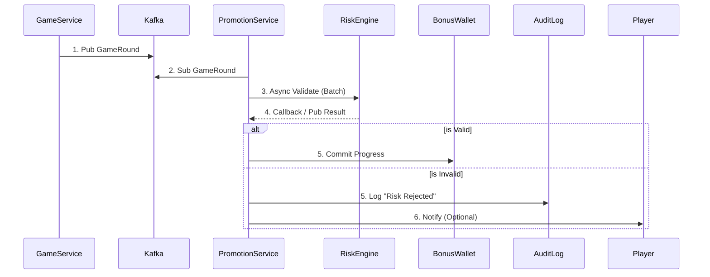

博彩包網平台的活動系統（Promotion System）是玩家獲取與留存的核心引擎。本指南提供一套完整的系統架構設計與運營策略框架，涵蓋規則引擎、獎勵計算、多租戶架構、跨遊戲整合，以及針對東南亞、拉丁美洲、歐洲、中國四大市場的本地化策略。**關鍵發現：獎金濫用佔 iGaming 詐騙的 63.8%**，因此風控機制必須與活動系統深度整合。

---

## 模組化活動引擎的核心架構

現代 iGaming 平台普遍採用**微服務架構**構建活動系統，頂尖平台通常運行 40+ 個獨立微服務處理特定功能。這種架構實現了「無需開發即可上線新活動」的靈活性目標。

### 系統架構總覽

```
┌─────────────────────────────────────────────────────────────────────┐
│                         API Gateway                                  │
│              (Rate Limiting, Auth, Tenant Routing)                  │
└───────────────────────────┬─────────────────────────────────────────┘
                            │
    ┌───────────────────────┼───────────────────────┐
    │                       │                       │
┌───▼───┐            ┌──────▼──────┐          ┌────▼────┐
│ 活動   │            │   獎勵      │          │  錢包   │
│ 引擎   │◄──────────►│   引擎      │◄────────►│  服務   │
│       │            │            │          │        │
└───┬───┘            └──────┬──────┘          └────┬────┘
    │                       │                      │
    │    ┌──────────────────┼──────────────────────┘
    │    │                  │
┌───▼────▼───┐       ┌──────▼──────┐        ┌───────────┐
│   規則     │       │   流水追蹤   │        │   風控    │
│   引擎     │       │   服務      │        │   服務    │
└────────────┘       └─────────────┘        └───────────┘
         │                  │                     │
         └──────────────────┼─────────────────────┘
                            │
                  ┌─────────▼─────────┐
                  │   Event Bus       │
                  │  (Kafka/NATS)     │
                  └───────────────────┘
```

### 規則引擎（Rule Engine）設計

規則引擎是實現高度可配置性的核心，採用**策略模式**分離業務邏輯與執行流程：

**規則介面模式：**

```
interface IPromotionRule {
  ruleId: string;
  priority: number;
  evaluate(context: PlayerContext): boolean;  // 判斷是否符合條件
  execute(context: PlayerContext): RewardResult;  // 執行獎勵發放
}

class PromotionRulesEngine {
  private rules: IPromotionRule[];
  
  evaluate(context: PlayerContext): RewardResult[] {
    return this.rules
      .filter(rule => rule.evaluate(context))
      .sort((a, b) => a.priority - b.priority)
      .map(rule => rule.execute(context));
  }
}
```

**規則類型分類：**

|規則類型|說明|配置範例|
|---|---|---|
|觸發條件 (Trigger)|何時觸發活動|首存、累計存款、特定時段|
|資格條件 (Eligibility)|誰可以參與|VIP 等級、註冊天數、地區|
|獎勵計算 (Reward)|給予什麼獎勵|百分比匹配、固定金額、免費旋轉|
|限制條件 (Constraint)|使用限制|流水倍數、最大投注、有效期|

### 獎勵引擎支援的獎勵類型

|獎勵類型|技術實現|特殊處理|
|---|---|---|
|現金獎勵|直接計入可提現餘額|無限制，直接到帳|
|彩金/紅利|獨立獎金餘額，需完成流水|錢包隔離，流水追蹤|
|免費旋轉|Token 化旋轉積分，綁定特定遊戲|遊戲供應商 API 整合|
|免費投注|無本金投注 Token（體育專用）|投注額不返還，僅派彩|
|實物獎品|訂單佇列整合物流系統|兌換流程、物流追蹤|
|忠誠積分|積分帳本，支援兌換與升級|等級計算、點數過期|

---

## 後台配置系統實現無代碼部署

### JSON Schema 驅動的活動配置

透過 JSON Schema 定義活動結構，配合視覺化後台實現運營人員自主配置：

```
{
  "promotionId": "promo-uuid-001",
  "name": "春節首存加碼",
  "type": "DEPOSIT_BONUS",
  "status": "ACTIVE",
  "schedule": {
    "startDate": "2026-01-28T00:00:00+08:00",
    "endDate": "2026-02-15T23:59:59+08:00"
  },
  "eligibility": {
    "playerSegments": ["NEW_PLAYER", "VIP_GOLD"],
    "minDeposit": 100,
    "maxClaims": 1,
    "validCountries": ["TH", "VN", "PH", "MY"]
  },
  "reward": {
    "type": "PERCENTAGE_MATCH",
    "matchPercentage": 188,
    "maxReward": 8888,
    "currency": "CNY"
  },
  "wageringRequirements": {
    "multiplier": 25,
    "appliesTo": "BONUS_ONLY",
    "timeLimit": 30,
    "contributionRates": {
      "slots": 100,
      "liveDealer": 15,
      "tableGames": 10,
      "sportsbook": 100
    },
    "maxBet": 50
  }
}
```

### 多租戶架構下的活動管理

針對白標/包網場景，活動系統需同時支援**平台級活動**與**營運商自定義活動**：

```
┌─────────────────────────────────────────────────────────────┐
│                   多租戶活動架構                              │
├─────────────────────────────────────────────────────────────┤
│  ┌──────────┐    ┌──────────┐    ┌──────────┐              │
│  │ 營運商 A │    │ 營運商 B │    │ 營運商 C │              │
│  │(tenant_1)│    │(tenant_2)│    │(tenant_3)│              │
│  └────┬─────┘    └────┬─────┘    └────┬─────┘              │
│       │               │               │                     │
│       └───────────────┼───────────────┘                     │
│                       │                                      │
│            ┌──────────▼──────────┐                          │
│            │   租戶上下文路由器   │                          │
│            └──────────┬──────────┘                          │
│                       │                                      │
│    ┌──────────────────┼──────────────────┐                  │
│    │                  │                  │                  │
│  ┌─▼──────┐     ┌─────▼─────┐     ┌──────▼─────┐           │
│  │營運商   │     │  平台級    │     │  品牌配置  │           │
│  │專屬活動 │     │  共享活動  │     │  覆蓋設定  │           │
│  │(Row-RLS)│     │           │     │            │           │
│  └─────────┘     └───────────┘     └────────────┘           │
└─────────────────────────────────────────────────────────────┘
```

**數據隔離策略：**

- **大型營運商**：獨立數據庫，完全隔離
- **中型營運商**：Schema 隔離（PostgreSQL Schema）   
- **小型營運商**：Row-Level Security（tenant_id 欄位 + RLS 策略）
    

---

## 跨遊戲類型的統一流水計算框架

不同遊戲類型的莊家優勢差異巨大（老虎機 ~5%、二十一點 ~0.5%），必須透過**貢獻率系統**標準化流水計算：

### 流水貢獻率標準配置

|遊戲類型|典型貢獻率|原因說明|
|---|---|---|
|老虎機/Slots|100%|高莊家優勢，標準基準|
|體育博彩|100%|結果不可控，風險可接受|
|刮刮卡|100%|單次結果型遊戲|
|輪盤|10-20%|可對沖投注|
|百家樂|10-15%|接近 50/50 賠率|
|二十一點|5-10%|低莊家優勢，可計牌|
|視頻撲克|10-20%|策略可降低莊家優勢|
|真人娛樂場|5-15%|與桌遊類似|
|撲克（抽水池）|0%|玩家對玩家，通常排除|

**有效流水計算公式：**

```
有效流水 = 實際投注額 × (貢獻率 / 100)

範例：在二十一點投注 $100，貢獻率 10%
有效流水 = $100 × 0.1 = $10 計入流水要求
```

### 統一玩家活動追蹤事件結構

```
{
  "eventType": "GAME_ROUND_COMPLETED",
  "timestamp": "2026-01-24T15:30:00+08:00",
  "playerId": "player-uuid",
  "tenantId": "operator-uuid",
  "vertical": "CASINO",
  "gameType": "SLOTS",
  "gameId": "game-uuid",
  "providerId": "provider-uuid",
  "data": {
    "betAmount": 10.00,
    "winAmount": 25.00,
    "currency": "USD",
    "roundId": "round-uuid"
  },
  "bonusContext": {
    "activeBonusId": "bonus-uuid",
    "contributionRate": 100,
    "effectiveContribution": 10.00,
    "progressBefore": 500.00,
    "progressAfter": 510.00,
    "requiredTotal": 3000.00
  }
}
```

### 有效流水驗證邏輯 (Valid Turnover Validation)
流水計算不應只看 "Bet Amount"，必須過濾 **無風險投注 (Risk-Free Bet)** 與 **對沖投注 (Hedge Betting)**。為避免影響遊戲即時性，此過程採用 **非同步驗證 (Asynchronous Validation)**。

**驗證流程 (Validation Flow)**：
1. **事件接收**: `Promotion Service` 收到 `GameRound` 事件，先標記流水狀態為 `PENDING`。
2. **異步風控**: 
    - 將注單 ID 發送至 Kafka Topic `risk.turnover.validate`。
    - 調用 `RiskEngine.validateTurnover(batchBets)` (參見 `05-01_Risk_Control_System.md`)。
3. **結果處理**:
    - **Valid**: 更新流水狀態為 `COMPLETED`，累積進度。
    - **Invalid (Hedge/Arbitrage)**: 
        - 更新狀態為 `REJECTED`。
        - 記錄拒絕原因 (e.g. `Reason: HEDGE_BET_DETECTED`)。
        - 若已發放獎勵，觸發 **Rollback** 機制扣回。

**數據流圖**:


### 統一流水驗證架構 (Unified Turnover Validation Architecture)

為確保 **Activity System (活動系統)** 與 **Finance System (財務系統, 02-04)** 的流水計算一致性，兩者必須共用統一的基礎驗證邏輯,避免產生數據偏差導致玩家投訴或財務風險。

#### 架構原則 (Architecture Principles)

```
┌─────────────────────────────────────────────────────────────────┐
│              Unified Turnover Validation Stack                  │
├─────────────────────────────────────────────────────────────────┤
│                                                                 │
│  Layer 1: Base Validation (Single Source of Truth)             │
│  ┌───────────────────────────────────────────────────────────┐ │
│  │  RiskEngine.validateTurnover() (05-01 Risk Control)       │ │
│  │  - Filter: Hedge Detection (對沖投注檢測)                  │ │
│  │  - Filter: Arbitrage Detection (套利投注檢測)              │ │
│  │  - Filter: Low Odds (<1.5, configurable)                  │ │
│  │  - Output: effective_turnover_base (基礎有效流水)          │ │
│  └───────────────────────────────────────────────────────────┘ │
│                           ↓                                     │
│  Layer 2: Finance Layer (02-04 Finance Center)                 │
│  ┌───────────────────────────────────────────────────────────┐ │
│  │  effective_turnover_base × status_factor                  │ │
│  │  - WIN: 1.0 (玩家贏,計入流水)                              │ │
│  │  - LOSS: 1.0 (玩家輸,計入流水)                             │ │
│  │  - DRAW/TIE: 0 (和局,無風險,不計流水)                      │ │
│  │  - VOID/CANCEL: 0 (注單作廢)                               │ │
│  │  - HALF_WIN/HALF_LOSS: 0.5 (半贏半輸)                      │ │
│  │  → Output: valid_turnover_finance (財務有效流水)           │ │
│  └───────────────────────────────────────────────────────────┘ │
│                           ↓                                     │
│  Layer 3: Activity Layer (04-01 Activity Center)               │
│  ┌───────────────────────────────────────────────────────────┐ │
│  │  valid_turnover_finance × game_weight                     │ │
│  │  - Slots (老虎機): 1.0 (100% contribution)                 │ │
│  │  - Sports (體育): 1.0                                      │ │
│  │  - Baccarat (百家樂): 0.1-0.15 (10-15%)                    │ │
│  │  - Blackjack (二十一點): 0.05-0.1 (5-10%)                  │ │
│  │  - Roulette (輪盤): 0.1-0.2                                │ │
│  │  → Output: activity_valid_turnover (活動有效流水)          │ │
│  └───────────────────────────────────────────────────────────┘ │
│                                                                 │
└─────────────────────────────────────────────────────────────────┘
```

#### API 契約定義 (API Contract Definition)

**Base Validation API** (Provided by Risk Engine - 05-01):

```typescript
// Risk Engine provides this API for cross-module consumption
interface ValidateTurnoverRequest {
  bet_id: string;
  player_id: string;
  game_type: GameType;  // SLOTS, SPORTS, BACCARAT, etc.
  bet_amount: number;
  odds: number;
  odds_type: OddsType;  // EUR, HK, MY, ID
  bet_pattern?: BetPattern[];  // For multi-bet analysis
}

interface ValidateTurnoverResponse {
  is_valid: boolean;
  effective_turnover_base: number;  // Base valid turnover after risk checks
  risk_code: RiskCode;  // VALID, HEDGE_DETECTED, ARBITRAGE, LOW_ODDS
  rejection_reason?: string;
}

// Example usage:
const result = await RiskEngine.validateTurnover({
  bet_id: "bet-uuid-001",
  player_id: "player-uuid-123",
  game_type: GameType.BACCARAT,
  bet_amount: 100,
  odds: 1.95,
  odds_type: OddsType.EUR
});
// Returns: { is_valid: true, effective_turnover_base: 100, risk_code: "VALID" }
```

#### 計算鏈路示例 (Calculation Chain Example)

假設玩家在百家樂 (Baccarat) 投注 $100,賠率 1.95 (歐洲盤),最終結果 WIN:

```
Step 1 (Risk Engine - 05-01):
  Input: bet_amount = $100, odds = 1.95, game = BACCARAT
  Check: odds >= 1.5 ✓, no hedge detected ✓
  Output: effective_turnover_base = $100

Step 2 (Finance Layer - 02-04):
  Input: effective_turnover_base = $100, status = WIN
  Apply: status_factor = 1.0 (WIN counts as valid)
  Output: valid_turnover_finance = $100 × 1.0 = $100

Step 3 (Activity Layer - 04-01):
  Input: valid_turnover_finance = $100, game = BACCARAT
  Apply: game_weight = 0.15 (15% contribution for baccarat)
  Output: activity_valid_turnover = $100 × 0.15 = $15

Result:
  - Finance System records: $100 valid turnover (for VIP/rebate)
  - Activity System records: $15 wagering progress (for bonus clearing)
```

#### 跨模組一致性保障機制 (Cross-Module Consistency Mechanisms)

1. **統一事件源 (Unified Event Source)**:
   - 所有注單結算事件 `GameRound.Settled` 必須同時發送至:
     - Finance Turnover Service (財務流水服務)
     - Activity Wagering Service (活動流水服務)
   - 兩者均訂閱相同的 Kafka Topic: `game.rounds.settled`

2. **同步驗證調用 (Synchronized Validation Call)**:
   - Finance 與 Activity 模組均需調用 `RiskEngine.validateTurnover()` 作為第一步
   - 不可各自實作風控邏輯,避免邏輯分歧

3. **每日對帳報告 (Daily Reconciliation Report)**:
   - **執行時間**: 每日凌晨 03:00 (after daily settlement)
   - **對帳邏輯**:
     ```sql
     -- Compare Finance vs Activity turnover calculations
     SELECT
       f.player_id,
       f.date,
       f.total_valid_turnover AS finance_turnover,
       a.total_wagering_contribution AS activity_turnover,
       a.total_wagering_contribution / f.total_valid_turnover AS expected_ratio,
       ABS(a.total_wagering_contribution - (f.total_valid_turnover * a.weighted_avg_game_contribution)) AS deviation
     FROM finance_daily_summary f
     JOIN activity_daily_summary a ON f.player_id = a.player_id AND f.date = a.date
     WHERE deviation > (f.total_valid_turnover * 0.0001)  -- Threshold: 0.01% deviation
     ORDER BY deviation DESC
     LIMIT 100;
     ```
   - **警報觸發**: 若任何玩家的偏差 >0.01%,觸發 Slack/Email 警報至財務與風控團隊
   - **根因分析**: 常見原因包括:
     - 時區差異 (Finance 用 UTC, Activity 用 Local Time)
     - 重複計算 (同一注單被處理兩次)
     - 遊戲權重配置不一致

4. **配置集中管理 (Centralized Configuration)**:
   - **遊戲權重表 (Game Weight Table)** 必須存放於統一配置服務 (Config Service)
   - Finance 與 Activity 模組均需從此服務讀取,禁止硬編碼 (Hardcoding)
   - 範例配置結構:
     ```json
     {
       "game_weights": {
         "SLOTS": 1.0,
         "SPORTS": 1.0,
         "BACCARAT": 0.15,
         "BLACKJACK": 0.10,
         "ROULETTE": 0.20
       },
       "odds_thresholds": {
         "EUR": 1.5,
         "HK": 0.5,
         "MY": 0.5,
         "ID": 1.2
       }
     }
     ```

---

## 事件驅動架構實現即時活動觸發

採用 Apache Kafka 作為事件總線，實現毫秒級的活動觸發響應：

### 事件處理流程

```
玩家動作 → 遊戲服務 → Kafka Topic →
  → 活動觸發消費者
    → 資格檢查服務
    → 獎勵計算服務
    → 錢包服務（發放）
    → 通知服務（推播/站內信）
```

**關鍵 Topic 結構：**

```
Topics:
├── player.activity.casino     # 娛樂場遊戲活動
├── player.activity.sports     # 體育投注活動
├── player.activity.poker      # 撲克活動
├── player.deposits            # 存款事件
├── player.registrations       # 註冊事件
├── promotion.triggers         # 活動觸發
├── promotion.claims           # 活動領取
├── reward.distributions       # 獎勵發放
└── wagering.updates           # 流水更新
```

### 推薦技術棧

|層級|技術選型|用途|
|---|---|---|
|API 閘道|Kong / AWS API Gateway|限流、認證、路由|
|服務通訊|gRPC（內部）/ REST（外部）|高效內部調用|
|事件串流|Apache Kafka + Kafka Streams|即時事件處理|
|主數據庫|PostgreSQL + JSONB|活動配置、ACID 事務|
|高併發寫入|ScyllaDB / CockroachDB|流水記錄、交易日誌|
|緩存|Redis Cluster|玩家狀態、活動快取|
|搜尋|Elasticsearch|活動搜尋、玩家查詢|

---

## 玩家生命週期活動設計策略

### 各階段活動框架

|階段|目標|核心活動類型|關鍵指標|
|---|---|---|---|
|**拉新**|轉化註冊|首存獎勵、無存款獎勵|FTD 轉化率、CAC|
|**激活**|首次體驗|任務系統、新手引導|首日留存、遊戲嘗試數|
|**留存**|長期黏著|每日簽到、VIP、連續登入|MAU、流失率、LTV|
|**召回**|喚醒流失|專屬回歸禮、限時優惠|召回成本、再存款率|

### 首存獎勵設計最佳實踐

**業界標準參數範圍：**

|參數|低端|平均|高端|
|---|---|---|---|
|匹配比例|50%|100%|200%+|
|最高金額|$100|$500|$2,000+|
|流水倍數|15x|35x|50x|
|完成期限|7 天|14 天|30 天|

**進階首存包設計（多筆存款）：**

- 首存：100% 最高 $500 + 50 免費旋轉
- 二存：50% 最高 $300 + 30 免費旋轉
- 三存：25% 最高 $200 + 20 免費旋轉

### 返水/反水系統設計

**損失型返水 vs 流水型返水：**

|類型|計算基礎|典型比例|適用對象|
|---|---|---|---|
|損失型 Cashback|淨輸額|5-25%|休閒玩家|
|流水型 Rebate|總投注額|0.2-0.8%|高頻玩家|
|VIP Rakeback|投注額（分層）|10-25%|頂級 VIP|

**返水計算公式：**

```
損失型：返水 = (總投注 - 總派彩) × 返水比例
流水型：返水 = 總投注額 × 返水比例
範例（流水型）：0.5% × $10,000 投注 = $50 返水
```

### VIP 階層系統設計

**標準五級架構：**

|等級|積分門檻|核心權益|
|---|---|---|
|銅牌|0|基礎返水、標準客服|
|銀牌|1,000|10% 返水加成、生日禮金|
|金牌|5,000|15% 返水、快速提款、專屬獎勵|
|白金|20,000|20% 返水、VIP 經理、專屬活動|
|鑽石|50,000|25% 返水、豪華禮品、旅遊獎勵|

**進階 VIP 機制：**

- **等級匹配**：匹配競爭對手的 VIP 等級    
- **負數不結轉**：上月未完成流水不影響本月
- **專屬經理**：白金以上提供 24/7 專屬服務

---

## 區域市場本地化策略

### 東南亞市場（泰國、越南、印尼、菲律賓、馬來西亞）

**核心策略：移動優先 + 節慶驅動 + 遊戲化**

**重要節慶活動日曆：**

|節慶|時間|活動設計建議|
|---|---|---|
|農曆新年/Tết|1-2月|紅包獎勵、888 幸運數字、龍主題老虎機|
|潑水節 Songkran|4月13-15日|「清涼」獎勵、水主題遊戲、刷新彩金|
|開齋節|齋戒月後|慶祝獎勵、家庭團聚主題|
|中秋節|8-9月|月餅主題、燈籠活動|

**支付與技術要點：**

- **支付**：GCash（菲）、PromptPay（泰）、電子錢包為主
- **遊戲**：捕魚遊戲極受歡迎、真人娛樂為核心期待
- **技術**：App 必須 <5MB、直式畫面設計、75%+ 收入來自移動端

### 拉丁美洲市場（巴西、墨西哥、阿根廷、哥倫比亞）

**核心策略：足球整合 + PIX 支付 + 低門檻**

**足球是王道：** 81% 的巴西投注者偏好足球投注，活動必須深度整合當地聯賽（Liga MX、Copa Libertadores）與歐洲聯賽。

**重要節慶：**

|節慶|時間|活動設計|
|---|---|---|
|嘉年華|2-3月|派對主題、桑巴老虎機、延長促銷|
|亡靈節|11月1-2日|骷髏/萬壽菊主題老虎機|
|世界盃/美洲盃|定期|全區超級活動、支持國家隊|

**巴西支付核心：** PIX 佔 iGaming 交易 81-90%，即時、免費、24/7 運作。**信用卡已被禁止**用於博彩交易。

### 歐洲市場（英國、德國、西班牙、義大利）

**核心策略：合規優先 + 負責任博彩整合**

**英國 2026 年 1 月新規（重大變更）：**

- **流水倍數上限 10x**（從 50x+ 大幅下調）
- **禁止混合產品促銷**（不能將博彩+娛樂場合併為單一優惠）
- **老虎機投注上限**：£5/旋（25歲以上）、£2/旋（18-24歲）
- **財務脆弱性檢查**：30 天內淨存款 £500 觸發審查

**德國限制：**

- 老虎機每次旋轉**最高 €1**
- 6am-9pm **禁止電視/網路廣告**
- **禁止公開獎金促銷**    

**GDPR 營銷要求：**

- 必須**明確同意 (opt-in)** 接收營銷   
- 按產品類型分開同意（博彩 vs 娛樂場）
- 提供簡易退訂機制    

### 中國/華人市場

**核心策略：幸運數字 + 紅包機制 + 社交分享**

**重要節慶：**

|節慶|活動設計|
|---|---|
|春節|紅包獎勵、888 彩金、龍鳳主題|
|中秋節|月餅主題老虎機、團圓獎勵|
|雙十一|購物節跨界促銷|
|國慶黃金周|七日連續活動|

**數字與顏色象徵：**

- **幸運數字**：8（發）、88、888、9（長久）、6（順利）
- **禁忌數字**：4（死）— 獎金金額絕對避免    
- **幸運顏色**：紅色（主色調）、金色（財富）    
- **禁忌**：白色/黑色組合（喪禮聯想）    

**遊戲偏好**：百家樂佔據絕對主導地位（澳門 95% 賭桌）、骰寶、麻將、龍虎。

---

## 風控與反欺詐機制設計

**獎金濫用佔 iGaming 詐騙的 63.8%**，2022-2024 年詐騙率上升 64%。風控必須與活動系統深度整合。

### 常見獎金濫用手法與防範

|濫用類型|手法說明|檢測方法|
|---|---|---|
|多重帳號|使用不同身份重複領取歡迎獎勵|設備指紋、IP 關聯、行為分析|
|獎金獵人|系統性鎖定低流水要求平台|投注模式分析、快速提款監控|
|套利投注|跨平台對沖所有可能結果|異常賠率投注、多平台數據共享|
|籌碼傾倒|撲克中故意輸給同夥帳號|同桌頻率分析、輸贏模式追蹤|

### 多層風險評估系統

```
┌────────────────────────────────────────────────────┐
│              多層風控架構                           │
├────────────────────────────────────────────────────┤
│                                                    │
│  設備層 ──► 設備指紋、模擬器檢測、GPS 欺騙檢測      │
│     ↓                                              │
│  身份層 ──► KYC 驗證狀態、文件真實性、生物識別      │
│     ↓                                              │
│  行為層 ──► 投注模式、存取款行為、遊戲偏好          │
│     ↓                                              │
│  網絡層 ──► 已知欺詐者關聯、共享屬性檢測            │
│     ↓                                              │
│  綜合風險評分 ──► 實時決策                         │
│                                                    │
└────────────────────────────────────────────────────┘
```

### KYC 分層驗證策略

|階段|觸發點|驗證內容|
|---|---|---|
|輕量 KYC|註冊時|Email/電話驗證、基本身份|
|增強 KYC|首次存款|文件驗證、活體檢測|
|完整 KYC|首次提款|資金來源、生物識別再驗證|
|持續監控|全生命週期|行為異常檢測|

### 負責任博彩整合要點

活動系統必須尊重玩家設定的保護機制：

- **存款限額檢查**：獎金激活前驗證不會超過玩家限額
- **自我排除整合**：排除名單中的玩家禁止接收任何促銷
- **冷卻期遵守**：暫停期間停止所有營銷通訊    
- **問題賭博識別**：當觸發風險指標時自動停止促銷推送    

---

## 數據驅動的活動優化框架

### 核心 KPI 指標體系

**獲客指標：**

|指標|公式|用途|
|---|---|---|
|玩家獲取率 (PAR)|新玩家 ÷ 獨立訪客 × 100|轉化效率|
|首存轉化率 (FTD)|首存玩家 ÷ 註冊數 × 100|激活效率|
|獲客成本 (CAC)|營銷總支出 ÷ 新客數|成本效益|

**營收指標：**

|指標|公式|說明|
|---|---|---|
|毛博彩收入 (GGR)|總投注 - 總派彩|頂線收入|
|淨博彩收入 (NGR)|GGR - 獎金 - 稅費|真實利潤|
|玩家終身價值 (LTV)|預測總收入|1% 玩家 = 40% GGR|

**活動專屬指標：**

|指標|說明|
|---|---|
|獎金清償率|成功完成流水的獎金比例|
|獎金率|獎金支出 ÷ 總存款|
|獎金玩家佔比|使用獎金的活躍玩家比例|
|獎金 ROI|(增量 NGR - 獎金成本) ÷ 獎金成本|

### A/B 測試框架

**可測試元素：**

- 獎金金額與結構
- 流水倍數    
- 促銷文案與 CTA    
- 落地頁設計
- Email 標題與發送時間
- 獎金解鎖機制    

**測試最佳實踐：**

1. 定義清晰、可量測的目標
2. 一次只測試一個變量
3. 確保足夠樣本量達統計顯著性
4. 運行足夠長時間涵蓋週期變化   
5. 同時追蹤短期（轉化）與長期（LTV）指標    

---

## 活動模板庫設計參考

### 存款獎勵模板

```
{
  "templateId": "DEPOSIT_BONUS_V1",
  "name": "標準存款獎勵",
  "category": "DEPOSIT",
  "configSchema": {
    "matchPercentage": { "type": "number", "min": 10, "max": 500 },
    "maxBonus": { "type": "number", "min": 10 },
    "minDeposit": { "type": "number", "min": 1 },
    "wageringMultiplier": { "type": "number", "min": 1, "max": 100 },
    "validDays": { "type": "integer", "min": 1, "max": 90 }
  },
  "defaultValues": {
    "matchPercentage": 100,
    "wageringMultiplier": 30,
    "validDays": 14
  }
}
```

### 每日簽到模板

```
{
  "templateId": "DAILY_LOGIN_V1",
  "name": "連續簽到獎勵",
  "category": "ENGAGEMENT",
  "configSchema": {
    "rewards": {
      "type": "array",
      "items": {
        "day": "integer",
        "rewardType": "enum[CASH, BONUS, FREE_SPINS, POINTS]",
        "amount": "number"
      }
    },
    "streakReset": { "type": "boolean" },
    "maxStreak": { "type": "integer" }
  }
}
```

### 排行榜活動模板

```
{
  "templateId": "LEADERBOARD_V1",
  "name": "競賽排行榜",
  "category": "TOURNAMENT",
  "configSchema": {
    "scoringMethod": {
      "type": "enum",
      "options": ["MULTIPLIER", "TOTAL_WAGER", "BIGGEST_WIN", "POINTS"]
    },
    "prizePool": { "type": "number" },
    "prizeDistribution": {
      "type": "array",
      "items": { "rank": "integer", "percentage": "number" }
    },
    "eligibleGames": { "type": "array", "items": "gameId" },
    "duration": { "type": "enum", "options": ["DAILY", "WEEKLY", "MONTHLY"] }
  }
}
```

---

## 實施優先順序建議

### 第一階段：核心基礎（1-3 個月）

1. 規則引擎框架與基礎活動模板
2. 多租戶活動隔離機制
3. 統一流水追蹤服務    
4. 基礎 KYC 與風控整合    

### 第二階段：功能擴展（3-6 個月）

1. 事件驅動即時觸發
2. VIP 階層系統   
3. 返水/返傭自動化    
4. 排行榜與錦標賽功能    

### 第三階段：智能優化（6-12 個月）

1. A/B 測試平台
2. AI 驅動的玩家分群    
3. 個性化活動推薦    
4. 預測性分析與 LTV 建模    

### 關鍵成功因素

- **從模板開始**：先建立常見活動類型的標準模板
- **事件優先設計**：所有玩家行為從第一天就以事件形式記錄
- **Schema 驗證**：所有配置使用 JSON Schema 驗證   
- **冪等操作**：分散式處理中的關鍵保障
- **全面審計**：不可變日誌確保合規    
- **區域合規**：歐洲市場的負責任博彩不是選項，是必要條件

本指南提供了構建高度可配置、跨市場、風控完善的 iGaming 活動系統所需的完整框架。實際實施時應根據具體業務規模、目標市場、技術能力進行調整，並持續關注各地區監管變化。

---

## 動態配置與審批 (Dynamic Config & Approval)

為確保活動運營靈活性與資金安全，系統內所有規則必須可配置，且關鍵變更需經審批。

### 1. 動態配置項 (Dynamic Configuration)
- **硬編碼禁止**：嚴禁將 "Deposit > 100" 或 "Bonus = 50%" 等規則寫死在代碼中。所有變數必須來自後台配置。
- **可配置範疇**：
  - **觸發條件**：存款金額、流水倍數、遊戲列表、有效時間。
  - **獎勵參數**：紅利百分比、最大上限、派發錢包類型。
  - **客群定向**：適用國家、VIP 等級、排除名單。

### 2. 審批工作流 (Approval Workflow)
- **活動發布審批**：
  - **Maker**：運營人員創建活動草稿 (Draft)，配置所有參數。
  - **Checker**：運營主管或財務 (視預算規模) 複核活動成本與條款。
  - **Action**：批准後，活動狀態轉為 "Ready/Active"。
- **敏感變更審批**：
  - **定義**：若活動進行中需 "增加預算" 或 "降低流水要求"，視為高風險操作。
  - **流程**：需觸發二級審批 (財務總監或更高層級)，確保變更不會導致預算失控。