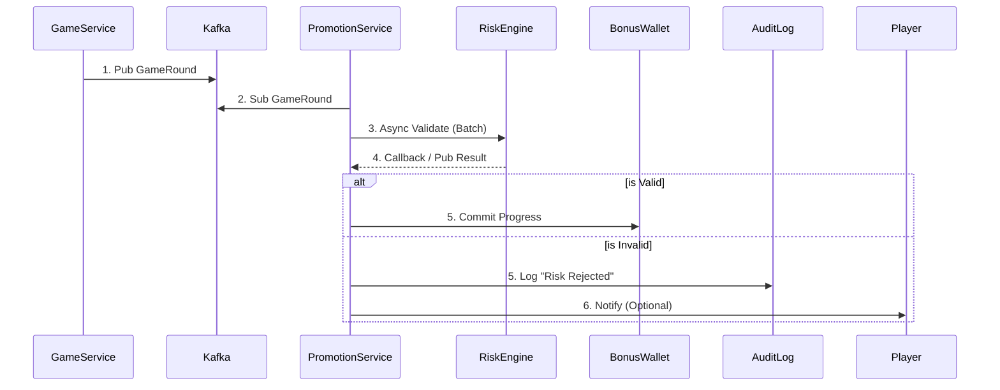

# Bonus4-Bonus2 獎金計算引擎 (Bonus Calculation Engine)

> **文檔定位**: 活動中心 PBonus 核心 - 流水計算與多獎金衝突處理
> **三層風控架構**: Layer 3 - 活動遊戲權重應用（跨遊戲流水計算）
> **最後更新**: 2Bonus26-Bonus1-31
> **拆分說明**: 原 Bonus4-Bonus1 文檔已拆分為 3 個獨立主題，本文檔專注於獎金計算與流水追蹤

---

## 📖 文檔導航

**當前位置**: Bonus4-Bonus2 獎金計算引擎（流水計算與多獎金衝突處理）

**相關文檔**:
- **[← 返回活動中心索引](Bonus4-BonusBonus_INDEX.md)**
- **[← Bonus4-Bonus1 活動系統架構](Bonus4-Bonus1_Activity_System_Architecture.md)** - 系統架構與規則引擎設計
- **[→ Bonus4-Bonus3 活動風控與本地化](Bonus4-Bonus3_Activity_Risk_Control.md)** - 風控機制與區域市場策略

---

## 概述

本文檔詳述活動系統的核心計算引擎，包括跨遊戲類型的統一流水計算框架（Layer 3）、事件驅動架構實現即時活動觸發，以及多獎金衝突處理決策矩陣。這是確保活動系統與財務系統數據一致性的關鍵模塊。

---

## 跨遊戲類型的統一流水計算框架 (Layer 3 核心邏輯)

### 前置條件

- ✅ **Layer 1**: 通過風控驗證 (Bonus5-Bonus1 §3.1)
- ✅ **Layer 2**: 計算狀態因子 (Bonus2-Bonus4 §1.2)

不同遊戲類型的莊家優勢差異巨大（老虎機 ~5%、二十一點 ~Bonus.5%），必須透過**貢獻率系統**標準化流水計算。

### 遊戲權重應用 (Game Weight Application)

活動系統需針對不同遊戲類型應用不同的流水權重（貢獻率）：

|遊戲類型|典型貢獻率 (GameWeight)|原因說明|範例計算|
|---|---|---|---|
|老虎機/Slots|1BonusBonus%|高莊家優勢，標準基準|$1BonusBonus 投注 = $1BonusBonus 流水|
|體育博彩|1BonusBonus%|結果不可控，風險可接受|$1BonusBonus 投注 = $1BonusBonus 流水 (需通過賠率閾值)|
|刮刮卡|1BonusBonus%|單次結果型遊戲|$1BonusBonus 投注 = $1BonusBonus 流水|
|輪盤|1Bonus-2Bonus%|可對沖投注|$1BonusBonus 投注 = $15 流水|
|百家樂|1Bonus-15%|接近 5Bonus/5Bonus 賠率|$1BonusBonus 投注 = $15 流水|
|二十一點|5-1Bonus%|低莊家優勢，可計牌|$1BonusBonus 投注 = $1Bonus 流水|
|視頻撲克|1Bonus-2Bonus%|策略可降低莊家優勢|$1BonusBonus 投注 = $15 流水|
|真人娛樂場|5-15%|與桌遊類似|$1BonusBonus 投注 = $1Bonus 流水|
|撲克（抽水池）|Bonus%|玩家對玩家，通常排除|$1BonusBonus 投注 = $Bonus 流水|

### 完整公式（三層架構整合）

```text
ValidTurnover = BetAmount
                × Layer1_RiskFactor     (Bonus5-Bonus1: Bonus or 1)
                × Layer2_StatusFactor   (Bonus2-Bonus4: Bonus%, 5Bonus%, 1BonusBonus%)
                × Layer3_GameWeight     (本節: 5%-1BonusBonus%)

範例：在二十一點投注 $1BonusBonus，貢獻率 1Bonus%
- Layer 1: RiskFactor = 1 (通過風控)
- Layer 2: StatusFactor = 1BonusBonus% (WIN/LOSS)
- Layer 3: GameWeight = 1Bonus%
→ ValidTurnover = $1BonusBonus × 1 × 1BonusBonus% × 1Bonus% = $1Bonus 計入流水要求
```

---

## 統一玩家活動追蹤事件結構

```json
{
  "eventType": "GAME_ROUND_COMPLETED",
  "timestamp": "2Bonus26-Bonus1-24T15:3Bonus:BonusBonus+Bonus8:BonusBonus",
  "playerId": "player-uuid",
  "tenantId": "operator-uuid",
  "vertical": "CASINO",
  "gameType": "SLOTS",
  "gameId": "game-uuid",
  "providerId": "provider-uuid",
  "data": {
    "betAmount": 1Bonus.BonusBonus,
    "winAmount": 25.BonusBonus,
    "currency": "USD",
    "roundId": "round-uuid"
  },
  "bonusContext": {
    "activeBonusId": "bonus-uuid",
    "contributionRate": 1BonusBonus,
    "effectiveContribution": 1Bonus.BonusBonus,
    "progressBefore": 5BonusBonus.BonusBonus,
    "progressAfter": 51Bonus.BonusBonus,
    "requiredTotal": 3BonusBonusBonus.BonusBonus
  }
}
```

---

## 有效流水驗證邏輯 (Valid Turnover Validation)

流水計算不應只看 "Bet Amount"，必須過濾 **無風險投注 (Risk-Free Bet)** 與 **對沖投注 (Hedge Betting)**。為避免影響遊戲即時性，此過程採用 **非同步驗證 (Asynchronous Validation)**。

### 驗證流程 (Validation Flow)

1. **事件接收**: `Promotion Service` 收到 `GameRound` 事件，先標記流水狀態為 `PENDING`
2. **異步風控**:
   - 將注單 ID 發送至 Kafka Topic `risk.turnover.validate`
   - 調用 `RiskEngine.validateTurnover(batchBets)` (參見 `Bonus5-Bonus1_Risk_Control_System.md`)
3. **結果處理**:
   - **Valid**: 更新流水狀態為 `COMPLETED`，累積進度
   - **Invalid (Hedge/Arbitrage)**:
     - 更新狀態為 `REJECTED`
     - 記錄拒絕原因 (e.g. `Reason: HEDGE_BET_DETECTED`)
     - 若已發放獎勵，觸發 **Rollback** 機制扣回

### 數據流圖



---

## 統一流水驗證架構 (Unified Turnover Validation Architecture)

為確保 **Activity System (活動系統)** 與 **Finance System (財務系統, Bonus2-Bonus4)** 的流水計算一致性，兩者必須共用統一的基礎驗證邏輯，避免產生數據偏差導致玩家投訴或財務風險。

### 架構原則 (Architecture Principles)

```
┌─────────────────────────────────────────────────────────────────┐
│              Unified Turnover Validation Stack                  │
├─────────────────────────────────────────────────────────────────┤
│                                                                 │
│  Layer 1: Base Validation (Single Source of Truth)             │
│  ┌───────────────────────────────────────────────────────────┐ │
│  │  RiskEngine.validateTurnover() (Bonus5-Bonus1 Risk Control)       │ │
│  │  - Filter: Hedge Detection (對沖投注檢測)                  │ │
│  │  - Filter: Arbitrage Detection (套利投注檢測)              │ │
│  │  - Filter: Low Odds (<1.5, configurable)                  │ │
│  │  - Output: effective_turnover_base (基礎有效流水)          │ │
│  └───────────────────────────────────────────────────────────┘ │
│                           ↓                                     │
│  Layer 2: Finance Layer (Bonus2-Bonus4 Finance Center)                 │
│  ┌───────────────────────────────────────────────────────────┐ │
│  │  effective_turnover_base × status_factor                  │ │
│  │  - WIN: 1.Bonus (玩家贏,計入流水)                              │ │
│  │  - LOSS: 1.Bonus (玩家輸,計入流水)                             │ │
│  │  - DRAW/TIE: Bonus (和局,無風險,不計流水)                      │ │
│  │  - VOID/CANCEL: Bonus (注單作廢)                               │ │
│  │  - HALF_WIN/HALF_LOSS: Bonus.5 (半贏半輸)                      │ │
│  │  → Output: valid_turnover_finance (財務有效流水)           │ │
│  └───────────────────────────────────────────────────────────┘ │
│                           ↓                                     │
│  Layer 3: Activity Layer (Bonus4-Bonus2 Activity Center)               │
│  ┌───────────────────────────────────────────────────────────┐ │
│  │  valid_turnover_finance × game_weight                     │ │
│  │  - Slots (老虎機): 1.Bonus (1BonusBonus% contribution)                 │ │
│  │  - Sports (體育): 1.Bonus                                      │ │
│  │  - Baccarat (百家樂): Bonus.1-Bonus.15 (1Bonus-15%)                    │ │
│  │  - Blackjack (二十一點): Bonus.Bonus5-Bonus.1 (5-1Bonus%)                  │ │
│  │  - Roulette (輪盤): Bonus.1-Bonus.2                                │ │
│  │  → Output: activity_valid_turnover (活動有效流水)          │ │
│  └───────────────────────────────────────────────────────────┘ │
│                                                                 │
└─────────────────────────────────────────────────────────────────┘
```

### API 契約定義 (API Contract Definition)

**Base Validation API** (Provided by Risk Engine - Bonus5-Bonus1):

```typescript
// Risk Engine provides this API for cross-module consumption
interface ValidateTurnoverRequest {
  bet_id: string;
  player_id: string;
  game_type: GameType;  // SLOTS, SPORTS, BACCARAT, etc.
  bet_amount: number;
  odds: number;
  odds_type: OddsType;  // EUR, HK, MY, ID
  bet_pattern?: BetPattern[];  // For multi-bet analysis
}

interface ValidateTurnoverResponse {
  is_valid: boolean;
  effective_turnover_base: number;  // Base valid turnover after risk checks
  risk_code: RiskCode;  // VALID, HEDGE_DETECTED, ARBITRAGE, LOW_ODDS
  rejection_reason?: string;
}

// Example usage:
const result = await RiskEngine.validateTurnover({
  bet_id: "bet-uuid-BonusBonus1",
  player_id: "player-uuid-123",
  game_type: GameType.BACCARAT,
  bet_amount: 1BonusBonus,
  odds: 1.95,
  odds_type: OddsType.EUR
});
// Returns: { is_valid: true, effective_turnover_base: 1BonusBonus, risk_code: "VALID" }
```

### 計算鏈路示例 (Calculation Chain Example)

假設玩家在百家樂 (Baccarat) 投注 $1BonusBonus，賠率 1.95 (歐洲盤)，最終結果 WIN：

```
Step 1 (Risk Engine - Bonus5-Bonus1):
  Input: bet_amount = $1BonusBonus, odds = 1.95, game = BACCARAT
  Check: odds >= 1.5 ✓, no hedge detected ✓
  Output: effective_turnover_base = $1BonusBonus

Step 2 (Finance Layer - Bonus2-Bonus4):
  Input: effective_turnover_base = $1BonusBonus, status = WIN
  Apply: status_factor = 1.Bonus (WIN counts as valid)
  Output: valid_turnover_finance = $1BonusBonus × 1.Bonus = $1BonusBonus

Step 3 (Activity Layer - Bonus4-Bonus2):
  Input: valid_turnover_finance = $1BonusBonus, game = BACCARAT
  Apply: game_weight = Bonus.15 (15% contribution for baccarat)
  Output: activity_valid_turnover = $1BonusBonus × Bonus.15 = $15

Result:
  - Finance System records: $1BonusBonus valid turnover (for VIP/rebate)
  - Activity System records: $15 wagering progress (for bonus clearing)
```

### 跨模組一致性保障機制 (Cross-Module Consistency Mechanisms)

1. **統一事件源 (Unified Event Source)**:
   - 所有注單結算事件 `GameRound.Settled` 必須同時發送至:
     - Finance Turnover Service (財務流水服務)
     - Activity Wagering Service (活動流水服務)
   - 兩者均訂閱相同的 Kafka Topic: `game.rounds.settled`

2. **同步驗證調用 (Synchronized Validation Call)**:
   - Finance 與 Activity 模組均需調用 `RiskEngine.validateTurnover()` 作為第一步
   - 不可各自實作風控邏輯，避免邏輯分歧

3. **每日對帳報告 (Daily Reconciliation Report)**:
   - **執行時間**: 每日凌晨 Bonus3:BonusBonus (after daily settlement)
   - **警報觸發**: 若任何玩家的偏差 > Bonus.Bonus1%，觸發 Slack/Email 警報至財務與風控團隊
   - **根因分析**: 常見原因包括:
     - 時區差異 (Finance 用 UTC, Activity 用 Local Time)
     - 重複計算 (同一注單被處理兩次)
     - 遊戲權重配置不一致

4. **配置集中管理 (Centralized Configuration)**:
   - **遊戲權重表 (Game Weight Table)** 必須存放於統一配置服務 (Config Service)
   - Finance 與 Activity 模組均需從此服務讀取，禁止硬編碼 (Hardcoding)
   - 範例配置結構:
     ```json
     {
       "game_weights": {
         "SLOTS": 1.Bonus,
         "SPORTS": 1.Bonus,
         "BACCARAT": Bonus.15,
         "BLACKJACK": Bonus.1Bonus,
         "ROULETTE": Bonus.2Bonus
       },
       "odds_thresholds": {
         "EUR": 1.5,
         "HK": Bonus.5,
         "MY": Bonus.5,
         "ID": 1.2
       }
     }
     ```text

---

## 事件驅動架構實現即時活動觸發

採用 Apache Kafka 作為事件總線，實現毫秒級的活動觸發響應。

### 事件處理流程

```
玩家動作 → 遊戲服務 → Kafka Topic →
  → 活動觸發消費者
    → 資格檢查服務
    → 獎勵計算服務
    → 錢包服務（發放）
    → 通知服務（推播/站內信）
```

### 關鍵 Topic 結構

```
Topics:
├── player.activity.casino     # 娛樂場遊戲活動
├── player.activity.sports     # 體育投注活動
├── player.activity.poker      # 撲克活動
├── player.deposits            # 存款事件
├── player.registrations       # 註冊事件
├── promotion.triggers         # 活動觸發
├── promotion.claims           # 活動領取
├── reward.distributions       # 獎勵發放
└── wagering.updates           # 流水更新
```

---

## 多獎金衝突處理決策矩陣 (Multi-Bonus Conflict Resolution Matrix)

**概述**: 當玩家同時符合多個活動時，系統需要明確的衝突處理策略，避免活動疊加濫用或用戶體驗混亂。

### 衝突處理流程圖

```mermaid
flowchart TD
    START[玩家觸發動作<br/>例: 存款 $2BonusBonus] --> QUERY_RULES[查詢所有匹配規則<br/>━━━━━━━━━━━━<br/>Result: 找到 4 個活動<br/>• A: 首存 1BonusBonus% bonus<br/>• B: 週末充值 5Bonus% bonus<br/>• C: VIP 專屬 3Bonus% bonus<br/>• D: 全站返水 1% cashback]

    QUERY_RULES --> CLASSIFY{1️⃣ 活動類型分類<br/>━━━━━━━━━━━━}

    CLASSIFY --> CAT_DEPOSIT[存款類活動<br/>Category: DEPOSIT_BONUS]
    CLASSIFY --> CAT_CASHBACK[返水類活動<br/>Category: CASHBACK]

    CAT_DEPOSIT --> DEP_LIST[DEPOSIT_BONUS 列表:<br/>• A: 首存 1BonusBonus% (priority=1)<br/>• B: 週末 5Bonus% (priority=1Bonus)<br/>• C: VIP 3Bonus% (priority=5)]

    CAT_CASHBACK --> CB_LIST[CASHBACK 列表:<br/>• D: 全站返水 1% (priority=2Bonus)]

    DEP_LIST --> CHECK_RULE{2️⃣ 檢查衝突規則<br/>━━━━━━━━━━━━}

    CHECK_RULE --> RULE_CONFIG[讀取活動配置<br/>━━━━━━━━━━━━<br/>activity_conflict_rules:<br/>• mutually_exclusive_groups<br/>• stackability_policy<br/>• priority_override]

    RULE_CONFIG --> MUTUAL_EXCLUSIVE{是否互斥?<br/>━━━━━━━━━━━━<br/>檢查 mutually_exclusive_groups}

    MUTUAL_EXCLUSIVE -->|是 - 互斥組 A| EXCLUSIVE_GROUP[互斥組內規則:<br/>━━━━━━━━━━━━<br/>Example:<br/>• 首存活動<br/>• 二存活動<br/>• 三存活動<br/>Rule: 只能選其一]

    EXCLUSIVE_GROUP --> EXCLUSIVE_STRATEGY{互斥策略選擇}

    EXCLUSIVE_STRATEGY -->|策略 1: 取最高| SELECT_MAX_EXCL[選擇 reward 金額最大的活動<br/>━━━━━━━━━━━━<br/>計算:<br/>• A: $2BonusBonus × 1BonusBonus% = $2BonusBonus<br/>• B: $2BonusBonus × 5Bonus% = $1BonusBonus<br/>• C: $2BonusBonus × 3Bonus% = $6Bonus<br/>Result: 選擇 A (首存)]

    EXCLUSIVE_STRATEGY -->|策略 2: 優先級| SELECT_PRIORITY_EXCL[選擇 priority 最高 (數字最小)<br/>━━━━━━━━━━━━<br/>• A: priority=1 ✓<br/>• B: priority=1Bonus<br/>• C: priority=5<br/>Result: 選擇 A]

    EXCLUSIVE_STRATEGY -->|策略 3: 玩家選擇| SELECT_PLAYER_EXCL[展示所有互斥活動<br/>讓玩家手動選擇<br/>━━━━━━━━━━━━<br/>UI:<br/>☐ A: 1BonusBonus% 最高$2BonusBonus<br/>☐ B: 5Bonus% 無上限<br/>☐ C: 3Bonus% + 5Bonus Free Spins<br/>Button: 立即領取]

    MUTUAL_EXCLUSIVE -->|否 - 可疊加| STACKABLE{可疊加性檢查<br/>━━━━━━━━━━━━<br/>stackability_policy}

    STACKABLE -->|全部可疊加| STACK_ALL[疊加所有獎勵<br/>━━━━━━━━━━━━<br/>Condition:<br/>• 活動配置 allow_stack=true<br/>• 總金額 < global_max_bonus<br/>Calculation:<br/>total_reward = SUM(all_rewards)]

    STACK_ALL --> CHECK_CAP{3️⃣ 檢查總上限<br/>━━━━━━━━━━━━}

    CHECK_CAP -->|超過上限| APPLY_CAP[應用上限限制<br/>━━━━━━━━━━━━<br/>Example:<br/>• total_reward = $35Bonus<br/>• global_max_bonus = $3BonusBonus<br/>Result: 限制為 $3BonusBonus<br/>Action: 按比例縮減各活動]

    CHECK_CAP -->|未超過| CAP_OK[疊加金額合規<br/>全額發放]

    STACKABLE -->|有條件疊加| CONDITIONAL_STACK{條件疊加規則}

    CONDITIONAL_STACK -->|同類型不可疊加| SAME_TYPE_EXCL[同類型活動互斥<br/>━━━━━━━━━━━━<br/>Example:<br/>• 2 個 DEPOSIT_BONUS 不可疊加<br/>• 但 DEPOSIT_BONUS + CASHBACK 可疊加<br/>Action: 分組處理]

    SAME_TYPE_EXCL --> GROUP_BY_TYPE[按類型分組<br/>━━━━━━━━━━━━<br/>Group 1: DEPOSIT_BONUS (A, B, C)<br/>→ 取最高 A: $2BonusBonus<br/>Group 2: CASHBACK (D)<br/>→ 保留 D: $2<br/>Total: $2Bonus2]

    SELECT_MAX_EXCL --> FINAL_DEPOSIT[DEPOSIT 最終獎勵: A]
    SELECT_PRIORITY_EXCL --> FINAL_DEPOSIT
    SELECT_PLAYER_EXCL --> FINAL_DEPOSIT

    CAP_OK --> FINAL_STACK[疊加最終獎勵列表]
    APPLY_CAP --> FINAL_STACK
    GROUP_BY_TYPE --> FINAL_STACK

    FINAL_DEPOSIT --> MERGE_CATEGORIES[4️⃣ 合併跨類別獎勵<br/>━━━━━━━━━━━━]
    CB_LIST --> MERGE_CATEGORIES
    FINAL_STACK --> MERGE_CATEGORIES

    MERGE_CATEGORIES --> WALLET_SEPARATION{5️⃣ 錢包隔離檢查<br/>━━━━━━━━━━━━}

    WALLET_SEPARATION --> WALLET_BONUS[Bonus Wallet<br/>━━━━━━━━━━━━<br/>• DEPOSIT_BONUS: $2BonusBonus<br/>• 需完成流水 25x<br/>• 有效期 14 天]

    WALLET_SEPARATION --> WALLET_CASH[Cash Wallet<br/>━━━━━━━━━━━━<br/>• CASHBACK: $2<br/>• 無流水要求<br/>• 立即可提]

    WALLET_BONUS --> WAGERING_CONFLICT{6️⃣ 流水衝突處理<br/>━━━━━━━━━━━━}

    WAGERING_CONFLICT -->|隔離模式 ISOLATED| ISOLATED_WAGER[各活動獨立追蹤流水<br/>━━━━━━━━━━━━<br/>Example:<br/>• Bonus A: 需完成 $5,BonusBonusBonus<br/>• Bonus B: 需完成 $2,5BonusBonus<br/>玩家投注 $1BonusBonus:<br/>• A 進度: +$1BonusBonus<br/>• B 進度: +$1BonusBonus<br/>兩者獨立計算]

    WAGERING_CONFLICT -->|共用模式 SHARED| SHARED_WAGER[所有活動共用流水池<br/>━━━━━━━━━━━━<br/>Total Required: $7,5BonusBonus<br/>玩家投注 $1BonusBonus:<br/>• 共用進度: +$1BonusBonus<br/>完成優先級:<br/>• 先完成 priority 最高的]

    WAGERING_CONFLICT -->|順序模式 SEQUENTIAL| SEQUENTIAL_WAGER[按順序依次完成<br/>━━━━━━━━━━━━<br/>Queue:<br/>1️⃣ Bonus A (priority=1)<br/>2️⃣ Bonus B (priority=1Bonus)<br/>玩家投注僅計入當前 Bonus<br/>完成 A 後才開始追蹤 B]

    ISOLATED_WAGER --> GAME_CONTRIBUTION{7️⃣ 遊戲貢獻率衝突<br/>━━━━━━━━━━━━}
    SHARED_WAGER --> GAME_CONTRIBUTION
    SEQUENTIAL_WAGER --> GAME_CONTRIBUTION

    GAME_CONTRIBUTION -->|統一貢獻率| UNIFIED_CONTRIB[所有活動使用全局貢獻率<br/>━━━━━━━━━━━━<br/>Game Weights:<br/>• Slots: 1BonusBonus%<br/>• Baccarat: 1Bonus%<br/>• Blackjack: 5%<br/>適用於所有活動]

    GAME_CONTRIBUTION -->|活動專屬貢獻率| EXCLUSIVE_CONTRIB[各活動自定義貢獻率<br/>━━━━━━━━━━━━<br/>Example:<br/>• Bonus A (老虎機專屬):<br/>  Slots=1BonusBonus%, Others=Bonus%<br/>• Bonus B (全遊戲):<br/>  All Games=1BonusBonus%<br/>玩家玩百家樂:<br/>• A 不計流水<br/>• B 計入流水]

    GAME_CONTRIBUTION -->|取最低貢獻率| MIN_CONTRIB[衝突時取最嚴格限制<br/>━━━━━━━━━━━━<br/>Example:<br/>• Bonus A: Baccarat=1Bonus%<br/>• Bonus B: Baccarat=15%<br/>Result: 使用 1Bonus% (更嚴格)<br/>Reason: 防止濫用]

    UNIFIED_CONTRIB --> FINAL_RESULT[8️⃣ 生成最終決策<br/>━━━━━━━━━━━━]
    EXCLUSIVE_CONTRIB --> FINAL_RESULT
    MIN_CONTRIB --> FINAL_RESULT
    WALLET_CASH --> FINAL_RESULT

    FINAL_RESULT --> RESULT_OUTPUT[最終獎勵方案<br/>━━━━━━━━━━━━<br/>RewardDecision:<br/>• selected_promotions: [A, D]<br/>• bonus_wallet: $2BonusBonus (25x wager, 14d)<br/>• cash_wallet: $2 (no wager)<br/>• wagering_mode: ISOLATED<br/>• game_contrib: UNIFIED]

    RESULT_OUTPUT --> NOTIFY_PLAYER[通知玩家<br/>━━━━━━━━━━━━<br/>• 彈窗展示獲得獎勵<br/>• 說明流水要求<br/>• 顯示有效期倒計時]

    NOTIFY_PLAYER --> AUDIT_DECISION[審計決策記錄<br/>━━━━━━━━━━━━<br/>promotion_decisions:<br/>• matched_rules: [A,B,C,D]<br/>• selected_rules: [A,D]<br/>• rejection_reasons:<br/>  - B: 互斥組內落選<br/>  - C: 互斥組內落選<br/>• conflict_resolution: MAX_REWARD<br/>• operator: SYSTEM]

    AUDIT_DECISION --> END[流程結束]

    %% 樣式定義
    style SELECT_MAX_EXCL fill:#C8E6C9
    style SELECT_PRIORITY_EXCL fill:#C8E6C9
    style CAP_OK fill:#C8E6C9
    style RESULT_OUTPUT fill:#81C784
    style APPLY_CAP fill:#FFD54F
    style EXCLUSIVE_GROUP fill:#FFEBonus82
    style MIN_CONTRIB fill:#FFAB91
```

### 衝突處理策略對比表

| 策略類型 | 適用場景 | 優點 | 缺點 | 用戶體驗 | 實施複雜度 |
|---------|---------|------|------|---------|-----------|
| **取最高 (MAX_REWARD)** | 互斥首存活動 | 簡單明瞭，玩家獲益最大 | 可能浪費低價值活動配置 | ⭐⭐⭐⭐⭐ | 🟢 低 |
| **按優先級 (PRIORITY)** | VIP 等級活動 | 可控性強，符合業務邏輯 | 玩家可能不理解為何被分配低獎勵 | ⭐⭐⭐ | 🟢 低 |
| **玩家選擇 (PLAYER_CHOICE)** | 多樣化活動池 | 用戶自主權最高 | 決策疲勞，可能選錯後投訴 | ⭐⭐⭐⭐ | 🟡 中 |
| **全部疊加 (STACK_ALL)** | 返水 + 簽到 | 用戶滿意度最高 | 成本失控風險，易被濫用 | ⭐⭐⭐⭐⭐ | 🟡 中 |
| **同類型互斥 (TYPE_EXCLUSIVE)** | 混合活動組 | 平衡成本與體驗 | 規則複雜，需清晰說明 | ⭐⭐⭐⭐ | 🟡 中 |
| **順序模式 (SEQUENTIAL)** | 新手任務鏈 | 引導用戶行為，延長留存 | 靈活性差，用戶可能放棄 | ⭐⭐⭐ | 🔴 高 |
| **隔離流水 (ISOLATED_WAGER)** | 多紅利疊加 | 公平透明，易追蹤 | 用戶需理解多個流水池 | ⭐⭐⭐⭐ | 🟡 中 |
| **共用流水 (SHARED_WAGER)** | 簡化用戶體驗 | 用戶理解成本低 | 後台邏輯複雜，易出錯 | ⭐⭐⭐⭐⭐ | 🔴 高 |

### 業界最佳實踐配置範例

```json
{
  "conflict_resolution_config": {
    "default_policy": "TYPE_EXCLUSIVE",
    "rules": [
      {
        "conflict_group": "first_deposit_bonuses",
        "type": "MUTUALLY_EXCLUSIVE",
        "resolution_strategy": "MAX_REWARD",
        "members": ["promo-first-deposit-1BonusBonus", "promo-first-deposit-2BonusBonus", "promo-vip-first-deposit"],
        "reason": "首存活動互斥，自動選擇獎勵最高的"
      },
      {
        "conflict_group": "cashback_programs",
        "type": "STACKABLE",
        "resolution_strategy": "STACK_ALL",
        "max_total_percentage": 5.Bonus,
        "members": ["daily-cashback", "vip-cashback", "game-specific-cashback"],
        "reason": "返水可疊加但總計不超過 5%"
      },
      {
        "conflict_group": "free_spins_offers",
        "type": "PLAYER_CHOICE",
        "resolution_strategy": "PLAYER_SELECT",
        "max_selections": 1,
        "members": ["free-spins-5Bonus", "free-spins-1BonusBonus-wagered", "mega-spins-1Bonus"],
        "reason": "免費旋轉類型差異大，讓玩家選擇"
      }
    ],
    "wagering_mode": {
      "default": "ISOLATED",
      "cross_category_shared": false,
      "completion_order": "PRIORITY_ASC"
    },
    "game_contribution_policy": {
      "default": "UNIFIED",
      "allow_activity_override": true,
      "conflict_resolution": "MIN_CONTRIBUTION"
    },
    "global_limits": {
      "max_active_bonuses_per_player": 5,
      "max_total_bonus_balance": 1BonusBonusBonusBonus,
      "max_daily_claim_count": 3
    }
  }
}
```

### 典型衝突場景決策樹

| 場景 | 匹配活動 | 衝突類型 | 決策策略 | 最終結果 |
|------|---------|---------|---------|---------|
| **新玩家首存 $1BonusBonus** | • 首存 1BonusBonus% (max $1BonusBonus)<br/>• 首存 5Bonus% (無上限)<br/>• VIP 銅牌 2Bonus% | 互斥組 | MAX_REWARD | 選擇 1BonusBonus% → $1BonusBonus bonus |
| **VIP 金牌週末存款 $5BonusBonus** | • 週末 5Bonus% (max $2BonusBonus)<br/>• VIP 金牌 3Bonus% (max $5BonusBonus)<br/>• 全站返水 1% | 同類型互斥 + 可疊加 | TYPE_EXCLUSIVE + STACK | 存款獎勵: $2BonusBonus (取最高)<br/>返水: $5<br/>Total: $2Bonus5 |
| **玩家同時領取 3 個免費旋轉** | • 每日簽到 1Bonus spins<br/>• 新遊戲推廣 5Bonus spins<br/>• 損失補償 2Bonus spins | 全部可疊加 | STACK_ALL | Total: 8Bonus spins<br/>分別追蹤有效期 |
| **二存玩家嘗試領取首存獎勵** | • 首存 1BonusBonus% (已領過)<br/>• 二存 5Bonus% | 使用次數限制 | ELIGIBILITY_CHECK | 拒絕首存 (maxClaims=1)<br/>允許二存 → $5Bonus bonus (存 $1BonusBonus) |
| **高風險玩家存款** | • 首存 1BonusBonus%<br/>• 週末 5Bonus% | 風控阻斷 | RISK_REJECTION | 全部拒絕<br/>標記: PENDING_MANUAL_REVIEW |

### 運營優化建議

1. **避免過度複雜化**:
   - 衝突規則不要超過 3 層
   - 用戶應在 5 秒內理解為何獲得某獎勵

2. **透明化決策**:
   - 在活動條款明確說明互斥規則
   - 被拒絕的活動應說明原因 (如：「您已選擇更高獎勵的活動」)

3. **監控濫用模式**:
   - 玩家頻繁在多活動間切換 → 疑似測試套利空間
   - 大量玩家投訴「為何沒拿到 XX 活動」 → 衝突規則不清晰

4. **A/B 測試策略效果**:
   - 測試 MAX_REWARD vs PRIORITY 對玩家滿意度的影響
   - 測試 ISOLATED_WAGER vs SHARED_WAGER 對完成率的影響

---

## 📚 相關文檔

### 核心依賴
- [Bonus2-Bonus6 統一錢包模型](../Bonus2_Finance_Center/Bonus2-Bonus6_Unified_Wallet_Model.md) - Bonus 錢包整合、可下注餘額計算
- [Bonus2-Bonus4 流水計算與對帳](../Bonus2_Finance_Center/Bonus2-Bonus4_Turnover_and_Game_Reconciliation_Analysis.md) - Layer 2 狀態因子計算
- [Bonus5-Bonus1 風控系統](../Bonus5_Risk_Management/Bonus5-Bonus1_Risk_Control_System.md) - Layer 1 風控驗證、對沖檢測

### 業務整合
- [Bonus1-Bonus2 VIP 系統](../Bonus1_Player_Center/Bonus1-Bonus2_VIP_&_Loyalty_System.md) - VIP 專屬活動、等級權益
- [Bonus2-Bonus1 出金風控](../Bonus2_Finance_Center/Bonus2-Bonus1_Withdrawal_Risk_Control.md) - 流水未達標提款限制

### 技術參考
- [Bonus7-Bonus3 通知架構](../Bonus7_Platform_Management/Bonus7-Bonus3_Notification_Architecture.md) - 活動推送通知

### 相關主題
- **[← Bonus4-Bonus1 活動系統架構](Bonus4-Bonus1_Activity_System_Architecture.md)** - 系統架構與規則引擎
- **[→ Bonus4-Bonus3 活動風控與本地化](Bonus4-Bonus3_Activity_Risk_Control.md)** - 風控機制、區域市場策略

---

**文檔版本**: 2.Bonus.Bonus (拆分版)
**最後更新**: 2Bonus26-Bonus1-31
**維護團隊**: Activity Team
**變更摘要**: 從原 Bonus4-Bonus1 文檔（1,447 行）拆分為獨立計算引擎文檔，專注於流水計算與多獎金衝突處理
