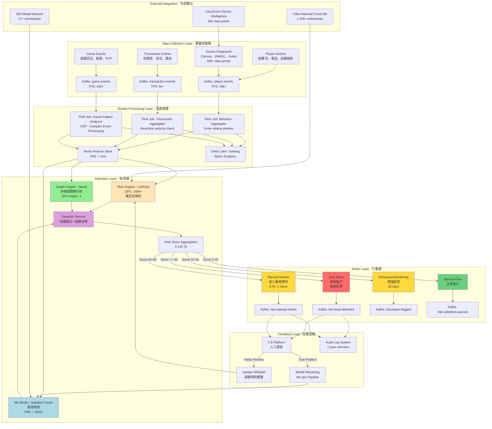
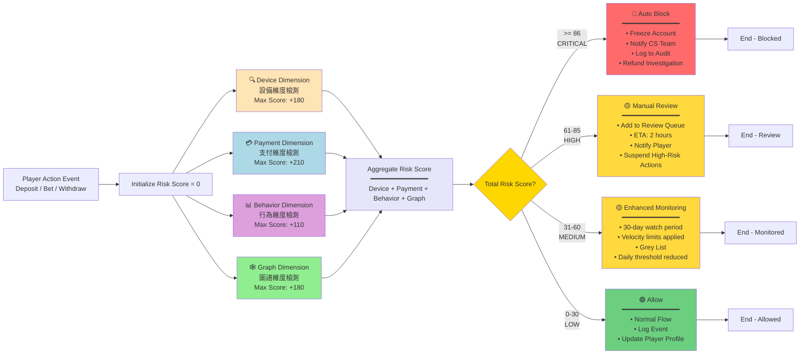
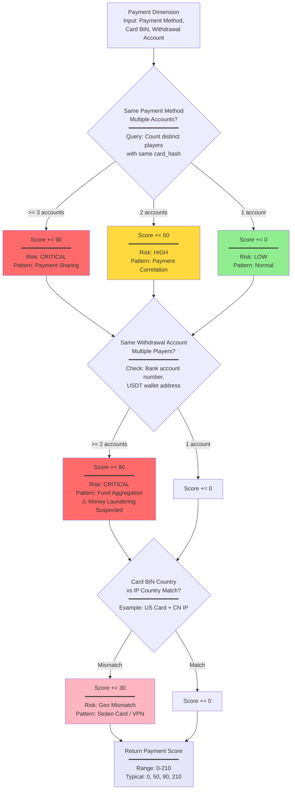

# 05-01 風控系統 (Risk Control System)

> **三層風控架構定位**: **Layer 1 - 風控基礎驗證**
> 本模塊負責所有投注的初始風控驗證，包括對沖檢測、賠率閾值、異常投注模式識別。
> 這是流水計算的第一道防線，確保只有通過風控驗證的投注才能進入後續計算。
> 完整架構參見: [00-00 文檔地圖 §流水計算邏輯](../00_Concept_&_Analysis/00-00_Document_Map.md#-流水計算邏輯)

**線上博彩平台每年因欺詐損失超過 12 億美元**，其中 Bonus Abuse（獎金濫用）佔據 **63.8%** 的欺詐案件。2022 至 2024 年間 iGaming 欺詐增長達 **64%**，使得風控系統成為平台存亡的關鍵。本報告提供完整的技術架構設計原則，涵蓋數據採集、實時引擎、漏洞防護到處置策略的端到端設計方案。

---

## 風控系統整體架構的核心設計原則

現代 iGaming 風控系統採用 **事件驅動架構（Event-Driven Architecture）**，實現毫秒級決策。根據 2025 年發表的研究論文，該架構可達到 **94.2% 真陽性率**和亞秒級延遲，同時保持模塊化和可擴展性。

### 數據採集層設計構成風控基礎

數據採集層需整合三大維度：用戶行為數據（點擊流、會話、設備指紋）、交易數據（存提款、投注、獎金）、遊戲數據（遊戲事件、結果、RTP 監控）。設備指紋技術尤為關鍵，業界領先方案如 JuicyScore 可收集超過 **65,000 個數據點**用於風險評分，涵蓋瀏覽器類型、插件列表、螢幕解析度、時區等 **250+ 信號維度**。

數據管道架構推薦採用 Apache Kafka 作為消息中間件進行高吞吐量數據攝取，Apache Flink 作為流處理引擎執行複雜事件處理（CEP），Redis 作為特徵存儲支持低延遲查詢，Delta Lake 或 Apache Iceberg 作為數據湖支持批處理分析。Capgemini 案例顯示，優化後的架構可實現每日處理 **2000 萬筆交易**、單交易響應時間 **低於 1 毫秒**的性能。

### 規則引擎與機器學習模型的混合決策

純規則引擎適合處理高置信度、即時生效的確定性邏輯，但難以發現新型欺詐模式；機器學習模型擅長複雜模式識別，但可解釋性較弱。最佳實踐是採用混合架構：規則層處理黑名單匹配、速度檢查等確定性規則，ML 層使用 Isolation Forest、LSTM、圖神經網路等算法進行異常檢測和模式發現，組合層對兩者結果進行加權融合或級聯決策。

Grab 公司的 Griffin 反欺詐規則引擎每日處理數十億預測，峰值達 **100K+ QPS**，僅需 6 台 EC2 實例。關鍵設計是支持數據科學家直接在 Web 門戶修改規則，並支持動態數據集而非靜態配置。

模型更新採用 MLOps 工作流：數據收集、特徵工程、模型訓練、離線評估、影子部署、A/B 測試、生產發布，形成持續反饋迴路。熱部署策略包括 Feature Store 同步確保訓練與推理特徵一致、影子模式並行運行新模型、金絲雀發布逐步替換流量、快速回滾機制。

### 事件驅動架構全景圖 (Event-Driven Architecture Overview)

以下架構圖展示了風控系統的完整數據流、流處理引擎、決策層及行動層的端到端設計：



**架構設計關鍵要點**：

1. **數據採集層 (Data Collection)**：
   - 整合三大數據源：玩家行為（點擊流、會話）、交易數據（存提款、投注）、遊戲數據（回合結果、RTP）
   - 設備指紋技術收集 65,000+ 數據點（Canvas、WebGL、Audio 指紋）
   - 使用 Kafka 作為統一消息總線，支持 10k-20k TPS 高吞吐量

2. **流處理層 (Stream Processing)**：
   - Flink 實時聚合：5 分鐘滑動窗口計算行為基線
   - Redis Feature Store 提供低延遲特徵查詢（P99 < 1ms）
   - Delta Lake / Iceberg 支持批量分析與歷史回溯

3. **檢測層 (Detection Layer)**：
   - **規則引擎 (LiteFlow)**：處理確定性邏輯（黑名單匹配、速度檢查），QPS 100k+
   - **ML 模型 (Isolation Forest)**：異常檢測與模式發現，P99 延遲 < 50ms
   - **圖引擎 (Neo4j)**：多帳號關聯分析，BFS 深度限制為 3（避免超時）
   - **決策服務**：加權融合或級聯決策，輸出 0-100 風險分數

4. **行動層 (Action Layer)**：
   - **分級處置**：根據風險分數自動路由（自動阻擋、人工審核、增強監控、正常放行）
   - **事件發布**：發送 Kafka 事件通知下游系統（Finance、CS、VIP）

5. **反饋迴路 (Feedback Loop)**：
   - 人工審核結果回饋至規則引擎（調整權重）和 ML 模型（重訓練）
   - 審計日誌保留 7 年滿足 AML 合規要求

6. **外部整合**：
   - Cifas 國家欺詐資料庫（1,100+ 企業共享）
   - JuicyScore 設備指紋服務（65k 數據點）
   - Sift 全球欺詐網絡（1 兆+事件/年）

---

## 平台漏洞風險的檢測與防護設計

平台漏洞型風險涵蓋支付欺詐、優惠濫用、API 安全和帳號安全四大類，每類需要針對性的檢測策略和系統設計。

### 支付漏洞需要原子性保證和多層驗證

**重複提款攻擊**利用支付系統的競態條件（Race Condition），在餘額更新前發起多筆請求。防護設計包括：使用樂觀鎖或悲觀鎖確保餘額修改的原子性，實施 Idempotency Key 機制確保相同交易請求只處理一次，設定速率檢測規則（如同一帳號 5 分鐘內提款超過 3 次觸發人工審核）。關鍵閾值建議為單帳號每小時提款次數不超過 5 次、提款請求間隔至少 30 秒。

**退款詐欺（Chargeback Fraud）**成本高昂——每 **$100 退單實際成本約 $207**，包含手續費和退款損失。友好詐欺（Friendly Fraud）是主要形式：玩家存款後投注，輸錢後向銀行聲稱交易未授權。高風險信號包括新帳號首次大額存款後快速提款、支付卡 BIN 地區與 IP 地區不匹配、使用預付卡或虛擬卡存款、同一支付方式關聯多個帳號。行業基準退單率應控制在 **0.9% 以下**。

支付閘道安全設計原則包括：強制使用 HMAC-SHA256 簽名驗證支付回調、白名單 IP 限制回調來源、服務端金額二次驗證、敏感數據 AES-256 加密存儲、PCI DSS 合規隔離支付環境。

### 優惠濫用是最大風險來源

**2024 年第一季度數據顯示，Bonus Abuse 佔 iGaming 欺詐的 69.9%**，是運營商面臨的首要威脅。攻擊手法包括 Multi-accounting（創建多帳號重複領取新手獎金）、套利投注（同時下注相反結果鎖定收益）、籌碼傾倒（在撲克遊戲中故意輸給同夥帳號）。

Multi-accounting 檢測需要多維度關聯分析。設備指紋維度（Device ID、硬件特徵）關聯強度最高，同一設備關聯超過 3 個帳號即為高風險；支付關聯維度（銀行卡 BIN、提款帳戶）同樣關鍵，同一提款帳戶關聯超過 2 個帳號應立即阻擋；行為模式維度（滑鼠軌跡、打字節奏）可識別相同操作者。一個實用的風控規則評分示例：同一設備 ID +80 分、同一 IP +40 分、相似 Email 模式 +30 分、同一提款帳戶 +90 分、註冊時間差小於 5 分鐘 +50 分、偵測到 VPN +60 分，總分超過 100 觸發阻擋。

設備指紋技術進階能力包括：Canvas 指紋（HTML5 Canvas 渲染差異）、WebGL 指紋（圖形處理特徵）、Audio 指紋（音頻處理特徵）。**EFF Panopticlick 研究顯示 94% 瀏覽器可通過指紋唯一識別**。反規避措施需偵測模擬器、虛擬機、GPS 欺騙工具、App Cloner、GoLogin 等反指紋工具。

圖分析（Graph Analysis）技術用於揭示帳戶關聯網絡。節點類型包括帳號、設備、IP、支付方式、提款帳戶；邊類型包括登入關聯、支付關聯、設備共用、IP 共用。檢測模式關注同一設備多帳號、同一支付方式多帳號、行為同步性（同時登入、同步投注）、資金流向聚集（多帳號提款至同一帳戶）。

#### 多維欺詐檢測決策樹 (Multi-Dimensional Fraud Detection Decision Tree)

以下分層圖表展示了如何從設備、支付、行為、圖譜四個維度進行風險評分，並根據總分決定處置動作。為提升可讀性，將複雜決策樹拆分為 **主架構圖 + 3 個維度子圖**。

##### 主架構圖：風險檢測整體流程 (Overview Architecture)



**主架構說明**：
- 4 個維度檢測可並行執行（Kafka Streams 並行消費）
- 黑名單命中直接阻擋（bypass 後續檢測）
- 總分上限：180 + 210 + 110 + 180 = **680 分**（實際多數場景不超過 200 分）
- 決策閾值基於歷史數據標定（P95 正常用戶 < 30 分）

---

##### 子圖 1：設備維度檢測流程 (Device Dimension Detection)

```mermaid
flowchart TD
    START_D1[Device Dimension<br/>Input: Device ID, User-Agent,<br/>Canvas Fingerprint] --> BLACKLIST{Device ID<br/>in Blacklist?}

    BLACKLIST -->|Yes ⛔| BLOCK1[❌ Auto Block<br/>Score = 100<br/>━━━━━━━━━━━━━━<br/>Reason: BLACKLIST_MATCH<br/>Action: Immediate Freeze<br/>⚠️ Skip Remaining Checks]

    BLACKLIST -->|No| SHARED{Shared Device Count<br/>━━━━━━━━━━━━━━<br/>Query: SELECT COUNT(*) FROM players<br/>WHERE device_id = ?}

    SHARED -->|>= 5 accounts| SCORE_HIGH[Score += 80<br/>━━━━━━━━━━━━━━<br/>Risk: HIGH<br/>Pattern: Multi-Accounting]
    SHARED -->|3-4 accounts| SCORE_MED[Score += 40<br/>━━━━━━━━━━━━━━<br/>Risk: MEDIUM<br/>Pattern: Shared Device]
    SHARED -->|1-2 accounts| SCORE_LOW[Score += 0<br/>━━━━━━━━━━━━━━<br/>Risk: LOW<br/>Pattern: Normal]

    SCORE_HIGH --> EMULATOR{Emulator / VM<br/>Detected?<br/>━━━━━━━━━━━━━━<br/>Check: BlueStacks, NoxPlayer,<br/>VMware signatures}
    SCORE_MED --> EMULATOR
    SCORE_LOW --> EMULATOR

    EMULATOR -->|Yes| EMU_SCORE[Score += 60<br/>━━━━━━━━━━━━━━<br/>Risk: Automation<br/>Tool: Emulator/VM]
    EMULATOR -->|No| EMU_NONE[Score += 0]

    EMU_SCORE --> VPN{VPN / Proxy<br/>Detected?<br/>━━━━━━━━━━━━━━<br/>Check: IP Reputation DB,<br/>WebRTC Leak Test}
    EMU_NONE --> VPN

    VPN -->|Yes| VPN_SCORE[Score += 40<br/>━━━━━━━━━━━━━━<br/>Risk: Location Spoofing<br/>Tool: VPN/Proxy]
    VPN -->|No| VPN_NONE[Score += 0]

    VPN_SCORE --> RETURN_D1[Return Device Score<br/>━━━━━━━━━━━━━━<br/>Range: 0-180<br/>Typical: 0, 40, 100, 180]
    VPN_NONE --> RETURN_D1

    BLOCK1 --> RETURN_BLOCK[Return Score = 100<br/>+ BLOCK Flag]

    style BLOCK1 fill:#FF6B6B
    style SCORE_HIGH fill:#FFB6C1
    style SCORE_MED fill:#FFD93D
    style SCORE_LOW fill:#90EE90
    style RETURN_D1 fill:#E6E6FA
    style RETURN_BLOCK fill:#FF6B6B
```

**設備維度關鍵檢測點**：
- **黑名單命中**：歷史欺詐設備、羊毛黨設備、內部測試設備
- **設備共享度**：正常家庭共用 ≤ 2 個帳號，網咖可能 3-4 個，羊毛工作室 ≥ 5 個
- **模擬器檢測**：Android 模擬器特徵（缺少傳感器數據、固定 DPI、特殊屬性）
- **VPN 檢測**：IP 數據庫（MaxMind, IPHub）+ WebRTC 洩漏測試

---

##### 子圖 2：支付維度檢測流程 (Payment Dimension Detection)



**支付維度關鍵檢測點**：
- **支付方式共享**：同一張卡關聯 ≥ 3 個帳號，極高欺詐概率（羊毛黨批量註冊）
- **提款帳戶聚集**：多個玩家提款至同一銀行帳戶 → 洗錢風險
- **地理不匹配**：卡 BIN 國家（發卡行）與 IP 國家不一致 → 盜卡或 VPN
- **高風險支付方式**：預付卡、虛擬卡、加密貨幣（匿名性高）

---

##### 子圖 3：行為與圖譜維度檢測流程 (Behavior + Graph Dimension Detection)

```mermaid
flowchart TD
    START_D3[Behavior + Graph Dimension<br/>Input: Bet Pattern, Transaction History,<br/>Account Network Graph] --> ML{ML Model Inference<br/>Bet Pattern Anomaly?<br/>━━━━━━━━━━━━━━<br/>Model: Isolation Forest<br/>Features: 50+ behavioral metrics}

    ML -->|Fraud Prob > 0.8| ML_HIGH[Score += 50<br/>━━━━━━━━━━━━━━<br/>Risk: HIGH<br/>Pattern: Anomaly Detected]
    ML -->|Fraud Prob 0.5-0.8| ML_MED[Score += 25<br/>━━━━━━━━━━━━━━<br/>Risk: MEDIUM<br/>Pattern: Suspicious]
    ML -->|Fraud Prob < 0.5| ML_LOW[Score += 0<br/>━━━━━━━━━━━━━━<br/>Risk: LOW<br/>Pattern: Normal]

    ML_HIGH --> BONUS{Bonus Abuse Pattern?<br/>━━━━━━━━━━━━━━<br/>Check: Min bet + High rollover,<br/>Opposite betting (Hedge)}
    ML_MED --> BONUS
    ML_LOW --> BONUS

    BONUS -->|Min Bet → High Rollover| BONUS_CHASE[Score += 40<br/>━━━━━━━━━━━━━━<br/>Pattern: Bonus Chasing]
    BONUS -->|Opposite Betting| BONUS_ARB[Score += 60<br/>━━━━━━━━━━━━━━<br/>Pattern: Arbitrage Detected<br/>⚠️ Hedge Betting]
    BONUS -->|Normal| BONUS_OK[Score += 0]

    BONUS_CHASE --> VELOCITY{Withdrawal Velocity?<br/>━━━━━━━━━━━━━━<br/>Count: Withdrawals per hour}
    BONUS_ARB --> VELOCITY
    BONUS_OK --> VELOCITY

    VELOCITY -->|> 5 times/hour| VEL_HIGH[Score += 50<br/>━━━━━━━━━━━━━━<br/>Risk: HIGH<br/>Pattern: Velocity Exceeded]
    VELOCITY -->|3-5 times/hour| VEL_MED[Score += 20<br/>━━━━━━━━━━━━━━<br/>Risk: MEDIUM<br/>Pattern: Rapid Withdrawal]
    VELOCITY -->|< 3 times/hour| VEL_LOW[Score += 0]

    VEL_HIGH --> GRAPH{Multi-Account Graph?<br/>━━━━━━━━━━━━━━<br/>Neo4j BFS Query (Depth: 3)<br/>Edges: Device, IP, Payment}
    VEL_MED --> GRAPH
    VEL_LOW --> GRAPH

    GRAPH -->|Connected >= 5| GRAPH_CRIT[Score += 70<br/>━━━━━━━━━━━━━━<br/>Risk: CRITICAL<br/>Pattern: Network Detected]
    GRAPH -->|Connected 3-4| GRAPH_HIGH[Score += 40<br/>━━━━━━━━━━━━━━<br/>Risk: HIGH<br/>Pattern: Cluster Detected]
    GRAPH -->|Connected < 3| GRAPH_LOW[Score += 0]

    GRAPH_CRIT --> SYNC{Synchronized Behavior?<br/>━━━━━━━━━━━━━━<br/>Check: 同時登入, 同步投注,<br/>相似遊戲路徑}
    GRAPH_HIGH --> SYNC
    GRAPH_LOW --> SYNC

    SYNC -->|Yes| SYNC_BOT[Score += 50<br/>━━━━━━━━━━━━━━<br/>Pattern: Bot/Farm Suspected<br/>⚠️ Automation Detected]
    SYNC -->|No| SYNC_OK[Score += 0]

    SYNC_BOT --> FUND_FLOW{Fund Flow Aggregation?<br/>━━━━━━━━━━━━━━<br/>Check: 多帳號提款至同一帳戶}
    SYNC_OK --> FUND_FLOW

    FUND_FLOW -->|Yes| FUND_RISK[Score += 60<br/>━━━━━━━━━━━━━━<br/>Pattern: Money Laundering Risk<br/>⚠️ AML Alert]
    FUND_FLOW -->|No| FUND_OK[Score += 0]

    FUND_RISK --> RETURN_D34[Return Behavior + Graph Score<br/>━━━━━━━━━━━━━━<br/>Range: 0-290<br/>Behavior: 0-110<br/>Graph: 0-180]
    FUND_OK --> RETURN_D34

    style ML_HIGH fill:#FFB6C1
    style BONUS_ARB fill:#FF6B6B
    style VEL_HIGH fill:#FFD93D
    style GRAPH_CRIT fill:#FF6B6B
    style SYNC_BOT fill:#FFB6C1
    style FUND_RISK fill:#FF6B6B
    style RETURN_D34 fill:#E6E6FA
```

**行為與圖譜維度關鍵檢測點**：
- **ML 異常檢測**：基於 50+ 特徵（投注金額分佈、遊戲切換頻率、時段偏好等）
- **獎金濫用**：最小注額完成流水 + 對沖投注 → 無風險套利
- **提款速率**：正常玩家 < 3 次/小時，羊毛黨可能 > 5 次/小時
- **圖譜分析**：Neo4j BFS 查詢關聯帳號網絡（深度限制 3 避免超時）
- **同步行為**：多帳號 10 秒內同時登入 + 投注相同遊戲 → 機器人農場
- **資金流聚集**：典型洗錢模式（多個輸家帳號 → 1 個贏家帳號提款）

---

**風險評分規則示例**：

| 維度 | 檢測項目 | 低風險 (0-30) | 中風險 (31-60) | 高風險 (61-85) | 嚴重 (86-100) |
|------|---------|--------------|---------------|--------------|--------------|
| **設備** | 同設備帳號數 | 1-2 個 (+0) | 3-4 個 (+40) | 5+ 個 (+80) | 黑名單 (+100) |
| **設備** | 模擬器/VM | 否 (+0) | - | - | 是 (+60) |
| **設備** | VPN/代理 | 否 (+0) | - | 是 (+40) | - |
| **支付** | 同支付方式帳號數 | 1 個 (+0) | 2 個 (+50) | 3+ 個 (+90) | - |
| **支付** | 同提款帳戶玩家數 | 1 個 (+0) | - | 2+ 個 (+90) | - |
| **支付** | 卡 BIN 地區 vs IP | 匹配 (+0) | 不匹配 (+30) | - | - |
| **行為** | ML 欺詐概率 | < 0.5 (+0) | 0.5-0.8 (+25) | > 0.8 (+50) | - |
| **行為** | 獎金濫用模式 | 否 (+0) | - | 最小注額+高流水 (+40) | 對沖投注 (+60) |
| **行為** | 提款速率 (次/小時) | < 3 (+0) | 3-5 (+20) | > 5 (+50) | - |
| **圖譜** | 關聯帳號數 (BFS-3) | < 3 (+0) | 3-4 (+40) | 5+ (+70) | - |
| **圖譜** | 同步行為 | 否 (+0) | - | 是 (+50) | - |
| **圖譜** | 資金流聚集 | 否 (+0) | - | 是 (+60) | - |

**處置動作決策矩陣**：

| 總分區間 | 風險等級 | 自動化動作 | 人工干預 | 通知 | 典型場景 |
|---------|---------|-----------|---------|------|---------|
| **0-30** | 🟢 LOW | 正常放行 | 無需 | 無 | 正常玩家 |
| **31-60** | 🟡 MEDIUM | 增強監控 30 天 | 可選 | 內部告警 | VPN 用戶、共用設備 |
| **61-85** | 🟡 HIGH | 加入人工審核隊列 | 必須 | 玩家 + CS | 疑似多帳號、異常投注 |
| **86-100** | 🔴 CRITICAL | 立即凍結帳戶 | 緊急 | 玩家 + CS + 管理層 | 黑名單、確認欺詐 |

**關鍵設計決策**：
- ✅ **黑名單直接阻擋**：設備 ID 在黑名單中直接給予 100 分，跳過後續檢查
- ✅ **多維度加權**：設備與支付維度權重最高（80-90 分），行為與圖譜次之（40-70 分）
- ✅ **ML 模型輔助**：行為維度使用 ML 模型（Isolation Forest）進行異常檢測
- ✅ **圖分析深度限制**：Neo4j BFS 深度限制為 3，避免查詢超時（> 3 秒）
- ✅ **超時降級策略**：若圖分析超時，該維度分數記為 0，但標記為待覆核

### 帳號安全面臨大規模自動化攻擊

Akamai 2024 報告顯示每月發生 **260 億次撞庫嘗試**，IBM 報告指出每次撞庫導致的數據洩露平均損失 **$481 萬**。DraftKings 曾有 67,000+ 用戶帳號被入侵，損失約 $30 萬。

撞庫攻擊檢測指標包括：登入失敗率（正常低於 5%，異常高於 20%）、單 IP 登入嘗試（正常低於 10 次/分鐘，異常高於 50 次/分鐘）、新設備登入頻率。防護採用三層架構：被動檢測層（IP 信譽評分、Email 年齡、設備指紋驗證）、主動防護層（智能 CAPTCHA、速率限制、地理異常檢測）、事後保護層（暗網監控已洩露憑證、主動重置已洩露密碼）。**Microsoft 數據顯示 MFA 可阻擋 99.9% 自動化帳號入侵**。

帳號接管（ATO）防護採用多階段策略：登入前進行設備信譽評估和 IP 風險評分，登入時執行 MFA 和行為生物識別，登入後持續會話監控，敏感操作變更時發送通知並設定冷卻期。風險評分模型示例：新設備登入 +30 分、IP 地理位置異常 +40 分、登入時間異常 +20 分、短時間內密碼變更 +50 分、新提款帳戶添加 +40 分，總分超過 80 阻擋並強制身份驗證。

---

## 遊戲漏洞風險的專業防護策略

遊戲漏洞型風險技術門檻較高，但一旦被利用造成的損失巨大。主要風險包括 RNG 預測攻擊、遊戲邏輯漏洞、時序攻擊和協議層漏洞。

### RNG 安全是遊戲公平性的基石

弱偽隨機數生成器（PRNG）的攻擊手法包括：輸出模式觀察攻擊（監控足夠遊戲結果重建內部狀態）、SMT Solver 破解（使用求解器建模算法揭示種子）、線性同餘生成器逆向（反編譯獲取參數後推算種子）。時間基種子攻擊尤其危險——如果 RNG 使用系統時間作為種子，攻擊者可通過時間同步縮小種子空間。

**案例警示**：Primedice 平台曾被利用 RNG 漏洞的機器人騙取 **$100 萬比特幣**。Alex 俄羅斯駭客組使用手機錄製老虎機螢幕，分析 Aristocrat MK IV 機台的 PRNG 輸出並預測中獎時機。

安全 RNG 設計最佳實踐包括：採用加密安全 PRNG（Java 的 SecureRandom、Python 的 secrets 模組，避免標準庫 random()）、整合硬體 RNG（TRNG）利用物理熵源、實施 FIPS 140-2/140-3 認證、獲得 eCOGRA 或 GLI 第三方審計。種子管理要求使用高熵來源、定期但受控的重新種子、種子值永不持久化或記錄。

RNG 監控指標包括：連續測試失敗率（FIPS 140-2 測試套件 1000 次測試失敗超過 1% 異常）、Reseed 請求頻率（超過基線 5 倍可能為強制 reseed 攻擊）、輸出序列自相關（p-value 低於 0.01 表示非隨機性）。

### 遊戲邏輯漏洞需要嚴格的狀態管理

**Ocean Magic 老虎機漏洞案例**：2019 年玩家群組利用 Wild 泡泡位置記憶特性，在特定狀態開始遊戲獲得正期望值，一週內在 13 家新澤西線上賭場贏得超過 **$900,000**。這類漏洞源於遊戲狀態持久性設計缺陷。

撲克遊戲面臨的主要威脅是共謀（Collusion）和機器人（Bot）。共謀檢測採用資訊論方法計算玩家行為間的互資訊，構建共謀表分析特定玩家組合持續同桌頻率、一方持強牌時另一方異常棄牌模式、對戰勝率統計異常。PokerStars 2025 反作弊系統每秒追蹤數千個數據點，結合生物識別驗證和機器學習達到 **95%+ 共謀檢測準確率**。

機器人檢測關注反應時間一致性（人類有自然變異，機器人呈現完美定時）、決策時間與手牌複雜度相關性、長時間無間斷遊戲行為。風險信號包括完美的時間間隔（0 方差）、無滑鼠移動軌跡、無 Canvas/WebGL 指紋、異常高請求頻率。

併發攻擊（Race Condition）在遊戲場景中表現為：同時發送多個 spin 請求繞過餘額檢查、優惠券在標記已使用前同時使用多次、積分兌換競態。防護設計需要程式碼層面使用互斥鎖確保原子操作、資料庫層面使用 SELECT FOR UPDATE 行級鎖或樂觀鎖定、API 層面實施請求去重（Idempotency Key）和請求序列化。

### 協議層安全保護通訊完整性

WebSocket 安全漏洞包括中間人攻擊（未加密的 ws:// 連接可被攔截）、跨站 WebSocket 劫持（Origin 標頭驗證不足）、注入攻擊、DoS 攻擊。

防護最佳實踐包括：強制使用 wss://（WebSocket Secure）配合 TLS 1.3、Token-based 認證並定期重新認證、白名單驗證 Origin header、所有訊息嚴格 JSON Schema 驗證、每訊息包含 HMAC-SHA256 簽名和遞增序列號防止重放、單 IP 連接數上限和訊息大小限制。

---

## 差異化處置策略與風險分級體系

風控決策需要在安全性和用戶體驗間取得平衡，不同風險類型適用不同處置策略。

### 實時阻斷與事後追溯的適用場景區分

實時阻斷適用於高置信度的確定性欺詐：帳戶接管（異常地理位置登入、新設備存取）、已知黑名單身份資訊或被盜信用卡、同一設備指紋創建多帳號、機器人攻擊（投注頻率超過人工操作閾值）。介入機制包括觸發 CAPTCHA、凍結交易、強制額外身份驗證、自動阻止高風險提款。

事後追溯適用於需要調查的複雜模式：洗錢交易追蹤（小額低風險投注後快速跨帳戶交易）、聯盟欺詐、串謀行為、長期行為模式異常。調查工具包括玩家會話回放驗證意圖、網絡圖譜分析帳戶關聯、歷史交易重新評分。

ThreatMark 的行為智能平台案例顯示，優化後可將平均偵測時間從 **16 小時縮短至 20 分鐘**（縮短 98%），誤判率從 30% 降至 5%。

### 四級風險分層實現精準處置

風險評分模型聚合多維度信號：身份維度（KYC 文件真實性、人臉匹配）權重高，設備維度（設備指紋、模擬器/VPN 偵測）權重高，行為維度（投注模式、會話時長）權重中至高，交易維度（存取款模式、高額交易）權重高，網絡維度（IP 地理位置、ASN 類型）權重中。

分層處置策略為：低風險（0-30 分）正常放行，中風險（31-60 分）增強監控和軟性限制，高風險（615 分）人工審核和帳戶限制，極高風險（86-100 分）即時阻斷和帳戶凍結。Tipsport 案例顯示複雜欺詐案件調查時間可從約 5 小時縮減至 **30 分鐘**（縮減 90%）。

處置動作類型包括：限額（存款/提款/投注上限，適用於可疑資金來源或問題賭博跡象）、凍結（暫停帳戶功能，適用於調查期間或 AML 觸發）、驗證（額外 KYC/SOF 要求，適用於高額交易或身份疑慮）、封禁（永久關閉帳戶，適用於確認欺詐或嚴重違規）、監控（增強行為追蹤，適用於灰名單用戶）。

### 名單機制需要動態管理和行業協作

黑名單來源包括內部確認欺詐案例、監管機構提供名單、行業共享數據庫、第三方反欺詐服務商。英國 Cifas（國家欺詐數據庫）有超過 1,100 家企業使用，包括 Bet Victor 等博彩公司，提供 24/7 實時在線訪問，每年新增數十萬筆欺詐風險記錄，包含合成身份、被盜身份和受損帳戶資訊。

灰名單管理針對可疑但未確認欺詐的用戶，設定增強監控週期（30/60/90 天），追蹤投注模式變化、帳戶行為異常、存取款頻率，累積風險評估後決定升級或解除。

VIP 管理需特別謹慎。**888 案例教訓**：因允許一位已知月薪僅 £1,400 的 NHS 員工設定 £1,300 月存款上限而受處罰。VIP 管理最佳實踐包括定期來源資金（SOF）審核、專屬客戶經理、更高交易限額但保持監控、問題賭博干預機制。

---

## 業界解決方案與合規要求實施

選擇合適的風控解決方案和滿足監管合規是平台運營的必要條件。

### 主流風控解決方案各有專長

**GeoComply** 專注地理位置驗證，每月處理 **12 億次地理位置驗證**，規則引擎對每筆交易執行 **350+ 項檢查**，專有信標技術可實現精確到 1 米的地理圍欄。99% 交易通過率和 95% 註冊通過率，專為美國高度監管市場設計，客戶包括 DraftKings、FanDuel、Caesars、BetMGM。

**Iovation/TransUnion** 專注設備識別與信譽評分，擁有全球數十億設備數據庫，每日處理 **2500 萬筆交易**並阻止 **30 萬筆欺詐活動**。跨行業情報共享（金融、保險、電信、遊戲等）是其獨特優勢，15 年以上保護超過 40 億筆交易。

**Sift** 專注機器學習欺詐檢測，全球數據網絡覆蓋每年 **1 兆+ 事件**，來自 34,000+ 網站和應用，可在 **250 毫秒內**檢測新攻擊模式。保護美國 iGaming 市場 **90%** 的收入，每年為博彩提供商保護超過 **450 億美元**，減少誤報/漏報高達 20%，減少人工審核高達 60%。

**Kambi** 專注體育博彩風控，管理超過 **€170 億全球流動性**，三大支柱為責任管理、注額接受、玩家分析。ML 驅動的實時玩家行為預測和完全自動化的算法交易能力是其技術特點，AI 定價驅動約 30% 的 GGR。

**Sportradar UFDS** 專注投注欺詐和比賽操縱檢測，監控 **600+ 全球博彩運營商**，每年分析 **300 億次賠率變化**，監控 850,000+ 場比賽跨 70+ 運動項目。2022 年識別 1,212 場可疑比賽，其中 AI 直接識別 36%。

### AML 和 KYC 合規是運營基礎

反洗錢三階段流程為放置（將非法現金存入賭場帳戶）、分層（通過多次交易模糊資金來源）、整合（將清洗後資金合法化）。核心要求包括風險評估、客戶盡職調查（CDD）、可疑活動報告（SAR）、記錄保存。

KYC 標準流程為：客戶識別（收集基本信息）、身份驗證（政府簽發證件加地址證明）、持續監控。增強盡職調查（EDD）適用於政治人物（PEPs）、高風險地區客戶、大額交易客戶，需檢查財富來源（SOW）和資金來源（SOF）。

各司法管轄區要求差異明顯：英國 Gambling Commission 要求最嚴格，強制 SAR 報告並禁止信用卡博彩；Malta Gaming Authority（MGA）符合 EU AML 指令，€2,000 觸發 CDD，10 年牌照期；Gibraltar 有專門的 Anti-Money Laundering Code of Practice；Curacao 監管較寬鬆，允許加密貨幣但國際認可度較低。

GLI-19 標準涵蓋互動博彩系統的玩家軟件安全、加密協議、位置檢測、防篡改要求。eCOGRA 認證覆蓋 45+ 司法管轄區，提供 Safe and Fair Seal（運營商級別）和 Certified Software Seal（軟件開發商級別）。

---

## 監管處罰案例揭示的關鍵教訓

**2023 年歐洲監管罰款總額達 £3.48 億 / $4.43 億**，重大案例揭示風控失敗的嚴重後果。

William Hill 2023 年收到英國博彩委員會史上最高單筆罰款 **£1920 萬**，失敗原因是 AML 監督不足、社會責任措施失效、允許一名玩家在 20 分鐘內存入並損失 £23,000、多名高風險客戶未進行負擔能力評估。Entain（Ladbrokes 和 Coral 母公司）2022 年被罰 **£1700 萬**，一客戶在 18 個月內存入 £230,000 無負擔能力檢查，被封鎖玩家可在其他品牌開設新帳戶繼續賭博。Betway 被罰 **£1160 萬**，一客戶移動超過 £8M、損失 £4M，四年無 SOF 檢查。

MGM Resorts 2023 年 9 月遭受 Scattered Spider 勒索軟體集團攻擊，黑客透過 LinkedIn 冒充員工，致電 IT 部門約 **10 分鐘後獲得內部系統存取權**，造成 10 天營運中斷、估計損失 **$1 億**，最終以 $4500 萬集體訴訟和解。Caesars Entertainment 則支付了 **$1500 萬勒索款項**。

這些案例揭示的關鍵教訓包括：健全的客戶盡職調查程序至關重要、即時交易監控不可或缺、多品牌帳戶需統一管理、VIP 客戶需要適當的 SOF 檢查和問題賭博干預、員工安全意識培訓不容忽視。

---

## 風控效能評估的 KPI 體系

核心欺詐率指標包括：欺詐率（確認欺詐交易數除以總交易數，行業基準低於 1%）、價值偵測率 VDR（阻止的欺詐金額除以總欺詐金額，目標高於 80%）、召回率（拒絕的欺詐交易除以總欺詐交易）。**JPMorgan AI 研究發現**，選擇正確的欺詐 KPI 可提升至少 **20%** 的欺詐防護性能，價值偵測率比交易偵測率更準確衡量財務影響。

運營效率指標包括：誤判率（錯誤標記的合法交易比例，最佳實踐低於 5%）、批准率（成功批准交易比例，目標高於 95%）、人工審核率（需人工審核的交易比例，目標低於 10%）、平均偵測時間 MTTD（從欺詐發生到偵測的時間，目標低於 1 小時）。誤判成本可能是實際欺詐成本的 **75 倍**，控制誤判率對收入影響重大。

博彩業專用 KPI 包括：GGR（毛博彩收入）、NGR（淨博彩收入）、玩家留存率、促銷濫用率、SOF 審核完成率。監管合規 KPI 包括：STR 提交及時率（100% 在規定時限內）、KYC 完成率（100%）、問題賭博干預率（100% 觸發後進行干預）。

---

## 結論：構建多層縱深防禦體系

有效的 iGaming 風控系統需要構建分層防禦：第一層邊緣防護（WAF、Rate Limiting、Bot 檢測），第二層身份驗證（KYC、MFA、設備綁定），第三層行為監控（實時風險評分、異常檢測），第四層交易監控（支付驗證、AML 監控）。

技術實施優先級建議：立即實施 WSS 加密、加密安全 RNG、基本異常檢測；短期實施併發控制強化、行為基線建模、完整性驗證；中期實施 ML 異常檢測模型、跨平台情報共享；長期規劃後量子密碼學準備和 AI 驅動的自適應防護。

選型策略建議：美國市場體育博彩選擇 GeoComply + Kambi + Sift 組合，歐洲多牌照運營商選擇 MGA 牌照 + eCOGRA + Iovation 組合，體育聯盟和誠信監控選擇 Sportradar UFDS，大型綜合運營商選擇 Sift + Kount + GeoComply 全面覆蓋。

最終，風控系統的成功取決於技術能力、運營治理和合規文化的結合。持續監控指標趨勢、定期審視誤報率和漏報率、根據最新欺詐趨勢更新規則、參與跨行業情報共享，才能在不斷演化的威脅環境中保持有效防護。

---

## 動態配置與審批 (Dynamic Config & Approval)

風控規則是平台的防線，必須具備極高的靈活性以應對新型攻擊，同時具備嚴格的變更控管以防內鬼或誤操作。

### 1. 動態配置項 (Dynamic Configuration)
- **規則熱加載**：所有風控閾值 (Thresholds)、評分權重 (Weights)、黑/灰名單 (Lists) 必須支援熱加載，無需重啟服務。
- **配置範疇**：
  - **驗證規則**：單日提款次數上限、大額提款觸發金額。
  - **評分模型**：各項風險特徵的加減分值 (如：同 IP +10分 -> 可調整為 +20分)。
  - **處置策略**：High Risk 分數區間對應的動作 (如：>80分 自動凍結 -> 可調整為 >90分)。

### 2. 審批工作流 (Approval Workflow)
- **規則變更審批**：
  - **場景**：修改 "單筆提款免審額度" (如 $500 -> $1000)。
  - **Maker**：風控經理提交變更請求，並附上數據支持 (如：過去一週誤擋率過高)。
  - **Checker**：CTO 或 營運總監 審核風險影響。
  - **Action**：批准後，新規則立即生效並分發至所有風控節點。
- **名單操作審批**：
  - **白名單添加**：將某玩家加入 "提款免審白名單" 為極高風險操作，必須經過兩級審批。
  - **誤判解封**：手動解除玩家凍結狀態，需記錄操作原因並經主管確認。

---

## 3. 風控與內部模組整合成 (Risk Integration API (Internal))

### 實時風控檢測時序圖 (Real-time Risk Detection Sequence)

以下時序圖展示了從玩家發起提款請求到風控決策的完整毫秒級處理流程：

```mermaid
sequenceDiagram
    participant Player
    participant API Gateway
    participant Finance Service
    participant Risk Engine
    participant Redis Feature Store
    participant Rule Engine (LiteFlow)
    participant ML Model
    participant Neo4j Graph
    participant Kafka
    participant CS Queue

    Note over Player,CS Queue: Real-time Withdrawal Risk Check (Target: < 500ms)

    Player->>API Gateway: POST /withdraw {amount: 5000, method: BANK}
    API Gateway->>Finance Service: validateWithdrawal(playerId, amount)

    Finance Service->>Risk Engine: checkWithdraw(withdrawalRequest)
    activate Risk Engine

    Note over Risk Engine: Step 1: Collect Real-time Features (< 50ms)

    par Parallel Feature Collection
        Risk Engine->>Redis Feature Store: GET player:${id}:metrics
        Redis Feature Store-->>Risk Engine: {bet_velocity, withdrawal_count, ...}

        Risk Engine->>Redis Feature Store: GET device:${id}:fingerprint
        Redis Feature Store-->>Risk Engine: {device_id, emulator_flag, vpn_flag}

        Risk Engine->>Redis Feature Store: GET payment:${hash}:history
        Redis Feature Store-->>Risk Engine: {linked_accounts, usage_count}
    end

    Risk Engine->>Risk Engine: Aggregate Features (15 dimensions)

    Note over Risk Engine: Step 2: Multi-Layer Detection (< 200ms)

    par Parallel Rule Evaluation
        Risk Engine->>Rule Engine (LiteFlow): executeChain(WITHDRAWAL_CHECK)
        activate Rule Engine (LiteFlow)

        Rule Engine (LiteFlow)->>Rule Engine (LiteFlow): Check Blacklist<br/>(Redis lookup)
        alt Blacklist Hit
            Rule Engine (LiteFlow)-->>Risk Engine: {blocked: true, score: 100, reason: BLACKLIST}
        else Not in Blacklist
            Rule Engine (LiteFlow)->>Rule Engine (LiteFlow): Velocity Check<br/>(5 withdrawals/hour?)
            Rule Engine (LiteFlow)->>Rule Engine (LiteFlow): Turnover Check<br/>(Met 1x requirement?)
            Rule Engine (LiteFlow)->>Rule Engine (LiteFlow): Device Check<br/>(Shared device > 5?)
            Rule Engine (LiteFlow)-->>Risk Engine: {rule_score: 45, factors: [...]}
        end
        deactivate Rule Engine (LiteFlow)

        Risk Engine->>ML Model: predictFraud(features)
        activate ML Model
        ML Model->>ML Model: Isolation Forest<br/>Anomaly Detection
        ML Model-->>Risk Engine: {ml_score: 65, probability: 0.72}
        deactivate ML Model

        Risk Engine->>Neo4j Graph: MATCH (p:Player {id: $playerId})-[:SHARES*1..3]-(linked)
        activate Neo4j Graph
        Neo4j Graph->>Neo4j Graph: BFS Depth 3<br/>Find Connected Accounts
        Neo4j Graph-->>Risk Engine: {cluster_size: 4, graph_score: 40}
        deactivate Neo4j Graph
    end

    Note over Risk Engine: Step 3: Score Aggregation & Decision (< 50ms)

    Risk Engine->>Risk Engine: Total Score = rule(45) + ml(65) + graph(40) = 150
    Risk Engine->>Risk Engine: Normalize Score = min(150, 100) = 100

    Risk Engine->>Risk Engine: Apply Decision Rules

    alt Score >= 86 (Auto Block)
        Risk Engine->>Kafka: publish(risk.fraud.detected, {playerId, score: 100})
        Risk Engine->>Kafka: publish(risk.withdrawal.rejected, {withdrawalId, reason})
        Risk Engine-->>Finance Service: {approved: false, risk_level: CRITICAL, action: AUTO_BLOCK}

        Finance Service->>Finance Service: UPDATE withdrawal SET status=REJECTED
        Finance Service-->>API Gateway: 403 Forbidden {message: "High Risk Detected"}
        API Gateway-->>Player: ❌ Withdrawal Rejected<br/>(Under Investigation)

        Kafka->>CS Queue: Add Manual Review Task (High Priority)

    else Score 61-85 (Manual Review)
        Risk Engine->>Kafka: publish(risk.manual.review, {playerId, score: 75})
        Risk Engine-->>Finance Service: {approved: false, risk_level: HIGH, action: MANUAL_REVIEW, eta_minutes: 120}

        Finance Service->>Finance Service: UPDATE withdrawal SET status=PENDING_REVIEW
        Finance Service-->>API Gateway: 202 Accepted {message: "Under Manual Review"}
        API Gateway-->>Player: 🟡 Withdrawal Pending<br/>(ETA: 2 hours)

        Kafka->>CS Queue: Add Review Task (Normal Priority)

    else Score 31-60 (Enhanced Monitoring)
        Risk Engine->>Kafka: publish(risk.player.flagged, {playerId, score: 45})
        Risk Engine-->>Finance Service: {approved: true, risk_level: MEDIUM, action: MONITOR, monitoring_days: 30}

        Finance Service->>Finance Service: UPDATE withdrawal SET status=APPROVED<br/>ADD player_monitoring (duration: 30 days)
        Finance Service-->>API Gateway: 200 OK {message: "Withdrawal Approved"}
        API Gateway-->>Player: 🟢 Withdrawal Approved<br/>(Enhanced Monitoring)

    else Score 0-30 (Allow)
        Risk Engine->>Kafka: publish(risk.validation.passed, {playerId, score: 15})
        Risk Engine-->>Finance Service: {approved: true, risk_level: LOW, action: ALLOW}

        Finance Service->>Finance Service: UPDATE withdrawal SET status=APPROVED
        Finance Service-->>API Gateway: 200 OK {message: "Withdrawal Approved"}
        API Gateway-->>Player: 🟢 Withdrawal Approved
    end

    deactivate Risk Engine

    Note over Risk Engine,Kafka: Async: Audit Log & Analytics

    Risk Engine->>Kafka: publish(risk.event.logged, {event_type, processing_time_ms})
    Kafka->>Kafka: Store to Audit Log (7-year retention)

    style Risk Engine fill:#DDA0DD
    style Rule Engine (LiteFlow) fill:#FFE4B5
    style ML Model fill:#ADD8E6
    style Neo4j Graph fill:#90EE90
    style CS Queue fill:#FFD93D
```

**時序圖關鍵設計要點**：

1. **性能目標** (SLA 保證)：
   - 🎯 **P99 延遲 < 500ms**（提款檢查）
   - 🎯 **P50 延遲 < 200ms**（中位數）
   - 📊 **特徵收集 < 50ms**（Redis 並行查詢）
   - 📊 **規則+ML+圖譜 < 200ms**（並行執行）
   - 📊 **決策聚合 < 50ms**（分數計算與路由）

2. **並行化策略**：
   - ✅ **Step 1 並行**：同時查詢 3 個 Redis Feature Store（玩家指標、設備指紋、支付歷史）
   - ✅ **Step 2 並行**：規則引擎、ML 模型、Neo4j 圖分析同時執行（無依賴關係）
   - ✅ **降低延遲**：總耗時 = MAX(rule_time, ml_time, graph_time)，而非 SUM

3. **早期熔斷 (Circuit Breaker)**：
   - ⚡ **黑名單命中**：直接返回 `score: 100`，跳過 ML 與圖分析（節省 150ms）
   - ⚡ **超時保護**：Neo4j 查詢超過 3 秒自動終止，該維度分數記為 0

4. **分級處置邏輯**：
   - 🔴 **Score >= 86**：自動阻擋 → 凍結帳戶 → 發送高優先級 CS 任務
   - 🟡 **Score 61-85**：人工審核 → 2 小時 ETA → 發送一般優先級 CS 任務
   - 🟡 **Score 31-60**：增強監控 → 30 天觀察期 → 放行但限制速率
   - 🟢 **Score 0-30**：正常放行 → 僅記錄日誌

5. **異步事件發布**：
   - 📢 所有風控決策發送 Kafka 事件（`risk.fraud.detected`, `risk.manual.review`, `risk.player.flagged`）
   - 📢 下游系統（CS Platform, VIP Management, CRM）訂閱相應事件
   - 📢 審計日誌異步寫入，不影響主流程延遲

6. **超時降級策略**：
   - ⚠️ **Neo4j 超時**（> 3s）：跳過圖分析，該維度分數為 0，但標記 `graph_check_failed`
   - ⚠️ **ML 模型超時**（> 1s）：使用上一次緩存結果（TTL 5 分鐘）
   - ⚠️ **整體超時**（> 5s）：返回 `503 Service Unavailable`，轉人工審核（保守策略）

### 📋 API 契約總覽

**重要提示**: 本模塊是風控系統的**單一數據源 (Single Source of Truth)**，提供權威的風險驗證API。

**核心設計原則**:
- 本節定義的 API 被多個模塊調用，作為 **Layer 1 基礎驗證層**
- 消費者模塊**不應複製**這裡的風控邏輯，而應通過 API 調用獲取驗證結果
- 任何風控規則變更，僅需修改本模塊，無需變更消費者代碼

**調用鏈架構** (參考流水計算三層架構):
```
Layer 1: Risk Engine (05-01)     → 基礎驗證（對沖檢測、賠率閾值、設備指紋）
         ↓ API調用
Layer 2: Finance Center (02-04)  → 狀態因子應用（WIN/LOSS/DRAW）
         ↓ API調用
Layer 3: Activity System (04-01) → 遊戲權重應用（老虎機100%、百家樂15%）
```

**跨模塊集成文檔參考**:
- 財務模塊集成: [02-04 §1.6 跨模組流水一致性保障](../02_Finance_Center/02-04_Turnover_and_Game_Reconciliation_Analysis.md#16-跨模組流水一致性保障)
- 活動模塊集成: [04-01 統一流水驗證架構](../04_Activity_Center/04-01_Activity_System_Design.md#統一流水驗證架構)

---

### 3.0 API 詳細規範

為了確保各模組 (Finance, Activity, Payment) 在執行關鍵業務時能同步風控邏輯，`Risk Engine` 提供以下 gRPC/REST 內部接口：

### 3.1 `validateBet` - 投注驗證 (Layer 1 核心邏輯)

**職責**: 確保投注符合基礎風控要求，阻斷對沖、套利、異常投注。這是三層風控架構的第一道防線。

*   **用途**：Activity System 在計算流水前調用，確認該注單是否為 "有效流水"。
*   **Request**:
    ```json
    {
      "bet_id": "tx_123456",
      "player_id": "u_999",
      "game_type": "BACCARAT",
      "selection": "Banker", // 下注內容
      "odds": 0.95,
      "amount": 1000.00,
      "ip": "1.1.1.1"
    }
    ```
*   **Response**:
    ```json
    {
      "is_valid": false,
      "risk_code": "HEDGE_BET",
      "reason": "Detected opposite betting on same round"
    }
    ```

### 3.2 `validateTurnover` (批量流水驗證)
*   **用途**：Finance System 每日結算返水時，批量驗證注單有效性。
*   **Request**: `[ {bet_id: ...}, ... ]`
*   **Response**: Map<bet_id, validation_result>

### 3.3 `checkWithdraw` (提款風控掃描)
*   **用途**：Payment Gateway 在出款前調用。
*   **Request**:
    ```json
    {
      "withdrawal_id": "wd_789012",
      "player_id": "u_999",
      "amount": 5000.00,
      "payment_method": "BANK_TRANSFER",
      "account_hash": "hash_of_bank_account",
      "ip": "1.1.1.1",
      "device_id": "dev_abc123"
    }
    ```
*   **Response**:
    ```json
    {
      "approved": false,
      "risk_level": "HIGH",
      "risk_score": 85,
      "reasons": [
        "TURNOVER_NOT_MET",
        "NEW_PAYMENT_METHOD",
        "SUSPICIOUS_IP"
      ],
      "action": "MANUAL_REVIEW",
      "estimated_review_time_minutes": 120
    }
    ```
*   **Logic**: 檢查 `TurnoverMet` (流水是否達標) + `RiskScore` (風險分) + `AuditStatus` (稽核狀態) + `PaymentMethodVerified` (支付方式驗證) + `GeolocationCheck` (地理位置檢查) + `VelocityCheck` (速率檢查)。

### 3.4 `assessPlayerRisk` (玩家綜合風險評估)
*   **用途**：CRM System 或 VIP Management 在進行玩家升級或特殊優惠發放前調用。
*   **Request**:
    ```json
    {
      "player_id": "u_999",
      "context": "VIP_UPGRADE",
      "additional_data": {
        "current_tier": "SILVER",
        "target_tier": "GOLD"
      }
    }
    ```
*   **Response**:
    ```json
    {
      "risk_level": "MEDIUM",
      "risk_score": 45,
      "risk_factors": [
        {
          "factor": "MULTI_ACCOUNT_SUSPICION",
          "score": 30,
          "confidence": "MEDIUM"
        },
        {
          "factor": "NORMAL_BETTING_PATTERN",
          "score": -15,
          "confidence": "HIGH"
        }
      ],
      "recommendation": "PROCEED_WITH_MONITORING",
      "monitoring_duration_days": 30
    }
    ```

### 3.5 `reportFraudIncident` (欺詐事件上報)
*   **用途**：CS Platform 或人工稽核發現欺詐行為時主動上報至風控系統，更新風險模型。
*   **Request**:
    ```json
    {
      "incident_id": "fraud_456",
      "player_id": "u_888",
      "fraud_type": "BONUS_ABUSE",
      "description": "Multi-accounting detected via device fingerprint",
      "evidence": {
        "device_ids": ["dev_a", "dev_b"],
        "associated_accounts": ["u_888", "u_777"],
        "fraudulent_amount": 2500.00
      },
      "reported_by": "cs_agent_123",
      "reported_at": "2026-01-27T10:30:00Z"
    }
    ```
*   **Response**:
    ```json
    {
      "incident_recorded": true,
      "incident_id": "fraud_456",
      "actions_taken": [
        "BLACKLIST_ADDED",
        "RELATED_ACCOUNTS_FROZEN",
        "MODEL_RETRAINED"
      ],
      "estimated_impact_reduction": "15% reduction in similar fraud patterns"
    }
    ```

---

## 4. 風控整合架構 (Risk Integration Architecture)

### 4.1 整合點總覽 (Integration Points Overview)

```
[Risk Engine Integration Architecture]
┌──────────────────────────────────────────────────────────────────────┐
│                         Risk Engine Core                             │
│  ┌────────────────────────────────────────────────────────────────┐  │
│  │  Rule Engine + ML Models + Graph Analysis + Velocity Checker  │  │
│  └────────────────────────────────────────────────────────────────┘  │
│                                                                      │
│  Provided APIs (gRPC/REST):                                          │
│  ├─ validateBet()          → Activity (04-01)                        │
│  ├─ validateTurnover()     → Finance (02-04)                         │
│  ├─ checkWithdraw()        → Finance (02-01)                         │
│  ├─ assessPlayerRisk()     → VIP (01-02), CRM (07-01)                │
│  └─ reportFraudIncident()  → CS Platform (11-01)                     │
│                                                                      │
│  Consumed APIs (from upstream):                                      │
│  ├─ PlayerService.getProfile()        → Player (01-01)               │
│  ├─ WalletService.getBalance()        → Wallet (02-06)               │
│  ├─ GameService.getActiveRounds()     → Game (03-01)                 │
│  └─ TransactionService.getHistory()   → Finance (02-04)              │
│                                                                      │
│  Events Published (Kafka):                                           │
│  ├─ risk.player.flagged         → CS Platform, CRM                   │
│  ├─ risk.fraud.detected          → Finance, CS Platform              │
│  ├─ risk.withdrawal.rejected     → Finance, Player Notification      │
│  └─ risk.model.updated           → Analytics, Audit                  │
│                                                                      │
│  Events Consumed (Kafka):                                            │
│  ├─ player.registered            → Initialize risk profile           │
│  ├─ player.kyc.completed         → Update risk score                 │
│  ├─ vip.tier.changed             → Re-assess risk level              │
│  ├─ wallet.deposit.completed     → Velocity check                    │
│  └─ game.bet.placed              → Real-time pattern analysis        │
└──────────────────────────────────────────────────────────────────────┘
```

---

#### 4.1.1 API 調用方整合矩陣

下表列出所有調用本模塊 API 的系統及其用途：

| 調用模塊 | 使用的 API | 調用時機 | 用途 | 文檔參考 |
|---------|-----------|---------|------|---------|
| **02-04 財務中心** | `validateTurnover()` | 日結算返水時 | Layer 2: 基於風控驗證結果應用狀態因子調整 | [02-04 §1.6](../02_Finance_Center/02-04_Turnover_and_Game_Reconciliation_Analysis.md#16-跨模組流水一致性保障) |
| **04-01 活動系統** | `validateBet()` | 計算活動流水前 | Layer 3: 基於風控驗證結果應用遊戲權重 | [04-01 統一流水驗證](../04_Activity_Center/04-01_Activity_System_Design.md#統一流水驗證架構) |
| **02-01 提款系統** | `checkWithdraw()` | 提款請求提交時 | 檢測異常提款行為、多帳號提款 | [02-01 提款風控](../02_Finance_Center/02-01_Withdrawal_Risk_Control.md) |
| **01-02 VIP系統** | 訂閱 `risk.player.flagged` 事件 | 玩家被標記為高風險時 | 降級VIP等級或暫停VIP權益 | [01-02 VIP忠誠系統](../01_Player_Center/01-02_VIP_&_Loyalty_System.md) |
| **11-01 客服平台** | `assessPlayerRisk()` | 客服查看玩家360視圖時 | 顯示玩家風險評分和標記 | [11-01 客服平台](../11_Customer_Service/11-01_CS_Platform_Design.md) |
| **07-01 租戶管理** | 訂閱 `risk.fraud.detected` 事件 | 檢測到欺詐時 | 通知租戶運營團隊 | [07-01 多租戶架構](../07_Platform_Management/07-01_Hierarchy_Architecture.md) |

**關鍵設計決策**:
- ✅ **單一數據源**: 所有風控邏輯集中在本模塊，消費者僅調用 API
- ✅ **同步阻塞**: 關鍵業務流程（提款、流水計算）採用同步 API 調用
- ✅ **異步通知**: 非阻塞場景（VIP調整、客服通知）採用 Kafka 事件
- ✅ **版本兼容**: API 遵循向後兼容原則，新增字段不影響現有調用方

---

### 4.2 同步調用 vs 異步事件 (Sync vs Async)

| 場景 | 調用方式 | 原因 |
|---|---|---|
| 提款前風控檢查 | 同步 gRPC/REST | 必須等待結果才能決定是否出款 |
| 注單有效性驗證 | 同步 gRPC/REST | Activity 系統需即時知道流水是否有效 |
| 玩家註冊事件 | 異步 Kafka | 初始化風險檔案非阻塞操作 |
| 欺詐檢測警報 | 異步 Kafka | 通知相關系統但不阻塞業務 |
| 模型訓練完成 | 異步 Kafka | 版本更新通知，非緊急操作 |

### 4.3 錯誤碼定義 (Error Code Definitions)

#### 4.3.1 業務邏輯錯誤碼 (Business Logic Errors)

| Code | 名稱 | 說明 | HTTP Status | 處理建議 |
|---|---|---|---|---|
| `RISK_001` | TURNOVER_NOT_MET | 流水未達標 | 403 | 顯示剩餘流水要求 |
| `RISK_002` | HEDGE_BET | 對沖注單 | 403 | 標記為無效流水 |
| `RISK_003` | SUSPICIOUS_IP | 可疑 IP 地址 | 403 | 要求額外驗證 |
| `RISK_004` | NEW_PAYMENT_METHOD | 新支付方式 | 200 | 轉人工審核 |
| `RISK_005` | MULTI_ACCOUNT | 多帳號關聯 | 403 | 凍結所有關聯帳號 |
| `RISK_006` | VELOCITY_EXCEEDED | 速率限制超標 | 429 | 冷卻期後重試 |
| `RISK_007` | BLACKLIST_MATCH | 黑名單匹配 | 403 | 永久阻擋 |
| `RISK_008` | HIGH_RISK_SCORE | 高風險分數 | 200 | 轉人工審核 |
| `RISK_009` | AML_TRIGGERED | AML 規則觸發 | 200 | 合規團隊介入 |
| `RISK_010` | BOT_DETECTED | 機器人檢測 | 403 | 要求 CAPTCHA 驗證 |

#### 4.3.2 技術錯誤碼 (Technical Errors)

| Code | 名稱 | 說明 | HTTP Status | 處理建議 |
|---|---|---|---|---|
| `RISK_500` | INTERNAL_ERROR | 風控引擎內部錯誤 | 500 | 記錄日誌並報警 |
| `RISK_503` | SERVICE_UNAVAILABLE | 風控服務不可用 | 503 | 降級處理或重試 |
| `RISK_504` | TIMEOUT | 風控檢查超時 | 504 | 設定超時上限 (如 3 秒) |
| `RISK_400` | INVALID_REQUEST | 請求參數無效 | 400 | 驗證輸入參數 |

### 4.4 性能要求 (Performance SLA)

| API | P99 延遲 | P50 延遲 | 可用性 | 備註 |
|---|---|---|---|---|
| `validateBet()` | < 100ms | < 30ms | 99.9% | 實時注單驗證，高頻調用 |
| `checkWithdraw()` | < 500ms | < 200ms | 99.95% | 涉及多維度檢查 |
| `assessPlayerRisk()` | < 1000ms | < 400ms | 99.9% | 複雜評分模型 |
| `validateTurnover()` | < 2000ms | < 800ms | 99.5% | 批量處理，可接受稍長延遲 |

*   **超時策略**：
    *   若風控檢查超時 (> 3 秒)，根據業務場景決定：
        *   **提款場景**：轉人工審核 (保守策略)。
        *   **注單場景**：放行但標記為待覆核 (業務優先)。
    *   所有超時事件必須記錄至監控系統並觸發警報。

### 4.5 降級策略 (Degradation Strategy)

當風控系統負載過高或部分組件故障時，採用以下降級策略：

| 降級等級 | 觸發條件 | 降級措施 | 業務影響 |
|---|---|---|---|
| **Level 0 (正常)** | P99 < 100ms | 全功能運行 | 無 |
| **Level 1 (輕度)** | P99 > 200ms | 停用圖分析模組 | 關聯帳戶檢測準確率下降 10% |
| **Level 2 (中度)** | P99 > 500ms | 僅保留規則引擎 | ML 模型停用，漏報率上升 15% |
| **Level 3 (重度)** | 服務不可用 | 白名單直接放行，其他全部阻擋 | 業務受嚴重影響，需緊急修復 |

*   **自動恢復**：當性能指標恢復正常 (持續 5 分鐘)，自動升級至上一等級。
*   **人工干預**：Level 3 降級需 CTO 或風控負責人批准，並在 1 小時內解決根因。

### 4.6 跨模組調用範例 (Cross-Module Call Examples)

#### 範例 1：Activity System 驗證流水


#### 範例 2：Finance System 提款風控檢查


#### 範例 3：VIP System 訂閱風險事件


---

## 5. 風控數據模型 (Risk Data Models)

### 5.1 玩家風險檔案 (Player Risk Profile)


### 5.2 風險事件日誌 (Risk Event Log)


---

## 6. 監控與警報 (Monitoring & Alerting)

### 6.1 關鍵監控指標 (Key Metrics)

| 指標類別 | 指標名稱 | 正常範圍 | 警報閾值 | 嚴重閾值 |
|---|---|---|---|---|
| **性能** | API P99 延遲 | < 100ms | > 200ms | > 500ms |
| **性能** | API 錯誤率 | < 0.1% | > 1% | > 5% |
| **性能** | 降級事件頻率 | 0 次/天 | > 3 次/天 | > 10 次/天 |
| **業務** | 欺詐檢測率 | 0.5-1.5% | < 0.2% 或 > 3% | < 0.1% 或 > 5% |
| **業務** | 誤判率 | < 5% | > 8% | > 15% |
| **業務** | 人工審核隊列長度 | < 50 | > 100 | > 300 |
| **合規** | 黑名單命中率 | 監控趨勢 | 突然下降 50% | - |
| **系統** | Kafka 消費延遲 | < 1 秒 | > 10 秒 | > 60 秒 |

### 6.2 警報策略 (Alert Strategy)

*   **P0 警報**：立即通知 (電話 + SMS + PagerDuty)
    *   風控系統完全不可用 (所有 API 失敗率 > 90%)
    *   黑名單功能失效 (黑名單查詢失敗率 > 50%)
    *   檢測到大規模欺詐攻擊 (1 小時內欺詐事件 > 1000 起)

*   **P1 警報**：1 小時內響應 (Slack + Email)
    *   API 延遲持續超過 500ms (> 10 分鐘)
    *   誤判率突然飆升 (> 15%)
    *   人工審核隊列積壓嚴重 (> 300 件)

*   **P2 警報**：工作時間內處理 (Slack)
    *   API 延遲偶爾超標 (P99 > 200ms 但 < 500ms)
    *   模型性能下降 (欺詐檢測率下降 20%)

---

## 7. 安全與合規 (Security & Compliance)

### 7.1 API 認證與授權 (Authentication & Authorization)

*   **內部 API**：使用 mTLS (Mutual TLS) 確保服務間通訊安全。
    *   每個調用服務持有自己的客戶端證書。
    *   風控引擎驗證證書並檢查服務身份 (CommonName)。
    *   僅允許白名單服務調用風控 API。

*   **外部 API**：若需提供給第三方 (如支付閘道)，使用 API Key + HMAC 簽名。
    *   API Key 標識調用方身份。
    *   請求 Body 使用 HMAC-SHA256 簽名，防止篡改。
    *   設定速率限制 (如每分鐘 1000 次請求)。

### 7.2 審計日誌 (Audit Trail)

*   **記錄範疇**：所有風控決策必須記錄至 `risk_events` 表，包含：
    *   決策時間、決策結果、決策依據 (規則 ID 或模型版本)。
    *   調用方身份 (哪個服務調用)。
    *   玩家 ID、交易 ID、IP、設備指紋。

*   **保留期限**：
    *   熱數據 (Elasticsearch)：30 天。
    *   溫數據 (S3)：1 年。
    *   冷數據 (Glacier)：7 年 (滿足 AML 法規要求)。

*   **防篡改**：
    *   每條日誌生成 HMAC 哈希值，寫入獨立的 Hash Chain 表。
    *   定期驗證 Hash Chain 完整性 (每日一次)。

### 7.3 GDPR 合規 (Right to Erasure)

*   **數據刪除流程**：當玩家行使 "被遺忘權" 時：
    *   `player_risk_profiles` 表中的 PII 欄位 (IP、設備指紋) 進行匿名化。
    *   `risk_events` 表中的 `player_id` 替換為假名 ID (Pseudonymized ID)。
    *   保留交易記錄 7 年 (AML 法規要求)，但移除可識別身份的資訊。

*   **匿名化策略**：
    *   使用 Crypto-Shredding (銷毀玩家專屬的 DEK)。
    *   所有加密數據變為不可逆的亂碼。

---

## 8. 附錄：行業基準與參考 (Appendix: Industry Benchmarks)

### 8.1 風控系統對比

| 供應商 | 核心能力 | 適用場景 | 定價模式 |
|---|---|---|---|
| **Sift** | ML 欺詐檢測 | 全球多行業 | 按交易量計費 |
| **Iovation** | 設備指紋 | 跨行業情報共享 | 按設備查詢計費 |
| **GeoComply** | 地理合規 | 美國體育博彩 | 按驗證次數計費 |
| **Kambi** | 體育博彩風控 | 歐洲運營商 | SaaS 訂閱 |

### 8.2 自建 vs 採購決策矩陣

| 因素 | 自建優勢 | 採購優勢 |
|---|---|---|
| **成本** | 長期成本較低 (但需初期投入) | 短期快速上線 |
| **定制化** | 完全客製化 | 需依賴供應商支援 |
| **數據安全** | 數據完全自控 | 數據可能共享給第三方 |
| **技術門檻** | 需強大 ML/DevOps 團隊 | 低技術門檻 |
| **更新速度** | 依賴內部資源 | 供應商持續更新 |

*   **建議**：
    *   **初創平台**：採購成熟方案 (如 Sift + Iovation)，快速上線。
    *   **成熟平台**：自建核心規則引擎，整合第三方 ML 模型與設備指紋服務。

---

## 結語：風控系統是動態演進的防線

風控系統不是一次性建設，而是持續演進的過程。隨著欺詐手法的升級、監管要求的變化、業務規模的擴張，風控策略必須不斷調整。

**關鍵成功因素**：
1.  **跨模組協作**：風控不是孤立的模組，必須與 Finance、Activity、CS 等系統深度整合。
2.  **數據驅動決策**：定期審視欺詐檢測率、誤判率等 KPI，根據數據調整規則與模型。
3.  **合規優先**：所有風控決策必須符合 GDPR、AML 等法規，審計日誌必須完整且防篡改。
4.  **性能與安全並重**：在確保低延遲的同時，不能犧牲安全性 (如加密、認證)。

通過本文檔定義的整合 API、錯誤碼、監控指標與降級策略，風控系統能夠成為平台的堅實防線，在保護平台利益的同時，為合法玩家提供流暢的遊戲體驗。

---

## 📚 相關文檔

### 核心依賴
- [02-06 統一錢包模型](../02_Finance_Center/02-06_Unified_Wallet_Model.md) - 餘額曝光度監控、可下注餘額計算
- [02-04 流水計算與對帳](../02_Finance_Center/02-04_Turnover_and_Game_Reconciliation_Analysis.md) - 流水驗證、對沖檢測（Layer 1）

### 業務整合
- [02-01 出金風控](../02_Finance_Center/02-01_Withdrawal_Risk_Control.md) - 提款風控規則引擎整合
- [04-01 活動系統設計](../04_Activity_Center/04-01_Activity_System_Design.md) - 紅利濫用檢測、流水作弊識別
- [01-01 玩家賬戶系統](../01_Player_Center/01-01_Player_Account_System.md) - 多帳號檢測、設備指紋

### 技術參考
- [09-02 審計日誌系統](../09_System_Security/09-02_Audit_Log_System.md) - 風控決策審計記錄
- [12-03 網關架構](../12_Technical_Operations/12-03_Gateway_Architecture.md) - API 限流、熔斷機制

### 延伸閱讀
- [05-02 代理信用風控](./05-02_Agent_Credit_Risk.md) - 代理信用評分、Margin Call
- [03-03 無縫錢包對接分析](../03_Game_Center/03-03_Seamless_Wallet_Analysis.md) - 遊戲投注異常檢測

---

**最後更新**: 2026-01-27
**維護團隊**: Risk Control Team
---

**文檔版本**: 1.0.0
**最後更新**: 2026-01-28
**維護團隊**: Risk Team & Backend Team
