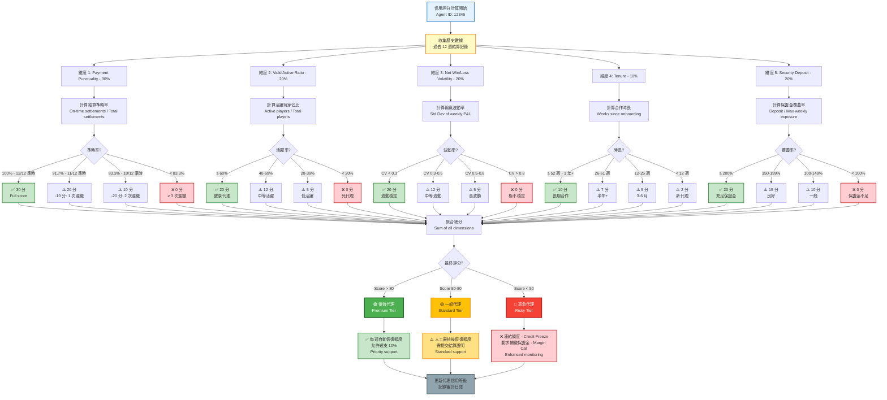

# 05-02 代理與信用風控體系 (Agent & Credit Risk System)

## 1. 系統概述 (System Overview)

區別於針對個別玩家 (B2C) 的欺詐風控，**代理風控 (Agent Risk)** 關注的是 **B2B 層面** 的金融風險。
在信用網模式下，平台授予總代 (Master Agent) 巨額額度，若代理 **"穿倉" (跑路/無力支付)** 或 **"惡意發送額度" (讓玩家刷水)**，平台將面臨鉅額損失。本模組定義針對代理體系的監控與處置機制。

---

## 2. 核心風險場景 (Risk Scenarios)

| 風險類型 | 描述 | 嚴重性 | 徵兆 |
| :--- | :--- | :--- | :--- |
| **信用違約 (Default)** | 代理在結算日無法支付輸錢款項。 | Critical | 代理亦開始頻繁調高下級額度，試圖"博一把"回本。 |
| **過度授信 (Over-Allocation)** | 代理向下級發放超過自身承受能力的額度。 | High | `Total Child Limit` >> `Agent Security Deposit`。 |
| **聯合套利 (Collusion)** | 代理與玩家勾結，利用 100% 佔成+高返水刷單。 | High | 代理佔成設為 100%，玩家只玩 "低風險" 遊戲 (如輪盤紅黑)。 |
| **殭屍帳號 (Zombie Account)** | 代理開設大量空頭帳號進行測試或攻擊。 | Medium | 批量註冊，無存款，僅佔用系統資源。 |

---

## 3. 信用評分模型 (Agent Credit Scoring)

系統應為每位代理維護一個 **"信用分 (Credit Score)"**，作為每週額度發放的依據。

### 3.1 評分維度
*   **Payment Punctuality (30%)**：過去 12 週的結算準時率。遲繳一次扣 10 分。
*   **Valid Active Ratio (20%)**：活躍玩家佔比。避免 "死代理"。
*   **Net Win/Loss Volatility (20%)**：輸贏波動率。波動過大代表風險不可控。
*   **Tenure (10%)**：合作時長。
*   **Security Deposit (20%)**：押金/保證金覆蓋率。

### 3.2 評分應用
*   **Score > 80 (優質)**：每週自動恢復額度 (Auto-Reset)，允許透支 10%。
*   **Score 50-80 (一般)**：需財務人工審核後恢復額度。
*   **Score < 50 (高危)**：**凍結額度 (Credit Freeze)**，要求補繳保證金 (Margin Call)。

##### 📊 Diagram 1: 代理信用評分計算流程 (Agent Credit Score Calculation Flow)



**評分計算範例**:

**範例 1: 優質代理 (Premium Tier)**
```
Agent ID: 10001
評分計算:
├─ Payment Punctuality: 12/12 準時 → 30 分 (100%)
├─ Valid Active Ratio: 65% 活躍 → 20 分 (100%)
├─ Net Win/Loss Volatility: CV=0.25 → 20 分 (穩定)
├─ Tenure: 78 週 (1.5 年) → 10 分 (100%)
└─ Security Deposit: 250% 覆蓋率 → 20 分 (充足)

總分: 100 分
等級: 🟢 優質代理 (Premium)
權益:
  ✅ 每週自動恢復額度（無需人工審核）
  ✅ 允許透支 10%（彈性額度）
  ✅ Priority support（專屬客服）
```

**範例 2: 一般代理 (Standard Tier)**
```
Agent ID: 20002
評分計算:
├─ Payment Punctuality: 10/12 準時 → 10 分 (2 次遲繳)
├─ Valid Active Ratio: 45% 活躍 → 12 分 (中等)
├─ Net Win/Loss Volatility: CV=0.42 → 12 分 (中等波動)
├─ Tenure: 32 週 (半年+) → 7 分
└─ Security Deposit: 180% 覆蓋率 → 15 分 (良好)

總分: 56 分
等級: 🟡 一般代理 (Standard)
權益:
  ⚠️ 人工審核後恢復額度（需提交結算證明）
  ⚠️ 不允許透支
  ⚠️ Standard support
```

**範例 3: 高危代理 (Risky Tier)**
```
Agent ID: 30003
評分計算:
├─ Payment Punctuality: 8/12 準時 → 0 分 (4 次遲繳 ❌)
├─ Valid Active Ratio: 18% 活躍 → 0 分 (死代理)
├─ Net Win/Loss Volatility: CV=0.95 → 0 分 (極不穩定)
├─ Tenure: 10 週 (新代理) → 2 分
└─ Security Deposit: 85% 覆蓋率 → 0 分 (保證金不足 ❌)

總分: 2 分
等級: 🔴 高危代理 (Risky)
處置措施:
  ❌ 凍結額度 (Credit Freeze)
  ❌ 要求補繳保證金 (Margin Call): 至少 150% 覆蓋率
  ❌ Enhanced monitoring（每日監控）
  ❌ 暫停新增下級代理
```

**評分更新頻率**:
- **每週結算後**: 自動重新計算評分
- **重大事件觸發**: 遲繳、保證金不足、異常大額虧損
- **季度審查**: 人工複核所有代理評分

---

## 4. 實時監控指標 (Real-time Monitoring)

### 4.1 曝險儀表板 (Exposure Dashboard)
系統需計算每一條 "代理線" 的即時曝險：

```math
Line Exposure = Sum(Player Outstanding) - Sum(Player Cash Balance)
```

*   **Group Exposure Limit**：設定整條線的曝險上限 (e.g. $1M)。
*   **Alert**：當 Line Exposure 達到 80% 時，通知 Risk Team 介入，詢問是否需要 "強平"。

### 4.2 異常佔成偵測 (Abnormal Position Alert)
*   **規則**：
    *   監控 **Position % (佔成比)** 的變更。
    *   若代理將特定玩家的佔成從 0% 突然調至 100%，且該玩家隨即開始大額下注。
    *   **判定**：疑似 "對賭" 或 "搶錢" (代理知道該玩家會輸，或者與玩家串通刷量)。
*   **處置**：暫停該代理線的佔成修改權限，強行鎖定佔成比。

---

## 5. 強制平倉機制 (Forced Liquidation)

類似期貨交易，當代理/商戶的保證金不足以覆蓋當前虧損時，觸發強平。

### 5.1 觸發條件
1.  **Margin Level < 110%**：發送追繳通知 (Margin Call)。
    *   `Margin Level = (Deposit + Account Balance) / Current Loss`
2.  **Margin Level < 100%**：觸發 **Soft Stop**。
    *   禁止該代理旗下新增玩家。
    *   禁止該代理發放新額度。
3.  **Margin Level < 80%**：觸發 **Hard Stop (Liquidation)**。
    *   **全線停權**：該代理旗下所有玩家帳號 "Suspend"。
    *   **強制結算**：立即執行週結流程，鎖定債務。

---

## 6. 審計與合規 (Audit & Compliance)

*   **額度發放審計**：所有 `Grant Credit` 操作必須留痕 (Who, When, Amount)。
*   **關係鏈變更**：代理轉線 (Transfer Line) 必須經過財務審核，防止將 "負債累累" 的代理轉移給不知情的上級。

---

## 7. 結論

代理风控是信用网模式的生存基石。透過 **信用评分**、**實時曝險監控** 與 **保證金強平機制**，平台可將 B2B 違約風險控制在可承受範圍內，避免發生系統性金融災難。
