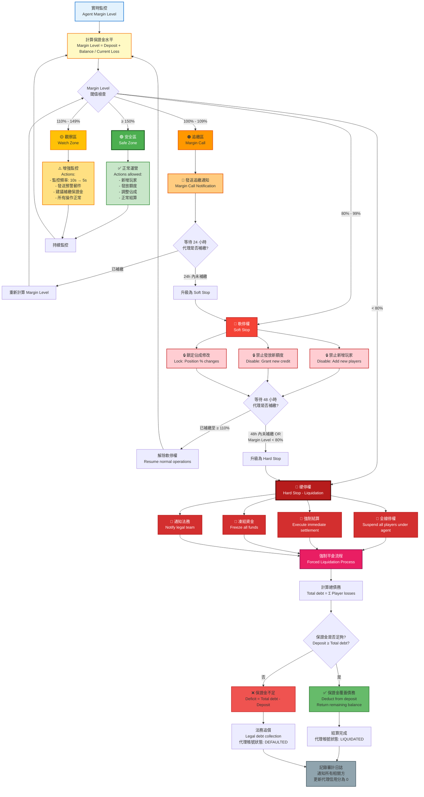

# 05-02 代理與信用風控體系 (Agent & Credit Risk System)

## 1. 系統概述 (System Overview)

區別於針對個別玩家 (B2C) 的欺詐風控，**代理風控 (Agent Risk)** 關注的是 **B2B 層面** 的金融風險。
在信用網模式下，平台授予總代 (Master Agent) 巨額額度，若代理 **"穿倉" (跑路/無力支付)** 或 **"惡意發送額度" (讓玩家刷水)**，平台將面臨鉅額損失。本模組定義針對代理體系的監控與處置機制。

---

## 2. 核心風險場景 (Risk Scenarios)

| 風險類型 | 描述 | 嚴重性 | 徵兆 |
| :--- | :--- | :--- | :--- |
| **信用違約 (Default)** | 代理在結算日無法支付輸錢款項。 | Critical | 代理亦開始頻繁調高下級額度，試圖"博一把"回本。 |
| **過度授信 (Over-Allocation)** | 代理向下級發放超過自身承受能力的額度。 | High | `Total Child Limit` >> `Agent Security Deposit`。 |
| **聯合套利 (Collusion)** | 代理與玩家勾結，利用 100% 佔成+高返水刷單。 | High | 代理佔成設為 100%，玩家只玩 "低風險" 遊戲 (如輪盤紅黑)。 |
| **殭屍帳號 (Zombie Account)** | 代理開設大量空頭帳號進行測試或攻擊。 | Medium | 批量註冊，無存款，僅佔用系統資源。 |

---

## 3. 信用評分模型 (Agent Credit Scoring)

系統應為每位代理維護一個 **"信用分 (Credit Score)"**，作為每週額度發放的依據。

### 3.1 評分維度
*   **Payment Punctuality (30%)**：過去 12 週的結算準時率。遲繳一次扣 10 分。
*   **Valid Active Ratio (20%)**：活躍玩家佔比。避免 "死代理"。
*   **Net Win/Loss Volatility (20%)**：輸贏波動率。波動過大代表風險不可控。
*   **Tenure (10%)**：合作時長。
*   **Security Deposit (20%)**：押金/保證金覆蓋率。

### 3.2 評分應用
*   **Score > 80 (優質)**：每週自動恢復額度 (Auto-Reset)，允許透支 10%。
*   **Score 50-80 (一般)**：需財務人工審核後恢復額度。
*   **Score < 50 (高危)**：**凍結額度 (Credit Freeze)**，要求補繳保證金 (Margin Call)。

##### 📊 Diagram 1: 代理信用評分計算流程 (Agent Credit Score Calculation Flow)

```mermaid
flowchart TD
    CREDIT_START[信用評分計算開始<br/>Agent ID: 12345] --> CREDIT_COLLECT[收集歷史數據<br/>過去 12 週結算記錄]

    CREDIT_COLLECT --> CREDIT_DIM1_ENTRY[維度 1: Payment Punctuality - 30%]
    CREDIT_COLLECT --> CREDIT_DIM2_ENTRY[維度 2: Valid Active Ratio - 20%]
    CREDIT_COLLECT --> CREDIT_DIM3_ENTRY[維度 3: Net Win/Loss Volatility - 20%]
    CREDIT_COLLECT --> CREDIT_DIM4_ENTRY[維度 4: Tenure - 10%]
    CREDIT_COLLECT --> CREDIT_DIM5_ENTRY[維度 5: Security Deposit - 20%]

    CREDIT_DIM1_ENTRY --> CREDIT_DIM1_CALC[計算結算準時率<br/>On-time settlements / Total settlements]
    CREDIT_DIM1_CALC --> CREDIT_DIM1_JUDGE{準時率?}
    CREDIT_DIM1_JUDGE -->|100% - 12/12 準時| CREDIT_DIM1_SCORE_FULL[✅ 30 分<br/>Full score]
    CREDIT_DIM1_JUDGE -->|91.7% - 11/12 準時| CREDIT_DIM1_SCORE_HIGH[⚠️ 20 分<br/>-10 分: 1 次遲繳]
    CREDIT_DIM1_JUDGE -->|83.3% - 10/12 準時| CREDIT_DIM1_SCORE_MED[⚠️ 10 分<br/>-20 分: 2 次遲繳]
    CREDIT_DIM1_JUDGE -->|< 83.3%| CREDIT_DIM1_SCORE_LOW[❌ 0 分<br/>≥ 3 次遲繳]

    CREDIT_DIM2_ENTRY --> CREDIT_DIM2_CALC[計算活躍玩家佔比<br/>Active players / Total players]
    CREDIT_DIM2_CALC --> CREDIT_DIM2_JUDGE{活躍率?}
    CREDIT_DIM2_JUDGE -->|≥ 60%| CREDIT_DIM2_SCORE_FULL[✅ 20 分<br/>健康代理]
    CREDIT_DIM2_JUDGE -->|40-59%| CREDIT_DIM2_SCORE_MED[⚠️ 12 分<br/>中等活躍]
    CREDIT_DIM2_JUDGE -->|20-39%| CREDIT_DIM2_SCORE_LOW[⚠️ 5 分<br/>低活躍]
    CREDIT_DIM2_JUDGE -->|< 20%| CREDIT_DIM2_SCORE_ZERO[❌ 0 分<br/>死代理]

    CREDIT_DIM3_ENTRY --> CREDIT_DIM3_CALC[計算輸贏波動率<br/>Std Dev of weekly P&L]
    CREDIT_DIM3_CALC --> CREDIT_DIM3_JUDGE{波動率?}
    CREDIT_DIM3_JUDGE -->|CV < 0.3| CREDIT_DIM3_SCORE_FULL[✅ 20 分<br/>波動穩定]
    CREDIT_DIM3_JUDGE -->|CV 0.3-0.5| CREDIT_DIM3_SCORE_MED[⚠️ 12 分<br/>中等波動]
    CREDIT_DIM3_JUDGE -->|CV 0.5-0.8| CREDIT_DIM3_SCORE_LOW[⚠️ 5 分<br/>高波動]
    CREDIT_DIM3_JUDGE -->|CV > 0.8| CREDIT_DIM3_SCORE_ZERO[❌ 0 分<br/>極不穩定]

    CREDIT_DIM4_ENTRY --> CREDIT_DIM4_CALC[計算合作時長<br/>Weeks since onboarding]
    CREDIT_DIM4_CALC --> CREDIT_DIM4_JUDGE{時長?}
    CREDIT_DIM4_JUDGE -->|≥ 52 週 - 1 年+| CREDIT_DIM4_SCORE_FULL[✅ 10 分<br/>長期合作]
    CREDIT_DIM4_JUDGE -->|26-51 週| CREDIT_DIM4_SCORE_HIGH[⚠️ 7 分<br/>半年+]
    CREDIT_DIM4_JUDGE -->|12-25 週| CREDIT_DIM4_SCORE_MED[⚠️ 5 分<br/>3-6 月]
    CREDIT_DIM4_JUDGE -->|< 12 週| CREDIT_DIM4_SCORE_LOW[⚠️ 2 分<br/>新代理]

    CREDIT_DIM5_ENTRY --> CREDIT_DIM5_CALC[計算保證金覆蓋率<br/>Deposit / Max weekly exposure]
    CREDIT_DIM5_CALC --> CREDIT_DIM5_JUDGE{覆蓋率?}
    CREDIT_DIM5_JUDGE -->|≥ 200%| CREDIT_DIM5_SCORE_FULL[✅ 20 分<br/>充足保證金]
    CREDIT_DIM5_JUDGE -->|150-199%| CREDIT_DIM5_SCORE_HIGH[⚠️ 15 分<br/>良好]
    CREDIT_DIM5_JUDGE -->|100-149%| CREDIT_DIM5_SCORE_MED[⚠️ 10 分<br/>一般]
    CREDIT_DIM5_JUDGE -->|< 100%| CREDIT_DIM5_SCORE_LOW[❌ 0 分<br/>保證金不足]

    CREDIT_DIM1_SCORE_FULL --> CREDIT_AGG[聚合總分<br/>Sum of all dimensions]
    CREDIT_DIM1_SCORE_HIGH --> CREDIT_AGG
    CREDIT_DIM1_SCORE_MED --> CREDIT_AGG
    CREDIT_DIM1_SCORE_LOW --> CREDIT_AGG

    CREDIT_DIM2_SCORE_FULL --> CREDIT_AGG
    CREDIT_DIM2_SCORE_MED --> CREDIT_AGG
    CREDIT_DIM2_SCORE_LOW --> CREDIT_AGG
    CREDIT_DIM2_SCORE_ZERO --> CREDIT_AGG

    CREDIT_DIM3_SCORE_FULL --> CREDIT_AGG
    CREDIT_DIM3_SCORE_MED --> CREDIT_AGG
    CREDIT_DIM3_SCORE_LOW --> CREDIT_AGG
    CREDIT_DIM3_SCORE_ZERO --> CREDIT_AGG

    CREDIT_DIM4_SCORE_FULL --> CREDIT_AGG
    CREDIT_DIM4_SCORE_HIGH --> CREDIT_AGG
    CREDIT_DIM4_SCORE_MED --> CREDIT_AGG
    CREDIT_DIM4_SCORE_LOW --> CREDIT_AGG

    CREDIT_DIM5_SCORE_FULL --> CREDIT_AGG
    CREDIT_DIM5_SCORE_HIGH --> CREDIT_AGG
    CREDIT_DIM5_SCORE_MED --> CREDIT_AGG
    CREDIT_DIM5_SCORE_LOW --> CREDIT_AGG

    CREDIT_AGG --> CREDIT_FINAL_JUDGE{最終評分?}

    CREDIT_FINAL_JUDGE -->|Score > 80| CREDIT_RESULT_PREMIUM[🟢 優質代理<br/>Premium Tier]
    CREDIT_FINAL_JUDGE -->|Score 50-80| CREDIT_RESULT_STANDARD[🟡 一般代理<br/>Standard Tier]
    CREDIT_FINAL_JUDGE -->|Score < 50| CREDIT_RESULT_RISKY[🔴 高危代理<br/>Risky Tier]

    PREMIUM --> ACTION1[✅ 每週自動恢復額度<br/>允許透支 10%<br/>Priority support]
    STANDARD --> ACTION2[⚠️ 人工審核後恢復額度<br/>需提交結算證明<br/>Standard support]
    RISKY --> ACTION3[❌ 凍結額度 - Credit Freeze<br/>要求補繳保證金 - Margin Call<br/>Enhanced monitoring]

    ACTION1 --> END[更新代理信用等級<br/>記錄審計日誌]
    ACTION2 --> END
    ACTION3 --> END

    style START fill:#E3F2FD,stroke:#1976D2,stroke-width:2px
    style COLLECT fill:#FFF9C4,stroke:#F57F17,stroke-width:2px

    style D1_FULL fill:#C8E6C9,stroke:#388E3C,stroke-width:2px
    style D2_FULL fill:#C8E6C9,stroke:#388E3C,stroke-width:2px
    style D3_FULL fill:#C8E6C9,stroke:#388E3C,stroke-width:2px
    style D4_FULL fill:#C8E6C9,stroke:#388E3C,stroke-width:2px
    style D5_FULL fill:#C8E6C9,stroke:#388E3C,stroke-width:2px

    style D1_LOW fill:#FFCDD2,stroke:#C62828,stroke-width:2px
    style D2_ZERO fill:#FFCDD2,stroke:#C62828,stroke-width:2px
    style D3_ZERO fill:#FFCDD2,stroke:#C62828,stroke-width:2px
    style D5_LOW fill:#FFCDD2,stroke:#C62828,stroke-width:2px

    style PREMIUM fill:#4CAF50,stroke:#1B5E20,stroke-width:3px,color:#FFF
    style STANDARD fill:#FFC107,stroke:#F57F00,stroke-width:2px
    style RISKY fill:#F44336,stroke:#B71C1C,stroke-width:3px,color:#FFF

    style ACTION1 fill:#C8E6C9,stroke:#388E3C,stroke-width:2px
    style ACTION2 fill:#FFE082,stroke:#F57F00,stroke-width:2px
    style ACTION3 fill:#FFCDD2,stroke:#C62828,stroke-width:2px

    style END fill:#90A4AE,stroke:#455A64,stroke-width:2px
```



**評分計算範例**:

**範例 1: 優質代理 (Premium Tier)**
```
Agent ID: 10001
評分計算:
├─ Payment Punctuality: 12/12 準時 → 30 分 (100%)
├─ Valid Active Ratio: 65% 活躍 → 20 分 (100%)
├─ Net Win/Loss Volatility: CV=0.25 → 20 分 (穩定)
├─ Tenure: 78 週 (1.5 年) → 10 分 (100%)
└─ Security Deposit: 250% 覆蓋率 → 20 分 (充足)

總分: 100 分
等級: 🟢 優質代理 (Premium)
權益:
  ✅ 每週自動恢復額度（無需人工審核）
  ✅ 允許透支 10%（彈性額度）
  ✅ Priority support（專屬客服）
```

**範例 2: 一般代理 (Standard Tier)**
```
Agent ID: 20002
評分計算:
├─ Payment Punctuality: 10/12 準時 → 10 分 (2 次遲繳)
├─ Valid Active Ratio: 45% 活躍 → 12 分 (中等)
├─ Net Win/Loss Volatility: CV=0.42 → 12 分 (中等波動)
├─ Tenure: 32 週 (半年+) → 7 分
└─ Security Deposit: 180% 覆蓋率 → 15 分 (良好)

總分: 56 分
等級: 🟡 一般代理 (Standard)
權益:
  ⚠️ 人工審核後恢復額度（需提交結算證明）
  ⚠️ 不允許透支
  ⚠️ Standard support
```

**範例 3: 高危代理 (Risky Tier)**
```
Agent ID: 30003
評分計算:
├─ Payment Punctuality: 8/12 準時 → 0 分 (4 次遲繳 ❌)
├─ Valid Active Ratio: 18% 活躍 → 0 分 (死代理)
├─ Net Win/Loss Volatility: CV=0.95 → 0 分 (極不穩定)
├─ Tenure: 10 週 (新代理) → 2 分
└─ Security Deposit: 85% 覆蓋率 → 0 分 (保證金不足 ❌)

總分: 2 分
等級: 🔴 高危代理 (Risky)
處置措施:
  ❌ 凍結額度 (Credit Freeze)
  ❌ 要求補繳保證金 (Margin Call): 至少 150% 覆蓋率
  ❌ Enhanced monitoring（每日監控）
  ❌ 暫停新增下級代理
```

**評分更新頻率**:
- **每週結算後**: 自動重新計算評分
- **重大事件觸發**: 遲繳、保證金不足、異常大額虧損
- **季度審查**: 人工複核所有代理評分

---

## 4. 實時監控指標 (Real-time Monitoring)

### 4.1 曝險儀表板 (Exposure Dashboard)
系統需計算每一條 "代理線" 的即時曝險：

```math
Line Exposure = Sum(Player Outstanding) - Sum(Player Cash Balance)
```

*   **Group Exposure Limit**：設定整條線的曝險上限 (e.g. $1M)。
*   **Alert**：當 Line Exposure 達到 80% 時，通知 Risk Team 介入，詢問是否需要 "強平"。

##### 📊 Diagram 2: 代理曝險實時監控架構 (Agent Exposure Real-time Monitoring Architecture)

```mermaid
graph TB
    subgraph "Data Collection Layer - 數據收集層"
        DC1[Player Wallet Events<br/>玩家錢包事件<br/>Bet, Win, Deposit, Withdrawal]
        DC2[Agent Credit Events<br/>代理信用事件<br/>Credit Grant, Settlement, Transfer]
        DC3[Position Changes<br/>佔成變更事件<br/>Position % Adjustments]
    end

    subgraph "Stream Processing Layer - 流處理層"
        SP1[Kafka Topic:<br/>player-wallet-events]
        SP2[Kafka Topic:<br/>agent-credit-events]
        SP3[Kafka Topic:<br/>position-change-events]

        DC1 --> SP1
        DC2 --> SP2
        DC3 --> SP3

        FLINK[Flink Stream Job:<br/>Exposure Aggregator<br/>5-minute tumbling window]

        SP1 --> FLINK
        SP2 --> FLINK
        SP3 --> FLINK
    end

    subgraph "Calculation Engine - 計算引擎"
        CALC1[Line Exposure Calculator<br/>Sum - Player Outstanding<br/>- Player Cash Balance]
        CALC2[Agent Tree Aggregator<br/>Recursive aggregation<br/>from leaf to root]
        CALC3[Margin Level Calculator<br/>Deposit + Balance / Current Loss]

        FLINK --> CALC1
        CALC1 --> CALC2
        CALC2 --> CALC3
    end

    subgraph "Storage Layer - 存儲層"
        REDIS[Redis:<br/>Real-time Metrics<br/>agent:exposure:{id}<br/>TTL: 10 minutes]
        CLICKHOUSE[ClickHouse:<br/>Historical Exposure Data<br/>Time-series analytics]

        CALC3 --> REDIS
        CALC3 --> CLICKHOUSE
    end

    subgraph "Risk Monitoring Layer - 風險監控層"
        RULE1[Rule Engine:<br/>Exposure Threshold Check<br/>80% → Warning<br/>90% → Critical]
        RULE2[Abnormal Position Detector:<br/>Detect 0% → 100% jump<br/>within 1 hour]
        RULE3[Margin Level Monitor:<br/>< 110% → Margin Call<br/>< 100% → Soft Stop<br/>< 80% → Hard Stop]

        REDIS --> RULE1
        REDIS --> RULE2
        REDIS --> RULE3
    end

    subgraph "Alert & Action Layer - 告警與執行層"
        ALERT1[Slack/Email Alert<br/>Risk Team notification]
        ALERT2[Auto Actions:<br/>Freeze credit allocation<br/>Lock position modification]
        ALERT3[Forced Liquidation:<br/>Suspend all players<br/>Execute settlement]

        RULE1 -->|Exposure ≥ 80%| ALERT1
        RULE2 -->|Abnormal detected| ALERT2
        RULE3 -->|Margin < 80%| ALERT3
    end

    subgraph "Dashboard Layer - 儀表板層"
        DASH1[Risk Dashboard:<br/>Agent Exposure Heatmap]
        DASH2[Real-time Alert Feed:<br/>Last 24h alerts]
        DASH3[Agent Credit Scorecard:<br/>Credit score trends]

        REDIS --> DASH1
        ALERT1 --> DASH2
        CLICKHOUSE --> DASH3
    end

    style DC1 fill:#E3F2FD,stroke:#1976D2,stroke-width:2px
    style DC2 fill:#E3F2FD,stroke:#1976D2,stroke-width:2px
    style DC3 fill:#E3F2FD,stroke:#1976D2,stroke-width:2px

    style SP1 fill:#FFF9C4,stroke:#F57F17,stroke-width:2px
    style SP2 fill:#FFF9C4,stroke:#F57F17,stroke-width:2px
    style SP3 fill:#FFF9C4,stroke:#F57F17,stroke-width:2px
    style FLINK fill:#FFE082,stroke:#F57F00,stroke-width:2px

    style CALC1 fill:#C8E6C9,stroke:#388E3C,stroke-width:2px
    style CALC2 fill:#C8E6C9,stroke:#388E3C,stroke-width:2px
    style CALC3 fill:#C8E6C9,stroke:#388E3C,stroke-width:2px

    style REDIS fill:#B3E5FC,stroke:#0277BD,stroke-width:2px
    style CLICKHOUSE fill:#B3E5FC,stroke:#0277BD,stroke-width:2px

    style RULE1 fill:#FFE082,stroke:#F57F00,stroke-width:2px
    style RULE2 fill:#FFE082,stroke:#F57F00,stroke-width:2px
    style RULE3 fill:#FFE082,stroke:#F57F00,stroke-width:2px

    style ALERT1 fill:#FFD54F,stroke:#F9A825,stroke-width:2px
    style ALERT2 fill:#FFA726,stroke:#E65100,stroke-width:2px
    style ALERT3 fill:#EF5350,stroke:#C62828,stroke-width:2px

    style DASH1 fill:#CE93D8,stroke:#7B1FA2,stroke-width:2px
    style DASH2 fill:#CE93D8,stroke:#7B1FA2,stroke-width:2px
    style DASH3 fill:#CE93D8,stroke:#7B1FA2,stroke-width:2px
```

**架構說明**:

| 層級 | 組件 | 職責 | 技術棧 | 性能指標 |
|------|------|------|--------|----------|
| **數據收集層** | Player/Agent/Position Events | 捕獲所有相關業務事件 | Spring Event, MQ Producer | TPS > 10k |
| **流處理層** | Kafka + Flink | 實時聚合代理線曝險數據 | Kafka 3.x, Flink 1.18 | Latency < 5s |
| **計算引擎** | Exposure/Margin Calculator | 計算 Line Exposure, Margin Level | Java 21, Vavr | Throughput > 5k/s |
| **存儲層** | Redis + ClickHouse | 熱數據快取 + 冷數據分析 | Redis 7.x, ClickHouse 24.x | Redis P99 < 10ms |
| **風險監控層** | Rule Engine | 閾值檢測與異常識別 | LiteFlow 2.12 | Check interval: 1 min |
| **告警執行層** | Alert + Auto Actions | 發送告警與自動處置 | Slack API, Email SMTP | Alert latency < 30s |
| **儀表板層** | Risk Dashboard | 風控儀表板與報表 | Vue 3 + ECharts | Refresh: 10s |

**計算公式**:

1. **Line Exposure (代理線曝險)**:
```
Line Exposure = Σ(Player Outstanding) - Σ(Player Cash Balance)

範例:
Agent A 旗下有 3 個玩家:
  - Player 1: Outstanding = $5,000, Cash = $1,000
  - Player 2: Outstanding = $8,000, Cash = $500
  - Player 3: Outstanding = $2,000, Cash = $3,000

Line Exposure = (5000 + 8000 + 2000) - (1000 + 500 + 3000)
              = 15,000 - 4,500
              = $10,500 (代理需承擔的風險)
```

2. **Margin Level (保證金水平)**:
```
Margin Level = (Security Deposit + Account Balance) / Current Loss

範例:
Agent B:
  - Security Deposit: $50,000 (保證金)
  - Account Balance: $20,000 (帳戶餘額)
  - Current Loss: $60,000 (當前虧損)

Margin Level = (50,000 + 20,000) / 60,000
             = 70,000 / 60,000
             = 116.7%

判定: > 110% (安全，但接近 Margin Call 閾值)
```

3. **Exposure Ratio (曝險比例)**:
```
Exposure Ratio = Line Exposure / Group Exposure Limit

範例:
Agent C:
  - Line Exposure: $800,000
  - Group Exposure Limit: $1,000,000

Exposure Ratio = 800,000 / 1,000,000 = 80%

判定: 達到告警閾值 (80%)，需通知風控團隊介入
```

**告警觸發條件**:

| 告警類型 | 觸發條件 | 嚴重性 | 通知渠道 | 自動處置 |
|----------|----------|--------|----------|----------|
| **曝險告警** (Exposure Warning) | Exposure Ratio ≥ 80% | ⚠️ Warning | Slack, Email | 增加監控頻率 (10s → 5s) |
| **曝險危急** (Exposure Critical) | Exposure Ratio ≥ 90% | 🔴 Critical | Slack, Email, SMS | 凍結新增額度 |
| **異常佔成** (Abnormal Position) | Position % 0% → 100% 且大額下注 | 🟡 High | Slack, Email | 鎖定佔成修改權限 |
| **保證金追繳** (Margin Call) | Margin Level < 110% | ⚠️ Warning | Email | 發送追繳通知 |
| **軟停權** (Soft Stop) | Margin Level < 100% | 🔴 Critical | Slack, Email, SMS | 禁止新增玩家、發放額度 |
| **強制平倉** (Hard Stop) | Margin Level < 80% | 🚨 Emergency | 電話 + Slack | 全線停權、強制結算 |

**儀表板指標 (Dashboard Metrics)**:

1. **代理曝險熱力圖** (Agent Exposure Heatmap):
   - X 軸: 代理 ID
   - Y 軸: 時間 (過去 24 小時)
   - 顏色: 曝險比例 (綠 < 50%, 黃 50-80%, 紅 > 80%)

2. **實時告警流** (Real-time Alert Feed):
   - 顯示最近 24 小時所有風險告警
   - 篩選: 嚴重性、代理、告警類型

3. **代理信用計分卡** (Agent Credit Scorecard):
   - 信用分數趨勢 (過去 12 週)
   - 保證金覆蓋率變化
   - 結算準時率統計

---

## 5. 強制平倉機制 (Forced Liquidation)

類似期貨交易，當代理/商戶的保證金不足以覆蓋當前虧損時，觸發強平。

### 5.1 觸發條件
1.  **Margin Level < 110%**：發送追繳通知 (Margin Call)。
    *   `Margin Level = (Deposit + Account Balance) / Current Loss`
2.  **Margin Level < 100%**：觸發 **Soft Stop**。
    *   禁止該代理旗下新增玩家。
    *   禁止該代理發放新額度。
3.  **Margin Level < 80%**：觸發 **Hard Stop (Liquidation)**。
    *   **全線停權**：該代理旗下所有玩家帳號 "Suspend"。
    *   **強制結算**：立即執行週結流程，鎖定債務。

##### 📊 Diagram 3: 強制平倉決策樹 (Forced Liquidation Decision Tree)



**強制平倉機制詳細說明**:

### 5.2 Margin Level 區間與處置措施

| Margin Level 區間 | 狀態 | 處置措施 | 時限 | 升級條件 |
|-------------------|------|----------|------|----------|
| **≥ 150%** | 🟢 安全區 (Safe Zone) | 正常運營，所有操作允許 | - | 持續監控 |
| **110% - 149%** | 🟡 觀察區 (Watch Zone) | 增強監控（5s 刷新）+ 預警郵件 | - | Margin Level < 110% |
| **100% - 109%** | 🟠 追繳區 (Margin Call) | 發送追繳通知，要求 24h 內補繳 | 24 小時 | 24h 內未補繳 |
| **80% - 99%** | 🔴 軟停權 (Soft Stop) | 禁止新增玩家、發放額度、修改佔成 | 48 小時 | 48h 內未補繳 OR Margin Level < 80% |
| **< 80%** | 🚨 硬停權 (Hard Stop) | 全線停權 + 強制結算 + 凍結資金 | 立即 | 立即觸發平倉流程 |

### 5.3 強制平倉流程 (Liquidation Process)

**階段 1: 債務確認**
```
1. 暫停該代理線所有交易（所有玩家帳號 SUSPEND）
2. 計算總債務 = Σ(所有玩家未結算虧損 + 代理欠款)
3. 鎖定保證金（Deposit + Account Balance）
4. 生成債務清單（Debt Statement）
```

**階段 2: 資金清算**
```
if (保證金 ≥ 總債務):
    1. 從保證金扣除總債務
    2. 返還剩餘保證金至代理帳戶
    3. 代理帳號狀態: LIQUIDATED（已清算）
    4. 可申請重新激活（需重新繳納保證金）
else:
    1. 保證金全額扣除
    2. 計算虧空金額 = 總債務 - 保證金
    3. 代理帳號狀態: DEFAULTED（違約）
    4. 轉法務部門追償（Legal Debt Collection）
```

**階段 3: 審計記錄**
```
1. 記錄完整平倉流程日誌
2. 通知平台管理員 + 財務團隊 + 法務團隊
3. 更新代理信用分為 0（永久記錄）
4. 生成事後分析報告（Post-mortem Report）
```

### 5.4 實際案例

**案例 1: 追繳成功 (Margin Call → Safe)**
```
初始狀態:
  - Agent ID: 10001
  - Deposit: $100,000
  - Account Balance: $15,000
  - Current Loss: $110,000
  - Margin Level = (100,000 + 15,000) / 110,000 = 104.5%

觸發: 🟠 Margin Call (< 110%)
處置:
  1. 發送追繳通知（要求補繳 $10,000）
  2. 24 小時倒計時

結果: 代理於 12 小時後補繳 $10,000
  - 新 Deposit: $110,000
  - Margin Level = (110,000 + 15,000) / 110,000 = 113.6%
  - 狀態: 🟡 Watch Zone（解除追繳）
```

**案例 2: 軟停權未補繳 (Soft Stop → Hard Stop)**
```
初始狀態:
  - Agent ID: 20002
  - Deposit: $50,000
  - Account Balance: $8,000
  - Current Loss: $60,000
  - Margin Level = (50,000 + 8,000) / 60,000 = 96.7%

觸發: 🔴 Soft Stop (< 100%)
處置:
  1. 禁止新增玩家、發放額度
  2. 48 小時倒計時

結果: 代理未補繳，48 小時後虧損擴大
  - Current Loss: $75,000
  - Margin Level = 58,000 / 75,000 = 77.3%
  - 狀態: 🚨 Hard Stop（觸發平倉）
```

**案例 3: 強制平倉成功覆蓋 (Hard Stop → Liquidated)**
```
初始狀態:
  - Agent ID: 30003
  - Deposit: $200,000
  - Account Balance: -$20,000 (虧損)
  - Current Loss: $220,000
  - Margin Level = (200,000 - 20,000) / 220,000 = 81.8%

虧損擴大:
  - Current Loss: $250,000
  - Margin Level = 180,000 / 250,000 = 72% (< 80%)

觸發: 🚨 Hard Stop - 立即平倉
處置:
  1. 全線停權（所有玩家帳號 SUSPEND）
  2. 強制結算總債務: $250,000
  3. 保證金扣除: $200,000
  4. 虧空金額: $50,000

結果:
  - 代理帳號狀態: DEFAULTED
  - 虧空 $50,000 轉法務追償
  - 信用分: 0（永久記錄）
```

**案例 4: 強制平倉有餘額 (Hard Stop → Liquidated with Refund)**
```
初始狀態:
  - Agent ID: 40004
  - Deposit: $300,000
  - Account Balance: $50,000
  - Current Loss: $180,000
  - Margin Level = (300,000 + 50,000) / 180,000 = 194.4%

極端虧損:
  - Current Loss: $480,000（極端黑天鵝事件）
  - Margin Level = 350,000 / 480,000 = 72.9% (< 80%)

觸發: 🚨 Hard Stop - 立即平倉
處置:
  1. 全線停權
  2. 強制結算總債務: $480,000
  3. 保證金扣除: $350,000
  4. 虧空金額: $130,000

結果:
  - 代理帳號狀態: DEFAULTED
  - 虧空 $130,000 轉法務追償
  - 平台損失: $130,000（保證金不足覆蓋）
  - 教訓: 保證金覆蓋率應設定 ≥ 200%
```

### 5.5 風險控制建議

1. **保證金覆蓋率設定**:
   - 最低要求: 150%
   - 推薦: 200%
   - 高風險代理: 250%+

2. **監控頻率**:
   - Safe Zone (≥ 150%): 每 10 分鐘
   - Watch Zone (110-149%): 每 5 分鐘
   - Margin Call (100-109%): 每 1 分鐘
   - Soft Stop (80-99%): 實時 (< 30 秒)
   - Hard Stop (< 80%): 實時 (< 10 秒)

3. **追繳時限**:
   - Margin Call: 24 小時
   - Soft Stop: 48 小時
   - Hard Stop: 立即觸發（無等待）

4. **法務追償**:
   - 虧空金額 < $10,000: 內部協商
   - 虧空金額 $10,000 - $100,000: 法律函件
   - 虧空金額 > $100,000: 立即提起訴訟

---

## 6. 審計與合規 (Audit & Compliance)

*   **額度發放審計**：所有 `Grant Credit` 操作必須留痕 (Who, When, Amount)。
*   **關係鏈變更**：代理轉線 (Transfer Line) 必須經過財務審核，防止將 "負債累累" 的代理轉移給不知情的上級。

---

## 7. 結論

代理风控是信用网模式的生存基石。透過 **信用评分**、**實時曝險監控** 與 **保證金強平機制**，平台可將 B2B 違約風險控制在可承受範圍內，避免發生系統性金融災難。

---

**文檔版本**: 1.0.0
**最後更新**: 2026-01-28
**維護團隊**: Risk Team & Backend Team

---

## 📚 相關文檔

### 前置依賴
- [05-01 風控系統](./05-01_Risk_Control_System.md) - 核心風控架構
- [06-02 信用網絡邏輯](../06_Agent_Center/06-02_Credit_Network_Logic.md) - 代理信用體系
