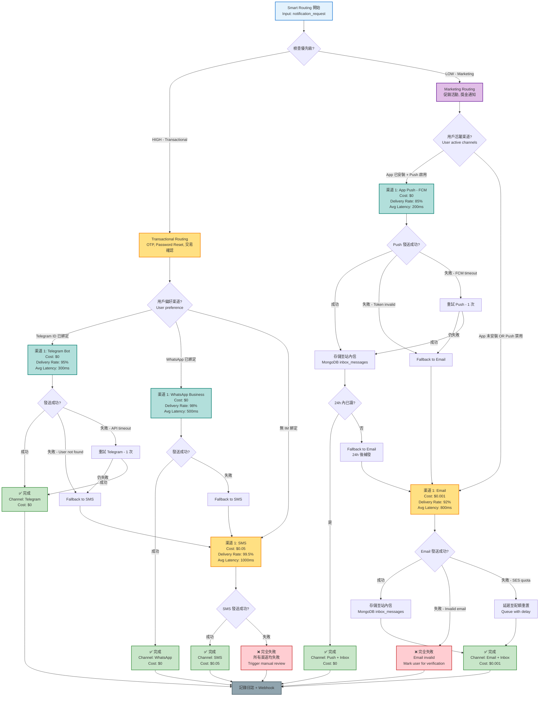

# 07-03 通訊基礎設施 (Notification Infrastructure)

## 1. 系統概述
Notification Service 是平台對外的唯一發信通道，負責管理所有觸達用戶的訊息。
旨在解決 **"渠道分散"**、**"模板難維護"** 與 **"費用失控"** 三大痛點。

## 2. 核心架構

##### 📊 Diagram 1: 通知架構完整流程 (Notification Architecture Complete Flow)

```mermaid
flowchart TD
    START[Business Service<br/>觸發通知事件] --> API[Notification API<br/>POST /api/v1/notifications/send]

    API --> VALIDATE{請求驗證}
    VALIDATE -->|失敗| ERR1[400 Bad Request]
    VALIDATE -->|成功| TEMPLATE[Template Engine<br/>模板渲染]

    TEMPLATE --> T1[載入模板<br/>template_code: OTP_REGISTER]
    T1 --> T2[多語言解析<br/>i18n: zh_TW, en_US]
    T2 --> T3[變數替換<br/>code=123456, expire=5min]
    T3 --> DEDUP[Deduplication Check<br/>Redis 去重檢查]

    DEDUP --> D1{是否重複發送?<br/>Redis: sent:{{user_id}}:{{template}}}
    D1 -->|是 - 60秒內已發送| ERR2[429 Too Many Requests<br/>Cool-down period]
    D1 -->|否| RATELIMIT[Rate Limiting<br/>頻率限制檢查]

    RATELIMIT --> R1{是否超過限額?<br/>1 小時內最多 5 條}
    R1 -->|是| ERR3[429 Rate Limit Exceeded<br/>1h 限額: 5 條]
    R1 -->|否| DND{DND 檢查<br/>Do Not Disturb}

    DND --> DND1{是否在靜默時段?<br/>22:00 - 08:00}
    DND1 -->|是 + Marketing| QUEUE_DELAY[延遲至 08:00 發送<br/>Queue with delay]
    DND1 -->|否 OR Transactional| ROUTER[Smart Routing<br/>智選路由]

    ROUTER --> ROUTE_DECIDE{路由決策}
    ROUTE_DECIDE -->|OTP - 高優先| ROUTE_OTP[優先渠道:<br/>1. Telegram/WhatsApp - 免費<br/>2. SMS - 付費]
    ROUTE_DECIDE -->|Marketing - 低優先| ROUTE_MKT[優先渠道:<br/>1. App Push - 免費<br/>2. Email - 低費用]

    ROUTE_OTP --> ADAPTER1[Provider Adapter<br/>Telegram Bot API]
    ROUTE_MKT --> ADAPTER2[Provider Adapter<br/>Firebase FCM]

    ADAPTER1 --> SEND1{發送成功?}
    SEND1 -->|失敗| FALLBACK1[Fallback to SMS<br/>Twilio API]
    SEND1 -->|成功| LOG1[記錄日誌<br/>status: DELIVERED<br/>cost: $0]

    FALLBACK1 --> SEND2{SMS 發送成功?}
    SEND2 -->|失敗| LOG2[記錄日誌<br/>status: FAILED<br/>cost: $0.05]
    SEND2 -->|成功| LOG3[記錄日誌<br/>status: DELIVERED<br/>cost: $0.05]

    ADAPTER2 --> SEND3{Push 發送成功?}
    SEND3 -->|失敗| FALLBACK2[Fallback to Email<br/>AWS SES]
    SEND3 -->|成功| LOG4[記錄日誌<br/>status: DELIVERED<br/>cost: $0]

    FALLBACK2 --> SEND4{Email 發送成功?}
    SEND4 -->|失敗| LOG5[記錄日誌<br/>status: FAILED<br/>cost: $0.001]
    SEND4 -->|成功| LOG6[記錄日誌<br/>status: DELIVERED<br/>cost: $0.001]

    LOG1 --> PERSIST[持久化存儲<br/>notification_log 表]
    LOG2 --> PERSIST
    LOG3 --> PERSIST
    LOG4 --> PERSIST
    LOG5 --> PERSIST
    LOG6 --> PERSIST

    PERSIST --> INBOX{需要站內信?<br/>Marketing 訊息}
    INBOX -->|是| MONGO[MongoDB 存儲<br/>inbox_messages 集合<br/>TTL: 30 天]
    INBOX -->|否| CALLBACK[Webhook Callback<br/>通知業務系統結果]

    MONGO --> CALLBACK

    CALLBACK --> END[返回響應<br/>notification_id, status]

    QUEUE_DELAY --> END

    style START fill:#E3F2FD,stroke:#1976D2,stroke-width:2px
    style API fill:#FFF9C4,stroke:#F57F17,stroke-width:2px
    style TEMPLATE fill:#E1BEE7,stroke:#6A1B9A,stroke-width:2px
    style DEDUP fill:#B2DFDB,stroke:#00796B,stroke-width:2px
    style RATELIMIT fill:#B2DFDB,stroke:#00796B,stroke-width:2px
    style ROUTER fill:#FFE082,stroke:#F57F00,stroke-width:2px

    style ERR1 fill:#FFCDD2,stroke:#C62828,stroke-width:2px
    style ERR2 fill:#FFCDD2,stroke:#C62828,stroke-width:2px
    style ERR3 fill:#FFCDD2,stroke:#C62828,stroke-width:2px

    style LOG1 fill:#C8E6C9,stroke:#388E3C,stroke-width:2px
    style LOG3 fill:#C8E6C9,stroke:#388E3C,stroke-width:2px
    style LOG4 fill:#C8E6C9,stroke:#388E3C,stroke-width:2px
    style LOG6 fill:#C8E6C9,stroke:#388E3C,stroke-width:2px

    style LOG2 fill:#FFE082,stroke:#F57F00,stroke-width:2px
    style LOG5 fill:#FFE082,stroke:#F57F00,stroke-width:2px

    style PERSIST fill:#90CAF9,stroke:#1565C0,stroke-width:2px
    style MONGO fill:#CE93D8,stroke:#7B1FA2,stroke-width:2px
    style END fill:#4CAF50,stroke:#1B5E20,stroke-width:3px,color:#FFF
```

**流程說明**:

| 階段 | 組件 | 職責 | 失敗處理 | 性能指標 |
|------|------|------|----------|----------|
| **1. 請求驗證** | Notification API | 驗證請求參數（template_code, destination） | 400 Bad Request | < 10ms |
| **2. 模板渲染** | Template Engine | 載入模板 + 多語言解析 + 變數替換 | 500 Template Error | < 50ms |
| **3. 去重檢查** | Deduplication (Redis) | 檢查 60 秒內是否已發送相同消息 | 429 Too Many Requests | < 5ms (Redis) |
| **4. 頻率限制** | Rate Limiting (Redis) | 檢查 1 小時內發送次數是否超過 5 條 | 429 Rate Limit Exceeded | < 5ms (Redis) |
| **5. DND 檢查** | Do Not Disturb | 檢查是否在靜默時段（22:00-08:00） | 延遲至 08:00 發送 | < 1ms |
| **6. 智選路由** | Smart Routing | 根據成本與送達率選擇渠道 | - | < 10ms |
| **7. 發送執行** | Provider Adapter | 調用外部 API (Telegram/SMS/FCM/Email) | Fallback 到次優渠道 | < 500ms (external) |
| **8. 日誌記錄** | Notification Log | 記錄發送狀態、成本、時間 | - | < 20ms (PostgreSQL) |
| **9. 站內信存儲** | MongoDB | 持久化 Marketing 訊息至訊息中心 | - | < 30ms (MongoDB) |
| **10. Webhook 回調** | Callback Service | 通知業務系統發送結果 | 重試 3 次 | < 100ms |

**範例請求與響應**:

**Request: 發送 OTP 驗證碼**
```json
POST /api/v1/notifications/send
Content-Type: application/json

{
  "template_code": "OTP_REGISTER",
  "channel": "AUTO",  // 自動選擇最佳渠道
  "destination": {
    "user_id": "12345",
    "phone": "+886912345678",
    "email": "user@example.com",
    "telegram_id": "@username"
  },
  "variables": {
    "code": "123456",
    "expire_minutes": 5
  },
  "priority": "HIGH",  // HIGH = Transactional, LOW = Marketing
  "locale": "zh_TW"
}
```

**Response: 成功發送 (Telegram)**
```json
{
  "notification_id": "ntf-abc123",
  "status": "DELIVERED",
  "channel_used": "TELEGRAM",
  "provider": "TELEGRAM_BOT",
  "cost": 0.00,
  "sent_at": "2026-01-27T10:30:00Z",
  "delivery_time_ms": 350
}
```

**Response: Fallback 到 SMS**
```json
{
  "notification_id": "ntf-abc124",
  "status": "DELIVERED",
  "channel_used": "SMS",
  "provider": "TWILIO",
  "fallback_reason": "Telegram user not found",
  "cost": 0.05,
  "sent_at": "2026-01-27T10:30:01Z",
  "delivery_time_ms": 1200
}
```

**Response: 觸發頻率限制**
```json
{
  "error": "RATE_LIMIT_EXCEEDED",
  "message": "Maximum 5 OTP messages per hour exceeded",
  "retry_after_seconds": 1800,
  "current_count": 5,
  "limit": 5,
  "reset_at": "2026-01-27T11:30:00Z"
}
```

### 2.1 支援渠道 (Channels)
1.  **Transactional (高優先)**：
    *   **SMS**: OTP 驗證碼 (Twilio, AWS SNS)。
    *   **Email**: 註冊確認、密碼重置 (AWS SES, SendGrid)。
2.  **Marketing (低優先)**：
    *   **Web Push**: 瀏覽器通知 (Firebase FCM)。
    *   **In-App Message**: 站內信 (WebSocket)。
    *   **IM Integration**: Telegram Bot, Line OA, WhatsApp Business。

##### 📊 Diagram 3: 多渠道派發架構 (Multi-Channel Dispatch Architecture)

```mermaid
graph TB
    subgraph "Notification Service Core - 通知服務核心"
        API[Notification API<br/>統一入口]
        QUEUE[Message Queue<br/>Kafka / RabbitMQ<br/>Topic: notifications]
        WORKER[Worker Pool<br/>Async Consumers<br/>Concurrency: 50]
    end

    API --> QUEUE
    QUEUE --> WORKER

    subgraph "Channel Adapters - 渠道適配器層"
        WORKER --> A1[SMS Adapter]
        WORKER --> A2[Email Adapter]
        WORKER --> A3[Push Adapter]
        WORKER --> A4[Telegram Adapter]
        WORKER --> A5[WhatsApp Adapter]
        WORKER --> A6[WebSocket Adapter]
    end

    subgraph "External Providers - 外部服務商"
        A1 --> P1_1[Twilio SMS<br/>Cost: $0.05/msg<br/>Delivery: 99.5%]
        A1 --> P1_2[AWS SNS<br/>Cost: $0.02/msg<br/>Delivery: 98%]
        A1 --> P1_3[Backup: Local Gateway<br/>Cost: $0.08/msg<br/>Delivery: 97%]

        A2 --> P2_1[AWS SES<br/>Cost: $0.001/msg<br/>Delivery: 92%]
        A2 --> P2_2[SendGrid<br/>Cost: $0.003/msg<br/>Delivery: 95%]

        A3 --> P3_1[Firebase FCM<br/>Cost: $0<br/>Delivery: 85%]
        A3 --> P3_2[Apple APNS<br/>Cost: $0<br/>Delivery: 90%]

        A4 --> P4[Telegram Bot API<br/>Cost: $0<br/>Delivery: 95%]

        A5 --> P5[WhatsApp Business API<br/>Cost: $0.005/msg<br/>Delivery: 98%]

        A6 --> P6[Internal WebSocket Server<br/>Cost: $0<br/>Delivery: Real-time]
    end

    subgraph "Monitoring & Analytics - 監控與分析"
        WORKER --> M1[Prometheus Metrics<br/>Delivery rate, Latency, Cost]
        WORKER --> M2[Audit Log - PostgreSQL<br/>notification_log table]
        WORKER --> M3[Cost Analytics - ClickHouse<br/>Daily cost aggregation]
        WORKER --> M4[Alert Manager<br/>Delivery failure > 5%]
    end

    subgraph "Persistent Storage - 持久化存儲"
        WORKER --> S1[MongoDB<br/>inbox_messages collection<br/>Marketing 站內信<br/>TTL: 30 days]
        WORKER --> S2[Redis Cache<br/>Deduplication keys<br/>Rate limit counters<br/>TTL: 1 hour]
    end

    subgraph "Callback & Retry - 回調與重試"
        WORKER --> CB1[Webhook Callback<br/>Notify business services<br/>POST /webhook/notification]
        WORKER --> DLQ[Dead Letter Queue<br/>Failed messages<br/>Manual review required]
    end

    style API fill:#FFC107,stroke:#F57F00,stroke-width:3px,color:#000
    style QUEUE fill:#FFE082,stroke:#F57F00,stroke-width:2px
    style WORKER fill:#FFE082,stroke:#F57F00,stroke-width:2px

    style A1 fill:#E3F2FD,stroke:#1976D2,stroke-width:2px
    style A2 fill:#E3F2FD,stroke:#1976D2,stroke-width:2px
    style A3 fill:#E3F2FD,stroke:#1976D2,stroke-width:2px
    style A4 fill:#E3F2FD,stroke:#1976D2,stroke-width:2px
    style A5 fill:#E3F2FD,stroke:#1976D2,stroke-width:2px
    style A6 fill:#E3F2FD,stroke:#1976D2,stroke-width:2px

    style P1_1 fill:#C8E6C9,stroke:#388E3C,stroke-width:2px
    style P2_1 fill:#C8E6C9,stroke:#388E3C,stroke-width:2px
    style P3_1 fill:#C8E6C9,stroke:#388E3C,stroke-width:2px
    style P4 fill:#C8E6C9,stroke:#388E3C,stroke-width:2px
    style P5 fill:#C8E6C9,stroke:#388E3C,stroke-width:2px
    style P6 fill:#C8E6C9,stroke:#388E3C,stroke-width:2px

    style M1 fill:#CE93D8,stroke:#7B1FA2,stroke-width:2px
    style M2 fill:#CE93D8,stroke:#7B1FA2,stroke-width:2px
    style M3 fill:#CE93D8,stroke:#7B1FA2,stroke-width:2px
    style M4 fill:#CE93D8,stroke:#7B1FA2,stroke-width:2px

    style S1 fill:#90CAF9,stroke:#1565C0,stroke-width:2px
    style S2 fill:#90CAF9,stroke:#1565C0,stroke-width:2px

    style CB1 fill:#A5D6A7,stroke:#388E3C,stroke-width:2px
    style DLQ fill:#FFCDD2,stroke:#C62828,stroke-width:2px
```



**架構組件詳細說明**:

| 組件層 | 組件名稱 | 職責 | 技術棧 | 性能指標 |
|--------|----------|------|--------|----------|
| **Core Layer** | Notification API | 統一入口，請求驗證 | Spring Boot 3.x | P99 < 50ms |
| **Core Layer** | Message Queue | 異步解耦，流量削峰 | Kafka / RabbitMQ | Throughput > 10k msg/s |
| **Core Layer** | Worker Pool | 並發消費者池 | Spring @Async, ThreadPool | Concurrency: 50 |
| **Adapter Layer** | SMS Adapter | SMS 發送抽象層 | Twilio SDK, AWS SNS SDK | P99 < 2s (external) |
| **Adapter Layer** | Email Adapter | Email 發送抽象層 | AWS SES SDK, SendGrid SDK | P99 < 1s (external) |
| **Adapter Layer** | Push Adapter | App Push 抽象層 | Firebase Admin SDK, APNS | P99 < 500ms (external) |
| **Adapter Layer** | Telegram Adapter | Telegram 發送抽象層 | Telegram Bot API | P99 < 1s (external) |
| **Adapter Layer** | WhatsApp Adapter | WhatsApp 發送抽象層 | WhatsApp Business API | P99 < 2s (external) |
| **Adapter Layer** | WebSocket Adapter | 站內實時推送 | Spring WebSocket, STOMP | Real-time (< 100ms) |
| **Provider Layer** | External Providers | 外部第三方服務 | Multiple vendors | Varies by provider |
| **Monitoring Layer** | Prometheus Metrics | 指標收集與可視化 | Prometheus + Grafana | Real-time dashboard |
| **Monitoring Layer** | Audit Log | 完整發送記錄 | PostgreSQL 16.x | P99 < 30ms (write) |
| **Monitoring Layer** | Cost Analytics | 成本分析與優化 | ClickHouse 24.x | Batch aggregation (hourly) |
| **Monitoring Layer** | Alert Manager | 故障告警 | AlertManager + PagerDuty | Alert latency < 30s |
| **Storage Layer** | MongoDB | 站內信持久化 | MongoDB 7.x | P99 < 50ms (write) |
| **Storage Layer** | Redis Cache | 去重與限流 | Redis 7.x | P99 < 5ms |
| **Callback Layer** | Webhook Callback | 業務系統回調 | HTTP POST | Retry: 3 times, backoff: 1s, 5s, 15s |
| **Callback Layer** | Dead Letter Queue | 失敗消息處理 | Kafka DLQ topic | Manual review queue |

**渠道性能對比**:

| 渠道 | 提供商 | 單次成本 | 送達率 | P99 延遲 | 併發限制 | 重試策略 |
|------|--------|----------|--------|----------|----------|----------|
| **SMS** | Twilio | $0.05 | 99.5% | 2000ms | 1000 msg/s | 2 retries, 5s interval |
| **SMS** | AWS SNS | $0.02 | 98% | 1500ms | 3000 msg/s | 2 retries, 5s interval |
| **Email** | AWS SES | $0.001 | 92% | 800ms | 50 msg/s | 2 retries, 10s interval |
| **Email** | SendGrid | $0.003 | 95% | 1000ms | 100 msg/s | 2 retries, 10s interval |
| **Push** | Firebase FCM | $0 | 85% | 300ms | 10000 msg/s | 1 retry, 3s interval |
| **Push** | Apple APNS | $0 | 90% | 500ms | 5000 msg/s | 1 retry, 3s interval |
| **Telegram** | Telegram Bot | $0 | 95% | 500ms | 30 msg/s | 1 retry, 5s interval |
| **WhatsApp** | WhatsApp Business | $0.005 | 98% | 1500ms | 80 msg/s | 2 retries, 10s interval |
| **WebSocket** | Internal | $0 | 100% (if online) | 100ms | Unlimited | No retry (real-time only) |

**多渠道派發流程**:

```
1. Business Service 發起通知請求
   ↓
2. Notification API 接收並驗證請求
   ↓
3. 發布消息至 Kafka Topic: notifications
   ↓
4. Worker Pool 消費消息 (50 concurrent workers)
   ↓
5. Smart Routing 決策選擇渠道
   ↓
6. Channel Adapter 調用對應適配器
   ↓
7. External Provider API 調用
   ↓
8. 響應處理:
   - 成功 → 記錄日誌 + Webhook回調
   - 失敗 → Fallback 到次優渠道
   - 重試失敗 → 進入 Dead Letter Queue
   ↓
9. Monitoring 指標更新:
   - Prometheus: delivery_rate_total{channel="SMS", status="success"}
   - PostgreSQL: INSERT INTO notification_log
   - ClickHouse: 成本聚合 (每小時)
   ↓
10. 站內信持久化 (僅 Marketing 訊息):
   - MongoDB: inbox_messages 集合
   - TTL Index: 30 天自動清理
```

**故障處理與降級策略**:

| 故障場景 | 檢測方式 | 降級策略 | 恢復機制 |
|----------|----------|----------|----------|
| **Kafka 積壓** | Lag > 10k messages | 擴展 Worker Pool (50 → 100) | Auto-scale based on lag |
| **SMS 提供商故障** | Error rate > 10% | 自動切換至 Backup Provider | Circuit Breaker: 30s open |
| **Email 配額耗盡** | 429 Too Many Requests | 延遲至配額重置 (下一小時) | Queue with delay |
| **Push Token 失效** | Invalid registration token | 更新 token 狀態 + Fallback Email | Token refresh on next login |
| **Telegram 限流** | 429 Too Many Requests (30 msg/s) | Rate limit queue with backoff | Exponential backoff: 1s, 2s, 4s |
| **MongoDB 連接失敗** | Connection timeout | 站內信降級至 PostgreSQL | Health check every 30s |
| **全渠道故障** | All providers down | Dead Letter Queue + Manual review | Alert critical team |

**成本優化建議**:

1. **優先使用免費渠道**: Telegram/WhatsApp > App Push > Email > SMS
2. **批次發送**: 合併相同模板的消息（減少 API 調用次數）
3. **智慧降級**: 高峰期延遲非關鍵訊息（DND 機制）
4. **提供商議價**: 月發送量 > 10 萬條時與 Twilio/SendGrid 談判折扣
5. **自建 SMTP**: 若 Email 發送量 > 100 萬條/月，考慮自建 SMTP 服務器

### 2.2 智選路由 (Smart Routing)
系統依據 **"成本"** 與 **"送達率"** 自動選擇渠道：
*   **Case 1 (OTP)**: 優先嘗試 Telegram/WhatsApp (免費) -> 失敗轉 SMS (付費)。
*   **Case 2 (Marketing)**: 優先發送 App Push -> 未讀轉 Email。

##### 📊 Diagram 2: 智選路由決策樹 (Smart Routing Decision Tree)



**路由策略詳細說明**:

### Transactional Routing (高優先級)

| 嘗試順序 | 渠道 | 成本 | 送達率 | 延遲 | Fallback 條件 |
|----------|------|------|--------|------|---------------|
| **1st** | Telegram Bot | $0 | 95% | 300ms | User not found, API timeout |
| **2nd** | WhatsApp Business | $0 | 98% | 500ms | User not registered, API error |
| **3rd** | SMS (Twilio/AWS SNS) | $0.05 | 99.5% | 1000ms | Invalid phone, provider outage |
| **Final** | Manual Review | - | - | - | All channels failed |

**決策邏輯**:
```
if (user.telegram_id exists):
    try Telegram (免費) → if failed → SMS (付費)
else if (user.whatsapp_id exists):
    try WhatsApp (免費) → if failed → SMS (付費)
else:
    直接 SMS (付費，最高送達率)
```

### Marketing Routing (低優先級)

| 嘗試順序 | 渠道 | 成本 | 送達率 | 延遲 | Fallback 條件 |
|----------|------|------|--------|------|---------------|
| **1st** | App Push (FCM) | $0 | 85% | 200ms | Push token invalid, FCM timeout |
| **2nd** | Email (AWS SES) | $0.001 | 92% | 800ms | Invalid email, SES quota exceeded |
| **Persistent** | 站內信 (MongoDB) | $0 | 100% | 30ms | Always persist for inbox |

**決策邏輯**:
```
if (user.app_installed AND user.push_enabled):
    send App Push → persist to Inbox
    if (not read within 24h):
        send Email as reminder
else:
    直接 Email → persist to Inbox
```

**成本比較分析**:

| 渠道 | 單次成本 | 10 萬次成本 | 送達率 | 有效送達成本 |
|------|----------|-------------|--------|--------------|
| **Telegram/WhatsApp** | $0 | $0 | 95-98% | $0 (最優) |
| **App Push (FCM)** | $0 | $0 | 85% | $0 (免費但送達率低) |
| **Email (AWS SES)** | $0.001 | $100 | 92% | $0.00109 (考慮失敗) |
| **SMS (Twilio)** | $0.05 | $5,000 | 99.5% | $0.05025 (最貴但最可靠) |

**範例決策過程**:

**場景 1: OTP 發送 (Telegram 用戶)**
```
輸入:
- template_code: OTP_REGISTER
- priority: HIGH
- user_id: 12345
- user.telegram_id: @username
- user.phone: +886912345678

路由決策:
1. ✅ 檢測到 Telegram ID 已綁定
2. 嘗試 Telegram Bot API
3. ✅ 發送成功 (300ms)
4. 記錄日誌: channel=TELEGRAM, cost=$0

結果: 成本節省 $0.05 (相比 SMS)
```

**場景 2: OTP 發送 (Telegram 失敗 → SMS Fallback)**
```
輸入:
- template_code: OTP_REGISTER
- priority: HIGH
- user_id: 67890
- user.telegram_id: @old_username (已停用)
- user.phone: +886912345678

路由決策:
1. ✅ 檢測到 Telegram ID 已綁定
2. 嘗試 Telegram Bot API
3. ❌ 失敗: User not found (1500ms)
4. Fallback to SMS
5. ✅ SMS 發送成功 (1200ms)
6. 記錄日誌: channel=SMS, cost=$0.05, fallback_from=TELEGRAM

結果: 總延遲 2.7秒 (Telegram 失敗 + SMS 成功)
```

**場景 3: Marketing 發送 (Push + Email 雙渠道)**
```
輸入:
- template_code: PROMOTION_BONUS
- priority: LOW
- user_id: 11111
- user.app_installed: true
- user.push_enabled: true
- user.email: user@example.com

路由決策:
1. ✅ 檢測到 App 已安裝且 Push 啟用
2. 發送 App Push (FCM)
3. ✅ Push 發送成功 (200ms)
4. 持久化至 MongoDB inbox_messages
5. 24 小時後檢查
6. ❌ 用戶未讀 (is_read=false)
7. Fallback: 發送 Email 提醒
8. ✅ Email 發送成功 (800ms)

結果:
- 首次成本: $0 (Push)
- 補發成本: $0.001 (Email)
- 總成本: $0.001
```

**配置參數**:

```yaml
routing_config:
  transactional:
    channels:
      - name: TELEGRAM
        priority: 1
        cost: 0.00
        delivery_rate: 0.95
        max_retries: 1
        timeout_ms: 2000
        fallback_to: SMS

      - name: WHATSAPP
        priority: 1
        cost: 0.00
        delivery_rate: 0.98
        max_retries: 1
        timeout_ms: 3000
        fallback_to: SMS

      - name: SMS
        priority: 2
        cost: 0.05
        delivery_rate: 0.995
        max_retries: 2
        timeout_ms: 5000
        fallback_to: null  # No fallback (last resort)

  marketing:
    channels:
      - name: APP_PUSH
        priority: 1
        cost: 0.00
        delivery_rate: 0.85
        max_retries: 1
        timeout_ms: 1000
        fallback_to: EMAIL
        fallback_delay_hours: 24  # If not read in 24h

      - name: EMAIL
        priority: 2
        cost: 0.001
        delivery_rate: 0.92
        max_retries: 2
        timeout_ms: 3000
        fallback_to: null

    persistence:
      enabled: true
      storage: MONGODB
      ttl_days: 30  # Auto-delete after 30 days
```

---

## 3. 功能需求

### 3.1 模板管理 (Template Management)
*   所有訊息內容禁止 Hardcode，必須使用模板代碼 (Template Code)。
*   **多語言支援 (Localization)**：
    *   模板內容不直接存儲多語言文本，而是引用 `08-05_Localization_System` 定義的 Translation Keys。
    *   **Key**: `notification.otp.register_body`
    *   **Fallback**: 若 Translation Service 異常，使用英文默認值。
    *   **範例**:
        *   Template: `{{t "notification.otp.register_body" code=code}}`
        *   Resolved (ZH): `您的驗證碼是 123456，5分鐘內有效。`

### 3.2 頻率限制與防騷擾 (Rate Limiting)
*   **Global Cap**: 同一手機號 1 小時內最多接收 5 條 OTP (防止惡意刷費)。
*   **Cool-down**: 兩次發送需間隔 60 秒。
*   **DND (Do Not Disturb)**: 行銷訊息禁止在當地時間 22:00 - 08:00 發送。

---

## 4. 數據結構
```sql
CREATE TABLE notification_log (
    id UUID PRIMARY KEY,
    tenant_id INT,
    user_id UUID,
    
    channel VARCHAR(20), -- SMS, EMAIL, TG
    provider VARCHAR(20), -- TWILIO, AWS
    template_code VARCHAR(50),
    
    destination VARCHAR(255), -- Phone or Email
    status ENUM('PENDING', 'SENT', 'DELIVERED', 'FAILED'),
    cost DECIMAL(10, 4), -- 預估費用
    
    sent_at TIMESTAMP,
    created_at TIMESTAMP
);
```

### 4.2 站內信存儲 (Inbox Persistence)
除了發送 Push，行銷訊息需持久化，供玩家在 "訊息中心" 查看。
*   **Storage**: MongoDB (Schemaless, High Write).
*   **Collection**: `inbox_messages`
    *   `_id`: UUID
    *   `user_id`: Index
    *   `title`, `body`, `deep_link`
    *   `is_read`: Boolean
    *   `expire_at`: TTL Index (自動刪除過期訊息，e.g. 30天)。

## 5. 安全性
*   **脫敏存儲**：`notification_log` 中的手機號與 Email 必須加密存儲。
*   **內容過濾**：自動掃描內容是否包含敏感詞 (如 "必中", "穩贏" 等違規行銷詞彙)。

---

**文檔版本**: 1.0.0
**最後更新**: 2026-01-28
**維護團隊**: Platform Team & DevOps Team
