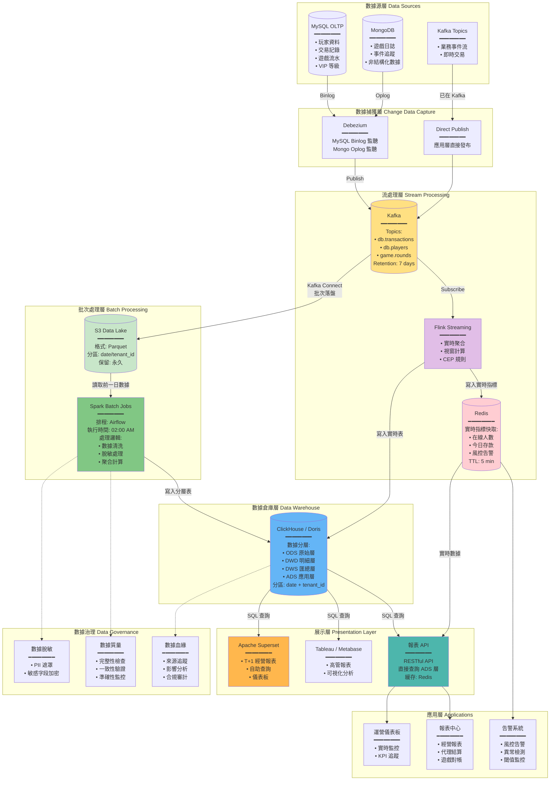

# 07-04 數據管道與 BI 架構 (Data Pipeline & BI Architecture)

## 1. 系統概述
為解決傳統 OLTP 資料庫在處理報表查詢時的效能瓶頸，本模組定義了 **OLAP (Online Analytical Processing)** 的數據流架構。
目標是支撐 **T+1 經營報表** 與 **準實時 (Near Real-time) 風控儀表板**。

## 2. 核心架構 (Data Flow)

### 2.0 完整數據管線架構圖 (Complete Data Pipeline Architecture)

**概述**：採用 Lambda 架構變體，同時支援批次處理 (Batch) 與流處理 (Streaming)，滿足 T+1 報表與準實時儀表板需求。



**架構特點說明**：

| 架構特點 | 說明 | 技術選型 | 適用場景 |
|---------|------|---------|---------|
| **Lambda 架構變體** | 批次層 (Batch Layer) + 速度層 (Speed Layer) 並行處理 | Spark (批次) + Flink (流) | T+1 報表 + 實時監控 |
| **數據湖 (Data Lake)** | S3 存儲原始 Parquet 文件，永久保留 | AWS S3 / MinIO | 數據回溯、審計、機器學習 |
| **數據倉庫 (DWH)** | 結構化存儲，支援 OLAP 查詢 | ClickHouse / StarRocks | 快速聚合查詢 (秒級) |
| **實時快取** | Redis 存儲實時指標，減輕 DWH 壓力 | Redis Cluster | 高頻查詢 (在線人數、今日存款) |
| **多租戶隔離** | 邏輯隔離 (tenant_id 分區)，非物理隔離 | ClickHouse Partition | 支援跨租戶平台級報表 |

**數據流路徑對比**：

| 路徑類型 | 延遲 | 數據完整性 | 查詢靈活性 | 成本 | 適用場景 |
|---------|------|-----------|-----------|------|---------|
| **實時路徑<br/>(Hot Path)** | < 5 秒 | 可能有遺漏 | 簡單聚合 | 高 (Redis 內存) | 運營監控、風控告警 |
| **準實時路徑<br/>(Warm Path)** | 5-60 秒 | 較高 | 中等複雜度 | 中 (Flink → ClickHouse) | 實時儀表板、異常檢測 |
| **批次路徑<br/>(Cold Path)** | T+1 (次日) | 100% 完整 | 複雜 Join + 聚合 | 低 (S3 + Spark) | 經營報表、結算對帳 |

**關鍵設計決策**：

1. **為何需要數據湖 (S3)?**
   - **原因**: ClickHouse 刪除數據成本高，S3 作為不可變數據源
   - **好處**: 支援數據回溯、重新計算、機器學習訓練
   - **成本**: S3 Glacier 每 GB 僅 $0.004/月

2. **為何同時使用 Flink 和 Spark?**
   - **Flink**: 流處理引擎，毫秒級延遲，適合實時聚合
   - **Spark**: 批處理引擎，支援複雜 ETL 邏輯，T+1 報表首選
   - **互補**: Flink 處理實時，Spark 處理批次，各司其職

3. **為何 Redis 只存 5 分鐘?**
   - **原因**: Redis 主要用於高頻查詢緩存 (如運營儀表板每 10 秒刷新)
   - **策略**: 超過 5 分鐘的數據從 ClickHouse 查詢
   - **成本**: Redis 內存昂貴 (每 GB $0.15/h)，不適合長期存儲

4. **為何選擇 ClickHouse 而非傳統 MySQL?**
   - **性能**: ClickHouse 列式存儲，聚合查詢快 100-1000x
   - **範例**: 查詢 10 億條記錄的 SUM(amount) → MySQL (30s+)，ClickHouse (< 1s)
   - **限制**: 不支援高頻 UPDATE/DELETE，僅適合 OLAP

5. **為何需要數據脫敏?**
   - **合規**: GDPR、CCPA 要求保護 PII
   - **風險**: 數據倉庫通常有更多人員訪問權限 (BI 分析師、數據科學家)
   - **策略**: 在 DWD 層脫敏，確保下游 (DWS/ADS) 不含原始 PII

**性能基準 (Benchmark)**：

| 操作 | MySQL (OLTP) | ClickHouse (OLAP) | 提升倍數 |
|------|-------------|------------------|---------|
| COUNT(*) - 1 億條 | 30 秒 | 0.5 秒 | 60x |
| SUM(amount) - 1 億條 | 45 秒 | 0.8 秒 | 56x |
| GROUP BY + AVG - 1 億條 | 120 秒 | 2 秒 | 60x |
| 複雜 JOIN (3 表) - 1000 萬條 | 300 秒 | 5 秒 | 60x |
| 寫入 TPS | 10,000 | 100,000+ | 10x |

---

### 2.1 數據分層架構詳解 (Data Layering Architecture)

**概述**：採用經典四層數據倉庫架構，確保數據從原始到應用的漸進式處理與質量提升。

```mermaid
flowchart TD
    subgraph ODS[📦 ODS 層 - Operational Data Store<br/>原始數據層]
        ODS_DESC[特性:<br/>━━━━━━━━<br/>• 與業務庫 1:1 映射<br/>• 不做任何轉換<br/>• 保留完整歷史<br/>• 支援數據回溯<br/>━━━━━━━━<br/>更新頻率: 準實時 (CDC)<br/>保留期限: 永久<br/>分區策略: date + tenant_id]

        ODS_TABLES[典型表結構<br/>━━━━━━━━<br/>• ods_players<br/>• ods_transactions<br/>• ods_game_rounds<br/>• ods_deposits<br/>• ods_withdrawals<br/>━━━━━━━━<br/>命名規則: ods_{table_name}]
    end

    subgraph DWD[🔧 DWD 層 - Data Warehouse Detail<br/>明細數據層]
        DWD_DESC[特性:<br/>━━━━━━━━<br/>• 數據清洗<br/>• PII 脫敏<br/>• 字段標準化<br/>• 維度關聯<br/>• 業務規則過濾<br/>━━━━━━━━<br/>更新頻率: T+1 批次<br/>保留期限: 2 年<br/>分區策略: date + tenant_id]

        DWD_PROCESS[處理邏輯<br/>━━━━━━━━<br/>1️⃣ 數據清洗:<br/>  • NULL 處理<br/>  • 異常值過濾<br/>  • 重複記錄去重<br/>2️⃣ 脫敏處理:<br/>  • phone: 0912***789<br/>  • email: r***@gmail.com<br/>  • name: R** C**<br/>3️⃣ 維度關聯:<br/>  • JOIN dim_vip_level<br/>  • JOIN dim_game_category<br/>4️⃣ 業務過濾:<br/>  • 排除測試帳號<br/>  • 排除無效交易]

        DWD_TABLES[典型表結構<br/>━━━━━━━━<br/>• dwd_player_profile<br/>• dwd_transaction_detail<br/>• dwd_game_round_detail<br/>• dwd_deposit_detail<br/>• dwd_withdrawal_detail<br/>━━━━━━━━<br/>命名規則: dwd_{domain}_detail]
    end

    subgraph DWS[📊 DWS 層 - Data Warehouse Summary<br/>匯總數據層]
        DWS_DESC[特性:<br/>━━━━━━━━<br/>• 按時間維度聚合<br/>• 按業務維度聚合<br/>• 預計算指標<br/>• 支援鑽取分析<br/>━━━━━━━━<br/>更新頻率: T+1 批次<br/>保留期限: 3 年<br/>分區策略: date]

        DWS_AGG[聚合維度<br/>━━━━━━━━<br/>• 時間維度:<br/>  - 日 (day)<br/>  - 週 (week)<br/>  - 月 (month)<br/>  - 年 (year)<br/>• 業務維度:<br/>  - 租戶 (tenant)<br/>  - 遊戲類型 (game_type)<br/>  - VIP 等級 (vip_level)<br/>  - 國家 (country)<br/>  - 代理 (agent)]

        DWS_TABLES[典型表結構<br/>━━━━━━━━<br/>• dws_daily_revenue<br/>• dws_daily_player_summary<br/>• dws_daily_game_summary<br/>• dws_monthly_tenant_pnl<br/>• dws_weekly_agent_settlement<br/>━━━━━━━━<br/>命名規則: dws_{period}_{domain}_summary]
    end

    subgraph ADS[🎯 ADS 層 - Application Data Service<br/>應用數據層]
        ADS_DESC[特性:<br/>━━━━━━━━<br/>• 面向特定應用<br/>• 寬表設計<br/>• 高度優化<br/>• 直接查詢<br/>━━━━━━━━<br/>更新頻率: T+1 批次 或 實時<br/>保留期限: 6 個月<br/>索引策略: 優化查詢性能]

        ADS_APPS[應用場景<br/>━━━━━━━━<br/>• 運營儀表板:<br/>  - ads_daily_kpi_dashboard<br/>• 經營報表:<br/>  - ads_monthly_financial_report<br/>• 代理結算:<br/>  - ads_agent_settlement_report<br/>• 玩家分析:<br/>  - ads_player_segmentation<br/>• 風控監控:<br/>  - ads_risk_alert_summary]

        ADS_TABLES[典型表結構<br/>━━━━━━━━<br/>• ads_daily_kpi (運營 KPI)<br/>• ads_merchant_revenue (商戶收入)<br/>• ads_player_ltv (玩家 LTV)<br/>• ads_game_performance (遊戲表現)<br/>━━━━━━━━<br/>命名規則: ads_{application}_{metric}]
    end

    ODS -->|Spark ETL<br/>數據清洗 + 脫敏| DWD
    DWD -->|Spark SQL<br/>聚合計算| DWS
    DWS -->|Spark SQL<br/>寬表構建| ADS

    DWD -.->|某些場景直接聚合| ADS

    subgraph EXAMPLES[典型 ETL 範例]
        EX1[範例 1: 每日收入報表<br/>━━━━━━━━━━━━━━━━<br/>ODS:<br/>  SELECT * FROM ods_transactions<br/>  WHERE date = '2026-01-27'<br/>↓<br/>DWD:<br/>  清洗無效交易 + 脫敏玩家資訊<br/>  INSERT INTO dwd_transaction_detail<br/>↓<br/>DWS:<br/>  SELECT date, tenant_id,<br/>    SUM(amount) as total_revenue,<br/>    COUNT(DISTINCT player_id) as active_players<br/>  FROM dwd_transaction_detail<br/>  GROUP BY date, tenant_id<br/>  INSERT INTO dws_daily_revenue<br/>↓<br/>ADS:<br/>  JOIN 維度表 + 計算衍生指標<br/>  INSERT INTO ads_daily_kpi]

        EX2[範例 2: 玩家 LTV 分析<br/>━━━━━━━━━━━━━━━━<br/>DWD:<br/>  dwd_player_profile (基礎資料)<br/>  dwd_transaction_detail (交易明細)<br/>↓<br/>DWS:<br/>  按玩家聚合生命週期指標<br/>  - 首存日期<br/>  - 累計存款<br/>  - 累計提款<br/>  - 遊戲頻率<br/>↓<br/>ADS:<br/>  應用 LTV 預測模型<br/>  分群標籤 (高價值/中價值/低價值)<br/>  INSERT INTO ads_player_ltv]
    end

    ADS -.-> EXAMPLES

    subgraph QUALITY[數據質量檢查]
        Q1[ODS → DWD 檢查<br/>━━━━━━━━<br/>• 記錄數一致性<br/>• 主鍵重複檢查<br/>• NULL 值比例<br/>• 異常值檢測]

        Q2[DWD → DWS 檢查<br/>━━━━━━━━<br/>• 聚合結果準確性<br/>• 分組完整性<br/>• 時間連續性<br/>• 維度覆蓋率]

        Q3[DWS → ADS 檢查<br/>━━━━━━━━<br/>• 業務邏輯正確性<br/>• KPI 指標合理性<br/>• 報表數據一致性<br/>• 查詢性能達標]
    end

    DWD -.-> Q1
    DWS -.-> Q2
    ADS -.-> Q3

    %% 樣式定義
    style ODS fill:#E3F2FD
    style DWD fill:#FFF9C4
    style DWS fill:#C8E6C9
    style ADS fill:#FFE0B2
    style EXAMPLES fill:#F3E5F5
    style QUALITY fill:#FFCDD2
```

**四層架構對比矩陣**：

| 特性 | ODS | DWD | DWS | ADS |
|------|-----|-----|-----|-----|
| **數據來源** | 業務庫 (MySQL/Mongo) | ODS 層 | DWD 層 | DWS 層 (或 DWD 直接) |
| **數據粒度** | 原始明細 | 清洗後明細 | 聚合匯總 | 應用寬表 |
| **數據量級** | 最大 (TB 級) | 大 (TB 級) | 中 (GB 級) | 小 (GB 級) |
| **更新頻率** | 準實時 (CDC) | T+1 批次 | T+1 批次 | T+1 或 實時 |
| **查詢頻率** | 極低 (僅 ETL) | 低 (偶爾鑽取) | 中 (分析查詢) | 極高 (前端直接查詢) |
| **索引策略** | 分區索引 | 分區 + 部分二級索引 | 分區 + 聚合索引 | 完整索引優化 |
| **保留期限** | 永久 | 2 年 | 3 年 | 6 個月 |
| **脫敏要求** | ❌ 原始數據 | ✅ 完全脫敏 | ✅ 完全脫敏 | ✅ 完全脫敏 |
| **訪問權限** | DBA Only | 數據工程師 | BI 分析師 + 數據科學家 | 所有應用 |
| **典型查詢** | `SELECT * WHERE id = X` | `SELECT * WHERE date BETWEEN ... AND ...` | `SELECT SUM(...) GROUP BY ...` | `SELECT * FROM ads_table WHERE date = TODAY` |

**ETL 流程時間表 (Airflow DAG)**：

```
02:00 - 02:15  ODS → DWD (數據清洗 + 脫敏)
02:15 - 02:45  DWD → DWS (聚合計算)
02:45 - 03:00  DWS → ADS (寬表構建)
03:00 - 03:05  數據質量檢查
03:05         發送完成通知 + 報表可用
```

**關鍵設計原則**：

1. **漸進式處理 (Progressive Processing)**：
   - **原則**: 每一層只做該層該做的事，不跨層處理
   - **好處**: 職責清晰，故障隔離，易於排查

2. **冪等性保證 (Idempotency)**：
   - **原則**: 所有 ETL 任務支援重複執行，結果一致
   - **實現**: 使用 `INSERT OVERWRITE` 或 `DROP PARTITION` + `INSERT`

3. **分區策略 (Partitioning Strategy)**：
   - **時間分區**: 所有表必須按 `date` 分區
   - **租戶分區**: 多租戶表必須加 `tenant_id` 子分區
   - **好處**: 支援增量更新，避免全表掃描

4. **數據血緣 (Data Lineage)**：
   - **原則**: 每一層數據必須可追溯到上一層
   - **實現**: 在 ETL 日誌中記錄 source_table → target_table 映射
   - **工具**: Apache Atlas / DataHub

5. **質量優先 (Quality First)**：
   - **原則**: 寧可報表延遲，不可數據錯誤
   - **實現**: 每層 ETL 後執行數據質量檢查
   - **閾值**: 若異常率 > 5%，阻斷下游 ETL，觸發告警

**典型 SQL 範例 (ClickHouse)**：

```sql
-- ODS → DWD: 數據清洗 + 脫敏
INSERT INTO dwd_player_profile
SELECT
    player_id,
    concat(substring(name, 1, 1), '**') AS name_masked,  -- 脫敏
    concat(substring(phone, 1, 4), '***', substring(phone, -3)) AS phone_masked,
    email_domain,  -- 僅保留域名
    country,
    vip_level,
    registration_date,
    CASE WHEN is_test_account = 1 THEN NULL ELSE total_deposit END AS total_deposit,  -- 排除測試
    date
FROM ods_players
WHERE date = '2026-01-27'
  AND deleted = 0  -- 過濾已刪除
  AND player_id NOT IN (SELECT player_id FROM blacklist);  -- 排除黑名單

-- DWD → DWS: 日度聚合
INSERT INTO dws_daily_revenue
SELECT
    date,
    tenant_id,
    SUM(CASE WHEN type = 'deposit' THEN amount ELSE 0 END) AS total_deposit,
    SUM(CASE WHEN type = 'withdrawal' THEN amount ELSE 0 END) AS total_withdrawal,
    SUM(CASE WHEN type = 'bet' THEN amount ELSE 0 END) AS total_bet,
    SUM(CASE WHEN type = 'win' THEN amount ELSE 0 END) AS total_win,
    SUM(CASE WHEN type = 'bet' THEN amount ELSE 0 END) -
    SUM(CASE WHEN type = 'win' THEN amount ELSE 0 END) AS ggr,  -- 毛博彩收入
    COUNT(DISTINCT player_id) AS active_players,
    COUNT(DISTINCT CASE WHEN is_first_deposit = 1 THEN player_id END) AS ftd_count
FROM dwd_transaction_detail
WHERE date = '2026-01-27'
GROUP BY date, tenant_id;

-- DWS → ADS: 寬表構建
INSERT INTO ads_daily_kpi
SELECT
    r.date,
    r.tenant_id,
    t.tenant_name,
    r.total_deposit,
    r.total_withdrawal,
    r.ggr,
    r.active_players,
    r.ftd_count,
    r.ggr / r.active_players AS arpu,  -- 人均收入
    r.ftd_count / v.total_visits AS ftd_conversion_rate,  -- 首存轉化率
    CASE
        WHEN r.ggr > 1000000 THEN 'Excellent'
        WHEN r.ggr > 500000 THEN 'Good'
        WHEN r.ggr > 100000 THEN 'Average'
        ELSE 'Poor'
    END AS performance_level
FROM dws_daily_revenue r
LEFT JOIN dim_tenant t ON r.tenant_id = t.tenant_id
LEFT JOIN dws_daily_visit v ON r.date = v.date AND r.tenant_id = v.tenant_id
WHERE r.date = '2026-01-27';
```

**運營優化建議**：

- **監控 ETL 執行時間**: 每層 ETL 應 < 15 分鐘，總耗時 < 1 小時
- **監控數據延遲**: ADS 層數據應在 03:00 前可用 (SLA: 99.5%)
- **監控數據質量**: 設置自動化質量檢查，異常率閾值 < 5%
- **監控存儲成本**: ODS 層佔 70% 存儲，考慮定期歸檔至 S3 Glacier
- **監控查詢性能**: ADS 層查詢應 < 3 秒 (P95)，否則需優化索引

---

## 3. 報表類型與實現策略

### 3.1 實時儀表板 (Real-time Dashboard)
*   **場景**：在線人數、今日存款總額、風控警報。
*   **技術**：
    *   **Source**: Redis (Counter) 或 Flink Streaming SQL。
    *   **Latency**: < 5 秒。
    *   **限制**：僅提供簡易聚合，不支援複雜 Join。

### 3.2 T+1 經營報表 (Historical Report)
*   **場景**：月度損益表、代理業績結算、遊戲商對帳。
*   **技術**：
    *   **Source**: ClickHouse / StarRocks。
    *   **排程**：每日凌晨 02:00 執行 Spark/Airflow 任務，計算前一日數據。
    *   **優勢**：支援海量數據 (億級) 的秒級查詢。

---

## 4. 數據治理 (Data Governance)

### 4.1 脫敏規範 (Data Masking)
*   進入 Data Warehouse 前，所有 **PII (Personal Identifiable Information)** 必須脫敏。
*   規則：
    *   Name -> `R** C**`
    *   Phone -> `0912***789`
    *   ID -> `A12****89`

### 4.2 數據保留策略 (Retention)
*   **Hot Data (SSD)**: 最近 3 個月 (高頻查詢)。
*   **Warm Data (HDD)**: 3個月 - 1年。
*   **Cold Data (S3 Glacier)**: 1年以上 (僅供審計歸檔)。

## 6. 特殊業務處理 (Advanced Operations)

### 6.1 數據修正與冪等覆蓋 (Data Correction)
當上游產生 "歷史帳務作廢" (Void Transaction) 時：
1.  **策略**: **Idempotent Overwrite (冪等覆蓋)**。
2.  **執行**: Airflow 接收 `date` 參數，刪除該日期的 ClickHouse Partition，並重新從 ODS 執行 ETL。
3.  **Command**: `ALTER TABLE dws_revenue DROP PARTITION '2023-10-01';`

### 6.2 多商戶隔離策略 (OLAP Multi-Tenancy)
*   **模式**: **Logical Isolation (邏輯隔離)**。
*   **實作**: 所有商戶共用同一張大表，但在 Partition Key 中包含 `tenant_id`。
*   **優勢**: 避免維護數千個 DB 實例，且支援跨商戶的平台級報表 (如：全站總 GGR)。
*   **查詢**: 必須強制帶入 `WHERE tenant_id = ?`，否則拒絕執行。

---

## 5. 技術選型建議
*   **CDC**: Debezium (穩定、支援 MySQL Binlog)。
*   **Message Queue**: Kafka (高吞吐)。
*   **OLAP Engine**: 
    *   **ClickHouse**: 單表查詢極快，適合日誌分析。
    *   **StarRocks / Doris**: 支援 Join 較好，適合複雜報表。
*   **Scheduler**: Apache Airflow (DAG 管理)。
