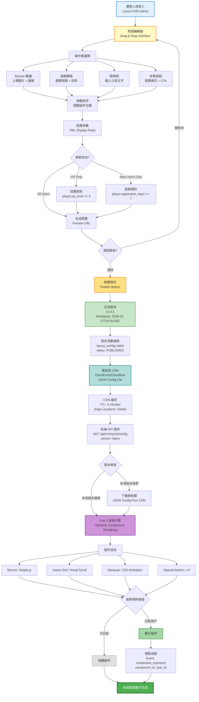
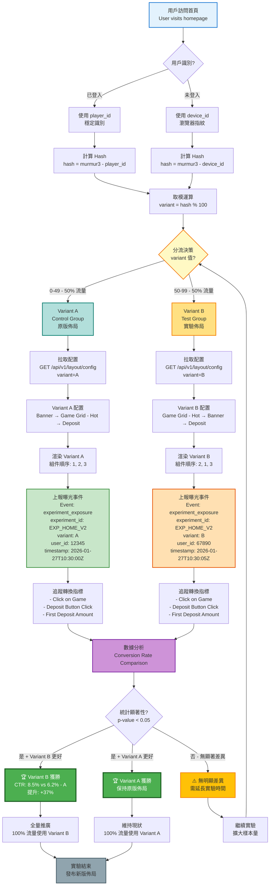

# 08-01 前台版面配置引擎 (Frontend Layout Engine)

## 1. 系統概述
無需工程師介入，運營人員即可透過後台 "拖拉拽" (Drag & Drop) 方式調整前台首頁佈局。
支援多終端 (Web, H5, App) 的自適應配置。

## 2. 核心功能需求

### 2.1 模板管理 (Template Management)
- **主題切換**：
  - 平台預置多套主題 (深色、亮色、節日限定)。
  - 商戶可一鍵切換整站配色 (CSS Variables)。
- **組件庫 (Component Library)**：
  - Banner 輪播模組
  - 跑馬燈 (Marquee)
  - 遊戲入口網格 (Game Grid) - 可設定 3列/4列/5列
  - 存款引導按鈕

### 2.2 頁面編輯器 (Page Editor)
- **首頁裝修**：
  - 上下拖動模組排序。
  - 設置模組標題 (如 "熱門遊戲" 改為 "TOP 10")。
- **導航欄配置 (Menu Config)**：
  - 自定義 Header/Footer 菜單順序。
  - 支援跳轉內部頁面或外部連結。

## 3. 審批與發布
- **預覽模式 (Preview)**：編輯完成後，生成一個 "預覽連結" (Preview URL) 供內部測試。
- **發布流程**：
  - 點擊 "發布 (Publish)" -> 生成版本號 (v1.0.1)。
  - 系統將配置推送至 CDN。
  - 前段透過 API 拉取最新 JSON Config 渲染頁面。

##### 📊 Diagram 1: 佈局配置完整流程 (Layout Configuration Complete Flow)



**JSON Config 範例**:

```json
{
  "version": "v1.0.1",
  "published_at": "2026-01-27T10:30:00Z",
  "experiment_id": null,
  "components": [
    {
      "component_id": "banner-hero",
      "type": "BANNER",
      "order": 1,
      "config": {
        "images": [
          {
            "url": "https://cdn.example.com/banner1.jpg",
            "link": "/promotions/welcome-bonus",
            "alt": "Welcome Bonus 100%"
          }
        ],
        "autoplay": true,
        "interval": 5000
      },
      "display_rules": {
        "target_users": ["ALL"]
      }
    },
    {
      "component_id": "game-grid-hot",
      "type": "GAME_GRID",
      "order": 2,
      "config": {
        "title": "熱門遊戲",
        "game_ids": [101, 102, 103, 104, 105],
        "columns": 5,
        "show_jackpot": true
      },
      "display_rules": {
        "target_users": ["ALL"]
      }
    },
    {
      "component_id": "vip-exclusive-banner",
      "type": "BANNER",
      "order": 3,
      "config": {
        "images": [
          {
            "url": "https://cdn.example.com/vip-banner.jpg",
            "link": "/vip/benefits"
          }
        ]
      },
      "display_rules": {
        "target_users": ["VIP"],
        "conditions": {
          "vip_level": {
            "operator": ">=",
            "value": 3
          }
        }
      }
    }
  ]
}
```

## 4. 實驗與優化 (Experimentation)
為提升轉換率 (CTR)，佈局引擎需支援 A/B 測試：
- **實驗配置**：
  - 在 Layout JSON 中添加 `experiment_id: "EXP_HOME_V2"`.
  - **Variant A**: Control Group (原版).
  - **Variant B**: Test Group (如：將 "熱門遊戲" 移至最頂部).
- **分流邏輯 (Traffic Splitting)**：
  - 基於 `DeviceID` 或 `PlayerID` 進行 Hash 取模：`hash(id) % 100 < 50 ? A : B`.
  - 確保同一用戶始終看到相同版本 (Consistency).
- **數據追蹤**：
  - 前端渲染時自動上報 `Exposure` 事件 (包含 `experiment_id`, `variant`).

##### 📊 Diagram 2: A/B 測試分流決策機制 (A/B Testing Traffic Splitting Mechanism)



**A/B 測試實施細節**:

### 4.1 分流算法實現

```javascript
// murmur3 hash function (simplified)
function murmurHash3(key, seed = 0) {
  let hash = seed;
  for (let i = 0; i < key.length; i++) {
    hash ^= key.charCodeAt(i);
    hash += (hash << 10);
    hash ^= (hash >> 6);
  }
  hash += (hash << 3);
  hash ^= (hash >> 11);
  hash += (hash << 15);
  return hash >>> 0;  // Convert to unsigned 32-bit int
}

// 分流決策函數
function assignVariant(userId, experimentId) {
  const key = `${experimentId}:${userId}`;
  const hash = murmurHash3(key);
  const bucket = hash % 100;

  if (bucket < 50) {
    return 'A';  // Control Group (50%)
  } else {
    return 'B';  // Test Group (50%)
  }
}

// 使用範例
const userId = '12345';
const experimentId = 'EXP_HOME_V2';
const variant = assignVariant(userId, experimentId);
console.log(`User ${userId} assigned to Variant ${variant}`);
```

### 4.2 曝光事件上報

```javascript
// 前端追蹤代碼
function trackExperimentExposure(experimentId, variant, userId) {
  const event = {
    event_type: 'experiment_exposure',
    experiment_id: experimentId,
    variant: variant,
    user_id: userId,
    timestamp: new Date().toISOString(),
    page_url: window.location.href,
    user_agent: navigator.userAgent
  };

  // 發送至數據分析平台
  fetch('/api/v1/analytics/track', {
    method: 'POST',
    headers: {'Content-Type': 'application/json'},
    body: JSON.stringify(event)
  });

  // 同時發送至 Google Analytics / Mixpanel
  gtag('event', 'experiment_exposure', {
    experiment_id: experimentId,
    variant: variant
  });
}

// 在組件渲染後自動上報
onMounted(() => {
  trackExperimentExposure('EXP_HOME_V2', variant, userId);
});
```

### 4.3 轉換指標追蹤

| 指標類型 | 指標名稱 | 定義 | 計算方式 |
|----------|----------|------|----------|
| **曝光指標** | Exposure Rate | 實驗頁面曝光率 | Exposed Users / Total Users |
| **點擊指標** | Click-through Rate (CTR) | 點擊遊戲按鈕比例 | Game Clicks / Exposed Users |
| **轉換指標** | Deposit Conversion Rate | 首次存款轉換率 | First Deposits / Exposed Users |
| **收入指標** | Average Revenue per User (ARPU) | 平均用戶收入 | Total Revenue / Exposed Users |
| **留存指標** | Day 7 Retention | 7 日留存率 | Active on Day 7 / Exposed Users |

### 4.4 實驗結果分析範例

```
實驗名稱: EXP_HOME_V2 - 首頁佈局優化
實驗時長: 2026-01-20 ~ 2026-01-27 (7 days)
曝光用戶: 50,000 人 (Variant A: 25,000, Variant B: 25,000)

指標對比:

| 指標 | Variant A (Control) | Variant B (Test) | 提升幅度 | P-value | 統計顯著性 |
|------|---------------------|------------------|----------|---------|-----------|
| CTR | 6.2% (1,550 clicks) | 8.5% (2,125 clicks) | +37% | 0.001 | ✅ 顯著 |
| Deposit Conversion | 2.1% (525 deposits) | 2.8% (700 deposits) | +33% | 0.003 | ✅ 顯著 |
| ARPU | $12.50 | $16.20 | +30% | 0.012 | ✅ 顯著 |
| Avg Session Time | 3.2 min | 4.1 min | +28% | 0.008 | ✅ 顯著 |

結論:
🏆 Variant B 在所有核心指標上均顯著優於 Variant A
💡 建議: 全量推廣 Variant B 至所有用戶
📈 預估影響: 月度存款額提升 +30% (~$150,000)
```

## 5. 動態規則
- **客群定向**：
  - 可設定 "僅 VIP 可見" 的專屬 Banner。
  - 可設定 "僅新註冊用戶可見" 的首存優惠廣告。

## 5. 錢包模式 UI 適配 (Wallet Mode UI Adaptation)
前端需根據 `player.wallet_mode` 自動切換 Header 資訊顯示：

### 5.1 Cash Mode (現金模式)
*   **顯示內容**：`Balance` (Total Cash + Bonus)
*   **特徵**：強調 "充值 (Deposit)" 按鈕。

### 5.2 Credit Mode (信用模式)
*   **顯示內容**：
    *   `Credit`: 信用額度 (Limit)。
    *   `Used`: 已用額度。
    *   `Available`: 可用額度 (重點顯示)。
*   **特徵**：
    *   隱藏 "充值" 按鈕，改為 "額度 (Quota)" 詳情頁。
    *   顯示 **"週結倒數 (Settlement Countdown)"**，提醒玩家結算日。

### 5.3 Hybrid Mode (混合模式)
*   **顯示內容**：同時顯示 Cash Balance 與 Available Credit。
*   **支付選擇器**：在下注或購買道具時，允許玩家選擇 "優先扣除 Cash" 或 "使用 Credit"。


---

**文檔版本**: 1.0.0
**最後更新**: 2026-01-28
**維護團隊**: Frontend Team & Product Team
