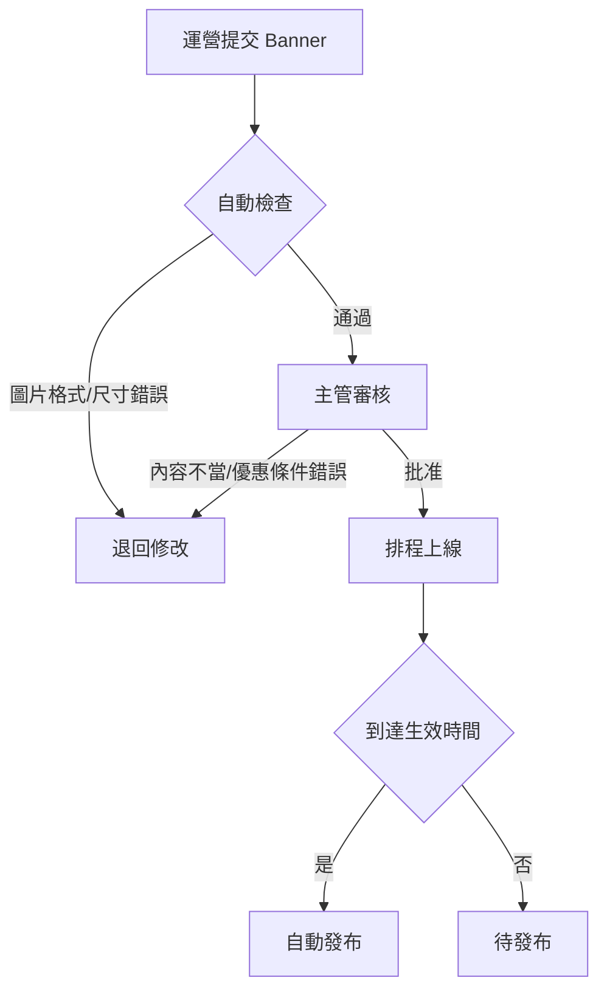

# 08-02 廣告與公告系統 (Banner & Announcement)

## 1. 系統概述
負責管理站點內的所有行銷素材展示與訊息通知。
需支援高併發下的快速讀取 (CDN 緩存)。

## 2. 核心功能需求

### 2.1 Banner 管理
- **類型**：PC 首頁輪播、H5 首頁輪播、彈窗廣告 (Pop-up)。
- **屬性**：
  - 圖片 (多語言：中/英/越/泰)
  - 跳轉連結 (Deep Link to Game/Promotion)
  - 生效時間 (Start Time / End Time)
- **排序**：手動設定權重 (Sort Order)。

### 2.2 跑馬燈 (Marquee)
- **內容來源**：
  - **系統自動**：恭喜玩家 xxx 在遊戲 yyy 贏得 $10,000！ (假數據生成器)
  - **人工發布**：全站維護通知、新支付渠道上線通知。
- **播放策略**：
  - 速度、顏色、循環次數配置。

### 2.3 站內信 (Inbox Message)
- **發送對象**：
  - 全站廣播 (Broadcast)。
  - 特定分群 (Segment)：如 "所有 VIP3 以上玩家"。
  - 個人 (Individual)。
- **模板**：支援 HTML 格式，可插入圖片與按鈕。

---

### 2.4 多語系 Banner 管理

**語言矩陣配置**：

| 語言代碼 | 語言名稱 | 是否必填 | 優先級 |
|---------|---------|---------|--------|
| zh-CN | 簡體中文 | ✅ 必填 | P0 |
| en-US | 英文 | ✅ 必填 | P0 |
| vi-VN | 越南語 | ✅ 必填 | P1 |
| th-TH | 泰語 | ✅ 必填 | P1 |
| pt-BR | 葡萄牙語 | ⚪ 可選 | P2 |
| ja-JP | 日語 | ⚪ 可選 | P2 |

**回退邏輯 (Fallback)**：
```typescript
// Banner 多語系回退策略
function getBannerImage(banner: Banner, userLanguage: string): string {
    // 1. 優先返回用戶語言版本
    if (banner.images[userLanguage]) {
        return banner.images[userLanguage];
    }

    // 2. 回退到英文版本
    if (banner.images['en-US']) {
        return banner.images['en-US'];
    }

    // 3. 最後回退到簡體中文版本（平台默認語言）
    return banner.images['zh-CN'] || banner.default_image;
}
```

**多語系數據結構**：
```json
{
    "banner_id": "banner_001",
    "title": {
        "zh-CN": "新年優惠活動",
        "en-US": "New Year Promotion",
        "vi-VN": "Khuyến mãi Năm mới"
    },
    "images": {
        "zh-CN": "https://cdn.platform.com/banners/cny_zh.webp",
        "en-US": "https://cdn.platform.com/banners/cny_en.webp",
        "vi-VN": "https://cdn.platform.com/banners/cny_vi.webp"
    },
    "link_url": {
        "zh-CN": "/zh/promotions/cny",
        "en-US": "/en/promotions/new-year",
        "vi-VN": "/vi/khuyen-mai/nam-moi"
    }
}
```

---

## 3. Banner 展示規則 (Targeting Rules)

### 3.1 用戶分群定向 (User Segment Targeting)

**玩家生命週期分群**：
- **新玩家** (New Players): 註冊 < 7 天 → 顯示「首存優惠」Banner
- **活躍玩家** (Active Players): 近 7 天有登入 → 顯示「遊戲推薦」Banner
- **流失玩家** (Inactive Players): 30 天未登入 → 顯示「回歸獎金」Banner
- **高價值玩家** (High Rollers): 月存款 > $10,000 → 顯示「VIP專屬活動」Banner

**VIP 等級定向**：
| VIP 等級 | 顯示 Banner |
|---------|-----------|
| Bronze (銅) | 基礎活動 Banner |
| Silver (銀) | 標準活動 + 每週返水 |
| Gold (金) | VIP 活動 + 生日禮金 |
| Platinum (鉑金) | VIP 專屬活動 + 定制服務 |
| Diamond (鑽石) | 頂級活動 + 個人客戶經理 |

**實作範例**：

---

### 3.2 設備定向 (Device Targeting)

**設備類型**：
- **Desktop Only**: 僅在桌面版網站顯示（大尺寸橫幅）
- **Mobile Only**: 僅在移動端顯示（適配小屏幕）
- **Both**: 全平台顯示（需要響應式設計）

**實作範例**：
```typescript
// 前端設備檢測
const isMobile = /iPhone|iPad|iPod|Android/i.test(navigator.userAgent);

// 篩選符合設備的 Banner
const visibleBanners = allBanners.filter(banner => {
    if (banner.device_target === 'desktop' && isMobile) return false;
    if (banner.device_target === 'mobile' && !isMobile) return false;
    return true;
});
```

---

### 3.3 地理定向 (Geo Targeting)

**國家/地區限制**：
- **中國大陸**: 顯示銀聯支付 Banner
- **越南**: 顯示本地銀行轉帳 Banner
- **泰國**: 顯示 PromptPay Banner
- **歐洲**: 顯示 SEPA 轉帳 Banner

**IP 地理位置判斷**：

---

### 3.4 時間規則 (Time-based Rules)

**排程顯示**：
- **固定時間段**: 每天 18:00-23:00 顯示「夜間充值加碼」Banner
- **週末專屬**: 僅週六日顯示「週末狂歡」Banner
- **節日活動**: 農曆新年期間顯示「紅包雨」Banner

**實作範例**：

---

## 4. Banner 效能分析 (Analytics)

### 4.1 核心指標 (Key Metrics)

**展示與點擊追蹤**：
| 指標 | 英文名稱 | 定義 | 公式 |
|------|---------|------|------|
| 展示次數 | Impressions | Banner 被加載的次數 | COUNT(impression_event) |
| 點擊次數 | Clicks | Banner 被點擊的次數 | COUNT(click_event) |
| 點擊率 | CTR (Click-Through Rate) | 點擊次數 / 展示次數 | (Clicks / Impressions) × 100% |
| 轉換次數 | Conversions | 點擊後完成目標行為 (如存款) | COUNT(conversion_event) |
| 轉換率 | CVR (Conversion Rate) | 轉換次數 / 點擊次數 | (Conversions / Clicks) × 100% |

**數據表設計**：

---

### 4.2 轉換追蹤 (Conversion Tracking)

**Banner 歸因邏輯**：

---

### 4.3 A/B 測試 (A/B Testing)

**實驗設計**：
```json
{
    "experiment_id": "exp_001",
    "name": "首頁 Banner 顏色測試",
    "variants": [
        {
            "variant_id": "A",
            "name": "紅色版本",
            "banner_id": "banner_red",
            "traffic_allocation": 50  // 50% 流量
        },
        {
            "variant_id": "B",
            "name": "藍色版本",
            "banner_id": "banner_blue",
            "traffic_allocation": 50  // 50% 流量
        }
    ],
    "start_time": "2026-01-27T00:00:00Z",
    "end_time": "2026-02-03T23:59:59Z"
}
```

**流量分配演算法**：

---

## 5. CDN 整合 (CDN Integration)

### 5.1 圖片優化策略

**CDN 架構** (使用 CloudFlare / AWS CloudFront)：
```
上傳流程:
1. 運營上傳 Banner 圖片 → S3 Bucket (s3://platform-banners/)
2. 自動觸發 Lambda → 生成多種尺寸 (1920x600, 750x400, 600x600)
3. 轉換為 WebP 格式（壓縮率更高）
4. 推送至 CDN → https://cdn.platform.com/banners/{banner_id}_{size}.webp
```

**CDN URL 規範**：
```
原始圖: s3://platform-banners/banner_001_zh-CN.png
CDN URL:
- 桌面版: https://cdn.platform.com/banners/banner_001_zh-CN_1920x600_v2.webp
- 移動版: https://cdn.platform.com/banners/banner_001_zh-CN_750x400_v2.webp
- 彈窗: https://cdn.platform.com/banners/banner_001_zh-CN_600x600_v2.webp

版本號 (v2): 用於緩存失效（更新圖片時遞增）
```

---

### 5.2 響應式圖片 (Responsive Images)

**HTML 實作** (使用 `<picture>` 標籤)：
```html
<picture>
    <!-- 桌面版 (>= 1024px) -->
    <source
        srcset="https://cdn.platform.com/banners/banner_001_zh-CN_1920x600.webp"
        media="(min-width: 1024px)"
        type="image/webp">

    <!-- 平板版 (>= 768px) -->
    <source
        srcset="https://cdn.platform.com/banners/banner_001_zh-CN_1024x512.webp"
        media="(min-width: 768px)"
        type="image/webp">

    <!-- 移動版 (< 768px) -->
    <source
        srcset="https://cdn.platform.com/banners/banner_001_zh-CN_750x400.webp"
        media="(max-width: 767px)"
        type="image/webp">

    <!-- Fallback (不支持 WebP 的瀏覽器) -->
    
</picture>
```

---

### 5.3 緩存策略 (Caching Strategy)

**CloudFlare 緩存配置**：
```nginx
# Nginx / CloudFlare Page Rule
location /banners/ {
    # CDN 緩存 24 小時
    add_header Cache-Control "public, max-age=86400, s-maxage=86400";

    # ETag 用於緩存驗證
    add_header ETag $1;

    # 壓縮
    gzip on;
    gzip_types image/webp image/jpeg image/png;
}
```

**緩存失效 (Cache Invalidation)**：

---

### 5.4 圖片尺寸與格式要求

**技術規範**：

| 設備類型 | 格式 | 最大文件大小 | 推薦尺寸 (px) |
|---------|------|------------|--------------|
| 桌面 Banner | WebP/PNG | 200 KB | 1920x600 |
| 移動 Banner | WebP/PNG | 150 KB | 750x400 |
| 彈窗廣告 | WebP/PNG | 100 KB | 600x600 |
| 跑馬燈圖標 | SVG/PNG | 20 KB | 32x32 |

**圖片壓縮工具鏈**：
```bash
# 使用 cwebp 轉換為 WebP（壓縮率高於 JPEG 30%）
cwebp -q 80 input.png -o output.webp

# 使用 ImageMagick 批量調整尺寸
convert input.png -resize 1920x600 -quality 85 output.jpg
```

---

## 6. 審批流程

### 6.1 廣告審核工作流

**審批流程圖**：


**審批權限** (引用 [09-04 審批工作流系統](../09_System_Security/09-04_Approval_Workflow_System.md)):
- **運營專員**: 提交 Banner、編輯草稿
- **運營主管**: 審核 Banner 內容、批准上線
- **CTO**: 緊急下架 Banner（如發現重大錯誤）

---

**強審批原因**：
- 由於廣告直接面向玩家，錯誤的優惠內容 (如 "存100送1000") 可能導致巨大損失。
- **必須經審批**: 運營提交 → 主管審核內容與跳轉連結 → 批准上線。

---

## 📚 相關文檔

### 業務邏輯參考
- [04-01 活動系統設計](../04_Activity_Center/04-01_Activity_System_Design.md) - Banner 跳轉活動頁邏輯
- [01-02 VIP 忠誠系統](../01_Player_Center/01-02_VIP_&_Loyalty_System.md) - VIP 等級定向規則

### 技術架構參考
- [08-05 本地化系統](./08-05_Localization_System.md) - 多語系實作架構
- [09-04 審批工作流系統](../09_System_Security/09-04_Approval_Workflow_System.md) - Banner 審批流程
- [12-03 網關架構](../12_Technical_Operations/12-03_Gateway_Architecture.md) - CDN 配置與緩存策略

---

**文檔版本**: 1.1.0
**最後更新**: 2026-01-27
**維護團隊**: Frontend Team & Marketing Team
