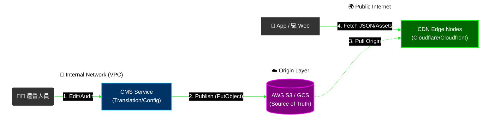

# 08-05-01 i18n 架構與服務設計 (i18n Architecture)

## 1. 系統概述

隨著平台拓展至東南亞 (TH, VN, ID) 與拉美 (BR, MX) 市場，硬編碼的文字 (Hardcoded Strings) 已成為阻礙。本文檔定義 **全平台國際化 (i18n)** 的標準架構，涵蓋翻譯服務、CDN分發與區域格式標準。

---

## 2. 核心架構 (Core Architecture)

### 2.1 翻譯鍵值管理 (Key-Value Strategy)

所有前端展示的文字不得直接寫死，必須使用 **Translation Keys**。

**Namespace 結構**: `module.component.key`

**範例**:
- `common.button.submit` → "Submit" / "提交" / "Yêu cầu"
- `game.slot.freespin_won` → "You won {amount} Free Spins!"
- `error.wallet.insufficient` → "Insufficient balance."

**最佳實踐**：
```javascript
// ❌ 錯誤示範：硬編碼
<button>Submit</button>

// ✅ 正確示範：使用 Translation Key
<button>{t('common.button.submit')}</button>
```

### 2.2 翻譯服務 (Translation Service)

一個中心化的 Microservice，負責：
1. **存儲**: Redis (Hot) + PostgreSQL (Persistent)。
2. **分發**: 提供 CDN 靜態 JSON 檔案供前端加載。
3. **管理**: 提供 "翻譯中心 (Translation Center)" 後台供運營維護。

**服務架構圖**：



### 2.3 數據存儲層設計

**PostgreSQL Schema**：
```sql
CREATE TABLE translations (
    translation_id BIGSERIAL PRIMARY KEY,
    key VARCHAR(255) NOT NULL,        -- e.g., "player.welcome"
    lang VARCHAR(10) NOT NULL,        -- e.g., "th", "zh-TW"
    namespace VARCHAR(50) NOT NULL,   -- e.g., "player", "game"
    value TEXT NOT NULL,
    context TEXT,                     -- 翻譯上下文說明
    status VARCHAR(20) DEFAULT 'draft',  -- draft, in_review, approved, published
    version INT DEFAULT 1,
    created_at TIMESTAMP DEFAULT NOW(),
    updated_at TIMESTAMP DEFAULT NOW(),
    created_by VARCHAR(100),

    UNIQUE (key, lang),
    INDEX idx_lang_namespace (lang, namespace),
    INDEX idx_status (status)
);
```

**Redis 快取策略**：
```python
# Cache Key Format: i18n:{lang}:{namespace}:v{version}
cache_key = f"i18n:{lang}:{namespace}:v{version}"
redis.setex(cache_key, 3600, json.dumps(translations))  # 1 hour TTL
```

---

## 3. 區域格式標準 (Locale Standards)

除了文字翻譯，還需處理格式差異：

| 類別 | 項目 | 範例 (US) | 範例 (VN) | 範例 (IN) |
|---|---|---|---|---|
| **貨幣** | 符號與位置 | $100.00 | 100.000 ₫ | ₹100.00 |
| **數字** | 千分位/小數點 | 1,234.56 | 1.234,56 | 1,234.56 |
| **日期** | 格式 | MM/DD/YYYY | DD/MM/YYYY | DD/MM/YYYY |
| **時區** | 默認顯示 | UTC-4 | UTC+7 | UTC+5.5 |

### 3.1 實作建議

**使用標準庫，嚴禁手寫 Regex**：

```javascript
// ✅ 正確：使用 Intl API
const formatter = new Intl.NumberFormat('th-TH', {
  style: 'currency',
  currency: 'THB'
});
formatter.format(1234.56);  // "฿1,234.56"

// ✅ 正確：使用 dayjs + locale
import dayjs from 'dayjs';
import 'dayjs/locale/th';

dayjs().locale('th').format('DD MMMM YYYY');  // "27 มกราคม 2026"

// ❌ 錯誤：手寫正則處理
value.replace(/(\d)(?=(\d{3})+(?!\d))/g, '$1,');  // 容易出錯
```

---

## 4. RTL 語言支援 (Right-to-Left Support)

### 4.1 支援語言清單

| 語言代碼 | 語言名稱 | 市場 | RTL | 優先級 |
|---|---|---|---|---|
| `en` | English | Global | ❌ | P0 |
| `zh-TW` | 繁體中文 | 台灣、香港 | ❌ | P0 |
| `zh-CN` | 簡體中文 | 中國、新加坡 | ❌ | P0 |
| `th` | ไทย | 泰國 | ❌ | P1 |
| `vi` | Tiếng Việt | 越南 | ❌ | P1 |
| `id` | Bahasa | 印尼 | ❌ | P1 |
| `pt-BR` | Português | 巴西 | ❌ | P1 |
| `ar` | العربية | 中東 | ✅ | P2 |
| `he` | עברית | 以色列 | ✅ | P2 |

### 4.2 RTL 實作

```javascript
// Frontend RTL detection
const isRTL = ['ar', 'he', 'fa'].includes(currentLang);

if (isRTL) {
  document.documentElement.setAttribute('dir', 'rtl');
  document.body.classList.add('rtl');
}

// CSS: Use logical properties (自動適配 RTL)
.container {
  padding-inline-start: 20px;  // LTR: padding-left, RTL: padding-right
  padding-inline-end: 40px;    // LTR: padding-right, RTL: padding-left
}

// Mirror icons for RTL
[dir="rtl"] .back-arrow {
  transform: scaleX(-1);  // Flip horizontally
}
```

### 4.3 RTL 注意事項

**關鍵細節**：
1. **數字方向**: 阿拉伯文中數字仍為 LTR (如 "123")
2. **圖標鏡像**: 返回箭頭需鏡像 (← 變為 →)
3. **排版調整**: 時間軸、進度條需重新設計
4. **文本對齊**: `text-align: start` 而非 `left`

**測試清單**：
- [ ] 導航欄方向正確（右到左）
- [ ] 表單欄位順序反轉
- [ ] 圖標正確鏡像
- [ ] 數字與英文字母保持 LTR
- [ ] 滾動條位置調整

---

## 5. 效能與規模考量 (Performance & Scale)

### 5.1 預期規模

| 指標 | 預估值 |
|---|---|
| 支援語言數 | 20 語言 |
| Translation Key 總數 | 5,000-10,000 keys |
| 每個語言檔案大小 | ~500 KB |
| API QPS | 5,000 req/s (高峰) |

### 5.2 CDN 分發策略

**URL 結構**：
```
https://cdn.casino.com/i18n/{lang}/{namespace}.v{version}.json

範例：
https://cdn.casino.com/i18n/th/player.v5.json
https://cdn.casino.com/i18n/th/game.v5.json
```

**優點**：
- CloudFront 全球分發 (<50ms latency)
- Long-term cache (24 hours TTL)
- Version-based URL (automatic cache busting)

**CDN 配置**：
```javascript
// CloudFront Distribution Settings
{
  "Origins": [{
    "DomainName": "s3-translations.casino.com",
    "OriginPath": "/i18n"
  }],
  "DefaultCacheBehavior": {
    "ViewerProtocolPolicy": "redirect-to-https",
    "CachePolicyId": "658327ea-f89d-4fab-a63d-7e88639e58f6",  // CachingOptimized
    "Compress": true
  },
  "CustomErrorResponses": [
    {
      "ErrorCode": 404,
      "ResponseCode": 200,
      "ResponsePagePath": "/i18n/en/fallback.json"  // Fallback to English
    }
  ]
}
```

### 5.3 前端本地快取

```javascript
// localStorage caching strategy
const cacheKey = `i18n_${lang}_${namespace}_v${version}`;
let translations = localStorage.getItem(cacheKey);

if (!translations) {
  translations = await fetch(`https://cdn.casino.com/i18n/${lang}/${namespace}.v${version}.json`)
    .then(r => r.json());
  localStorage.setItem(cacheKey, JSON.stringify(translations));
}

// Auto-clear old versions
Object.keys(localStorage)
  .filter(k => k.startsWith('i18n_') && !k.endsWith(`_v${currentVersion}`))
  .forEach(k => localStorage.removeItem(k));
```

### 5.4 監控指標

| 指標 | 目標 | Alert Threshold |
|---|---|---|
| API Response Time (P99) | < 50ms | > 200ms |
| Cache Hit Rate | > 95% | < 85% |
| Translation Coverage | 100% | < 95% |
| Missing Key Rate | 0% | > 1% |

**監控實現**：
```python
# Prometheus metrics
from prometheus_client import Counter, Histogram

translation_requests = Counter('translation_requests_total', 'Total translation requests', ['lang', 'namespace'])
cache_hits = Counter('translation_cache_hits_total', 'Cache hits')
cache_misses = Counter('translation_cache_misses_total', 'Cache misses')
response_time = Histogram('translation_response_time_seconds', 'Response time')
```

---

## 6. 實施路線圖 (Implementation Roadmap)

### Phase 1: 基礎建設 (Week 1-2)
- [ ] 建立 PostgreSQL `translations` 表
- [ ] 實作 API: GET /i18n/translations
- [ ] 整合 Redis 快取層
- [ ] Frontend 整合 i18next 或 react-intl

### Phase 2: 管理後台 (Week 3-4)
- [ ] 建立翻譯管理 UI (React Admin)
- [ ] 實作批次上傳 (CSV/JSON)
- [ ] 實作線上編輯器
- [ ] 版本控制與回滾功能

### Phase 3: 工作流程 (Week 5-6)
- [ ] 翻譯狀態機 (draft → in_review → approved)
- [ ] 權限控制 (Translator/Reviewer/Admin)
- [ ] Crowdin 整合 (optional)
- [ ] Missing Key 自動偵測與上報

### Phase 4: 優化與擴展 (Week 7-8)
- [ ] CDN 分發 (CloudFront/Akamai)
- [ ] RTL 語言支援 (Arabic, Hebrew)
- [ ] CMS 動態內容多語化
- [ ] 監控與 Alert 設定

**預計總工時**: 6-8 週

---

## 7. 語言特定注意事項

### 7.1 泰文 (Thai)
- **無空格分隔詞彙**：需使用 CSS `word-break: break-word`
- **敬語系統複雜**：กรุณา vs. ขอ vs. ได้โปรด
- **字型要求**：Noto Sans Thai, Sarabun

### 7.2 越南文 (Vietnamese)
- **大量聲調符號**：â, ê, ô, ư, ơ
- **確保字型支援**：Noto Sans Vietnamese
- **排序規則**：需使用 Unicode Collation Algorithm

### 7.3 阿拉伯文 (Arabic)
- **RTL 排版**
- **字母連寫** (cursive joining)
- **數字為 LTR** (如 123)
- **字型要求**：Noto Sans Arabic, Cairo

---

## 8. 相關文檔

### 系列文檔
- [08-05-02 動態內容本地化](./08-05-02_Dynamic_Content_L10n.md) - JSONB多語言字段、API響應策略
- [08-05-03 翻譯工作流](./08-05-03_Translation_Workflow.md) - 狀態機、Crowdin整合
- [08-05-04 API規格](./08-05-04_API_Specification.md) - 完整API文檔、監控

### 業務邏輯參考
- [08-01 前端佈局引擎](./08-01_Frontend_Layout_Engine.md) - UI元素整合
- [08-02 Banner管理](./08-02_Banner_&_Announcement.md) - 動態內容多語言

### 技術架構參考
- [12-05 API設計標準](../12_Technical_Operations/12-05_API_Design_Standard.md) - API規範
- [09-02 審計日誌與審批](../09_System_Security/09-02_Audit_Log_&_Approval.md) - 翻譯變更審計

### 參考資料
- [i18next Documentation](https://www.i18next.com/)
- [W3C i18n Best Practices](https://www.w3.org/International/)
- [CLDR - Unicode Common Locale Data Repository](http://cldr.unicode.org/)

---

**文檔版本**: 1.0.0
**最後更新**: 2026-01-27
**維護團隊**: Frontend Team & Product Team
