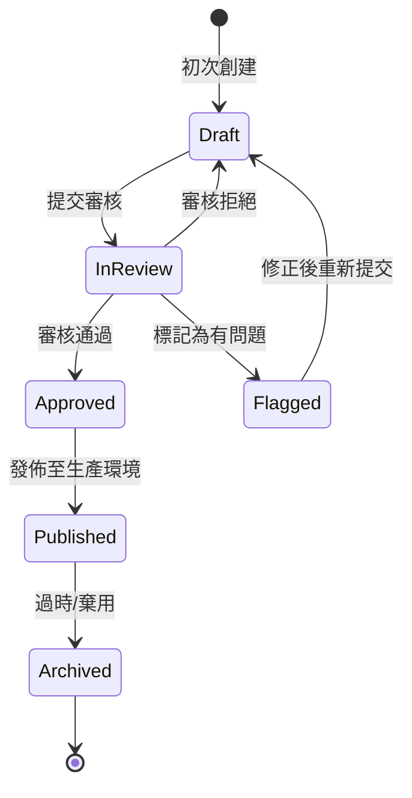
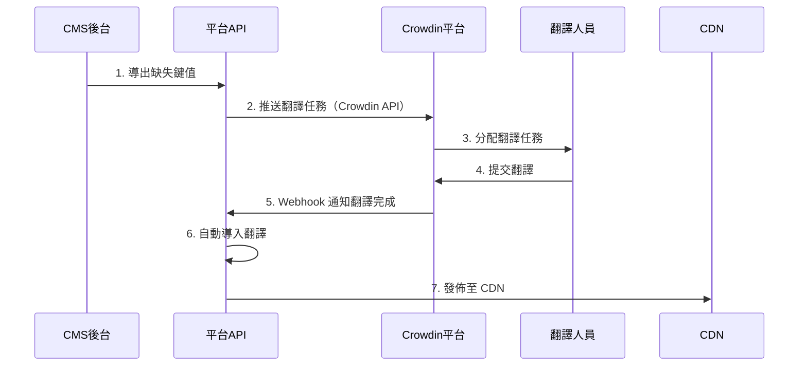

# 08-05-03 翻譯工作流與 Crowdin 整合 (Translation Workflow & Crowdin Integration)

## 1. 系統概述

本文檔定義翻譯內容的完整生命週期管理，從缺失鍵值偵測、批量導入導出、人工翻譯審核，到第三方翻譯平台（Crowdin）整合的自動化工作流。

---

## 2. 缺失鍵值自動捕獲 (Missing Key Capture)

### 2.1 前端缺失鍵值偵測

**機制**：當前端嘗試翻譯一個不存在的鍵值時，自動上報到後端。

**React/i18next 整合**：
```javascript
import i18next from 'i18next';
import { initReactI18next } from 'react-i18next';

i18next
  .use(initReactI18next)
  .init({
    // ... 其他配置

    // 缺失鍵值處理器
    saveMissing: true,
    missingKeyHandler: (lngs, ns, key, fallbackValue) => {
      // 自動上報缺失的翻譯鍵值
      fetch('/api/v1/i18n/missing-keys', {
        method: 'POST',
        headers: { 'Content-Type': 'application/json' },
        body: JSON.stringify({
          key: `${ns}.${key}`,
          languages: lngs,
          fallback_value: fallbackValue,
          page_url: window.location.href,
          timestamp: new Date().toISOString()
        })
      }).catch(err => console.error('Failed to report missing key:', err));
    }
  });
```

### 2.2 後端缺失鍵值記錄

**資料表設計**：
```sql
CREATE TABLE missing_translation_keys (
    missing_key_id BIGSERIAL PRIMARY KEY,
    key VARCHAR(255) NOT NULL,              -- e.g., "game.slot.freespin_won"
    namespace VARCHAR(50),                  -- e.g., "game"
    requested_languages TEXT[],             -- ['zh-TW', 'th']
    fallback_value TEXT,                    -- 顯示的預設文字
    page_url TEXT,                          -- 發現位置
    occurrence_count INT DEFAULT 1,         -- 出現次數
    first_seen_at TIMESTAMP DEFAULT NOW(),
    last_seen_at TIMESTAMP DEFAULT NOW(),
    status VARCHAR(20) DEFAULT 'pending',   -- pending, in_translation, resolved

    INDEX idx_status_key (status, key)
);

-- 冪等性處理：如果鍵值已存在，則更新計數器
INSERT INTO missing_translation_keys (key, namespace, requested_languages, fallback_value, page_url)
VALUES ($1, $2, $3, $4, $5)
ON CONFLICT (key) DO UPDATE SET
    occurrence_count = missing_translation_keys.occurrence_count + 1,
    last_seen_at = NOW();
```

### 2.3 缺失鍵值儀表板

**CMS 後台顯示**：
```markdown
缺失翻譯鍵值報告
┌─────────────────────────────┬──────────┬──────────────┬─────────┐
│ 鍵值                        │ 出現次數 │ 首次發現     │ 狀態    │
├─────────────────────────────┼──────────┼──────────────┼─────────┤
│ game.slot.freespin_won      │ 1,234    │ 2026-01-20   │ Pending │
│ error.wallet.insufficient   │ 856      │ 2026-01-22   │ In Translation │
│ vip.benefits.cashback       │ 423      │ 2026-01-25   │ Resolved │
└─────────────────────────────┴──────────┴──────────────┴─────────┘

操作：
[批量導出] [標記為已處理] [建立翻譯任務]
```

---

## 3. 批量導入導出 (Batch Import/Export)

### 3.1 導出格式：JSON

**API 端點**：
```http
GET /api/v1/i18n/export?lang=zh-TW&namespace=game&format=json

Response:
{
  "game.slot.freespin_won": "您贏得了 {amount} 次免費旋轉！",
  "game.slot.jackpot_hit": "恭喜中大獎！",
  "game.table.bet_placed": "下注成功"
}
```

### 3.2 導出格式：CSV

**用於 Excel 編輯或第三方翻譯工具**：
```http
GET /api/v1/i18n/export?lang=zh-TW&format=csv

Response (CSV):
Key,Namespace,Chinese (Traditional),English (Fallback),Context
game.slot.freespin_won,game,您贏得了 {amount} 次免費旋轉！,You won {amount} Free Spins!,Slot game win notification
game.slot.jackpot_hit,game,恭喜中大獎！,Jackpot Hit!,Big win celebration
```

### 3.3 導出格式：XLIFF

**符合翻譯行業標準（用於 CAT 工具）**：
```xml
<?xml version="1.0" encoding="UTF-8"?>
<xliff version="1.2" xmlns="urn:oasis:names:tc:xliff:document:1.2">
  <file source-language="en" target-language="zh-TW" datatype="plaintext">
    <body>
      <trans-unit id="game.slot.freespin_won">
        <source>You won {amount} Free Spins!</source>
        <target>您贏得了 {amount} 次免費旋轉！</target>
        <note>Slot game win notification</note>
      </trans-unit>
      <trans-unit id="game.slot.jackpot_hit">
        <source>Jackpot Hit!</source>
        <target>恭喜中大獎！</target>
      </trans-unit>
    </body>
  </file>
</xliff>
```

### 3.4 批量導入 API

**上傳 JSON/CSV/XLIFF 檔案**：
```http
POST /api/v1/i18n/import
Content-Type: multipart/form-data

Request:
{
  "file": <uploaded_file>,
  "lang": "th",
  "namespace": "game",
  "mode": "upsert"  // "upsert" (更新或插入) 或 "overwrite" (覆蓋)
}

Response:
{
  "code": 1000,
  "message": "Import completed",
  "stats": {
    "total_keys": 150,
    "inserted": 45,
    "updated": 105,
    "errors": 0
  }
}
```

**後端處理邏輯（Python）**：
```python
import csv
import json
from fastapi import UploadFile

@app.post("/api/v1/i18n/import")
async def import_translations(file: UploadFile, lang: str, namespace: str, mode: str = "upsert"):
    content = await file.read()

    # 解析不同格式
    if file.filename.endswith('.json'):
        translations = json.loads(content)
    elif file.filename.endswith('.csv'):
        translations = parse_csv(content)
    elif file.filename.endswith('.xliff'):
        translations = parse_xliff(content)
    else:
        raise HTTPException(400, "Unsupported file format")

    stats = {"inserted": 0, "updated": 0, "errors": 0}

    for key, value in translations.items():
        try:
            if mode == "overwrite":
                # 刪除舊值後插入
                await db.execute(
                    "DELETE FROM translations WHERE key = $1 AND lang = $2",
                    key, lang
                )

            # Upsert 邏輯
            result = await db.execute("""
                INSERT INTO translations (key, lang, namespace, value, created_by)
                VALUES ($1, $2, $3, $4, $5)
                ON CONFLICT (key, lang) DO UPDATE SET
                    value = EXCLUDED.value,
                    updated_at = NOW()
                RETURNING (xmax = 0) AS inserted
            """, key, lang, namespace, value, current_user.id)

            if result['inserted']:
                stats['inserted'] += 1
            else:
                stats['updated'] += 1

        except Exception as e:
            stats['errors'] += 1
            logger.error(f"Failed to import key {key}: {e}")

    return {"code": 1000, "stats": stats}
```

---

## 4. 翻譯狀態機 (Translation State Machine)

### 4.1 狀態定義



**狀態說明**：
| 狀態 | 說明 | 可執行操作 |
|------|------|-----------|
| **draft** | 草稿狀態，翻譯人員正在編輯 | 編輯、提交審核 |
| **in_review** | 審核中，等待審核員審核 | 批准、拒絕、標記 |
| **approved** | 已批准，等待發佈 | 發佈 |
| **published** | 已發佈至 CDN，玩家可見 | 歸檔 |
| **flagged** | 存在問題，需要修正 | 編輯、重新提交 |
| **archived** | 已棄用，不再使用 | 刪除 |

### 4.2 狀態轉換 API

**提交審核**：
```http
PUT /api/v1/i18n/translations/{key}/submit-for-review

Request:
{
  "lang": "th",
  "comment": "泰文翻譯已完成，請審核"
}

Response:
{
  "code": 1000,
  "message": "Translation submitted for review",
  "new_status": "in_review"
}
```

**審核批准**：
```http
PUT /api/v1/i18n/translations/{key}/approve

Request:
{
  "lang": "th",
  "reviewer_comment": "翻譯準確，已批准"
}

Response:
{
  "code": 1000,
  "message": "Translation approved",
  "new_status": "approved"
}
```

**發佈至生產環境**：
```http
POST /api/v1/i18n/translations/publish

Request:
{
  "lang": "th",
  "keys": ["game.slot.*", "player.welcome"],  // 支援萬用字元
  "target_cdn": true
}

Response:
{
  "code": 1000,
  "message": "Published 128 translations to CDN",
  "cdn_url": "https://cdn.casino.com/i18n/th/game.v6.json"
}
```

### 4.3 狀態追蹤資料表

**擴展 translations 表**：
```sql
ALTER TABLE translations ADD COLUMN IF NOT EXISTS status VARCHAR(20) DEFAULT 'draft';
ALTER TABLE translations ADD COLUMN IF NOT EXISTS reviewer_id BIGINT;
ALTER TABLE translations ADD COLUMN IF NOT EXISTS reviewer_comment TEXT;
ALTER TABLE translations ADD COLUMN IF NOT EXISTS published_at TIMESTAMP;

-- 狀態轉換審計日誌
CREATE TABLE translation_status_history (
    history_id BIGSERIAL PRIMARY KEY,
    translation_id BIGINT REFERENCES translations(translation_id),
    from_status VARCHAR(20),
    to_status VARCHAR(20),
    operator_id BIGINT,
    comment TEXT,
    created_at TIMESTAMP DEFAULT NOW()
);
```

---

## 5. 權限控制矩陣 (Permission Matrix)

### 5.1 角色定義

| 角色 | 權限 | 職責 |
|------|------|------|
| **Translator（翻譯員）** | 編輯 draft、提交 in_review | 負責翻譯內容 |
| **Reviewer（審核員）** | 批准/拒絕 in_review | 審核翻譯質量 |
| **Publisher（發佈者）** | 發佈 approved → published | 發佈至生產環境 |
| **Admin（管理員）** | 所有操作 | 系統管理 |

### 5.2 權限檢查實現

**RBAC 權限驗證**（引用 09-01 RBAC）：
```python
from functools import wraps

def require_role(required_role: str):
    def decorator(func):
        @wraps(func)
        async def wrapper(request: Request, *args, **kwargs):
            user = request.user

            role_hierarchy = {
                'admin': 4,
                'publisher': 3,
                'reviewer': 2,
                'translator': 1
            }

            if role_hierarchy.get(user.role, 0) < role_hierarchy.get(required_role, 999):
                raise HTTPException(403, "Insufficient permissions")

            return await func(request, *args, **kwargs)
        return wrapper
    return decorator

# 使用範例
@app.put("/api/v1/i18n/translations/{key}/approve")
@require_role('reviewer')
async def approve_translation(request: Request, key: str, lang: str):
    # 只有 reviewer 及以上角色可以執行
    ...
```

---

## 6. Crowdin 整合 (Third-Party Translation Platform)

### 6.1 Crowdin 架構



### 6.2 推送翻譯任務至 Crowdin

**Crowdin API 整合**：
```python
import requests

CROWDIN_API_TOKEN = "your_crowdin_api_token"
CROWDIN_PROJECT_ID = "123456"

def push_to_crowdin(translations: dict, source_lang: str = "en", target_langs: list = ["zh-TW", "th", "vi"]):
    """推送翻譯鍵值至 Crowdin"""

    # 1. 創建翻譯文件（JSON 格式）
    file_content = json.dumps(translations, ensure_ascii=False, indent=2)

    # 2. 上傳至 Crowdin
    response = requests.post(
        f"https://api.crowdin.com/api/v2/projects/{CROWDIN_PROJECT_ID}/files",
        headers={
            "Authorization": f"Bearer {CROWDIN_API_TOKEN}",
            "Content-Type": "application/json"
        },
        json={
            "storageId": upload_file_to_crowdin_storage(file_content),
            "name": f"translations_{datetime.now().strftime('%Y%m%d')}.json",
            "title": "Platform Translations - Batch Export",
            "targetLanguageIds": target_langs
        }
    )

    if response.status_code == 201:
        file_id = response.json()['data']['id']
        logger.info(f"Successfully pushed {len(translations)} keys to Crowdin (File ID: {file_id})")
        return file_id
    else:
        raise Exception(f"Failed to push to Crowdin: {response.text}")
```

### 6.3 Crowdin Webhook 自動導入

**接收 Crowdin 翻譯完成通知**：
```python
@app.post("/api/v1/webhooks/crowdin")
async def crowdin_webhook(request: Request):
    payload = await request.json()

    # 驗證 Webhook 簽名（安全性）
    signature = request.headers.get('X-Crowdin-Signature')
    if not verify_crowdin_signature(signature, payload):
        raise HTTPException(403, "Invalid signature")

    # 事件類型：翻譯完成
    if payload['event'] == 'translation.completed':
        file_id = payload['data']['fileId']
        target_lang = payload['data']['targetLanguageId']

        # 從 Crowdin 下載翻譯後的文件
        translated_content = download_from_crowdin(file_id, target_lang)

        # 自動導入至資料庫
        import_stats = await import_translations(
            content=translated_content,
            lang=target_lang,
            namespace='auto_imported',
            mode='upsert'
        )

        # 自動發佈至 CDN（可選）
        if import_stats['errors'] == 0:
            await publish_to_cdn(target_lang)

        return {"code": 1000, "message": "Auto-imported from Crowdin", "stats": import_stats}

    return {"code": 1000, "message": "Event ignored"}
```

### 6.4 Crowdin 同步排程

**定期同步任務（Cron Job）**：
```python
from apscheduler.schedulers.asyncio import AsyncIOScheduler

scheduler = AsyncIOScheduler()

@scheduler.scheduled_job('cron', hour=2, minute=0)  # 每天凌晨 2 點執行
async def sync_crowdin_translations():
    """從 Crowdin 拉取最新翻譯"""

    logger.info("Starting Crowdin sync...")

    # 獲取所有支援語言
    for lang in ['zh-TW', 'th', 'vi', 'id', 'pt-BR']:
        try:
            # 下載最新翻譯
            translations = download_all_translations_from_crowdin(lang)

            # 導入資料庫
            stats = await import_translations(translations, lang, mode='upsert')

            # 發佈至 CDN
            if stats['errors'] == 0:
                await publish_to_cdn(lang)

            logger.info(f"Synced {stats['inserted'] + stats['updated']} translations for {lang}")

        except Exception as e:
            logger.error(f"Failed to sync {lang}: {e}")

scheduler.start()
```

---

## 7. 版本控制與回滾 (Version Control)

### 7.1 翻譯版本記錄

**資料表設計**（擴展 02-06 統一錢包的版本控制概念）：
```sql
CREATE TABLE translation_versions (
    version_id BIGSERIAL PRIMARY KEY,
    translation_id BIGINT REFERENCES translations(translation_id),
    version INT NOT NULL,
    value TEXT NOT NULL,
    modified_by BIGINT,
    modified_at TIMESTAMP DEFAULT NOW(),
    change_reason TEXT,

    UNIQUE (translation_id, version)
);

-- 觸發器：每次更新翻譯時自動創建版本
CREATE OR REPLACE FUNCTION save_translation_version()
RETURNS TRIGGER AS $$
BEGIN
    INSERT INTO translation_versions (translation_id, version, value, modified_by, change_reason)
    VALUES (
        OLD.translation_id,
        (SELECT COALESCE(MAX(version), 0) + 1 FROM translation_versions WHERE translation_id = OLD.translation_id),
        OLD.value,
        NEW.updated_by,
        NEW.change_reason
    );
    RETURN NEW;
END;
$$ LANGUAGE plpgsql;

CREATE TRIGGER translation_version_trigger
BEFORE UPDATE ON translations
FOR EACH ROW
WHEN (OLD.value IS DISTINCT FROM NEW.value)
EXECUTE FUNCTION save_translation_version();
```

### 7.2 版本比對與回滾

**查看版本歷史**：
```sql
-- 查詢某個翻譯鍵的所有版本
SELECT
    v.version,
    v.value,
    u.username AS modified_by,
    v.modified_at,
    v.change_reason
FROM translation_versions v
JOIN users u ON u.user_id = v.modified_by
WHERE v.translation_id = (SELECT translation_id FROM translations WHERE key = 'game.slot.freespin_won' AND lang = 'zh-TW')
ORDER BY v.version DESC;

-- 結果示例
version | value                        | modified_by | modified_at         | change_reason
--------|------------------------------|-------------|---------------------|---------------
5       | 您贏得了 {amount} 次免費旋轉！ | alice       | 2026-01-27 10:00:00 | 修正用詞
4       | 您獲得了 {amount} 個免費旋轉  | bob         | 2026-01-20 14:30:00 | 初始翻譯
```

**回滾至特定版本**：
```python
@app.post("/api/v1/i18n/translations/{key}/rollback")
async def rollback_translation(key: str, lang: str, target_version: int):
    # 1. 獲取目標版本的翻譯內容
    version_data = await db.fetchrow("""
        SELECT v.value
        FROM translation_versions v
        JOIN translations t ON t.translation_id = v.translation_id
        WHERE t.key = $1 AND t.lang = $2 AND v.version = $3
    """, key, lang, target_version)

    if not version_data:
        raise HTTPException(404, "Version not found")

    # 2. 更新當前翻譯
    await db.execute("""
        UPDATE translations
        SET value = $1,
            updated_at = NOW(),
            updated_by = $2,
            change_reason = $3
        WHERE key = $4 AND lang = $5
    """, version_data['value'], current_user.id, f"Rollback to version {target_version}", key, lang)

    return {"code": 1000, "message": f"Rolled back to version {target_version}"}
```

---

## 8. 安全性與合規

### 8.1 防止 XSS 攻擊

**翻譯內容 HTML 轉義**：
```python
import html

def sanitize_translation(value: str) -> str:
    """清理翻譯內容，防止 XSS"""
    # 1. HTML 轉義
    value = html.escape(value)

    # 2. 允許特定 HTML 標籤（如 <b>, <i>）
    allowed_tags = ['b', 'i', 'u', 'br']
    for tag in allowed_tags:
        value = value.replace(f'&lt;{tag}&gt;', f'<{tag}>')
        value = value.replace(f'&lt;/{tag}&gt;', f'</{tag}>')

    return value

# 在導入翻譯時應用
@app.post("/api/v1/i18n/translations")
async def create_translation(data: dict):
    sanitized_value = sanitize_translation(data['value'])
    await db.execute(
        "INSERT INTO translations (key, lang, value) VALUES ($1, $2, $3)",
        data['key'], data['lang'], sanitized_value
    )
```

### 8.2 翻譯變更審計

**審計日誌記錄**（引用 09-02 審計日誌系統）：
```python
async def log_translation_change(action: str, key: str, lang: str, old_value: str, new_value: str):
    await db.execute("""
        INSERT INTO audit_logs (
            action, operator_id, resource_type, resource_id, details, created_at
        ) VALUES ($1, $2, 'translation', $3, $4, NOW())
    """,
    action,
    current_user.id,
    f"{key}:{lang}",
    json.dumps({
        "key": key,
        "lang": lang,
        "old_value": old_value,
        "new_value": new_value
    })
    )
```

---

## 9. 相關文檔

### 系列文檔
- [08-05-01 i18n 架構與服務設計](./08-05-01_i18n_Architecture.md) - 翻譯服務架構、CDN分發
- [08-05-02 動態內容本地化](./08-05-02_Dynamic_Content_L10n.md) - JSONB多語言字段、API響應
- [08-05-04 API規格](./08-05-04_API_Specification.md) - 完整API文檔、監控

### 技術架構參考
- [09-01 管理後台RBAC](../09_System_Security/09-01_Admin_RBAC.md) - 翻譯權限控制
- [09-02 審計日誌與審批](../09_System_Security/09-02_Audit_Log_&_Approval.md) - 翻譯變更審計
- [12-02 測試標準](../12_Technical_Operations/12-02_Testing_Standard.md) - 翻譯 QA 流程

---

**文檔版本**: 1.0.0
**最後更新**: 2026-01-27
**維護團隊**: Frontend Team & Product Team
