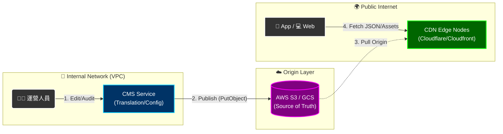

# 08-05 多語言與本地化系統 (Localization System)

## 📌 文檔導航

本文檔已拆分為 **4 個專項子文檔**，請根據需求選擇閱讀：

| 子文檔 | 主要內容 | 適用角色 |
|-------|---------|---------|
| **[08-05-01 i18n 架構與服務設計](./08-05-01_i18n_Architecture.md)** | 翻譯服務架構、CDN分發、RTL支援、效能優化 | 架構師、後端開發 |
| **[08-05-02 動態內容本地化](./08-05-02_Dynamic_Content_L10n.md)** | JSONB多語言字段、API響應策略、CMS整合、Email/SMS模板 | 後端開發、數據庫工程師 |
| **[08-05-03 翻譯工作流](./08-05-03_Translation_Workflow.md)** | 缺失鍵值捕獲、批量導入導出、翻譯狀態機、Crowdin整合 | 產品經理、運營人員 |
| **[08-05-04 API規格與監控](./08-05-04_API_Specification.md)** | 完整API文檔、限流策略、Prometheus監控、SLA指標 | 後端開發、DevOps |

---

## 1. 系統概述

隨著平台拓展至東南亞（TH, VN, ID）與拉美（BR, MX）市場，硬編碼的文字（Hardcoded Strings）已成為阻礙。本系統定義了 **全平台國際化（i18n）** 與 **本地化（L10n）** 的標準實作架構，涵蓋：

- **靜態翻譯**：UI 按鈕、菜單、提示文字（通過 CDN 分發 JSON）
- **動態內容**：活動標題、遊戲描述、Banner 文案（資料庫 JSONB 存儲）
- **模板系統**：Email/SMS 通知模板（多語言變量替換）
- **工作流程**：翻譯狀態管理、審核發佈、Crowdin 整合

---

## 2. 核心架構

### 2.1 翻譯鍵值管理

**所有前端展示的文字不得直接寫死，必須使用 Translation Keys**。

**Namespace 結構**：`module.component.key`

**範例**：
- `common.button.submit` → "Submit" / "提交" / "ส่ง"
- `game.slot.freespin_won` → "You won {amount} Free Spins!" / "您贏得了 {amount} 次免費旋轉！"
- `error.wallet.insufficient` → "Insufficient balance." / "餘額不足"

### 2.2 服務架構圖



**工作流程**：
1. 運營人員在 CMS 後台編輯/審核翻譯
2. 發佈後推送至 S3/GCS（Source of Truth）
3. CDN 從源站拉取最新版本
4. 前端應用從 CDN 獲取翻譯 JSON 檔案

**詳細內容請參閱**：[08-05-01 i18n 架構與服務設計](./08-05-01_i18n_Architecture.md)

---

## 3. 動態內容本地化

### 3.1 資料庫設計（JSONB）

對於資料庫中的動態內容（如遊戲名稱、活動標題），採用 **PostgreSQL JSONB** 存儲多語言版本。

**範例**：

### 3.2 API 響應策略

**後端根據用戶語言偏好自動提取對應語言**：

**Option A**（推薦用於移動應用）：
```json
GET /api/v1/promotions?lang=zh-TW

Response:
{
  "promotion_id": 123,
  "title": "歡迎禮金",  // 直接返回繁體中文
  "description": "首次存款獲得100%配對紅利..."
}
```

**Option B**（推薦用於 CMS 後台）：
```json
GET /api/v1/promotions/123?include_all_languages=true

Response:
{
  "promotion_id": 123,
  "title": {
    "en": "Welcome Bonus",
    "zh-TW": "歡迎禮金",
    "th": "โบนัสต้อนรับ"
  }
}
```

**詳細內容請參閱**：[08-05-02 動態內容本地化](./08-05-02_Dynamic_Content_L10n.md)

---

## 4. 翻譯工作流

### 4.1 缺失鍵值自動捕獲

**當前端請求一個不存在的翻譯鍵值時**：
1. 前端顯示 Fallback 文字（通常為英文）
2. 自動上報至後端的 `missing_translation_keys` 表
3. CMS 後台顯示「缺失翻譯列表」，提醒運營補充

### 4.2 翻譯狀態機

```
Draft (草稿) → In Review (審核中) → Approved (已批准) → Published (已發佈)
```javascript

| 狀態 | 說明 | 可執行操作 |
|------|------|-----------|
| **draft** | 翻譯人員正在編輯 | 編輯、提交審核 |
| **in_review** | 等待審核員審核 | 批准、拒絕、標記 |
| **approved** | 已批准，等待發佈 | 發佈至 CDN |
| **published** | 已發佈，玩家可見 | 歸檔 |

### 4.3 Crowdin 整合

**自動化翻譯工作流**：
1. 缺失鍵值自動推送至 Crowdin 平台
2. 專業譯者在 Crowdin 完成翻譯
3. Webhook 通知平台翻譯完成
4. 系統自動拉取並發佈至 CDN

**詳細內容請參閱**：[08-05-03 翻譯工作流](./08-05-03_Translation_Workflow.md)

---

## 5. API 規格

### 5.1 核心端點

| 方法 | 端點 | 說明 |
|------|------|------|
| **GET** | `/api/v1/i18n/translations` | 獲取翻譯列表 |
| **POST** | `/api/v1/i18n/translations` | 創建新翻譯 |
| **PUT** | `/api/v1/i18n/translations/{key}` | 更新翻譯 |
| **POST** | `/api/v1/i18n/translations/batch` | 批量導入 |
| **GET** | `/api/v1/i18n/export` | 導出（JSON/CSV/XLIFF）|
| **POST** | `/api/v1/i18n/translations/{key}/publish` | 發佈至 CDN |

### 5.2 監控指標

| 指標 | 目標值 | Alert 閾值 |
|------|--------|-----------|
| API Response Time (P99) | < 50ms | > 200ms |
| Cache Hit Rate | > 95% | < 85% |
| Translation Coverage | 100% | < 95% |
| Missing Key Rate | 0% | > 1% |

**詳細內容請參閱**：[08-05-04 API規格與監控](./08-05-04_API_Specification.md)

---

## 6. 支援語言清單

| 語言代碼 | 語言名稱 | 市場 | RTL | 優先級 |
|---------|---------|------|-----|--------|
| `en` | English | Global | ❌ | P0 |
| `zh-TW` | 繁體中文 | 台灣、香港 | ❌ | P0 |
| `zh-CN` | 簡體中文 | 中國、新加坡 | ❌ | P0 |
| `th` | ไทย | 泰國 | ❌ | P1 |
| `vi` | Tiếng Việt | 越南 | ❌ | P1 |
| `id` | Bahasa | 印尼 | ❌ | P1 |
| `pt-BR` | Português | 巴西 | ❌ | P1 |
| `ar` | العربية | 中東 | ✅ | P2 |
| `he` | עברית | 以色列 | ✅ | P2 |

**RTL（Right-to-Left）語言支援**：詳見 [08-05-01 §4 RTL語言支援](./08-05-01_i18n_Architecture.md#4-rtl-語言支援-right-to-left-support)

---

## 7. 快速開始指南

### 7.1 前端整合（React + i18next）

```bash
npm install i18next react-i18next
```

```javascript
import i18next from 'i18next';
import { initReactI18next, useTranslation } from 'react-i18next';

// 初始化 i18next
i18next
  .use(initReactI18next)
  .init({
    lng: 'zh-TW',
    resources: {
      'zh-TW': {
        common: require('./locales/zh-TW/common.json'),
        game: require('./locales/zh-TW/game.json')
      }
    }
  });

// 在組件中使用
function MyComponent() {
  const { t } = useTranslation();
  return <button>{t('common.button.submit')}</button>;
}
```

### 7.2 後端實現（Python + FastAPI）


---

## 8. 實施路線圖

### Phase 1: 基礎建設（Week 1-2）
- [ ] 建立 PostgreSQL `translations` 表
- [ ] 實作 API: GET /i18n/translations
- [ ] 整合 Redis 快取層
- [ ] Frontend 整合 i18next

### Phase 2: 管理後台（Week 3-4）
- [ ] 建立翻譯管理 UI（React Admin）
- [ ] 實作批次上傳（CSV/JSON）
- [ ] 線上編輯器
- [ ] 版本控制與回滾

### Phase 3: 工作流程（Week 5-6）
- [ ] 翻譯狀態機（draft → in_review → approved）
- [ ] 權限控制（Translator/Reviewer/Admin）
- [ ] Crowdin 整合
- [ ] Missing Key 自動偵測

### Phase 4: 優化與擴展（Week 7-8）
- [ ] CDN 分發（CloudFront/Akamai）
- [ ] RTL 語言支援（Arabic, Hebrew）
- [ ] CMS 動態內容多語化
- [ ] 監控與 Alert 設定

**預計總工時**：6-8 週

---

## 📚 相關文檔

### 系列文檔（子文檔）
- [08-05-01 i18n 架構與服務設計](./08-05-01_i18n_Architecture.md) - 翻譯服務架構、CDN分發、RTL支援
- [08-05-02 動態內容本地化](./08-05-02_Dynamic_Content_L10n.md) - JSONB多語言字段、API響應策略
- [08-05-03 翻譯工作流](./08-05-03_Translation_Workflow.md) - 狀態機、Crowdin整合、批量導入導出
- [08-05-04 API規格與監控](./08-05-04_API_Specification.md) - 完整API文檔、限流、監控指標

### 業務邏輯參考
- [08-01 前端佈局引擎](./08-01_Frontend_Layout_Engine.md) - UI 元素整合
- [08-02 Banner 管理](./08-02_Banner_&_Announcement.md) - 動態內容多語言
- [04-01 活動系統設計](../04_Activity_Center/04-01_Activity_System_Design.md) - 活動多語言內容
- [11-01 客服中台設計](../11_Customer_Service/11-01_CS_Platform_Design.md) - 通知模板本地化

### 技術架構參考
- [12-05 API 設計標準](../12_Technical_Operations/12-05_API_Design_Standard.md) - API 規範
- [09-02 審計日誌系統](../09_System_Security/09-02_Audit_Log_System.md) - 翻譯變更審計
- [07-03 通知架構](../07_Platform_Management/07-03_Notification_Architecture.md) - 多渠道通知整合

### 參考資料
- [i18next Documentation](https://www.i18next.com/)
- [Crowdin API](https://developer.crowdin.com/api/v2/)
- [W3C i18n Best Practices](https://www.w3.org/International/)
- [CLDR - Unicode Common Locale Data Repository](http://cldr.unicode.org/)

---

**文檔版本**: 2.0.0（拆分版）
**最後更新**: 2026-01-27
**維護團隊**: Frontend Team & Product Team
