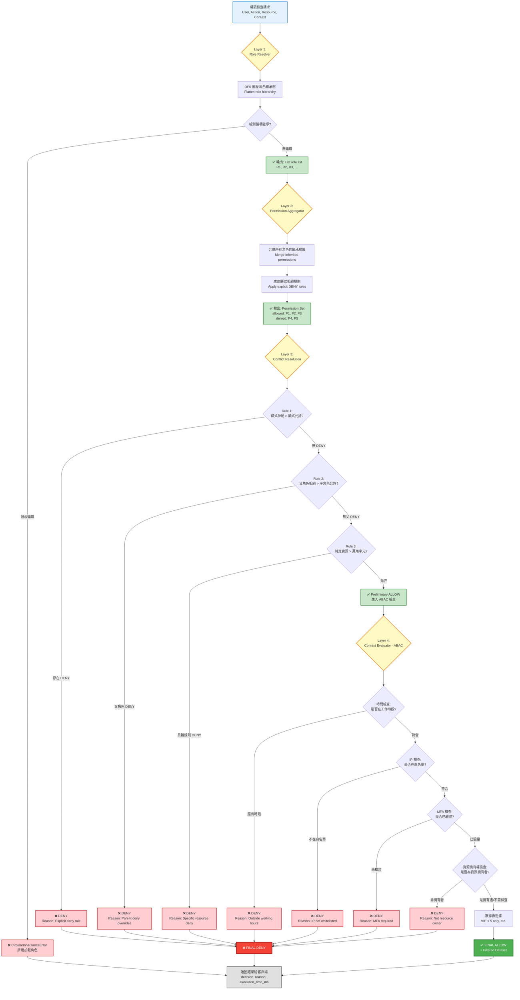
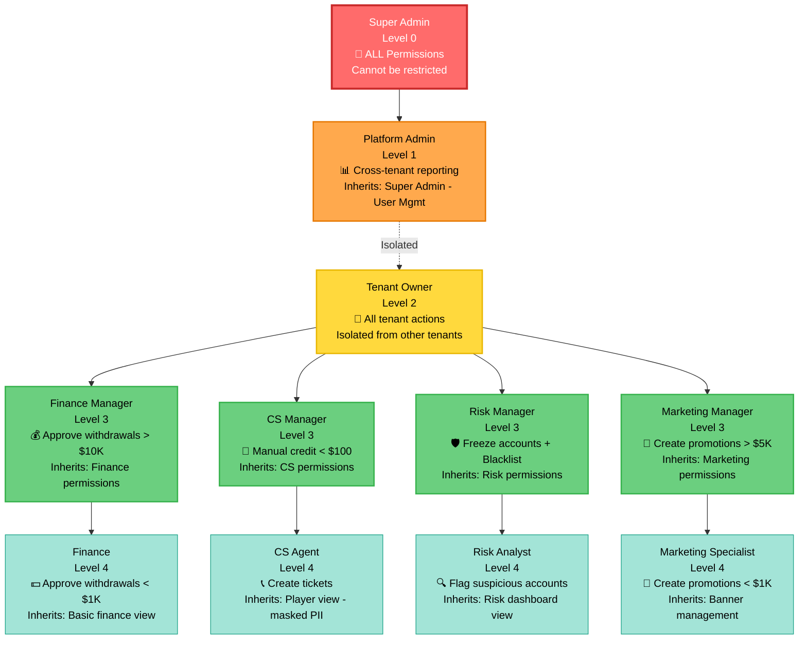
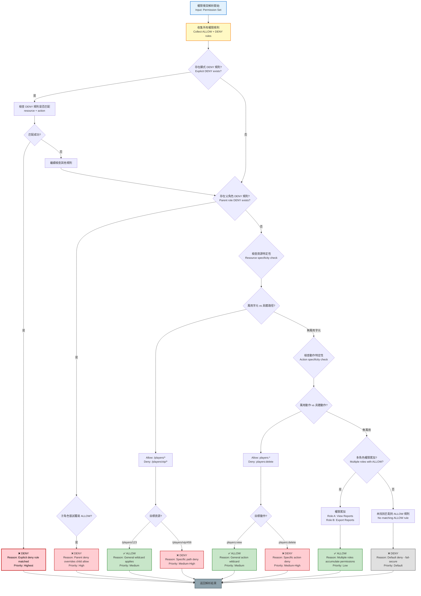

# 09-01 管理員權限系統 (Admin RBAC)

## 1. 系統概述
基於 **RBAC (Role-Based Access Control)** 模型設計，嚴格控制後台人員的數據訪問權限。
需區分 **平台管理員 (Platform Admin)** 與 **商戶管理員 (Tenant Admin)**。

## 2. 角色與權限

### 2.1 預設角色 (Default Roles)
- **Super Admin**：
  - 平台神級帳號，擁有所有權限。
  - 僅限 CTO 或核心運維持有。
  - **初始化**: 系統首次啟動時由 `Seed Job` 自動創建 (參見 `12-01_Deployment_Architecture` Section 5.1)，密碼由 K8s Secret 注入。
- **Tenant Owner**：
  - 商戶最高權限，可創建該商戶下的子帳號。
- **客服 (CS)**：需屏蔽玩家手機號/Email (脫敏顯示，如 0912***789)。
- **財務 (Finance)**：可操作出款審核，可查看報表。
- **運營 (Operation)**：可配置活動、Banner。
- **自定义角色 (Custom Roles)**：
  - 商戶預設只能使用上述標準模板。
  - 若需新增特殊角色 (如 "高級財務審核")，需由商戶 Admin 定義權限集合，並提交 **Platform Admin** 審核通過後方可使用，防止權限濫用。

### 2.2 權限粒度 (Granularity)
- **菜單級**：是否可見 "財務報表" 菜單。
- **按鈕級**：是否可見 "通過審核" 按鈕。
- **數據級**：
  - 只能看 "自己創建的代理"。
  - 只能看 "自己創建的代理"。
  - 只能看 "VIP 等級 < 5" 的玩家。

### 2.3 敏感操作授權 (Action-Based Permissions)
針對高風險指令，需定義獨立的授權規則，不應默認包含在角色中。
- **補單 (Manual Credit)**:
  - `< $100`: 客服組長 (CS Lead) 可執行。
  - `> $100`: 需財務經理 (Finance Manager) 審批。
- **踢線 (Kickout) / 凍結 (Freeze)**:
  - 需風控專員 (Risk Specialist) 執行，普通客服僅能 "申請"。
- **解鎖 (Unlock)**:
  - 需二級驗證 (如：電話確認本人) 後，由客服組長執行。


## 3. 安全機制
- **MFA 強制**：後台登入必須綁定 Google Authenticator。
- **IP 限制**：僅允許特定辦公室 IP 訪問後台。
- **Session 管理**：閒置 15 分鐘自動登出；單一帳號禁止多地登入 (互踢)。

## 4. 審批
- **權限變更**：
  - 為某個員工帳號 "新增權限" (如由客服升級為財務)，需主管審批。

---

## 5. 動態權限評估引擎 (Dynamic Permission Evaluation Engine)

### 5.1 架構總覽

##### 📊 Diagram 2: 權限評估引擎完整流程 (Permission Evaluation Engine Flow)



**流程說明**:

| Layer | 目的 | 輸入 | 輸出 | 失敗情況 |
|-------|------|------|------|----------|
| **Layer 1: Role Resolver** | 展開角色繼承樹 | User roles | Flat role list | 循環繼承檢測失敗 |
| **Layer 2: Permission Aggregator** | 聚合所有權限 | Role list | Permission set (allow + deny) | 無（總是成功） |
| **Layer 3: Conflict Resolution** | 解決權限衝突 | Permission set | Preliminary ALLOW/DENY | 顯式拒絕 / 父角色拒絕 / 特定資源拒絕 |
| **Layer 4: Context Evaluator (ABAC)** | 驗證上下文條件 | Preliminary ALLOW + Context | FINAL ALLOW/DENY + Filtered data | 時間/IP/MFA/擁有權檢查失敗 |

**效能優化**:
- **Layer 1-3** 可快取（TTL=10min），適用於重複檢查相同 `(user, action, resource)` 組合
- **Layer 4** 不可快取（動態上下文：時間、IP 會變化）
- **批次檢查**: 對相同 user 的多個權限檢查，Layer 1-2 只需執行一次

### 5.2 角色繼承圖 (Role Inheritance Graph)

#### 5.2.1 繼承關係定義

##### 📊 Diagram 1: 角色繼承層級結構 (Role Inheritance Hierarchy)



**圖表說明**:
- **實線箭頭** (→): 繼承關係（子角色繼承父角色的所有權限）
- **虛線箭頭** (-.->): 隔離邊界（Tenant Owner 不繼承 Platform Admin）
- **顏色編碼**:
  - 🔴 Red (Super Admin): 最高權限，不可限制
  - 🟠 Orange (Platform Admin): 平台級管理
  - 🟡 Yellow (Tenant Owner): 租戶級最高權限
  - 🟢 Green (L3 Managers): 部門經理角色
  - 🔵 Light Blue (L4 Staff): 基層員工角色

**權限傳遞範例**:
1. **CS Agent** (Level 4) 繼承層級: `CS Manager → Tenant Owner (isolated)`
2. **Finance** (Level 4) 繼承層級: `Finance Manager → Tenant Owner (isolated)`
3. **Super Admin** 可執行所有操作，包括跨租戶操作
4. **Platform Admin** 僅限平台級操作，無法干預租戶內部業務

#### 5.2.2 繼承規則 (Inheritance Rules)

| 規則 | 說明 | 範例 |
|---|---|---|
| **傳遞繼承** | 子角色繼承父角色的所有權限 | CS Agent 繼承 CS Manager 的 View Player 權限 |
| **累加繼承** | 可擁有多個父角色 (多重繼承) | "Compliance Officer" 可同時繼承 Finance + Risk |
| **覆寫繼承** | 子角色可覆寫父角色的特定權限 | Finance 可 "View Reports"，但子角色可設為 Deny |
| **循環檢測** | 禁止 A → B → C → A 的循環繼承 | 啟動時檢測，發現則拒絕加載角色 |

#### 5.2.3 循環檢測演算法


### 5.3 權限衝突矩陣 (Permission Conflict Resolution Matrix)

#### 5.3.1 衝突場景與解析策略

| 場景 | 角色 A 權限 | 角色 B 權限 | 解析結果 | 理由 |
|---|---|---|---|---|
| **明確拒絕優先** | Allow: View Players | Deny: View Players | **DENY** | 安全優先原則 |
| **父角色拒絕** | (Parent) Deny: Edit VIP | (Child) Allow: Edit VIP | **DENY** | 父角色決策優先 |
| **資源特定性** | Allow: `/players/*` | Deny: `/players/vip/*` | /players/123: **ALLOW**<br>/players/vip/456: **DENY** | 更具體的規則優先 |
| **動作特定性** | Allow: `players:*` | Deny: `players:delete` | Read: **ALLOW**<br>Delete: **DENY** | 細粒度規則優先 |
| **多角色累加** | Allow: View Reports | Allow: Export Reports | **ALLOW (Both)** | 無衝突時累加 |

##### 📊 Diagram 3: 權限衝突解析決策樹 (Permission Conflict Resolution Decision Tree)



**衝突解析優先級 (Priority Levels)**:

| 優先級 | 規則類型 | 場景 | 決策 |
|--------|----------|------|------|
| **P0 - Highest** | 顯式拒絕 (Explicit DENY) | 任何角色有 DENY 規則且匹配 | ❌ DENY |
| **P1 - High** | 父角色拒絕 (Parent DENY) | 父角色 DENY，子角色嘗試 ALLOW | ❌ DENY |
| **P2 - Medium-High** | 特定資源拒絕 (Specific Resource DENY) | `/players/vip/*` DENY > `/players/*` ALLOW | ❌ DENY (for specific path) |
| **P2 - Medium-High** | 特定動作拒絕 (Specific Action DENY) | `players:delete` DENY > `players:*` ALLOW | ❌ DENY (for specific action) |
| **P3 - Medium** | 一般萬用字元允許 (General Wildcard ALLOW) | `/players/*` ALLOW (非 VIP 路徑) | ✅ ALLOW |
| **P4 - Low** | 多角色累加 (Multi-role Accumulation) | 無衝突時累加權限 | ✅ ALLOW (both) |
| **P5 - Default** | 預設拒絕 (Default DENY) | 無匹配 ALLOW 規則 | ❌ DENY (fail-secure) |

**範例解析過程**:

**場景 1: 顯式拒絕優先**
```
User roles: [Finance, CS Manager]
Finance: ALLOW players:view
CS Manager: DENY players:view

Resolution:
1. 發現 DENY 規則 (CS Manager)
2. 檢查匹配: players:view ✓
3. 結果: ❌ DENY (Explicit deny rule matched)
```

**場景 2: 資源特定性**
```
User roles: [Marketing]
Marketing:
  - ALLOW /players/*
  - DENY /players/vip/*

Request: GET /players/vip/123

Resolution:
1. 無顯式 DENY (針對所有 players)
2. 檢查資源特定性: /players/vip/* 更具體
3. 結果: ❌ DENY (Specific path deny)

Request: GET /players/456

Resolution:
1. 匹配 ALLOW /players/*
2. 不匹配 DENY /players/vip/*
3. 結果: ✅ ALLOW (General wildcard applies)
```

**場景 3: 預設拒絕**
```
User roles: [Guest]
Guest: (no permissions)

Request: POST /withdrawals/approve

Resolution:
1. 無 DENY 規則
2. 無 ALLOW 規則
3. 結果: ❌ DENY (Default deny - fail-secure)
```

#### 5.3.2 解析引擎實作

```javascript
function resolvePermissionConflict(permissions) {
  // Step 1: Collect all DENY rules
  const denyRules = permissions.filter(p => p.effect === 'DENY');
  const allowRules = permissions.filter(p => p.effect === 'ALLOW');

  // Step 2: Check for explicit DENY (highest priority)
  for (const deny of denyRules) {
    if (matchesResource(deny.resource, targetResource) &&
        matchesAction(deny.action, targetAction)) {
      return { decision: 'DENY', reason: 'Explicit deny rule matched' };
    }
  }

  // Step 3: Check for ALLOW rules
  for (const allow of allowRules) {
    if (matchesResource(allow.resource, targetResource) &&
        matchesAction(allow.action, targetAction)) {
      return { decision: 'ALLOW', reason: 'Allow rule matched' };
    }
  }

  // Step 4: Default DENY (fail-secure)
  return { decision: 'DENY', reason: 'No matching allow rule (default deny)' };
}

function matchesResource(pattern, target) {
  // Convert wildcard to regex: "/players/*" → /^\/players\/.+$/
  const regex = new RegExp('^' + pattern.replace(/\*/g, '.+') + '$');
  return regex.test(target);
}
```

### 5.4 ABAC 上下文屬性 (Attribute-Based Access Control Context)

#### 5.4.1 上下文屬性清單

| 類別 | 屬性 | 資料型態 | 範例 | 用途 |
|---|---|---|---|---|
| **時間** | `current_time` | DateTime | 2026-01-27 14:30 | 限制工作時段存取 |
| **時間** | `day_of_week` | String | "Monday" | 禁止週末修改配置 |
| **網路** | `source_ip` | IP Address | 192.168.1.100 | IP 白名單驗證 |
| **網路** | `geolocation` | Country Code | "TW" | 阻擋特定國家存取 |
| **身份** | `user_department` | String | "Finance" | 部門隔離 |
| **身份** | `employment_status` | Enum | ACTIVE | 離職員工自動撤銷 |
| **資源** | `resource_owner` | User ID | 12345 | 只能編輯自己創建的資源 |
| **資源** | `resource_sensitivity` | Enum | HIGH | 高敏感資料需額外驗證 |
| **請求** | `request_source` | Enum | WEB, API, CLI | CLI 操作需雙因素驗證 |
| **請求** | `mfa_verified` | Boolean | true | MFA 驗證狀態 |

#### 5.4.2 ABAC Policy 範例

```json
{
  "policy_id": "finance_working_hours_only",
  "description": "Finance team can only approve withdrawals during working hours",
  "effect": "ALLOW",
  "principals": ["role:Finance", "role:Finance Manager"],
  "actions": ["withdrawals:approve"],
  "resources": ["/api/v1/withdrawals/*"],
  "conditions": {
    "time_range": {
      "start": "09:00",
      "end": "18:00",
      "timezone": "Asia/Taipei"
    },
    "day_of_week": ["Monday", "Tuesday", "Wednesday", "Thursday", "Friday"],
    "ip_whitelist": ["192.168.1.0/24", "10.0.0.0/16"],
    "mfa_required": true
  }
}
```

#### 5.4.3 動態上下文評估引擎

##### 📊 Diagram 4: ABAC 條件評估決策流程 (ABAC Condition Evaluation Flow)

```mermaid
flowchart TD
    START[ABAC 條件評估開始<br/>Input: Policy + Request Context] --> LOAD[載入 Policy Conditions<br/>time_range, ip_whitelist, mfa_required, etc.]

    LOAD --> CHECK_TIME{條件: time_range?}

    CHECK_TIME -->|無此條件| CHECK_DAY
    CHECK_TIME -->|有| TIME_PARSE[解析時間範圍<br/>start: 09:00, end: 18:00, timezone: Asia/Taipei]

    TIME_PARSE --> TIME_VALIDATE{當前時間在範圍內?<br/>09:00 <= current <= 18:00}
    TIME_VALIDATE -->|否| DENY_TIME[❌ DENY<br/>Reason: Outside working hours<br/>Current: 20:30, Required: 09:00-18:00]
    TIME_VALIDATE -->|是| CHECK_DAY

    CHECK_DAY{條件: day_of_week?}
    CHECK_DAY -->|無此條件| CHECK_IP
    CHECK_DAY -->|有| DAY_VALIDATE{當前星期在允許清單?<br/>Mon-Fri only}
    DAY_VALIDATE -->|否 - Saturday/Sunday| DENY_DAY[❌ DENY<br/>Reason: Weekend restriction<br/>Current: Saturday, Required: Mon-Fri]
    DAY_VALIDATE -->|是| CHECK_IP

    CHECK_IP{條件: ip_whitelist?}
    CHECK_IP -->|無此條件| CHECK_GEO
    CHECK_IP -->|有| IP_PARSE[解析 IP 白名單<br/>192.168.1.0/24, 10.0.0.0/16]

    IP_PARSE --> IP_VALIDATE{來源 IP 在白名單?}
    IP_VALIDATE -->|否| DENY_IP[❌ DENY<br/>Reason: IP not in whitelist<br/>Source: 123.45.67.89<br/>Allowed: 192.168.1.0/24, 10.0.0.0/16]
    IP_VALIDATE -->|是| CHECK_GEO

    CHECK_GEO{條件: geolocation?}
    CHECK_GEO -->|無此條件| CHECK_MFA
    CHECK_GEO -->|有| GEO_VALIDATE{國家/地區在允許清單?<br/>TW, JP, SG only}
    GEO_VALIDATE -->|否 - Blocked country| DENY_GEO[❌ DENY<br/>Reason: Geolocation restricted<br/>Current: CN, Allowed: TW, JP, SG]
    GEO_VALIDATE -->|是| CHECK_MFA

    CHECK_MFA{條件: mfa_required?}
    CHECK_MFA -->|無此條件| CHECK_OWNERSHIP
    CHECK_MFA -->|有| MFA_VALIDATE{MFA 已驗證?<br/>mfa_verified == true}
    MFA_VALIDATE -->|否| DENY_MFA[❌ DENY<br/>Reason: MFA verification required<br/>User must complete 2FA]
    MFA_VALIDATE -->|是| CHECK_OWNERSHIP

    CHECK_OWNERSHIP{條件: require_ownership?}
    CHECK_OWNERSHIP -->|無此條件| CHECK_DEPT
    CHECK_OWNERSHIP -->|有| OWNERSHIP_VALIDATE{用戶是資源擁有者?<br/>user_id == resource_owner}
    OWNERSHIP_VALIDATE -->|否| DENY_OWNERSHIP[❌ DENY<br/>Reason: Not resource owner<br/>Owner: 12345, Current user: 67890]
    OWNERSHIP_VALIDATE -->|是| CHECK_DEPT

    CHECK_DEPT{條件: department?}
    CHECK_DEPT -->|無此條件| CHECK_EMPLOYMENT
    CHECK_DEPT -->|有| DEPT_VALIDATE{用戶部門匹配?<br/>user_department in allowed_departments}
    DEPT_VALIDATE -->|否| DENY_DEPT[❌ DENY<br/>Reason: Department restriction<br/>User: Marketing, Required: Finance]
    DEPT_VALIDATE -->|是| CHECK_EMPLOYMENT

    CHECK_EMPLOYMENT{條件: employment_status?}
    CHECK_EMPLOYMENT -->|無此條件| CHECK_SOURCE
    CHECK_EMPLOYMENT -->|有| EMPLOYMENT_VALIDATE{員工狀態為 ACTIVE?<br/>employment_status == ACTIVE}
    EMPLOYMENT_VALIDATE -->|否 - TERMINATED/SUSPENDED| DENY_EMPLOYMENT[❌ DENY<br/>Reason: Employee not active<br/>Status: TERMINATED]
    EMPLOYMENT_VALIDATE -->|是| CHECK_SOURCE

    CHECK_SOURCE{條件: request_source?}
    CHECK_SOURCE -->|無此條件| CHECK_SENSITIVITY
    CHECK_SOURCE -->|有| SOURCE_VALIDATE{請求來源符合要求?<br/>CLI requires MFA, WEB allows}
    SOURCE_VALIDATE -->|否| DENY_SOURCE[❌ DENY<br/>Reason: Request source not allowed<br/>Source: CLI, MFA: false]
    SOURCE_VALIDATE -->|是| CHECK_SENSITIVITY

    CHECK_SENSITIVITY{條件: resource_sensitivity?}
    CHECK_SENSITIVITY -->|無此條件| ALL_PASSED
    CHECK_SENSITIVITY -->|有| SENSITIVITY_VALIDATE{資源敏感度檢查?<br/>HIGH sensitivity requires additional auth}
    SENSITIVITY_VALIDATE -->|失敗| DENY_SENSITIVITY[❌ DENY<br/>Reason: High sensitivity resource<br/>Additional authorization required]
    SENSITIVITY_VALIDATE -->|通過| ALL_PASSED

    ALL_PASSED[✅ 所有條件通過<br/>All conditions satisfied] --> SUCCESS[✅ ALLOW<br/>Reason: All ABAC conditions met<br/>Proceed to final authorization]

    DENY_TIME --> END[返回評估結果<br/>allowed: false + reason]
    DENY_DAY --> END
    DENY_IP --> END
    DENY_GEO --> END
    DENY_MFA --> END
    DENY_OWNERSHIP --> END
    DENY_DEPT --> END
    DENY_EMPLOYMENT --> END
    DENY_SOURCE --> END
    DENY_SENSITIVITY --> END
    SUCCESS --> END

    style START fill:#E3F2FD,stroke:#1976D2,stroke-width:2px
    style LOAD fill:#FFF9C4,stroke:#F57F17,stroke-width:2px

    style DENY_TIME fill:#FFCDD2,stroke:#C62828,stroke-width:2px
    style DENY_DAY fill:#FFCDD2,stroke:#C62828,stroke-width:2px
    style DENY_IP fill:#FFCDD2,stroke:#C62828,stroke-width:2px
    style DENY_GEO fill:#FFCDD2,stroke:#C62828,stroke-width:2px
    style DENY_MFA fill:#FFCDD2,stroke:#C62828,stroke-width:2px
    style DENY_OWNERSHIP fill:#FFCDD2,stroke:#C62828,stroke-width:2px
    style DENY_DEPT fill:#FFCDD2,stroke:#C62828,stroke-width:2px
    style DENY_EMPLOYMENT fill:#FFCDD2,stroke:#C62828,stroke-width:2px
    style DENY_SOURCE fill:#FFCDD2,stroke:#C62828,stroke-width:2px
    style DENY_SENSITIVITY fill:#FFCDD2,stroke:#C62828,stroke-width:2px

    style ALL_PASSED fill:#C8E6C9,stroke:#388E3C,stroke-width:2px
    style SUCCESS fill:#4CAF50,stroke:#1B5E20,stroke-width:3px,color:#FFF

    style END fill:#90A4AE,stroke:#455A64,stroke-width:2px
```



**ABAC 條件類型與範例**:

| 類別 | 條件名稱 | 檢查內容 | 失敗原因 | 範例場景 |
|------|----------|----------|----------|----------|
| **時間** | `time_range` | 當前時間是否在工作時段 (09:00-18:00) | Outside working hours | 財務審批只能在工作時間進行 |
| **時間** | `day_of_week` | 當前星期是否為工作日 (Mon-Fri) | Weekend restriction | 禁止週末修改系統配置 |
| **網路** | `ip_whitelist` | 來源 IP 是否在白名單 (192.168.1.0/24) | IP not in whitelist | 限制辦公室 IP 訪問後台 |
| **網路** | `geolocation` | 國家/地區是否允許 (TW, JP, SG) | Geolocation restricted | 阻擋特定國家訪問 |
| **身份驗證** | `mfa_required` | MFA 是否已驗證 | MFA verification required | 高風險操作需雙因素驗證 |
| **資源** | `require_ownership` | 用戶是否為資源擁有者 | Not resource owner | 只能編輯自己創建的資源 |
| **組織** | `department` | 用戶部門是否匹配 (Finance) | Department restriction | 財務報表只能財務部查看 |
| **狀態** | `employment_status` | 員工狀態是否為 ACTIVE | Employee not active | 離職員工自動撤銷權限 |
| **來源** | `request_source` | 請求來源 (WEB/API/CLI) | Request source not allowed | CLI 操作需額外驗證 |
| **敏感度** | `resource_sensitivity` | 資源敏感度等級 (HIGH) | High sensitivity resource | 高敏感資料需額外授權 |

**實際評估範例**:

**場景 1: 財務審批提款（週末被拒絕）**
```json
{
  "user_id": 12345,
  "action": "withdrawals:approve",
  "context": {
    "current_time": "2026-01-25T14:30:00Z",  // Saturday
    "day_of_week": "Saturday",
    "source_ip": "192.168.1.100",
    "mfa_verified": true
  }
}

評估結果:
✅ time_range: 14:30 in 09:00-18:00
❌ day_of_week: Saturday not in [Mon-Fri]
結果: ❌ DENY (Reason: Weekend restriction)
```

**場景 2: 非辦公室 IP 訪問（被拒絕）**
```json
{
  "user_id": 67890,
  "action": "players:view",
  "context": {
    "current_time": "2026-01-27T10:00:00Z",  // Monday
    "day_of_week": "Monday",
    "source_ip": "123.45.67.89",  // Public IP
    "mfa_verified": true
  }
}

評估結果:
✅ time_range: 10:00 in 09:00-18:00
✅ day_of_week: Monday in [Mon-Fri]
❌ ip_whitelist: 123.45.67.89 not in [192.168.1.0/24, 10.0.0.0/16]
結果: ❌ DENY (Reason: IP not in whitelist)
```

**場景 3: 所有條件通過**
```json
{
  "user_id": 11111,
  "action": "reports:export",
  "context": {
    "current_time": "2026-01-27T15:00:00Z",  // Monday
    "day_of_week": "Monday",
    "source_ip": "192.168.1.50",
    "mfa_verified": true,
    "user_department": "Finance",
    "employment_status": "ACTIVE"
  }
}

評估結果:
✅ time_range: 15:00 in 09:00-18:00
✅ day_of_week: Monday in [Mon-Fri]
✅ ip_whitelist: 192.168.1.50 in [192.168.1.0/24]
✅ mfa_required: true
✅ department: Finance matches
✅ employment_status: ACTIVE
結果: ✅ ALLOW (All conditions satisfied)
```

**Python 實作參考**:


### 5.5 Session 管理策略 (Session Management)

#### 5.5.1 Session 配置參數

| 參數 | 預設值 | 範圍 | 說明 |
|---|---|---|---|
| `idle_timeout` | 15 分鐘 | 5-60 分鐘 | 閒置超時自動登出 |
| `absolute_timeout` | 8 小時 | 1-24 小時 | 絕對超時 (防止長期 session) |
| `max_concurrent_sessions` | 1 | 1-3 | 單一帳號最大並發 session 數 |
| `session_binding` | IP + User-Agent | - | Session 綁定策略 |
| `remember_me_duration` | 禁用 | - | 後台不支援 "記住我" |

#### 5.5.2 並發 Session 處理策略

| 策略 | 行為 | 適用角色 |
|---|---|---|
| **互踢模式** (Kick Previous) | 新登入踢掉舊 session | 所有角色 (預設) |
| **阻擋模式** (Block New) | 拒絕新登入請求 | Super Admin (防止帳號被盜) |
| **多點模式** (Allow Multiple) | 允許最多 3 個 session | 客服 (需多螢幕工作) |

#### 5.5.3 Session 綁定與防劫持


#### 5.5.4 Session 存儲架構

```
[Session Storage Architecture]
┌──────────────────────────────────────────────────────────────┐
│  Redis (Primary Storage)                                     │
│  Key: session:{session_id}                                   │
│  TTL: 15 minutes (auto-extend on activity)                   │
│  Value: {                                                    │
│    user_id, roles, permissions, ip, user_agent, fingerprint  │
│  }                                                           │
├──────────────────────────────────────────────────────────────┤
│  PostgreSQL (Audit Trail)                                    │
│  Table: session_logs                                         │
│  Columns: session_id, user_id, login_time, logout_time,     │
│           ip, user_agent, logout_reason                      │
│  Retention: 90 days                                          │
└──────────────────────────────────────────────────────────────┘
```

### 5.6 API 規格 (Permission Check API)

#### 5.6.1 權限檢查接口

```
POST /api/v1/rbac/check-permission
Authorization: Bearer {admin_jwt}

Request Body:
{
  "user_id": 12345,
  "action": "withdrawals:approve",
  "resource": "/api/v1/withdrawals/wd-789012",
  "context": {
    "current_time": "2026-01-27T14:30:00Z",
    "source_ip": "192.168.1.100",
    "mfa_verified": true
  }
}

Response 200 OK (ALLOW):
{
  "decision": "ALLOW",
  "reason": "User has required permissions and meets all conditions",
  "evaluated_policies": [
    {
      "policy_id": "finance_approve_withdrawal",
      "effect": "ALLOW",
      "matched": true
    }
  ],
  "execution_time_ms": 15
}

Response 200 OK (DENY):
{
  "decision": "DENY",
  "reason": "Outside working hours (09:00-18:00 required)",
  "evaluated_policies": [
    {
      "policy_id": "finance_working_hours_only",
      "effect": "ALLOW",
      "matched": false,
      "failed_condition": "time_range"
    }
  ],
  "execution_time_ms": 12
}
```

#### 5.6.2 批次權限檢查 (效能優化)

```
POST /api/v1/rbac/batch-check
Authorization: Bearer {admin_jwt}

Request Body:
{
  "user_id": 12345,
  "checks": [
    {"action": "players:view", "resource": "/players/123"},
    {"action": "players:edit", "resource": "/players/123"},
    {"action": "withdrawals:approve", "resource": "/withdrawals/456"}
  ]
}

Response 200 OK:
{
  "results": [
    {"action": "players:view", "decision": "ALLOW"},
    {"action": "players:edit", "decision": "DENY", "reason": "Insufficient role"},
    {"action": "withdrawals:approve", "decision": "ALLOW"}
  ],
  "execution_time_ms": 25  // Batch processing faster than 3 individual calls
}
```

### 5.7 效能考量與優化

#### 5.7.1 快取策略

| 快取項目 | 存儲位置 | TTL | 更新策略 |
|---|---|---|---|
| 用戶角色清單 | Redis | 10 分鐘 | 角色變更時主動失效 |
| 權限評估結果 | Redis | 5 分鐘 | 權限配置變更時主動失效 |
| 角色繼承樹 | Memory (App) | 啟動載入 | 配置變更時重啟服務 |
| ABAC Policy | Memory (App) | 啟動載入 | 配置變更時熱重載 |

#### 5.7.2 性能基準

| 操作 | P99 延遲 | P50 延遲 | QPS 目標 |
|---|---|---|---|
| 簡單權限檢查 (無繼承) | < 5ms | < 2ms | 10,000+ |
| 複雜權限檢查 (3 層繼承) | < 20ms | < 8ms | 5,000+ |
| ABAC 條件評估 | < 30ms | < 12ms | 3,000+ |
| 批次檢查 (10 項) | < 50ms | < 25ms | 1,000+ |

### 5.8 審計日誌 (Permission Audit Trail)

#### 5.8.1 記錄範疇

所有權限檢查結果必須記錄至審計日誌：


#### 5.8.2 異常行為檢測


---

## 📚 相關文檔

### 核心依賴
- [07-01 系統層級架構](../07_Platform_Management/07-01_Hierarchy_Architecture.md) - 多租戶架構、層級設計
- [09-02 審計日誌系統](./09-02_Audit_Log_System.md) - 操作日誌記錄

### 業務整合
- [01-01 玩家賬戶系統](../01_Player_Center/01-01_Player_Account_System.md) - 玩家權限初始化
- [09-04 審批工作流系統](./09-04_Approval_Workflow_System.md) - 敏感操作審批

### 技術參考
- [09-03 數據安全標準](./09-03_Data_Security_Standard.md) - 權限數據加密
- [12-03 網關架構](../12_Technical_Operations/12-03_Gateway_Architecture.md) - API 權限驗證

### 延伸閱讀
- [07-02 租戶配置管理](../07_Platform_Management/07-02_Tenant_Configuration.md) - 商戶權限配置
- [11-01 客服平台設計](../11_Customer_Service/11-01_CS_Platform_Design.md) - 客服權限管理

---

**文件版本**: V2.0 (Enhanced)
**最後更新**: 2026-01-27
**狀態**: Architecture-Level Complete
**維護團隊**: Security Team

---

**文檔版本**: 1.0.0
**最後更新**: 2026-01-28
**維護團隊**: Security Team & Backend Team
