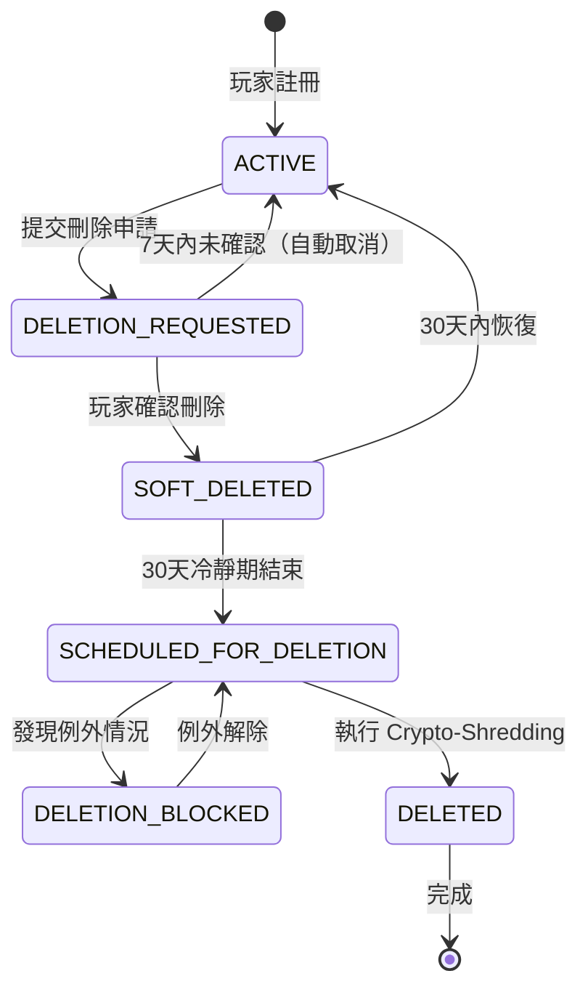

# 09-03-03 GDPR 數據刪除與 Crypto-Shredding (GDPR Data Deletion & Crypto-Shredding)

## 1. 系統概述

為符合 GDPR 第 17 條（Right to Erasure，數據遺忘權）與各國隱私法（CCPA, PDPA, LGPD），系統需支援 **物理刪除** 或 **不可恢復的匿名化**。由於資料庫備份是不可變的（Immutable），無法修改歷史備份中的 PII，因此採用 **Crypto-Shredding（加密粉碎）** 技術。

**核心原理**：透過銷毀加密金鑰，使加密數據永久不可恢復，等同於物理刪除。

---

## 2. 資料分類矩陣 (Data Retention Matrix)

### 2.1 法律依據分類

**並非所有資料都可刪除**，需依法規與業務需求分類：

| 資料類別 | 包含欄位 | GDPR 刪除義務 | 保留期限 | 處理方式 |
|---------|---------|--------------|---------|---------|
| **可完全刪除** | 玩家姓名、地址、偏好設定、行銷同意 | ✅ Yes | 無 | Physical Delete |
| **需匿名化** | 遊戲歷史（bet_id, game_id, amount）| ✅ Yes (anonymize) | 無 | Replace player_id with UUID |
| **必須保留（AML）** | 交易記錄（deposits, withdrawals）| ❌ No (legal obligation) | **5-7 years** | Retain with anonymized player_id |
| **必須保留（Tax）** | 獎金派彩記錄（winnings > threshold）| ❌ No (legal obligation) | **7 years** (varies by jurisdiction) | Retain with anonymized player_id |
| **必須保留（Dispute）** | 投訴工單（complaint_id, resolution）| ❌ No (legal claim) | **6 years** | Retain until claim expires |
| **必須保留（Ban）** | 違規記錄（fraud_flags, ban_reason）| ❌ No (legitimate interest) | **Permanent** | Retain for fraud prevention |

**法律依據（GDPR Art. 17(3) Exceptions）**：
- **(b) Compliance with legal obligation**：反洗錢（AML）、稅務報告
- **(e) Legal claims**：正在進行或潛在的訴訟
- **(f) Legitimate interests**：欺詐防護、帳號安全

### 2.2 關鍵例外情境

**暫停刪除的條件**：
| 情境 | 暫停理由 | 解除條件 | 最長保留期 |
|------|---------|---------|-----------|
| **帳號調查中** | Under Investigation（AML/Fraud）| 調查結束 | 最長 1 年 |
| **未結訴訟** | Pending Legal Case | 訴訟解決 | 最長 10 年 |
| **未完成流水** | Pending Wagering Requirement | 完成流水或放棄紅利 | 最長 90 天 |
| **未提領餘額** | Outstanding Balance > $0 | 餘額歸零 | 無限期（通知玩家）|
| **稅務查核** | Tax Audit Period | 查核結束 | 7 年 |

---

## 3. Crypto-Shredding 原理與實作

### 3.1 雙層加密架構

**設計原理**：使用 **Per-Player Data Encryption Key (DEK)** 加密 PII，DEK 本身由 **Master Key (KEK)** 加密。刪除玩家時，僅需銷毀 DEK，即可使所有 PII 永久不可恢復。

```
[Crypto-Shredding Architecture]
┌────────────────────────────────────────────────────────────┐
│  Key Hierarchy                                             │
│  ┌──────────────────────────────────────────────────────┐  │
│  │  Master Key (KEK - Key Encryption Key)              │  │
│  │  - Stored in AWS KMS / HashiCorp Vault              │  │
│  │  - Never leaves HSM                                  │  │
│  │  - Rotated annually                                 │  │
│  └──────────────────────────────────────────────────────┘  │
│                          ↓ Encrypts                        │
│  ┌──────────────────────────────────────────────────────┐  │
│  │  Per-Player DEK (Data Encryption Key)               │  │
│  │  - Unique AES-256 key for EACH player               │  │
│  │  - Stored in database (encrypted by KEK)            │  │
│  │  - Size: 32 bytes (256-bit)                         │  │
│  └──────────────────────────────────────────────────────┘  │
│                          ↓ Encrypts                        │
│  ┌──────────────────────────────────────────────────────┐  │
│  │  Player PII Data                                     │  │
│  │  - encrypted_name, encrypted_phone,                  │  │
│  │    encrypted_email, etc.                            │  │
│  │  - All encrypted with player's unique DEK          │  │
│  └──────────────────────────────────────────────────────┘  │
├────────────────────────────────────────────────────────────┤
│  Deletion Process (Crypto-Shredding)                      │
│  DELETE FROM user_keys WHERE player_id = ?                │
│  → DEK destroyed, all PII becomes unrecoverable           │
│  → Even with database backups, data cannot be decrypted   │
└────────────────────────────────────────────────────────────┘
```

**為何傳統刪除不夠？**
| 刪除方式 | 問題 | Crypto-Shredding 優勢 |
|---------|------|----------------------|
| `DELETE FROM players` | 資料庫備份仍存在明文/密文 | ✅ 備份中的密文永久不可恢復 |
| 軟刪除（`deleted_at`）| 資料仍可查詢（風險）| ✅ 金鑰銷毀後無法解密 |
| 覆寫刪除（`VACUUM FULL`）| 成本極高、耗時長 | ✅ 輕量操作（僅刪除金鑰）|

### 3.2 資料庫 Schema 設計

**金鑰管理表**：

**為何保留 Tombstone（墓碑記錄）？**
| 用途 | 說明 |
|------|------|
| **防止重複註冊** | 同一 email/phone 再次註冊會被拒絕（玩家可能嘗試套利）|
| **審計追蹤** | 證明已處理 GDPR 請求（合規證明）|
| **合規報告** | 每月刪除統計（向監管機構提交）|
| **法律保護** | 若玩家事後否認刪除請求，可提供證據 |

### 3.3 加密/解密實現

**DEK 生成與加密**：

**使用 DEK 加密 PII**：

---

## 4. 完整刪除狀態機 (Deletion State Machine)



**狀態說明**：
| 狀態 | 說明 | 可執行操作 | 玩家可登入？ |
|------|------|-----------|------------|
| **ACTIVE** | 正常狀態 | 所有功能 | ✅ 是 |
| **DELETION_REQUESTED** | 已申請，等待確認 | 確認/取消 | ✅ 是（可取消）|
| **SOFT_DELETED** | 冷靜期（30天）| 恢復帳號 | ❌ 否 |
| **SCHEDULED_FOR_DELETION** | 待執行隊列 | Cron Job 處理 | ❌ 否 |
| **DELETION_BLOCKED** | 例外情況（調查中）| 人工審核 | ❌ 否 |
| **DELETED** | 已銷毀 | 無（永久）| ❌ 否 |

---

## 5. 詳細執行流程 (Step-by-Step Workflow)

### Phase 1: 申請與確認（T+0 → T+7 天）

**1. 觸發來源**：
- 玩家透過 Account Settings → "Delete My Account"
- 玩家透過客服 Email/Live Chat 發起請求
- 法律團隊代玩家發起（GDPR Data Subject Request）

**2. 前置檢查（Pre-Flight Checks）**：

**3. 確認機制（Double Opt-In）**：

### Phase 2: 冷靜期（T+7 → T+37 天）

**1. 狀態變更**：

**2. 功能限制**：

**3. 恢復機制**：

**4. 提醒通知**：

### Phase 3: 最終銷毀（T+37 天）

**1. Cron Job 排程**：

**2. Crypto-Shredding 執行步驟**：

**3. 跨模組事件處理**：

---

## 6. 例外處理 (Exception Handling)

### 6.1 調查中帳號（Under Investigation）

**場景**：風控團隊正在調查玩家涉嫌洗錢，此時玩家申請刪除帳號

**處理流程**：

**解除條件**：

### 6.2 未結訴訟（Pending Legal Case）

**場景**：玩家與平台存在法律糾紛（如退款爭議），此時適用 GDPR Art. 17(3)(e) 例外

**處理**：

**定期審查**：

### 6.3 未完成流水（Pending Wagering）

**場景**：玩家領取紅利後立即申請刪除帳號（嘗試套利）

**處理**：

**玩家可選擇放棄紅利**：

---

## 7. 合規證明與報告 (Compliance Certificate)

### 7.1 刪除證明書（Deletion Certificate）

**自動生成並 Email 給玩家**：

### 7.2 監管報告（Regulatory Reporting）

**每月生成刪除統計報告**：

**輸出範例**：
| Month | Total Deletions | GDPR Requests | Voluntary Closures | Avg Days |
|-------|----------------|---------------|-------------------|----------|
| 2026-01 | 1,234 | 567 | 667 | 32.5 |
| 2025-12 | 1,089 | 498 | 591 | 31.8 |
| 2025-11 | 945 | 412 | 533 | 33.1 |

**提交對象**：
- **DPA（Data Protection Authority）**：監管機構
- **DPO（Data Protection Officer）**：內部資料保護官

---

## 8. 技術堆疊與整合

### 8.1 推薦技術

| 元件 | 推薦技術 | 用途 |
|------|---------|------|
| **Key Management** | AWS KMS / HashiCorp Vault | DEK/KEK 管理 |
| **Encryption** | AES-256-GCM | PII 加密 |
| **Task Queue** | Celery / Bull (Redis) | Cron Job 排程 |
| **Event Bus** | Kafka / RabbitMQ | 跨模組通知 |
| **Audit Log** | Elasticsearch | 合規追蹤 |
| **Email Service** | SendGrid / AWS SES | 確認通知 |

### 8.2 監控指標

| 指標 | 目標值 | Alert 閾值 | 說明 |
|------|--------|-----------|------|
| `deletion_queue_size` | < 100 | > 1000 | 待處理隊列長度 |
| `deletion_success_rate` | > 99.5% | < 95% | 成功率 |
| `deletion_duration_p99` | < 5s | > 10s | P99 處理時長/帳號 |
| `blocked_deletions_count` | < 10/月 | > 50/月 | 阻止刪除的案例數 |

---

## 9. 相關文檔

### 系列文檔
- [09-03-01 加密策略](./09-03-01_Encryption_Strategy.md) - AES-256-GCM、金鑰管理
- [09-03-02 Blind Index 架構](./09-03-02_Blind_Index_Architecture.md) - 可檢索加密、索引刪除

### 技術架構參考
- [09-02 審計日誌系統](./09-02_Audit_Log_System.md) - 刪除操作審計
- [01-01 玩家賬戶系統](../01_Player_Center/01-01_Player_Account_System.md) - 帳號狀態管理
- [07-03 通知架構](../07_Platform_Management/07-03_Notification_Architecture.md) - 刪除事件通知

---

**文檔版本**: 1.0.0
**最後更新**: 2026-01-27
**維護團隊**: Security Team & Legal Team
