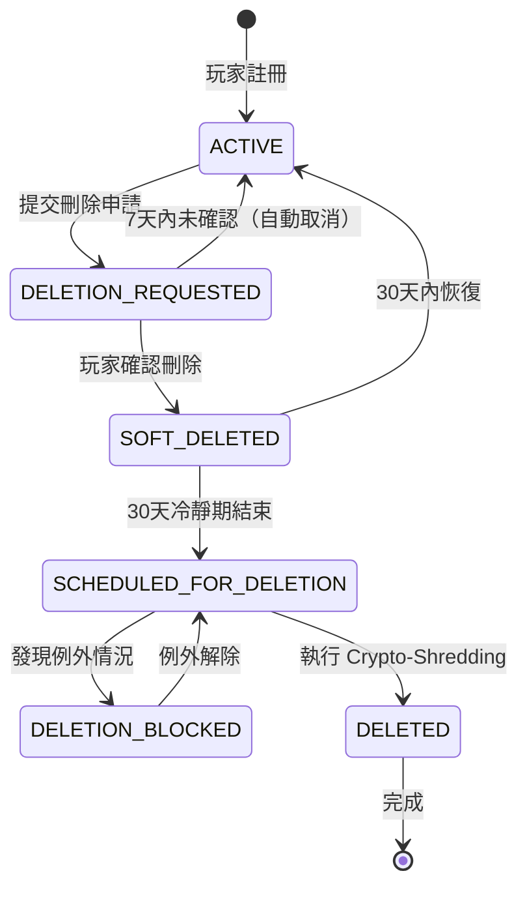

# 09-03-03 GDPR 數據刪除與 Crypto-Shredding (GDPR Data Deletion & Crypto-Shredding)

## 1. 系統概述

為符合 GDPR 第 17 條（Right to Erasure，數據遺忘權）與各國隱私法（CCPA, PDPA, LGPD），系統需支援 **物理刪除** 或 **不可恢復的匿名化**。由於資料庫備份是不可變的（Immutable），無法修改歷史備份中的 PII，因此採用 **Crypto-Shredding（加密粉碎）** 技術。

**核心原理**：透過銷毀加密金鑰，使加密數據永久不可恢復，等同於物理刪除。

---

## 2. 資料分類矩陣 (Data Retention Matrix)

### 2.1 法律依據分類

**並非所有資料都可刪除**，需依法規與業務需求分類：

| 資料類別 | 包含欄位 | GDPR 刪除義務 | 保留期限 | 處理方式 |
|---------|---------|--------------|---------|---------|
| **可完全刪除** | 玩家姓名、地址、偏好設定、行銷同意 | ✅ Yes | 無 | Physical Delete |
| **需匿名化** | 遊戲歷史（bet_id, game_id, amount）| ✅ Yes (anonymize) | 無 | Replace player_id with UUID |
| **必須保留（AML）** | 交易記錄（deposits, withdrawals）| ❌ No (legal obligation) | **5-7 years** | Retain with anonymized player_id |
| **必須保留（Tax）** | 獎金派彩記錄（winnings > threshold）| ❌ No (legal obligation) | **7 years** (varies by jurisdiction) | Retain with anonymized player_id |
| **必須保留（Dispute）** | 投訴工單（complaint_id, resolution）| ❌ No (legal claim) | **6 years** | Retain until claim expires |
| **必須保留（Ban）** | 違規記錄（fraud_flags, ban_reason）| ❌ No (legitimate interest) | **Permanent** | Retain for fraud prevention |

**法律依據（GDPR Art. 17(3) Exceptions）**：
- **(b) Compliance with legal obligation**：反洗錢（AML）、稅務報告
- **(e) Legal claims**：正在進行或潛在的訴訟
- **(f) Legitimate interests**：欺詐防護、帳號安全

### 2.2 關鍵例外情境

**暫停刪除的條件**：
| 情境 | 暫停理由 | 解除條件 | 最長保留期 |
|------|---------|---------|-----------|
| **帳號調查中** | Under Investigation（AML/Fraud）| 調查結束 | 最長 1 年 |
| **未結訴訟** | Pending Legal Case | 訴訟解決 | 最長 10 年 |
| **未完成流水** | Pending Wagering Requirement | 完成流水或放棄紅利 | 最長 90 天 |
| **未提領餘額** | Outstanding Balance > $0 | 餘額歸零 | 無限期（通知玩家）|
| **稅務查核** | Tax Audit Period | 查核結束 | 7 年 |

---

## 3. Crypto-Shredding 原理與實作

### 3.1 雙層加密架構

**設計原理**：使用 **Per-Player Data Encryption Key (DEK)** 加密 PII，DEK 本身由 **Master Key (KEK)** 加密。刪除玩家時，僅需銷毀 DEK，即可使所有 PII 永久不可恢復。

```
[Crypto-Shredding Architecture]
┌────────────────────────────────────────────────────────────┐
│  Key Hierarchy                                             │
│  ┌──────────────────────────────────────────────────────┐  │
│  │  Master Key (KEK - Key Encryption Key)              │  │
│  │  - Stored in AWS KMS / HashiCorp Vault              │  │
│  │  - Never leaves HSM                                  │  │
│  │  - Rotated annually                                 │  │
│  └──────────────────────────────────────────────────────┘  │
│                          ↓ Encrypts                        │
│  ┌──────────────────────────────────────────────────────┐  │
│  │  Per-Player DEK (Data Encryption Key)               │  │
│  │  - Unique AES-256 key for EACH player               │  │
│  │  - Stored in database (encrypted by KEK)            │  │
│  │  - Size: 32 bytes (256-bit)                         │  │
│  └──────────────────────────────────────────────────────┘  │
│                          ↓ Encrypts                        │
│  ┌──────────────────────────────────────────────────────┐  │
│  │  Player PII Data                                     │  │
│  │  - encrypted_name, encrypted_phone,                  │  │
│  │    encrypted_email, etc.                            │  │
│  │  - All encrypted with player's unique DEK          │  │
│  └──────────────────────────────────────────────────────┘  │
├────────────────────────────────────────────────────────────┤
│  Deletion Process (Crypto-Shredding)                      │
│  DELETE FROM user_keys WHERE player_id = ?                │
│  → DEK destroyed, all PII becomes unrecoverable           │
│  → Even with database backups, data cannot be decrypted   │
└────────────────────────────────────────────────────────────┘
```

**為何傳統刪除不夠？**
| 刪除方式 | 問題 | Crypto-Shredding 優勢 |
|---------|------|----------------------|
| `DELETE FROM players` | 資料庫備份仍存在明文/密文 | ✅ 備份中的密文永久不可恢復 |
| 軟刪除（`deleted_at`）| 資料仍可查詢（風險）| ✅ 金鑰銷毀後無法解密 |
| 覆寫刪除（`VACUUM FULL`）| 成本極高、耗時長 | ✅ 輕量操作（僅刪除金鑰）|

### 3.2 資料庫 Schema 設計

**金鑰管理表**：
```sql
CREATE TABLE user_keys (
    player_id BIGINT PRIMARY KEY,
    dek_encrypted BYTEA NOT NULL,        -- DEK encrypted by KEK (32 bytes)
    dek_version INT DEFAULT 1,           -- For key rotation
    created_at TIMESTAMP DEFAULT NOW(),
    deleted_at TIMESTAMP,                -- Tombstone record
    deletion_reason VARCHAR(50),         -- 'GDPR_REQUEST', 'ACCOUNT_CLOSURE'

    INDEX idx_deleted_at (deleted_at) WHERE deleted_at IS NOT NULL
);

-- 範例資料
-- player_id: 12345
-- dek_encrypted: \x8a7b6c5d4e3f2a1b... (AES-GCM encrypted DEK)
-- dek_version: 1
-- deleted_at: NULL (尚未刪除)
```

**為何保留 Tombstone（墓碑記錄）？**
| 用途 | 說明 |
|------|------|
| **防止重複註冊** | 同一 email/phone 再次註冊會被拒絕（玩家可能嘗試套利）|
| **審計追蹤** | 證明已處理 GDPR 請求（合規證明）|
| **合規報告** | 每月刪除統計（向監管機構提交）|
| **法律保護** | 若玩家事後否認刪除請求，可提供證據 |

### 3.3 加密/解密實現

**DEK 生成與加密**：
```python
import os
from cryptography.hazmat.primitives.ciphers.aead import AESGCM

def create_player_dek(player_id: int, kek: bytes) -> bytes:
    """為新玩家生成並加密 DEK"""
    # 1. 生成隨機 DEK (256-bit)
    dek_plaintext = os.urandom(32)

    # 2. 使用 KEK 加密 DEK
    kek_cipher = AESGCM(kek)
    iv = os.urandom(12)
    dek_encrypted = kek_cipher.encrypt(iv, dek_plaintext, associated_data=None)

    # 3. 組合格式：iv:ciphertext
    dek_blob = iv + dek_encrypted

    # 4. 存入資料庫
    db.execute(
        "INSERT INTO user_keys (player_id, dek_encrypted) VALUES ($1, $2)",
        player_id, dek_blob
    )

    return dek_plaintext  # 返回明文 DEK（用於加密 PII）

def get_player_dek(player_id: int, kek: bytes) -> bytes:
    """解密玩家的 DEK"""
    dek_blob = db.fetchval(
        "SELECT dek_encrypted FROM user_keys WHERE player_id = $1 AND deleted_at IS NULL",
        player_id
    )

    if not dek_blob:
        raise PlayerDeletedException("Player data has been deleted (Crypto-Shredded)")

    # 解析 IV 與密文
    iv = dek_blob[:12]
    ciphertext = dek_blob[12:]

    # 解密 DEK
    kek_cipher = AESGCM(kek)
    dek_plaintext = kek_cipher.decrypt(iv, ciphertext, associated_data=None)

    return dek_plaintext
```

**使用 DEK 加密 PII**：
```python
def encrypt_pii_with_dek(player_id: int, pii_plaintext: str) -> str:
    """使用玩家的 DEK 加密 PII"""
    kek = kms_client.get_master_key("alias/player-kek")
    dek = get_player_dek(player_id, kek)

    # 使用 DEK 加密 PII
    encryptor = PIIEncryption(dek)
    return encryptor.encrypt(pii_plaintext)

def decrypt_pii_with_dek(player_id: int, pii_encrypted: str) -> str:
    """使用玩家的 DEK 解密 PII"""
    kek = kms_client.get_master_key("alias/player-kek")
    dek = get_player_dek(player_id, kek)  # 若 DEK 已刪除，此處拋出異常

    # 使用 DEK 解密 PII
    decryptor = PIIEncryption(dek)
    return decryptor.decrypt(pii_encrypted)
```

---

## 4. 完整刪除狀態機 (Deletion State Machine)



**狀態說明**：
| 狀態 | 說明 | 可執行操作 | 玩家可登入？ |
|------|------|-----------|------------|
| **ACTIVE** | 正常狀態 | 所有功能 | ✅ 是 |
| **DELETION_REQUESTED** | 已申請，等待確認 | 確認/取消 | ✅ 是（可取消）|
| **SOFT_DELETED** | 冷靜期（30天）| 恢復帳號 | ❌ 否 |
| **SCHEDULED_FOR_DELETION** | 待執行隊列 | Cron Job 處理 | ❌ 否 |
| **DELETION_BLOCKED** | 例外情況（調查中）| 人工審核 | ❌ 否 |
| **DELETED** | 已銷毀 | 無（永久）| ❌ 否 |

---

## 5. 詳細執行流程 (Step-by-Step Workflow)

### Phase 1: 申請與確認（T+0 → T+7 天）

**1. 觸發來源**：
- 玩家透過 Account Settings → "Delete My Account"
- 玩家透過客服 Email/Live Chat 發起請求
- 法律團隊代玩家發起（GDPR Data Subject Request）

**2. 前置檢查（Pre-Flight Checks）**：
```python
def validate_deletion_request(player_id: int) -> dict:
    """驗證是否可刪除"""
    player = db.fetchrow("SELECT * FROM players WHERE player_id = $1", player_id)

    errors = []

    # 檢查 1：帳號狀態
    if player['status'] != 'ACTIVE':
        errors.append("Account is not in ACTIVE status")

    # 檢查 2：餘額歸零
    wallet_balance = db.fetchval(
        "SELECT SUM(balance) FROM wallets WHERE player_id = $1",
        player_id
    )
    if wallet_balance > 0:
        errors.append(f"Please withdraw your balance of ${wallet_balance} before deletion")

    # 檢查 3：無未完成流水
    bonus = db.fetchrow(
        "SELECT * FROM player_bonuses WHERE player_id = $1 AND status = 'active'",
        player_id
    )
    if bonus and bonus['wagering_progress'] < 1.0:
        errors.append("You must complete bonus wagering requirement before deletion")

    # 檢查 4：無進行中調查
    investigation = db.fetchval(
        "SELECT COUNT(*) FROM investigations WHERE player_id = $1 AND status = 'ongoing'",
        player_id
    )
    if investigation > 0:
        errors.append("Account is under investigation and cannot be deleted")

    # 檢查 5：無未結訴訟
    legal_case = db.fetchval(
        "SELECT COUNT(*) FROM legal_cases WHERE player_id = $1 AND status = 'pending'",
        player_id
    )
    if legal_case > 0:
        errors.append("Account has pending legal case and cannot be deleted")

    if errors:
        return {"can_delete": False, "errors": errors}

    return {"can_delete": True}
```

**3. 確認機制（Double Opt-In）**：
```python
def initiate_deletion_request(player_id: int):
    """發起刪除請求"""
    # 1. 生成一次性確認 Token
    confirmation_token = secrets.token_urlsafe(32)
    expiration = datetime.now() + timedelta(days=7)

    # 2. 記錄請求
    db.execute("""
        UPDATE players SET
            status = 'DELETION_REQUESTED',
            deletion_token = $1,
            deletion_token_expires_at = $2,
            deletion_requested_at = NOW()
        WHERE player_id = $3
    """, confirmation_token, expiration, player_id)

    # 3. 發送確認 Email
    player = db.fetchrow("SELECT encrypted_email FROM players WHERE player_id = $1", player_id)
    email = decrypt_pii_with_dek(player_id, player['encrypted_email'])

    confirmation_link = f"https://platform.com/confirm-deletion?token={confirmation_token}"

    send_email(
        to=email,
        subject="Confirm Account Deletion Request",
        body=f"""
        You have requested to delete your account.

        To proceed, please click the link below within 7 days:
        {confirmation_link}

        If you did not request this, please contact support immediately.
        """
    )

    logger.info(f"Deletion request initiated for player {player_id}")
```

### Phase 2: 冷靜期（T+7 → T+37 天）

**1. 狀態變更**：
```python
def confirm_deletion_request(confirmation_token: str):
    """玩家確認刪除請求"""
    player = db.fetchrow("""
        SELECT player_id FROM players
        WHERE deletion_token = $1
          AND deletion_token_expires_at > NOW()
          AND status = 'DELETION_REQUESTED'
    """, confirmation_token)

    if not player:
        raise InvalidTokenError("Deletion token is invalid or expired")

    # 進入冷靜期
    db.execute("""
        UPDATE players SET
            status = 'SOFT_DELETED',
            soft_deleted_at = NOW(),
            final_deletion_at = NOW() + INTERVAL '30 days',
            deletion_token = NULL  -- 清除 Token
        WHERE player_id = $1
    """, player['player_id'])

    logger.info(f"Player {player['player_id']} entered soft-delete cooling period")
```

**2. 功能限制**：
```python
@app.before_request
def block_deleted_players():
    """攔截已刪除玩家的登入嘗試"""
    if request.user and request.user.status == 'SOFT_DELETED':
        return jsonify({
            "code": 4003,
            "message": "Your account is scheduled for deletion",
            "final_deletion_date": request.user.final_deletion_at,
            "recovery_link": "https://platform.com/recover-account"
        }), 403
```

**3. 恢復機制**：
```python
def recover_account(player_id: int, otp_code: str):
    """玩家恢復已刪除帳號"""
    # 1. 驗證 OTP
    if not verify_otp(player_id, otp_code):
        raise InvalidOTPError("OTP code is incorrect")

    # 2. 恢復狀態
    db.execute("""
        UPDATE players SET
            status = 'ACTIVE',
            soft_deleted_at = NULL,
            final_deletion_at = NULL
        WHERE player_id = $1 AND status = 'SOFT_DELETED'
    """, player_id)

    # 3. 記錄審計日誌
    audit_log.create(
        action='ACCOUNT_RECOVERED',
        player_id=player_id,
        details={'recovered_from': 'SOFT_DELETED'}
    )

    logger.info(f"Player {player_id} recovered account from soft-delete")
```

**4. 提醒通知**：
```python
@cron.scheduled_job('cron', day='*/15')  # 每15天執行一次
def send_deletion_reminders():
    """發送刪除提醒 Email"""
    # Day 15 提醒
    players_day_15 = db.fetchall("""
        SELECT player_id, encrypted_email, final_deletion_at
        FROM players
        WHERE status = 'SOFT_DELETED'
          AND final_deletion_at - NOW() BETWEEN INTERVAL '14 days' AND INTERVAL '16 days'
    """)

    for player in players_day_15:
        email = decrypt_pii_with_dek(player['player_id'], player['encrypted_email'])
        send_email(
            to=email,
            subject="Account Deletion Reminder: 15 Days Remaining",
            body=f"Your account will be permanently deleted on {player['final_deletion_at']}"
        )

    # Day 25 提醒（最後警告）
    # ... 類似邏輯
```

### Phase 3: 最終銷毀（T+37 天）

**1. Cron Job 排程**：
```python
@cron.scheduled_job('cron', hour=2, minute=0)  # 每天凌晨 02:00 UTC 執行
async def execute_scheduled_deletions():
    """批次執行 Crypto-Shredding"""
    logger.info("Starting scheduled player deletions...")

    # 查詢待刪除玩家
    players_to_delete = db.fetchall("""
        SELECT player_id FROM players
        WHERE status = 'SOFT_DELETED'
          AND final_deletion_at <= NOW()
          AND deleted_at IS NULL
        LIMIT 100  -- 每批 100 個
    """)

    success_count = 0
    error_count = 0

    for player in players_to_delete:
        try:
            # 執行完整刪除流程
            await crypto_shred_player(player['player_id'])
            success_count += 1
        except Exception as e:
            logger.error(f"Failed to delete player {player['player_id']}: {e}")
            error_count += 1

        # 批次間隔 10 秒（降低 DB 壓力）
        if (success_count + error_count) % 10 == 0:
            await asyncio.sleep(10)

    logger.info(f"Deletion completed: {success_count} success, {error_count} errors")
```

**2. Crypto-Shredding 執行步驟**：
```python
async def crypto_shred_player(player_id: int):
    """執行完整 Crypto-Shredding 流程"""
    async with db.transaction():
        # Step 1: Destroy DEK (核心步驟)
        deleted_dek = db.fetchval(
            "DELETE FROM user_keys WHERE player_id = $1 RETURNING dek_encrypted",
            player_id
        )

        if not deleted_dek:
            raise Exception(f"DEK not found for player {player_id}")

        # 審計備份（僅記錄金鑰被銷毀，不記錄金鑰內容）
        audit_log.create(
            action='DEK_DESTROYED',
            player_id=player_id,
            details={'dek_length': len(deleted_dek)}
        )

        # Step 2: Delete Blind Indexes (移除搜尋能力)
        db.execute("""
            UPDATE players SET
                phone_index = NULL,
                email_index = NULL,
                id_number_index = NULL,
                bank_account_index = NULL
            WHERE player_id = $1
        """, player_id)

        # Step 3: Anonymize Retained Data (AML/Tax 要求保留的資料)
        anonymous_uuid = str(uuid.uuid4())

        db.execute("""
            UPDATE transaction_logs SET
                player_id = $1,
                player_name = 'DELETED_USER',
                player_email = NULL,
                player_phone = NULL
            WHERE player_id = $2
        """, anonymous_uuid, player_id)

        db.execute("""
            UPDATE game_bets SET
                player_id = $1,
                player_username = 'DELETED_USER'
            WHERE player_id = $2
        """, anonymous_uuid, player_id)

        # Step 4: Physical Delete PII (可刪除的資料)
        db.execute("DELETE FROM player_profiles WHERE player_id = $1", player_id)
        db.execute("DELETE FROM player_addresses WHERE player_id = $1", player_id)
        db.execute("DELETE FROM player_preferences WHERE player_id = $1", player_id)
        db.execute("DELETE FROM marketing_consents WHERE player_id = $1", player_id)
        db.execute("DELETE FROM player_sessions WHERE player_id = $1", player_id)

        # Step 5: Mark player as deleted (Tombstone)
        db.execute("""
            UPDATE players SET
                status = 'DELETED',
                deleted_at = NOW(),
                deletion_method = 'CRYPTO_SHREDDING',
                encrypted_phone = NULL,
                encrypted_email = NULL,
                encrypted_real_name = NULL,
                encrypted_id_number = NULL,
                encrypted_bank_account = NULL
            WHERE player_id = $1
        """, player_id)

    # Step 6: Publish Event (跨模組通知)
    await kafka_producer.send('player-events', {
        'event': 'player.deleted',
        'player_id': player_id,
        'deleted_at': datetime.now().isoformat(),
        'deletion_reason': 'GDPR_REQUEST'
    })

    logger.info(f"Player {player_id} successfully crypto-shredded")
```

**3. 跨模組事件處理**：
```python
# 01-01 Player Center: 移除 Redis 快取
@kafka_consumer.subscribe('player.deleted')
async def handle_player_deleted(event):
    player_id = event['player_id']
    redis_client.delete(f"player:{player_id}")
    redis_client.delete(f"player_session:{player_id}")

# 02-06 Wallet: 確認餘額已歸零
@kafka_consumer.subscribe('player.deleted')
async def verify_wallet_balance(event):
    player_id = event['player_id']
    balance = db.fetchval("SELECT SUM(balance) FROM wallets WHERE player_id = $1", player_id)
    if balance != 0:
        logger.critical(f"Player {player_id} deleted with non-zero balance: {balance}")

# 11-01 CS Platform: 關閉所有 open tickets
@kafka_consumer.subscribe('player.deleted')
async def close_player_tickets(event):
    player_id = event['player_id']
    db.execute("""
        UPDATE cs_tickets SET
            status = 'closed',
            resolution = 'Player account deleted'
        WHERE player_id = $1 AND status IN ('open', 'in_progress')
    """, player_id)
```

---

## 6. 例外處理 (Exception Handling)

### 6.1 調查中帳號（Under Investigation）

**場景**：風控團隊正在調查玩家涉嫌洗錢，此時玩家申請刪除帳號

**處理流程**：
```python
def block_deletion_for_investigation(player_id: int, reason: str):
    """阻止刪除請求（風控/法律團隊使用）"""
    db.execute("""
        INSERT INTO deletion_blocks (
            player_id,
            block_reason,
            block_until,
            created_by,
            notes
        ) VALUES ($1, $2, NULL, $3, $4)
    """,
    player_id,
    'UNDER_INVESTIGATION',
    current_user.email,
    reason
    )

    # 更新玩家狀態
    db.execute("""
        UPDATE players SET status = 'DELETION_BLOCKED'
        WHERE player_id = $1
    """, player_id)

    logger.warning(f"Deletion blocked for player {player_id}: {reason}")

# 使用範例
block_deletion_for_investigation(
    player_id=12345,
    reason="Suspected money laundering case #ML-2026-001"
)
```

**解除條件**：
```python
def release_deletion_block(player_id: int):
    """解除刪除阻止（需主管批准）"""
    db.execute("""
        UPDATE deletion_blocks SET
            released_at = NOW(),
            released_by = $1
        WHERE player_id = $2 AND released_at IS NULL
    """, current_user.email, player_id)

    # 恢復為待刪除狀態
    db.execute("""
        UPDATE players SET status = 'SCHEDULED_FOR_DELETION'
        WHERE player_id = $1 AND status = 'DELETION_BLOCKED'
    """, player_id)

    logger.info(f"Deletion block released for player {player_id}")
```

### 6.2 未結訴訟（Pending Legal Case）

**場景**：玩家與平台存在法律糾紛（如退款爭議），此時適用 GDPR Art. 17(3)(e) 例外

**處理**：
```python
def block_deletion_for_legal_case(player_id: int, case_id: str):
    """因法律案件阻止刪除"""
    db.execute("""
        INSERT INTO deletion_blocks (
            player_id,
            block_reason,
            block_until,
            created_by,
            notes
        ) VALUES ($1, 'PENDING_LEGAL_CASE', NULL, $2, $3)
    """,
    player_id,
    'legal@company.com',
    f"Legal case ID: {case_id}"
    )

    logger.info(f"Deletion blocked for player {player_id} due to legal case {case_id}")
```

**定期審查**：
```python
@cron.scheduled_job('cron', day=1, hour=0)  # 每月 1 號執行
def review_legal_case_blocks():
    """每月審查法律案件阻止"""
    blocks = db.fetchall("""
        SELECT * FROM deletion_blocks
        WHERE block_reason = 'PENDING_LEGAL_CASE'
          AND released_at IS NULL
          AND created_at < NOW() - INTERVAL '6 months'
    """)

    for block in blocks:
        # 通知法律團隊審查
        send_email(
            to='legal@company.com',
            subject=f"Legal block review required for player {block['player_id']}",
            body=f"This deletion block has been active for > 6 months. Please review."
        )
```

### 6.3 未完成流水（Pending Wagering）

**場景**：玩家領取紅利後立即申請刪除帳號（嘗試套利）

**處理**：
```python
def validate_deletion_request(player_id: int):
    """前置檢查（包含流水檢查）"""
    bonus = db.fetchrow("""
        SELECT * FROM player_bonuses
        WHERE player_id = $1
          AND status = 'active'
          AND wagering_progress < 1.0
    """, player_id)

    if bonus:
        raise DeletionBlockedException(
            f"You must complete bonus wagering requirement before account deletion. "
            f"Current progress: {bonus['wagering_progress']*100:.1f}%"
        )
```

**玩家可選擇放棄紅利**：
```python
def forfeit_bonus_and_delete(player_id: int):
    """放棄紅利並刪除帳號"""
    # 1. 取消所有活動紅利
    db.execute("""
        UPDATE player_bonuses SET status = 'forfeited'
        WHERE player_id = $1 AND status = 'active'
    """, player_id)

    # 2. 扣除紅利餘額
    db.execute("""
        UPDATE wallets SET bonus_balance = 0
        WHERE player_id = $1
    """, player_id)

    # 3. 允許刪除請求
    initiate_deletion_request(player_id)
```

---

## 7. 合規證明與報告 (Compliance Certificate)

### 7.1 刪除證明書（Deletion Certificate）

**自動生成並 Email 給玩家**：
```python
def generate_deletion_certificate(player_id: int) -> str:
    """生成 GDPR 刪除證明書"""
    deletion_data = db.fetchrow("""
        SELECT deleted_at, deletion_reason, soft_deleted_at
        FROM players
        WHERE player_id = $1
    """, player_id)

    certificate = f"""
━━━━━━━━━━━━━━━━━━━━━━━━━━━━━━━━━━━━━━━
 GDPR DATA DELETION CERTIFICATE
━━━━━━━━━━━━━━━━━━━━━━━━━━━━━━━━━━━━━━━

Certificate ID: GDPR-DEL-2026-{player_id:06d}
Player ID: {player_id} (ANONYMIZED)
Request Date: {deletion_data['soft_deleted_at'].strftime('%Y-%m-%d %H:%M:%S UTC')}
Completion Date: {deletion_data['deleted_at'].strftime('%Y-%m-%d %H:%M:%S UTC')}

ACTIONS TAKEN:
✓ Personal data encrypted with unique key
✓ Encryption key permanently destroyed (Crypto-Shredding)
✓ All data rendered unrecoverable
✓ Transaction logs anonymized per AML requirements
✓ Tombstone record created per GDPR Art. 17(2)

RETAINED DATA (Legal Basis):
• Anonymized transaction logs (AML - 5 years)
• Anonymized betting history (Tax - 7 years)
• Fraud prevention flags (Legitimate Interest - Indefinite)

This certificate serves as proof of compliance with
GDPR Article 17 (Right to Erasure).

For questions, contact: dpo@company.com
━━━━━━━━━━━━━━━━━━━━━━━━━━━━━━━━━━━━━━━
    """

    # Email 給玩家（若玩家 Email 未被刪除，使用最後已知 Email）
    send_email(
        to=get_last_known_email(player_id),
        subject="GDPR Deletion Certificate",
        body=certificate
    )

    return certificate
```

### 7.2 監管報告（Regulatory Reporting）

**每月生成刪除統計報告**：
```sql
-- 過去 12 個月的刪除統計
SELECT
    DATE_TRUNC('month', deleted_at) AS month,
    COUNT(*) AS total_deletions,
    COUNT(*) FILTER (WHERE deletion_reason = 'GDPR_REQUEST') AS gdpr_deletions,
    COUNT(*) FILTER (WHERE deletion_reason = 'ACCOUNT_CLOSURE') AS voluntary_closures,
    AVG(EXTRACT(EPOCH FROM (deleted_at - soft_deleted_at))/86400) AS avg_days_to_deletion
FROM players
WHERE deleted_at >= NOW() - INTERVAL '12 months'
GROUP BY 1
ORDER BY 1 DESC;
```

**輸出範例**：
| Month | Total Deletions | GDPR Requests | Voluntary Closures | Avg Days |
|-------|----------------|---------------|-------------------|----------|
| 2026-01 | 1,234 | 567 | 667 | 32.5 |
| 2025-12 | 1,089 | 498 | 591 | 31.8 |
| 2025-11 | 945 | 412 | 533 | 33.1 |

**提交對象**：
- **DPA（Data Protection Authority）**：監管機構
- **DPO（Data Protection Officer）**：內部資料保護官

---

## 8. 技術堆疊與整合

### 8.1 推薦技術

| 元件 | 推薦技術 | 用途 |
|------|---------|------|
| **Key Management** | AWS KMS / HashiCorp Vault | DEK/KEK 管理 |
| **Encryption** | AES-256-GCM | PII 加密 |
| **Task Queue** | Celery / Bull (Redis) | Cron Job 排程 |
| **Event Bus** | Kafka / RabbitMQ | 跨模組通知 |
| **Audit Log** | Elasticsearch | 合規追蹤 |
| **Email Service** | SendGrid / AWS SES | 確認通知 |

### 8.2 監控指標

| 指標 | 目標值 | Alert 閾值 | 說明 |
|------|--------|-----------|------|
| `deletion_queue_size` | < 100 | > 1000 | 待處理隊列長度 |
| `deletion_success_rate` | > 99.5% | < 95% | 成功率 |
| `deletion_duration_p99` | < 5s | > 10s | P99 處理時長/帳號 |
| `blocked_deletions_count` | < 10/月 | > 50/月 | 阻止刪除的案例數 |

---

## 9. 相關文檔

### 系列文檔
- [09-03-01 加密策略](./09-03-01_Encryption_Strategy.md) - AES-256-GCM、金鑰管理
- [09-03-02 Blind Index 架構](./09-03-02_Blind_Index_Architecture.md) - 可檢索加密、索引刪除

### 技術架構參考
- [09-02 審計日誌與審批](./09-02_Audit_Log_&_Approval.md) - 刪除操作審計
- [01-01 玩家賬戶系統](../01_Player_Center/01-01_Player_Account_System.md) - 帳號狀態管理
- [07-03 通知架構](../07_Platform_Management/07-03_Notification_Architecture.md) - 刪除事件通知

---

**文檔版本**: 1.0.0
**最後更新**: 2026-01-27
**維護團隊**: Security Team & Legal Team
