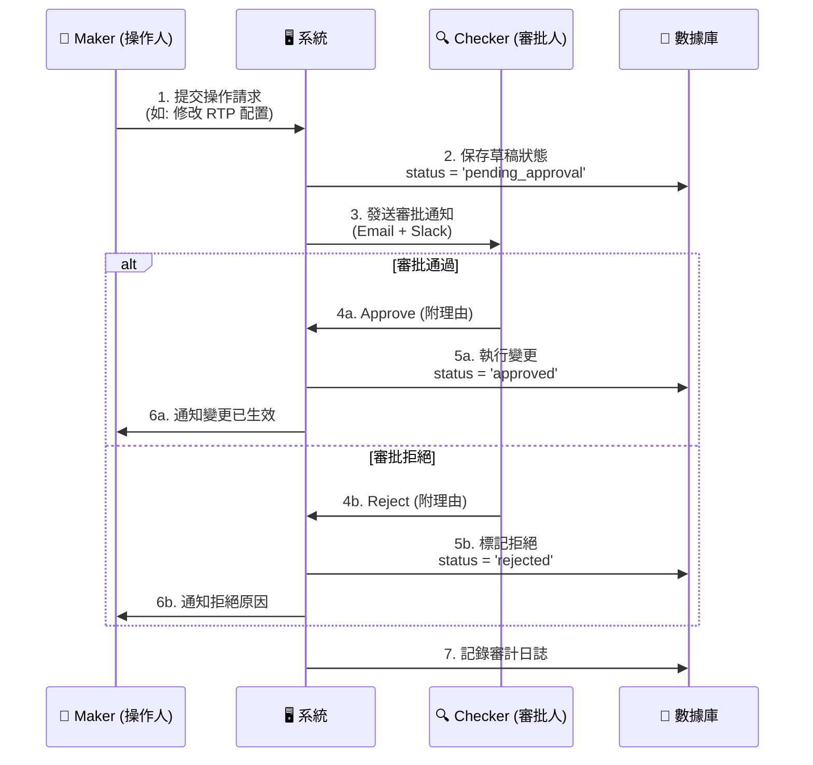
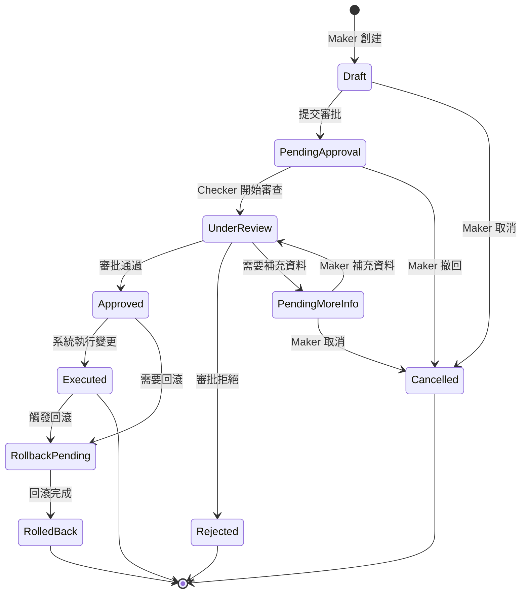

# 09-04 審批工作流系統 (Approval Workflow System)

> **相關文檔**: [09-02 審計日誌系統](./09-02_Audit_Log_System.md) - 所有審批操作的日誌記錄與查詢

## 1. 系統概述

### 1.1 設計目標
審批工作流系統（Approval Workflow System）是博彩平台風險控制的核心機制，通過 **Maker-Checker 模式** 確保高風險操作經過雙人或多級審核，防止單點人為錯誤或惡意操作。

### 1.2 核心價值
- **風險控制**：高額提款、配置變更等關鍵操作必須經過審批
- **職責分離**：操作人（Maker）與審批人（Checker）分離，防止濫用權限
- **審計追蹤**：每個審批決策都記錄在案，滿足合規要求（MGA、UKGC）
- **可回滾性**：支持快照與回滾，確保配置變更可追溯、可恢復

---

## 2. Maker-Checker 模式

### 2.1 基本流程



### 2.2 數據模型

```sql
CREATE TABLE approval_requests (
    request_id BIGINT PRIMARY KEY AUTO_INCREMENT,
    request_type ENUM(
        'withdraw',               -- 提款審批
        'config_change',          -- 配置變更
        'vip_upgrade',            -- VIP 升級
        'bonus_manual_issue',     -- 手動發放紅利
        'player_data_correction', -- 玩家數據修正
        'risk_label_change'       -- 風控標籤變更
    ) NOT NULL,

    -- Maker 信息
    maker_id BIGINT NOT NULL,
    maker_name VARCHAR(100) NOT NULL,
    submitted_at TIMESTAMP DEFAULT CURRENT_TIMESTAMP,

    -- 變更內容
    target_entity VARCHAR(100) NOT NULL,  -- 如: 'player_12345', 'game_config'
    change_payload JSON NOT NULL,         -- 變更的詳細內容
    change_reason TEXT NOT NULL,          -- Maker 提供的理由

    -- 審批信息
    checker_id BIGINT,
    checker_name VARCHAR(100),
    reviewed_at TIMESTAMP,
    status ENUM('pending_approval', 'approved', 'rejected', 'cancelled') DEFAULT 'pending_approval',
    review_comment TEXT,

    -- 元數據
    priority ENUM('low', 'normal', 'high', 'critical') DEFAULT 'normal',
    auto_approve_at TIMESTAMP,  -- 超時自動審批時間（可選）
    related_ticket_id BIGINT,   -- 關聯的工單 ID（如客服補單）

    INDEX idx_status (status, submitted_at),
    INDEX idx_maker (maker_id, submitted_at),
    INDEX idx_checker (checker_id, reviewed_at)
) ENGINE=InnoDB DEFAULT CHARSET=utf8mb4;
```

### 2.3 權限矩陣

| 操作類型 | Maker 權限要求 | Checker 權限要求 | 自動審批閾值 |
|---------|---------------|-----------------|-------------|
| **提款審批** | CS Agent | Finance Manager | < $100 自動通過 |
| **配置變更** | DevOps Engineer | CTO/VP of Engineering | 無自動審批 |
| **VIP 升級** | VIP Manager | COO | 無自動審批 |
| **手動發紅利** | CS Supervisor | Finance Manager | < $50 自動通過 |
| **風控標籤** | Risk Analyst | Risk Manager | 無自動審批 |
| **玩家數據修正** | CS Supervisor | Compliance Officer | 無自動審批 |

---

## 3. 多級審批鏈 (Multi-Level Approval)

### 3.1 分級審批規則

**提款審批範例**：

| 提款金額 | 審批級別 | 審批人 | SLA |
|---------|---------|--------|-----|
| < $100 | **L0** | 自動審批 | 即時 |
| $100 - $5,000 | **L1** | 財務專員 | 30分鐘 |
| $5,001 - $50,000 | **L2** | 財務經理 | 2小時 |
| > $50,000 | **L3** | 財務總監 + 風控總監 (雙簽) | 24小時 |

### 3.2 雙簽機制 (Dual Approval)

**適用場景**：高風險操作需要兩個不同角色同時審批。

**數據模型擴展**：
```sql
CREATE TABLE approval_chain (
    chain_id BIGINT PRIMARY KEY AUTO_INCREMENT,
    request_id BIGINT NOT NULL,
    approval_level INT NOT NULL,          -- 審批層級 (1, 2, 3...)
    required_approvers INT DEFAULT 1,     -- 需要的審批人數
    approved_count INT DEFAULT 0,         -- 已審批人數

    FOREIGN KEY (request_id) REFERENCES approval_requests(request_id),
    UNIQUE KEY uk_request_level (request_id, approval_level)
);

CREATE TABLE approval_votes (
    vote_id BIGINT PRIMARY KEY AUTO_INCREMENT,
    chain_id BIGINT NOT NULL,
    approver_id BIGINT NOT NULL,
    approver_role VARCHAR(50) NOT NULL,   -- 如: 'finance_director', 'risk_manager'
    vote ENUM('approve', 'reject') NOT NULL,
    vote_comment TEXT,
    voted_at TIMESTAMP DEFAULT CURRENT_TIMESTAMP,

    FOREIGN KEY (chain_id) REFERENCES approval_chain(chain_id),
    UNIQUE KEY uk_chain_approver (chain_id, approver_id)
);
```

**邏輯實現**：
```python
def process_approval_vote(chain_id: int, approver_id: int, vote: str):
    """處理審批投票"""
    chain = ApprovalChain.get(chain_id)

    # 記錄投票
    ApprovalVote.create(
        chain_id=chain_id,
        approver_id=approver_id,
        vote=vote
    )

    if vote == 'reject':
        # 任何一票否決，整個鏈結束
        request = ApprovalRequest.get(chain.request_id)
        request.update(status='rejected')
        notify_maker_rejection(request)
        return

    # 統計已批准票數
    approved_count = ApprovalVote.count(
        chain_id=chain_id,
        vote='approve'
    )

    if approved_count >= chain.required_approvers:
        # 當前層級通過，檢查是否有下一層級
        next_level = ApprovalChain.get_next_level(chain.request_id, chain.approval_level)

        if next_level:
            # 進入下一審批層級
            notify_next_level_approvers(next_level)
        else:
            # 所有層級通過，執行變更
            execute_approved_request(chain.request_id)
```

---

## 4. 工作流狀態機 (Workflow State Machine)

### 4.1 狀態轉換圖



### 4.2 狀態邏輯實現

```python
class ApprovalWorkflowEngine:
    """審批工作流引擎"""

    ALLOWED_TRANSITIONS = {
        'draft': ['pending_approval', 'cancelled'],
        'pending_approval': ['under_review', 'cancelled'],
        'under_review': ['approved', 'rejected', 'pending_more_info'],
        'pending_more_info': ['under_review', 'cancelled'],
        'approved': ['executed', 'rollback_pending'],
        'executed': ['rollback_pending'],
        'rollback_pending': ['rolled_back'],
    }

    def transition(self, request_id: int, new_status: str, actor_id: int, comment: str = None):
        """狀態轉換"""
        request = ApprovalRequest.get(request_id)
        current_status = request.status

        # 驗證轉換合法性
        if new_status not in self.ALLOWED_TRANSITIONS.get(current_status, []):
            raise InvalidTransitionError(
                f"Cannot transition from {current_status} to {new_status}"
            )

        # 驗證權限
        if not self._has_permission(actor_id, current_status, new_status):
            raise PermissionDeniedError(f"User {actor_id} cannot perform this transition")

        # 執行狀態變更
        old_status = request.status
        request.update(
            status=new_status,
            updated_by=actor_id,
            updated_at=datetime.utcnow()
        )

        # 記錄狀態變更日誌
        AuditLog.create(
            action='workflow_transition',
            actor_id=actor_id,
            resource_type='approval_request',
            resource_id=request_id,
            metadata={
                'from_status': old_status,
                'to_status': new_status,
                'comment': comment
            }
        )

        # 觸發副作用
        self._trigger_side_effects(request, new_status)

    def _trigger_side_effects(self, request: ApprovalRequest, new_status: str):
        """狀態轉換的副作用"""
        if new_status == 'pending_approval':
            # 通知審批人
            self._notify_approvers(request)

        elif new_status == 'approved':
            # 創建執行任務
            self._schedule_execution(request)

        elif new_status == 'executed':
            # 創建配置快照
            self._create_snapshot(request)
            # 通知 Maker
            self._notify_maker_success(request)

        elif new_status == 'rejected':
            # 通知 Maker 拒絕原因
            self._notify_maker_rejection(request)
```

---

## 5. 配置快照與回滾 (Snapshot & Rollback)

### 5.1 快照機制

**目標**：在每次配置變更執行前，保存當前狀態快照，確保可回滾。

**數據模型**：
```sql
CREATE TABLE config_snapshots (
    snapshot_id BIGINT PRIMARY KEY AUTO_INCREMENT,
    request_id BIGINT NOT NULL,           -- 關聯的審批請求
    config_type VARCHAR(100) NOT NULL,    -- 配置類型: 'game_rtp', 'bonus_rule', 'withdrawal_limit'
    target_entity VARCHAR(100) NOT NULL,  -- 目標實體: 'game_12345', 'bonus_rule_vip'

    -- 快照數據
    snapshot_before JSON NOT NULL,        -- 變更前的完整配置
    snapshot_after JSON NOT NULL,         -- 變更後的完整配置
    snapshot_diff JSON,                   -- 差異對比（可選）

    -- 元數據
    created_at TIMESTAMP DEFAULT CURRENT_TIMESTAMP,
    created_by BIGINT NOT NULL,
    is_rolled_back BOOLEAN DEFAULT FALSE,
    rolled_back_at TIMESTAMP,
    rolled_back_by BIGINT,

    FOREIGN KEY (request_id) REFERENCES approval_requests(request_id),
    INDEX idx_target (config_type, target_entity),
    INDEX idx_request (request_id)
) ENGINE=InnoDB DEFAULT CHARSET=utf8mb4;
```

**快照創建邏輯**：
```python
def create_config_snapshot(request: ApprovalRequest):
    """創建配置快照"""
    change_payload = request.change_payload
    target_entity = request.target_entity

    # 讀取當前配置
    current_config = get_current_config(
        config_type=request.request_type,
        entity=target_entity
    )

    # 計算變更後的配置
    new_config = apply_changes(current_config, change_payload)

    # 計算差異（用於快速對比）
    diff = calculate_diff(current_config, new_config)

    # 保存快照
    snapshot = ConfigSnapshot.create(
        request_id=request.request_id,
        config_type=request.request_type,
        target_entity=target_entity,
        snapshot_before=current_config,
        snapshot_after=new_config,
        snapshot_diff=diff,
        created_by=request.maker_id
    )

    return snapshot
```

### 5.2 回滾機制

**觸發場景**：
1. **人工觸發**：管理員發現配置錯誤，手動回滾
2. **自動觸發**：監控系統檢測到異常（如 RTP 暴跌），自動回滾
3. **時間窗口**：配置變更後 24 小時內可回滾

**回滾流程**：
```python
class ConfigRollbackService:
    """配置回滾服務"""

    def rollback(self, snapshot_id: int, rollback_reason: str, actor_id: int):
        """執行回滾"""
        snapshot = ConfigSnapshot.get(snapshot_id)

        # 驗證是否已回滾
        if snapshot.is_rolled_back:
            raise AlreadyRolledBackError("This snapshot has already been rolled back")

        # 驗證時間窗口（24小時內）
        if (datetime.utcnow() - snapshot.created_at).total_seconds() > 86400:
            raise RollbackWindowExpiredError("Rollback window expired (>24 hours)")

        # 執行回滾（恢復到 snapshot_before）
        restore_config(
            config_type=snapshot.config_type,
            entity=snapshot.target_entity,
            config_data=snapshot.snapshot_before
        )

        # 標記快照為已回滾
        snapshot.update(
            is_rolled_back=True,
            rolled_back_at=datetime.utcnow(),
            rolled_back_by=actor_id
        )

        # 更新關聯的審批請求狀態
        request = ApprovalRequest.get(snapshot.request_id)
        request.update(status='rolled_back')

        # 記錄審計日誌
        AuditLog.create(
            action='config_rollback',
            actor_id=actor_id,
            resource_type='config_snapshot',
            resource_id=snapshot_id,
            metadata={
                'rollback_reason': rollback_reason,
                'config_type': snapshot.config_type,
                'target_entity': snapshot.target_entity
            }
        )

        # 發送告警通知
        alert_critical_rollback(snapshot, rollback_reason)
```

### 5.3 自動回滾觸發器

**監控指標範例**：
```python
class AutoRollbackMonitor:
    """自動回滾監控器"""

    THRESHOLDS = {
        'game_rtp': {
            'metric': 'actual_rtp',
            'deviation': 0.05,  # RTP 偏差超過 5% 觸發回滾
            'time_window': 3600  # 1小時內
        },
        'bonus_rule': {
            'metric': 'bonus_abuse_rate',
            'threshold': 0.2,  # 濫用率超過 20% 觸發回滾
            'time_window': 1800  # 30分鐘內
        }
    }

    def check_rollback_conditions(self, snapshot: ConfigSnapshot):
        """檢查是否需要自動回滾"""
        config_type = snapshot.config_type
        threshold_config = self.THRESHOLDS.get(config_type)

        if not threshold_config:
            return  # 該配置類型無自動回滾規則

        # 計算實際指標
        actual_metric = calculate_metric(
            metric_name=threshold_config['metric'],
            entity=snapshot.target_entity,
            time_window=threshold_config['time_window']
        )

        # 判斷是否超過閾值
        if self._is_anomaly(actual_metric, threshold_config):
            # 觸發自動回滾
            self.rollback(
                snapshot_id=snapshot.snapshot_id,
                rollback_reason=f"Auto-rollback: {threshold_config['metric']} = {actual_metric} exceeded threshold",
                actor_id=SYSTEM_USER_ID
            )

            # 發送緊急告警
            send_critical_alert(
                title="自動回滾觸發",
                message=f"配置 {snapshot.target_entity} 已自動回滾",
                details=snapshot.snapshot_diff
            )
```

---

## 6. 審批 UI/UX 設計

### 6.1 審批工作台

**功能要求**：
1. **待審批隊列**：優先級排序（Critical > High > Normal > Low）
2. **快速審批**：一鍵批准/拒絕（附快速理由模板）
3. **詳情面板**：
   - Maker 信息與提交理由
   - 變更前後對比（Diff View）
   - 相關審計日誌（該玩家/配置的歷史變更）
   - 風險評估（自動計算風險分數）

**UI 佈局示意**：
```
┌─────────────────────────────────────────────────────┐
│  🔔 待審批請求 (3)          🔍 搜索   🔽 篩選       │
├─────────────────────────────────────────────────────┤
│ ⚠️ [Critical] 提款審批 - $75,000   👤 Alice  2分鐘前│
│   玩家: VIP_001 | 理由: VIP 高額提款請求            │
│   [ 查看詳情 ] [ ✅ 批准 ] [ ❌ 拒絕 ]              │
├─────────────────────────────────────────────────────┤
│ ⚡ [High] 配置變更 - RTP 調整   👤 Bob  15分鐘前    │
│   遊戲: SlotGame_123 | 變更: RTP 96% → 95%         │
│   [ 查看詳情 ] [ ✅ 批准 ] [ ❌ 拒絕 ]              │
├─────────────────────────────────────────────────────┤
│ 📄 [Normal] 手動發紅利 - $200   👤 Carol  1小時前   │
│   玩家: Player_456 | 理由: 客服補償                │
│   [ 查看詳情 ] [ ✅ 批准 ] [ ❌ 拒絕 ]              │
└─────────────────────────────────────────────────────┘
```

### 6.2 變更對比視圖 (Diff View)

**提款審批範例**：
```json
// Diff View
{
  "request_type": "withdraw",
  "player_id": "12345",
  "player_vip_level": 5,
  "withdrawal_details": {
    "amount": "$75,000",
    "method": "Bank Transfer",
    "account": "****1234"
  },
  "risk_signals": [
    "✅ KYC: Verified",
    "✅ 流水完成: 150% (要求 100%)",
    "⚠️ 首次大額提款 (歷史最高: $10,000)",
    "✅ 帳戶年齡: 18個月",
    "✅ 無風控標籤"
  ],
  "maker_comment": "VIP 玩家正常大額提款，已完成額外身份驗證",
  "suggested_action": "批准（風險分數: 12/100）"
}
```

**配置變更範例**（Diff View）：
```diff
// Game RTP Configuration
{
  "game_id": "slot_dragon_gold",
  "game_name": "Dragon Gold Slots",
- "rtp": 0.9600,
+ "rtp": 0.9500,
  "effective_from": "2026-02-01 00:00:00 UTC"
}

⚠️ 風險提示:
- RTP 降低 1% 可能影響玩家滿意度
- 預計月營收增加: +$25,000
- 建議: 同步調整遊戲促銷力度
```

### 6.3 快速操作模板

**拒絕理由模板**：
```javascript
const REJECTION_TEMPLATES = [
  {
    category: '風險過高',
    reasons: [
      '玩家存在多個帳戶（疑似對沖）',
      '流水未完成（當前 {progress}%，要求 100%）',
      '近期存在異常投注行為',
      'KYC 資料不完整'
    ]
  },
  {
    category: '資料不足',
    reasons: [
      '需補充銀行帳戶證明',
      '需提供交易明細截圖',
      '請聯繫玩家確認提款意圖'
    ]
  },
  {
    category: '政策限制',
    reasons: [
      '超過日提款限額（VIP{level} 限額: ${limit}）',
      '該支付方式不支持該金額',
      '需等待 {hours} 小時後才能再次提款'
    ]
  }
];
```

---

## 7. 通知與告警

### 7.1 通知渠道

| 事件 | Maker 通知 | Checker 通知 | 管理層通知 |
|------|-----------|-------------|-----------|
| **請求提交** | ✅ Email | ✅ Email + Slack + 系統內消息 | - |
| **審批通過** | ✅ Email + 系統內消息 | - | - |
| **審批拒絕** | ✅ Email + 系統內消息<br/>（含拒絕理由） | - | - |
| **超時未審批** | - | ⚠️ Slack 提醒 | ⚠️ Email（超過 SLA） |
| **自動回滾觸發** | ✅ Email | ✅ Email + 電話 | 🚨 Email + SMS + 電話 |

### 7.2 Slack 整合範例

```python
def notify_approval_needed(request: ApprovalRequest, approvers: List[User]):
    """Slack 通知審批人"""
    slack_message = {
        "channel": "#approval-queue",
        "blocks": [
            {
                "type": "header",
                "text": {
                    "type": "plain_text",
                    "text": f"🔔 新審批請求 - {request.request_type}"
                }
            },
            {
                "type": "section",
                "fields": [
                    {"type": "mrkdwn", "text": f"*請求 ID:*\n{request.request_id}"},
                    {"type": "mrkdwn", "text": f"*優先級:*\n{request.priority.upper()}"},
                    {"type": "mrkdwn", "text": f"*提交人:*\n{request.maker_name}"},
                    {"type": "mrkdwn", "text": f"*提交時間:*\n{request.submitted_at}"}
                ]
            },
            {
                "type": "section",
                "text": {
                    "type": "mrkdwn",
                    "text": f"*變更理由:*\n{request.change_reason}"
                }
            },
            {
                "type": "actions",
                "elements": [
                    {
                        "type": "button",
                        "text": {"type": "plain_text", "text": "查看詳情"},
                        "url": f"https://admin.platform.com/approvals/{request.request_id}",
                        "style": "primary"
                    }
                ]
            }
        ]
    }

    slack_client.chat_postMessage(**slack_message)
```

---

## 8. 與審計日誌系統整合

### 8.1 關聯查詢

**場景**：審批人在審查時，需要查看目標實體的歷史變更記錄。

**查詢範例**：
```python
def get_entity_change_history(entity_type: str, entity_id: str, limit: int = 10):
    """查詢實體的歷史變更記錄（審批請求 + 審計日誌）"""

    # 從審批請求表查詢歷史審批
    approval_history = db.session.query(ApprovalRequest).filter(
        ApprovalRequest.target_entity == f"{entity_type}_{entity_id}",
        ApprovalRequest.status.in_(['approved', 'executed'])
    ).order_by(ApprovalRequest.reviewed_at.desc()).limit(limit).all()

    # 從審計日誌查詢相關操作
    audit_logs = AuditLog.search(
        resource_type=entity_type,
        resource_id=entity_id,
        limit=limit
    )

    # 合併並按時間排序
    combined_history = sorted(
        approval_history + audit_logs,
        key=lambda x: x.timestamp,
        reverse=True
    )

    return combined_history
```

### 8.2 審批鏈追蹤

**場景**：合規審計需要追蹤特定配置的完整審批鏈。

**查詢範例**：
```sql
-- 查詢特定遊戲 RTP 的所有變更審批記錄
SELECT
    ar.request_id,
    ar.submitted_at,
    ar.maker_name,
    ar.checker_name,
    ar.reviewed_at,
    ar.status,
    ar.change_payload->>'$.rtp_before' AS rtp_before,
    ar.change_payload->>'$.rtp_after' AS rtp_after,
    cs.snapshot_before->>'$.rtp' AS verified_before,
    cs.snapshot_after->>'$.rtp' AS verified_after
FROM approval_requests ar
LEFT JOIN config_snapshots cs ON ar.request_id = cs.request_id
WHERE ar.request_type = 'config_change'
  AND ar.target_entity = 'game_slot_dragon_gold'
  AND ar.change_payload->>'$.field' = 'rtp'
ORDER BY ar.submitted_at DESC;
```

---

## 9. 效能監控

### 9.1 關鍵指標 (KPI)

```sql
-- 審批效率報表
SELECT
    DATE(reviewed_at) AS review_date,
    request_type,
    COUNT(*) AS total_requests,
    AVG(TIMESTAMPDIFF(MINUTE, submitted_at, reviewed_at)) AS avg_review_time_minutes,
    SUM(CASE WHEN status = 'approved' THEN 1 ELSE 0 END) AS approved_count,
    SUM(CASE WHEN status = 'rejected' THEN 1 ELSE 0 END) AS rejected_count,
    (SUM(CASE WHEN status = 'approved' THEN 1 ELSE 0 END)::DECIMAL / COUNT(*)) AS approval_rate
FROM approval_requests
WHERE reviewed_at >= CURRENT_DATE - INTERVAL '30 days'
  AND status IN ('approved', 'rejected')
GROUP BY DATE(reviewed_at), request_type
ORDER BY review_date DESC, request_type;
```

### 9.2 SLA 達成率

| 審批類型 | SLA 目標 | 達成率（上月） | 趨勢 |
|---------|---------|---------------|------|
| 提款審批 | 30分鐘 | 92% | 📈 +3% |
| 配置變更 | 2小時 | 88% | 📉 -2% |
| VIP 升級 | 24小時 | 98% | ➡️ 持平 |
| 手動發紅利 | 1小時 | 95% | 📈 +5% |

### 9.3 告警規則

```python
# 審批系統健康監控
ALERT_RULES = [
    {
        'name': 'approval_queue_backlog',
        'condition': 'pending_approval_count > 50',
        'severity': 'warning',
        'action': 'notify_approval_team'
    },
    {
        'name': 'critical_request_timeout',
        'condition': 'critical_request_pending > 5min',
        'severity': 'critical',
        'action': 'notify_management + sms'
    },
    {
        'name': 'approval_rate_drop',
        'condition': 'approval_rate < 70% (last 24h)',
        'severity': 'warning',
        'action': 'investigate_rejection_reasons'
    },
    {
        'name': 'auto_rollback_triggered',
        'condition': 'any auto-rollback event',
        'severity': 'critical',
        'action': 'notify_all_stakeholders'
    }
]
```

---

## 10. 最佳實踐

### 10.1 審批前檢查清單

**提款審批 Checklist**：
- [ ] KYC 狀態: Approved
- [ ] 流水完成率: ≥100%
- [ ] 風控標籤: 無 High Risk 或 Bonus Abuser
- [ ] 提款方式: 與存款方式一致（反洗錢要求）
- [ ] 日提款次數: 未超過限額
- [ ] 帳戶年齡: ≥7天（防止快速套現）

**配置變更 Checklist**：
- [ ] 變更理由充分（附 Jira Ticket 或 RFC 文檔）
- [ ] 影響範圍評估（影響玩家數/營收預估）
- [ ] 回滾計劃明確
- [ ] 已通過 Staging 環境測試
- [ ] 變更時間窗口合理（避開高峰期）

### 10.2 安全建議

1. **權限最小化**：Maker 不能審批自己的請求（系統強制驗證）
2. **雙因素驗證**：高風險操作（如大額提款審批）需要 2FA
3. **IP 白名單**：審批操作僅允許從公司網絡或 VPN 發起
4. **會話超時**：審批頁面 15 分鐘無操作自動登出
5. **操作錄屏**：審批過程可選錄屏（合規要求）

---

## 11. 相關文檔

### 前置知識（必讀）
- [09-02 審計日誌系統](09-02_Audit_Log_System.md) - 審批操作的審計追蹤
- [01-01 玩家賬戶系統](../01_Player_Center/01-01_Player_Account_System.md) - 玩家數據結構

### 核心依賴
- [02-01 提款風控](../02_Finance_Center/02-01_Withdrawal_Risk_Control.md) - 提款審批規則
- [05-01 風控系統](../05_Risk_Management/05-01_Risk_Control_System.md) - 風險評分邏輯
- [07-03 通知架構](../07_Platform_Management/07-03_Notification_Architecture.md) - 審批通知實現

### 相關實作
- [11-01 客服平台設計](../11_Customer_Service/11-01_CS_Platform_Design.md) - 客服操作審批（補單、踢線）
- [08-01 配置管理系統](../08_Frontend_CMS/08-01_Config_Management_System.md) - 配置變更審批
- [04-01 活動系統設計](../04_Activity_Center/04-01_Activity_System_Design.md) - 紅利發放審批

### 延伸閱讀
- [09-03 權限與認證](../09_System_Security/09-03_Authentication_Authorization.md) - RBAC 權限控制
- [12-05 API 設計標準](../12_DevOps_Observability/12-05_API_Design_Standard.md) - 審批 API 設計規範

---

**文檔版本**: 1.0.0
**最後更新**: 2026-01-27
**維護團隊**: Security & Compliance Team

## CHANGELOG

### v1.0.0 (2026-01-27)
- 初始版本：從 09-02 拆分出審批工作流系統
- 新增：Maker-Checker 模式詳細設計
- 新增：多級審批鏈與雙簽機制
- 新增：工作流狀態機實現
- 新增：配置快照與自動回滾機制
- 新增：審批 UI/UX 設計指南
- 新增：效能監控與告警規則
